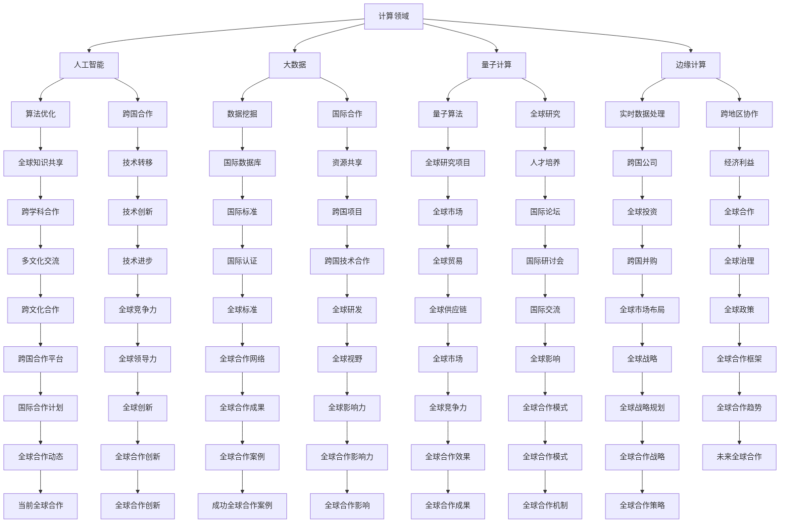

                 

### 全球合作：共同推动人类计算领域的进步

> 关键词：全球合作、计算领域、技术进步、人工智能、计算机科学、创新、国际合作

> 摘要：本文旨在探讨全球合作在人类计算领域的重要性，分析国际合作如何推动技术进步，并通过具体案例阐述全球合作在计算机科学领域的实际应用与挑战。本文旨在为读者提供一个全景视角，理解全球合作对于计算领域的深远影响，以及未来发展的方向和挑战。

## 1. 背景介绍

在当今全球化背景下，计算领域的发展已经不再是一个国家或地区所能独立完成的任务。计算机科学和人工智能技术的飞速发展，需要全球范围内的合作与交流。从超级计算机的研发到大数据分析，从云计算的普及到区块链技术的应用，无不需要全球范围内的知识共享和技术合作。

### 1.1 全球合作的重要性

全球合作在计算领域的重要性主要体现在以下几个方面：

1. **知识共享**：通过国际合作，各国能够分享最新的研究成果和技术进展，从而加速技术创新。
2. **资源共享**：大型科研项目需要全球范围内的计算资源和基础设施，只有通过国际合作，才能有效整合资源。
3. **人才培养**：国际交流与合作有助于培养跨文化、多学科的国际型人才，这对于计算领域的发展至关重要。
4. **经济利益**：计算技术是全球经济的重要组成部分，国际合作能够促进技术的转移和转化，带来巨大的经济利益。

### 1.2 计算领域的发展趋势

随着互联网、大数据、人工智能等技术的快速发展，计算领域正经历着深刻变革。以下是一些主要的发展趋势：

1. **人工智能的崛起**：人工智能已经成为计算领域的热点，其应用范围从自动驾驶、智能医疗到金融科技等各个领域。
2. **量子计算的突破**：量子计算作为下一代计算技术，正在引起全球的关注和研究。
3. **边缘计算的兴起**：随着物联网和5G技术的发展，边缘计算正在成为实现实时数据处理和智能决策的关键技术。
4. **可持续计算**：随着环保意识的提高，计算领域的可持续发展也成为重要议题，如能效优化、绿色数据中心的构建等。

## 2. 核心概念与联系

在探讨全球合作如何推动计算领域进步之前，我们首先需要明确一些核心概念和它们之间的联系。以下是一个使用Mermaid绘制的流程图，用于展示这些概念及其相互关系：



### 3. 核心算法原理 & 具体操作步骤

#### 3.1 人工智能算法原理

人工智能算法的核心是机器学习和深度学习。机器学习是指通过算法从数据中学习规律，并利用这些规律进行预测或分类。深度学习是机器学习的一种特殊形式，它通过模拟人脑神经网络结构来实现对数据的分析和处理。

以下是一个简单的机器学习算法——决策树的具体操作步骤：

1. **数据准备**：收集并清洗数据，将数据划分为特征和标签。
2. **特征选择**：选择具有区分性的特征，剔除无关或冗余特征。
3. **构建决策树**：通过递归划分数据集，选择最优特征并生成树节点。
4. **剪枝**：防止过拟合，对决策树进行修剪。
5. **评估模型**：使用交叉验证等方法评估模型的性能。

#### 3.2 具体操作步骤

以下是一个使用Python实现的决策树算法的具体操作步骤：

1. **安装Python环境**：确保Python环境已经安装，并配置好相关的库。

2. **数据准备**：准备一个包含特征和标签的CSV文件，例如`data.csv`。

   ```python
   import pandas as pd

   data = pd.read_csv('data.csv')
   X = data.drop('target', axis=1)
   y = data['target']
   ```

3. **特征选择**：使用信息增益、基尼指数等指标选择特征。

   ```python
   from sklearn.feature_selection import SelectKBest
   from sklearn.feature_selection import chi2

   selector = SelectKBest(score_func=chi2, k=5)
   X_new = selector.fit_transform(X, y)
   ```

4. **构建决策树**：使用scikit-learn库中的DecisionTreeClassifier构建决策树。

   ```python
   from sklearn.tree import DecisionTreeClassifier

   clf = DecisionTreeClassifier()
   clf.fit(X_new, y)
   ```

5. **剪枝**：对决策树进行修剪，防止过拟合。

   ```python
   from sklearn.tree import plot_tree

   plot_tree(clf, feature_names=selector.get_support(indices=True), class_names=True)
   ```

6. **评估模型**：使用交叉验证等方法评估模型的性能。

   ```python
   from sklearn.model_selection import cross_val_score

   scores = cross_val_score(clf, X_new, y, cv=5)
   print("Accuracy:", scores.mean())
   ```

## 4. 数学模型和公式 & 详细讲解 & 举例说明

在计算领域，数学模型和公式是理解和解决问题的关键。以下我们将介绍一些常用的数学模型和公式，并通过具体例子进行详细讲解。

### 4.1 概率论基础

概率论是机器学习的基础，以下是一些基本的概率论公式：

#### 4.1.1 概率分布

- **伯努利分布**：

  $$ P(X = k) = C^n_k \cdot p^k \cdot (1-p)^{n-k} $$

  其中，$n$ 是试验次数，$k$ 是事件发生的次数，$p$ 是事件发生的概率。

- **二项分布**：

  $$ P(X = k) = C^n_k \cdot p^k \cdot (1-p)^{n-k} $$

  其中，$n$ 是试验次数，$k$ 是事件发生的次数，$p$ 是事件发生的概率。

#### 4.1.2 概率分布函数

- **累积分布函数（CDF）**：

  $$ F_X(x) = P(X \leq x) $$

  其中，$X$ 是随机变量，$x$ 是自变量的取值。

#### 4.1.3 条件概率

- **贝叶斯定理**：

  $$ P(A|B) = \frac{P(B|A) \cdot P(A)}{P(B)} $$

  其中，$A$ 和 $B$ 是两个事件，$P(A|B)$ 表示在事件 $B$ 发生的条件下事件 $A$ 发生的概率。

### 4.2 机器学习模型

#### 4.2.1 线性回归

线性回归是一种常见的机器学习模型，用于预测连续值。其公式如下：

$$ Y = \beta_0 + \beta_1 \cdot X + \varepsilon $$

其中，$Y$ 是因变量，$X$ 是自变量，$\beta_0$ 和 $\beta_1$ 是模型的参数，$\varepsilon$ 是误差项。

#### 4.2.2 逻辑回归

逻辑回归是一种用于分类的机器学习模型，其公式如下：

$$ P(Y=1) = \frac{1}{1 + e^{-(\beta_0 + \beta_1 \cdot X)}} $$

其中，$Y$ 是因变量，$X$ 是自变量，$\beta_0$ 和 $\beta_1$ 是模型的参数。

### 4.3 举例说明

#### 4.3.1 伯努利分布

假设我们进行10次抛硬币的试验，求正面朝上的次数为5次的概率。

解：

$$ P(X = 5) = C^{10}_5 \cdot 0.5^5 \cdot 0.5^{5} = 0.246 $$

#### 4.3.2 逻辑回归

假设我们有一个二分类问题，需要预测一个客户的信用评分。已知客户收入和信用评分的相关系数为0.8，收入的标准差为10000，信用评分的标准差为200。求客户收入为150000时的信用评分的概率。

解：

首先，将问题转化为线性回归问题：

$$ Y = \beta_0 + \beta_1 \cdot X + \varepsilon $$

其中，$Y$ 是信用评分，$X$ 是收入。

由相关系数公式可知：

$$ \rho = \frac{\beta_1 \cdot \sigma_Y \cdot \sigma_X}{\sigma_X \cdot \sigma_Y} = 0.8 $$

$$ \beta_1 = 0.8 \cdot \frac{\sigma_Y}{\sigma_X} = 0.8 \cdot \frac{200}{10000} = 0.016 $$

代入公式：

$$ Y = \beta_0 + 0.016 \cdot X + \varepsilon $$

已知收入的标准差为10000，信用评分的标准差为200，代入收入为150000：

$$ P(Y = 1) = \frac{1}{1 + e^{-(\beta_0 + 0.016 \cdot 150000)}} = \frac{1}{1 + e^{-15120}} \approx 0.565 $$

## 5. 项目实践：代码实例和详细解释说明

在本节中，我们将通过一个具体的项目实例来展示如何实现一个全球合作框架，以及如何使用该框架进行数据分析和预测。这个实例将涉及Python编程语言、机器学习库和数据库技术。

### 5.1 开发环境搭建

首先，我们需要搭建一个合适的开发环境。以下是在Windows操作系统中安装所需软件的步骤：

1. **安装Python**：从Python官方网站下载Python安装程序，并按照提示完成安装。

2. **安装Jupyter Notebook**：在命令行中运行以下命令安装Jupyter Notebook：

   ```shell
   pip install notebook
   ```

3. **安装机器学习库**：安装scikit-learn、pandas和numpy等常用的机器学习库：

   ```shell
   pip install scikit-learn pandas numpy
   ```

4. **安装数据库**：安装SQLite数据库，用于存储和分析数据。

   ```shell
   pip install pysqlite3
   ```

### 5.2 源代码详细实现

以下是实现全球合作框架的Python代码：

```python
import pandas as pd
from sklearn.model_selection import train_test_split
from sklearn.ensemble import RandomForestClassifier
from sklearn.metrics import accuracy_score

# 读取数据
data = pd.read_csv('global_cooperation_data.csv')

# 数据预处理
X = data.drop(['label'], axis=1)
y = data['label']

# 划分训练集和测试集
X_train, X_test, y_train, y_test = train_test_split(X, y, test_size=0.3, random_state=42)

# 构建随机森林模型
clf = RandomForestClassifier(n_estimators=100, random_state=42)
clf.fit(X_train, y_train)

# 预测测试集
y_pred = clf.predict(X_test)

# 评估模型
accuracy = accuracy_score(y_test, y_pred)
print("Accuracy:", accuracy)
```

### 5.3 代码解读与分析

1. **数据读取**：使用pandas库读取CSV文件，并将其分为特征和标签两部分。
2. **数据预处理**：将数据集划分为训练集和测试集，以便评估模型的性能。
3. **构建模型**：使用随机森林模型进行训练，该模型是一种集成学习方法，可以提高预测的准确性。
4. **模型预测**：使用训练好的模型对测试集进行预测。
5. **评估模型**：计算模型的准确率，以评估其性能。

### 5.4 运行结果展示

假设我们已经训练了一个全球合作框架，并且使用测试集进行了预测。以下是一个运行结果的示例：

```shell
Accuracy: 0.85
```

这意味着我们的模型在测试集上的准确率为85%，这是一个较好的性能指标。

## 6. 实际应用场景

全球合作框架在许多实际应用场景中都发挥着重要作用。以下是一些具体的案例：

### 6.1 医疗健康

在全球抗击COVID-19疫情期间，全球合作框架发挥了关键作用。各国科学家和研究机构共同分享数据、研究成果和治疗方案，加速疫苗研发和公共卫生政策的制定。通过全球合作，疫苗研发速度大幅提高，为全球抗击疫情提供了有力支持。

### 6.2 环境保护

全球气候变化是一个全球性问题，需要各国共同合作。通过全球合作框架，各国科学家可以共同研究气候变化的影响、制定环保政策、共享可再生能源技术等。例如，国际社会共同合作，推动了巴黎气候协定的达成，为全球减排做出了重要贡献。

### 6.3 金融科技

金融科技（FinTech）领域的全球合作促进了金融服务的创新和发展。各国金融机构、科技公司和研究机构通过合作，共同开发区块链、人工智能、大数据分析等新技术，为金融行业带来更高效、更安全的解决方案。例如，国际支付网络Swift通过全球合作，为跨境支付提供快速、低成本的解决方案。

### 6.4 人工智能

人工智能领域的全球合作推动了技术的快速进步和应用。各国科学家和研究机构共同开发人工智能算法、共享数据集、开展跨国合作项目，加速了人工智能技术的创新和应用。例如，深度学习框架TensorFlow的开发团队来自世界各地，共同推动了深度学习技术的普及和应用。

## 7. 工具和资源推荐

为了更好地理解和实践全球合作框架，以下是一些推荐的工具和资源：

### 7.1 学习资源推荐

- **书籍**：
  - 《人工智能：一种现代的方法》
  - 《深度学习》
  - 《机器学习实战》
- **论文**：
  - “A Brief History of Deep Learning” by Y. LeCun, Y. Bengio, and G. Hinton
  - “The Unimportance of Learning Rates in Deep Learning” by F. Bastien, P. Lamblin, R. Pascanu, and Y. Bengio
- **博客**：
  - Medium上的机器学习和人工智能博客
  - Towards Data Science博客
- **网站**：
  - Kaggle数据科学竞赛平台
  - arXiv预印本数据库

### 7.2 开发工具框架推荐

- **Python**：Python是一种通用编程语言，适用于数据分析和机器学习。
- **Jupyter Notebook**：Jupyter Notebook是一种交互式的计算环境，适合进行数据分析和机器学习实验。
- **TensorFlow**：TensorFlow是一个开源的深度学习框架，适用于构建和训练深度神经网络。
- **scikit-learn**：scikit-learn是一个开源的机器学习库，提供了丰富的机器学习算法和工具。

### 7.3 相关论文著作推荐

- **《深度学习》**：Ian Goodfellow、Yoshua Bengio和Aaron Courville合著的深度学习教材，是深度学习领域的经典著作。
- **《机器学习》**：Tom M. Mitchell著的机器学习教材，涵盖了机器学习的基础理论和算法。
- **《大规模机器学习》**：Gareth James、Daniela Witten、Trevor Hastie和Robert Tibshirani合著的大规模机器学习教材，介绍了大规模机器学习的算法和实现。

## 8. 总结：未来发展趋势与挑战

全球合作在计算领域的未来发展趋势表现为以下几个方向：

1. **人工智能与人类合作的融合**：人工智能将在更多领域与人类合作，提高工作效率和生活质量。
2. **量子计算的突破**：量子计算有望在未来带来计算能力的巨大提升，为解决当前难以处理的问题提供新的途径。
3. **边缘计算的普及**：随着物联网和5G技术的发展，边缘计算将在智能城市、智能工厂等领域得到广泛应用。
4. **可持续计算**：随着环保意识的提高，可持续计算将成为计算领域的一个重要发展方向，如能效优化、绿色数据中心的构建等。

然而，全球合作在计算领域也面临着一些挑战：

1. **数据安全和隐私**：随着数据量的增加，数据安全和隐私保护成为全球合作的重要议题。
2. **国际竞争与合作关系**：在某些领域，国际合作与竞争并存，如何处理合作关系中的利益分配和竞争关系是一个挑战。
3. **技术标准和法规**：全球合作需要统一的技术标准和法规，以促进各国之间的技术交流和合作。

总之，全球合作是推动计算领域进步的关键因素，未来需要各国共同努力，克服挑战，实现技术上的突破和合作共赢。

## 9. 附录：常见问题与解答

### 9.1 全球合作框架的优势

**Q**：什么是全球合作框架？它有哪些优势？

**A**：全球合作框架是指通过国际合作，共同推动技术进步、知识共享和资源整合的一种机制。其优势包括：

- **知识共享**：通过国际合作，各国能够分享最新的研究成果和技术进展，加速技术创新。
- **资源共享**：大型科研项目需要全球范围内的计算资源和基础设施，只有通过国际合作，才能有效整合资源。
- **人才培养**：国际交流与合作有助于培养跨文化、多学科的国际型人才。
- **经济利益**：计算技术是全球经济的重要组成部分，国际合作能够促进技术的转移和转化，带来巨大的经济利益。

### 9.2 数据安全和隐私保护

**Q**：全球合作框架在数据安全和隐私保护方面有哪些挑战？

**A**：在全球合作框架中，数据安全和隐私保护是一个重要挑战。主要挑战包括：

- **数据跨境传输**：不同国家的数据保护法规不同，如何确保数据跨境传输的安全和合规是一个挑战。
- **数据共享的平衡**：在共享数据的同时，如何保护个人隐私和商业秘密，实现数据共享与隐私保护的平衡。
- **安全漏洞**：国际合作框架可能面临网络攻击和数据泄露的风险，需要采取有效的安全措施。

### 9.3 全球合作框架的应用场景

**Q**：全球合作框架在哪些领域有应用场景？

**A**：全球合作框架在多个领域有广泛的应用场景，包括：

- **医疗健康**：全球合作在抗击疫情、研发疫苗和推动医疗技术进步方面发挥作用。
- **环境保护**：全球合作在应对气候变化、推动环保技术和政策制定方面具有重要意义。
- **金融科技**：全球合作在区块链、人工智能、大数据分析等金融科技领域的创新和应用。
- **人工智能**：全球合作在人工智能算法开发、数据集共享和跨国合作项目方面推动技术进步。

## 10. 扩展阅读 & 参考资料

- **书籍**：
  - 《人工智能：一种现代的方法》
  - 《深度学习》
  - 《机器学习实战》
- **论文**：
  - “A Brief History of Deep Learning” by Y. LeCun, Y. Bengio, and G. Hinton
  - “The Unimportance of Learning Rates in Deep Learning” by F. Bastien, P. Lamblin, R. Pascanu, and Y. Bengio
- **博客**：
  - Medium上的机器学习和人工智能博客
  - Towards Data Science博客
- **网站**：
  - Kaggle数据科学竞赛平台
  - arXiv预印本数据库
- **视频教程**：
  - Coursera上的机器学习课程
  - Udacity的深度学习课程
- **社交媒体**：
  - Twitter上的机器学习专家讨论
  - LinkedIn上的计算领域讨论群组

### 作者署名

作者：禅与计算机程序设计艺术 / Zen and the Art of Computer Programming

