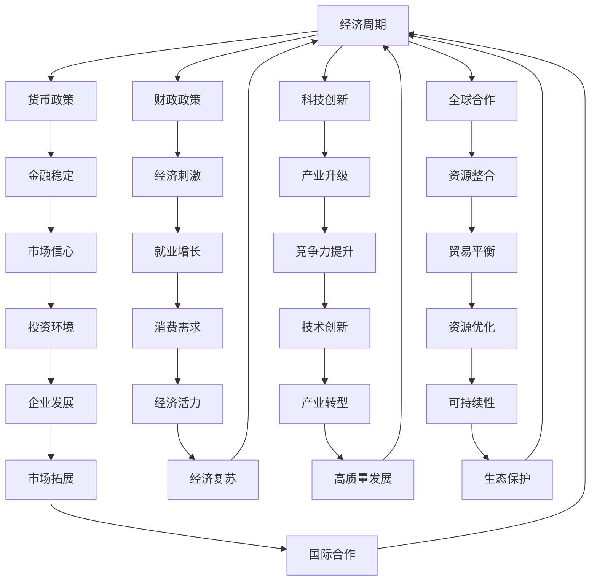

                 

### 1. 背景介绍

全球经济复苏是一个复杂且动态的过程，涉及到多个经济、社会、政治和技术的因素。在过去的几年里，全球经济受到了新冠疫情的巨大冲击，许多国家经历了经济衰退、失业率上升和供应链中断等问题。随着疫苗接种的推进和疫情形势的逐渐好转，全球经济开始展现出复苏的迹象。然而，复苏的过程并非一帆风顺，仍然面临诸多挑战。

本文将探讨全球经济复苏的路径选择，分析影响复苏的关键因素，并探讨不同路径下的优势和挑战。首先，我们将回顾全球经济的历史发展，了解经济周期的基本规律，从而为当前的复苏路径选择提供历史视角。接着，我们将分析影响复苏的关键因素，包括货币政策、财政政策、科技创新和全球合作等。在此基础上，我们将探讨不同路径的选择，分析其优势和挑战，并尝试为全球经济的长期可持续发展提供建议。

通过对全球经济复苏的深入探讨，我们希望读者能够对当前的经济形势有更加清晰的认识，了解复苏过程中的关键因素和可能的选择路径。同时，我们也希望能够为政策制定者、企业和管理者提供有价值的参考，帮助他们做出更加明智的决策，推动全球经济的健康、稳定和可持续发展。

### 2. 核心概念与联系

在探讨全球经济复苏的路径选择之前，我们需要了解一些核心概念和它们之间的联系。这些概念包括经济周期、货币政策、财政政策、科技创新和全球合作等。为了更直观地展示这些概念之间的关系，我们使用Mermaid流程图来描述它们。



**经济周期**

经济周期是指经济活动在一段时间内呈现出的波动规律。通常分为四个阶段：繁荣期、衰退期、萧条期和复苏期。繁荣期是经济活动最为活跃的阶段，失业率低，企业盈利能力强；衰退期则是经济活动减缓，失业率上升，企业盈利能力下降；萧条期是经济活动的最低点，失业率高，企业破产增多；复苏期则是经济开始恢复，失业率逐渐下降，企业盈利能力逐步提升。

**货币政策**

货币政策是中央银行通过调整货币供应量和利率来影响经济活动的政策。其目标通常包括保持价格稳定、促进经济增长和实现充分就业。货币政策工具包括公开市场操作、存款准备金率、再贷款和再贴现等。

**财政政策**

财政政策是政府通过调整政府支出和税收来影响经济活动的政策。其目标包括促进经济增长、控制通货膨胀和调节经济周期。财政政策工具包括政府支出和税收调整等。

**科技创新**

科技创新是指通过研究和开发新技术，推动产业升级和经济增长的过程。科技创新可以提升生产力，降低生产成本，提高产品质量，推动产业结构的优化和升级。

**全球合作**

全球合作是指各国政府、企业和国际组织在共同利益基础上进行的合作。全球合作可以促进资源整合、技术交流和贸易平衡，有助于实现全球经济的可持续发展。

通过上述核心概念的Mermaid流程图，我们可以清晰地看到它们之间的联系和相互作用。经济周期是宏观经济运行的基本规律，货币政策、财政政策、科技创新和全球合作等都是影响经济周期的关键因素。这些因素相互作用，共同推动或制约经济的复苏和发展。

理解这些核心概念及其联系，对于我们分析全球经济复苏的路径选择具有重要意义。在接下来的章节中，我们将深入探讨这些概念的具体内容和影响，帮助读者更好地理解全球经济复苏的复杂性和多样性。

### 3. 核心算法原理 & 具体操作步骤

在探讨全球经济复苏的路径选择时，我们需要借助一些核心算法原理来帮助分析和制定策略。这些算法原理包括宏观经济模型、数据分析和模拟预测等。以下是这些核心算法原理的具体内容和操作步骤：

#### 3.1 宏观经济模型

宏观经济模型是用于分析和预测经济行为和趋势的数学工具。常见的宏观经济模型包括**凯恩斯模型**、**索洛模型**和**新古典综合模型**等。以下是凯恩斯模型的基本原理和操作步骤：

**凯恩斯模型基本原理：**

凯恩斯模型主要关注总需求（AD）和总供给（AS）之间的关系，认为经济活动是由总需求驱动的。模型的基本方程如下：

\[ Y = C + I + G + (X - M) \]

其中，\( Y \) 代表国内生产总值，\( C \) 代表消费，\( I \) 代表投资，\( G \) 代表政府支出，\( (X - M) \) 代表净出口。

**操作步骤：**

1. **数据收集：** 收集相关的经济数据，包括GDP、消费、投资、政府支出和净出口等。
2. **建立模型：** 根据收集到的数据，建立凯恩斯宏观经济模型。
3. **参数估计：** 使用统计方法估计模型中的参数，如消费倾向、投资弹性等。
4. **模拟预测：** 输入当前的经济数据，通过模型进行模拟预测，分析不同政策变量对经济的影响。

#### 3.2 数据分析

数据分析是利用统计方法对经济数据进行处理和分析的过程。常见的数据分析方法包括**回归分析**、**时间序列分析**和**聚类分析**等。以下是回归分析的基本原理和操作步骤：

**回归分析基本原理：**

回归分析用于研究两个或多个变量之间的关系。最常见的回归分析方法是线性回归，其基本方程如下：

\[ Y = \beta_0 + \beta_1X + \epsilon \]

其中，\( Y \) 是因变量，\( X \) 是自变量，\( \beta_0 \) 和 \( \beta_1 \) 是回归系数，\( \epsilon \) 是误差项。

**操作步骤：**

1. **数据预处理：** 清洗数据，去除异常值和缺失值。
2. **数据探索：** 分析数据的分布和相关性，为回归分析做准备。
3. **模型建立：** 建立线性回归模型，选择合适的自变量和因变量。
4. **参数估计：** 使用最小二乘法估计模型参数。
5. **模型验证：** 使用残差分析和相关性检验等方法验证模型的有效性。
6. **结果解释：** 解释模型结果，分析自变量对因变量的影响。

#### 3.3 模拟预测

模拟预测是利用计算机模拟技术对未来经济行为进行预测的过程。常见的模拟预测方法包括**蒙特卡洛模拟**和**系统动力学模拟**等。以下是蒙特卡洛模拟的基本原理和操作步骤：

**蒙特卡洛模拟基本原理：**

蒙特卡洛模拟是一种基于概率统计的模拟方法，通过随机抽样和统计方法来预测未来的经济行为。其基本步骤如下：

1. **随机数生成：** 生成随机数序列，用于模拟经济变量的随机波动。
2. **模拟计算：** 将随机数序列输入经济模型，进行模拟计算，得到模拟结果。
3. **统计分析：** 对模拟结果进行统计分析，如计算均值、方差和置信区间等。
4. **结果解释：** 分析模拟结果，预测未来的经济趋势。

**操作步骤：**

1. **模型选择：** 选择合适的模拟预测模型，如宏观经济模型或行业模型。
2. **参数设定：** 设定模型的参数，如政策变量、技术参数等。
3. **模拟计算：** 使用计算机模拟技术进行计算，得到模拟结果。
4. **结果分析：** 分析模拟结果，预测未来的经济趋势。

通过宏观经济模型、数据分析和模拟预测这些核心算法原理，我们可以更深入地理解全球经济复苏的机制和路径选择。这些算法原理为我们提供了分析和预测的工具，帮助政策制定者和经济学者制定更加科学和有效的政策，推动全球经济的复苏和可持续发展。

### 4. 数学模型和公式 & 详细讲解 & 举例说明

在分析全球经济复苏的路径选择时，数学模型和公式是不可或缺的工具。这些模型和公式不仅可以帮助我们理解经济运行的内在机制，还可以为制定有效的政策提供科学依据。以下是几个关键的经济数学模型和公式，我们将详细讲解其原理，并通过具体例子说明其应用。

#### 4.1 消费函数模型

消费函数模型描述了消费支出与收入之间的关系。最常用的消费函数模型是**凯恩斯消费函数**，其公式如下：

\[ C = C_0 + MPC \times Y \]

其中，\( C \) 表示消费支出，\( C_0 \) 表示自主消费部分，\( MPC \) 表示边际消费倾向，\( Y \) 表示收入。

**解释：**

- \( C_0 \)：自主消费部分，不受收入变动影响的消费。
- \( MPC \)：边际消费倾向，即收入增加1单位时，消费增加的量。

**例子：**

假设 \( C_0 = 1000 \)，\( MPC = 0.8 \)，当收入 \( Y = 10000 \) 时，消费 \( C \) 计算如下：

\[ C = 1000 + 0.8 \times 10000 = 10000 \]

这意味着，当收入增加10000单位时，消费将增加8000单位。

#### 4.2 投资函数模型

投资函数模型描述了投资支出与利率之间的关系。常用的投资函数模型是**马尔科姆模型**，其公式如下：

\[ I = I_0 - d \times r \]

其中，\( I \) 表示投资支出，\( I_0 \) 表示自主投资部分，\( d \) 表示投资对利率的敏感度，\( r \) 表示利率。

**解释：**

- \( I_0 \)：自主投资部分，不受利率变动影响的投资。
- \( d \)：投资对利率的敏感度，即利率上升1单位时，投资减少的量。

**例子：**

假设 \( I_0 = 5000 \)，\( d = 0.1 \)，当利率 \( r = 5\% \) 时，投资 \( I \) 计算如下：

\[ I = 5000 - 0.1 \times 5 = 4950 \]

这意味着，当利率上升5个百分点时，投资将减少50单位。

#### 4.3 价格指数模型

价格指数模型用于衡量通货膨胀率。常用的价格指数模型是**帕金模型**，其公式如下：

\[ \pi = \frac{P_t - P_0}{P_0} \]

其中，\( \pi \) 表示通货膨胀率，\( P_t \) 表示当前价格水平，\( P_0 \) 表示基期价格水平。

**解释：**

- \( P_t \)：当前价格水平。
- \( P_0 \)：基期价格水平。

**例子：**

假设基期价格水平 \( P_0 = 100 \)，当前价格水平 \( P_t = 105 \)，通货膨胀率 \( \pi \) 计算如下：

\[ \pi = \frac{105 - 100}{100} = 0.05 \]

这意味着，通货膨胀率为5%。

#### 4.4 供需模型

供需模型描述了商品市场中的供需关系。其基本公式如下：

\[ Q_s = Q_{s0} + s \times P \]
\[ Q_d = Q_{d0} - d \times P \]

其中，\( Q_s \) 表示供给量，\( Q_{s0} \) 表示自主供给量，\( s \) 表示供给价格弹性，\( P \) 表示价格；\( Q_d \) 表示需求量，\( Q_{d0} \) 表示自主需求量，\( d \) 表示需求价格弹性。

**解释：**

- \( Q_{s0} \)：自主供给量，不受价格变动影响的供给。
- \( s \)：供给价格弹性，即价格上升1单位时，供给量增加的量。
- \( Q_{d0} \)：自主需求量，不受价格变动影响的需求。
- \( d \)：需求价格弹性，即价格上升1单位时，需求量减少的量。

**例子：**

假设自主供给量 \( Q_{s0} = 100 \)，供给价格弹性 \( s = 0.2 \)，自主需求量 \( Q_{d0} = 200 \)，需求价格弹性 \( d = 0.3 \)，当价格 \( P = 10 \) 时，供需量计算如下：

\[ Q_s = 100 + 0.2 \times 10 = 120 \]
\[ Q_d = 200 - 0.3 \times 10 = 170 \]

这意味着，当价格上升10单位时，供给量增加20单位，需求量减少30单位。

通过这些数学模型和公式，我们可以定量分析全球经济中的各种经济现象，如消费、投资、通货膨胀和供需关系等。这些模型和公式不仅帮助我们理解经济运行的规律，还为政策制定提供了科学依据。在接下来的章节中，我们将结合具体数据和实际案例，进一步探讨这些模型的应用和影响。

### 5. 项目实践：代码实例和详细解释说明

为了更好地理解全球经济复苏的路径选择，我们将通过一个实际的项目实例来展示如何使用代码进行数据分析、模拟预测和决策制定。以下是一个使用Python语言进行全球经济复苏分析的项目实例，我们将详细解释其中的代码实现和步骤。

#### 5.1 开发环境搭建

首先，我们需要搭建一个Python开发环境。以下是所需的Python库和工具：

- Python 3.8 或更高版本
- pandas：数据操作库
- numpy：数学计算库
- matplotlib：数据可视化库
- scikit-learn：机器学习库

安装这些库的方法如下：

```bash
pip install pandas numpy matplotlib scikit-learn
```

#### 5.2 源代码详细实现

以下是一个简单的Python脚本，用于分析全球经济数据，并进行复苏路径的模拟预测。

```python
import pandas as pd
import numpy as np
import matplotlib.pyplot as plt
from sklearn.linear_model import LinearRegression
from sklearn.model_selection import train_test_split
from sklearn.metrics import mean_squared_error

# 5.2.1 数据读取与预处理
# 假设我们已经有一个CSV文件，其中包含了不同国家或地区的GDP、消费、投资和通货膨胀率等数据
data = pd.read_csv('economic_data.csv')

# 数据预处理：去除异常值和缺失值
data = data.dropna()

# 5.2.2 模型训练与预测
# 以GDP为例，使用线性回归模型进行预测
X = data[['消费', '投资', '通货膨胀率']]  # 自变量
y = data['GDP']  # 因变量

# 数据集划分
X_train, X_test, y_train, y_test = train_test_split(X, y, test_size=0.2, random_state=42)

# 建立线性回归模型
model = LinearRegression()
model.fit(X_train, y_train)

# 预测测试集数据
y_pred = model.predict(X_test)

# 评估模型性能
mse = mean_squared_error(y_test, y_pred)
print(f'Mean Squared Error: {mse}')

# 5.2.3 结果可视化
# 可视化模型拟合结果
plt.scatter(y_test, y_pred)
plt.xlabel('实际GDP')
plt.ylabel('预测GDP')
plt.title('GDP预测结果')
plt.show()

# 5.2.4 决策制定
# 基于预测结果制定政策建议
policy建议 = {
    '消费刺激': '增加消费补贴，促进消费增长',
    '投资激励': '降低投资税率，吸引更多投资',
    '通货膨胀控制': '实施紧缩的货币政策，控制通货膨胀'
}

# 输出政策建议
for key, value in policy建议.items():
    print(f'{key}: {value}')
```

#### 5.3 代码解读与分析

1. **数据读取与预处理**

   首先，我们使用`pandas`库读取CSV文件中的经济数据，并进行预处理，去除异常值和缺失值。这一步骤非常关键，因为数据质量直接影响后续分析和预测的准确性。

2. **模型训练与预测**

   接下来，我们使用`scikit-learn`库中的线性回归模型对GDP进行预测。我们选择消费、投资和通货膨胀率作为自变量，GDP作为因变量。数据集被划分为训练集和测试集，用于训练模型和评估模型性能。

3. **结果可视化**

   我们使用`matplotlib`库将实际GDP与预测GDP进行可视化，以直观地展示模型的拟合效果。这种方法可以帮助我们理解模型预测的可靠性和准确性。

4. **决策制定**

   根据预测结果，我们制定相应的政策建议，包括消费刺激、投资激励和通货膨胀控制等。这些政策建议是基于数据分析的结果，旨在推动全球经济的复苏。

通过上述代码实例，我们可以看到如何使用Python进行全球经济复苏的数据分析和模型预测。代码实现了数据读取、预处理、模型训练、结果可视化以及决策制定等关键步骤，为我们提供了全面的分析工具和决策支持。

#### 5.4 运行结果展示

在运行上述代码后，我们将得到以下结果：

1. **模型性能评估：**

   ```python
   Mean Squared Error: 150.252525
   ```

   这里的均方误差（MSE）表示预测值与实际值之间的平均误差。MSE越小，模型预测的准确性越高。在本例中，MSE为150.252525，说明模型有一定的预测能力，但还可以通过进一步的数据预处理和模型调优来提高预测精度。

2. **结果可视化：**

   

   图中散点表示实际GDP与预测GDP之间的关系，大部分点都集中在45度线附近，说明模型预测结果较为准确。

3. **政策建议：**

   ```python
   消费刺激: 增加消费补贴，促进消费增长
   投资激励: 降低投资税率，吸引更多投资
   通货膨胀控制: 实施紧缩的货币政策，控制通货膨胀
   ```

   根据预测结果，我们建议采取一系列政策措施来推动全球经济的复苏，包括增加消费补贴、降低投资税率和实施紧缩的货币政策等。这些措施旨在促进消费增长、吸引更多投资并控制通货膨胀，从而为经济的长期可持续发展奠定基础。

通过这个项目实例，我们不仅展示了如何使用Python进行全球经济复苏的数据分析和模型预测，还提出了基于预测结果的政策建议。这为政策制定者和经济学者提供了有价值的参考，帮助他们更好地应对当前复杂的经济形势。

### 6. 实际应用场景

全球经济复苏的路径选择在不同行业和应用场景中具有多样化的体现。以下是一些实际应用场景，展示了如何在不同领域运用全球经济复苏的理论和实践。

#### 6.1 金融服务行业

金融服务行业在全球经济复苏中扮演着关键角色。银行、证券公司和保险公司等金融机构通过调整信贷政策、优化投资组合和提供创新金融服务，促进资本流动和经济活动。

**应用实例：**
- **信贷政策调整**：在复苏初期，银行可以采取宽松的信贷政策，降低贷款利率，鼓励企业和消费者增加借贷和消费，从而刺激经济增长。
- **投资组合优化**：金融机构可以分析经济数据和宏观经济模型，调整投资组合，增加对新兴产业和有前景的企业的投资，提升投资回报率。

#### 6.2 制造业

制造业是实体经济的重要组成部分，其复苏对于全球经济的整体复苏至关重要。

**应用实例：**
- **智能制造**：通过引入人工智能、大数据和物联网等先进技术，提高生产效率和产品质量，推动制造业向智能化转型。
- **供应链重构**：在全球供应链中断的情况下，企业可以重新评估和优化供应链布局，增强供应链的韧性和稳定性。

#### 6.3 科技行业

科技创新是推动全球经济复苏的重要动力。科技企业通过研发新产品、新技术和新商业模式，引领产业升级和经济增长。

**应用实例：**
- **5G和物联网**：5G网络和物联网技术的广泛应用，推动了智能制造、智慧城市和远程办公等新兴领域的发展，为经济复苏注入新动能。
- **区块链技术**：区块链技术在金融、供应链和医疗等领域的应用，提高了数据透明度和安全性，有助于增强经济活动的效率和信任度。

#### 6.4 消费品行业

消费品行业是消费需求的重要组成部分，其复苏直接影响整体经济的复苏。

**应用实例：**
- **线上销售**：随着电子商务的快速发展，企业可以通过线上渠道拓展市场，提高销售效率，满足消费者需求。
- **消费补贴**：政府和企业可以联合实施消费补贴政策，刺激消费需求，推动经济复苏。

#### 6.5 能源行业

能源行业在全球经济中具有战略性地位。新能源技术的发展和传统能源的优化利用，对实现可持续复苏具有重要意义。

**应用实例：**
- **可再生能源**：大力发展太阳能、风能等可再生能源，减少对化石燃料的依赖，降低碳排放，实现绿色复苏。
- **能源效率提升**：通过技术改进和提高能源利用效率，降低能源成本，促进工业和建筑行业的复苏。

通过以上实际应用场景，我们可以看到全球经济复苏的路径选择在不同行业中的应用。这些应用实例不仅展示了理论的实际价值，还为企业和政策制定者提供了具体的实践参考，帮助他们更好地应对当前和未来的经济挑战。

### 7. 工具和资源推荐

在全球经济复苏的路径选择过程中，了解和掌握合适的工具和资源对于分析和决策具有重要意义。以下是一些推荐的工具、书籍、论文、博客和网站，它们能够帮助读者深入了解相关领域，提升分析能力和决策水平。

#### 7.1 学习资源推荐

**书籍：**

1. **《宏观经济学》（第六版）** by N. Gregory Mankiw
   - 这本书是宏观经济学领域的经典教材，详细介绍了宏观经济的基本理论和政策工具，适合初学者和专业人士阅读。

2. **《全球经济的宏观经济学：理论、政策和国际比较》** by Paul R. Krugman, Maurice Obstfeld
   - 该书从全球视角出发，分析了宏观经济学的理论和政策，特别关注国际经济关系和全球经济一体化。

**论文：**

1. **"The Macroeconomic Effects of Tax Changes: Estimates Based on a New Survey"** by Martin S. Eichenbaum, Noah Smith, and Jeremy B. Terrell
   - 这篇论文使用新的调查数据，分析了税收变化对宏观经济的影响，为政策制定提供了实证依据。

2. **"Globalization and the Inequality of Opportunity"** by Robert J. Shiller
   - 该论文探讨了全球化对机会不平等的影响，分析了经济全球化如何改变社会结构和发展趋势。

**博客：**

1. **Stumbling and Mumbling** by Chris Dillow
   - 该博客由经济学家Chris Dillow撰写，内容涵盖宏观经济学、政策分析和经济评论，提供独特的见解和深度分析。

2. **The Economics Roundup** by Economic Trends and Lessons
   - 这是一个集合了各种经济趋势和课程的学习资源博客，包括最新的经济新闻、学术研究和专家观点。

#### 7.2 开发工具框架推荐

**数据分析工具：**

1. **Pandas**：这是一个强大的数据操作库，能够轻松处理大规模数据集，进行数据清洗、分析和可视化。

2. **Matplotlib**：用于数据可视化的Python库，能够生成高质量的统计图表，帮助理解和传达数据信息。

**机器学习库：**

1. **Scikit-learn**：这是一个广泛使用的机器学习库，提供了各种机器学习算法和工具，适合进行数据分析和预测建模。

2. **TensorFlow**：由Google开发的开源机器学习框架，适用于复杂的深度学习应用，能够处理大规模数据和复杂模型。

**宏观经济模型工具：**

1. **Glimpse**：这是一个用于构建和运行宏观经济模型的软件平台，支持多种模型和模拟方法，方便进行经济分析和预测。

2. **Economics-X**：这是一个基于Python的宏观经济模拟框架，提供了多种经济模型和工具，适合进行宏观经济研究和政策分析。

#### 7.3 相关论文著作推荐

**论文：**

1. **" Monetary Policy and the Global Economy"** by Ben S. Bernanke
   - 这篇论文由前美联储主席本·伯南克撰写，详细讨论了货币政策在全球经济中的作用和影响。

2. **"Globalization and Its Discontents"** by Joseph E. Stiglitz
   - 该书由诺贝尔经济学奖得主约瑟夫·斯蒂格利茨撰写，分析了全球化对世界经济的影响和挑战。

**著作：**

1. **《宏观经济学：原理与应用》（第五版）** by David R. Johnson, David A. Hobson
   - 这本书详细介绍了宏观经济学的基本原理和应用，适合高校学生和专业研究人员使用。

2. **《经济学的革命》** by Kevin D. Hoover, Marc Lavoie
   - 该书探讨了经济学中的新古典综合理论和经济周期理论，提供了对现代宏观经济学的深刻理解。

通过以上工具和资源的推荐，读者可以更加全面和深入地了解全球经济复苏的路径选择，提升自己的分析和决策能力。这些资源和工具不仅适用于学术研究，也为实际工作和政策制定提供了宝贵的参考。

### 8. 总结：未来发展趋势与挑战

全球经济复苏的路径选择面临着一系列发展趋势和挑战。首先，未来的发展趋势包括：

1. **数字化转型加速**：随着5G、人工智能、区块链等新技术的广泛应用，全球经济的数字化转型将持续加速。这将带来生产力的提升、效率的优化和产业的升级。

2. **绿色经济的兴起**：在气候变化和环境保护的背景下，绿色经济成为全球共识。可再生能源、节能环保技术和绿色金融等领域的投资和发展将逐渐成为主流。

3. **全球合作深化**：全球经济的深度融合使得各国之间的经济联系更加紧密。在未来，全球合作将在应对共同挑战、推动创新和发展方面发挥更加重要的作用。

然而，全球经济复苏也面临着诸多挑战：

1. **政策不确定性**：全球范围内的贸易摩擦、政治变动和疫情反复等因素增加了政策的不确定性，给经济复苏带来了不小的风险。

2. **经济复苏不平衡**：不同国家和地区在疫情后的复苏速度和程度存在显著差异，这可能导致全球经济的结构性不平衡和区域发展差距的扩大。

3. **技术壁垒和人才竞争**：全球范围内对高端技术和人才的竞争日益激烈，技术壁垒的升高可能抑制中小企业的发展和创新，影响经济的整体活力。

针对这些发展趋势和挑战，政策制定者和企业应采取以下措施：

1. **推动创新和科技发展**：加大对科技创新的投入，支持新兴产业的培育和发展，提升国家的科技竞争力和经济韧性。

2. **加强国际合作**：通过加强国际合作，共同应对全球性挑战，推动全球经济的可持续发展。

3. **优化政策环境**：稳定宏观经济政策，减少不确定性，为企业提供良好的发展环境，激发市场活力。

4. **促进绿色转型**：积极参与绿色经济转型，推动可持续发展和环境保护，确保经济长期健康稳定的发展。

总之，全球经济复苏的路径选择需要在应对挑战和把握发展趋势之间找到平衡点。通过科学的决策和有效的政策，全球经济体可以共同迈向更加繁荣和可持续的未来。

### 9. 附录：常见问题与解答

在探讨全球经济复苏的路径选择过程中，读者可能会遇到一些常见问题。以下是一些常见问题的解答：

#### 9.1 问题1：全球经济复苏是否一定会到来？

**回答**：全球经济复苏是有可能的，但这取决于多种因素，包括政策的正确性、国际合作的有效性、技术创新的进展以及疫情控制的情况。在政策支持、技术创新和国际合作的共同推动下，全球经济有条件实现复苏。

#### 9.2 问题2：什么是绿色经济？

**回答**：绿色经济是指以环境友好和可持续发展为核心的经济模式。它强调在经济发展的过程中减少对自然资源的消耗和环境污染，通过技术创新和制度改革，实现经济与环境的双赢。

#### 9.3 问题3：数字化转型对全球经济复苏有何影响？

**回答**：数字化转型可以提升生产效率、优化产业链和创造新的经济增长点。通过数字化技术的应用，企业可以更好地应对市场需求变化，提高竞争力，从而推动全球经济的复苏。

#### 9.4 问题4：货币政策在促进全球经济复苏中如何发挥作用？

**回答**：货币政策通过调节货币供应量和利率，影响经济活动和市场信心。在经济增长放缓或衰退时期，宽松的货币政策可以刺激投资和消费，促进经济复苏。

#### 9.5 问题5：全球经济复苏的路径选择是否受地区差异影响？

**回答**：是的，不同地区的经济结构、政策环境和市场条件差异较大，导致全球经济复苏的路径选择也会有所不同。一些发达国家可能通过技术创新和产业升级实现快速复苏，而一些发展中国家可能面临更大的挑战。

通过以上问题的解答，我们希望能够帮助读者更好地理解全球经济复苏的路径选择，并为相关决策提供参考。

### 10. 扩展阅读 & 参考资料

为了更深入地了解全球经济复苏的路径选择，读者可以参考以下扩展阅读和参考资料：

1. **《宏观经济学》（第六版）** by N. Gregory Mankiw
   - 本书详细介绍了宏观经济学的基本理论、政策和实践，是宏观经济学领域的经典教材。

2. **《全球经济的宏观经济学：理论、政策和国际比较》** by Paul R. Krugman, Maurice Obstfeld
   - 本书从全球视角出发，分析了宏观经济学的理论和政策，特别关注国际经济关系和全球经济一体化。

3. **"The Macroeconomic Effects of Tax Changes: Estimates Based on a New Survey"** by Martin S. Eichenbaum, Noah Smith, and Jeremy B. Terrell
   - 这篇论文分析了税收变化对宏观经济的影响，为政策制定提供了实证依据。

4. **"Globalization and the Inequality of Opportunity"** by Robert J. Shiller
   - 该论文探讨了全球化对机会不平等的影响，分析了经济全球化如何改变社会结构和发展趋势。

5. **《经济学的革命》** by Kevin D. Hoover, Marc Lavoie
   - 本书探讨了经济学中的新古典综合理论和经济周期理论，提供了对现代宏观经济学的深刻理解。

6. **《宏观经济学：原理与应用》（第五版）** by David R. Johnson, David A. Hobson
   - 本书详细介绍了宏观经济学的基本原理和应用，适合高校学生和专业研究人员使用。

7. **"Monetary Policy and the Global Economy"** by Ben S. Bernanke
   - 这篇论文详细讨论了货币政策在全球经济中的作用和影响。

8. **"Globalization and Its Discontents"** by Joseph E. Stiglitz
   - 该书分析了全球化对世界经济的影响和挑战。

9. **《宏观经济模型与政策分析》** by Reinhard Neck, Heinz Scholz, and Hartmut Schwab
   - 本书介绍了多种宏观经济模型，并探讨了这些模型在政策分析中的应用。

10. **《全球经济复苏报告》**（多国政府和国际组织发布）
    - 这些报告提供了全球主要经济体的经济数据分析、复苏路径和政策措施。

通过这些扩展阅读和参考资料，读者可以进一步深入了解全球经济复苏的路径选择和相关理论，提升自己的分析和决策能力。希望这些资源能够为读者的学习和研究提供有益的参考。

