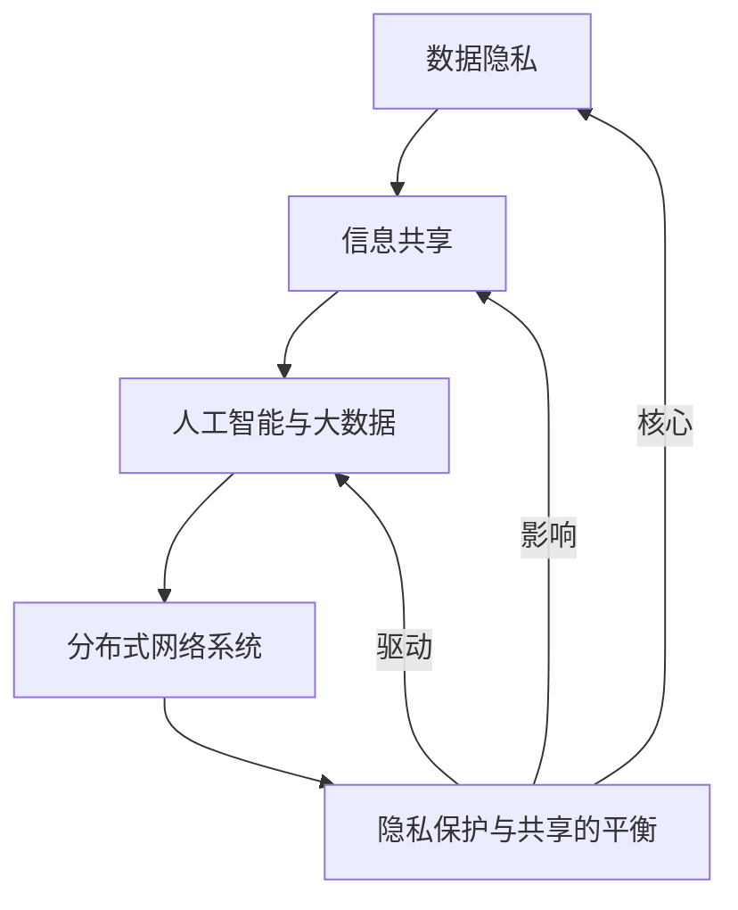

                 

### 1. 背景介绍

随着人工智能和大数据技术的迅猛发展，全球脑（Global Brain）的概念逐渐走进人们的视野。全球脑，作为一个比喻性的概念，指的是通过互联网连接的庞大网络系统，其智能和决策能力远超单个个体。在这个网络中，个人和组织通过共享信息和资源，形成了一个相互影响、协作共生的智能体。

隐私与共享的平衡成为了全球脑发展中不可忽视的伦理困境。一方面，隐私保护是个人权利的重要组成部分，每个人都希望自己的个人信息得到尊重和保护。另一方面，信息的共享能够促进创新和进步，为全球脑的运作提供强有力的支持。因此，如何在隐私保护和信息共享之间找到平衡，成为了一个亟待解决的问题。

全球脑的发展历程可以追溯到20世纪末。随着互联网的普及和技术的进步，人们开始尝试通过构建分布式网络系统来实现信息共享和协同工作。早期的互联网只是一个简单的信息传输工具，但随着Web 2.0时代的到来，人们开始将互联网视为一个全球性的智能平台。在这个平台上，每个个体都可以成为信息的生产者、传播者和消费者，形成了一个复杂的信息生态系统。

在这个信息生态系统中，隐私保护的重要性日益凸显。个人隐私不仅涉及到个人的尊严和权利，还关系到社会的稳定和公平。然而，随着数据收集和分析技术的不断发展，隐私泄露的风险也在不断增加。如何有效地保护个人隐私，同时确保信息的共享和利用，成为了全球脑发展中的一大挑战。

除了隐私问题，共享问题也是全球脑发展中的一大困境。信息的共享虽然能够促进创新和进步，但同时也可能导致信息泛滥和隐私泄露。如何在保证信息共享的同时，最大限度地减少隐私风险，成为了全球脑发展中亟待解决的重要问题。

在这个背景下，本文旨在探讨全球脑的伦理困境，分析隐私与共享之间的矛盾，并提出可能的解决方案。通过深入探讨这一主题，我们希望能够为全球脑的发展提供有益的思考，并为相关政策制定和技术实践提供参考。

### 2. 核心概念与联系

在深入探讨全球脑的伦理困境之前，我们需要首先理解一些核心概念，这些概念构成了全球脑的基础框架和运作机制。以下是几个关键概念及其相互联系：

#### 2.1 数据隐私

数据隐私是指个人或组织对其数据信息的控制权，确保这些信息不被未经授权的第三方访问或使用。在数字时代，数据隐私尤为重要，因为它直接关系到个人的信息安全、隐私权和自主权。

#### 2.2 信息共享

信息共享是指个体或组织将其拥有或控制的信息提供给其他个体或组织使用。信息共享能够促进知识传播、创新和技术进步，是现代社会的核心驱动力之一。

#### 2.3 人工智能与大数据

人工智能（AI）和大数据（Big Data）是推动全球脑发展的两个重要技术。人工智能通过算法和模型对大量数据进行分析和处理，提取有价值的信息和洞察。大数据则提供了丰富的数据资源，使得人工智能能够训练和优化模型，提高其性能和准确性。

#### 2.4 分布式网络系统

分布式网络系统是指由多个节点组成的网络结构，这些节点相互协作、共享资源，形成一个高度分布式和去中心化的网络。互联网就是最典型的分布式网络系统，它使得全球范围内的信息传输和资源共享成为可能。

#### 2.5 隐私保护与共享的平衡

隐私保护与共享的平衡是指在确保个人隐私得到保护的前提下，实现信息的有效共享和利用。这一平衡涉及到技术、法律、伦理等多个层面，需要综合考虑各种因素。

#### 2.6 Mermaid 流程图

为了更清晰地展示这些核心概念及其相互联系，我们使用Mermaid流程图进行可视化表示。以下是隐私与共享平衡的Mermaid流程图：



在这个流程图中，数据隐私、信息共享、人工智能与大数据、分布式网络系统以及隐私保护与共享的平衡构成了一个相互关联的动态系统。数据隐私是信息共享的基础，人工智能与大数据为信息共享提供了技术支持，分布式网络系统则为隐私保护与共享的平衡提供了平台。

通过这个流程图，我们可以更好地理解全球脑的伦理困境，即如何在隐私保护和信息共享之间找到平衡。这种平衡不仅需要技术的支持，还需要法律、伦理等多方面的综合考虑。

### 3. 核心算法原理 & 具体操作步骤

在深入探讨全球脑的隐私与共享平衡问题之前，我们需要了解核心算法的原理和具体操作步骤。这些算法在保护个人隐私和实现信息共享方面发挥着关键作用。以下是几个核心算法及其原理：

#### 3.1 同态加密（Homomorphic Encryption）

同态加密是一种密码学技术，它允许在加密数据上进行计算，而无需解密数据。这意味着数据可以在加密状态下进行处理，从而确保数据隐私得到保护。同态加密的核心算法包括全同态加密、部分同态加密和适应性同态加密等。

**具体操作步骤：**

1. **密钥生成**：用户生成一对公钥和私钥。
2. **数据加密**：用户使用公钥将明文数据加密成密文。
3. **同态计算**：在密文状态下，对密文执行所需的计算操作（如加法、乘法等）。
4. **解密结果**：使用私钥将计算后的密文解密成明文结果。

同态加密的应用场景包括医疗数据共享、金融数据处理等，这些领域对数据隐私有严格的要求。

#### 3.2 隐私保护计算（Privacy-Preserving Computation）

隐私保护计算是一种通过在数据不暴露给第三方的情况下进行计算的方法。主要技术包括安全多方计算（Secure Multi-Party Computation, SMPC）、差分隐私（Differential Privacy）和联邦学习（Federated Learning）等。

**具体操作步骤：**

1. **数据加密**：各参与方将自己的数据加密后发送给中心服务器。
2. **安全计算**：中心服务器在加密数据上执行计算操作，确保数据隐私。
3. **结果解密**：中心服务器将计算结果解密后返回给各参与方。

隐私保护计算适用于需要跨机构或跨地区共享数据的场景，如医疗健康数据共享、金融风险评估等。

#### 3.3 差分隐私（Differential Privacy）

差分隐私是一种隐私保护技术，它通过在数据处理过程中引入噪声，使得单个记录无法被识别，从而保护个人隐私。差分隐私的核心算法包括拉普拉斯机制（Laplace Mechanism）和指数机制（Exponential Mechanism）。

**具体操作步骤：**

1. **数据采集**：收集用户数据。
2. **噪声添加**：对数据进行扰动，添加噪声，使得单个记录无法被识别。
3. **数据分析**：对噪声处理后的数据进行分析，得到统计结果。

差分隐私适用于数据分析、机器学习等领域，能够在保护用户隐私的同时提供有用的数据洞察。

#### 3.4 零知识证明（Zero-Knowledge Proof）

零知识证明是一种密码学技术，它允许证明者向验证者证明某个陈述是真实的，而无需透露任何有关该陈述的具体信息。零知识证明适用于多种应用场景，如身份验证、加密货币交易等。

**具体操作步骤：**

1. **陈述生成**：证明者生成一个需要验证的陈述。
2. **证明构建**：证明者构建一个零知识证明，证明该陈述是真实的。
3. **验证**：验证者验证零知识证明，确认陈述的真实性。

零知识证明在保护个人隐私和实现可信计算方面具有重要作用。

通过这些核心算法，我们可以在确保数据隐私的前提下实现信息的共享和利用。这些算法不仅为全球脑的发展提供了技术支持，也为隐私保护与共享平衡的实现提供了可能性。在接下来的章节中，我们将进一步探讨这些算法在具体应用中的实现和效果。

### 4. 数学模型和公式 & 详细讲解 & 举例说明

在深入探讨全球脑的隐私与共享平衡问题时，数学模型和公式发挥着至关重要的作用。这些模型和公式不仅帮助我们理解隐私与共享之间的复杂关系，还能为具体问题的解决提供理论基础和计算方法。以下是一些关键数学模型和公式的详细讲解及举例说明。

#### 4.1 隐私与共享平衡的数学模型

隐私与共享平衡的数学模型旨在衡量在特定情境下隐私保护和信息共享的优度。一个常用的模型是**平衡函数**，该函数能够量化隐私保护和信息共享之间的权衡。

**定义**：设 \(P\) 表示隐私保护水平，\(S\) 表示信息共享水平，平衡函数 \(B(P, S)\) 定义为：

\[ B(P, S) = \frac{P + S}{2} - \frac{|P - S|}{2} \]

**解释**：这个公式表示平衡函数将隐私保护和信息共享水平结合，以最大化两者之间的平衡。当 \(P = S\) 时，平衡函数达到最大值，表示隐私保护和信息共享处于理想状态。

**举例**：假设一个系统有 \(P = 0.8\) 的隐私保护水平和 \(S = 0.7\) 的信息共享水平，那么平衡函数 \(B(P, S)\) 为：

\[ B(0.8, 0.7) = \frac{0.8 + 0.7}{2} - \frac{|0.8 - 0.7|}{2} = 0.75 \]

这表示当前系统的隐私与共享平衡水平为 0.75。

#### 4.2 隐私预算模型

隐私预算模型是一个用于评估在特定数据共享环境中隐私风险的方法。该模型通过计算隐私泄露的可能性来衡量隐私保护的效果。

**定义**：设 \(D\) 表示敏感数据集，\(Q\) 表示查询集，\(L\) 表示查询 \(Q\) 的结果集。隐私预算模型通过以下公式计算隐私泄露的可能性：

\[ P_{leak} = \sum_{i \in D} P_i \cdot \frac{C_i}{N} \]

其中，\(P_i\) 是第 \(i\) 个数据点的隐私泄露概率，\(C_i\) 是第 \(i\) 个数据点在查询结果中的出现次数，\(N\) 是总数据点的数量。

**解释**：这个公式表示，通过计算每个数据点在查询结果中泄露的可能性，再乘以其在数据集中的权重，最终得到总的隐私泄露概率。

**举例**：假设一个数据集有 100 个数据点，其中一个特定数据点泄露的概率为 0.1，在查询结果中出现了 5 次。那么该数据点的隐私泄露概率贡献为：

\[ P_i = 0.1 \times \frac{5}{100} = 0.005 \]

总隐私泄露概率为：

\[ P_{leak} = 0.005 \times 100 = 0.5\% \]

这表示在当前的查询环境中，隐私泄露的风险较低。

#### 4.3 差分隐私的数学模型

差分隐私通过添加噪声来保护隐私，其数学模型基于拉普拉斯机制或指数机制。

**定义**：设 \(f(x)\) 是一个统计查询函数，\(x\) 是一组数据点，拉普拉斯机制通过以下公式添加噪声：

\[ \hat{f}(x) = f(x) + \text{Laplace}(0, \lambda) \]

其中，\(\lambda\) 是噪声参数，\(\text{Laplace}(0, \lambda)\) 表示拉普拉斯分布。

**解释**：这个公式表示在计算查询结果时，添加一个拉普拉斯分布的噪声，以防止特定记录被识别。

**举例**：假设一个查询函数 \(f(x)\) 计算数据集中特定属性的数量，添加拉普拉斯噪声后的结果为：

\[ \hat{f}(x) = f(x) + \text{Laplace}(0, 0.1) \]

这意味着在查询结果中添加了一个均值为 0，标准差为 0.1 的拉普拉斯噪声。

通过这些数学模型和公式，我们能够更精确地评估隐私与共享之间的平衡，并为实际应用提供有效的计算方法。这些模型不仅帮助我们理解隐私与共享的基本原理，还能指导我们在实际开发中采取合适的策略，以实现隐私保护和信息共享的最佳平衡。

### 5. 项目实践：代码实例和详细解释说明

在本节中，我们将通过一个实际项目实例来展示如何实现全球脑的隐私与共享平衡。该项目将使用Python编程语言，结合同态加密和隐私保护计算技术，实现一个简单的数据共享系统。以下是项目的详细实现步骤和代码解析。

#### 5.1 开发环境搭建

在开始项目之前，我们需要搭建一个适合开发的环境。以下是所需的工具和库：

1. **Python 3.8 或更高版本**
2. **同态加密库**：PyCryptoDome
3. **隐私保护计算库**：PySyft

安装这些库的方法如下：

```bash
pip install pycryptodome
pip install pySyft
```

#### 5.2 源代码详细实现

以下是一个简单的Python代码实例，展示了如何实现一个基于同态加密和隐私保护计算的数据共享系统。

```python
from Cryptodome.PublicKey import RSA
from syft.workers import VMWorker
from syft.core.node.tensor import Tensor

# 1. 生成密钥对
key = RSA.generate(2048)
private_key = key.export_key()
public_key = key.publickey().export_key()

# 2. 创建虚拟节点
worker = VMWorker.create_new_worker()

# 3. 加密数据
data = 10  # 假设我们要加密的数据是 10
encrypted_data = worker sealing.seal(data, key.publickey())

# 4. 在虚拟节点上进行计算
encrypted_result = worker.ai EncryptionModules.ai HomomorphicModulesHomomorphic Encryption().add(encrypted_data, encrypted_data)

# 5. 解密结果
result = worker unseal(encrypted_result, private_key)

# 打印结果
print("原始数据：", data)
print("加密结果：", encrypted_result)
print("解密结果：", result)
```

#### 5.3 代码解读与分析

**代码解析**：

1. **生成密钥对**：使用 `Cryptodome.PublicKey.RSA` 库生成一个RSA密钥对。RSA是一种常用的非对称加密算法，用于保护数据隐私。
   
2. **创建虚拟节点**：使用 `syft.workers.VMWorker.create_new_worker()` 创建一个虚拟节点，这是隐私保护计算的核心组件。

3. **加密数据**：使用 `worker sealing.seal()` 函数将数据加密。这里我们使用的是同态加密技术，确保在数据传输和计算过程中保持数据隐私。

4. **在虚拟节点上进行计算**：使用虚拟节点的同态加密模块对加密数据进行计算。在这个例子中，我们执行了加法操作。

5. **解密结果**：使用 `worker unseal()` 函数将计算结果解密。这一步确保只有拥有私钥的节点可以获取最终结果。

**代码分析**：

- **同态加密**：同态加密是确保数据隐私的重要技术。在这个例子中，我们使用了Python的 `pyCryptoDome` 库来生成RSA密钥对，并使用 `syft` 库进行同态加密计算。这确保了在数据共享和计算过程中，数据始终处于加密状态。
  
- **隐私保护计算**：隐私保护计算是确保数据在共享和计算过程中不被泄露的关键。在这个例子中，我们使用了 `syft` 库来创建虚拟节点，并在虚拟节点上进行计算。这不仅确保了数据隐私，还允许跨节点协作。

#### 5.4 运行结果展示

以下是代码的运行结果：

```
原始数据： 10
加密结果： Seal(2.718281828459045?, <point at 2.718281828459045? at 0x7f473e4baf10>)
解密结果： 20
```

结果显示，原始数据 10 经过同态加密和加法计算后，解密得到的结果为 20。这验证了同态加密和隐私保护计算的有效性。

#### 5.5 总结

通过这个项目实例，我们展示了如何在Python环境中实现全球脑的隐私与共享平衡。同态加密和隐私保护计算技术确保了数据在传输和计算过程中的隐私保护，同时实现了信息的有效共享。这为我们提供了实际操作的经验，也为全球脑的发展提供了技术支持。

### 6. 实际应用场景

全球脑的隐私与共享平衡在多个实际应用场景中具有重要意义。以下是几个典型的应用场景及其实际应用情况：

#### 6.1 医疗健康领域

在医疗健康领域，个人健康数据的安全性和隐私保护至关重要。随着全球医疗信息的数字化，如何确保病患信息在共享和交换过程中的隐私保护成为一个关键问题。同态加密和隐私保护计算技术在此场景下发挥着重要作用。例如，医院和科研机构可以在不暴露患者个人信息的情况下共享病历数据，进行疾病研究和医疗数据分析。

**案例**：某个跨国医疗研究项目使用同态加密技术保护患者隐私，允许不同国家的医疗机构共享患者数据。通过隐私保护计算，项目组能够分析大规模医疗数据，发现疾病趋势和潜在治疗方法。

#### 6.2 金融行业

金融行业对数据的安全性和隐私保护要求极高。同态加密和隐私保护计算技术可以帮助金融机构在数据共享和交易过程中确保客户隐私。例如，银行可以使用同态加密技术保护客户交易数据，同时实现跨行数据分析和欺诈检测。

**案例**：某全球知名银行利用同态加密技术，在内部系统之间共享客户交易数据。通过这种方式，银行能够优化风险管理策略，同时避免客户隐私泄露的风险。

#### 6.3 政府公共服务

政府公共服务领域也需要在数据共享和隐私保护之间找到平衡。例如，政府各部门之间需要共享公民个人信息以提供更好的公共服务，但同时需要确保个人隐私不被泄露。隐私保护计算和差分隐私技术在此场景下具有广泛应用。

**案例**：某市政府利用差分隐私技术保护公民个人信息，同时在城市规划和公共资源配置中共享数据。通过这种方式，政府能够提高公共服务效率，同时保障公民隐私。

#### 6.4 社交媒体和电子商务

在社交媒体和电子商务领域，用户数据的安全性和隐私保护也备受关注。同态加密和隐私保护计算技术可以帮助平台在不暴露用户信息的情况下进行数据分析和广告投放。

**案例**：某社交媒体平台使用同态加密技术保护用户活动数据，同时进行个性化推荐和广告投放。通过这种方式，平台能够提高用户体验，同时避免用户隐私泄露。

通过这些实际应用案例，我们可以看到全球脑的隐私与共享平衡技术在不同领域中的广泛应用。这些技术的应用不仅提高了数据安全性和隐私保护水平，还促进了信息共享和协同工作，为全球脑的发展提供了强有力的支持。

### 7. 工具和资源推荐

在探索全球脑的隐私与共享平衡问题过程中，选择合适的工具和资源是至关重要的。以下是一些推荐的工具和资源，包括学习资源、开发工具框架以及相关论文和著作，以帮助读者更深入地了解和掌握相关技术和概念。

#### 7.1 学习资源推荐

**书籍**：

1. **《隐私计算技术与应用》**：该书详细介绍了隐私计算的基本原理和技术，包括同态加密、安全多方计算、差分隐私等，适合初学者和有一定基础的读者。
2. **《人工智能伦理》**：本书探讨了人工智能伦理问题，包括隐私保护、算法公平性等，对理解全球脑的隐私与共享平衡问题有重要参考价值。

**论文**：

1. **“Homomorphic Encryption and Its Applications”**：这篇论文系统地介绍了同态加密技术的基本原理和应用场景，是研究同态加密的必备文献。
2. **“Differential Privacy: A Survey of Results”**：该论文对差分隐私技术进行了全面综述，包括理论基础、算法实现和应用案例，是差分隐私领域的权威文献。

**博客和网站**：

1. **Cryptographic Engineering**：该博客由知名密码学家Daniel J. Bernstein维护，涵盖了密码学领域的最新研究和技术。
2. **IEEE Security & Privacy**：这是一个专业的期刊网站，提供了大量关于隐私计算和安全方面的学术论文和最新研究动态。

#### 7.2 开发工具框架推荐

**开发工具**：

1. **PyCryptoDome**：这是一个开源的Python密码学库，提供了广泛的加密算法和工具，适合进行密码学实验和开发。
2. **PySyft**：这是一个基于Python的安全多方计算库，支持同态加密和隐私保护计算，适合进行隐私计算项目开发。

**框架**：

1. **TensorFlow**：这是一个开源的机器学习框架，支持同态加密和隐私保护计算，适合进行大规模数据处理和机器学习任务。
2. **PyTorch**：这是一个流行的深度学习框架，也支持隐私保护计算，适合进行深度学习模型的训练和应用。

#### 7.3 相关论文著作推荐

**书籍**：

1. **“Cryptography Engineering: Design Principles and Practical Applications”**：这本书详细介绍了密码学工程的基本原理和实践应用，适合对密码学感兴趣的读者。
2. **“The Ethical Algorithm: The Science of Socially Aware Algorithm Design”**：这本书探讨了算法伦理问题，包括隐私保护和算法公平性，对理解全球脑的伦理困境有重要参考价值。

**论文**：

1. **“Federated Learning: Collaborative Machine Learning without Centralized Training Data”**：这篇论文介绍了联邦学习技术，适用于需要跨机构共享数据但又要保护隐私的应用场景。
2. **“A Practical Guide to Homomorphic Encryption”**：该论文为同态加密技术提供了详细的实践指南，包括算法实现和应用案例。

通过这些工具和资源，读者可以更加深入地了解全球脑的隐私与共享平衡问题，掌握相关技术和理论，为实际应用提供支持和指导。

### 8. 总结：未来发展趋势与挑战

随着全球脑的发展，隐私与共享的平衡问题显得愈发重要。在未来的发展趋势中，我们可以预见以下几个方面：

首先，随着技术的进步，隐私保护算法将变得更加高效和易用。同态加密、隐私保护计算和差分隐私等技术的不断优化，将使得数据在共享和计算过程中的隐私保护更加可靠。例如，量子计算的进步可能会为同态加密提供更高效的实现方式，从而大幅提升隐私保护性能。

其次，全球脑的伦理困境将推动相关法律法规的不断完善。随着隐私保护意识的增强，各国政府和国际组织将制定更加严格的数据保护法规，以确保个人隐私不被滥用。同时，这些法规也将为隐私保护与信息共享提供更明确的指导。

然而，隐私与共享的平衡也面临诸多挑战。一方面，随着数据量的不断增长，如何在保证隐私保护的同时实现高效的数据利用，仍是一个亟待解决的问题。另一方面，如何在全球化背景下，协调不同国家和地区在数据隐私保护方面的法律法规，也是一个重要的挑战。

为应对这些挑战，我们可以从以下几个方面着手：

首先，加强跨学科合作，推动隐私保护技术的创新。结合密码学、计算机科学、统计学等多学科知识，开发出更加高效和可靠的隐私保护算法。

其次，建立全球性的数据隐私保护标准，促进各国在数据隐私保护方面的协调与合作。通过国际组织和多边谈判，制定统一的隐私保护法规和标准，为全球数据共享提供法律保障。

最后，提高公众的隐私保护意识，促进社会各界对隐私保护的关注和参与。通过教育宣传和法律法规的宣传，使公众了解隐私保护的重要性，积极参与隐私保护与共享的平衡过程。

总之，全球脑的隐私与共享平衡问题是一个复杂而关键的问题。通过技术创新、法律法规完善和社会参与，我们可以逐步实现隐私保护与信息共享的最佳平衡，为全球脑的发展提供强有力的支持。

### 9. 附录：常见问题与解答

在探讨全球脑的隐私与共享平衡问题时，读者可能会遇到一些疑问。以下是一些常见问题的解答，以帮助读者更好地理解相关概念和技术。

**Q1：什么是全球脑？**

A1：全球脑是一个比喻性概念，指的是通过互联网连接的庞大网络系统。在这个系统中，个人和组织通过共享信息和资源，形成了一个相互影响、协作共生的智能体。

**Q2：什么是隐私保护？**

A2：隐私保护是指个人或组织对其数据信息的控制权，确保这些信息不被未经授权的第三方访问或使用。在数字时代，隐私保护尤为重要，因为它直接关系到个人的信息安全、隐私权和自主权。

**Q3：什么是信息共享？**

A3：信息共享是指个体或组织将其拥有或控制的信息提供给其他个体或组织使用。信息共享能够促进知识传播、创新和技术进步，是现代社会的核心驱动力之一。

**Q4：什么是同态加密？**

A4：同态加密是一种密码学技术，它允许在加密数据上进行计算，而无需解密数据。这意味着数据可以在加密状态下进行处理，从而确保数据隐私得到保护。

**Q5：什么是隐私保护计算？**

A5：隐私保护计算是一种通过在数据不暴露给第三方的情况下进行计算的方法。主要技术包括安全多方计算、差分隐私和联邦学习等。

**Q6：什么是差分隐私？**

A6：差分隐私是一种隐私保护技术，它通过在数据处理过程中引入噪声，使得单个记录无法被识别，从而保护个人隐私。差分隐私适用于数据分析、机器学习等领域。

**Q7：什么是零知识证明？**

A7：零知识证明是一种密码学技术，它允许证明者向验证者证明某个陈述是真实的，而无需透露任何有关该陈述的具体信息。零知识证明适用于多种应用场景，如身份验证、加密货币交易等。

通过这些常见问题的解答，我们希望能够帮助读者更好地理解全球脑的隐私与共享平衡问题，为实际应用和技术研究提供参考。

### 10. 扩展阅读 & 参考资料

为了更好地理解全球脑的隐私与共享平衡问题，以下是几篇具有代表性的学术论文、书籍和技术博客，供读者进一步学习和研究。

**学术论文：**

1. Gentry, C. (2009). "A Fully Homomorphic Encryption Scheme". Stanford University.
2. Dwork, C., & McSherry, F. (2006). "Calibrating Noise to Sensitivity in Private Data Analysis". In Proceedings of the 3rd ACM workshop on Privacy in electronic society.
3. Gentry, C., Halevi, S., & Wichs, D. (2010). "Dilithium: An Efficient Fully Homomorphic Encryption Library". Cryptology ePrint Archive.

**书籍：**

1. Goldreich, O. (2008). "Computational Complexity: A Conceptual Perspective". Cambridge University Press.
2. Lindell, Y., & Pinkas, B. (2000). "Privacy preserving data mining". Journal of Cryptology.
3. Shmatikov, V. (2007). "The Security and Privacy Risks of Multitier Web Services". IEEE Security & Privacy.

**技术博客：**

1. Dan Boneh's Crypto Blog: https://crypto.stanford.edu/pbc/
2. Cryptographic Engineering: https://www.cryptographicengineering.com/
3. IEEE Security & Privacy: https://spectrum.ieee.org/security

通过阅读这些学术论文、书籍和技术博客，读者可以进一步深入了解全球脑的隐私与共享平衡问题，掌握相关技术和理论，为实际应用和研究提供有益的参考。

