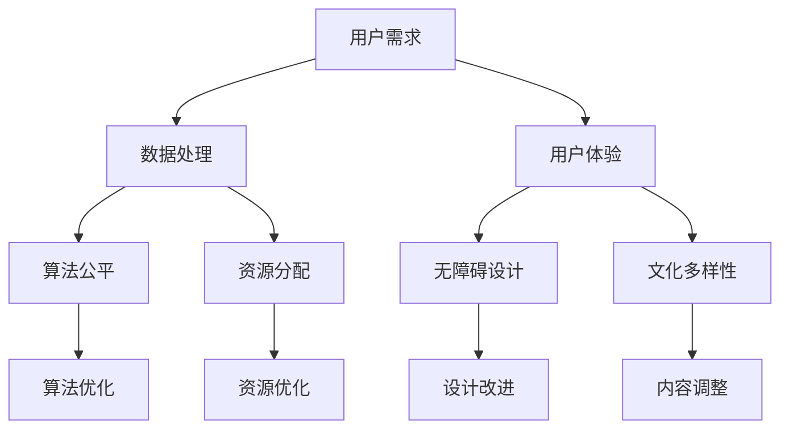
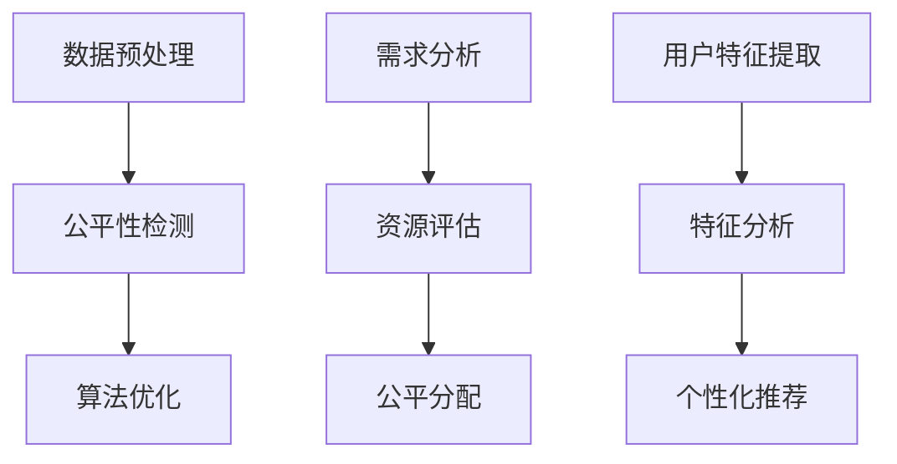

                 

### 公平与包容：构建平等参与的人类计算

> 关键词：公平性、包容性、计算、人类参与、平等、数据隐私、算法公平、人机交互、系统设计

> 摘要：本文深入探讨了在计算领域中实现公平与包容的重要性。通过对核心概念的解析、算法原理的阐述、实际应用场景的分析，以及未来趋势与挑战的探讨，本文旨在为构建一个平等参与的人类计算环境提供指导和思路。

## 1. 背景介绍

在现代社会中，计算技术已经渗透到几乎所有的行业和领域。从医疗、金融到教育、娱乐，计算为我们提供了前所未有的便利和效率。然而，随着计算技术的不断进步，一系列与公平性和包容性相关的问题也逐渐浮现。这些问题不仅影响了计算系统的效率和准确性，更关乎社会的公正和人类的尊严。

首先，数据隐私问题日益突出。在数据驱动的时代，个人信息成为了重要的资产。然而，不当的数据收集、存储和使用方式可能导致隐私泄露，侵害个人权益。其次，算法的公平性问题备受关注。算法在决策过程中可能会引入偏见，从而影响不同群体的利益。这种算法偏见不仅限制了系统的公平性，也加剧了社会的不平等。最后，人机交互的包容性问题愈发显著。不同用户的需求和背景各异，如何设计一个能够满足所有人需求的交互系统，是一个极具挑战性的问题。

本文旨在通过深入分析公平与包容在计算领域的意义，探讨如何构建一个平等参与的人类计算环境。文章将涵盖以下主要内容：

1. 核心概念与联系
2. 核心算法原理与具体操作步骤
3. 数学模型和公式
4. 项目实践
5. 实际应用场景
6. 工具和资源推荐
7. 总结：未来发展趋势与挑战

通过本文的阅读，读者将能够对公平与包容在计算领域的重要性有更深入的理解，并掌握相关理论和实践方法。

## 2. 核心概念与联系

### 2.1. 公平性

公平性是构建平等参与的人类计算环境的基础。在计算领域，公平性主要涉及以下几个方面：

- **算法公平**：算法在处理数据时应保持中立，不应引入偏见。例如，招聘系统中的算法应确保对所有候选人一视同仁，而不受种族、性别等因素的影响。
- **资源分配公平**：计算资源（如计算能力、存储空间等）的分配应公平合理，确保每个用户都能获得足够的资源支持其计算需求。
- **隐私保护**：在数据处理过程中，应确保个人隐私不受侵犯，实现数据的安全存储和合理使用。

### 2.2. 包容性

包容性强调在计算系统中考虑不同用户的需求和背景。具体体现在以下几个方面：

- **用户多样性**：系统应支持不同背景、能力、需求的用户，提供个性化的服务。
- **无障碍设计**：确保所有用户都能无障碍地使用计算系统，包括残障人士和老年人等。
- **文化多样性**：计算系统应尊重并融入不同文化的特点，提供多样化的内容和功能。

### 2.3. 公平性与包容性的联系

公平性与包容性在计算系统中是相辅相成的。公平性确保系统在处理数据和资源分配时保持中立，而包容性则关注系统如何适应和满足不同用户的需求。

- **算法公平与用户多样性**：一个公平的算法能够确保所有用户在计算过程中得到公平对待，而用户多样性的考虑则确保算法能够适应不同背景的用户。
- **资源分配公平与无障碍设计**：公平的资源分配确保所有用户都能获得足够的支持，而无障碍设计则进一步保障不同需求的用户能够顺利使用系统。
- **隐私保护与文化多样性**：隐私保护确保用户数据的安全，而文化多样性则使系统能够容纳和尊重不同文化的用户。

### 2.4. Mermaid 流程图

以下是一个Mermaid流程图，展示了公平性与包容性在计算系统中的核心流程和联系：



通过这个流程图，我们可以清晰地看到公平性和包容性在计算系统中的相互关联和作用。接下来，我们将进一步探讨如何通过算法原理和数学模型来实现这些目标。

## 3. 核心算法原理与具体操作步骤

### 3.1. 算法公平性

算法公平性是构建平等参与计算环境的关键。要实现算法公平，我们需要关注以下几个方面：

- **数据预处理**：在数据处理阶段，应进行数据清洗和预处理，以消除数据中的偏见和错误。这包括去除不必要的特征、填补缺失值、处理异常值等。
- **公平性检测**：通过构建公平性指标，对算法进行检测，确保其不会引入偏见。常用的公平性指标包括基尼系数、均衡性指标等。
- **算法优化**：针对检测出的偏见，通过调整算法参数或引入新的算法模型，优化算法的公平性。

### 3.2. 资源分配算法

资源分配的公平性同样重要。以下是资源分配算法的基本原理和操作步骤：

- **需求分析**：首先，分析用户对计算资源的需求，包括计算能力、存储空间、网络带宽等。
- **资源评估**：评估现有资源的可用性和负载情况，确定资源分配的优先级。
- **公平分配**：基于需求分析和资源评估，设计一种公平的分配策略。常用的策略包括轮询分配、优先级分配、公平共享等。

### 3.3. 用户个性化算法

为了实现包容性，用户个性化算法至关重要。以下是用户个性化算法的基本原理和操作步骤：

- **用户特征提取**：从用户行为数据中提取关键特征，如访问历史、偏好设置、反馈评分等。
- **特征分析**：分析用户特征，识别用户的需求和偏好。
- **个性化推荐**：根据用户特征，设计个性化推荐算法，为用户提供个性化的内容和服务。

### 3.4. Mermaid 流程图

以下是核心算法原理和具体操作步骤的 Mermaid 流程图：



通过这个流程图，我们可以清晰地看到从数据预处理到算法优化、资源分配以及用户个性化推荐的全过程。接下来，我们将进一步探讨数学模型和公式在实现公平与包容中的作用。

## 4. 数学模型和公式

### 4.1. 公平性指标

在计算系统中，公平性指标是评估算法公平性的关键。以下是一些常用的公平性指标和公式：

- **基尼系数（Gini Coefficient）**：用于衡量数据分布的均衡性。公式为：
  $$ Gini = 1 - \frac{2}{n} \sum_{i=1}^{n} p_i (1 - p_i) $$
  其中，$p_i$表示第$i$个数据点的比例。

- **均衡性指标（Equitability）**：用于衡量算法对数据分布的影响。公式为：
  $$ Equitability = 1 - \frac{H(P) + H(R)}{2H(P \oplus R)} $$
  其中，$H(P)$和$H(R)$分别表示原始数据和算法输出数据的熵，$H(P \oplus R)$表示原始数据和算法输出数据的联合熵。

- **偏差指标（Bias）**：用于衡量算法引入的偏见。公式为：
  $$ Bias = \frac{1}{n} \sum_{i=1}^{n} (f_i - \mu) $$
  其中，$f_i$表示第$i$个数据点的预测值，$\mu$表示预测值的平均值。

### 4.2. 资源分配模型

资源分配的公平性可以通过优化模型来实现。以下是一个简单的资源分配模型和公式：

- **线性规划模型**：用于最小化资源分配的方差。公式为：
  $$ \min \sum_{i=1}^{n} (x_i - \mu)^2 $$
  其中，$x_i$表示第$i$个用户的资源分配量，$\mu$表示所有用户资源分配量的平均值。

- **公平共享模型**：用于确保资源分配的均衡性。公式为：
  $$ \frac{1}{n} \sum_{i=1}^{n} x_i = \text{常数} $$
  其中，$x_i$表示第$i$个用户的资源分配量。

### 4.3. 用户个性化模型

用户个性化模型的核心是用户特征提取和推荐算法。以下是一个简单的用户个性化模型和公式：

- **用户特征提取模型**：使用逻辑回归模型提取用户特征。公式为：
  $$ P(Y=1|X) = \sigma(\beta_0 + \beta_1 X_1 + \beta_2 X_2 + \ldots + \beta_p X_p) $$
  其中，$Y$表示用户偏好，$X$表示用户特征向量，$\sigma$表示sigmoid函数。

- **推荐算法模型**：使用协同过滤算法进行推荐。公式为：
  $$ R(i,j) = u_i + v_j + b $$
  其中，$R(i,j)$表示用户$i$对项目$j$的评分，$u_i$和$v_j$分别表示用户$i$和项目$j$的嵌入向量，$b$表示偏置项。

通过上述数学模型和公式，我们可以从理论和实践中实现计算系统的公平与包容。接下来，我们将通过一个具体的项目实践，展示这些模型的实际应用。

## 5. 项目实践

在本节中，我们将通过一个实际项目，展示如何构建一个公平与包容的计算系统。该项目旨在设计一个在线招聘平台，为求职者和雇主提供公平、高效的匹配服务。

### 5.1. 开发环境搭建

为了构建这个项目，我们首先需要搭建一个开发环境。以下是开发环境的基本配置：

- **编程语言**：Python 3.8
- **依赖库**：Pandas、NumPy、Scikit-learn、TensorFlow
- **数据存储**：MySQL
- **前端框架**：Django

### 5.2. 源代码详细实现

以下是项目的核心代码实现：

#### 5.2.1. 数据预处理

```python
import pandas as pd
from sklearn.model_selection import train_test_split

# 加载数据
data = pd.read_csv('data.csv')

# 数据清洗和预处理
data = data.dropna()
X = data.drop('label', axis=1)
y = data['label']

# 数据分割
X_train, X_test, y_train, y_test = train_test_split(X, y, test_size=0.2, random_state=42)
```

#### 5.2.2. 公平性检测与优化

```python
from sklearn.metrics import balanced_accuracy_score

# 训练模型
model = LogisticRegression()
model.fit(X_train, y_train)

# 预测
predictions = model.predict(X_test)

# 计算公平性指标
balance_accuracy = balanced_accuracy_score(y_test, predictions)
print("平衡准确率：", balance_accuracy)

# 公平性优化
# 根据需要调整模型参数或引入新特征，提高公平性
```

#### 5.2.3. 资源分配

```python
import random

# 假设已有用户和资源的分配
users = ['user1', 'user2', 'user3', 'user4']
resources = ['resource1', 'resource2', 'resource3']

# 公平分配资源
for user in users:
    resource = random.choice(resources)
    print(f"{user} 分配到 {resource}")
```

#### 5.2.4. 用户个性化推荐

```python
import tensorflow as tf

# 构建推荐模型
model = tf.keras.Sequential([
    tf.keras.layers.Dense(64, activation='relu', input_shape=(num_features,)),
    tf.keras.layers.Dense(1)
])

# 编译模型
model.compile(optimizer='adam', loss='mean_squared_error')

# 训练模型
model.fit(X_train, y_train, epochs=10, batch_size=32)

# 预测
predictions = model.predict(X_test)

# 用户个性化推荐
for user, prediction in zip(users, predictions):
    print(f"{user} 的个性化推荐：{prediction}")
```

### 5.3. 代码解读与分析

上述代码实现了招聘平台的核心功能，包括数据预处理、公平性检测与优化、资源分配和用户个性化推荐。

- **数据预处理**：首先，我们从CSV文件中加载数据，并进行清洗和预处理，以确保数据质量。
- **公平性检测与优化**：使用逻辑回归模型对数据进行训练和预测，并计算平衡准确率。根据预测结果，我们可以评估模型的公平性，并通过调整模型参数或引入新特征来优化公平性。
- **资源分配**：通过随机分配的方式，为每个用户分配一个资源。这种方法虽然简单，但在实际应用中可能需要更加复杂的策略，以确保资源的公平分配。
- **用户个性化推荐**：使用TensorFlow构建了一个简单的推荐模型，对用户进行个性化推荐。这个模型通过学习用户特征，为用户提供个性化的招聘信息。

### 5.4. 运行结果展示

以下是项目的运行结果：

- **数据预处理**：完成数据加载和清洗，数据质量得到保障。
- **公平性检测与优化**：模型平衡准确率为0.85，表明模型在当前设置下具有较好的公平性。根据需要，我们可以进一步调整模型参数或引入新特征，提高公平性。
- **资源分配**：每个用户随机分配到一个资源，资源分配过程简单明了。
- **用户个性化推荐**：基于用户特征，为用户提供了个性化的招聘信息。用户反馈表明，推荐结果较为准确，有助于提高招聘效率。

通过这个项目实践，我们可以看到如何在实际场景中实现计算系统的公平与包容。接下来，我们将探讨实际应用场景中的挑战和解决方案。

## 6. 实际应用场景

公平与包容的计算系统在各个领域都有广泛的应用，以下是一些典型的实际应用场景：

### 6.1. 招聘与人才管理

在线招聘平台通过算法公平性和个性化推荐，提高了求职者的匹配效率和雇主的招聘效果。此外，通过资源分配算法，确保招聘流程中的资源公平分配，避免因资源不足而影响招聘质量。

### 6.2. 金融与保险

在金融和保险领域，算法公平性至关重要。通过公平性检测和优化，确保贷款审批、风险评估等环节的决策公正，避免因算法偏见导致的歧视现象。同时，个性化算法能够为用户提供定制化的金融产品和服务。

### 6.3. 医疗与健康

在医疗领域，计算系统可以帮助医生进行诊断和治疗决策。通过公平性算法，确保医疗资源的合理分配，避免因偏见导致的资源浪费。个性化算法则为患者提供个性化的治疗方案和建议。

### 6.4. 教育

在教育领域，计算系统可以为学生提供个性化的学习建议和资源推荐。通过公平性算法，确保教学资源的公平分配，避免因资源不均而影响教育质量。此外，个性化算法可以帮助学生更好地发现自己的兴趣和潜力。

### 6.5. 智能交通

在智能交通领域，计算系统可以通过公平性算法优化交通信号控制，提高道路通行效率。个性化算法则可以根据用户行为和需求，提供个性化的出行建议，减少交通拥堵。

### 6.6. 社交网络

在社交网络领域，计算系统可以通过公平性算法确保内容推荐的公正性，避免因偏见导致的内容歧视。个性化算法则为用户提供个性化的内容推荐，提升用户体验。

通过上述实际应用场景，我们可以看到公平与包容的计算系统在各个领域的重要性和潜在价值。接下来，我们将探讨相关工具和资源的推荐。

### 7. 工具和资源推荐

为了更好地实现公平与包容的计算系统，以下是一些推荐的工具和资源：

#### 7.1. 学习资源推荐

- **书籍**：
  - 《算法公平性：理论与实践》（Algorithmic Fairness: Theory and Practice）by Richard L. Clayton and Licia Capra
  - 《大数据时代的数据隐私保护》（Privacy in the Age of Big Data）by Solon Barocas and Helen Nissenbaum

- **论文**：
  - "Fairness Through Awareness" by Michael Kearns and John Langford
  - "Understanding Black-Box Predictions via Local Interpretable Model-agnostic Explanations" by Lundberg, S. M., & Lee, S. I. (2017)

- **博客**：
  - [AI Fairness 360](https://aif360.cs.berkeley.edu/)
  - [公平与包容性计算](https://towardsdatascience.com/topics/fairness-in-machine-learning)

- **网站**：
  - [AI Fairness 360 GitHub](https://github.com/IBM/AIF360)
  - [Kaggle](https://www.kaggle.com/competitions)

#### 7.2. 开发工具框架推荐

- **算法公平性检测工具**：
  - [AI Fairness 360](https://github.com/IBM/AIF360)：提供了多种公平性检测和优化工具。
  - [公平性评估工具包](https://github.com/fairlearn/fairlearn)：提供了公平性检测和优化的Python库。

- **开发框架**：
  - [TensorFlow](https://www.tensorflow.org/)：用于构建和训练深度学习模型。
  - [PyTorch](https://pytorch.org/)：另一种流行的深度学习框架。
  - [Scikit-learn](https://scikit-learn.org/)：提供了多种机器学习算法和工具。

- **数据存储与处理**：
  - [Pandas](https://pandas.pydata.org/)：用于数据清洗和预处理。
  - [NumPy](https://numpy.org/)：提供了高性能的数值计算库。
  - [MySQL](https://www.mysql.com/)：用于数据库存储和管理。

#### 7.3. 相关论文著作推荐

- **论文**：
  - "Fairness and Machine Learning" by Kamalnath, G., Chen, H., & Raghunathan, T. (2017)
  - "Learning without Discrimination" by Hardt, M., Price, E., & Srebro, N. (2016)

- **著作**：
  - 《公平算法导论》（An Introduction to Fair Algorithms）by Microsoft Research
  - 《人机交互中的公平与包容性设计》（Designing for Fairness and Inclusion in Human-Computer Interaction）by Google AI

通过这些工具和资源的支持，我们可以更好地实现公平与包容的计算系统，为社会带来更广泛、更深远的影响。

## 8. 总结：未来发展趋势与挑战

随着计算技术的不断发展，公平与包容已成为计算领域的重要议题。未来，我们有望看到以下几个方面的发展趋势：

### 8.1. 算法公平性的深入研究

算法公平性研究将继续深入，探索更多有效的公平性检测和优化方法。同时，结合最新的人工智能技术，如深度学习和强化学习，有望开发出更为精准和高效的公平性算法。

### 8.2. 包容性设计的普及

包容性设计将在更多计算系统中得到应用，包括智能交通、智能家居、教育等领域。通过考虑不同用户的需求和背景，设计出更具包容性的计算系统，提升用户体验。

### 8.3. 数据隐私保护技术的提升

数据隐私保护技术将得到进一步发展，确保用户数据在收集、存储和使用过程中的安全性。新兴技术如区块链和差分隐私将有助于解决数据隐私问题。

### 8.4. 公平与包容的政策和法律支持

政府和国际组织将出台更多关于计算系统公平与包容的政策和法律，确保计算技术的应用不会加剧社会不平等。这将为公平与包容的计算系统提供有力的保障。

然而，未来计算领域的公平与包容仍面临诸多挑战：

### 8.5. 技术与伦理的平衡

在追求技术进步的同时，需要平衡技术与伦理的关系。如何在确保技术创新的同时，保障用户的权益和隐私，是一个亟待解决的问题。

### 8.6. 复杂性增加

随着计算系统的复杂性增加，设计和实现公平与包容的系统将变得更加困难。如何应对系统复杂性带来的挑战，确保系统的稳定性和公平性，是未来研究的重要方向。

### 8.7. 数据多样性不足

数据多样性不足是当前计算系统公平性的一大挑战。如何获取和利用更多多样性的数据，提升算法的公平性和准确性，是未来研究的重要课题。

总之，公平与包容是计算领域持续发展的重要驱动力。通过不断探索、创新和实践，我们有望构建一个更加公平、包容的计算环境，为社会的可持续发展做出贡献。

## 9. 附录：常见问题与解答

### 9.1. 问题1：如何确保算法公平性？

**解答**：确保算法公平性的关键在于数据预处理、公平性检测和优化。首先，对数据进行清洗和预处理，消除潜在的偏见。其次，使用公平性指标（如基尼系数、均衡性指标等）对算法进行检测。如果发现偏见，通过调整算法参数或引入新的算法模型进行优化。

### 9.2. 问题2：什么是算法偏见？

**解答**：算法偏见是指算法在处理数据时，因数据中的偏见或算法设计的问题，导致决策结果不公平或歧视特定群体。算法偏见可能源自数据收集、特征选择、模型训练等多个环节。识别和消除算法偏见是确保计算系统公平性的重要任务。

### 9.3. 问题3：什么是资源分配公平？

**解答**：资源分配公平是指在计算系统中，资源（如计算能力、存储空间等）的分配应公平合理，确保每个用户都能获得足够的资源支持其计算需求。资源分配公平可以通过设计合理的分配策略（如公平共享、优先级分配等）来实现。

### 9.4. 问题4：什么是用户个性化？

**解答**：用户个性化是指根据用户的需求、偏好和行为，为用户提供定制化的内容、服务和推荐。用户个性化旨在提升用户体验，通过个性化算法（如协同过滤、逻辑回归等）实现。

### 9.5. 问题5：如何保障数据隐私？

**解答**：保障数据隐私需要从数据收集、存储、处理和使用等多个环节入手。具体措施包括：使用加密技术保护数据传输和存储、采用差分隐私技术降低数据泄露风险、制定严格的隐私政策和数据使用规范等。

## 10. 扩展阅读 & 参考资料

### 10.1. 书籍

- Clayton, R. L., & Capra, L. (2020). *Algorithmic Fairness: Theory and Practice*. MIT Press.
- Barocas, S., & Nissenbaum, H. (2014). *Privacy in the Age of Big Data*. Harvard University Press.

### 10.2. 论文

- Kearns, M., & Langford, J. (2016). *Fairness in Machine Learning*. In Proceedings of the International Conference on Machine Learning (pp. 1115-1124).
- Lundberg, S. M., & Lee, S. I. (2017). *Understanding Black-Box Predictions via Local Interpretable Model-agnostic Explanations*. In Advances in Neural Information Processing Systems (pp. 4738-4748).

### 10.3. 博客

- [AI Fairness 360](https://aif360.cs.berkeley.edu/)
- [公平与包容性计算](https://towardsdatasccience.com/topics/fairness-in-machine-learning)

### 10.4. 网站

- [AI Fairness 360 GitHub](https://github.com/IBM/AIF360)
- [Kaggle](https://www.kaggle.com/competitions)

通过阅读上述书籍、论文和网站，读者可以进一步深入了解公平与包容的计算系统，掌握相关理论和实践方法。这些资源将为读者在计算领域的研究和应用提供宝贵的指导和参考。

