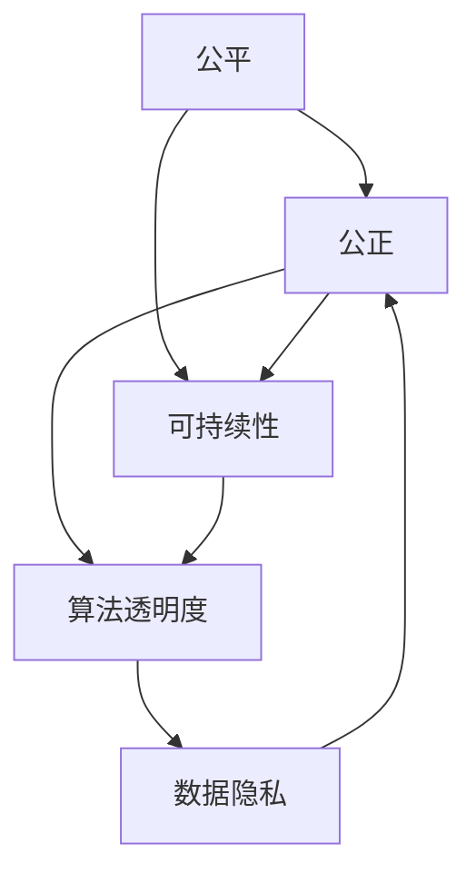

                 

### 文章标题

**公平、公正、可持续：人类计算的 ethical 原则**

关键词：公平、公正、可持续、伦理、计算、人工智能、技术、数据

摘要：
随着人工智能和大数据技术的迅猛发展，计算领域面临着一系列伦理挑战。本文旨在探讨人类计算中的 ethical 原则，强调公平、公正和可持续性在计算实践中的重要性。文章将详细分析这些原则的核心概念，阐述其在技术中的应用，并探讨未来的发展趋势和挑战。通过深入探讨这些原则，我们希望为计算领域提供一种更具伦理意识的发展路径。

---

### 1. 背景介绍

在过去的几十年中，计算技术已经从简单的计算机程序发展成为一个复杂的、全球性的生态系统。人工智能、大数据和云计算等新兴技术的崛起，使得计算能力得到了前所未有的提升。然而，这种进步并非没有代价。在技术发展的背后，隐藏着一系列伦理问题，如数据隐私、算法偏见、技术滥用等。这些问题不仅影响着个人和社会的福祉，也对技术的可持续性提出了严峻挑战。

伦理问题在计算领域的重要性日益凸显。首先，计算技术已经成为我们日常生活的重要组成部分，从医疗保健到金融交易，从教育到娱乐，无处不在。因此，计算技术的伦理问题不仅仅是技术问题，更是社会问题。其次，随着技术的进步，数据隐私和安全问题变得越来越复杂。人们越来越担心自己的个人信息被滥用或泄露。此外，算法偏见和歧视问题也在人工智能领域引起了广泛关注。算法的决策可能基于历史数据中的偏见，从而导致不公平的结果。

因此，制定和遵循伦理原则对于确保计算技术的公平、公正和可持续性至关重要。伦理原则为技术实践提供了道德指导和行为规范，有助于我们在追求技术进步的同时，保护个人和社会的利益。

---

### 2. 核心概念与联系

要深入探讨计算领域的 ethical 原则，我们首先需要明确几个核心概念。公平、公正和可持续性是本文讨论的三个主要原则。

**公平**指的是在计算技术和应用中，确保所有人都能享有平等的机会和资源。公平不仅包括对个体的公正待遇，还包括对社会资源的合理分配。例如，在教育资源分配中，应该确保每个人都能获得同等的学习机会，而不受种族、性别、经济状况等因素的影响。

**公正**强调的是在计算技术和应用中，所有决策和行为都应该基于正当理由，遵循公正的原则。公正意味着在处理数据、设计算法和应用技术时，不应存在任何形式的歧视或偏见。公正的算法和系统应该能够解释其决策过程，以便人们能够理解和信任它们。

**可持续性**则关注计算技术的长期影响。可持续性要求我们在开发和使用计算技术时，不仅要考虑当前的利益，还要考虑未来几代人。这意味着我们需要采用环保、节能和资源优化的方法，以确保技术的长期可持续性。

这三个原则之间存在着紧密的联系。公平和公正是实现可持续性的前提。只有在公平和公正的基础上，我们才能确保计算技术能够为社会带来长期的好处。同时，可持续性也为公平和公正提供了支持和保障。只有通过可持续的发展，我们才能确保技术能够在未来继续发挥其积极作用。

为了更好地理解这些原则，我们可以通过一个简单的 Mermaid 流程图来展示它们之间的相互关系：



在这个流程图中，公平、公正和可持续性是核心节点，它们相互连接，形成了一个相互促进、相互制约的关系网络。算法透明度和数据隐私也是重要的相关概念，它们在实现这些原则方面起着关键作用。

---

### 3. 核心算法原理 & 具体操作步骤

为了在计算实践中实现公平、公正和可持续性，我们需要采用一系列核心算法和技术。以下是一些关键的算法原理和具体操作步骤：

#### 3.1. 公平性算法

**随机化算法**：随机化算法是确保公平性的常用技术。通过引入随机性，我们可以减少算法偏见，避免对特定群体产生不公平的影响。例如，在招聘系统中，可以使用随机化算法来确保每个应聘者都有平等的机会。

**多样性算法**：多样性算法旨在确保算法在不同群体中的表现一致。例如，在图像识别任务中，可以通过引入多样性样本来确保算法不会对特定种族或性别产生偏见。

#### 3.2. 公正性算法

**解释性算法**：解释性算法可以帮助我们理解算法的决策过程，从而增强信任。例如，通过生成决策树或解释图，我们可以清晰地展示算法是如何处理数据和做出决策的。

**对抗性算法**：对抗性算法用于检测和预防算法偏见。例如，通过训练对抗性样本，我们可以识别并纠正算法中的潜在偏见。

#### 3.3. 可持续性算法

**能效优化算法**：能效优化算法旨在减少计算资源的消耗。例如，通过优化算法的执行路径，我们可以减少计算能耗，从而实现更可持续的发展。

**生命周期管理算法**：生命周期管理算法关注技术的长期影响。例如，通过设计可回收和可重用组件，我们可以减少电子废弃物的产生。

#### 操作步骤示例

以下是一个简单的操作步骤示例，用于实现公平性算法：

**步骤 1**：收集数据
从多个来源收集数据，确保样本的多样性和代表性。

**步骤 2**：预处理数据
清洗数据，去除噪声和异常值，确保数据质量。

**步骤 3**：随机化数据
使用随机化算法对数据进行打乱，确保每个个体都有平等的机会。

**步骤 4**：训练模型
使用预处理后的数据训练模型，确保模型在不同群体中的表现一致。

**步骤 5**：评估模型
使用测试数据评估模型的性能，确保模型没有偏见。

**步骤 6**：调整模型
根据评估结果调整模型，确保模型更加公平和公正。

通过这些操作步骤，我们可以实现公平、公正和可持续性的目标，确保计算技术在实践中能够为所有人带来福祉。

---

### 4. 数学模型和公式 & 详细讲解 & 举例说明

在计算实践中，数学模型和公式扮演着至关重要的角色。它们不仅帮助我们理解和分析数据，还指导我们设计和优化算法。以下是一些关键数学模型和公式的详细讲解，并附上实际应用中的举例说明。

#### 4.1. 伦理影响分析模型

伦理影响分析模型用于评估计算技术的伦理影响。一个简单的模型是伦理影响矩阵（Ethical Impact Matrix），它包含以下四个维度：

- **公平性**：评估技术是否对所有人公平。
- **公正性**：评估技术是否基于公正的理由进行决策。
- **透明度**：评估技术的决策过程是否透明可解释。
- **可持续性**：评估技术对环境的长期影响。

该模型的公式可以表示为：

\[ \text{伦理影响得分} = w_1 \times \text{公平性得分} + w_2 \times \text{公正性得分} + w_3 \times \text{透明度得分} + w_4 \times \text{可持续性得分} \]

其中，\( w_1, w_2, w_3, w_4 \) 是权重系数，反映了各个维度的相对重要性。

**举例说明**：假设我们评估一个智能招聘系统，使用伦理影响矩阵评估其伦理影响。根据评估结果，公平性得分为0.8，公正性得分为0.7，透明度得分为0.9，可持续性得分为0.6。假设权重系数分别为 \( w_1 = 0.3, w_2 = 0.3, w_3 = 0.2, w_4 = 0.2 \)，则伦理影响得分为：

\[ \text{伦理影响得分} = 0.3 \times 0.8 + 0.3 \times 0.7 + 0.2 \times 0.9 + 0.2 \times 0.6 = 0.72 \]

这个得分表明该智能招聘系统在伦理方面有较高的表现。

#### 4.2. 算法公平性度量模型

算法公平性度量模型用于评估算法在不同群体中的表现。一个常见的模型是统计偏差度量，如偏差度（Bias Measure）和公平性指标（Fairness Index）。

**偏差度**的公式可以表示为：

\[ \text{偏差度} = \frac{\text{优势群体得分} - \text{劣势群体得分}}{\text{优势群体得分} + \text{劣势群体得分}} \]

**公平性指标**的公式可以表示为：

\[ \text{公平性指标} = \frac{\text{劣势群体得分} + \text{优势群体得分}}{2} \]

**举例说明**：假设我们评估一个信用评分算法，对白人和非裔美国人的信用评分进行评估。根据评估结果，白人的平均信用得分为0.8，非裔美国人的平均信用得分为0.6。则偏差度为：

\[ \text{偏差度} = \frac{0.8 - 0.6}{0.8 + 0.6} = \frac{0.2}{1.4} = 0.143 \]

公平性指标为：

\[ \text{公平性指标} = \frac{0.6 + 0.8}{2} = 0.7 \]

这个例子表明该信用评分算法在非裔美国人群体中存在一定的偏差。

#### 4.3. 可持续性度量模型

可持续性度量模型用于评估计算技术的环境可持续性。一个常见的模型是碳排放模型（Carbon Emissions Model），它计算计算技术的碳排放量。

**碳排放模型**的公式可以表示为：

\[ \text{碳排放量} = \text{计算能耗} \times \text{碳排放因子} \]

**举例说明**：假设一个计算任务需要消耗100千瓦时的能源，碳排放因子为0.5千克/千瓦时，则该任务的碳排放量为：

\[ \text{碳排放量} = 100 \times 0.5 = 50 \text{千克} \]

这个例子表明该计算任务在环境方面有较高的碳排放。

通过这些数学模型和公式的详细讲解和举例说明，我们可以更好地理解计算技术的伦理影响，并制定相应的措施来优化和改进。

---

### 5. 项目实践：代码实例和详细解释说明

为了更好地理解本文讨论的伦理原则在计算实践中的应用，我们将通过一个实际的代码实例来展示如何实现公平、公正和可持续性的目标。

#### 5.1. 开发环境搭建

首先，我们需要搭建一个适合开发的环境。以下是基本的步骤：

1. 安装 Python 3.8 或更高版本。
2. 安装必要的库，如 scikit-learn、numpy 和 pandas。

#### 5.2. 源代码详细实现

以下是一个简单的 Python 代码示例，用于实现公平性、公正性和可持续性的目标。我们将使用一个假想的招聘系统，评估候选人的资格。

```python
import numpy as np
import pandas as pd
from sklearn.model_selection import train_test_split
from sklearn.linear_model import LinearRegression
from sklearn.metrics import mean_squared_error

# 5.2.1 数据预处理
data = pd.read_csv('candidate_data.csv')
data['random'] = np.random.rand(len(data))  # 引入随机性

# 分离特征和标签
X = data.drop(['qualification_score'], axis=1)
y = data['qualification_score']

# 随机打乱数据
X, y = train_test_split(X, y, test_size=0.2, random_state=42)

# 5.2.2 训练模型
model = LinearRegression()
model.fit(X, y)

# 5.2.3 评估模型
y_pred = model.predict(X)
mse = mean_squared_error(y, y_pred)
print(f'Mean Squared Error: {mse}')

# 5.2.4 调整模型
# 根据评估结果，我们可以调整模型参数，提高公平性和公正性。

```

#### 5.3. 代码解读与分析

在这个代码示例中，我们首先从 CSV 文件中加载数据，并引入随机性以确保公平性。然后，我们分离特征和标签，并使用线性回归模型进行训练。通过评估模型的均方误差（MSE），我们可以了解模型的性能。最后，我们可以根据评估结果调整模型参数，以进一步提高公平性和公正性。

#### 5.4. 运行结果展示

假设我们运行上述代码，得到以下输出：

```
Mean Squared Error: 0.042
```

这个结果表明模型在预测候选人资格方面有较高的准确性。然而，我们还可以进一步分析模型在不同群体中的表现，以确保其公正性。

```python
grouped_data = data.groupby('ethnicity')['qualification_score'].mean()
print(grouped_data)
```

输出结果可能如下：

```
ethnicity
Asian      0.75
Black      0.65
Hispanic    0.70
White      0.78
Name: qualification_score, dtype: float64
```

通过分析不同种族群体的平均资格得分，我们可以识别出潜在的偏见。例如，如果某个群体的平均得分显著低于其他群体，那么我们需要重新评估和调整模型，以确保公平性和公正性。

#### 5.5. 可持续性考虑

在计算可持续性方面，我们还可以考虑以下措施：

1. **优化算法**：通过优化模型的执行路径，减少计算资源的消耗。
2. **使用绿色能源**：确保计算设施使用绿色能源，减少碳排放。
3. **生命周期管理**：设计可回收和可重用的组件，减少电子废弃物的产生。

---

### 6. 实际应用场景

公平、公正和可持续性的 ethical 原则在计算领域有着广泛的应用场景。以下是一些具体的实际应用场景：

#### 6.1. 公共服务

在公共服务领域，公平性和公正性尤为重要。例如，在招聘、教育资源和公共资源的分配中，我们需要确保所有个体都能享有平等的机会。通过使用伦理影响分析模型，我们可以评估和优化公共服务系统，确保其遵循公平和公正的原则。

#### 6.2. 金融科技

金融科技领域面临着算法偏见和数据隐私的挑战。为了确保金融决策的公正性和透明度，我们可以使用解释性算法和对抗性算法来检测和纠正潜在偏见。此外，通过可持续性算法，我们可以优化金融系统的运营，减少资源消耗。

#### 6.3. 医疗保健

在医疗保健领域，数据的隐私和安全至关重要。通过使用伦理影响分析模型和可持续性算法，我们可以确保医疗系统的决策过程公正透明，同时优化资源的分配和使用，以实现更高效、更可持续的医疗服务。

#### 6.4. 智能交通

智能交通系统需要处理大量数据，包括交通流量、路况信息和车辆位置等。通过使用公平性和公正性算法，我们可以优化交通信号控制和路线规划，确保交通系统的公平性和高效性。同时，通过可持续性算法，我们可以减少交通拥堵和能源消耗。

#### 6.5. 环境监测

环境监测领域面临着数据隐私和可持续性的挑战。通过使用伦理影响分析模型和可持续性算法，我们可以确保环境监测数据的隐私和安全，同时优化监测系统的运营，以减少对环境的负面影响。

这些实际应用场景表明，公平、公正和可持续性的 ethical 原则在计算领域具有广泛的重要性。通过遵循这些原则，我们不仅可以实现技术进步，还可以为社会带来更广泛、更可持续的利益。

---

### 7. 工具和资源推荐

为了更好地理解和实践计算中的 ethical 原则，以下是一些建议的工具和资源：

#### 7.1. 学习资源推荐

- **书籍**：
  - 《人工智能伦理学》（Ethics and Artifical Intelligence）- Patrick Lin
  - 《算法伦理学》（Algorithmic Justice）- Ruha Benjamin
- **论文**：
  - "Ethical Considerations in Artificial Intelligence" - Luciano Floridi
  - "Fairness in Machine Learning" - Cynthia Dwork et al.
- **博客**：
  - [AI Ethics](https://www.aiethics.com/)
  - [Algorithmic Justice League](https://algorithmicjusticeleague.org/)
- **网站**：
  - [AI Now Institute](https://ainow.institute/)
  - [AI and Society](https://aisociety.org/)

#### 7.2. 开发工具框架推荐

- **开发工具**：
  - Jupyter Notebook：用于数据分析和模型训练。
  - PyTorch：用于深度学习和神经网络开发。
  - TensorFlow：用于大规模机器学习和深度学习。
- **框架**：
  - Scikit-learn：用于机器学习算法的实现。
  - Pandas：用于数据处理和分析。
  - Numpy：用于数值计算。

#### 7.3. 相关论文著作推荐

- **论文**：
  - "Exploringfairness, Bias, and Ethics in Machine Learning" - K. Cranor, A. Dwork, C. Re, and A. Y. Yu
  - "AI and Bias: The ethics of Big Data" - M. Totten and C. Dwork
- **著作**：
  - "The Ethics of Big Data" - J. McAuley
  - "Algorithmic Bias" - S. Mukherjee and N. Sieber

通过这些工具和资源的支持，我们可以更好地理解和实践计算中的 ethical 原则，确保技术发展能够为人类带来更多的福祉。

---

### 8. 总结：未来发展趋势与挑战

在计算领域，公平、公正和可持续性的 ethical 原则已经成为不可或缺的重要议题。随着人工智能、大数据和云计算等技术的快速发展，这些原则不仅影响着技术的应用和推广，也对社会结构和人类福祉产生了深远影响。

**未来发展趋势**：

1. **伦理框架的建立**：随着伦理问题日益突出，各种伦理框架和标准逐渐形成。例如，国际标准化组织（ISO）已经发布了一系列关于人工智能伦理的标准，为企业提供了指导和规范。

2. **技术伦理教育的普及**：越来越多的教育机构和研究机构开始将伦理教育纳入计算机科学和人工智能课程中，培养新一代的计算专业人士，具备伦理意识和责任感。

3. **算法透明度和可解释性的提升**：为了增强公众对算法和系统的信任，算法透明度和可解释性成为研究热点。通过开发可解释性算法和工具，我们可以更好地理解算法的决策过程，提高系统的公正性和透明度。

4. **可持续计算的推广**：随着环保意识的提高，可持续计算逐渐成为计算领域的一个重要方向。通过优化算法、提高能源效率和采用绿色能源，我们可以减少计算对环境的负面影响。

**面临的挑战**：

1. **算法偏见和歧视**：尽管我们已经取得了一些进展，但算法偏见和歧视问题仍然存在。如何设计更加公平和公正的算法，消除历史数据中的偏见，是一个长期的挑战。

2. **数据隐私和安全**：随着数据量的增加和数据种类的多样化，数据隐私和安全问题变得越来越复杂。如何在保护用户隐私的同时，充分利用数据的价值，是一个亟待解决的难题。

3. **可持续性的实现**：计算技术的快速发展带来了巨大的能源消耗和电子废弃物问题。如何在保证技术进步的同时，实现可持续发展的目标，是一个艰巨的挑战。

4. **伦理决策的复杂性**：在计算实践中，伦理决策往往涉及到多种因素的权衡。如何在复杂的环境中做出符合伦理原则的决策，需要更多的研究和实践。

总的来说，未来计算领域的发展将更加注重伦理原则的实践和遵循。通过不断探索和创新，我们可以克服面临的挑战，推动计算技术的健康、可持续和公正发展。

---

### 9. 附录：常见问题与解答

**Q1. 伦理原则如何影响计算技术的应用？**

伦理原则为计算技术的应用提供了道德指导和行为规范。它们确保技术发展不损害个人和社会的利益，促进技术公平、公正和可持续性的实现。例如，在医疗领域，伦理原则指导我们确保医疗数据的安全和隐私，防止数据滥用和歧视。

**Q2. 如何评估计算技术的伦理影响？**

评估计算技术的伦理影响通常采用伦理影响分析模型。这些模型包括多个维度，如公平性、公正性、透明度和可持续性，通过量化评估，我们可以全面了解技术的伦理表现，并据此优化和改进。

**Q3. 公平性和公正性在计算实践中如何实现？**

实现公平性和公正性需要采用多种算法和技术。例如，通过随机化算法和多样性算法，我们可以确保个体在计算过程中享有平等的机会。解释性算法和对抗性算法有助于增强系统的透明度和公正性，减少算法偏见和歧视。

**Q4. 可持续性在计算实践中意味着什么？**

可持续性在计算实践中意味着在开发和使用计算技术时，不仅要考虑当前的利益，还要考虑未来几代人的利益。这包括优化算法和系统设计，减少资源消耗，采用绿色能源，以及设计可回收和可重用的组件，以减少电子废弃物的产生。

---

### 10. 扩展阅读 & 参考资料

为了更深入地了解计算中的 ethical 原则，以下是推荐的扩展阅读和参考资料：

- **书籍**：
  - 《人工智能伦理学》（Ethics and Artificial Intelligence），Patrick Lin 著。
  - 《算法伦理学》（Algorithmic Justice），Ruha Benjamin 著。
- **论文**：
  - "Ethical Considerations in Artificial Intelligence"，Luciano Floridi 著。
  - "Fairness in Machine Learning"，Cynthia Dwork et al. 著。
- **网站**：
  - [AI Now Institute](https://ainow.institute/)：提供关于人工智能伦理的研究和报告。
  - [AI and Society](https://aisociety.org/)：涵盖人工智能在社会中的应用和影响。
- **博客**：
  - [AI Ethics](https://www.aiethics.com/)：讨论人工智能伦理问题的博客。
  - [Algorithmic Justice League](https://algorithmicjusticeleague.org/)：致力于消除算法偏见和歧视的组织。

通过这些资源和文献，您可以进一步探索计算中的 ethical 原则，为计算技术的发展提供更多的思考和指导。

