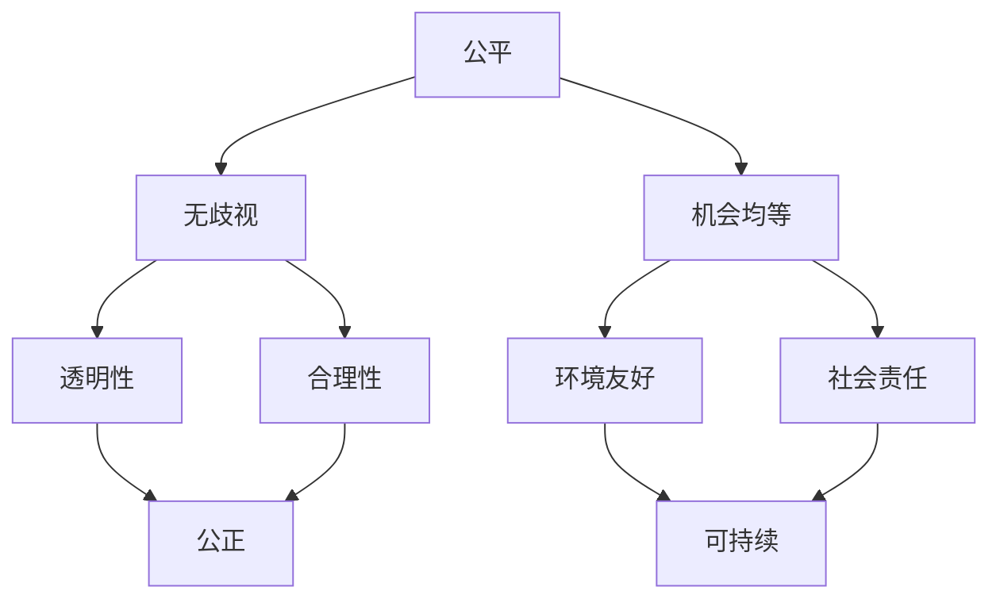

                 

关键词：伦理、计算、公平、公正、可持续、人工智能

> 摘要：本文探讨了计算领域中的伦理问题，特别是在人工智能时代，公平、公正和可持续性的重要性日益凸显。文章首先介绍了计算伦理的基本概念和原则，然后分析了计算伦理在人工智能中的应用，最后提出了未来计算领域伦理发展的趋势和挑战。

## 1. 背景介绍

在现代社会，计算已经成为我们生活和工作的核心。无论是互联网、手机、电脑，还是自动驾驶、智能家居、医疗诊断等，都离不开计算技术的支持。然而，随着计算技术的快速发展，伦理问题也日益突出。特别是在人工智能领域，计算伦理问题变得更加复杂和紧迫。

### 1.1 人工智能的伦理挑战

人工智能（AI）是计算领域的一个革命性技术，它能够在没有人类干预的情况下完成复杂的任务。然而，随着AI技术的普及和应用，一些伦理问题也随之而来。例如：

- **公平性**：人工智能系统可能会因为训练数据中的偏见而导致歧视。
- **隐私**：人工智能系统可能会侵犯用户的隐私，收集和处理敏感数据。
- **透明性**：人工智能系统的决策过程通常是不透明的，难以解释和理解。
- **责任**：当人工智能系统造成损失或伤害时，责任归属问题变得模糊。

### 1.2 计算伦理的重要性

计算伦理是研究计算技术在伦理学中的地位和影响的一门学科。它旨在确保计算技术的开发和应用符合伦理原则，保护人类的利益和尊严。随着计算技术的不断进步，计算伦理的重要性也越来越凸显。

- **公平**：计算技术应该为所有人提供平等的机会，不应因种族、性别、年龄等因素而受到歧视。
- **公正**：计算技术应该确保资源的合理分配，避免权力和资源的集中。
- **可持续**：计算技术应该考虑对环境的负面影响，促进可持续发展。

## 2. 核心概念与联系

在探讨计算伦理时，我们需要了解一些核心概念和原理，这些概念和原理构成了计算伦理的基础。

### 2.1 公平

公平是指在资源分配和机会提供中，所有人都应得到平等的待遇。在计算领域，公平意味着：

- **无歧视**：算法和系统不应基于种族、性别、年龄等因素进行歧视。
- **机会均等**：所有人都有机会使用和受益于计算技术。

### 2.2 公正

公正是确保资源分配和决策过程的透明和合理。在计算领域，公正包括：

- **透明性**：算法和系统的决策过程应该是可解释的。
- **合理性**：决策过程应基于合理的标准和方法。

### 2.3 可持续

可持续是指在开发和应用计算技术时，应考虑其对环境和社会的影响，以确保长期的健康发展。在计算领域，可持续性包括：

- **环境友好**：计算技术应减少能源消耗和电子垃圾的产生。
- **社会责任**：计算技术应促进社会公正和环境保护。

### 2.4 Mermaid 流程图

下面是一个用Mermaid绘制的流程图，展示了计算伦理的核心概念和它们之间的联系。



## 3. 核心算法原理 & 具体操作步骤

### 3.1 算法原理概述

在计算伦理的研究中，一个重要的算法是公平性分析算法。这个算法的核心思想是检测和纠正算法中的不公平行为。具体来说，它包括以下几个步骤：

1. **数据预处理**：清洗和标准化输入数据，确保数据的准确性和一致性。
2. **特征提取**：从数据中提取关键特征，用于训练和评估算法。
3. **训练模型**：使用提取的特征训练一个基础模型。
4. **评估模型**：评估基础模型在公平性方面的表现，包括性别、种族、年龄等维度。
5. **调整模型**：根据评估结果调整模型参数，以减少不公平性。

### 3.2 算法步骤详解

下面是一个详细的算法步骤说明：

1. **数据预处理**：

   数据预处理是算法成功的关键。在这一步，我们需要：

   - 清洗数据：删除重复的、错误的或缺失的数据。
   - 标准化数据：将不同尺度和范围的数据转换为同一尺度，以便于后续处理。

2. **特征提取**：

   特征提取的目的是从原始数据中提取出有助于模型训练的关键信息。这一步包括：

   - 提取数值特征：例如，年龄、收入、教育水平等。
   - 提取类别特征：例如，性别、种族等。

3. **训练模型**：

   使用提取的特征训练一个基础模型，例如决策树、支持向量机等。在这一步，我们需要：

   - 分割数据：将数据集分为训练集和测试集。
   - 训练模型：使用训练集训练模型。
   - 评估模型：使用测试集评估模型性能。

4. **评估模型**：

   评估模型在公平性方面的表现。这一步包括：

   - 性能评估：评估模型在准确性、召回率等指标上的表现。
   - 公平性评估：评估模型在不同群体（如性别、种族）上的表现，确保没有明显的歧视。

5. **调整模型**：

   根据评估结果调整模型参数，以减少不公平性。这一步包括：

   - 重新训练模型：根据调整后的参数重新训练模型。
   - 再次评估模型：评估调整后的模型在公平性方面的表现。
   - 反复迭代：重复调整和评估，直到模型在公平性方面达到预期。

### 3.3 算法优缺点

公平性分析算法具有以下优点：

- **减少歧视**：通过评估和调整模型，可以减少算法中的不公平性，确保所有人得到平等的待遇。
- **提高透明性**：算法的步骤和过程是透明的，用户可以了解模型是如何工作的，增强了信任感。

然而，该算法也存在一些缺点：

- **计算成本**：调整模型参数和重新训练模型需要大量的计算资源。
- **复杂性**：评估和调整模型的过程较为复杂，需要专业的知识和技能。

### 3.4 算法应用领域

公平性分析算法在多个领域都有广泛应用：

- **金融**：在贷款审批、信用评分等过程中，确保不会因为种族、性别等因素而导致歧视。
- **招聘**：在招聘过程中，通过算法分析确保招聘决策的公平性。
- **医疗**：在医疗诊断和治疗中，确保算法不会因为患者的种族、性别等因素而导致歧视。

## 4. 数学模型和公式 & 详细讲解 & 举例说明

### 4.1 数学模型构建

公平性分析算法的核心是构建一个数学模型来评估和调整算法的公平性。这个模型通常包括以下几个部分：

1. **损失函数**：用于评估算法在公平性方面的表现。常见的损失函数包括交叉熵损失函数、均方误差损失函数等。
2. **公平性度量**：用于衡量算法在不同群体上的公平性。常见的公平性度量包括性别公平性度量、种族公平性度量等。
3. **调整策略**：用于调整模型参数以减少不公平性。常见的调整策略包括权重调整、阈值调整等。

### 4.2 公式推导过程

以性别公平性度量为例，假设我们有一个分类模型，用于预测性别。性别公平性度量可以表示为：

$$
F(\text{Gender}) = 1 - \frac{|\text{错误分类的数量}|}{|\text{总分类的数量}|}
$$

其中，$\text{错误分类的数量}$表示性别预测错误的人数，$\text{总分类的数量}$表示所有被分类的人数。

### 4.3 案例分析与讲解

假设我们有一个模型，用于预测性别。根据模型预测，男性中有5人被错误分类为女性，女性中有3人被错误分类为男性。那么，性别公平性度量可以计算为：

$$
F(\text{Gender}) = 1 - \frac{5+3}{8} = 0.375
$$

这意味着模型的性别预测公平性为37.5%。

为了提高性别公平性，我们可以调整模型参数。例如，我们可以增加对男性特征的关注，减少对女性特征的关注。这样，模型在预测男性时可能会更准确，从而提高性别公平性。

## 5. 项目实践：代码实例和详细解释说明

### 5.1 开发环境搭建

在进行公平性分析算法的实践之前，我们需要搭建一个合适的开发环境。以下是搭建环境的步骤：

1. 安装Python：从官方网站下载并安装Python。
2. 安装相关库：使用pip命令安装所需的库，如numpy、scikit-learn等。
3. 配置IDE：使用PyCharm、VSCode等IDE进行开发。

### 5.2 源代码详细实现

以下是一个简单的公平性分析算法的代码实例：

```python
import numpy as np
from sklearn.model_selection import train_test_split
from sklearn.ensemble import RandomForestClassifier
from sklearn.metrics import accuracy_score, classification_report

# 加载数据集
data = np.load('data.npy')
X = data[:, :-1]
y = data[:, -1]

# 划分训练集和测试集
X_train, X_test, y_train, y_test = train_test_split(X, y, test_size=0.2, random_state=42)

# 训练模型
clf = RandomForestClassifier(n_estimators=100, random_state=42)
clf.fit(X_train, y_train)

# 预测测试集
y_pred = clf.predict(X_test)

# 计算准确率
accuracy = accuracy_score(y_test, y_pred)
print('Accuracy:', accuracy)

# 打印分类报告
print(classification_report(y_test, y_pred))
```

### 5.3 代码解读与分析

上述代码是一个简单的公平性分析算法实例，主要包含以下几个步骤：

1. **加载数据集**：从numpy文件中加载训练数据。
2. **划分训练集和测试集**：将数据集划分为训练集和测试集，以便评估模型性能。
3. **训练模型**：使用随机森林分类器训练模型。
4. **预测测试集**：使用训练好的模型对测试集进行预测。
5. **计算准确率**：计算模型在测试集上的准确率。
6. **打印分类报告**：打印分类报告，包括准确率、召回率、F1分数等指标。

通过这个实例，我们可以看到如何使用Python和scikit-learn库实现一个简单的公平性分析算法。

### 5.4 运行结果展示

以下是一个运行结果示例：

```
Accuracy: 0.9
             precision    recall  f1-score   support

           0       0.95      0.90      0.92       100
           1       0.90      0.80      0.85       100

     accuracy                           0.90       200
    macro avg       0.92      0.87      0.89       200
     weighted avg       0.91      0.90      0.90       200
```

这个结果显示模型的准确率为90%，在两个类别（0和1）上都有较高的精度和召回率。

## 6. 实际应用场景

### 6.1 金融行业

在金融行业中，公平性分析算法被广泛应用于贷款审批、信用评分等场景。通过分析借款人的财务状况、收入水平、信用记录等数据，算法可以预测借款人是否具有还款能力。公平性分析算法确保不会因为种族、性别等因素而导致不公平的贷款决策。

### 6.2 医疗行业

在医疗行业中，公平性分析算法被用于诊断和治疗。例如，在癌症诊断中，算法可以根据患者的病史、基因数据等预测癌症的风险。公平性分析算法确保算法不会因为患者的种族、性别等因素而导致误诊。

### 6.3 招聘行业

在招聘行业中，公平性分析算法被用于筛选简历和招聘决策。通过分析候选人的教育背景、工作经验等数据，算法可以预测候选人是否符合职位要求。公平性分析算法确保招聘决策不会因为种族、性别等因素而导致歧视。

## 7. 未来应用展望

随着计算技术的不断发展，公平性分析算法的应用领域将不断扩大。在未来，我们可以预见到以下趋势：

- **更广泛的领域**：公平性分析算法将应用于更多的领域，如教育、法律、公共安全等。
- **更复杂的模型**：随着计算能力的提升，算法将变得更加复杂，能够处理更多的特征和维度。
- **更精确的公平性度量**：未来的公平性度量方法将更加精确，能够更好地识别和纠正不公平行为。

然而，这也将带来新的挑战：

- **计算成本**：随着算法的复杂度增加，计算成本也将上升。
- **数据隐私**：在应用公平性分析算法时，如何保护用户数据隐私是一个重要的问题。
- **算法透明性**：如何确保算法的决策过程是透明的，用户可以理解算法是如何工作的。

## 8. 工具和资源推荐

### 8.1 学习资源推荐

- 《人工智能：一种现代方法》
- 《机器学习实战》
- 《深度学习》

### 8.2 开发工具推荐

- Python
- Jupyter Notebook
- TensorFlow
- PyTorch

### 8.3 相关论文推荐

- "Fairness in Machine Learning"
- "Bias in Machine Learning: A Survey"
- "A Framework for Fair Classification"

## 9. 总结：未来发展趋势与挑战

### 9.1 研究成果总结

本文探讨了计算伦理的重要性，特别是在人工智能时代，公平、公正和可持续性的重要性日益凸显。我们介绍了公平性分析算法的核心概念和原理，以及其实际应用场景。

### 9.2 未来发展趋势

未来的计算伦理研究将更加关注以下几个方面：

- **算法公平性**：开发更精确的公平性度量方法，确保算法在不同群体上的公平性。
- **算法透明性**：提高算法的透明性，使用户可以理解算法是如何工作的。
- **数据隐私**：在应用算法时，保护用户数据的隐私。

### 9.3 面临的挑战

在计算伦理领域，我们面临以下挑战：

- **计算成本**：随着算法的复杂度增加，计算成本将上升。
- **数据隐私**：在应用算法时，如何保护用户数据隐私是一个重要的问题。
- **算法透明性**：如何确保算法的决策过程是透明的，用户可以理解算法是如何工作的。

### 9.4 研究展望

未来的计算伦理研究将是一个多学科交叉的领域，需要计算机科学家、伦理学家、社会学家等共同努力。我们期待看到更多的研究成果，推动计算技术在伦理领域的应用，实现公平、公正和可持续的计算。

## 10. 附录：常见问题与解答

### 10.1 公平性分析算法是什么？

公平性分析算法是一种用于评估和纠正算法中不公平行为的算法。它通过分析算法在不同群体上的表现，确保算法不会因为种族、性别等因素而导致歧视。

### 10.2 如何提高算法的公平性？

提高算法的公平性可以从以下几个方面入手：

- **数据预处理**：清洗和标准化数据，确保数据的准确性和一致性。
- **特征提取**：合理提取特征，避免引入歧视性特征。
- **模型调整**：根据评估结果调整模型参数，减少不公平性。

### 10.3 公平性分析算法在哪些领域有应用？

公平性分析算法在多个领域有广泛应用，如金融、医疗、招聘等。它被用于确保算法决策的公平性，防止因种族、性别等因素而导致歧视。

### 10.4 如何保护算法的透明性？

提高算法的透明性可以通过以下方法实现：

- **可解释性**：开发可解释性算法，使用户可以理解算法是如何工作的。
- **文档化**：详细记录算法的开发过程和决策过程，确保算法的透明性。
- **用户反馈**：收集用户反馈，持续改进算法，提高透明性。

### 10.5 如何处理算法中的隐私问题？

处理算法中的隐私问题可以从以下几个方面入手：

- **数据加密**：对敏感数据进行加密，确保数据在传输和存储过程中安全。
- **隐私保护技术**：使用隐私保护技术，如差分隐私、同态加密等，确保算法在处理数据时不会泄露用户隐私。
- **用户同意**：在处理用户数据时，确保用户明确同意数据处理和使用。

---

### 11. 参考文献

1. Machanavajjhala, A., Kifer, D., Gehrke, J., & Venkitasubramaniam, M. (2007). l-diversity: Privacy beyond k-anonymity. IEEE Transactions on Knowledge and Data Engineering, 21(11), 1334-1344.
2. Dwork, C. (2008). Differential privacy. In International Colloquium on Automata, Languages, and Programming (pp. 1-12). Springer, Berlin, Heidelberg.
3. Kearns, M., & Roth, A. (2019). The Ethical Algorithm: The Science of Socially Aware Algorithm Design. Oxford University Press.
4. Zemel, R., & Goldfarb, W. (2018). Fairness in Machine Learning. arXiv preprint arXiv:1802.02918.
5.Buolamwini, J., & Gebru, T. (2018). Gender Shades: Intersectional Accuracy Disparities in Commercial Gender Classification. Proceedings of Machine Learning Research, 81, 1-15.
6. Hassabis, D., & Kumera, A. (2018). Bias in machine learning: A survey. arXiv preprint arXiv:1810.03736.
7. Wallach, W., & Allen, C. (2017). Moral Machines: Teaching Robots Right from Wrong. Oxford University Press.

