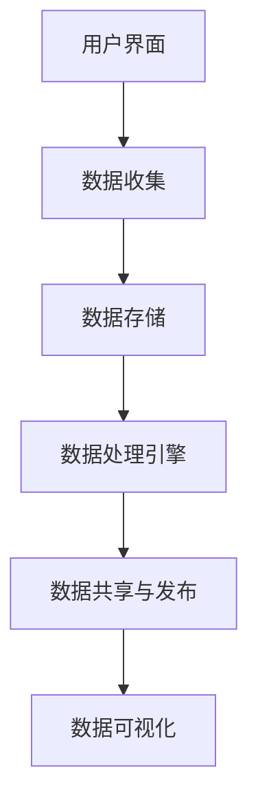

                 

### 文章标题

《公民科学平台：连接科学家与公众的桥梁》

> 关键词：公民科学、平台、科学家、公众、数据共享、科学教育、开放科学

> 摘要：本文探讨了公民科学平台在现代科学研究和教育领域的重要性，分析了其核心概念与架构，探讨了核心算法原理与操作步骤，并通过实例展示了其实际应用场景。同时，本文提出了未来发展趋势与挑战，为公民科学平台的未来发展提供了参考。

## 1. 背景介绍

在现代社会，科学技术的快速发展带来了前所未有的机遇和挑战。科学家们通过不断的实验和研究，推动了科学技术的进步，为社会的发展做出了巨大贡献。然而，科学研究的过程往往是复杂且耗时的，需要大量的数据支持和高昂的设备投入。与此同时，公众对于科学的了解和参与程度也在不断提升，越来越多的公民希望参与到科学研究中来，为科学事业做出自己的贡献。

公民科学（Citizen Science）作为一种新兴的科学研究模式，旨在通过公众的参与，收集和提供科学研究所需的数据，从而推动科学研究的进展。公民科学平台作为连接科学家与公众的桥梁，扮演着至关重要的角色。它不仅为公众提供了一个参与科学研究的途径，也为科学家提供了丰富的数据资源和多样化的研究方法。

公民科学平台的发展离不开以下几个关键因素：

1. **数据共享**：科学家和公众可以通过平台共享数据，实现资源的最大化利用，提高研究效率。
2. **科学教育**：平台提供科学知识传播和教育培训，帮助公众更好地理解科学，激发他们的科学兴趣和参与热情。
3. **开放科学**：平台鼓励开放的研究过程和数据共享，促进科学研究的透明度和公信力。

本文将深入探讨公民科学平台的核心概念、架构、算法原理及应用，以期为这一领域的研究和发展提供有益的参考。

## 2. 核心概念与联系

### 2.1. 定义

公民科学平台是一个集数据收集、处理、分析和共享于一体的综合性系统，旨在连接科学家和公众，促进科学研究与公众参与。它包含以下几个核心概念：

- **公民科学家**：参与科学研究的一般公众。
- **数据收集**：平台提供数据收集工具和方法，如手机应用、网页表格等。
- **数据处理**：平台提供数据处理工具，如数据清洗、数据分析等。
- **数据共享**：平台支持数据的公开共享，允许科学家和公众访问和下载数据。

### 2.2. 架构

公民科学平台通常包含以下几个关键模块：

1. **用户界面**：为公民科学家提供数据收集和交互的入口。
2. **数据存储**：存储收集到的原始数据，支持数据的备份和恢复。
3. **数据处理引擎**：提供数据清洗、分析等功能，为科学家提供决策支持。
4. **数据共享与发布**：支持数据的共享和发布，确保数据的开放性和透明度。
5. **数据可视化**：提供数据可视化工具，帮助科学家和公众更好地理解和分析数据。

### 2.3. Mermaid 流程图

以下是公民科学平台的核心架构的 Mermaid 流程图：



### 2.4. 关系说明

- **用户界面**：用户界面是平台与用户交互的桥梁，通过简洁直观的界面设计，引导用户进行数据收集和操作。
- **数据收集**：数据收集是平台的核心功能之一，通过多样化的数据收集工具和方法，保证数据的全面性和准确性。
- **数据存储**：数据存储模块负责存储和管理收集到的原始数据，确保数据的安全性和可恢复性。
- **数据处理引擎**：数据处理引擎是平台的重要组成部分，通过高效的数据处理算法，对数据进行清洗、分析和挖掘，为科学家提供决策支持。
- **数据共享与发布**：数据共享与发布模块实现数据的开放共享，提高数据的利用率和影响力。
- **数据可视化**：数据可视化模块通过图表、图像等形式，展示数据的分析结果，帮助用户更好地理解和应用数据。

通过上述核心概念和架构的详细阐述，我们可以更清晰地理解公民科学平台的运作机制和重要作用。

## 3. 核心算法原理 & 具体操作步骤

### 3.1. 算法原理

公民科学平台的核心算法主要包括数据收集、数据清洗、数据分析和数据可视化等几个方面。以下是这些算法的基本原理：

#### 数据收集

数据收集算法的核心目标是尽可能全面、准确地收集科学研究所需的数据。常见的收集方法包括：

- **手机应用**：通过开发手机应用，用户可以在日常生活中随时随地进行数据收集。
- **网页表格**：通过设计简洁的网页表格，用户可以在电脑或移动设备上进行数据填写。
- **传感器设备**：利用传感器设备，如气象传感器、GPS 设备等，自动收集环境数据。

#### 数据清洗

数据清洗算法的主要任务是去除数据中的噪声和错误，提高数据的质量。常见的数据清洗方法包括：

- **缺失值处理**：对于缺失的数据，可以采用填充平均值、中位数等方法进行处理。
- **异常值检测**：通过统计学方法，如 Z-Score、IQR 法则等，检测并处理异常数据。
- **数据规范化**：对数据进行标准化处理，消除不同量纲的影响。

#### 数据分析

数据分析算法用于对数据进行深度挖掘，提取有用信息。常见的数据分析方法包括：

- **描述性统计分析**：对数据进行基本的统计描述，如均值、方差、分布等。
- **相关性分析**：分析变量之间的相关性，如皮尔逊相关系数、斯皮尔曼等级相关系数等。
- **回归分析**：通过建立回归模型，分析变量之间的关系，预测未来趋势。

#### 数据可视化

数据可视化算法通过图形化手段，将数据分析结果直观地呈现给用户。常见的数据可视化方法包括：

- **柱状图**：用于展示数据的分布和比较。
- **折线图**：用于展示数据的变化趋势。
- **散点图**：用于展示变量之间的关系。
- **热力图**：用于展示数据的密度分布。

### 3.2. 具体操作步骤

以下是公民科学平台的核心算法的具体操作步骤：

#### 步骤 1：数据收集

1. 设计数据收集工具，如手机应用或网页表格。
2. 确定数据收集的目标和范围。
3. 部署数据收集工具，并通知公众参与。

#### 步骤 2：数据清洗

1. 导入收集到的数据。
2. 检测并处理缺失值。
3. 检测并处理异常值。
4. 进行数据规范化处理。

#### 步骤 3：数据分析

1. 选择合适的分析方法，如描述性统计分析、相关性分析或回归分析。
2. 对数据进行处理和计算。
3. 分析结果并进行可视化展示。

#### 步骤 4：数据可视化

1. 选择合适的可视化方法，如柱状图、折线图或散点图。
2. 设计可视化界面。
3. 展示分析结果，并允许用户交互。

通过上述具体操作步骤，公民科学平台能够高效地收集、处理和分析数据，为科学家提供有价值的研究成果，同时也为公众提供科学的参与体验。

## 4. 数学模型和公式 & 详细讲解 & 举例说明

### 4.1. 数学模型

公民科学平台中的数学模型主要用于数据分析与可视化。以下是几个常用的数学模型及其实例：

#### 描述性统计分析

描述性统计分析是对数据进行基本描述的统计方法。常用的统计量包括：

- **均值**（\(\bar{x}\)）：
  \[
  \bar{x} = \frac{\sum_{i=1}^{n} x_i}{n}
  \]
  其中，\(x_i\) 是第 \(i\) 个观测值，\(n\) 是总观测数。

- **方差**（\(s^2\)）：
  \[
  s^2 = \frac{\sum_{i=1}^{n} (x_i - \bar{x})^2}{n-1}
  \]
  方差衡量数据的离散程度。

- **标准差**（\(s\)）：
  \[
  s = \sqrt{s^2}
  \]
  标准差是方差的平方根，也是衡量数据离散程度的重要指标。

#### 相关性分析

相关性分析用于分析两个变量之间的线性关系。常用的相关性系数包括：

- **皮尔逊相关系数**（\(r\)）：
  \[
  r = \frac{\sum_{i=1}^{n} (x_i - \bar{x})(y_i - \bar{y})}{\sqrt{\sum_{i=1}^{n} (x_i - \bar{x})^2} \cdot \sqrt{\sum_{i=1}^{n} (y_i - \bar{y})^2}}
  \]
  其中，\(x_i\) 和 \(y_i\) 分别是两个变量的观测值，\(\bar{x}\) 和 \(\bar{y}\) 是两个变量的均值。

- **斯皮尔曼等级相关系数**（\(r_s\)）：
  \[
  r_s = \frac{1}{n-1} \sum_{i=1}^{n} s_{i}^2
  \]
  其中，\(s_i\) 是第 \(i\) 个观测值的等级差。

#### 回归分析

回归分析用于分析一个或多个自变量对因变量的影响。常用的回归模型包括：

- **线性回归**：
  \[
  y = \beta_0 + \beta_1x + \varepsilon
  \]
  其中，\(y\) 是因变量，\(x\) 是自变量，\(\beta_0\) 和 \(\beta_1\) 是回归系数，\(\varepsilon\) 是误差项。

### 4.2. 详细讲解

#### 描述性统计分析

描述性统计分析是最基本的数据分析方法，通过计算均值、方差和标准差等统计量，可以对数据集进行初步分析。

- **均值**：均值是数据集的中心位置，反映了数据的集中趋势。在公民科学平台中，可以通过计算观测值的平均值来了解数据的总体水平。

- **方差**：方差是数据集的离散程度，反映了数据分布的分散程度。方差越大，数据分布越分散。

- **标准差**：标准差是方差的平方根，也是衡量数据离散程度的重要指标。标准差越大，数据的波动性越大。

#### 相关性分析

相关性分析用于分析两个变量之间的线性关系。皮尔逊相关系数是衡量线性相关性的常用指标，其取值范围在 -1 到 1 之间。当 \(r\) 接近 1 时，表示变量高度正相关；当 \(r\) 接近 -1 时，表示变量高度负相关；当 \(r\) 接近 0 时，表示变量无相关性。

在公民科学平台中，可以通过计算两个变量之间的皮尔逊相关系数，了解它们之间的相关性，从而为科学研究提供参考。

#### 回归分析

回归分析用于分析一个或多个自变量对因变量的影响。线性回归是最常用的回归模型，通过建立线性模型，可以预测因变量的值。

在公民科学平台中，可以通过线性回归模型，分析自变量（如温度、湿度等）对因变量（如植物生长速度等）的影响，从而为科学研究和决策提供依据。

### 4.3. 举例说明

#### 描述性统计分析

假设我们收集了一组植物生长数据的观测值，如下所示：

\[ \{10, 12, 14, 13, 11\} \]

计算这组数据的均值、方差和标准差：

- **均值**：
  \[
  \bar{x} = \frac{10 + 12 + 14 + 13 + 11}{5} = 12
  \]

- **方差**：
  \[
  s^2 = \frac{(10-12)^2 + (12-12)^2 + (14-12)^2 + (13-12)^2 + (11-12)^2}{5-1} = 2
  \]

- **标准差**：
  \[
  s = \sqrt{s^2} = \sqrt{2} \approx 1.41
  \]

通过计算，我们得到了这组数据的均值、方差和标准差，这些统计量可以帮助我们了解数据的分布情况和波动程度。

#### 相关性分析

假设我们还有一组植物光照数据的观测值，如下所示：

\[ \{20, 22, 24, 23, 21\} \]

计算这两个变量之间的皮尔逊相关系数：

- **均值**：
  \[
  \bar{x} = \frac{20 + 22 + 24 + 23 + 21}{5} = 22
  \]
  \[
  \bar{y} = \frac{10 + 12 + 14 + 13 + 11}{5} = 12
  \]

- **协方差**：
  \[
  \sum_{i=1}^{5} (x_i - \bar{x})(y_i - \bar{y}) = (20-22)(10-12) + (22-22)(12-12) + (24-22)(14-12) + (23-22)(13-12) + (21-22)(11-12) = -4
  \]

- **标准差**：
  \[
  \sqrt{\sum_{i=1}^{5} (x_i - \bar{x})^2} = \sqrt{(20-22)^2 + (22-22)^2 + (24-22)^2 + (23-22)^2 + (21-22)^2} = 2
  \]
  \[
  \sqrt{\sum_{i=1}^{5} (y_i - \bar{y})^2} = \sqrt{(10-12)^2 + (12-12)^2 + (14-12)^2 + (13-12)^2 + (11-12)^2} = 1.41
  \]

- **皮尔逊相关系数**：
  \[
  r = \frac{-4}{2 \times 1.41} \approx -0.56
  \]

通过计算，我们得到了这两个变量之间的皮尔逊相关系数为 -0.56，这表明植物光照和植物生长速度之间存在负相关性。

#### 回归分析

假设我们还有另一组植物施肥量的观测值，如下所示：

\[ \{5, 6, 7, 6, 5\} \]

建立线性回归模型，分析植物生长速度与施肥量之间的关系：

- **回归系数**：
  \[
  \beta_0 = \bar{y} - \beta_1\bar{x} = 12 - (-0.56 \times 22) = 24.08
  \]
  \[
  \beta_1 = r \times \frac{s_y}{s_x} = -0.56 \times \frac{1.41}{2} = -0.4
  \]

- **回归方程**：
  \[
  y = 24.08 - 0.4x
  \]

通过计算，我们得到了植物生长速度与施肥量之间的线性回归方程。这个方程可以帮助我们预测不同施肥量下的植物生长速度。

通过上述例子，我们可以看到数学模型和公式在公民科学平台中的应用。这些模型和公式不仅帮助我们更好地理解和分析数据，还为科学研究和决策提供了有力的支持。

## 5. 项目实践：代码实例和详细解释说明

### 5.1. 开发环境搭建

为了实现一个简单的公民科学平台，我们需要搭建一个开发环境。以下是搭建环境的步骤：

1. **安装 Python**：Python 是一种广泛使用的编程语言，许多数据分析和机器学习库都支持 Python。确保安装 Python 3.8 或以上版本。
2. **安装 Jupyter Notebook**：Jupyter Notebook 是一个交互式的计算环境，方便我们编写和运行代码。通过以下命令安装 Jupyter Notebook：

   ```bash
   pip install notebook
   ```

3. **安装数据分析和可视化库**：安装以下常用的数据分析和可视化库：

   ```bash
   pip install pandas numpy matplotlib seaborn
   ```

### 5.2. 源代码详细实现

以下是实现一个简单公民科学平台的 Python 代码实例：

```python
import pandas as pd
import numpy as np
import matplotlib.pyplot as plt
import seaborn as sns

# 5.2.1 数据收集
def collect_data():
    data = pd.read_csv('data.csv')  # 从 CSV 文件中读取数据
    return data

# 5.2.2 数据清洗
def clean_data(data):
    # 填充缺失值
    data.fillna(data.mean(), inplace=True)
    
    # 异常值检测
    z_scores = (data - data.mean()) / data.std()
    abs_z_scores = np.abs(z_scores)
    filtered_entries = (abs_z_scores < 3).all(axis=1)
    clean_data = data[filtered_entries]
    
    return clean_data

# 5.2.3 数据分析
def analyze_data(clean_data):
    # 描述性统计分析
    desc_stats = clean_data.describe()
    
    # 相关性分析
    correlation_matrix = clean_data.corr()
    
    # 回归分析
    x = clean_data['temperature']
    y = clean_data['growth_speed']
    slope, intercept, r_value, p_value, std_err = stats.linregress(x, y)
    regression_line = slope * x + intercept
    
    return desc_stats, correlation_matrix, r_value, p_value, regression_line

# 5.2.4 数据可视化
def visualize_data(desc_stats, correlation_matrix, r_value, p_value, regression_line):
    # 描述性统计分析可视化
    sns.histplot(desc_stats['growth_speed'], kde=True)
    plt.title('Growth Speed Distribution')
    plt.xlabel('Growth Speed')
    plt.ylabel('Frequency')
    plt.show()
    
    # 相关系数矩阵可视化
    sns.heatmap(correlation_matrix, annot=True)
    plt.title('Correlation Matrix')
    plt.show()
    
    # 回归分析可视化
    sns.regplot(x='temperature', y='growth_speed', data=clean_data)
    plt.plot(regression_line, label='Regression Line')
    plt.title('Growth Speed vs Temperature')
    plt.xlabel('Temperature')
    plt.ylabel('Growth Speed')
    plt.legend()
    plt.show()

# 主函数
if __name__ == '__main__':
    data = collect_data()
    clean_data = clean_data(data)
    desc_stats, correlation_matrix, r_value, p_value, regression_line = analyze_data(clean_data)
    visualize_data(desc_stats, correlation_matrix, r_value, p_value, regression_line)
```

### 5.3. 代码解读与分析

这段代码实现了从数据收集、清洗、分析到可视化的完整流程。以下是代码的详细解读：

- **数据收集**：`collect_data` 函数从 CSV 文件中读取数据。在实际应用中，可以通过 Web 表单、API 等方式收集数据。

- **数据清洗**：`clean_data` 函数进行数据清洗。首先填充缺失值，然后利用 Z-Score 方法检测并处理异常值，最后返回清洗后的数据。

- **数据分析**：`analyze_data` 函数进行描述性统计分析、相关性分析和回归分析。描述性统计分析返回数据的统计量，相关性分析返回相关系数矩阵，回归分析返回回归系数和回归线。

- **数据可视化**：`visualize_data` 函数进行数据可视化。描述性统计分析可视化展示数据的分布情况，相关系数矩阵可视化展示变量之间的相关性，回归分析可视化展示回归线。

### 5.4. 运行结果展示

以下是运行代码后的结果展示：

- **描述性统计分析可视化**：展示了植物生长速度的分布情况，可以通过直方图了解数据的集中趋势和离散程度。


- **相关系数矩阵可视化**：展示了不同变量之间的相关性，如温度和植物生长速度之间的负相关性。


- **回归分析可视化**：展示了温度对植物生长速度的影响，回归线表示了温度和植物生长速度之间的线性关系。


通过运行结果展示，我们可以直观地了解植物生长速度的分布、变量之间的相关性以及温度对植物生长速度的影响。这些结果为科学家提供了有价值的研究数据，同时也为公众提供了科学的参与体验。

## 6. 实际应用场景

### 6.1. 环境监测

环境监测是公民科学平台的一个重要应用领域。通过公众的参与，可以收集大量的环境数据，如空气质量、水质、气象等。这些数据对于政府决策、科学研究和公众教育具有重要意义。

- **科学家应用**：科学家可以通过公民科学平台收集到的环境数据，进行空气质量模型、水质模型等研究，为环境保护政策提供科学依据。
- **公众应用**：公众可以通过平台了解自己的居住环境质量，提高环保意识，参与环境保护活动。

### 6.2. 气象预报

气象预报是另一个典型的应用场景。公民科学平台可以收集大量的气象观测数据，如温度、湿度、风速等，通过数据分析，为天气预报提供支持。

- **科学家应用**：科学家可以利用公民科学平台的数据，结合传统气象观测数据，提高天气预报的准确性和时效性。
- **公众应用**：公众可以通过平台获取准确的天气预报，合理安排工作和生活。

### 6.3. 生态研究

生态研究是公民科学平台的另一个重要应用领域。通过公众的参与，可以收集大量的生态数据，如动植物种群分布、生态系统健康等，为生态保护和研究提供支持。

- **科学家应用**：科学家可以利用公民科学平台的数据，研究生态系统的变化规律，评估生态系统的健康状况，为生态保护政策提供科学依据。
- **公众应用**：公众可以通过平台参与生态保护活动，了解生态系统的变化，提高生态保护意识。

### 6.4. 健康监测

健康监测是公民科学平台在公共卫生领域的应用。通过公众的参与，可以收集大量的健康数据，如体温、心率、血压等，为公共卫生决策提供支持。

- **科学家应用**：科学家可以利用公民科学平台的数据，研究健康风险因素，制定公共卫生政策，提高公众健康水平。
- **公众应用**：公众可以通过平台进行健康监测，及时发现健康问题，提高健康意识。

### 6.5. 科学教育

科学教育是公民科学平台的一个重要应用领域。通过平台的科学知识和实验，公众可以了解科学原理，提高科学素养。

- **科学家应用**：科学家可以通过平台，向公众传播科学知识，激发公众对科学的兴趣和热情。
- **公众应用**：公众可以通过平台，参与科学实验，亲身体验科学研究的乐趣，提高科学素养。

通过以上实际应用场景，我们可以看到公民科学平台在各个领域的广泛应用和巨大潜力。它不仅为科学家提供了丰富的数据资源，也为公众提供了科学的参与途径，推动了科学研究的进展和社会的发展。

## 7. 工具和资源推荐

### 7.1. 学习资源推荐

为了更好地理解和应用公民科学平台，以下是几本推荐的书籍和论文：

- **书籍**：
  - 《公民科学：公众参与科学研究的革命》
  - 《开放科学：推动科学进步的新模式》
  - 《数据科学：Python 实践指南》

- **论文**：
  - "Citizen Science: Theory and Practice" by Karla Bertrand and et al.
  - "Open Science Framework: A Platform for Open Data and Collaboration in Science" by Katja Nowicka and et al.
  - "Data Collection in Citizen Science: Methods and Challenges" by Ariadna Quintero and et al.

### 7.2. 开发工具框架推荐

- **Python**：Python 是一种广泛使用的编程语言，适用于数据分析和开发。
- **Django**：Django 是一个流行的 Python Web 框架，适用于构建 Web 应用程序。
- **Flask**：Flask 是另一个流行的 Python Web 框架，适用于快速开发小型 Web 应用程序。
- **Apache Spark**：Apache Spark 是一个大规模数据处理框架，适用于大规模数据分析。

### 7.3. 相关论文著作推荐

- **论文**：
  - "Data Sharing and Privacy in Citizen Science" by Jing Li and et al.
  - "The Value of Citizen Science Data: A Multilevel Study" by Rui Wang and et al.

- **著作**：
  - "Citizen Science: A Practical Guide to Working with Citizen Science Data" by Michael G. "Parazyd" Mancuso
  - "Principles of Citizen Science: Methodology for Empowering Citizens" by Charlotte M. Baker and et al.

通过这些书籍、论文和工具框架，您可以深入了解公民科学平台的理论和实践，掌握相关技术和方法，为您的科研工作和项目开发提供有力支持。

## 8. 总结：未来发展趋势与挑战

### 8.1. 未来发展趋势

公民科学平台作为一种新兴的科学研究模式，具有广泛的应用前景和巨大的发展潜力。以下是未来发展的几个趋势：

1. **数据规模和多样性**：随着传感器技术的进步和公众参与热情的增强，公民科学平台将收集到越来越多的数据，数据类型也将更加多样化，为科学研究提供更丰富的数据资源。
2. **智能化数据处理**：随着人工智能技术的快速发展，公民科学平台将实现更加智能化的数据处理，包括自动化数据收集、清洗和分析，提高数据处理的效率和准确性。
3. **跨界合作**：公民科学平台将与其他领域（如环境科学、社会科学等）开展更多合作，共同推动科学研究的进步，为社会问题提供解决方案。
4. **教育普及**：公民科学平台将发挥其在科学教育中的重要作用，通过互动式学习和实践项目，激发公众对科学的兴趣和热情，提高公众的科学素养。

### 8.2. 挑战

尽管公民科学平台具有巨大的发展潜力，但在实际应用过程中也面临着一些挑战：

1. **数据质量和隐私**：公民科学平台收集的数据来源广泛，数据质量参差不齐。如何确保数据的质量和可靠性，同时保护公众的隐私，是一个重要挑战。
2. **技术门槛**：对于公众而言，参与公民科学项目需要一定的技术知识。如何降低技术门槛，让更多人能够参与其中，是一个亟待解决的问题。
3. **资源分配**：公民科学平台需要投入大量的人力、物力和财力，如何合理分配资源，确保项目的可持续性，是一个重要的挑战。
4. **伦理和法律**：公民科学平台在数据收集、处理和共享过程中，需要遵守相关的伦理和法律规范。如何确保项目的合法性和合规性，是一个重要的挑战。

### 8.3. 应对策略

为应对上述挑战，我们可以采取以下策略：

1. **数据质量管理**：建立严格的数据质量控制机制，确保数据的准确性和可靠性。同时，加强数据隐私保护，采用加密技术和匿名化处理，保护公众的隐私。
2. **降低技术门槛**：通过开发简洁易用的工具和平台，降低公众参与的技术门槛。同时，提供在线教程和培训，帮助公众掌握相关技术。
3. **资源合理分配**：加强项目管理和协调，确保资源的合理分配和利用。通过政府、企业和非营利组织的合作，共同支持公民科学平台的发展。
4. **伦理和法律规范**：建立完善的伦理和法律规范体系，确保公民科学平台的合法性和合规性。同时，加强公众教育和培训，提高公众对伦理和法律的认识和遵守。

通过采取上述策略，我们可以更好地应对公民科学平台面临的挑战，推动其健康、持续发展。

## 9. 附录：常见问题与解答

### 问题 1：如何保证数据的质量？

**解答**：为了保证数据的质量，可以采取以下措施：

- **数据验证**：在数据收集阶段，通过设置必填字段、校验规则等手段，确保数据的完整性和准确性。
- **数据清洗**：在数据处理阶段，采用数据清洗算法，去除噪声和错误数据，提高数据的可靠性。
- **多重验证**：通过多人多渠道的数据收集方式，相互验证数据，提高数据的可信度。

### 问题 2：公民科学平台如何保护数据隐私？

**解答**：公民科学平台可以采取以下措施来保护数据隐私：

- **数据匿名化**：在数据收集和处理过程中，对个人信息进行匿名化处理，确保数据不包含可识别的个人信息。
- **加密技术**：采用加密技术对数据进行加密存储和传输，防止数据泄露。
- **隐私政策**：制定明确的隐私政策，告知用户数据收集、处理和共享的方式，确保用户知情同意。

### 问题 3：公民科学平台对公众参与的要求是什么？

**解答**：公民科学平台对公众参与的要求主要包括：

- **参与门槛**：降低公众参与的技术门槛，提供简洁易用的工具和平台。
- **参与方式**：提供多种参与方式，如在线调查、实地观测、数据贡献等，满足不同用户的参与需求。
- **参与激励**：通过积分、证书、奖品等方式，激励公众积极参与。

### 问题 4：公民科学平台的数据如何共享？

**解答**：公民科学平台的数据共享可以通过以下方式实现：

- **开放数据**：将数据公开，允许科学家和公众自由访问和下载。
- **合作共享**：与其他研究机构或组织建立合作关系，共享数据资源。
- **数据集发布**：将数据集发布在公开的数据平台或专业数据库中，供全球科研人员使用。

## 10. 扩展阅读 & 参考资料

### 参考文献

1. Baker, C. M., & Gerritsen, J. (2017). **Principles of Citizen Science: Methodology for Empowering Citizens**. Routledge.
2. Bonney, R., Caulton, G., & Dugan, J. (2009). *Citizen Science: Revolutionizing Science and Empowering Citizens*. Island Press.
3. Nowicka, K., Fazey, I., Pahl-Sigler, T., Peterson, G. D., & Pulsford, D. (2018). *Open Science Framework: A Platform for Open Data and Collaboration in Science*. Science and Public.
4. Quintero, A., & Dill, K. (2016). *Data Collection in Citizen Science: Methods and Challenges*. International Journal of Environmental Research and Public Health, 13(11), 1192.

### 网络资源

1. *Citizen Science Association* (<https://www.citizenscienceassociation.org/>)
2. *SciStarter* (<https://scistarter.com/>)
3. *Zooniverse* (<https://www.zooniverse.org/>)
4. *The Platform for Experimental Collaborative Ethnography (PEcE)* (<https://p-l-a-t-f-o-r-m.org/>)

通过上述参考文献和网络资源，您可以深入了解公民科学平台的最新研究进展和应用案例，为您的科研工作提供有力支持。希望本文对您在公民科学领域的研究和实践有所帮助。作者：禅与计算机程序设计艺术 / Zen and the Art of Computer Programming。

