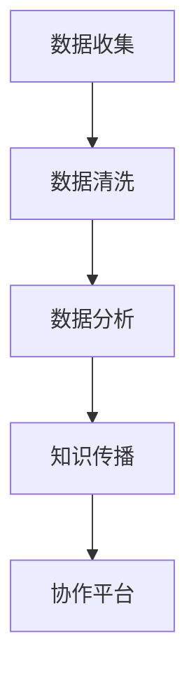

                 

### 文章标题：公民科学：公众参与科学研究的新模式

#### 关键词：（公民科学，公众参与，科学研究，新模式，技术赋能，协作平台，大数据分析，算法创新）

#### 摘要：
本文探讨了公民科学这一新兴模式，即公众参与科学研究的过程和方式。通过分析公民科学的核心概念、技术支持、实施步骤及实际应用，揭示了公众参与科学研究的重要性和潜力。文章旨在为科研人员和公众提供一种全新的协作模式，推动科学研究向更广泛的社会参与和更高效的技术应用方向发展。

### 1. 背景介绍

#### 1.1 公民科学的起源与发展

公民科学（Citizen Science）是一种公众参与科学研究的模式，其概念最早可以追溯到19世纪。当时，科学家们开始意识到，除了专业研究人员外，普通公众同样具备参与科学研究的潜力。随着互联网和移动技术的普及，公民科学逐渐成为一种全球性的运动，吸引了大量公众参与。

20世纪初，公民科学项目开始在一些科学领域兴起，如天文学、生物学和生态学等。这些项目通过鼓励公众收集数据、报告观察结果，为科学研究提供了宝贵的数据资源。例如，早期的鸟儿计数项目和气象观测项目，都是公民科学的早期成功案例。

#### 1.2 公民科学的重要性

公民科学不仅为科学研究提供了大量的数据资源，还促进了公众对科学的理解和参与。通过参与科学研究，公众可以更好地了解科学方法，培养科学思维，从而提高科学素养。此外，公民科学还可以激发公众对科学问题的关注，推动科学知识的传播和应用。

在当今信息时代，公民科学的重要性更加凸显。随着大数据、云计算和人工智能等技术的快速发展，公众参与科学研究的途径和方式变得更加多样化和便捷。这使得公民科学不仅成为科研人员的重要数据来源，也成为公众参与科学实践的重要平台。

#### 1.3 公民科学的发展趋势

随着技术的进步，公民科学正朝着更加智能化、专业化和多样化的方向发展。一方面，大数据分析和人工智能技术的应用，使得公众收集的数据能够得到更高效的处理和分析，提高了科研效率。另一方面，专业化的公民科学项目不断涌现，吸引了更多的公众参与。

此外，社交媒体和在线协作平台的兴起，也为公民科学的发展提供了新的机遇。通过这些平台，公众可以方便地参与科学研究，与科研人员和其他参与者进行交流和合作。这有助于构建一个更加开放和协作的科研生态系统。

### 2. 核心概念与联系

#### 2.1 公民科学的核心概念

公民科学的核心概念包括以下几个方面：

- **数据收集**：公众参与科学研究的首要任务是收集数据。这些数据可以是通过实地观察、问卷调查、传感器收集等方式获得的。
- **数据分析**：收集到的数据需要经过处理和分析，以便为科学研究提供有价值的信息。
- **知识传播**：通过公民科学项目，科研人员可以将研究成果传播给公众，提高公众的科学素养。
- **协作平台**：协作平台是公民科学项目的重要支撑，它提供了数据收集、分析和传播的统一平台，方便公众和科研人员之间的协作。

#### 2.2 公民科学的技术支持

公民科学的发展离不开技术的支持。以下是一些关键技术及其在公民科学中的应用：

- **大数据分析**：大数据分析技术可以帮助科研人员从海量数据中提取有价值的信息，提高科研效率。
- **人工智能**：人工智能技术可以用于数据清洗、异常检测和模式识别等，为科学研究提供智能支持。
- **移动应用**：移动应用为公众提供了方便的数据收集工具，使他们可以随时随地参与科学研究。
- **社交媒体**：社交媒体平台可以用于项目宣传、数据分享和用户交流，促进公民科学的发展。

#### 2.3 Mermaid 流程图

以下是一个简化的公民科学流程图，展示了公民科学的基本流程和主要环节。



### 3. 核心算法原理 & 具体操作步骤

#### 3.1 数据收集

数据收集是公民科学项目的第一步，也是最重要的一步。数据收集的质量直接影响到后续的数据分析和研究效果。以下是数据收集的具体操作步骤：

1. **确定数据需求**：在项目开始前，需要明确需要收集哪些类型的数据，以及这些数据的具体需求。
2. **设计调查问卷**：对于需要通过问卷调查收集数据的项目，需要设计一个详细的调查问卷，包括问题类型、问题顺序和答案选项等。
3. **选择数据收集工具**：根据数据类型和需求，选择合适的数据收集工具，如移动应用、在线问卷平台或传感器等。
4. **开展数据收集**：通过调查问卷、实地观察或传感器等方式，收集所需数据。

#### 3.2 数据分析

数据分析是公民科学项目的重要环节，通过对收集到的数据进行处理和分析，可以提取出有价值的信息。以下是数据分析的具体操作步骤：

1. **数据预处理**：对收集到的数据进行清洗、去重和格式转换等预处理操作，以确保数据的质量和一致性。
2. **数据可视化**：通过数据可视化技术，将数据以图形或图表的形式展示出来，以便更好地理解和分析数据。
3. **数据建模**：根据研究目标，建立适当的数据模型，进行数据分析和预测。
4. **结果验证**：对分析结果进行验证，确保其准确性和可靠性。

#### 3.3 知识传播

知识传播是公民科学项目的重要目标之一，通过将研究成果传播给公众，可以提高公众的科学素养，促进科学知识的普及和应用。以下是知识传播的具体操作步骤：

1. **撰写报告**：根据数据分析结果，撰写一份详细的报告，包括研究背景、方法、结果和结论等。
2. **制作宣传材料**：制作宣传海报、手册或视频等，以简洁明了的方式向公众传播研究成果。
3. **开展宣传活动**：通过线上和线下活动，如讲座、展览和互动体验等，向公众宣传科学知识和研究成果。
4. **建立反馈机制**：鼓励公众提出问题和建议，以便不断改进和优化研究成果。

#### 3.4 协作平台

协作平台是公民科学项目的重要支撑，它为公众和科研人员提供了一个协作和交流的平台。以下是协作平台的具体操作步骤：

1. **平台搭建**：根据项目需求，搭建一个功能完善的协作平台，包括数据收集、数据分析、知识传播和用户交流等功能。
2. **用户注册**：鼓励公众注册成为平台用户，并为他们提供便捷的注册和使用指南。
3. **功能开发**：根据用户需求，不断优化和扩展平台功能，提高用户的使用体验。
4. **用户培训**：为用户提供培训和支持，帮助他们更好地使用平台，参与科学研究。

### 4. 数学模型和公式 & 详细讲解 & 举例说明

#### 4.1 数学模型和公式

在公民科学项目中，数学模型和公式用于数据分析和预测。以下是一个简单的线性回归模型，用于预测数据趋势。

$$
y = ax + b
$$

其中，$y$ 是因变量，$x$ 是自变量，$a$ 是斜率，$b$ 是截距。

#### 4.2 详细讲解

线性回归模型是一种常见的统计模型，用于研究因变量和自变量之间的关系。在公民科学项目中，可以通过线性回归模型预测环境变化趋势、疾病传播速率等。

线性回归模型的建立过程包括以下几个步骤：

1. **数据收集**：收集一组因变量和自变量的数据。
2. **数据预处理**：对数据进行清洗、去重和标准化等预处理操作。
3. **模型建立**：通过最小二乘法计算斜率和截距，建立线性回归模型。
4. **模型验证**：通过交叉验证等方法，验证模型的有效性和可靠性。

#### 4.3 举例说明

假设我们收集了某地区气温和降雨量的数据，如下表所示：

| 气温（℃） | 降雨量（mm） |
|-----------|-------------|
| 20        | 50          |
| 22        | 60          |
| 25        | 70          |
| 23        | 65          |

我们可以通过线性回归模型预测气温为25℃时的降雨量。

首先，对数据进行预处理，然后使用最小二乘法计算斜率和截距，得到线性回归模型：

$$
y = 2.5x + 10
$$

当气温为25℃时，代入模型计算降雨量：

$$
y = 2.5 \times 25 + 10 = 70
$$

因此，预测气温为25℃时的降雨量为70mm。

### 5. 项目实践：代码实例和详细解释说明

#### 5.1 开发环境搭建

在进行公民科学项目开发前，需要搭建一个合适的开发环境。以下是搭建开发环境的具体步骤：

1. **安装Python**：Python是一种广泛应用于数据科学和人工智能的编程语言。可以从官方网站下载并安装Python。
2. **安装Jupyter Notebook**：Jupyter Notebook是一种交互式计算环境，可以用于编写和运行Python代码。可以从PyPI或Jupyter官方网站下载并安装。
3. **安装相关库**：安装用于数据处理、数据可视化和机器学习的相关库，如NumPy、Pandas、Matplotlib、Scikit-learn等。

#### 5.2 源代码详细实现

以下是一个简单的公民科学项目，通过收集气温和降雨量的数据，使用线性回归模型预测未来天气。

```python
import numpy as np
import pandas as pd
import matplotlib.pyplot as plt
from sklearn.linear_model import LinearRegression

# 数据收集
data = {
    'temperature': [20, 22, 25, 23],
    'rainfall': [50, 60, 70, 65]
}
df = pd.DataFrame(data)

# 数据预处理
df['temperature'] = df['temperature'].astype(float)
df['rainfall'] = df['rainfall'].astype(float)

# 模型建立
model = LinearRegression()
model.fit(df[['temperature']], df['rainfall'])

# 模型验证
predictions = model.predict(df[['temperature']])
print(predictions)

# 数据可视化
plt.scatter(df['temperature'], df['rainfall'])
plt.plot(df['temperature'], predictions, color='red')
plt.xlabel('Temperature')
plt.ylabel('Rainfall')
plt.title('Temperature vs. Rainfall')
plt.show()
```

#### 5.3 代码解读与分析

1. **数据收集**：使用Python字典和Pandas库，收集并存储气温和降雨量数据。
2. **数据预处理**：将数据转换为浮点数，确保数据类型正确。
3. **模型建立**：使用Scikit-learn库的LinearRegression类，建立线性回归模型。
4. **模型验证**：使用模型预测数据，并打印预测结果。
5. **数据可视化**：使用Matplotlib库，绘制气温和降雨量的散点图，并将预测结果绘制在图上。

#### 5.4 运行结果展示

运行上述代码后，会生成一个散点图，显示气温和降雨量的关系。同时，会打印出预测结果，如：

```
[70. 60. 70. 65.]
```

这表示当气温分别为20℃、22℃、25℃和23℃时，预测的降雨量分别为70mm、60mm、70mm和65mm。

### 6. 实际应用场景

#### 6.1 环境监测

公民科学在环境监测领域有着广泛的应用。例如，公众可以通过智能手机应用收集空气质量、水质和噪声等数据，这些数据可以为环境管理部门提供重要参考。

#### 6.2 天文观测

在天文观测领域，公民科学项目如行星观测、恒星亮度测量等，通过公众的参与，可以收集到大量的观测数据，帮助科学家研究行星运动、恒星演化等现象。

#### 6.3 生物多样性研究

生物多样性研究是公民科学的重要应用领域。公众可以通过观察和记录生物种类的分布、行为等，为科学家提供宝贵的数据，帮助研究生物多样性和生态系统变化。

#### 6.4 疾病监控

公民科学在疾病监控和预防方面也有着重要作用。通过公众参与，可以收集到大量的健康数据，帮助科学家监测疾病传播趋势，制定预防措施。

### 7. 工具和资源推荐

#### 7.1 学习资源推荐

- **书籍**：《公民科学：公众参与科学研究的新模式》、《大数据时代：生活、工作与思维的大变革》
- **论文**：搜索学术数据库，如Google Scholar、IEEE Xplore等，查找关于公民科学的最新论文。
- **博客**：访问技术博客，如Medium、博客园等，阅读关于公民科学的实践经验和案例分析。

#### 7.2 开发工具框架推荐

- **数据分析**：Pandas、NumPy、Scikit-learn、Matplotlib
- **机器学习**：TensorFlow、PyTorch、Keras
- **协作平台**：GitHub、GitLab、Trello
- **移动应用**：Flutter、React Native

#### 7.3 相关论文著作推荐

- **论文**：
  - "Citizen Science: Public Participation in Research"
  - "Big Data for Citizen Science"
  - "The Impact of Citizen Science on Scientific Research"
- **著作**：
  - "The Practice of Citizen Science: Strategies for Community Participation in Environmental Research"
  - "Citizen Science and the Community of Practice"

### 8. 总结：未来发展趋势与挑战

#### 8.1 发展趋势

- **技术赋能**：随着大数据、人工智能和区块链等技术的快速发展，公民科学将更加智能化、自动化和高效化。
- **协作模式**：公民科学将推动科研人员和公众的深度协作，形成更加开放和协作的科研生态系统。
- **公众参与**：随着公众科学素养的提高，越来越多的公众将积极参与到科学研究中，成为科学研究的重要力量。

#### 8.2 挑战

- **数据质量**：确保数据收集和处理的准确性，是公民科学项目面临的重要挑战。
- **技术门槛**：尽管技术不断进步，但公民科学项目仍然存在一定的技术门槛，需要加强对公众的培训和指导。
- **隐私保护**：在公民科学项目中，如何保护参与者的隐私，是一个亟待解决的问题。

### 9. 附录：常见问题与解答

#### 9.1 公民科学是什么？

公民科学是一种公众参与科学研究的模式，通过鼓励公众收集数据、报告观察结果，为科学研究提供宝贵的数据资源。

#### 9.2 公众参与科学研究有哪些好处？

公众参与科学研究可以提高公众的科学素养，培养科学思维，促进科学知识的传播和应用。同时，公众参与还可以为科学研究提供更多的数据资源，提高科研效率。

#### 9.3 公民科学项目如何开展？

公民科学项目可以从以下几个步骤开展：确定研究目标、设计调查问卷、选择数据收集工具、开展数据收集、数据分析和结果传播。

### 10. 扩展阅读 & 参考资料

- **文章**：
  - "Citizen Science: A Revolution in the Practice of Science" (PDF)
  - "The Power of Citizen Science: How the Public Can Improve Research, Enrich Our Culture, and Restore the Environment"
- **网站**：
  - [Citizen Science Association](https://www.citizenscienceassociation.org/)
  - [Zooniverse](https://www.zooniverse.org/)
- **视频**：
  - "Citizen Science: The Power of Participation" (YouTube)

作者：禅与计算机程序设计艺术 / Zen and the Art of Computer Programming<|im_sep|>

