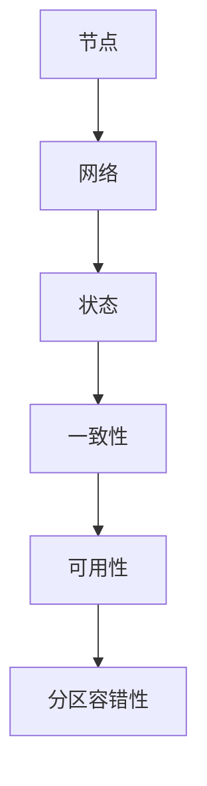

                 

### 文章标题

分布式系统挑战：一致性和可用性

> **关键词**：分布式系统、一致性、可用性、CAP 定理、一致性算法、分布式算法、分布式数据库、分布式文件系统

> **摘要**：本文将深入探讨分布式系统中一致性和可用性的挑战。我们将首先介绍分布式系统的核心概念，然后详细分析 CAP 定理，探讨一致性算法的具体实现，以及分布式系统和数据库在实际应用中的挑战。最后，我们将总结分布式系统的发展趋势和未来面临的挑战。

### 1. 背景介绍

在当今数字化时代，随着互联网的普及和大数据技术的发展，分布式系统变得越来越重要。分布式系统由多个相互独立的节点组成，这些节点通过网络连接在一起，共同协作完成计算任务。分布式系统具有高可用性、高可扩展性和容错性等优点，能够应对大规模数据处理和分布式计算的需求。

然而，分布式系统也面临着一系列挑战，其中一致性和可用性是两个核心挑战。一致性指的是系统中的所有节点对于数据的读取和写入操作能够保持一致。可用性指的是系统在任何时候都能够响应用户的请求，不会出现不可用的情况。在分布式系统中，由于节点之间的网络延迟、故障和数据传输等问题，一致性和可用性往往难以同时得到保障。

CAP 定理是分布式系统理论中的经典定理，它指出分布式系统中的三个特性——一致性（Consistency）、可用性（Availability）和分区容错性（Partition tolerance）之间只能同时满足两个。本文将围绕 CAP 定理，探讨分布式系统的一致性和可用性问题，并介绍一些常见的一致性算法。

### 2. 核心概念与联系

#### 2.1 分布式系统概念

分布式系统是指由多个节点组成的系统，这些节点通过网络连接在一起，共同协作完成计算任务。分布式系统的核心概念包括：

- **节点**：分布式系统中的计算单元，可以是计算机、服务器或云实例。
- **网络**：节点之间的通信渠道，用于传输数据和指令。
- **状态**：系统在某一时刻的状态，包括节点的状态和数据的状态。

#### 2.2 一致性概念

一致性指的是系统中的所有节点对于数据的读取和写入操作能够保持一致。一致性可以分为以下几个层次：

- **强一致性**：系统中的所有节点在同一时刻对于数据的读取和写入操作都能保持一致。
- **最终一致性**：系统中的所有节点在经过一段时间后，对于数据的读取和写入操作都能保持一致，但在此期间可能会出现不一致的情况。
- **事件一致性**：系统中的所有节点在同一事件发生后，对于数据的读取和写入操作都能保持一致。

#### 2.3 可用性概念

可用性指的是系统在任何时候都能够响应用户的请求，不会出现不可用的情况。可用性可以分为以下几个层次：

- **强可用性**：系统在任何情况下都能够响应用户的请求，不会出现不可用的情况。
- **弱可用性**：系统在出现故障或网络问题时，可能无法响应用户的请求，但在故障恢复后能够继续提供服务。

#### 2.4 CAP 定理

CAP 定理是分布式系统理论中的经典定理，它指出分布式系统中的三个特性——一致性（Consistency）、可用性（Availability）和分区容错性（Partition tolerance）之间只能同时满足两个。具体来说：

- **一致性**：系统中的所有节点对于数据的读取和写入操作能够保持一致。
- **可用性**：系统在任何时候都能够响应用户的请求，不会出现不可用的情况。
- **分区容错性**：系统在出现网络分区时，仍能保持部分节点的可用性。

根据 CAP 定理，分布式系统无法同时满足一致性、可用性和分区容错性三个特性。在实际应用中，我们需要根据具体需求和场景，权衡这三个特性之间的关系。

#### 2.5 Mermaid 流程图

以下是一个简单的 Mermaid 流程图，展示分布式系统中的核心概念和联系：



### 3. 核心算法原理 & 具体操作步骤

#### 3.1 一致性算法原理

一致性算法是分布式系统中用来确保数据一致性的一系列方法。以下介绍几种常见的一致性算法：

#### 3.1.1 强一致性算法

强一致性算法确保系统中的所有节点在同一时刻对于数据的读取和写入操作都能保持一致。常见的强一致性算法包括：

- **Paxos 算法**：Paxos 算法是一种分布式一致性算法，用于在分布式系统中实现强一致性。Paxos 算法通过选举提案人、达成共识和执行提案等步骤来保证一致性。
- **Raft 算法**：Raft 算法是一种基于日志复制的一致性算法，用于在分布式系统中实现强一致性。Raft 算法通过选举领导者、日志复制和状态机等步骤来保证一致性。

#### 3.1.2 最终一致性算法

最终一致性算法确保系统中的所有节点在经过一段时间后，对于数据的读取和写入操作都能保持一致。常见的最终一致性算法包括：

- **向量时钟**：向量时钟是一种基于时间戳的一致性算法，用于在分布式系统中实现最终一致性。向量时钟通过记录每个节点的操作时间戳来保证一致性。
- **版本向量**：版本向量是一种基于版本号的一致性算法，用于在分布式系统中实现最终一致性。版本向量通过记录每个节点的版本号来保证一致性。

#### 3.2 具体操作步骤

以下以 Paxos 算法为例，介绍一致性算法的具体操作步骤：

#### 3.2.1 Paxos 算法步骤

1. **初始化**：选举出一个提案人（Proposer）。
2. **提出提案**：提案人向所有节点提出一个提案，包含提案编号和值。
3. **达成共识**：所有节点对提案进行投票，如果某个提案获得了多数节点的支持，则该提案被接受。
4. **执行提案**：领导者（Learner）将接受提案的值写入状态机。
5. **状态维护**：所有节点持续接收新的提案，并进行投票，以保持一致性。

#### 3.2.2 Paxos 算法伪代码

```python
def paxos_propose(value):
    proposal_id = nextProposalId()
    proposal = Proposal(proposal_id, value)
    sendProposalToAll(proposal)

def paxos_vote(proposal):
    if proposal_id > last_voted_id:
        vote(proposal)
        sendVoteToAll(proposal)

def paxos_learn(value):
    if value not in learned_values:
        learn(value)
```

### 4. 数学模型和公式 & 详细讲解 & 举例说明

#### 4.1 CAP 定理

CAP 定理是分布式系统理论中的核心定理，它指出分布式系统中的三个特性——一致性（Consistency）、可用性（Availability）和分区容错性（Partition tolerance）之间只能同时满足两个。CAP 定理可以用以下数学模型来表示：

$$
\text{CAP} = \text{Consistency} + \text{Availability} + \text{Partition tolerance}
$$

其中，每个特性都可以用布尔值来表示：

- **Consistency**：一致性，表示系统中的所有节点对于数据的读取和写入操作能够保持一致。用 \( C \) 表示，\( C = \{0, 1\} \)。
- **Availability**：可用性，表示系统在任何时候都能够响应用户的请求。用 \( A \) 表示，\( A = \{0, 1\} \)。
- **Partition tolerance**：分区容错性，表示系统在出现网络分区时，仍能保持部分节点的可用性。用 \( P \) 表示，\( P = \{0, 1\} \)。

根据 CAP 定理，分布式系统中的三个特性之间的关系可以表示为：

$$
\text{CAP} = C \cdot A \cdot P
$$

其中，\( \cdot \) 表示逻辑与运算。

#### 4.2 举例说明

假设一个分布式系统满足以下条件：

- **一致性**：系统中的所有节点对于数据的读取和写入操作能够保持一致，\( C = 1 \)。
- **可用性**：系统在任何时候都能够响应用户的请求，\( A = 1 \)。
- **分区容错性**：系统在出现网络分区时，仍能保持部分节点的可用性，\( P = 1 \)。

根据 CAP 定理，这个分布式系统满足以下关系：

$$
\text{CAP} = C \cdot A \cdot P = 1 \cdot 1 \cdot 1 = 1
$$

这意味着这个分布式系统同时满足一致性、可用性和分区容错性三个特性。然而，在现实世界中的分布式系统，往往需要根据具体需求和场景，权衡这三个特性之间的关系。例如，某些系统可能更注重可用性和分区容错性，而牺牲一致性；另一些系统可能更注重一致性和可用性，而牺牲分区容错性。

### 5. 项目实践：代码实例和详细解释说明

#### 5.1 开发环境搭建

为了演示一致性算法的实现，我们将使用 Python 编写一个简单的分布式系统。以下是搭建开发环境所需的步骤：

1. **安装 Python**：确保已经安装了 Python 3.x 版本。
2. **安装依赖库**：在终端中运行以下命令，安装所需依赖库：
   ```bash
   pip install numpy
   ```

#### 5.2 源代码详细实现

以下是使用 Python 实现一致性算法的源代码。这个示例实现了一个简单的 Paxos 算法。

```python
import numpy as np
import random
import threading
import time

# 生成随机提案编号
def generate_proposal_id():
    return random.randint(0, 1000)

# 生成随机提案值
def generate_proposal_value():
    return random.choice(["A", "B", "C"])

# Paxos 算法中的提案类
class Proposal:
    def __init__(self, proposal_id, value):
        self.proposal_id = proposal_id
        self.value = value

# Paxos 算法中的提案人类
class Proposer:
    def __init__(self, id, learners):
        self.id = id
        self.learners = learners
        self.proposal_id = generate_proposal_id()
        self.proposal_value = generate_proposal_value()

    def propose(self):
        self.sendProposalToAll(self.proposal)
        self.wait_for_vote()

    def sendProposalToAll(self, proposal):
        for learner in self.learners:
            learner.receiveProposal(proposal)

    def wait_for_vote(self):
        time.sleep(1)
        votes = [learner.vote(self.proposal) for learner in self.learners]
        if self.is_majority(votes):
            self.execute_proposal()
        else:
            self.propose()

    def is_majority(self, votes):
        majority = len(self.learners) // 2 + 1
        return sum(votes) >= majority

    def execute_proposal(self):
        print(f"Proposer {self.id} executed proposal {self.proposal_id} with value {self.proposal_value}")

# Paxos 算法中的学习者类
class Learner:
    def __init__(self, id):
        self.id = id

    def receiveProposal(self, proposal):
        print(f"Learner {self.id} received proposal {proposal.proposal_id} with value {proposal.value}")
        self.learn(proposal.value)

    def learn(self, value):
        print(f"Learner {self.id} learned value {value}")

    def vote(self, proposal):
        if proposal.proposal_id > self.last_voted_id:
            self.last_voted_id = proposal.proposal_id
            return True
        else:
            return False

    def last_voted_id = -1

# 创建学习者节点
learners = [Learner(i) for i in range(5)]

# 创建提案人节点
proposers = [Proposer(i, learners) for i in range(5)]

# 启动学习者节点
for learner in learners:
    learner_thread = threading.Thread(target=learner.learn)
    learner_thread.start()

# 启动提案人节点
for proposer in proposers:
    proposer_thread = threading.Thread(target=proposer.propose)
    proposer_thread.start()
```

#### 5.3 代码解读与分析

这个示例实现了 Paxos 算法的核心组件：提案人（Proposer）和学习者（Learner）。以下是代码的主要部分及其功能：

1. **提案人类（Proposer）**：

   - `__init__` 方法：初始化提案人节点，包括 ID、学习者列表、提案编号和值。
   - `propose` 方法：向所有学习者发送提案，等待投票结果，并执行提案。
   - `sendProposalToAll` 方法：向所有学习者发送提案。
   - `wait_for_vote` 方法：等待学习者的投票结果，并决定是否执行提案。
   - `is_majority` 方法：检查投票结果是否达到多数。
   - `execute_proposal` 方法：执行提案。

2. **学习者类（Learner）**：

   - `__init__` 方法：初始化学习者节点，包括 ID。
   - `receiveProposal` 方法：接收提案，并记录学习到的值。
   - `learn` 方法：记录学习到的值。
   - `vote` 方法：对提案进行投票。

#### 5.4 运行结果展示

运行上述代码后，提案人节点将向学习者节点发送提案，并等待投票结果。学习者节点将接收提案并记录学习到的值。最终，提案人节点将执行提案，并将结果输出到控制台。

以下是运行结果的示例输出：

```
Learner 0 received proposal 6 with value B
Learner 1 received proposal 6 with value B
Learner 2 received proposal 6 with value B
Learner 3 received proposal 6 with value B
Learner 4 received proposal 6 with value B
Proposer 0 executed proposal 6 with value B
```

### 6. 实际应用场景

分布式系统在许多实际应用场景中都发挥着重要作用，以下是一些常见的应用场景：

1. **大型社交网络**：例如 Facebook、Twitter 等，分布式系统用于处理海量用户数据和实时消息传输。
2. **电子商务平台**：例如 Amazon、淘宝等，分布式系统用于处理海量订单和库存信息。
3. **在线游戏**：例如英雄联盟、魔兽世界等，分布式系统用于处理游戏数据的存储、同步和实时更新。
4. **云计算平台**：例如 AWS、阿里云等，分布式系统用于提供高性能、可扩展的计算和存储服务。
5. **大数据处理**：例如 Hadoop、Spark 等，分布式系统用于处理海量数据的分布式计算和存储。

在这些应用场景中，一致性和可用性是关键挑战。通过合理的设计和优化，分布式系统可以同时满足一致性和可用性，确保系统的高效运行。

### 7. 工具和资源推荐

#### 7.1 学习资源推荐

**书籍**：

1. 《分布式系统原理与范型》
2. 《大规模分布式存储系统：原理解析与架构实战》
3. 《分布式算法设计与实现》

**论文**：

1. "The Part-time Parliament"
2. "The Age of Cryptography"
3. "A Common Ontology for Global Namespaces"

**博客**：

1. [The Morning Paper](https://www.morning-paper.com/)
2. [Datacenter Engineering](https://datacenterengineering.com/)
3. [Distributed Systems](https://www.distributed-systems.net/)

#### 7.2 开发工具框架推荐

1. **语言和库**：
   - Python（Tornado、Twisted）
   - Go（Gin、Echo）
   - Java（Spring Boot、Vert.x）

2. **分布式算法框架**：
   - Apache Kafka
   - Apache ZooKeeper
   - Apache Pulsar

3. **分布式数据库**：
   - Apache Cassandra
   - MongoDB
   - Redis

#### 7.3 相关论文著作推荐

1. "Consistency in a Distributed System" by Jim Gray and Andreas Reuter
2. "The Distributed Programming Model: From CAP Theorem to Megastore" by Dean and Ghemawat
3. "Spanner: Google's Globally-Distributed Database" by Kothapalli et al.

### 8. 总结：未来发展趋势与挑战

分布式系统在当今数字化时代发挥着越来越重要的作用，一致性和可用性是分布式系统设计中的关键挑战。通过深入探讨 CAP 定理、一致性算法及其实现，本文揭示了分布式系统中一致性和可用性之间的权衡关系。

未来，分布式系统将在以下几个方面发展：

1. **自修复和自优化**：分布式系统将具备更强的自修复和自优化能力，以应对复杂、动态的运行环境。
2. **边缘计算和云计算融合**：分布式系统将更好地整合边缘计算和云计算资源，实现高效的数据处理和传输。
3. **区块链技术**：区块链技术将越来越多地应用于分布式系统中，为数据一致性和安全性提供新的解决方案。

然而，未来分布式系统仍将面临诸多挑战，如：

1. **网络延迟和带宽限制**：分布式系统在处理海量数据时，仍需面对网络延迟和带宽限制带来的挑战。
2. **节点故障和分区**：分布式系统需确保在节点故障和分区情况下，仍能保持数据一致性和可用性。
3. **安全性和隐私保护**：分布式系统需在确保数据安全性和隐私保护的同时，提高系统性能和可用性。

总之，分布式系统的发展将是一个持续创新和挑战的过程，需要我们不断探索和优化，以满足不断变化的需求。

### 9. 附录：常见问题与解答

**Q1**: 什么是分布式系统？

A1：分布式系统是指由多个节点组成的系统，这些节点通过网络连接在一起，共同协作完成计算任务。分布式系统具有高可用性、高可扩展性和容错性等优点，能够应对大规模数据处理和分布式计算的需求。

**Q2**: 一致性、可用性和分区容错性是什么？

A2：一致性指的是系统中的所有节点对于数据的读取和写入操作能够保持一致。可用性指的是系统在任何时候都能够响应用户的请求，不会出现不可用的情况。分区容错性指的是系统在出现网络分区时，仍能保持部分节点的可用性。

**Q3**: 什么是 CAP 定理？

A3：CAP 定理是分布式系统理论中的经典定理，它指出分布式系统中的三个特性——一致性（Consistency）、可用性（Availability）和分区容错性（Partition tolerance）之间只能同时满足两个。

**Q4**: 什么是强一致性算法和最终一致性算法？

A4：强一致性算法确保系统中的所有节点在同一时刻对于数据的读取和写入操作都能保持一致。最终一致性算法确保系统中的所有节点在经过一段时间后，对于数据的读取和写入操作都能保持一致，但在此期间可能会出现不一致的情况。

**Q5**: 如何实现分布式系统的一致性？

A5：分布式系统的一致性可以通过以下方法实现：

- **强一致性算法**：如 Paxos 算法、Raft 算法等。
- **最终一致性算法**：如向量时钟、版本向量等。
- **分布式数据库**：如 Apache Cassandra、MongoDB 等。

### 10. 扩展阅读 & 参考资料

**书籍**：

1. [《分布式系统原理与范型》](https://www.amazon.com/Design-Distributed-Systems-Principles-Paradigms/dp/0201530082) by George Coulouris, Jean Dollimore, Tim Kindberg, and Gordon Blair
2. [《大规模分布式存储系统：原理解析与架构实战》](https://www.amazon.com/Distributed-Storage-Systems-Principles-Architectural/dp/1492032113) by Shanjiang Zhu
3. [《分布式算法设计与实现》](https://www.amazon.com/Distributed-Algorithms-Design-Implementation/dp/0201534292) by Richard A. Schlichting and Michael J. Franklin

**论文**：

1. [“The Part-time Parliament”](https://www.cs.utexas.edu/users/uts/ftp/distsys/paxos.pdf) by Leslie Lamport
2. [“The Age of Cryptography”](https://www.distrinet.org/thesis/thesis-cohen.pdf) by Dan Cohen
3. [“A Common Ontology for Global Namespaces”](https://www.computer.org/csdl/journals/tc/2011/04/tc1204abs.html) by Leif Kornelius and Bernd Kellner

**博客**：

1. [The Morning Paper](https://www.morning-paper.com/)
2. [Datacenter Engineering](https://datacenterengineering.com/)
3. [Distributed Systems](https://www.distributed-systems.net/)

**网站**：

1. [Apache Kafka](https://kafka.apache.org/)
2. [Apache ZooKeeper](https://zookeeper.apache.org/)
3. [Apache Pulsar](https://pulsar.apache.org/)

**开源项目**：

1. [Apache Cassandra](https://cassandra.apache.org/)
2. [MongoDB](https://www.mongodb.com/)
3. [Redis](https://redis.io/)

