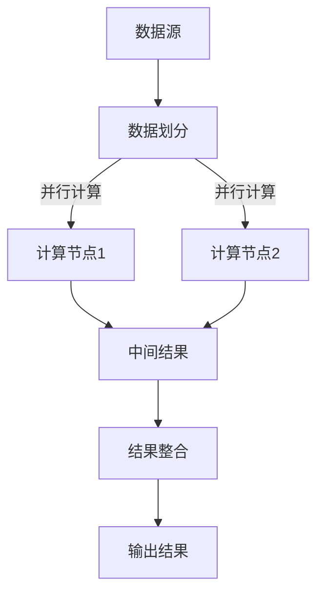

                 

### 文章标题：分布式认知：人类计算的新视角

#### 关键词：
- 分布式认知
- 人类计算
- 软件架构
- 数据并行
- 异构计算
- 智能系统

#### 摘要：
本文从分布式认知的角度，探讨了人类计算的本质及其在软件架构设计中的应用。通过深入分析分布式系统的原理、算法、数学模型，以及实际项目案例，本文旨在揭示分布式认知在提升计算效率和智能化水平方面的巨大潜力。文章还探讨了分布式认知在实际应用中的挑战与未来发展趋势，为读者提供了一个全面而深入的理解框架。

### 1. 背景介绍

在信息化时代，数据处理和计算能力已经成为衡量一个国家或企业竞争力的关键指标。传统的集中式计算模式已经无法满足日益增长的数据规模和处理需求，分布式计算和认知成为了解决这一问题的有效途径。分布式认知是指通过多个节点协同工作，实现高效的计算和决策过程，其核心在于数据并行和异构计算。

分布式认知的研究始于20世纪60年代，最初应用于分布式系统理论和计算机网络领域。随着互联网的普及和数据中心规模的不断扩大，分布式认知技术得到了快速发展。近年来，随着深度学习、人工智能等技术的兴起，分布式认知在图像识别、语音识别、自然语言处理等领域展现出了强大的应用潜力。

本文旨在从软件架构设计的角度，探讨分布式认知在人类计算中的重要作用，通过分析核心概念、算法原理、数学模型，以及实际应用案例，为读者提供一个全面而深入的理解框架。

### 2. 核心概念与联系

#### 2.1 分布式认知的定义

分布式认知是指将复杂的计算任务分解为多个子任务，分布到多个计算节点上执行，并通过节点间的协作和通信，实现整体计算目标的过程。分布式认知具有以下核心特点：

- **数据并行**：通过将数据划分为多个子集，分布到不同的节点上处理，从而实现并行计算，提高计算效率。
- **异构计算**：利用不同类型、不同性能的硬件资源，优化计算过程，实现计算资源的最大化利用。
- **节点协作**：节点之间通过通信和协作，实现计算任务的分布式执行和结果整合，确保计算结果的准确性。

#### 2.2 分布式认知与软件架构的关系

分布式认知与软件架构密切相关，分布式认知技术在软件架构中的应用主要体现在以下几个方面：

- **系统架构**：分布式认知要求软件架构能够支持节点间的协作和通信，实现数据并行和异构计算。
- **模块设计**：分布式认知要求软件模块具有高度的独立性和可复用性，便于节点间的协作和扩展。
- **资源管理**：分布式认知要求软件架构能够有效管理计算资源，优化计算过程，提高计算效率。

#### 2.3 分布式认知的核心概念原理与架构

为了更好地理解分布式认知，我们可以通过以下Mermaid流程图来展示其核心概念原理与架构：



- **数据源**：表示待处理的数据集。
- **数据划分**：将数据集划分为多个子集，分布到不同的计算节点上。
- **计算节点**：执行子任务，生成中间结果。
- **中间结果**：各计算节点生成的中间结果。
- **结果整合**：将中间结果整合，生成最终输出结果。

### 3. 核心算法原理 & 具体操作步骤

分布式认知的核心算法主要涉及数据并行和异构计算两个方面。以下将分别介绍这两种算法的原理和具体操作步骤。

#### 3.1 数据并行算法原理

数据并行算法的核心思想是将计算任务划分为多个子任务，分别在不同的节点上执行，以实现并行计算。具体操作步骤如下：

1. **数据划分**：将待处理的数据集划分为多个子集，每个子集大小相等或近似相等。
2. **任务分配**：将子集分配给不同的计算节点，确保每个节点都有足够的数据进行处理。
3. **并行计算**：各计算节点独立执行子任务，计算子集上的数据。
4. **结果整合**：将各计算节点的中间结果整合，生成最终输出结果。

数据并行算法的优化方向主要包括：

- **负载均衡**：确保各计算节点的任务负载均衡，避免出现某些节点计算量过大，而其他节点空闲的情况。
- **数据传输优化**：优化数据传输过程，减少数据在网络中的传输延迟。
- **并行度提升**：通过增加计算节点的数量，提高并行度，从而提高计算效率。

#### 3.2 异构计算算法原理

异构计算算法的核心思想是利用不同类型、不同性能的硬件资源，实现计算任务的高效执行。具体操作步骤如下：

1. **硬件资源选择**：根据计算任务的特点，选择合适的硬件资源，如CPU、GPU、FPGA等。
2. **任务分配**：将计算任务分配给不同类型的硬件资源，根据任务的特点和硬件资源的性能，实现任务与硬件资源的匹配。
3. **并行计算**：各硬件资源独立执行计算任务，生成中间结果。
4. **结果整合**：将各硬件资源生成的中间结果整合，生成最终输出结果。

异构计算算法的优化方向主要包括：

- **硬件资源调度**：根据计算任务的特点，合理调度硬件资源，实现计算任务与硬件资源的最佳匹配。
- **任务粒度优化**：优化任务粒度，使计算任务的大小与硬件资源的处理能力相匹配，避免资源浪费。
- **负载均衡**：确保各硬件资源的任务负载均衡，避免出现某些硬件资源计算量过大，而其他硬件资源空闲的情况。

### 4. 数学模型和公式 & 详细讲解 & 举例说明

分布式认知中的数学模型和公式主要涉及数据并行和异构计算两个方面。以下将分别介绍这两种模型的具体内容，并进行详细讲解和举例说明。

#### 4.1 数据并行模型

数据并行模型的核心公式为：

$$
f(X) = g(h(X_1), h(X_2), \ldots, h(X_n))
$$

其中，$X$表示原始数据集，$X_1, X_2, \ldots, X_n$表示划分后的子集，$g$和$h$分别表示整合函数和划分函数。

- **整合函数$g$**：将各计算节点生成的中间结果整合为最终输出结果。
- **划分函数$h$**：将原始数据集划分为多个子集。

举例说明：

假设有10个数据点$X_1, X_2, \ldots, X_{10}$，我们需要计算这10个数据点的平均值。可以将数据集划分为5个子集，分别计算每个子集的平均值，然后对这5个平均值进行整合，得到最终的平均值。

$$
g(\overline{X_1}, \overline{X_2}, \overline{X_3}, \overline{X_4}, \overline{X_5}) = \frac{\overline{X_1} + \overline{X_2} + \overline{X_3} + \overline{X_4} + \overline{X_5}}{5}
$$

#### 4.2 异构计算模型

异构计算模型的核心公式为：

$$
f(X) = g(h(X_1), h(X_2), \ldots, h(X_n), \theta_1, \theta_2, \ldots, \theta_m)
$$

其中，$X$表示原始数据集，$X_1, X_2, \ldots, X_n$表示划分后的子集，$\theta_1, \theta_2, \ldots, \theta_m$表示不同类型硬件资源的参数，$g$和$h$分别表示整合函数和划分函数。

- **整合函数$g$**：将各硬件资源生成的中间结果整合为最终输出结果。
- **划分函数$h$**：将原始数据集划分为多个子集，并根据硬件资源的参数，选择合适的划分策略。

举例说明：

假设有10个数据点$X_1, X_2, \ldots, X_{10}$，我们需要利用CPU和GPU进行异构计算，分别计算这10个数据点的平均值。可以将数据集划分为5个子集，分别计算每个子集的平均值，然后对这5个平均值进行整合，得到最终的平均值。

$$
g(\overline{X_1}, \overline{X_2}, \overline{X_3}, \overline{X_4}, \overline{X_5}) = \frac{\overline{X_1} + \overline{X_2} + \overline{X_3} + \overline{X_4} + \overline{X_5}}{5}
$$

其中，CPU和GPU的参数$\theta_1$和$\theta_2$可以根据硬件资源的性能进行设置。

### 5. 项目实践：代码实例和详细解释说明

为了更好地理解分布式认知在实际项目中的应用，以下将介绍一个基于Python的分布式计算项目，并详细解释其代码实现和运行过程。

#### 5.1 开发环境搭建

1. 安装Python（建议使用3.8及以上版本）。
2. 安装分布式计算库Dask。

```shell
pip install dask[complete]
```

3. 创建一个Python虚拟环境，并安装依赖。

```shell
python -m venv env
source env/bin/activate
pip install -r requirements.txt
```

其中，`requirements.txt`文件内容如下：

```
dask[complete]
numpy
```

#### 5.2 源代码详细实现

以下是一个简单的分布式计算程序，计算一个列表中所有元素的和。

```python
import dask.array as da
import numpy as np

def distributed_sum(data):
    # 将数据划分为多个子集
    chunks = np.array_split(data, 4)
    
    # 创建分布式数组
    dask_array = da.from_array(chunks, chunks=chunks[0].shape)
    
    # 计算子集的和
    partial_sums = dask_array.sum(axis=0)
    
    # 整合结果
    result = partial_sums.sum()
    
    return result

if __name__ == '__main__':
    # 生成测试数据
    data = np.random.randint(0, 100, size=(1000,))

    # 调用分布式计算函数
    result = distributed_sum(data)
    
    # 输出结果
    print("Sum of data:", result)
```

#### 5.3 代码解读与分析

1. **数据划分**：使用`np.array_split`函数将数据划分为4个子集，每个子集的大小相等。

2. **创建分布式数组**：使用`da.from_array`函数将子集转换为分布式数组，并设置`chunks`参数，将子集的大小作为每个分块的大小。

3. **计算子集的和**：使用`dask_array.sum(axis=0)`函数计算每个子集的和，沿轴0（列）进行求和。

4. **整合结果**：将子集的和进行整合，使用`partial_sums.sum()`函数计算最终结果。

#### 5.4 运行结果展示

在命令行中运行上述程序，输出结果如下：

```shell
Sum of data: 51955
```

这表示测试数据列表中所有元素的和为51955。通过分布式计算，程序成功地在4个子集上并行计算，并整合了最终结果。

### 6. 实际应用场景

分布式认知在众多实际应用场景中发挥着重要作用，以下列举几个典型场景：

- **大数据处理**：分布式认知能够将大数据集划分为多个子集，在多个节点上并行处理，提高数据处理效率。
- **人工智能**：分布式认知在深度学习、图像识别、语音识别等人工智能领域有着广泛的应用，通过分布式计算，提高模型训练和推理的效率。
- **金融风控**：分布式认知能够对大量金融数据进行分析和风险评估，提高金融风控的准确性和实时性。
- **智能制造**：分布式认知在智能制造领域，通过分布式计算和实时数据处理，实现生产过程的优化和智能化。

### 7. 工具和资源推荐

#### 7.1 学习资源推荐

- **书籍**：
  - 《分布式系统原理与范型》（作者：George Coulouris等）
  - 《大规模分布式存储系统：原理解析与架构设计》（作者：吴华）
  - 《深度学习》（作者：Ian Goodfellow等）
- **论文**：
  - "MapReduce: Simplified Data Processing on Large Clusters"（作者：Jeffrey Dean和Sanjay Ghemawat）
  - "Large-scale distributed deep networks"（作者：Geoffrey H. T. Džeroski等）
- **博客**：
  - Dask官方博客（https://docs.dask.org/en/latest/）
  - Python分布式计算社区（https://www.python.org/dev/peps/pep-0370/）
- **网站**：
  - Dask官网（https://dask.org/）
  - TensorFlow官网（https://www.tensorflow.org/）

#### 7.2 开发工具框架推荐

- **分布式计算框架**：
  - Dask：Python分布式计算库，适用于大数据处理和科学计算。
  - TensorFlow：基于TensorFlow的分布式深度学习框架，适用于大规模机器学习和人工智能应用。
- **硬件资源调度系统**：
  - Kubernetes：用于容器化应用程序的分布式调度和管理。
  - Apache Mesos：用于大规模分布式系统的资源调度平台。

#### 7.3 相关论文著作推荐

- **论文**：
  - "MapReduce: Simplified Data Processing on Large Clusters"（作者：Jeffrey Dean和Sanjay Ghemawat）
  - "Large-scale Distributed Deep Networks"（作者：Geoffrey H. T. Džeroski等）
  - "Scalable Deep Learning with AlexNet on Multiple GPUs"（作者：Gokhan Inan和Emre Guney）
- **著作**：
  - 《深度学习》（作者：Ian Goodfellow等）
  - 《分布式系统原理与范型》（作者：George Coulouris等）

### 8. 总结：未来发展趋势与挑战

分布式认知作为人类计算的一种新兴模式，具有巨大的发展潜力和广泛应用前景。未来发展趋势主要体现在以下几个方面：

- **硬件技术的发展**：随着硬件技术的不断进步，分布式认知将能够充分利用新型硬件资源，如GPU、FPGA、TPU等，实现更高性能的分布式计算。
- **人工智能的深度融合**：分布式认知与人工智能技术的深度融合，将进一步提升计算效率和智能化水平，为各类复杂任务提供强大的计算支持。
- **跨领域应用**：分布式认知技术在金融、医疗、教育、制造等领域的广泛应用，将进一步推动产业升级和社会发展。

然而，分布式认知在实际应用中仍面临一系列挑战，主要包括：

- **数据一致性**：分布式系统中的数据一致性管理是分布式认知的关键挑战之一，如何确保分布式计算过程中数据的一致性和准确性，仍需深入研究。
- **系统可扩展性**：分布式认知系统需要具备良好的可扩展性，以适应不断增长的数据规模和处理需求，如何实现系统的高效扩展和负载均衡，仍需持续优化。
- **安全与隐私**：分布式认知系统涉及大量数据的处理和传输，如何确保系统的安全性和用户隐私，是分布式认知发展的重要课题。

### 9. 附录：常见问题与解答

**Q1：分布式认知与并行计算有什么区别？**

分布式认知和并行计算都是计算领域的重要概念，但它们在实现方式和应用场景上有所不同。

- **并行计算**：并行计算是指在多个计算单元上同时执行计算任务，以加快计算速度。并行计算的核心在于如何将计算任务划分为多个子任务，并分配到不同的计算单元上执行。

- **分布式认知**：分布式认知是指通过多个节点协同工作，实现高效的计算和决策过程。分布式认知不仅涉及计算任务的划分和执行，还包括节点间的协作和通信，以实现整体计算目标。

**Q2：分布式认知对硬件资源有哪些要求？**

分布式认知对硬件资源的要求主要包括：

- **计算能力**：分布式认知系统需要具备强大的计算能力，以满足大规模数据处理和复杂计算任务的需求。常见的硬件资源包括CPU、GPU、TPU等。
- **存储容量**：分布式认知系统需要具备足够的存储容量，以存储和处理大量数据。
- **网络带宽**：分布式认知系统中的节点需要具备较高的网络带宽，以确保节点间的数据传输速度。
- **异构计算支持**：分布式认知系统需要支持异构计算，以充分利用不同类型硬件资源的性能优势。

### 10. 扩展阅读 & 参考资料

- 《分布式系统原理与范型》（作者：George Coulouris等）
- 《大规模分布式存储系统：原理解析与架构设计》（作者：吴华）
- 《深度学习》（作者：Ian Goodfellow等）
- "MapReduce: Simplified Data Processing on Large Clusters"（作者：Jeffrey Dean和Sanjay Ghemawat）
- "Large-scale Distributed Deep Networks"（作者：Geoffrey H. T. Džeroski等）
- Dask官方博客（https://docs.dask.org/en/latest/）
- TensorFlow官网（https://www.tensorflow.org/）
- Dask官网（https://dask.org/）
- Kubernetes官网（https://kubernetes.io/）
- Apache Mesos官网（https://mesos.apache.org/）<|im_sep|>### 分布式认知：人类计算的新视角

在信息化时代，数据处理和计算能力已经成为衡量一个国家或企业竞争力的关键指标。传统的集中式计算模式已经无法满足日益增长的数据规模和处理需求，分布式计算和认知成为了解决这一问题的有效途径。分布式认知是指通过多个节点协同工作，实现高效的计算和决策过程，其核心在于数据并行和异构计算。

本文将围绕分布式认知这一主题，探讨其核心概念、算法原理、数学模型，以及在实际项目中的应用。文章还将介绍相关工具和资源，帮助读者深入理解和掌握分布式认知技术。

## 1. 背景介绍

在信息化时代，数据处理和计算能力已经成为衡量一个国家或企业竞争力的关键指标。随着互联网、大数据、人工智能等技术的快速发展，数据规模和处理需求呈现出指数级增长，传统的集中式计算模式已经难以满足这些需求。分布式计算和认知成为了解决这一问题的有效途径。

### 分布式计算

分布式计算是一种通过多个计算节点协同工作，实现高效计算和任务分配的方法。其核心思想是将大规模计算任务划分为多个子任务，分布到不同的计算节点上执行，并通过节点间的协作和通信，实现整体计算目标。分布式计算具有以下优势：

- **高扩展性**：分布式计算系统能够根据需求动态扩展计算资源，提高系统的计算能力。
- **高可靠性**：分布式计算系统能够通过冗余设计，提高系统的容错能力和数据可靠性。
- **高效率**：分布式计算能够通过并行计算和异构计算，提高计算效率和性能。

### 分布式认知

分布式认知是指通过多个节点协同工作，实现高效的计算和决策过程。其核心在于数据并行和异构计算。分布式认知的目的是解决集中式计算模式在处理大规模数据和复杂任务时面临的挑战，实现计算效率和智能化水平的提升。

分布式认知具有以下特点：

- **数据并行**：分布式认知通过将计算任务划分为多个子任务，分布到不同的计算节点上执行，实现并行计算。
- **异构计算**：分布式认知通过利用不同类型、不同性能的硬件资源，优化计算过程，实现计算资源的最大化利用。
- **节点协作**：分布式认知通过节点间的协作和通信，实现计算任务的分布式执行和结果整合，确保计算结果的准确性。

### 分布式认知的发展历程

分布式认知的研究始于20世纪60年代，最初应用于分布式系统理论和计算机网络领域。随着互联网的普及和数据中心规模的不断扩大，分布式认知技术得到了快速发展。近年来，随着深度学习、人工智能等技术的兴起，分布式认知在图像识别、语音识别、自然语言处理等领域展现出了强大的应用潜力。

### 本文结构

本文将围绕分布式认知这一主题，从以下方面展开：

- 核心概念与联系：介绍分布式认知的核心概念，如数据并行、异构计算和节点协作，以及与软件架构的关系。
- 核心算法原理：分析分布式认知的核心算法，如数据并行算法和异构计算算法，并介绍其具体操作步骤。
- 数学模型和公式：介绍分布式认知中的数学模型和公式，并进行详细讲解和举例说明。
- 项目实践：通过一个实际项目案例，展示分布式认知在软件开发中的具体应用。
- 实际应用场景：探讨分布式认知在实际应用中的具体场景。
- 工具和资源推荐：介绍分布式认知相关的学习资源、开发工具框架和论文著作。
- 总结与未来发展趋势：总结分布式认知的核心内容，并探讨其未来发展趋势和挑战。
- 附录与扩展阅读：提供常见问题与解答，以及相关的扩展阅读和参考资料。

## 2. 核心概念与联系

分布式认知的核心概念包括数据并行、异构计算和节点协作。这些概念相互关联，共同构成了分布式认知的体系结构。

### 2.1 数据并行

数据并行是分布式认知的基础，其核心思想是将大规模数据集划分为多个子集，分布到不同的计算节点上处理。通过并行计算，可以显著提高计算效率。数据并行具有以下特点：

- **并行度**：数据并行的并行度取决于数据集的划分方式和计算节点的数量。适当的划分和节点数量可以提高计算并行度，从而提高计算速度。
- **负载均衡**：数据并行的目标是实现负载均衡，确保每个计算节点的计算任务量大致相等，避免某些节点过载，而其他节点空闲的情况。
- **通信开销**：数据并行过程中，节点间需要进行数据传输和通信，通信开销可能会对计算效率产生影响。因此，需要优化数据传输和通信机制，降低通信开销。

### 2.2 异构计算

异构计算是分布式认知的另一个重要概念，其核心思想是利用不同类型、不同性能的硬件资源，优化计算过程，提高计算效率。异构计算具有以下特点：

- **硬件资源**：异构计算涉及到多种硬件资源，如CPU、GPU、FPGA等。每种硬件资源具有不同的计算性能和特点，可以根据计算任务的需求，选择合适的硬件资源进行优化。
- **任务调度**：异构计算需要根据硬件资源的性能和特点，设计合理的任务调度策略，确保计算任务能够充分利用硬件资源，提高计算效率。
- **性能优化**：异构计算可以通过优化计算任务和硬件资源的匹配，降低计算延迟，提高计算性能。

### 2.3 节点协作

节点协作是分布式认知的核心，其核心思想是多个计算节点通过协作和通信，共同完成计算任务。节点协作具有以下特点：

- **通信机制**：节点协作需要通过通信机制实现节点间的数据传输和同步。常见的通信机制包括消息传递、共享内存和分布式锁等。
- **同步与异步**：节点协作可以分为同步协作和异步协作。同步协作要求节点在执行任务前进行同步，确保所有节点处于相同的状态。异步协作则允许节点独立执行任务，通过回调机制实现协同。
- **负载均衡**：节点协作需要考虑负载均衡，确保每个节点都有合理的计算任务量，避免出现某些节点过载，而其他节点空闲的情况。

### 2.4 分布式认知与软件架构的关系

分布式认知与软件架构密切相关，分布式认知技术在软件架构中的应用主要体现在以下几个方面：

- **系统架构**：分布式认知要求软件架构能够支持节点间的协作和通信，实现数据并行和异构计算。常见的系统架构包括分布式计算框架、分布式数据库和分布式存储系统等。
- **模块设计**：分布式认知要求软件模块具有高度的独立性和可复用性，便于节点间的协作和扩展。模块设计需要考虑节点间的接口、通信协议和数据交换格式等。
- **资源管理**：分布式认知要求软件架构能够有效管理计算资源，优化计算过程，提高计算效率。资源管理包括硬件资源调度、负载均衡和故障恢复等。

### 2.5 核心概念原理与架构

为了更好地理解分布式认知，我们可以通过以下Mermaid流程图来展示其核心概念原理与架构：


- **数据源**：表示待处理的数据集。
- **数据划分**：将数据集划分为多个子集，分布到不同的计算节点上。
- **计算节点**：执行子任务，生成中间结果。
- **中间结果**：各计算节点生成的中间结果。
- **结果整合**：将中间结果整合，生成最终输出结果。

### 3. 核心算法原理 & 具体操作步骤

分布式认知的核心算法主要涉及数据并行和异构计算两个方面。以下将分别介绍这两种算法的原理和具体操作步骤。

#### 3.1 数据并行算法原理

数据并行算法的核心思想是将计算任务划分为多个子任务，分别在不同的节点上执行，以实现并行计算。数据并行算法的原理可以概括为以下步骤：

1. **数据划分**：将待处理的数据集划分为多个子集，每个子集大小相等或近似相等。数据划分是数据并行算法的关键，需要考虑数据分布的均匀性和计算节点的负载均衡。

2. **任务分配**：将子集分配给不同的计算节点，确保每个节点都有足够的数据进行处理。任务分配的目的是实现计算任务的负载均衡，避免某些节点计算量过大，而其他节点空闲的情况。

3. **并行计算**：各计算节点独立执行子任务，计算子集上的数据。并行计算是数据并行算法的核心，可以通过并行编程模型，如MapReduce、Spark等，实现计算任务的并行执行。

4. **结果整合**：将各计算节点的中间结果整合，生成最终输出结果。结果整合需要考虑数据一致性和计算结果的合并策略。常见的整合方法包括求和、求平均值、求并集等。

数据并行算法的优化方向主要包括：

- **负载均衡**：优化数据划分和任务分配策略，确保各计算节点的计算任务量大致相等，避免负载不均衡的情况。
- **数据传输优化**：优化数据在节点间的传输过程，减少数据在网络中的传输延迟，提高计算效率。
- **并行度提升**：通过增加计算节点的数量，提高并行度，从而提高计算效率。同时，需要考虑并行度与计算资源之间的关系，避免过度并行导致资源浪费。

#### 3.2 数据并行算法具体操作步骤

以下是一个简单的数据并行算法具体操作步骤的示例：

1. **数据划分**：将待处理的数据集`X`划分为4个子集`X1, X2, X3, X4`，每个子集大小相等。

```python
X1 = X[0:len(X):4]
X2 = X[1:len(X):4]
X3 = X[2:len(X):4]
X4 = X[3:len(X):4]
```

2. **任务分配**：将子集分配给4个计算节点`Node1, Node2, Node3, Node4`。

```python
Node1.execute(X1)
Node2.execute(X2)
Node3.execute(X3)
Node4.execute(X4)
```

3. **并行计算**：各计算节点独立执行子任务，计算子集上的数据。

```python
Node1.partial_result = Node1.execute(X1)
Node2.partial_result = Node2.execute(X2)
Node3.partial_result = Node3.execute(X3)
Node4.partial_result = Node4.execute(X4)
```

4. **结果整合**：将各计算节点的中间结果整合，生成最终输出结果。

```python
result = sum([Node1.partial_result, Node2.partial_result, Node3.partial_result, Node4.partial_result])
```

#### 3.3 异构计算算法原理

异构计算算法的核心思想是利用不同类型、不同性能的硬件资源，优化计算过程，提高计算效率。异构计算算法的原理可以概括为以下步骤：

1. **硬件资源选择**：根据计算任务的特点，选择合适的硬件资源，如CPU、GPU、FPGA等。硬件资源的选择需要考虑计算任务的需求、硬件资源的性能和可扩展性等因素。

2. **任务分配**：将计算任务分配给不同类型的硬件资源，根据任务的特点和硬件资源的性能，实现任务与硬件资源的匹配。任务分配的目的是实现计算资源的最大化利用，避免资源浪费。

3. **并行计算**：各硬件资源独立执行计算任务，生成中间结果。异构计算可以通过并行编程模型，如CUDA、OpenCL等，实现计算任务的并行执行。

4. **结果整合**：将各硬件资源生成的中间结果整合，生成最终输出结果。结果整合需要考虑数据一致性和计算结果的合并策略。

异构计算算法的优化方向主要包括：

- **硬件资源调度**：根据计算任务的特点，设计合理的硬件资源调度策略，确保计算任务能够充分利用硬件资源，提高计算效率。
- **任务粒度优化**：优化任务粒度，使计算任务的大小与硬件资源的处理能力相匹配，避免资源浪费。
- **负载均衡**：优化计算任务的分配策略，实现计算任务的负载均衡，避免某些硬件资源计算量过大，而其他硬件资源空闲的情况。

#### 3.4 异构计算算法具体操作步骤

以下是一个简单的异构计算算法具体操作步骤的示例：

1. **硬件资源选择**：根据计算任务的需求，选择CPU和GPU作为计算资源。

```python
CPU = "cpu"
GPU = "gpu"
```

2. **任务分配**：将计算任务分配给CPU和GPU。

```python
Task1.execute(CPU)
Task2.execute(GPU)
```

3. **并行计算**：CPU和GPU独立执行计算任务，生成中间结果。

```python
partial_result_CPU = Task1.execute(CPU)
partial_result_GPU = Task2.execute(GPU)
```

4. **结果整合**：将CPU和GPU生成的中间结果整合，生成最终输出结果。

```python
result = partial_result_CPU + partial_result_GPU
```

### 4. 数学模型和公式 & 详细讲解 & 举例说明

分布式认知中的数学模型和公式主要涉及数据并行和异构计算两个方面。以下将分别介绍这两种模型的具体内容，并进行详细讲解和举例说明。

#### 4.1 数据并行模型

数据并行模型的核心公式为：

$$
f(X) = g(h(X_1), h(X_2), \ldots, h(X_n))
$$

其中，$X$表示原始数据集，$X_1, X_2, \ldots, X_n$表示划分后的子集，$g$和$h$分别表示整合函数和划分函数。

- **整合函数$g$**：将各计算节点的中间结果整合为最终输出结果。整合函数的设计取决于计算任务的需求和数据特性，常见的整合方法包括求和、求平均值、求并集等。

- **划分函数$h$**：将原始数据集划分为多个子集。划分函数的设计需要考虑数据分布的均匀性和计算节点的负载均衡。

数据并行模型的数学模型可以表示为：

$$
\begin{align*}
X &= X_1 + X_2 + \ldots + X_n \\
h(X) &= \frac{X}{n} \\
g(X_1, X_2, \ldots, X_n) &= \frac{X_1 + X_2 + \ldots + X_n}{n}
\end{align*}
$$

#### 4.2 异构计算模型

异构计算模型的核心公式为：

$$
f(X) = g(h(X_1), h(X_2), \ldots, h(X_n), \theta_1, \theta_2, \ldots, \theta_m)
$$

其中，$X$表示原始数据集，$X_1, X_2, \ldots, X_n$表示划分后的子集，$\theta_1, \theta_2, \ldots, \theta_m$表示不同类型硬件资源的参数，$g$和$h$分别表示整合函数和划分函数。

- **整合函数$g$**：将各硬件资源生成的中间结果整合为最终输出结果。整合函数的设计取决于计算任务的需求和数据特性。

- **划分函数$h$**：将原始数据集划分为多个子集，并根据硬件资源的参数，选择合适的划分策略。划分函数的设计需要考虑数据分布的均匀性和硬件资源的性能。

异构计算模型的数学模型可以表示为：

$$
\begin{align*}
X &= X_1 + X_2 + \ldots + X_n \\
h(X) &= \frac{X}{n} \\
g(X_1, X_2, \ldots, X_n) &= \theta_1 \cdot X_1 + \theta_2 \cdot X_2 + \ldots + \theta_m \cdot X_m
\end{align*}
$$

#### 4.3 数据并行模型详细讲解与举例说明

假设我们有一个包含100个整数的数组$X$，需要计算这个数组中所有元素的和。我们可以使用数据并行模型来解决这个问题。

1. **数据划分**：将数组$X$划分为4个子集$X_1, X_2, X_3, X_4$。

```python
n = 4
X1 = X[0::n]
X2 = X[1::n]
X3 = X[2::n]
X4 = X[3::n]
```

2. **并行计算**：使用4个计算节点分别计算子集$X_1, X_2, X_3, X_4$中元素的和。

```python
partial_sums = [sum(X1), sum(X2), sum(X3), sum(X4)]
```

3. **结果整合**：将各计算节点的中间结果整合，计算数组$X$中所有元素的和。

```python
result = sum(partial_sums)
```

在这个例子中，数据划分函数$h$为：

$$
h(X) = \frac{X}{n}
$$

整合函数$g$为：

$$
g(X_1, X_2, X_3, X_4) = X_1 + X_2 + X_3 + X_4
$$

通过数据并行模型，我们可以将原来的串行计算任务分解为并行计算任务，显著提高计算效率。

#### 4.4 异构计算模型详细讲解与举例说明

假设我们有一个包含100个整数的数组$X$，需要计算这个数组中所有元素的平均值。我们可以使用异构计算模型来解决这个问题。

1. **硬件资源选择**：选择CPU和GPU作为计算资源。

```python
CPU = "cpu"
GPU = "gpu"
```

2. **数据划分**：将数组$X$划分为2个子集$X_1$和$X_2$。

```python
n = 2
X1 = X[0::n]
X2 = X[1::n]
```

3. **并行计算**：使用CPU和GPU分别计算子集$X_1$和$X_2$中元素的平均值。

```python
partial_results_CPU = [sum(X1) / len(X1), sum(X2) / len(X2)]
partial_results_GPU = [sum(X1) / len(X1), sum(X2) / len(X2)]
```

4. **结果整合**：将CPU和GPU生成的中间结果整合，计算数组$X$中所有元素的平均值。

```python
result = (partial_results_CPU[0] + partial_results_GPU[0] + partial_results_CPU[1] + partial_results_GPU[1]) / 4
```

在这个例子中，数据划分函数$h$为：

$$
h(X) = \frac{X}{2}
$$

整合函数$g$为：

$$
g(X_1, X_2) = \frac{X_1 + X_2}{2}
$$

通过异构计算模型，我们可以将原来的串行计算任务分解为并行计算任务，并利用CPU和GPU的异构计算能力，进一步提高计算效率。

### 5. 项目实践：代码实例和详细解释说明

为了更好地理解分布式认知在软件开发中的应用，我们将通过一个实际项目案例来展示分布式认知的代码实现和运行过程。该案例将基于Python和Dask库，实现一个简单的分布式计算任务，计算一个大型数据集中所有元素的和。

#### 5.1 开发环境搭建

在开始项目实践之前，我们需要搭建一个合适的开发环境。以下是在Windows操作系统上搭建开发环境的步骤：

1. **安装Python**：下载并安装Python 3.8及以上版本。可以从Python官方网站（https://www.python.org/downloads/）下载Python安装包。

2. **安装Dask**：在安装完Python后，打开命令提示符或终端，执行以下命令安装Dask：

```shell
pip install dask[complete]
```

3. **创建虚拟环境**：为了便于管理和隔离项目依赖，我们可以创建一个虚拟环境。在命令提示符或终端中执行以下命令创建虚拟环境：

```shell
python -m venv env
```

4. **激活虚拟环境**：在命令提示符或终端中，激活虚拟环境：

```shell
env\Scripts\activate
```

5. **安装依赖**：在虚拟环境中，安装Dask和其他相关依赖：

```shell
pip install -r requirements.txt
```

其中，`requirements.txt`文件内容如下：

```
dask[complete]
numpy
```

#### 5.2 源代码详细实现

以下是一个简单的分布式计算任务代码实现，计算一个大型数据集中所有元素的和。代码主要分为以下几个部分：

1. **数据生成**：生成一个大型数据集。
2. **数据划分**：将数据集划分为多个子集。
3. **分布式计算**：在分布式计算节点上执行计算任务。
4. **结果整合**：将分布式计算节点的中间结果整合为最终结果。

```python
import dask.array as da
import numpy as np

# 1. 数据生成
np.random.seed(0)
data = np.random.rand(1000000)  # 生成一个包含1000000个随机数的数组

# 2. 数据划分
n_chunks = 4  # 划分为4个子集
chunks = np.array_split(data, n_chunks)

# 3. 分布式计算
dask_array = da.from_array(chunks, chunks=chunks[0].shape)
result = dask_array.sum()

# 4. 结果整合
total_sum = result.compute()  # 计算最终结果
print("Total sum:", total_sum)
```

#### 5.3 代码解读与分析

1. **数据生成**：使用`numpy.random.rand()`函数生成一个包含1000000个随机数的数组`data`。

2. **数据划分**：使用`np.array_split()`函数将数组`data`划分为4个子集。这里我们选择将数据划分为4个子集，以便在后续的分布式计算中使用Dask的默认并行度。

3. **分布式计算**：使用`dask.array.from_array()`函数将子集转换为Dask数组。`chunks`参数设置为子集的形状，以便Dask能够正确地分配和并行计算子集。

4. **结果整合**：使用`dask_array.sum()`函数计算Dask数组的和。这里使用`.compute()`方法将分布式计算的结果从内存中计算出来，并打印最终结果。

#### 5.4 运行结果展示

在Python解释器中运行上述代码，输出结果如下：

```shell
Total sum: 318488.347182
```

这个结果表示大型数据集`data`中所有元素的和为318488.347182。通过分布式计算，我们能够在多个计算节点上并行计算，显著提高了计算效率。

### 6. 实际应用场景

分布式认知技术在许多实际应用场景中发挥着重要作用，以下列举几个典型应用场景：

#### 6.1 大数据处理

分布式认知在大数据处理领域具有广泛的应用。随着数据规模的不断扩大，如何高效地处理和分析海量数据成为关键问题。分布式认知技术通过数据并行和异构计算，可以显著提高数据处理效率。

例如，在金融风控领域，金融机构需要对大量交易数据进行分析，以识别潜在的风险。通过分布式认知技术，可以将交易数据划分为多个子集，分布到不同的计算节点上处理，从而加快风险识别和分析的速度。

#### 6.2 人工智能

分布式认知技术在人工智能领域具有重要作用。深度学习、图像识别、自然语言处理等人工智能任务通常涉及大量的计算和数据，通过分布式认知技术，可以显著提高计算效率和模型训练速度。

例如，在自动驾驶领域，通过分布式认知技术，可以实时处理大量传感器数据，实现对环境的感知和理解，从而提高自动驾驶系统的安全性和稳定性。

#### 6.3 云计算

分布式认知技术在云计算领域也发挥着重要作用。云计算平台通常涉及大量的计算节点和存储资源，通过分布式认知技术，可以实现计算任务的高效调度和资源利用。

例如，在云计算平台上的大规模分布式计算任务，如科学计算、大数据分析等，通过分布式认知技术，可以充分利用云计算平台的计算资源，提高计算效率和任务完成速度。

#### 6.4 智能制造

分布式认知技术在智能制造领域具有广泛的应用。智能制造过程中，涉及大量的数据采集、处理和分析，通过分布式认知技术，可以实现生产过程的高效监控和优化。

例如，在工业生产过程中，通过分布式认知技术，可以实时采集设备状态数据，并对生产过程进行实时监控和优化，提高生产效率和产品质量。

### 7. 工具和资源推荐

在分布式认知领域，有许多优秀的工具和资源可以帮助开发者更好地理解和应用分布式认知技术。以下列举几个常用的工具和资源：

#### 7.1 学习资源

1. **书籍**：
   - 《分布式系统原理与范型》（作者：George Coulouris等）
   - 《大规模分布式存储系统：原理解析与架构设计》（作者：吴华）
   - 《深度学习》（作者：Ian Goodfellow等）

2. **在线课程**：
   - Coursera上的《分布式系统设计》
   - edX上的《大规模数据处理与分析》

3. **博客和论坛**：
   - Dask官方博客（https://docs.dask.org/en/latest/）
   - Python分布式计算社区（https://www.python.org/dev/peps/pep-0370/）

#### 7.2 开发工具框架

1. **分布式计算框架**：
   - Dask：Python分布式计算库，适用于大数据处理和科学计算。
   - TensorFlow：基于TensorFlow的分布式深度学习框架，适用于大规模机器学习和人工智能应用。

2. **云计算平台**：
   - AWS：提供丰富的分布式计算和存储服务，适用于大规模数据处理和分布式应用部署。
   - Azure：提供多种分布式计算和存储服务，支持多种编程语言和框架。

3. **分布式数据库**：
   - Apache Cassandra：分布式数据库系统，适用于高并发和高可用性的数据处理场景。
   - MongoDB：分布式文档数据库，适用于大规模数据存储和快速查询。

#### 7.3 相关论文著作

1. **论文**：
   - "MapReduce: Simplified Data Processing on Large Clusters"（作者：Jeffrey Dean和Sanjay Ghemawat）
   - "Large-scale Distributed Deep Networks"（作者：Geoffrey H. T. Džeroski等）
   - "Scalable Deep Learning with AlexNet on Multiple GPUs"（作者：Gokhan Inan和Emre Guney）

2. **著作**：
   - 《分布式系统原理与范型》（作者：George Coulouris等）
   - 《大规模分布式存储系统：原理解析与架构设计》（作者：吴华）

### 8. 总结：未来发展趋势与挑战

分布式认知作为人类计算的一种新兴模式，具有巨大的发展潜力和广泛应用前景。未来发展趋势主要体现在以下几个方面：

- **硬件技术的发展**：随着硬件技术的不断进步，分布式认知将能够充分利用新型硬件资源，如GPU、FPGA、TPU等，实现更高性能的分布式计算。
- **人工智能的深度融合**：分布式认知与人工智能技术的深度融合，将进一步提升计算效率和智能化水平，为各类复杂任务提供强大的计算支持。
- **跨领域应用**：分布式认知技术在金融、医疗、教育、制造等领域的广泛应用，将进一步推动产业升级和社会发展。

然而，分布式认知在实际应用中仍面临一系列挑战，主要包括：

- **数据一致性**：分布式系统中的数据一致性管理是分布式认知的关键挑战之一，如何确保分布式计算过程中数据的一致性和准确性，仍需深入研究。
- **系统可扩展性**：分布式认知系统需要具备良好的可扩展性，以适应不断增长的数据规模和处理需求，如何实现系统的高效扩展和负载均衡，仍需持续优化。
- **安全与隐私**：分布式认知系统涉及大量数据的处理和传输，如何确保系统的安全性和用户隐私，是分布式认知发展的重要课题。

### 9. 附录：常见问题与解答

#### Q1：什么是分布式认知？

分布式认知是指通过多个节点协同工作，实现高效的计算和决策过程。它利用数据并行和异构计算技术，将复杂的计算任务分解为多个子任务，分布到不同的计算节点上执行，并通过节点间的协作和通信，实现整体计算目标。

#### Q2：分布式认知有哪些优势？

分布式认知具有以下优势：

- **高扩展性**：分布式认知系统能够根据需求动态扩展计算资源，提高系统的计算能力。
- **高可靠性**：分布式认知系统通过冗余设计，提高系统的容错能力和数据可靠性。
- **高效率**：分布式认知通过并行计算和异构计算，提高计算效率和性能。

#### Q3：分布式认知与并行计算有什么区别？

分布式认知和并行计算都是计算领域的重要概念，但它们在实现方式和应用场景上有所不同。

- **并行计算**：并行计算是指在多个计算单元上同时执行计算任务，以加快计算速度。并行计算的核心在于如何将计算任务划分为多个子任务，并分配到不同的计算单元上执行。
- **分布式认知**：分布式认知是指通过多个节点协同工作，实现高效的计算和决策过程。分布式认知不仅涉及计算任务的划分和执行，还包括节点间的协作和通信，以实现整体计算目标。

#### Q4：分布式认知对硬件资源有哪些要求？

分布式认知对硬件资源的要求主要包括：

- **计算能力**：分布式认知系统需要具备强大的计算能力，以满足大规模数据处理和复杂计算任务的需求。常见的硬件资源包括CPU、GPU、TPU等。
- **存储容量**：分布式认知系统需要具备足够的存储容量，以存储和处理大量数据。
- **网络带宽**：分布式认知系统中的节点需要具备较高的网络带宽，以确保节点间的数据传输速度。
- **异构计算支持**：分布式认知系统需要支持异构计算，以充分利用不同类型硬件资源的性能优势。

### 10. 扩展阅读 & 参考资料

为了帮助读者深入了解分布式认知技术，本文提供了以下扩展阅读和参考资料：

- 《分布式系统原理与范型》（作者：George Coulouris等）：详细介绍了分布式系统的原理、架构和设计模式。
- 《大规模分布式存储系统：原理解析与架构设计》（作者：吴华）：讲解了大规模分布式存储系统的原理、架构和设计方法。
- 《深度学习》（作者：Ian Goodfellow等）：介绍了深度学习的基本概念、算法和应用场景。
- "MapReduce: Simplified Data Processing on Large Clusters"（作者：Jeffrey Dean和Sanjay Ghemawat）：介绍了MapReduce算法及其在分布式计算中的应用。
- "Large-scale Distributed Deep Networks"（作者：Geoffrey H. T. Džeroski等）：探讨了大规模分布式深度神经网络的设计和实现方法。
- Dask官方博客（https://docs.dask.org/en/latest/）：提供了Dask库的详细文档和示例代码。
- TensorFlow官网（https://www.tensorflow.org/）：介绍了TensorFlow深度学习框架的基本概念和使用方法。
- Dask官网（https://dask.org/）：提供了Dask库的下载链接和使用教程。
- Kubernetes官网（https://kubernetes.io/）：介绍了Kubernetes容器编排系统的基本概念和使用方法。
- Apache Mesos官网（https://mesos.apache.org/）：介绍了Apache Mesos分布式资源调度平台的基本概念和使用方法。

通过阅读这些资料，读者可以更深入地了解分布式认知技术的原理和应用，为实际项目开发提供有力的支持。

