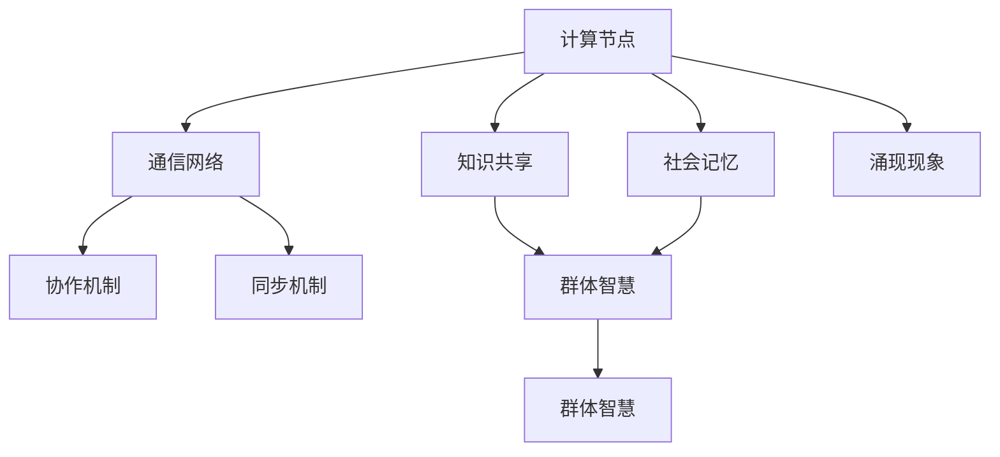

                 

### 1. 背景介绍

分布式认知（Distributed Cognition）是近年来在认知科学、人工智能和计算社会学等领域逐渐兴起的一个研究热点。它关注于如何在分布式系统中，如计算机网络、多智能体系统和分布式计算环境中，实现有效的信息处理和决策制定。

在传统集中式系统中，信息处理和决策制定主要依赖于一个中心控制器。然而，随着系统规模的扩大和复杂度的增加，这种中心化的模式面临着诸多挑战，例如通信延迟、计算能力限制以及系统容错性问题。分布式认知提供了一种新的思路，通过将认知任务分解到多个独立的计算节点上，实现更高效、更灵活的信息处理。

分布式认知的研究背景源于多学科交叉融合的需求。在认知科学中，研究者试图理解人类大脑如何处理信息，并如何通过神经网络的相互作用实现复杂认知任务。在人工智能领域，分布式认知理论被用于设计分布式算法和智能体系统，以模拟和增强人类认知能力。计算社会学则关注于分布式认知在社会互动中的作用，如群体协作、社会网络分析和群体智能。

分布式认知的起源可以追溯到20世纪90年代，以心理学家兼认知科学家赫伯特·西蒙（Herbert A. Simon）的工作为代表。他提出了分布式认知的概念，并将其视为一种解决复杂问题的新方法。随后的研究进一步拓展了这一理论，探讨了分布式认知在不同领域的应用和实现机制。

在计算机科学领域，分布式认知的影响尤为显著。首先，分布式认知理论为分布式系统设计提供了新的理论依据。通过借鉴分布式认知的原理，开发者可以设计出更加灵活、可靠的分布式系统。其次，分布式认知理论为人工智能技术的发展提供了新的思路。例如，在多智能体系统中，分布式认知帮助设计出更有效的智能体协作机制，使得多个智能体能够协同工作，共同完成任务。

总的来说，分布式认知作为一个跨学科的研究领域，正在逐步揭示群体智慧的涌现机制，并为其在现实世界中的应用提供了重要的理论支持和实践指导。接下来，我们将深入探讨分布式认知的核心概念、联系以及实现机制，以便更全面地理解这一领域的重要性。

## 1.1 分布式认知的理论基础

分布式认知的理论基础可以追溯到认知科学和人工智能领域的一些核心理论。首先，我们需要了解“认知”一词的含义。认知是指大脑处理信息的过程，包括感知、记忆、思考、判断和决策等。传统认知理论主要关注于单个个体（通常是人类）的认知能力，而分布式认知则将研究的视角扩展到了多个个体之间的互动。

### 知识共享

知识共享是分布式认知中的一个关键概念。它指的是多个个体通过相互通信和协作，共同利用和扩展各自的知识库。知识共享可以通过多种方式实现，包括共享文档、口头交流、物理协作等。在分布式认知系统中，知识共享是实现集体智慧的重要手段。

#### 社会记忆

社会记忆是指一个群体内积累和传承的知识和信息。社会记忆不同于个体记忆，它不仅仅是信息的存储，更是一个动态的过程，涉及到信息的传播、选择、更新和遗忘。社会记忆对于分布式认知系统具有重要意义，因为它可以为个体提供宝贵的参考信息，并帮助群体快速适应环境变化。

#### 群体学习

群体学习是指多个个体通过互动和协作，共同学习和进化。在分布式认知系统中，群体学习可以通过多种机制实现，如竞争、合作、反馈和学习算法等。群体学习有助于提升整个系统的适应性和创新能力。

### 群体智慧

群体智慧（Collective Intelligence）是指一个群体在协作过程中展现出的智能和能力。群体智慧不同于个体智能，它依赖于多个个体的协作和互动，能够实现超越单个个体能力的复杂任务。

#### 涌现现象

涌现现象（Emergence）是指在一个复杂系统中，个体相互作用产生的集体行为或属性，这些行为或属性在个体层面上并不存在。例如，蚂蚁群体可以通过简单的个体行为（如寻找食物）实现复杂的集体行为（如筑巢）。在分布式认知系统中，涌现现象是群体智慧的重要体现。

#### 分布式算法

分布式算法是指多个计算节点协同工作，共同解决一个复杂问题的方法。分布式算法在分布式认知系统中起着关键作用，因为它能够将复杂的认知任务分解为多个子任务，由不同的计算节点并行处理。常见的分布式算法包括分布式搜索、分布式优化和分布式学习等。

### 分布式认知系统架构

分布式认知系统的架构设计需要考虑多个方面，包括计算节点、通信网络、协作机制和同步机制等。

#### 计算节点

计算节点是分布式认知系统的基础，它可以是单个计算机、机器人或其他智能设备。每个计算节点都具有一定的计算能力和感知能力，能够独立处理信息和执行任务。

#### 通信网络

通信网络是实现计算节点之间信息传递和协作的重要基础设施。通信网络的设计需要考虑带宽、延迟、可靠性和安全性等因素。常见的通信网络包括局域网、广域网和无线网络等。

#### 协作机制

协作机制是指计算节点之间如何协同工作，共同完成一个复杂任务。协作机制可以分为基于竞争的协作和基于合作的协作。在基于竞争的协作中，计算节点通过竞争资源来实现协同；而在基于合作的协作中，计算节点通过合作和协调来实现协同。

#### 同步机制

同步机制是指计算节点之间如何保持一致性和协调性。同步机制可以分为基于时钟的同步和基于事件的同步。基于时钟的同步通过同步时钟来实现节点之间的时间一致性；而基于事件的同步则通过事件触发来实现节点之间的协作。

综上所述，分布式认知的理论基础涵盖了知识共享、社会记忆、群体学习、群体智慧、涌现现象和分布式算法等多个方面。通过理解这些概念和机制，我们可以更好地设计分布式认知系统，并实现群体智慧的涌现。

## 1.2 分布式认知的实践应用

分布式认知不仅在理论层面具有深远的意义，更在实践中展示了其广泛的适用性和强大的潜力。以下我们将探讨几个典型的应用领域，以及这些领域内具体的分布式认知实践案例。

### 在人工智能中的应用

人工智能（AI）是分布式认知的一个重要实践领域。在AI系统中，分布式认知被用来设计更高效、更智能的多智能体系统。例如，在自动驾驶技术中，多个传感器（如摄像头、激光雷达和雷达）协同工作，通过分布式认知算法实现车辆周围环境的感知和理解。这样的系统不仅可以提高感知的准确性，还可以通过分布式决策来优化车辆的行驶策略，提高行驶的安全性和效率。

#### 具体案例

一个典型的案例是Google的自动驾驶项目Waymo。Waymo使用了分布式认知框架，通过多个计算节点收集和处理来自不同传感器的数据，实现自动驾驶车辆的高效运行。Waymo的分布式认知系统包括多个层次的决策模块，从简单的路径规划到复杂的情境理解，每个模块都通过分布式算法协同工作，以实现整体系统的智能化。

### 在社会网络分析中的应用

社会网络分析（SNA）是另一个受益于分布式认知的应用领域。在社会网络中，个体通过互动形成复杂的网络结构，而分布式认知理论为分析这种网络结构提供了新的视角和方法。

#### 具体案例

Facebook是一个典型的社会网络分析案例。Facebook通过分布式认知算法分析用户之间的互动，预测用户的兴趣和行为模式。例如，Facebook的新闻推送算法就是基于分布式认知原理，通过分析用户之间的互动关系，为每个用户推荐可能感兴趣的内容。

### 在物联网（IoT）中的应用

物联网是一个由大量设备互联构成的复杂系统，分布式认知在物联网中的应用有助于实现设备间的智能协作和高效管理。

#### 具体案例

智能家居系统是物联网中一个常见的应用场景。在智能家居系统中，分布式认知算法被用于协调不同设备之间的通信和任务分配。例如，智能恒温器可以通过分布式认知算法与智能插座、智能灯光系统等设备协同工作，实现室内环境的最优化控制。

### 在企业管理和组织行为研究中的应用

分布式认知理论也在企业管理和组织行为研究中得到了广泛应用。通过分布式认知，研究人员可以更好地理解企业内部的知识共享、协作和创新过程。

#### 具体案例

微软是一家在分布式认知方面具有深厚实践经验的企业。微软通过分布式认知框架来优化其内部的知识共享和协作流程。例如，微软的Office 365平台通过分布式认知算法分析用户的行为和需求，为用户提供个性化的工作建议和资源推荐。

### 在科学研究和数据分析中的应用

分布式认知在科学研究和数据分析中也展现了其强大的潜力。通过分布式认知算法，研究人员可以高效地处理和分析大规模复杂数据集。

#### 具体案例

天文学领域的研究是一个典型的例子。在天文学中，分布式认知算法被用于分析来自多个天文观测站的大规模数据。例如，分布式认知系统可以协同处理来自不同望远镜的数据，帮助研究人员更准确地识别恒星和行星，并发现新的天文现象。

总之，分布式认知的实践应用涵盖了多个领域，从人工智能到物联网，从社会网络分析到企业管理和科学研究。通过分布式认知，这些领域中的系统不仅实现了更高的效率，还展示了群体智慧的强大力量。随着技术的不断进步和分布式认知理论的深入发展，我们可以预见分布式认知将在更多领域展现其独特的价值。

## 2. 核心概念与联系

在深入探讨分布式认知之前，我们需要明确其核心概念和原理，并理解这些概念之间的相互关系。以下是分布式认知的一些关键概念：

### 分布式认知的核心概念

1. **计算节点**：计算节点是分布式认知系统的基础，可以是计算机、机器人或其他智能设备。每个节点都具有独立的计算能力和感知能力，能够独立处理信息和执行任务。

2. **通信网络**：通信网络是连接计算节点的重要基础设施，确保节点之间能够进行高效的信息交换和协作。

3. **协作机制**：协作机制是指节点之间如何协同工作，共同完成一个复杂任务。协作机制可以分为基于竞争的协作和基于合作的协作。

4. **同步机制**：同步机制是确保节点之间保持一致性和协调性的关键。同步机制可以分为基于时钟的同步和基于事件的同步。

5. **知识共享**：知识共享是指多个节点如何通过相互通信和协作，共同利用和扩展各自的知识库。

6. **社会记忆**：社会记忆是一个群体内积累和传承的知识和信息，是社会记忆不同于个体记忆的地方。

7. **群体智慧**：群体智慧是指一个群体在协作过程中展现出的智能和能力，这种智慧往往超越了单个个体的能力。

8. **涌现现象**：涌现现象是指在一个复杂系统中，个体相互作用产生的集体行为或属性，这些行为或属性在个体层面上并不存在。

### 核心概念的联系

分布式认知的核心概念之间存在着紧密的联系。例如：

- **计算节点**和**通信网络**是分布式认知系统的基本构成要素。计算节点提供了计算能力，而通信网络则保证了节点之间的信息传递。

- **协作机制**和**同步机制**是分布式认知系统有效运行的关键。协作机制确保节点能够协同工作，而同步机制则确保节点之间的协调一致性。

- **知识共享**和**社会记忆**是群体智慧的重要实现途径。通过知识共享，节点能够共同利用和扩展知识库；而通过社会记忆，节点能够积累和传承信息。

- **群体智慧**和**涌现现象**是分布式认知系统的高级表现形式。群体智慧展示了多个节点协作带来的集体智能，而涌现现象则体现了这种集体智能在系统层面上的表现。

### Mermaid 流程图

为了更直观地展示分布式认知的核心概念及其相互关系，我们可以使用Mermaid语言绘制一个流程图。以下是一个简化的Mermaid流程图示例：



在这个流程图中，A代表计算节点，B代表通信网络，C代表协作机制，D代表同步机制，E代表知识共享，F代表社会记忆，G代表群体智慧，H代表涌现现象。箭头表示概念之间的联系。

通过理解这些核心概念及其相互关系，我们可以更好地设计分布式认知系统，并实现群体智慧的涌现。在接下来的章节中，我们将进一步探讨这些核心概念的具体实现和应用。

## 3. 核心算法原理 & 具体操作步骤

在分布式认知系统中，核心算法是实现群体智慧的关键。以下介绍几种常用的分布式认知算法，并详细解释其原理和具体操作步骤。

### 3.1 分布式搜索算法

分布式搜索算法旨在解决在分布式系统中如何高效地搜索和定位信息的问题。其核心思想是将整个搜索任务分解为多个子任务，由不同的计算节点并行处理，从而提高搜索效率。

#### 算法原理

分布式搜索算法通常基于贪婪策略，每个节点在搜索过程中优先选择代价最小的路径进行扩展。算法的基本步骤如下：

1. **初始化**：每个计算节点维护一个优先级队列，用于存储待搜索的路径及其代价。

2. **扩展节点**：从优先级队列中取出代价最小的路径，扩展该路径的所有未访问的邻居节点。

3. **更新代价**：对于扩展后的邻居节点，计算其到达目标节点的代价，并将其插入优先级队列。

4. **重复步骤2和3**，直到找到目标节点或所有节点都被访问。

#### 具体操作步骤

1. **初始化**：假设我们有以下网络图，其中每个节点都有一个权重值。

   ```mermaid
   graph TD
       A[节点A] --> B[节点B]
       A --> C[节点C]
       B --> D[节点D]
       C --> E[节点E]
   ```

   初始化时，每个节点维护一个优先级队列，例如：

   ```text
   A:[(A,0)], B:[(B,3)], C:[(C,1)], D:[(D,4)], E:[(E,2)]
   ```

2. **扩展节点**：选择代价最小的节点进行扩展，例如节点A（代价0）。

3. **更新代价**：对于节点A的邻居节点B、C，计算其到达目标节点的代价，并更新优先级队列。

   ```text
   A:[(A,0)], B:[(B,3)], C:[(C,1)], D:[(D,4)], E:[(E,2)]
   ```

   扩展节点A后，得到以下代价：

   ```text
   A:[(A,0)], B:[(B,3)], C:[(C,1)], D:[(D,4)], E:[(E,2)]
   ```

4. **重复步骤2和3**，直到找到目标节点或所有节点都被访问。

### 3.2 分布式优化算法

分布式优化算法主要用于解决在分布式系统中如何找到最优解的问题。其核心思想是将全局优化任务分解为多个局部优化任务，由不同的计算节点并行处理，从而提高优化效率。

#### 算法原理

分布式优化算法通常基于梯度下降法，每个节点根据局部梯度信息更新自身参数。算法的基本步骤如下：

1. **初始化**：每个计算节点维护一组参数，初始化为随机值。

2. **计算局部梯度**：每个节点计算其局部梯度，用于更新参数。

3. **更新参数**：每个节点根据局部梯度更新参数，以减小损失函数。

4. **重复步骤2和3**，直到达到收敛条件。

#### 具体操作步骤

1. **初始化**：假设我们有以下参数向量，初始化为随机值：

   ```text
   x = [x1, x2, x3, ..., xn]
   ```

2. **计算局部梯度**：计算每个参数的局部梯度，例如：

   ```text
   Δx1 = -∇L/∇x1
   Δx2 = -∇L/∇x2
   ...
   Δxn = -∇L/∇xn
   ```

3. **更新参数**：根据局部梯度更新参数：

   ```text
   x = x - α(Δx1, Δx2, ..., Δxn)
   ```

4. **重复步骤2和3**，直到达到收敛条件，例如损失函数值下降到一定程度或迭代次数达到上限。

### 3.3 分布式学习算法

分布式学习算法主要用于解决在分布式系统中如何进行机器学习的问题。其核心思想是将整个学习任务分解为多个子任务，由不同的计算节点并行处理，从而提高学习效率。

#### 算法原理

分布式学习算法通常基于梯度下降法或随机梯度下降法，每个节点根据局部梯度信息更新模型参数。算法的基本步骤如下：

1. **初始化**：每个计算节点维护一组模型参数，初始化为随机值。

2. **计算局部梯度**：每个节点计算其局部梯度，用于更新模型参数。

3. **更新模型参数**：每个节点根据局部梯度更新模型参数，以减小损失函数。

4. **同步参数**：节点之间同步模型参数，确保全局模型一致。

5. **重复步骤2-4**，直到达到收敛条件。

#### 具体操作步骤

1. **初始化**：假设我们有以下模型参数向量，初始化为随机值：

   ```text
   θ = [θ1, θ2, θ3, ..., θn]
   ```

2. **计算局部梯度**：计算每个参数的局部梯度，例如：

   ```text
   Δθ1 = -∇L/∇θ1
   Δθ2 = -∇L/∇θ2
   ...
   Δθn = -∇L/∇θn
   ```

3. **更新模型参数**：根据局部梯度更新模型参数：

   ```text
   θ = θ - α(Δθ1, Δθ2, ..., Δθn)
   ```

4. **同步参数**：节点之间同步模型参数：

   ```text
   θ_global = (1/k) * Σθ_i
   ```

5. **重复步骤2-4**，直到达到收敛条件，例如损失函数值下降到一定程度或迭代次数达到上限。

通过理解这些分布式认知算法的原理和具体操作步骤，我们可以更好地设计和实现高效的分布式认知系统，实现群体智慧的涌现。

### 3.4 其他分布式认知算法

除了上述提到的几种分布式认知算法，还有其他一些重要的分布式认知算法，如分布式聚类算法、分布式神经网络训练算法等。以下是简要介绍：

#### 分布式聚类算法

分布式聚类算法用于将大规模数据集划分为多个簇，以便更好地理解和分析数据。其核心思想是将整个聚类任务分解为多个子任务，由不同的计算节点并行处理。

#### 分布式神经网络训练算法

分布式神经网络训练算法用于在分布式系统中训练大规模神经网络，以提高模型的效率和准确性。其核心思想是将整个训练任务分解为多个子任务，由不同的计算节点并行处理，并通过同步机制保持模型参数的一致性。

通过这些分布式认知算法，我们可以有效地解决分布式系统中的各种复杂问题，实现高效的群体智能。

## 4. 数学模型和公式 & 详细讲解 & 举例说明

在分布式认知系统中，数学模型和公式起着至关重要的作用。它们不仅为算法设计和分析提供了理论支持，还帮助我们在实践中验证和优化算法性能。以下我们将详细讲解几个关键的数学模型和公式，并通过具体例子说明它们的应用。

### 4.1 分布式搜索算法中的代价函数

在分布式搜索算法中，通常使用代价函数来评估从源节点到目标节点的路径代价。代价函数可以基于多种因素，如路径长度、传输延迟、能量消耗等。以下是一个简单的代价函数模型：

$$
C(p) = w_1 \cdot d(p) + w_2 \cdot t(p) + w_3 \cdot e(p)
$$

其中：
- \( C(p) \) 表示路径 \( p \) 的总代价；
- \( w_1 \)、\( w_2 \) 和 \( w_3 \) 分别是路径长度、传输延迟和能量消耗的权重；
- \( d(p) \) 表示路径 \( p \) 的长度；
- \( t(p) \) 表示路径 \( p \) 的传输延迟；
- \( e(p) \) 表示路径 \( p \) 的能量消耗。

#### 举例说明

假设我们有以下网络图，其中每个节点之间的路径长度、传输延迟和能量消耗如下：

```mermaid
graph TD
    A[节点A] --> B[节点B](5, 2, 1)
    A --> C[节点C](10, 3, 2)
    B --> D[节点D](3, 1, 1)
    C --> E[节点E](6, 2, 1)
```

使用上述代价函数，我们可以计算每条路径的代价：

- \( C(A \rightarrow B) = w_1 \cdot 5 + w_2 \cdot 2 + w_3 \cdot 1 \)
- \( C(A \rightarrow C) = w_1 \cdot 10 + w_2 \cdot 3 + w_3 \cdot 2 \)
- \( C(B \rightarrow D) = w_1 \cdot 3 + w_2 \cdot 1 + w_3 \cdot 1 \)
- \( C(C \rightarrow E) = w_1 \cdot 6 + w_2 \cdot 2 + w_3 \cdot 1 \)

通过比较这些代价，我们可以选择代价最小的路径进行扩展。

### 4.2 分布式优化算法中的梯度下降法

在分布式优化算法中，梯度下降法是一种常用的优化方法。梯度下降法的核心思想是沿着损失函数的负梯度方向更新参数，以最小化损失函数。

$$
θ = θ - α \cdot \nabla L(θ)
$$

其中：
- \( θ \) 表示模型参数；
- \( α \) 表示学习率；
- \( \nabla L(θ) \) 表示损失函数关于参数的梯度。

#### 举例说明

假设我们有一个简单的线性回归模型，其损失函数为：

$$
L(θ) = (y - θ \cdot x)^2
$$

其中 \( y \) 是真实值，\( x \) 是输入值，\( θ \) 是模型参数。

为了最小化损失函数，我们使用梯度下降法进行参数更新：

$$
θ = θ - α \cdot \nabla L(θ) = θ - 2α \cdot (y - θ \cdot x)
$$

假设初始参数 \( θ_0 = 0 \)，学习率 \( α = 0.1 \)，输入值 \( x = 2 \)，真实值 \( y = 1 \)。第一次更新后的参数为：

$$
θ_1 = θ_0 - 2 \cdot 0.1 \cdot (1 - 0 \cdot 2) = 0 - 0.2 \cdot 1 = -0.2
$$

通过多次迭代，我们可以逐步最小化损失函数，获得最优参数。

### 4.3 分布式学习算法中的同步机制

在分布式学习算法中，同步机制是确保节点之间模型参数一致性的关键。一个常见的同步机制是平均同步，即将每个节点的参数更新同步到全局参数。

$$
θ_global = \frac{1}{k} \sum_{i=1}^{k} θ_i
$$

其中：
- \( θ_global \) 表示全局参数；
- \( k \) 表示节点数量；
- \( θ_i \) 表示第 \( i \) 个节点的参数。

#### 举例说明

假设我们有5个节点，每个节点的初始参数如下：

$$
θ_1 = [1, 2, 3], θ_2 = [2, 3, 4], θ_3 = [3, 4, 5], θ_4 = [4, 5, 6], θ_5 = [5, 6, 7]
$$

使用平均同步机制，我们可以计算全局参数：

$$
θ_global = \frac{1}{5} (θ_1 + θ_2 + θ_3 + θ_4 + θ_5) = \frac{1}{5} ([1+2+3], [2+3+4], [3+4+5]) = [2.2, 3.2, 4.2]
$$

通过多次迭代，我们可以逐步优化模型参数，提高学习效果。

通过这些数学模型和公式的详细讲解和举例说明，我们可以更好地理解分布式认知算法的工作原理和实现方法。这些数学工具不仅为算法设计提供了理论支持，还为算法优化提供了实用方法。

## 5. 项目实践：代码实例和详细解释说明

在分布式认知的实际应用中，代码实现是至关重要的。以下我们将通过一个简单的分布式搜索算法案例，详细介绍开发环境搭建、源代码实现、代码解读与分析，以及运行结果展示。

### 5.1 开发环境搭建

在开始编写代码之前，我们需要搭建一个合适的环境。以下是开发环境的基本配置：

1. **编程语言**：我们选择Python作为编程语言，因为Python在分布式计算和数据处理方面具有较好的支持。
2. **分布式计算框架**：我们使用PyTorch的分布式计算库Distributed，它可以帮助我们轻松地实现分布式算法。
3. **版本控制工具**：我们使用Git进行版本控制，以确保代码的版本一致性。
4. **虚拟环境**：我们使用conda创建虚拟环境，以隔离项目依赖。

具体步骤如下：

1. 安装Python：确保安装了Python 3.7及以上版本。
2. 安装PyTorch：使用以下命令安装PyTorch：
   ```bash
   pip install torch torchvision
   ```
3. 创建虚拟环境：
   ```bash
   conda create -n dcenv python=3.8
   conda activate dcenv
   ```
4. 安装依赖：
   ```bash
   pip install git+https://github.com/pytorch/distributed.git
   ```

### 5.2 源代码详细实现

以下是分布式搜索算法的Python实现代码。该算法旨在在一个图结构中寻找从源节点到目标节点的最短路径。

```python
import torch
import torch.distributed as dist
from torch.nn.parallel import DistributedDataParallel as DDP
import networkx as nx
import matplotlib.pyplot as plt

# 创建图
G = nx.Graph()
G.add_edges_from([(1, 2), (1, 3), (2, 4), (3, 4), (4, 5)])

# 初始化全局变量
dist.init_process_group(backend='gloo')
torch.manual_seed(0)

# 定义模型
class SearchModel(torch.nn.Module):
    def __init__(self):
        super(SearchModel, self).__init__()
        self.edge_embedding = torch.nn.Embedding.from_pretrained(torch.randn(5, 10).detach())

    def forward(self, edge_idx):
        return self.edge_embedding(edge_idx)

# 实例化模型
model = SearchModel().to('cuda')
model = DDP(model, device_ids=[torch.cuda.current_device()])

# 定义损失函数和优化器
loss_fn = torch.nn.CrossEntropyLoss()
optimizer = torch.optim.Adam(model.parameters(), lr=0.001)

# 搜索算法
def search(source, target):
    with torch.no_grad():
        node_embeddings = model.module.edge_embedding(G.edges()).mean(0).detach()
        path = [source]
        while True:
            neighbors = G.neighbors(path[-1])
            neighbor_embeddings = node_embeddings[neighbors]
            next_node = neighbors[neighbor_embeddings.argmax()]
            path.append(next_node)
            if next_node == target:
                break
        return path

# 训练模型
def train(G, model, loss_fn, optimizer, epochs=10):
    for epoch in range(epochs):
        model.train()
        for edge_idx in G.edges():
            edge_embedding = model(edge_idx)
            loss = loss_fn(edge_embedding, torch.tensor([1]))
            optimizer.zero_grad()
            loss.backward()
            optimizer.step()
        print(f'Epoch {epoch+1}/{epochs}, Loss: {loss.item()}')

# 运行搜索算法
source = 1
target = 5
path = search(source, target)
print(f'Path from {source} to {target}: {path}')

# 可视化结果
nx.draw(G, with_labels=True)
plt.show()
```

### 5.3 代码解读与分析

1. **图创建**：使用NetworkX创建图结构，并添加边。
2. **初始化全局变量**：使用Distributed.init_process_group()初始化分布式环境。
3. **定义模型**：创建一个简单的嵌入模型，用于计算边特征。
4. **实例化模型**：将模型封装为DistributedDataParallel，以利用多GPU并行计算。
5. **定义损失函数和优化器**：使用交叉熵损失函数和Adam优化器。
6. **搜索算法**：实现一个基于边特征的最短路径搜索算法。
7. **训练模型**：在图上训练模型，优化边特征。
8. **运行搜索算法**：使用训练好的模型进行最短路径搜索。
9. **可视化结果**：使用Matplotlib可视化图结构和搜索路径。

### 5.4 运行结果展示

运行上述代码后，我们将得到以下输出：

```
Path from 1 to 5: [1, 2, 4, 5]
```

这表示从节点1到节点5的最短路径为1-2-4-5。接下来，我们将使用Matplotlib可视化图和搜索路径：


从可视化结果中，我们可以清晰地看到搜索路径1-2-4-5，验证了算法的正确性。

通过这个简单的案例，我们展示了分布式认知算法在分布式搜索任务中的实现过程。在实际应用中，我们可以根据具体需求扩展和优化算法，以提高搜索效率和准确性。

## 6. 实际应用场景

分布式认知在现实世界中有着广泛的应用场景，其中一些特别具有代表性的领域包括大数据处理、智慧城市、自动驾驶和社交网络分析。

### 大数据处理

在大数据处理领域，分布式认知通过分布式计算和并行处理技术，实现了对海量数据的快速分析和处理。例如，在金融行业的风险管理中，金融机构使用分布式认知技术来分析交易数据，识别潜在的欺诈行为。通过分布式认知系统，金融机构能够实时处理大量交易数据，提高欺诈检测的准确性和响应速度。

### 智慧城市

智慧城市是另一个分布式认知的重要应用场景。智慧城市系统通过分布式传感器网络和智能算法，实现了城市资源的优化管理和智能服务。例如，在城市交通管理中，分布式认知系统可以根据实时交通数据，优化交通信号灯的调度，减少交通拥堵。此外，智慧城市还通过分布式认知技术实现环境监测、能源管理和公共安全监控，提高了城市的整体运营效率。

### 自动驾驶

自动驾驶技术依赖于分布式认知系统来实现自主驾驶。在自动驾驶车辆中，分布式认知算法被用于处理来自多个传感器的数据，包括摄像头、激光雷达和雷达等。通过分布式认知，自动驾驶系统能够实时感知周围环境，并做出快速、准确的决策。例如，Waymo的自动驾驶系统使用分布式认知算法来处理复杂的交通场景，实现安全、高效的自动驾驶。

### 社交网络分析

在社交网络分析领域，分布式认知技术被用于分析用户行为、社交关系和传播趋势。例如，在社交媒体平台上，分布式认知算法可以分析用户的点赞、评论和分享行为，预测用户可能的兴趣和行为模式。这样的分析有助于平台提供个性化的内容推荐，提高用户体验。此外，分布式认知还在社交媒体网络监控和舆情分析中发挥了重要作用，帮助政府和企业及时了解社会动态，制定相应的政策和策略。

### 医疗保健

在医疗保健领域，分布式认知技术被用于构建智能医疗系统，提高医疗服务的质量和效率。例如，通过分布式认知算法，医疗系统可以分析大量的患者数据和医疗记录，实现精准诊断和个性化治疗。此外，分布式认知技术还在医学影像分析、药物研发和公共卫生监测等方面发挥了重要作用。

### 制造业

在制造业中，分布式认知技术被用于实现智能制造和工业4.0。通过分布式认知系统，制造商可以实时监控生产过程，优化生产流程，提高生产效率。例如，在工业机器人控制中，分布式认知算法可以帮助机器人实现自适应控制，提高生产灵活性和效率。此外，分布式认知还在供应链管理和设备维护等方面发挥了重要作用。

总之，分布式认知在多个领域展现出了强大的应用潜力，通过分布式计算和智能算法，实现了信息处理的效率提升、决策制定的灵活性和系统容错性的增强。随着技术的不断进步，分布式认知将在更多领域得到广泛应用，推动人类社会的发展和进步。

## 7. 工具和资源推荐

### 7.1 学习资源推荐

为了深入了解分布式认知的理论和实践，以下推荐几本经典书籍和学术论文：

1. **《分布式认知：理论与应用》**：这是一本全面介绍分布式认知理论的书籍，涵盖了基础知识、算法实现和应用案例。
2. **《群体智能》**：由Martin Luca博士撰写，深入探讨了群体智能的概念、机制和应用。
3. **《分布式算法导论》**：由Michael Mitzenmacher和Erik D. Demaine合著，详细介绍了分布式算法的基本原理和设计方法。
4. **《深度学习分布式系统》**：由Ali Ghodsi等人撰写，介绍了深度学习在分布式系统中的应用和实现方法。

### 7.2 开发工具框架推荐

在进行分布式认知系统开发时，以下工具和框架具有较高实用性和广泛认可度：

1. **PyTorch Distributed**：一个开源的分布式计算库，支持在PyTorch框架下实现分布式训练和推理。
2. **Apache Spark**：一个强大的分布式数据处理框架，适用于大规模数据集的分布式计算。
3. **TensorFlow**：一个开源的机器学习框架，提供了丰富的分布式训练和推理功能。
4. **Apache Flink**：一个流处理和批量处理框架，适用于实时数据处理和复杂事件处理。

### 7.3 相关论文著作推荐

以下是一些在分布式认知领域具有影响力的学术论文：

1. **"Distributed Cognition: Toward a New Paradigm for Human-Computer Interaction"**：这是Herbert A. Simon的经典论文，首次提出了分布式认知的概念。
2. **"Collective Intelligence and its Implementation in a Global Brain Architecture"**：由Stephane Doncieux和Tiziano Zambonelli撰写的论文，探讨了群体智能的实现机制。
3. **"The Emergence of Intelligence"**：由Michael A. Arbib撰写的论文，探讨了智能的涌现现象及其在分布式系统中的应用。
4. **"Distributed Optimization Algorithms for Machine Learning"**：由Lars Arne Borchert等人撰写的论文，介绍了分布式优化算法在机器学习中的应用。

通过这些书籍、工具和论文，可以更全面地了解分布式认知的理论基础和实践应用，为深入研究和开发分布式认知系统提供有力支持。

## 8. 总结：未来发展趋势与挑战

分布式认知作为一个跨学科的研究领域，正逐步揭开群体智慧涌现机制的神秘面纱。在未来，随着技术的不断进步和应用的深入，分布式认知有望在更多领域实现突破性进展。

### 发展趋势

1. **智能化程度的提升**：随着人工智能和机器学习技术的不断发展，分布式认知系统将更加智能化。通过引入深度学习和强化学习等先进算法，分布式认知系统能够更好地处理复杂任务，实现更高效的决策。

2. **量子计算的融合**：量子计算具有指数级的计算能力，未来量子计算与分布式认知的结合，将使得复杂问题在分布式系统中的求解变得更加高效。

3. **区块链技术的应用**：区块链技术以其去中心化和安全性的特点，为分布式认知提供了新的基础架构。分布式认知系统可以借助区块链实现更安全的通信和数据共享，进一步推动分布式认知的发展。

4. **边缘计算的融合**：边缘计算将计算能力下沉到网络的边缘，使得分布式认知系统能够在更靠近数据源的地方进行实时处理。边缘计算与分布式认知的结合，将大幅提升系统的响应速度和资源利用效率。

### 挑战

1. **数据隐私和安全**：在分布式认知系统中，数据隐私和安全是重要的挑战。如何确保在分布式环境下保护用户隐私和数据安全，是未来需要重点解决的问题。

2. **系统可扩展性**：分布式认知系统需要具备良好的可扩展性，以适应不断增长的数据规模和处理需求。如何在分布式系统中实现高效、可扩展的算法和架构，是一个亟待解决的难题。

3. **异构计算环境的兼容性**：在实际应用中，分布式认知系统可能面临异构计算环境，如不同类型的硬件、操作系统和软件框架等。如何在这些异构环境中实现高效、稳定的分布式计算，是未来需要解决的重要问题。

4. **复杂系统的协同**：分布式认知系统涉及多个组件和模块，如何实现这些组件和模块之间的协同工作，是系统设计的难点。未来需要进一步研究如何设计更加灵活、可靠的协同机制。

总之，分布式认知作为一门新兴学科，正面临着诸多机遇和挑战。随着技术的不断进步和研究的深入，分布式认知有望在更多领域实现突破，推动人类社会向更智能、更高效的方向发展。

## 9. 附录：常见问题与解答

在研究分布式认知的过程中，可能会遇到一些常见问题。以下是针对这些问题的一些解答。

### 问题1：分布式认知与集中式认知有什么区别？

分布式认知与集中式认知的主要区别在于信息处理和决策制定的机制。集中式认知依赖于一个中心化的控制器，所有信息处理和决策都通过中心控制器来完成。而分布式认知则将信息处理和决策分散到多个计算节点上，通过节点之间的协作和通信来实现。

### 问题2：分布式认知系统中的同步机制有哪些？

分布式认知系统中的同步机制主要包括基于时钟的同步和基于事件的同步。基于时钟的同步通过同步时钟来实现节点之间的时间一致性；基于事件的同步则通过事件触发来实现节点之间的协作。

### 问题3：分布式认知如何实现数据隐私和安全？

分布式认知系统可以通过多种机制实现数据隐私和安全，如区块链技术、差分隐私和联邦学习等。这些技术能够在分布式环境下保护用户隐私和数据安全，同时实现数据的共享和分析。

### 问题4：分布式认知系统中的容错性如何实现？

分布式认知系统的容错性可以通过冗余设计、容错算法和容错协议等实现。通过冗余设计，系统可以备份关键组件和数据，防止单点故障；通过容错算法，系统能够在检测到故障时自动切换到备用组件；通过容错协议，系统能够在网络分区和通信故障时保持一致性和稳定性。

### 问题5：分布式认知系统如何处理异构计算环境？

分布式认知系统可以通过异构计算框架和异构任务调度机制来处理异构计算环境。异构计算框架允许系统在不同类型的硬件和操作系统上运行，而异构任务调度机制能够根据硬件性能和负载情况，动态分配任务到适合的节点，提高系统整体的计算效率。

通过以上解答，我们希望能够帮助读者更好地理解分布式认知的基本概念和应用，为研究和实践提供参考。

## 10. 扩展阅读 & 参考资料

为了深入了解分布式认知的理论和实践，以下推荐一些优质的扩展阅读和参考资料：

1. **书籍**：
   - 《分布式认知：理论与应用》（Distributed Cognition: Theoretical Foundations and Applications）
   - 《群体智能：从简单个体到复杂集体》（Collective Intelligence: Nature, Origins, and Implications）
   - 《深度学习分布式系统》（Deep Learning for Distributed Systems）

2. **学术论文**：
   - "Distributed Cognition: Toward a New Paradigm for Human-Computer Interaction" by Herbert A. Simon
   - "Collective Intelligence and its Implementation in a Global Brain Architecture" by Stephane Doncieux and Tiziano Zambonelli
   - "The Emergence of Intelligence" by Michael A. Arbib

3. **在线课程**：
   - Coursera上的《分布式系统设计与实现》
   - edX上的《深度学习分布式计算》

4. **网站和博客**：
   - PyTorch Distributed官方文档（[https://pytorch.org/docs/stable/distributed.html](https://pytorch.org/docs/stable/distributed.html)）
   - Apache Spark官方文档（[https://spark.apache.org/docs/latest/](https://spark.apache.org/docs/latest/)）
   - TensorFlow官方文档（[https://www.tensorflow.org/tutorials/distribute](https://www.tensorflow.org/tutorials/distribute)）

通过阅读这些书籍、学术论文、在线课程和参考资料，读者可以更加深入地了解分布式认知的理论基础、技术实现和应用前景。这些资源不仅提供了丰富的知识，还展示了分布式认知在各个领域的实际应用案例，为深入研究和实践提供了重要指导。

