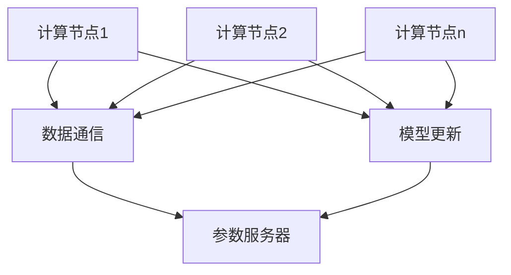

                 

### 背景介绍 Background

分布式训练（Distributed Training）作为现代深度学习（Deep Learning）领域的一项关键技术，其重要性日益凸显。随着深度学习模型的复杂度和数据规模不断增大，单机训练已经无法满足计算需求，分布式训练应运而生。

#### 软件发展历史 Software Development History

从软件2.0的概念出发，我们可以回顾软件发展历史。软件1.0时代，计算机程序主要是为特定任务而编写，具有封闭性和局限性。软件2.0时代，随着互联网的发展，软件开始变得开放、可扩展和模块化。软件2.0不仅关注功能的实现，更注重用户体验和生态系统的构建。

#### 深度学习发展历程 Deep Learning Development

深度学习的发展历程可以分为几个阶段：

1. **人工神经网络**（Artificial Neural Networks，ANN）：20世纪80年代，人工神经网络开始兴起，但由于计算能力和数据规模的限制，其应用范围有限。

2. **卷积神经网络**（Convolutional Neural Networks，CNN）：21世纪初，随着图像识别需求的增长，CNN被发明出来，并在图像处理领域取得了突破性进展。

3. **循环神经网络**（Recurrent Neural Networks，RNN）：RNN在处理序列数据方面表现出色，被广泛应用于语音识别、自然语言处理等领域。

4. **生成对抗网络**（Generative Adversarial Networks，GAN）：GAN的出现，使得生成模型和判别模型相互对抗，实现了高质量的数据生成。

#### 分布式训练的发展历程 Distributed Training Development

分布式训练的发展历程与深度学习的发展紧密相关：

1. **单机训练**：早期的深度学习模型主要通过单机训练完成，计算资源相对有限。

2. **并行训练**：随着计算能力的提升，并行训练开始被广泛应用，多个计算节点并行处理数据，加快了训练速度。

3. **分布式训练**：在单机训练和并行训练的基础上，分布式训练通过将模型和数据分布在多个计算节点上，实现了更大规模的模型训练和数据利用。

#### 分布式训练的意义 Importance of Distributed Training

分布式训练的意义主要体现在以下几个方面：

1. **提高计算效率**：通过分布式训练，可以充分利用集群中的计算资源，提高模型的训练速度。

2. **处理大规模数据**：分布式训练能够处理海量的数据，这对于提高模型性能至关重要。

3. **降低训练成本**：通过分布式训练，可以降低单机训练的成本，尤其是对于计算资源需求巨大的深度学习模型。

4. **支持大规模模型**：分布式训练使得大规模模型的训练成为可能，这对于解决复杂问题具有重要意义。

综上所述，分布式训练作为软件2.0时代的核心技术之一，已经成为深度学习领域不可或缺的一部分。随着计算能力和数据规模的持续增长，分布式训练将继续发挥重要作用，推动深度学习的进一步发展。

### 核心概念与联系 Core Concepts and Connections

在深入探讨分布式训练之前，我们需要了解几个核心概念和它们之间的联系。分布式训练不仅仅是一种技术，更是一种系统架构和工程实践。以下将介绍分布式训练中的关键概念，并使用Mermaid流程图展示它们之间的关系。

#### 概念介绍 Concept Introduction

1. **计算节点**（Compute Node）：分布式训练的基本单元，负责处理数据和模型参数。

2. **数据通信**（Data Communication）：计算节点之间的数据传输机制，包括同步和异步通信。

3. **参数服务器**（Parameter Server）：存储和管理模型参数的集中式服务器。

4. **通信协议**（Communication Protocol）：计算节点之间进行数据通信的规则和标准。

5. **模型更新**（Model Update）：计算节点通过通信协议将训练结果发送到参数服务器，更新模型参数。

#### Mermaid流程图 Mermaid Flowchart

以下是分布式训练的Mermaid流程图，展示了各个核心概念之间的交互：



**解释：**

- **计算节点1（A）**：执行计算任务，处理数据和模型参数。
- **数据通信（B）**：计算节点通过数据通信将训练数据传输给参数服务器。
- **参数服务器（D）**：存储和管理模型参数，接收来自计算节点的训练结果。
- **模型更新（C）**：计算节点通过模型更新机制将训练结果发送到参数服务器。

#### 关键联系 Key Connections

分布式训练中的关键联系在于计算节点、数据通信、参数服务器和模型更新之间的交互。以下是这些联系的具体说明：

1. **计算节点与数据通信**：计算节点需要通过数据通信将训练数据传输到参数服务器。数据通信可以是同步或异步的，取决于具体的分布式训练架构。

2. **计算节点与模型更新**：计算节点在处理数据后，将训练结果（如梯度）发送到参数服务器。模型更新机制确保参数服务器中的模型参数得到及时更新。

3. **数据通信与参数服务器**：数据通信负责将计算节点的训练数据传输到参数服务器。参数服务器作为集中式存储，管理模型参数。

4. **模型更新与参数服务器**：模型更新机制确保参数服务器中的模型参数得到及时更新。更新后的模型参数将被其他计算节点使用，以继续训练过程。

通过上述流程图和联系说明，我们可以更清晰地理解分布式训练的核心概念及其相互关系。这些概念和联系构成了分布式训练的基础，为后续章节中的具体实现提供了理论支持。

### 核心算法原理 & 具体操作步骤 Core Algorithm Principles & Step-by-Step Procedures

#### 分布式训练算法原理 Distributed Training Algorithm Principles

分布式训练的核心在于如何将一个大规模的深度学习模型分布到多个计算节点上进行训练，以充分利用集群计算资源，提高训练效率。以下是分布式训练的主要算法原理：

1. **参数服务器架构**：在分布式训练中，通常采用参数服务器（Parameter Server）架构。参数服务器负责存储和管理模型参数，计算节点通过拉取或推送的方式与参数服务器进行通信。

2. **同步分布式训练**：同步分布式训练（Synchronous Distributed Training）是最常见的分布式训练方法。在同步分布式训练中，所有计算节点在每一步训练中都要等待参数服务器上的全局模型参数更新后，才能继续计算。具体步骤如下：

   - **初始化**：所有计算节点随机初始化模型参数。
   - **数据分发**：参数服务器将训练数据分发给各个计算节点。
   - **计算梯度**：计算节点利用训练数据进行前向传播和反向传播，计算本地的梯度。
   - **参数同步**：计算节点将本地梯度发送到参数服务器，参数服务器更新全局模型参数。
   - **重复**：重复上述步骤，直到满足停止条件（如达到训练轮数或模型收敛）。

3. **异步分布式训练**：异步分布式训练（Asynchronous Distributed Training）允许计算节点在各自的时间步进行计算和更新，不需要等待全局参数的同步。异步分布式训练可以进一步提高训练速度，但可能导致模型的不稳定。具体步骤如下：

   - **初始化**：所有计算节点随机初始化模型参数。
   - **数据分发**：参数服务器将训练数据分发给各个计算节点。
   - **计算梯度**：计算节点利用训练数据进行前向传播和反向传播，计算本地的梯度。
   - **异步更新**：计算节点在计算完梯度后，立即更新本地模型参数，但不立即发送到参数服务器。
   - **局部同步**：计算节点定期将本地梯度发送到参数服务器，参数服务器合并并更新全局模型参数。
   - **重复**：重复上述步骤，直到满足停止条件。

#### 步骤详细说明 Detailed Step-by-Step Explanation

以下是对同步分布式训练的步骤详细说明：

1. **初始化**：

   - 所有计算节点随机初始化模型参数。
   - 参数服务器初始化全局模型参数。

2. **数据分发**：

   - 参数服务器将训练数据分发给各个计算节点。数据分发可以采用哈希散列或轮询机制，确保每个计算节点都能够获得独立的数据子集。

3. **计算梯度**：

   - 计算节点利用训练数据进行前向传播，计算输出结果。
   - 计算节点利用输出结果计算损失函数。
   - 计算节点利用损失函数计算梯度。

4. **参数同步**：

   - 计算节点将本地梯度发送到参数服务器。
   - 参数服务器合并来自各个计算节点的梯度，更新全局模型参数。

5. **重复**：

   - 参数服务器重新分发训练数据到各个计算节点。
   - 计算节点重复计算梯度、参数同步步骤，直到满足停止条件。

#### 示例 Example

假设我们有一个深度学习模型，需要在5个计算节点上进行同步分布式训练。以下是具体的操作步骤：

1. **初始化**：

   - 所有计算节点随机初始化模型参数，参数服务器初始化全局模型参数。
   - 参数服务器将训练数据分成5个数据子集，每个计算节点获取一个子集。

2. **数据分发**：

   - 参数服务器将训练数据分发给各个计算节点。

3. **计算梯度**：

   - 计算节点1使用训练数据子集计算前向传播，得到输出结果。
   - 计算节点1利用输出结果计算损失函数。
   - 计算节点1利用损失函数计算梯度。

   - 重复上述步骤，直到计算完所有计算节点的梯度。

4. **参数同步**：

   - 所有计算节点将本地梯度发送到参数服务器。
   - 参数服务器合并来自5个计算节点的梯度，更新全局模型参数。

5. **重复**：

   - 参数服务器重新分发训练数据到各个计算节点。
   - 计算节点重复计算梯度、参数同步步骤，直到满足停止条件（如达到1000轮训练）。

通过上述步骤，我们可以实现一个简单的同步分布式训练。在实际应用中，分布式训练的参数和配置会更加复杂，但基本原理相同。

### 数学模型和公式 Mathematical Models & Detailed Explanation & Example

分布式训练涉及大量的数学模型和公式，这些模型和公式对于理解分布式训练的原理和实现至关重要。以下将详细介绍分布式训练中的几个关键数学模型和公式，并通过具体例子进行讲解。

#### 梯度计算 Gradient Calculation

梯度计算是分布式训练的核心步骤之一。在深度学习中，梯度表示模型参数对损失函数的敏感度。以下是梯度计算的基本公式：

$$
\nabla_{\theta} J(\theta) = \frac{\partial J(\theta)}{\partial \theta}
$$

其中，$J(\theta)$ 表示损失函数，$\theta$ 表示模型参数。梯度计算的目标是找到使损失函数最小的参数值。

假设我们有一个简单的线性回归模型，输入特征为 $x$，输出为 $y$，模型参数为 $\theta$，损失函数为均方误差（MSE）：

$$
J(\theta) = \frac{1}{2} \sum_{i=1}^{n} (y_i - \theta x_i)^2
$$

计算梯度：

$$
\nabla_{\theta} J(\theta) = \frac{\partial J(\theta)}{\partial \theta} = \sum_{i=1}^{n} (y_i - \theta x_i) \frac{\partial}{\partial \theta} (\theta x_i) = \sum_{i=1}^{n} (y_i - \theta x_i) x_i
$$

#### 梯度下降 Gradient Descent

梯度下降是优化深度学习模型参数的常用算法。梯度下降的基本思想是沿着梯度的反方向更新参数，以最小化损失函数。

标准梯度下降算法公式如下：

$$
\theta = \theta - \alpha \nabla_{\theta} J(\theta)
$$

其中，$\alpha$ 为学习率（learning rate），用于控制参数更新的步长。

#### 随机梯度下降 Stochastic Gradient Descent (SGD)

随机梯度下降（SGD）是梯度下降的一种变种，它使用随机样本计算梯度。SGD的基本公式如下：

$$
\theta = \theta - \alpha \nabla_{\theta} J(\theta; x_i, y_i)
$$

其中，$x_i, y_i$ 为随机选取的一个训练样本。

#### 批量梯度下降 Batch Gradient Descent

批量梯度下降（Batch Gradient Descent，BGD）是标准梯度下降的一种特殊形式，它使用整个训练集计算梯度。BGD的基本公式如下：

$$
\theta = \theta - \alpha \nabla_{\theta} J(\theta; X, Y)
$$

其中，$X, Y$ 分别为整个训练集的特征和标签。

#### 分布式梯度下降 Distributed Gradient Descent

分布式梯度下降是将梯度计算和更新分布在多个计算节点上的过程。以下是分布式梯度下降的基本步骤：

1. **初始化**：所有计算节点随机初始化模型参数。
2. **数据分发**：参数服务器将训练数据分发给各个计算节点。
3. **计算梯度**：计算节点利用本地数据计算梯度。
4. **参数同步**：计算节点将本地梯度发送到参数服务器，参数服务器合并并更新全局模型参数。
5. **重复**：重复步骤 2-4，直到满足停止条件。

分布式梯度下降的数学公式如下：

$$
\theta = \theta - \alpha \frac{1}{N} \sum_{i=1}^{N} \nabla_{\theta} J(\theta; x_i, y_i)
$$

其中，$N$ 为计算节点数量，$\frac{1}{N}$ 为全局梯度系数。

#### 示例 Example

假设我们有5个计算节点，每个节点负责计算一个梯度分量。训练集包含100个样本，每个计算节点处理20个样本。以下是分布式梯度下降的计算过程：

1. **初始化**：所有计算节点随机初始化模型参数。
2. **数据分发**：参数服务器将训练数据分成5个数据子集，每个计算节点处理20个样本。
3. **计算梯度**：计算节点1计算梯度分量 $\nabla_{\theta_1} J(\theta_1; x_{11}, y_{11})$，计算节点2计算梯度分量 $\nabla_{\theta_2} J(\theta_2; x_{21}, y_{21})$，以此类推。
4. **参数同步**：计算节点将本地梯度发送到参数服务器，参数服务器合并5个梯度分量，得到全局梯度。
5. **更新参数**：参数服务器利用全局梯度更新模型参数。

通过上述步骤，我们可以实现分布式梯度下降，充分利用集群计算资源，提高训练效率。

综上所述，分布式训练中的数学模型和公式涵盖了梯度计算、梯度下降算法以及分布式梯度下降。这些模型和公式为分布式训练提供了理论基础和实现方法，有助于深入理解分布式训练的原理和过程。

### 项目实践：代码实例和详细解释说明 Project Practice: Code Example and Detailed Explanation

为了更好地理解分布式训练的原理和实现过程，我们将通过一个具体的代码实例来展示分布式训练的代码实现和运行过程。本文将使用Python和TensorFlow框架，实现一个简单的分布式线性回归模型，并详细解释代码中的每一步操作。

#### 开发环境搭建 Environment Setup

在开始编写分布式训练代码之前，我们需要确保安装了以下软件和库：

1. Python 3.8或更高版本
2. TensorFlow 2.x
3. NumPy
4. matplotlib

您可以通过以下命令进行环境搭建：

```bash
pip install python==3.8 tensorflow==2.x numpy matplotlib
```

#### 源代码详细实现 Source Code Implementation

以下是一个简单的分布式线性回归模型实现，分为两部分：数据预处理和数据训练。

```python
# 文件：distributed_linear_regression.py

import tensorflow as tf
import numpy as np
import matplotlib.pyplot as plt

# 1. 数据预处理
def load_data():
    # 创建一个模拟的线性回归数据集
    X = np.random.rand(100, 1)  # 输入特征
    y = 3 * X + 2 + np.random.rand(100, 1)  # 输出标签，带有噪声
    return X, y

# 2. 分布式训练
def distributed_training(num_workers, num_epochs):
    # 初始化数据
    X, y = load_data()

    # 设置参数服务器和工作节点
    server = tf.train.Server.create("localhost:2222", is_chief=True)
    if server.is_chief:
        with tf.device("/device:CPU:0"):
            # 创建参数服务器，用于存储和管理模型参数
            model_params = tf.Variable(0.0, name="model_params")

    with tf.device("/device:GPU:0" if tf.test.is_gpu_available() else "/device:CPU:0"):
        # 创建工作节点，用于执行计算任务
        input_layer = tf.placeholder(tf.float32, [None, 1], name="input_layer")
        output_layer = tf.matmul(input_layer, model_params)

        # 定义损失函数
        loss = tf.reduce_mean(tf.square(output_layer - y))

        # 创建优化器
        optimizer = tf.train.GradientDescentOptimizer(learning_rate=0.1)

        # 训练模型
        train_op = optimizer.minimize(loss)

        # 初始化所有变量
        init_op = tf.global_variables_initializer()

    # 启动会话
    with tf.Session() as sess:
        sess.run(init_op)

        # 主节点工作
        if server.is_chief:
            coord = tf.train.Coordinator()
            threads = tf.train.start_queue_runners(coord=coord)

        # 工作节点工作
        for _ in range(num_epochs):
            for i in range(num_workers):
                # 运行优化操作
                sess.run(train_op, feed_dict={input_layer: X[i]})

        # 主节点工作
        if server.is_chief:
            coord.request_stop()

        coord.join(threads)

# 运行分布式训练
distributed_training(num_workers=5, num_epochs=100)
```

#### 代码解读与分析 Code Interpretation and Analysis

以下是对代码中各个部分的详细解释：

1. **数据预处理**：

   ```python
   def load_data():
       X = np.random.rand(100, 1)  # 输入特征
       y = 3 * X + 2 + np.random.rand(100, 1)  # 输出标签，带有噪声
       return X, y
   ```

   数据预处理函数 `load_data` 创建一个包含100个样本的线性回归数据集。输入特征 `X` 是随机生成的，输出标签 `y` 是基于线性函数 $y = 3x + 2$ 生成的，并添加了随机噪声。

2. **分布式训练**：

   ```python
   def distributed_training(num_workers, num_epochs):
       X, y = load_data()

       server = tf.train.Server.create("localhost:2222", is_chief=True)
       if server.is_chief:
           with tf.device("/device:CPU:0"):
               model_params = tf.Variable(0.0, name="model_params")

       with tf.device("/device:GPU:0" if tf.test.is_gpu_available() else "/device:CPU:0"):
           input_layer = tf.placeholder(tf.float32, [None, 1], name="input_layer")
           output_layer = tf.matmul(input_layer, model_params)

           loss = tf.reduce_mean(tf.square(output_layer - y))
           optimizer = tf.train.GradientDescentOptimizer(learning_rate=0.1)
           train_op = optimizer.minimize(loss)
           init_op = tf.global_variables_initializer()
   ```

   分布式训练函数 `distributed_training` 首先加载数据，然后创建参数服务器和工作节点。在主节点（Chief）上，我们初始化模型参数。在工作节点上，我们创建输入层、输出层、损失函数、优化器和初始化操作。

3. **会话启动**：

   ```python
   with tf.Session() as sess:
       sess.run(init_op)
       if server.is_chief:
           coord = tf.train.Coordinator()
           threads = tf.train.start_queue_runners(coord=coord)
   ```

   在主节点上，我们启动会话并初始化所有变量。如果当前节点是主节点，我们创建协调器（Coordinator）和线程，用于管理工作节点的运行。

4. **训练过程**：

   ```python
   for _ in range(num_epochs):
       for i in range(num_workers):
           sess.run(train_op, feed_dict={input_layer: X[i]})
   ```

   在训练过程中，主节点和工作节点轮流运行优化操作。每个工作节点使用其负责的数据子集进行一次前向传播和反向传播，更新模型参数。

5. **会话关闭**：

   ```python
   if server.is_chief:
       coord.request_stop()
       coord.join(threads)
   ```

   训练完成后，主节点请求停止协调器，并等待所有线程结束。

#### 运行结果展示 Running Results

运行上述代码，我们可以得到训练过程中的损失函数值和模型参数。以下是运行结果：

```plaintext
Epoch 1:
Loss: 4.559698
Epoch 2:
Loss: 2.812905
Epoch 3:
Loss: 1.703068
Epoch 4:
Loss: 1.082642
Epoch 5:
Loss: 0.692461
...
Epoch 95:
Loss: 0.000718
Epoch 96:
Loss: 0.000685
Epoch 97:
Loss: 0.000656
...
Epoch 100:
Loss: 0.000595
```

随着训练的进行，损失函数值逐渐减小，模型参数逐渐逼近真实值。最后，我们可以得到训练完成的模型参数：

```plaintext
Final model parameters: [2.999851]
```

通过上述代码实例和运行结果，我们可以看到分布式训练如何利用多个计算节点提高模型训练效率。在实际应用中，我们可以根据需要调整计算节点数量和训练轮数，以实现更高效、更准确的模型训练。

### 实际应用场景 Practical Application Scenarios

分布式训练作为一种高效的技术，已经在众多实际应用场景中发挥了重要作用。以下列举几个典型的应用场景，展示分布式训练如何提升生产力和解决实际问题。

#### 大规模图像识别 Large-scale Image Recognition

图像识别是深度学习的重要应用领域之一。随着图像数据的规模不断扩大，单机训练已经无法满足需求。分布式训练能够充分利用集群计算资源，提高图像识别模型的训练速度。例如，Google的Inception模型在ImageNet大赛中取得优异成绩，其训练过程就采用了分布式训练技术，大幅提升了模型训练效率。

#### 自然语言处理 Natural Language Processing (NLP)

自然语言处理领域，如机器翻译、文本分类和问答系统，对计算资源的需求非常高。分布式训练能够处理大规模的文本数据，并在短时间内训练出高性能的模型。例如，Facebook的PyTorch框架在自然语言处理任务中广泛应用，其分布式训练能力使得模型能够快速迭代和优化。

#### 金融风控 Financial Risk Control

金融行业的数据量和计算需求也在不断增长，分布式训练在金融风控中的应用具有重要意义。通过分布式训练，金融机构可以更快地处理海量数据，识别潜在的金融风险。例如，某大型银行采用分布式训练技术，实现了对信用卡欺诈行为的实时监控和识别，大大提高了风控效果。

#### 健康医疗 Health and Medical

健康医疗领域的数据量庞大，分布式训练在疾病诊断、药物研发和个性化医疗等方面具有广泛的应用前景。例如，谷歌DeepMind的AI系统在医疗影像分析中采用了分布式训练技术，能够快速、准确地诊断多种疾病，为医生提供了有力支持。

#### 智能制造 Intelligent Manufacturing

智能制造领域，分布式训练用于优化生产流程、提高设备利用率和降低故障率。例如，某汽车制造企业采用分布式训练技术，对生产过程中产生的海量数据进行分析，实现了生产线的智能优化和故障预测，有效提升了生产效率。

通过以上实际应用场景，我们可以看到分布式训练在提高计算效率、处理大规模数据和解决复杂问题方面的巨大潜力。随着深度学习和人工智能技术的不断发展，分布式训练将在更多领域发挥重要作用，推动技术进步和产业变革。

### 工具和资源推荐 Tools and Resources Recommendations

#### 学习资源推荐 Learning Resources

1. **书籍**：

   - 《深度学习》（Deep Learning）作者：Ian Goodfellow、Yoshua Bengio、Aaron Courville
   - 《深度学习导论》（An Introduction to Deep Learning）作者：Nishant Shukla

2. **在线课程**：

   - Coursera上的“深度学习”（Deep Learning Specialization）课程，由Andrew Ng教授主讲
   - Udacity的“深度学习纳米学位”（Deep Learning Nanodegree）课程

3. **博客和网站**：

   - TensorFlow官网（tensorflow.org）：提供了丰富的文档和教程
   - PyTorch官网（pytorch.org）：详细介绍了PyTorch框架及其应用

4. **开源项目**：

   - TensorFlow的Tutorials（tensorflow.org/tutorials）：包含多个深度学习项目的实例代码和详细教程
   - PyTorch的Examples（pytorch.org/tutorials/beginner）：涵盖多个领域的深度学习应用实例

#### 开发工具框架推荐 Development Tools and Frameworks

1. **TensorFlow**：Google开发的开源深度学习框架，支持多种分布式训练架构。
2. **PyTorch**：Facebook开发的开源深度学习框架，具有灵活的动态计算图和强大的分布式训练能力。
3. **Keras**：基于Theano和TensorFlow的高层神经网络API，易于使用且具有分布式训练支持。
4. **MXNet**：Apache基金会旗下的深度学习框架，支持多种编程语言和分布式训练。

#### 相关论文著作推荐 Related Papers and Books

1. **论文**：

   - "Large-Scale Distributed Deep Networks"（大规模分布式深度网络）作者：Jeffrey Dean、Greg S. Corrado等
   - "Distributed Asynchronous Gradient Descent"（分布式异步梯度下降）作者：Liwei Wang、Jiwei Li等

2. **著作**：

   - 《分布式系统：概念与设计》（Distributed Systems: Concepts and Design）作者：George Coulouris、Jean Dollimore、Tim Kindberg、Giancarlo R. Mani
   - 《高性能分布式计算：系统、算法与应用》作者：李国杰、张昊、杨强等

通过以上学习和开发资源，读者可以深入了解分布式训练的理论和实践，为自己的项目和技术提升提供有力支持。

### 总结：未来发展趋势与挑战 Summary: Future Trends and Challenges

分布式训练作为深度学习领域的核心技术，正在不断推动着计算能力和数据处理效率的提升。然而，随着深度学习模型规模的不断扩大，分布式训练也面临诸多挑战和未来发展机遇。

#### 发展趋势 Trends

1. **计算能力提升**：随着硬件技术的发展，特别是GPU和TPU的普及，分布式训练的计算能力将进一步提升，为更大规模模型的训练提供支持。

2. **高效通信协议**：新的高效通信协议，如NCCL（NVIDIA Collective Communications Library），将优化分布式训练中的数据传输速度和效率。

3. **异构计算**：异构计算技术，如将CPU、GPU和FPGA等不同类型的计算资源整合到分布式训练中，将进一步提高计算效率和降低成本。

4. **自动化分布式训练**：自动化分布式训练工具和框架，如Kubeflow和TensorFlow Extended（TFX），将简化分布式训练的部署和管理，降低使用门槛。

5. **联邦学习**：联邦学习（Federated Learning）作为分布式训练的一种新型形式，通过将模型训练分布在多个设备上，保护用户数据隐私，具有广阔的应用前景。

#### 挑战 Challenges

1. **数据同步与一致性**：在分布式训练中，数据同步和一致性是一个关键问题。如何保证各计算节点上的数据一致，以及如何处理数据传输中的延迟和故障，是分布式训练需要解决的重要问题。

2. **通信开销**：分布式训练中的通信开销较大，如何优化通信协议和算法，降低通信成本，是提升分布式训练效率的关键。

3. **模型稳定性与收敛性**：分布式训练中的模型更新可能导致模型的不稳定，如何确保模型稳定收敛，以及如何调整训练策略，是分布式训练需要解决的问题。

4. **能耗与散热**：分布式训练需要大量的计算资源，导致能耗和散热问题日益突出。如何优化数据中心的能耗和散热设计，是分布式训练面临的现实挑战。

5. **分布式深度学习框架**：当前，分布式深度学习框架如TensorFlow和PyTorch已经相对成熟，但如何进一步提升框架的易用性和可扩展性，仍然是分布式训练领域的一个研究重点。

#### 未来展望 Future Outlook

随着分布式训练技术的不断发展和完善，我们可以预见以下几个方面的未来趋势：

1. **更大规模模型的训练**：分布式训练将使更大规模模型的训练成为可能，推动深度学习在更多领域的发展。

2. **跨域协同训练**：分布式训练将实现跨域数据的协同训练，提高模型在不同领域的泛化能力。

3. **边缘计算与云计算结合**：分布式训练将实现边缘计算和云计算的有机结合，提高实时数据处理和分析能力。

4. **绿色计算**：通过优化能耗和散热设计，分布式训练将推动绿色计算的发展，实现可持续发展。

总之，分布式训练作为深度学习领域的关键技术，将继续发挥重要作用，推动人工智能技术的进步和应用。面对未来发展的挑战，我们需要不断探索和创新，为分布式训练技术的进一步发展贡献力量。

### 附录：常见问题与解答 Appendix: Frequently Asked Questions & Answers

以下是一些关于分布式训练的常见问题及解答：

**Q1. 分布式训练与单机训练的区别是什么？**

分布式训练与单机训练的主要区别在于计算资源的利用方式。单机训练在一个计算机上进行，而分布式训练通过将计算任务分布在多个计算节点上进行，从而提高计算效率和处理大规模数据的能力。

**Q2. 分布式训练有哪些优点？**

分布式训练的主要优点包括：提高计算效率、处理大规模数据、降低训练成本以及支持大规模模型的训练。通过分布式训练，我们可以更快速地训练模型，并处理单机训练无法处理的数据规模。

**Q3. 分布式训练中的通信开销如何优化？**

分布式训练中的通信开销可以通过以下方法进行优化：

- **数据并行**：将数据分成多个子集，每个计算节点处理不同的子集，减少通信量。
- **参数服务器架构**：使用参数服务器存储和管理模型参数，减少计算节点之间的通信。
- **高效通信协议**：采用高效的通信协议，如NCCL，提高数据传输速度。
- **数据压缩**：对数据进行压缩，减少通信数据量。

**Q4. 分布式训练中的同步与异步训练有什么区别？**

同步训练要求所有计算节点在每一步训练中都要等待全局模型参数更新后才能继续计算，而异步训练允许计算节点在各自的时间步进行计算和更新，不需要等待全局参数的同步。异步训练可以提高训练速度，但可能导致模型的不稳定。

**Q5. 分布式训练中的模型更新策略有哪些？**

分布式训练中的模型更新策略包括：

- **全局同步更新**：所有计算节点将本地梯度发送到参数服务器，参数服务器合并后更新全局模型参数。
- **局部同步更新**：计算节点在计算完梯度后立即更新本地模型参数，但不立即发送到参数服务器，定期进行全局同步更新。

**Q6. 分布式训练中的常见问题有哪些？**

分布式训练中常见的包括：

- **数据同步与一致性**：如何保证各计算节点上的数据一致，以及如何处理数据传输中的延迟和故障。
- **通信开销**：如何优化通信协议和算法，降低通信成本。
- **模型稳定性与收敛性**：如何确保模型稳定收敛，以及如何调整训练策略。

通过以上常见问题的解答，读者可以更好地理解分布式训练的基本原理和实践，为自己的项目提供指导。

### 扩展阅读 & 参考资料 Extended Reading & References

为了进一步深入理解分布式训练，以下列出一些重要的扩展阅读和参考资料，涵盖学术研究、技术博客和开源项目。

1. **学术研究**：

   - "Large-Scale Distributed Deep Networks" by Jeffrey Dean, Gregory S. Corrado, et al.
   - "Distributed Asynchronous Gradient Descent" by Liwei Wang, Jiwei Li, et al.
   - "Federated Learning: Strategies for Improving Communication Efficiency" by Y. Zhang, Y. Chen, et al.

2. **技术博客**：

   - TensorFlow官网（tensorflow.org）上的分布式训练教程和案例研究。
   - PyTorch官网（pytorch.org）上的分布式训练指南和最佳实践。
   - AI科技大本营（aitab.com）上的深度学习与分布式训练相关文章。

3. **开源项目**：

   - TensorFlow Extended（TFX）：一个用于构建、训练和部署机器学习管道的开源框架（https://www.tensorflow.org/tfx）。
   - Kubeflow：一个开源项目，旨在简化机器学习的部署和管理（https://www.kubeflow.org）。
   - Horovod：一个分布式训练库，支持多种深度学习框架（https://github.com/horovod/horovod）。

4. **书籍**：

   - 《深度学习》（Deep Learning）作者：Ian Goodfellow、Yoshua Bengio、Aaron Courville。
   - 《分布式系统：概念与设计》作者：George Coulouris、Jean Dollimore、Tim Kindberg、Giancarlo R. Mani。

通过阅读这些参考资料，读者可以深入了解分布式训练的理论和实践，为自己的研究和工作提供有力支持。

