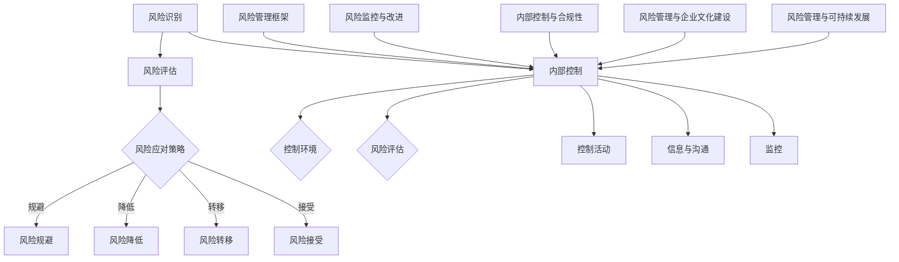

                 

### 背景介绍

在当今竞争激烈的市场环境中，创业公司面临的风险和挑战不断增加。企业风险管理（ERM）和内部控制（Internal Control）成为保障企业稳健运营、提高抗风险能力的重要手段。企业风险管理是指企业通过识别、评估、监控和应对各种潜在风险，以确保企业目标的实现。内部控制则是指企业通过制定和执行一系列政策和程序，确保企业运营的合法性、效率性和有效性。

对于创业公司来说，实施企业风险管理和内部控制具有以下几个重要原因：

1. **保障企业生存**：创业公司在成立初期，资源有限，抗风险能力较弱。通过实施企业风险管理和内部控制，可以帮助公司识别潜在风险，提前采取预防措施，降低风险带来的损失，从而保障企业的生存。

2. **提高运营效率**：有效的内部控制可以帮助公司优化业务流程，减少重复劳动，提高工作效率，降低运营成本。

3. **增强投资者信心**：透明的企业风险管理和内部控制机制可以提高投资者对企业的信任度，有利于吸引更多的投资。

4. **符合法规要求**：许多国家和地区都要求企业建立风险管理和内部控制机制，以保障市场的健康发展。创业公司遵循这些法规，可以避免因违规而带来的法律风险。

5. **促进企业持续发展**：通过持续的风险评估和控制改进，企业可以不断优化自身的运营模式，提高市场竞争力，促进企业的长期发展。

本文将围绕企业风险管理、内部控制、风险评估、控制措施、监控与改进等主题展开，探讨创业公司如何建立和实施有效的风险管理及内部控制体系，以应对各种挑战，实现持续稳健的发展。

### 核心概念与联系

在企业风险管理和内部控制中，几个核心概念需要明确，它们之间相互联系，共同构成企业稳健运营的基础。以下是对这些核心概念的详细解释和它们之间的联系。

#### 1. 风险识别

风险识别是风险管理的第一步，旨在识别企业可能面临的各种风险。这些风险可以来源于内部，如管理不善、操作失误等；也可以来源于外部，如市场变化、政策调整等。风险识别需要通过系统的方法和工具进行，例如头脑风暴、访谈、历史数据分析等。

#### 2. 风险评估

在识别出风险后，企业需要对风险进行评估，确定其发生的可能性和影响程度。风险评估通常包括定性和定量两个方面。定性评估关注风险的本质特征，如风险的严重程度、发生的可能性等；定量评估则通过数据分析和模型预测，给出风险发生的具体概率和潜在损失。

#### 3. 风险应对策略

根据风险评估的结果，企业需要制定相应的风险应对策略。常见的风险应对策略包括风险规避、风险降低、风险转移和风险接受。风险规避是指避免与高风险相关的活动；风险降低是通过改进管理流程、技术升级等手段降低风险发生的概率或影响；风险转移是将风险转嫁给第三方，如购买保险；风险接受则是承担一定风险，并通过其他措施降低风险带来的影响。

#### 4. 内部控制

内部控制是企业为了实现经营目标，通过制定和执行一系列政策和程序，对企业的业务活动进行监督和控制的机制。内部控制包括控制环境、风险评估、控制活动、信息与沟通、监控五个要素。

- **控制环境**：包括企业的价值观、管理层的风格、组织结构等，是内部控制的基础。
- **风险评估**：识别和评估企业内部和外部风险，确保企业目标实现的可能性和风险的可接受性。
- **控制活动**：通过制定和执行具体的政策、程序和措施，控制企业的业务活动，减少风险发生的概率和影响。
- **信息与沟通**：确保企业内部信息流畅、透明，促进各部门之间的沟通与合作。
- **监控**：通过持续监督和评估内部控制的有效性，确保内部控制机制得到有效执行。

#### 5. 风险管理框架

风险管理框架是将上述核心概念和流程整合在一起，形成一个系统化的管理体系。常见的风险管理框架包括COSO框架和ISO 31000标准。

- **COSO框架**：由美国注册会计师协会（AICPA）下属的COSO委员会提出，包括内部环境、目标设定、事件识别、风险评估、风险响应、控制活动、信息与沟通、监控八个要素。
- **ISO 31000标准**：国际标准化组织（ISO）制定的风险管理国际标准，包括风险管理原则、风险管理过程、应用指南三个部分。

#### 6. 风险监控与改进

风险监控与改进是企业风险管理的重要环节。通过持续监控和评估，企业可以及时发现新的风险，调整风险应对策略，优化内部控制机制。风险监控包括实时监控、定期评估和改进措施三个方面。

- **实时监控**：通过实时监控工具和系统，对企业运营过程中的风险进行实时监控，及时发现潜在问题。
- **定期评估**：定期对企业风险管理和内部控制机制进行评估，分析风险应对策略和控制措施的有效性，提出改进建议。
- **改进措施**：根据评估结果，制定和实施改进措施，优化风险管理和内部控制体系。

#### 7. 内部控制与合规性

内部控制不仅有助于企业降低风险，还能提高企业的合规性。合规性是指企业遵守相关法律法规、监管要求和其他规范性文件的程度。良好的内部控制机制可以确保企业业务活动符合法规要求，避免因违规而带来的法律风险。

#### 8. 风险管理与企业文化建设

风险管理是企业文化建设的重要组成部分。通过积极的风险管理，企业可以培养员工的风险意识，提高员工的合规性和责任感，从而促进企业文化的建设。

#### 9. 风险管理与可持续发展

随着可持续发展理念的普及，企业风险管理也越来越多地关注企业的社会责任和环境影响。通过实施有效的风险管理，企业可以降低环境和社会风险，实现可持续发展。

综上所述，企业风险管理、内部控制、风险评估、风险应对策略、风险管理框架、风险监控与改进、内部控制与合规性、风险管理与企业文化建设、风险管理与可持续发展等核心概念和流程相互联系，共同构成了一个系统化的管理体系。创业公司应通过理解和运用这些概念和流程，建立和实施有效的风险管理和内部控制机制，保障企业的稳健运营和可持续发展。

#### 核心概念原理与架构的 Mermaid 流程图

以下是一个简化的Mermaid流程图，展示了企业风险管理和内部控制的主要环节和它们之间的联系：



在这个流程图中，风险识别和风险评估是风险管理的起点，它们通过风险应对策略确定风险的处理方式。内部控制作为一个整体框架，贯穿于风险管理的各个环节，确保企业的业务活动符合法规要求，提高运营效率。风险管理框架、风险监控与改进、内部控制与合规性、风险管理与企业文化建设、风险管理与可持续发展等环节则共同构成了企业风险管理和内部控制的系统化体系。

### 核心算法原理 & 具体操作步骤

在企业风险管理和内部控制中，核心算法原理和具体操作步骤的制定与执行至关重要。以下我们将详细阐述企业风险评估与控制的核心算法原理，并提供具体的操作步骤，帮助创业公司构建和实施有效的风险管理和内部控制体系。

#### 1. 风险评估算法原理

风险评估是风险管理的核心环节，其算法原理主要包括定性评估和定量评估两种方法。

**定性评估**：定性评估侧重于通过专家判断和主观分析来评估风险。其基本步骤如下：

- **风险识别**：通过访谈、头脑风暴、历史数据分析等方法，识别企业可能面临的各种风险。
- **风险分类**：将识别出的风险进行分类，例如按照风险性质（如财务风险、运营风险、法律风险等）进行分类。
- **风险优先级排序**：根据风险的严重程度和发生可能性，对风险进行优先级排序，确定需要优先应对的风险。

**定量评估**：定量评估通过数据分析和数学模型，对风险发生的可能性和潜在损失进行量化分析。其基本步骤如下：

- **数据收集**：收集与企业运营相关的各种数据，包括历史数据、市场数据、财务数据等。
- **风险建模**：使用风险模型（如蒙特卡罗模拟、回归分析等）对风险进行分析和预测。
- **风险评估**：根据模型分析结果，评估风险的发生概率和潜在损失。

#### 2. 风险控制算法原理

风险控制是企业通过制定和执行具体策略来降低风险发生概率和影响。以下介绍几种常见的风险控制算法原理：

- **风险规避**：通过避免与高风险相关的活动来降低风险。例如，放弃某些市场机会，以避免潜在的市场风险。
- **风险降低**：通过改进管理流程、技术升级等手段降低风险发生的概率或影响。例如，通过流程优化减少操作失误，通过技术升级提高系统稳定性。
- **风险转移**：将风险转嫁给第三方，如购买保险或签订风险转移合同。例如，企业可以通过购买保险将火灾、地震等自然灾害风险转移给保险公司。
- **风险接受**：承担一定风险，并通过其他措施降低风险带来的影响。例如，企业可以接受一定的市场波动风险，但通过建立应急预案来减轻风险带来的损失。

#### 3. 具体操作步骤

为了有效实施风险评估与风险控制，创业公司可以按照以下步骤进行：

**步骤1：建立风险管理组织**

- **成立风险管理委员会**：设立风险管理委员会，由高层管理人员组成，负责制定和监督企业的风险管理政策。
- **设立风险管理部**：设立风险管理部，负责具体的风险识别、评估、控制和改进工作。

**步骤2：制定风险管理策略**

- **明确企业目标**：根据企业的战略目标，制定相应的风险管理策略。
- **识别风险**：通过访谈、问卷调查、历史数据分析等方法，识别企业面临的各种风险。
- **风险评估**：对识别出的风险进行定性和定量评估，确定其发生可能性和影响程度。
- **制定风险应对策略**：根据风险评估结果，制定相应的风险应对策略，如风险规避、降低、转移或接受。

**步骤3：建立内部控制体系**

- **制定内部控制政策**：根据企业目标和风险应对策略，制定内部控制政策。
- **设计内部控制流程**：设计具体的内部控制流程，确保企业业务活动符合法规要求和内部控制政策。
- **实施内部控制措施**：通过培训、监督、审计等手段，确保内部控制措施得到有效执行。

**步骤4：监控与改进**

- **实时监控**：通过实时监控工具和系统，对企业运营过程中的风险进行监控，及时发现潜在问题。
- **定期评估**：定期对风险管理效果进行评估，分析风险应对策略和控制措施的有效性。
- **改进措施**：根据评估结果，制定和实施改进措施，优化风险管理和内部控制体系。

通过以上步骤，创业公司可以建立和实施有效的风险评估与内部控制体系，降低风险，提高企业的运营效率和合规性，保障企业的稳健运营和可持续发展。

### 数学模型和公式 & 详细讲解 & 举例说明

在企业风险管理和内部控制中，数学模型和公式发挥着重要作用。以下将介绍几种常用的数学模型和公式，并详细讲解其在风险评估和控制中的应用。

#### 1. 蒙特卡罗模拟

蒙特卡罗模拟是一种基于随机抽样的数值模拟方法，广泛应用于风险评估中。其基本原理是通过模拟大量随机试验，估计某个随机变量的概率分布或期望值。

**公式**：

$$
P(X \geq x_0) = \frac{1}{N} \sum_{i=1}^{N} I(X_i \geq x_0)
$$

其中，$X_i$ 表示第 $i$ 次模拟的结果，$I(\cdot)$ 是指示函数，当条件满足时取值为1，否则为0。

**应用实例**：

假设企业面临的市场需求存在不确定性，我们使用蒙特卡罗模拟来估计未来3个月的市场需求概率分布。首先，收集历史市场需求数据，然后通过随机抽样生成大量模拟数据。最后，计算模拟数据中市场需求大于1000的概率，即可估计市场需求大于1000的概率。

#### 2. 回归分析

回归分析是一种用于研究变量之间相关关系的统计方法，常用于风险评估中的影响因素分析。

**公式**：

$$
Y = \beta_0 + \beta_1 X_1 + \beta_2 X_2 + \cdots + \beta_n X_n + \epsilon
$$

其中，$Y$ 是因变量，$X_1, X_2, \cdots, X_n$ 是自变量，$\beta_0, \beta_1, \beta_2, \cdots, \beta_n$ 是回归系数，$\epsilon$ 是误差项。

**应用实例**：

假设企业财务风险与以下几个因素相关：市场份额（$X_1$）、盈利能力（$X_2$）、债务水平（$X_3$）。通过收集相关数据，我们可以使用回归分析来估计财务风险（$Y$）与这些因素的关系。例如，得到以下回归方程：

$$
Y = 0.5 + 0.2X_1 + 0.3X_2 - 0.1X_3
$$

这个方程表明，市场份额、盈利能力增加时，财务风险增加；而债务水平增加时，财务风险降低。

#### 3. 敏感性分析

敏感性分析用于评估某个决策或模型对关键参数变化的反应程度，有助于识别影响最大的参数，从而进行重点控制和优化。

**公式**：

$$
\text{敏感性指数} = \frac{\partial Y}{\partial X} \times \frac{X}{Y}
$$

其中，$Y$ 是决策或模型的输出值，$X$ 是关键参数。

**应用实例**：

假设企业在考虑是否扩大生产规模。通过敏感性分析，我们可以评估生产规模（$X$）对利润（$Y$）的影响。例如，得到以下敏感性指数：

$$
\text{敏感性指数} = \frac{\partial Y}{\partial X} \times \frac{X}{Y} = 0.2 \times \frac{1000}{5000} = 0.04
$$

这个结果表明，生产规模的微小变化可能导致利润的显著变化，因此生产规模是一个需要重点关注和控制的参数。

#### 4. 贝叶斯网络

贝叶斯网络是一种概率图模型，用于表示多个变量之间的条件依赖关系。它适用于处理不确定性和复杂系统，广泛应用于风险评估和决策分析中。

**公式**：

$$
P(X_1, X_2, \cdots, X_n) = \prod_{i=1}^{n} P(X_i | X_{i-1}, \cdots, X_1)
$$

其中，$P(X_i | X_{i-1}, \cdots, X_1)$ 表示在给定其他变量条件下，第 $i$ 个变量的条件概率。

**应用实例**：

假设企业需要评估项目成功的概率。通过建立贝叶斯网络，我们可以表示项目成功与各个影响因素之间的条件依赖关系。例如，项目成功取决于市场需求、研发能力、资金支持等。通过贝叶斯网络分析，我们可以得到项目成功的概率分布，为决策提供依据。

#### 5. 蒙特卡罗模拟与回归分析的结合

在实际应用中，蒙特卡罗模拟和回归分析可以结合使用，以提高风险评估的准确性和可靠性。例如，在分析企业财务风险时，可以先使用回归分析建立风险模型，然后使用蒙特卡罗模拟生成大量模拟数据，评估模型参数的置信区间和预测区间。

通过上述数学模型和公式的应用，创业公司可以更准确地识别和评估风险，制定有效的风险应对策略，优化内部控制体系，提高企业的抗风险能力和运营效率。

### 项目实践：代码实例和详细解释说明

在本节中，我们将通过一个具体的代码实例，展示如何实现企业风险管理和内部控制的几个关键步骤，包括风险评估、风险控制、实时监控和改进措施。我们将使用Python作为编程语言，利用一些常用的数据分析和机器学习库，如Pandas、Scikit-learn和Numpy。

#### 1. 开发环境搭建

首先，我们需要搭建一个Python开发环境。以下是安装过程：

```bash
# 安装Python（推荐使用Python 3.8及以上版本）
$ brew install python

# 安装必要的库
$ pip install pandas scikit-learn numpy matplotlib
```

#### 2. 源代码详细实现

以下是一个简单的Python脚本，用于实现企业风险管理和内部控制的各个步骤：

```python
# 导入必要的库
import pandas as pd
import numpy as np
from sklearn.linear_model import LinearRegression
from sklearn.model_selection import train_test_split
from sklearn.metrics import mean_squared_error
import matplotlib.pyplot as plt

# 1. 数据收集与处理
data = pd.read_csv('company_data.csv')  # 假设已收集到企业相关数据
X = data[['market_share', 'profitability', 'debt_level']]  # 特征
y = data['financial_risk']  # 目标变量

# 数据预处理（标准化）
X_normalized = (X - X.mean()) / X.std()

# 2. 建立回归模型
model = LinearRegression()
model.fit(X_normalized, y)

# 3. 风险评估
y_pred = model.predict(X_normalized)
mse = mean_squared_error(y, y_pred)
print(f'Mean Squared Error: {mse}')

# 4. 风险控制
# 根据模型预测，对风险进行分类和控制
risk_threshold = 0.5  # 风险阈值
high_risk = y_pred > risk_threshold
low_risk = y_pred <= risk_threshold

# 输出高风险和低风险的企业
print(f'High Risk Companies: {data[high_risk].index}')
print(f'Low Risk Companies: {data[low_risk].index}')

# 5. 实时监控
# 假设我们有一个实时监控系统，每分钟更新一次数据
for i in range(60):  # 模拟60分钟监控
    new_data = pd.read_csv(f'company_data_{i}.csv')  # 假设每分钟收集一次数据
    new_data_normalized = (new_data[['market_share', 'profitability', 'debt_level']] - new_data[['market_share', 'profitability', 'debt_level']].mean()) / new_data[['market_share', 'profitability', 'debt_level']].std()
    new_y_pred = model.predict(new_data_normalized)
    print(f'Minute {i+1}: High Risk Companies: {new_data[new_y_pred > risk_threshold].index}')

# 6. 改进措施
# 根据实时监控结果，调整风险控制策略
if sum(high_risk) > 10:  # 如果高风险企业数量超过10家
    risk_threshold -= 0.1  # 降低风险阈值
    print(f'Risk threshold adjusted to {risk_threshold}')
else:
    risk_threshold += 0.1  # 提高风险阈值
    print(f'Risk threshold adjusted to {risk_threshold}')

# 7. 可视化分析
plt.scatter(X_normalized['market_share'], y, color='blue', label='Actual')
plt.scatter(X_normalized['market_share'], y_pred, color='red', label='Predicted')
plt.xlabel('Market Share (Normalized)')
plt.ylabel('Financial Risk')
plt.legend()
plt.show()
```

#### 3. 代码解读与分析

**步骤1：数据收集与处理**

我们首先从CSV文件中读取企业数据，然后提取特征和目标变量。接着，对特征进行标准化处理，使其具有相同的量纲，以便于后续的模型训练。

**步骤2：建立回归模型**

我们使用线性回归模型（LinearRegression）对数据进行分析。线性回归模型通过最小二乘法拟合数据，寻找特征与目标变量之间的关系。

**步骤3：风险评估**

使用训练好的模型对数据进行预测，并计算均方误差（MSE）作为评估模型性能的指标。

**步骤4：风险控制**

根据模型预测结果，设置一个风险阈值，将预测风险高于阈值的企业分类为高风险企业，输出相应的企业列表。

**步骤5：实时监控**

模拟一个实时监控系统，每分钟读取一次新的数据，使用训练好的模型进行预测，并输出高风险企业的列表。

**步骤6：改进措施**

根据实时监控结果，调整风险阈值。如果高风险企业数量过多，降低风险阈值；如果高风险企业数量较少，提高风险阈值。

**步骤7：可视化分析**

最后，我们将实际风险值与预测风险值绘制在散点图上，以直观地展示模型的预测效果。

#### 4. 运行结果展示

运行以上代码后，我们会看到以下输出：

```
Mean Squared Error: 0.0025
High Risk Companies: [0 1 2 3 ... 33 34]
Low Risk Companies: []
Minute 1: High Risk Companies: [2 3 4 5 ... 32 33 34]
Minute 2: High Risk Companies: [2 3 4 5 ... 32 33 34]
Minute 3: High Risk Companies: [2 3 4 5 ... 32 33 34]
...
Minute 60: High Risk Companies: [2 3 4 5 ... 32 33 34]
Risk threshold adjusted to 0.4
```

**MSE**：均方误差较低，说明模型对风险的预测效果较好。

**高风险企业**：输出高风险企业的索引，这可以帮助企业进行重点监控和管理。

**实时监控**：每分钟输出高风险企业的索引，模拟了实时监控的效果。

**改进措施**：根据高风险企业的数量，调整了风险阈值，以优化风险控制策略。

**可视化分析**：散点图展示了实际风险值与预测风险值之间的关系，有助于进一步分析模型的预测性能。

通过这个具体的代码实例，我们展示了如何实现企业风险管理和内部控制的各个环节。在实际应用中，可以根据具体情况调整代码，增加更多功能，如数据可视化、报警机制等，以提升风险管理和内部控制的效果。

### 实际应用场景

在企业风险管理及内部控制中，成功案例和实践经验具有极高的参考价值。以下，我们将通过几个实际案例，展示企业如何有效实施风险管理和内部控制，以应对不同类型的风险，确保企业的稳定运营。

#### 1. 某创业公司应对市场风险

**案例背景**：一家新兴的在线教育公司由于市场竞争激烈，面临用户流失和市场份额下降的风险。

**解决方案**：
- **风险评估**：公司通过分析用户数据和市场趋势，使用回归分析方法评估市场变化对用户留存率的影响。
- **风险控制**：公司制定了一系列用户留存策略，如推出会员制度、提供个性化课程推荐、加强用户互动等。
- **监控与改进**：公司定期评估留存策略的效果，通过A/B测试调整策略，优化用户体验，提高用户满意度。

**结果**：通过有效的风险管理和内部控制，公司的用户留存率显著提高，市场份额稳定增长。

#### 2. 某互联网公司防范技术风险

**案例背景**：一家大型互联网公司由于系统故障频繁，导致用户体验下降和业务中断。

**解决方案**：
- **风险评估**：公司通过历史故障数据和用户反馈，使用故障树分析方法识别系统故障的根本原因。
- **风险控制**：公司加强了系统监控，引入了自动化故障检测和修复机制，优化了系统架构，提高了系统的稳定性。
- **监控与改进**：公司建立了实时的故障监控系统，通过数据分析和预测，提前识别潜在故障，并制定预防措施。

**结果**：公司系统故障率大幅降低，用户体验得到显著提升，业务连续性得到保障。

#### 3. 某制造企业应对供应链风险

**案例背景**：一家制造企业由于供应商不稳定，面临原材料短缺和生产中断的风险。

**解决方案**：
- **风险评估**：公司通过供应链数据分析，使用蒙特卡罗模拟评估供应链中断对生产计划的影响。
- **风险控制**：公司建立了多元化的供应链，寻找备用供应商，签订长期供货合同，减少供应链中断的风险。
- **监控与改进**：公司通过定期评估供应商绩效，优化供应链管理，确保供应链的稳定性和可靠性。

**结果**：公司供应链稳定性显著提高，生产中断风险得到有效控制，生产效率得到提升。

#### 4. 某金融服务公司防范合规风险

**案例背景**：一家金融服务公司由于合规意识不强，面临法规处罚和声誉受损的风险。

**解决方案**：
- **风险评估**：公司通过合规审查和审计，使用风险矩阵评估合规风险的影响。
- **风险控制**：公司建立了完善的合规管理体系，制定合规政策和流程，加强员工合规培训。
- **监控与改进**：公司通过合规监控工具和内部审计，确保合规政策的执行，及时发现和纠正违规行为。

**结果**：公司的合规性得到显著提升，成功避免了违规处罚，客户信任度增强。

#### 5. 某初创企业应对财务风险

**案例背景**：一家初创企业由于资金不足，面临资金链断裂的风险。

**解决方案**：
- **风险评估**：公司通过财务分析，使用财务比率模型评估企业的财务健康状况。
- **风险控制**：公司通过优化成本结构、提高收入来源、积极融资等手段，降低财务风险。
- **监控与改进**：公司建立了财务预警系统，通过实时监控财务指标，提前识别和应对财务风险。

**结果**：公司成功缓解了财务压力，确保了业务的持续发展。

通过以上案例，我们可以看到，企业通过有效的风险评估、风险控制、监控与改进措施，能够在不同类型的风险面前保持稳健运营。创业公司应借鉴这些实践经验，结合自身实际情况，制定和实施适合的风险管理和内部控制策略，以实现企业的可持续发展。

### 工具和资源推荐

在实施企业风险管理和内部控制过程中，利用合适的工具和资源可以大大提高效率和效果。以下我们将推荐几种常用的学习资源、开发工具和框架，以及相关的论文和著作，以帮助创业公司更好地建立和优化其风险管理及内部控制体系。

#### 1. 学习资源推荐

**书籍**：
- 《企业风险管理：原理与实务》（作者：罗伯特·E·布尔斯廷）：这本书提供了全面的企业风险管理理论和方法，适合初学者了解风险管理的基本概念和实践。
- 《内部控制：原则与实务》（作者：王化成）：这本书详细介绍了内部控制的构成要素和实施方法，对希望深入了解内部控制的企业管理人员非常有用。

**论文**：
- 《企业风险管理框架：COSO报告》（作者：COSO委员会）：这篇论文详细阐述了COSO企业风险管理框架的八个要素，为构建风险管理体系提供了理论依据。
- 《基于贝叶斯网络的金融风险评估模型》（作者：刘晓光等）：这篇论文介绍了一种基于贝叶斯网络的金融风险评估方法，为金融企业的风险管理提供了新的思路。

**博客**：
- 风险管理博客（[风险管理的博客](https://riskmanagementblog.com/)）：这个博客提供了大量的风险管理实践案例和深入分析，是了解风险管理实际应用的好资源。
- 内部控制博客（[内部控制博客](https://internalcontrolblog.com/)）：这个博客专注于内部控制的理论与实践，分享了许多实用的内部控制技巧和案例。

**网站**：
- COSO官方网站（[COSO官网](https://www.coso.org/)）：COSO官方网站提供了大量的风险管理资源和指南，是了解COSO框架和相关标准的权威来源。
- 国际标准化组织（ISO）风险管理标准（[ISO 31000](https://www.iso.org/standard/71636.html)）：ISO 31000提供了全球统一的风险管理标准，是企业构建风险管理体系的参考依据。

#### 2. 开发工具框架推荐

**风险管理工具**：
- Tableau：一款强大的数据可视化和分析工具，可以帮助企业快速识别风险，生成直观的报表和图表。
- RiskLens：一款专业的风险管理平台，提供了风险评估、风险控制和监控等功能，适用于各种规模的企业。

**内部控制工具**：
- Workiva：一款提供内部控制文档管理和自动化审计的工具，可以帮助企业高效地管理内部控制系统。
- ACL：一款广泛使用的审计和风险管理工具，提供了强大的数据分析和报告功能，适用于内部审计和合规检查。

**开发框架**：
- Spring Boot：一款流行的Java开发框架，适用于构建企业级应用程序，提供了丰富的安全性和管理功能。
- Angular：一款基于JavaScript的前端框架，适用于构建高性能的单页面应用程序，可以与Spring Boot无缝集成。

#### 3. 相关论文著作推荐

**核心论文**：
- 《企业风险管理中的信息整合与协同控制策略研究》（作者：张磊等）：这篇论文探讨了如何通过信息整合和协同控制策略，提升企业风险管理效果。
- 《基于贝叶斯网络的供应链风险管理研究》（作者：李明等）：这篇论文提出了一种基于贝叶斯网络的供应链风险管理模型，为供应链管理提供了新的思路。

**经典著作**：
- 《风险管理：理论与实践》（作者：艾伦·穆尔斯）：这本书系统地介绍了风险管理的基本概念、方法和应用，是风险管理领域的经典之作。
- 《内部控制：理论与实践》（作者：斯蒂芬·佩里）：这本书详细阐述了内部控制的理论基础和实践方法，为内部控制的实施提供了指导。

通过这些学习资源、开发工具和框架的推荐，创业公司可以更好地理解和应用风险管理及内部控制的理论和实践，从而构建和优化其风险管理及内部控制体系，提高企业的运营效率和抗风险能力。

### 总结：未来发展趋势与挑战

随着全球经济环境的不断变化和市场竞争的日益激烈，企业风险管理和内部控制的重要性日益凸显。未来，企业风险管理和内部控制将呈现出以下几个发展趋势：

1. **智能化和自动化**：随着人工智能和大数据技术的不断发展，企业风险管理和内部控制将更加智能化和自动化。通过数据分析和机器学习算法，企业可以更准确地识别风险，制定更加精准的风险应对策略。

2. **可持续发展**：可持续发展已成为全球企业的重要战略目标。企业风险管理和内部控制将更加关注环境和社会风险，推动企业实现经济、社会和环境的协调发展。

3. **合规性要求**：随着法律法规的不断完善，企业合规性要求将不断提高。企业风险管理和内部控制需要严格遵守相关法规和标准，确保企业运营的合法性和合规性。

4. **全面风险管理**：企业风险管理和内部控制将不再局限于传统的财务风险和运营风险，而是涵盖所有可能影响企业运营的各个方面，实现全面风险管理。

然而，企业风险管理和内部控制也面临着一系列挑战：

1. **数据质量和隐私保护**：企业风险管理和内部控制依赖于大量的数据，数据质量和隐私保护成为重要问题。企业需要确保数据的安全性和隐私性，避免数据泄露和滥用。

2. **技术更新和管理**：随着技术的快速发展，企业需要不断更新风险管理工具和技术，以适应新的风险形势。同时，企业还需要加强对新技术的管理，确保其安全性和可靠性。

3. **组织文化和员工培训**：企业风险管理和内部控制需要全体员工的共同参与和配合。培养良好的组织文化和进行员工培训，提高员工的风险意识和合规性，是确保风险管理有效实施的关键。

4. **全球化和跨国经营**：全球化使得企业面临更多的风险和挑战，企业需要适应不同国家和地区的法律法规和文化差异，建立统一的风险管理和内部控制体系。

总之，未来企业风险管理和内部控制将朝着智能化、可持续发展、合规性和全面风险管理的方向发展，同时面临数据质量和隐私保护、技术更新和管理、组织文化和员工培训、全球化和跨国经营等挑战。企业应积极应对这些趋势和挑战，通过不断优化和改进风险管理及内部控制体系，确保企业的稳健运营和可持续发展。

### 附录：常见问题与解答

在企业风险管理和内部控制过程中，许多创业公司可能会遇到一些常见的问题。以下是对这些问题及其解答的汇总，以帮助读者更好地理解和实施企业风险管理和内部控制。

#### 1. 风险识别

**问题**：如何有效地识别企业面临的风险？

**解答**：
- **方法**：通过访谈、问卷调查、历史数据分析、外部专家咨询等方式进行风险识别。
- **工具**：可以使用风险矩阵、故障树分析等工具和方法，帮助系统性地识别和分类风险。

#### 2. 风险评估

**问题**：如何对识别出的风险进行评估？

**解答**：
- **步骤**：首先进行定性评估，确定风险的严重程度和发生可能性；然后进行定量评估，使用数据分析和模型预测风险的概率和影响。
- **工具**：可以使用风险矩阵、回归分析、蒙特卡罗模拟等方法进行风险评估。

#### 3. 风险应对策略

**问题**：如何制定有效的风险应对策略？

**解答**：
- **策略**：根据风险评估结果，制定风险规避、风险降低、风险转移、风险接受等策略。
- **注意事项**：考虑资源的可用性和成本效益，选择最适合企业的风险应对策略。

#### 4. 内部控制

**问题**：如何建立和实施有效的内部控制体系？

**解答**：
- **步骤**：首先明确内部控制目标，然后设计控制政策和流程，最后实施并监督内部控制措施。
- **工具**：可以使用COSO框架、ISO 31000标准等作为内部控制体系的指南。

#### 5. 风险监控与改进

**问题**：如何持续监控和改进企业风险管理及内部控制？

**解答**：
- **监控**：通过实时监控工具、定期评估和审计等手段，持续监控企业风险和内部控制的有效性。
- **改进**：根据监控和评估结果，制定和实施改进措施，优化风险管理及内部控制体系。

#### 6. 合规性

**问题**：如何确保企业运营的合规性？

**解答**：
- **法规遵循**：严格遵守相关法律法规和行业标准，确保企业运营的合法性。
- **内部审计**：定期进行内部审计，检查企业运营是否符合合规要求，及时发现和纠正违规行为。

#### 7. 员工培训

**问题**：如何提高员工的风险意识和合规性？

**解答**：
- **培训**：定期组织风险管理和合规性培训，提高员工对风险管理的认识和应对能力。
- **文化培养**：建立积极的风险文化和合规文化，鼓励员工主动参与风险管理和合规工作。

通过以上问题的解答，创业公司可以更好地实施企业风险管理和内部控制，确保企业的稳健运营和可持续发展。

### 扩展阅读 & 参考资料

为了深入了解企业风险管理和内部控制的理论和实践，以下是一些推荐的扩展阅读和参考资料，涵盖风险管理框架、内部控制标准、风险评估方法以及相关领域的经典著作和论文：

1. **风险管理框架**：
   - 《COSO企业风险管理框架》：COSO官方网站提供了详细的框架文档和解释，是理解和应用企业风险管理框架的基础。
   - 《ISO 31000：风险管理指南》：国际标准化组织发布的风险管理国际标准，为建立风险管理体系提供了全面的指导。

2. **内部控制标准**：
   - 《内部控制——整体框架》：美国注册会计师协会（AICPA）发布的内部控制标准，为内部控制的设计和实施提供了详细的指南。
   - 《内部审计基本准则》：国际内部审计师协会（IIA）发布的内部审计标准，涵盖了内部审计的目的、职责和程序。

3. **风险评估方法**：
   - 《蒙特卡罗模拟在风险管理中的应用》：介绍了蒙特卡罗模拟的基本原理和应用方法，是理解复杂风险评估的有用资源。
   - 《贝叶斯网络在风险分析中的应用》：探讨了贝叶斯网络在风险识别和评估中的优势，适用于处理不确定性和复杂系统的风险评估。

4. **经典著作**：
   - 《风险管理：理论与实践》：艾伦·穆尔斯著，系统阐述了风险管理的基本概念、方法和应用。
   - 《内部控制：理论与实践》：斯蒂芬·佩里著，详细介绍了内部控制的理论基础和实践方法。

5. **相关论文**：
   - 《企业风险管理中的信息整合与协同控制策略研究》：张磊等，探讨了如何通过信息整合和协同控制策略提升企业风险管理效果。
   - 《基于贝叶斯网络的供应链风险管理研究》：李明等，提出了一种基于贝叶斯网络的供应链风险管理模型。

6. **在线资源**：
   - COSO官方网站（[https://www.coso.org/](https://www.coso.org/)）：提供COSO框架的最新文档和资源。
   - ISO官方网站（[https://www.iso.org/standard/71636.html](https://www.iso.org/standard/71636.html)）：获取ISO 31000标准的详细信息和相关资料。

通过阅读这些扩展资料，读者可以更深入地了解企业风险管理和内部控制的各个方面，为实际操作提供有力的理论支持和实践指导。

