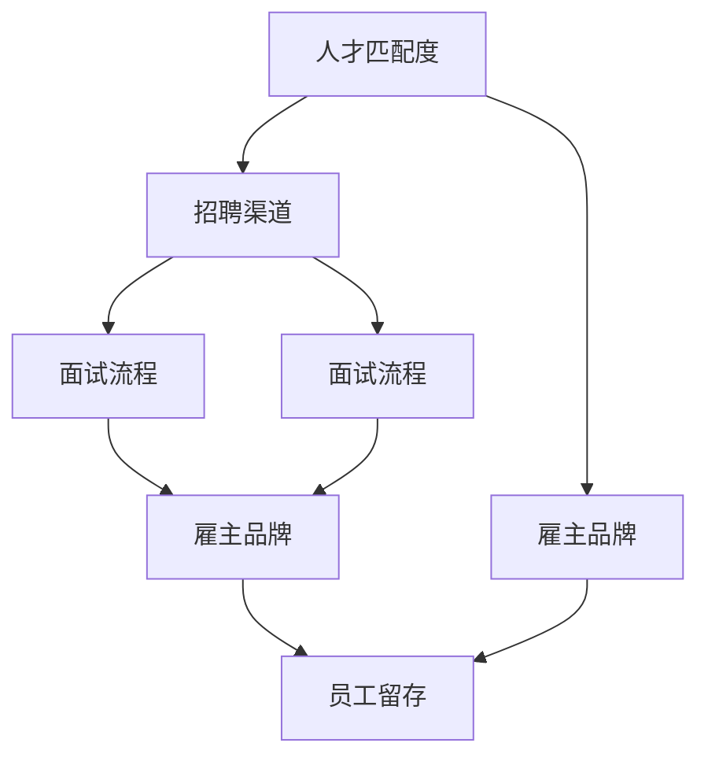

                 

### 背景介绍

在当今快速变化和竞争激烈的商业环境中，创业公司的成功往往取决于其能否迅速扩张，抓住市场机遇。而这一切的核心，就是人才。招聘成为创业公司成长过程中至关重要的一环。然而，与大型公司相比，创业公司在招聘过程中面临着许多独特挑战，这决定了其招聘策略的制定必须具有高度的灵活性和创新性。

#### 创业公司与大型公司招聘的区别

创业公司和大型公司之间的招聘差异主要体现在以下几个方面：

1. **公司规模与资源限制**：创业公司通常规模较小，资源有限，这意味着他们无法提供与大型公司相媲美的薪资和福利待遇。因此，创业公司需要通过其他方式吸引和留住人才。

2. **招聘速度**：创业公司为了抓住市场机会，往往需要快速招聘并迅速投入工作。这种快速招聘的要求决定了创业公司的招聘流程必须高效且灵活。

3. **公司文化**：创业公司的文化通常更加开放和灵活，注重创新和团队协作。创业公司的招聘策略需要与这种文化相契合，以吸引和留住合适的候选人。

4. **目标候选人**：创业公司更倾向于招聘那些对创新有热情，愿意接受挑战并能在不确定的环境中工作的人才。相比之下，大型公司可能更关注候选人的专业技能和经验。

#### 招聘策略的重要性

招聘策略在创业公司的发展中起着至关重要的作用：

1. **人才匹配**：制定合适的招聘策略有助于确保招聘到的人才与公司文化和需求相匹配，从而提高团队效率和员工满意度。

2. **快速扩张**：一个有效的招聘策略可以帮助创业公司快速组建所需的团队，抓住市场机遇。

3. **公司品牌**：创业公司的招聘策略直接影响其品牌形象。一个高效的招聘流程不仅能够吸引优秀人才，还能提升公司在行业中的声誉。

4. **成本控制**：创业公司的资源有限，一个高效的招聘策略能够帮助公司降低招聘成本，提高投资回报率。

综上所述，创业公司的招聘策略不仅关乎当前的人才需求，更是其未来发展的基石。接下来，我们将深入探讨创业公司在招聘过程中所面临的具体挑战和解决方案。

### 核心概念与联系

在讨论创业公司的增长型招聘时，有几个核心概念和原则至关重要，它们不仅帮助我们理解招聘策略的复杂性，也为实际操作提供了指导。以下是这些核心概念，以及它们之间的相互关系。

#### 核心概念

1. **人才匹配度**：人才匹配度是指候选人的技能、经验和价值观与公司需求和文化的一致性。它是招聘过程中最重要的因素之一。

2. **招聘渠道**：招聘渠道是指公司用来吸引候选人的途径，如招聘网站、社交媒体、人才市场等。

3. **面试流程**：面试流程是评估候选人是否适合职位和公司文化的过程。它通常包括初步面试、技术面试和行为面试等。

4. **雇主品牌**：雇主品牌是指公司在求职者眼中的形象和声誉。一个强大的雇主品牌有助于吸引顶尖人才。

5. **员工留存**：员工留存是指公司留住优秀员工的能力。高员工留存率有助于保持团队稳定和公司文化的连续性。

#### 关系

1. **人才匹配度与招聘渠道**：高效的招聘渠道有助于吸引更多符合条件的候选人，从而提高人才匹配度。

2. **招聘渠道与面试流程**：不同的招聘渠道可能需要不同的面试流程。例如，线上招聘可能更适合初步面试，而现场招聘可能更适合技术面试。

3. **面试流程与雇主品牌**：一个公正、透明且高效的面试流程有助于提升公司作为雇主的声誉。

4. **雇主品牌与员工留存**：一个积极的雇主品牌可以吸引优秀人才，并提高员工的满意度和忠诚度，从而降低员工流失率。

#### Mermaid 流程图

下面是这些核心概念和关系的一个简化的 Mermaid 流程图表示：



在创业公司的招聘过程中，这些核心概念和关系的相互影响构成了一个动态的系统，必须通过综合考虑和灵活调整来实现最佳效果。接下来，我们将深入探讨这些核心概念在实际操作中的应用和重要性。

### 核心算法原理 & 具体操作步骤

在创业公司的招聘过程中，核心算法原理可以被视为一种策略框架，指导公司在面对复杂和快速变化的市场环境时如何有效招聘人才。以下是这个核心算法的基本原理和具体的操作步骤：

#### 基本原理

1. **需求分析**：首先，公司需要对当前的业务需求进行深入分析，明确所需职位的具体技能、经验和职责。这一步骤至关重要，因为它为后续的招聘工作提供了明确的方向。

2. **人才画像**：基于需求分析，公司需要创建一个详细的“人才画像”，描述理想候选人的特征。这包括技能、经验、个性特质以及价值观等。

3. **数据驱动的决策**：招聘决策应基于数据分析，包括对现有员工的分析、行业趋势分析以及市场薪酬水平分析等。

4. **灵活的招聘策略**：根据业务需求和人才画像，公司需要制定灵活的招聘策略，以适应快速变化的市场环境。

5. **持续优化**：招聘流程不是一次性的，而是一个持续优化的过程。公司需要不断评估和改进招聘策略，以保持高效和灵活性。

#### 具体操作步骤

1. **明确业务需求**：
   - 与业务部门密切合作，了解当前和未来的业务需求。
   - 确定所需职位的类型和级别，以及具体的职责和技能要求。

2. **创建人才画像**：
   - 基于业务需求，描述理想候选人的技能、经验、个性特质和价值观。
   - 将人才画像转化为具体的招聘标准和面试问题。

3. **数据分析**：
   - 分析现有员工的优势和不足，识别需要改进的领域。
   - 调查行业趋势和竞争对手的招聘策略，了解市场薪酬水平。

4. **制定招聘策略**：
   - 根据人才画像和数据分析结果，制定具体的招聘策略。
   - 选择合适的招聘渠道，如在线招聘平台、社交媒体、招聘会等。
   - 确定面试流程和评估标准。

5. **执行招聘**：
   - 在选定的招聘渠道上发布职位信息，吸引潜在候选人。
   - 管理候选人的筛选、面试和评估过程，确保高效且公平。
   - 利用技术工具（如ATS系统）优化招聘流程。

6. **持续优化**：
   - 定期评估招聘效果，收集反馈并调整招聘策略。
   - 根据业务变化和市场环境，灵活调整人才需求和招聘标准。

#### 示例

假设一家创业公司需要招聘一位高级软件工程师，以下是如何应用上述核心算法原理和操作步骤的具体示例：

1. **明确业务需求**：
   - 公司需要一位能够领导一个开发团队的高级软件工程师，负责公司的核心产品开发。
   - 要求候选人具备5年以上软件开发经验，熟悉云计算和人工智能技术。

2. **创建人才画像**：
   - 理想候选人应具备以下特征：
     - 技术扎实，擅长编写高性能代码。
     - 具有团队管理经验，能够有效沟通和协调团队成员。
     - 对新技术有强烈的好奇心，愿意不断学习和探索。
     - 价值观与公司文化相符，能够积极推动团队创新。

3. **数据分析**：
   - 分析现有员工发现，团队在云计算和人工智能方面的知识储备不足。
   - 调查市场，了解当前高级软件工程师的平均薪酬水平。

4. **制定招聘策略**：
   - 选择在线招聘平台和社交媒体作为主要招聘渠道。
   - 制定面试流程，包括技术面试、行为面试和管理面试。
   - 设定合理的薪酬范围，以吸引顶尖人才。

5. **执行招聘**：
   - 在各大招聘网站和社交媒体上发布职位信息，吸引潜在候选人。
   - 使用ATS系统管理候选人简历和面试安排，提高效率。
   - 对候选人进行初步筛选，安排技术面试，评估候选人的技能和经验。

6. **持续优化**：
   - 定期与业务部门沟通，了解招聘效果和团队反馈。
   - 根据反馈调整招聘标准和面试流程，确保招聘到最合适的人才。

通过上述步骤，创业公司可以更有效地招聘到符合业务需求的高级软件工程师，为公司的快速扩张和持续创新提供强有力的支持。

### 数学模型和公式 & 详细讲解 & 举例说明

在创业公司的招聘过程中，数学模型和公式可以用于量化评估招聘策略的有效性，从而优化招聘流程。以下是一些关键的数学模型和公式，以及它们的详细讲解和实际应用举例。

#### 模型一：招聘成本效益分析（Cost-Benefit Analysis）

**公式**：
\[ CBA = \frac{Gains - Costs}{Costs} \]

**解释**：
招聘成本效益分析（CBA）用于评估招聘策略的经济效益。其中，Gains 表示通过招聘获得的收益（如生产效率提升、销售收入增加等），Costs 表示招聘过程中产生的成本（如广告费用、面试成本、薪酬成本等）。

**应用举例**：
假设一家创业公司计划招聘10名新员工，招聘成本总计为20,000美元。通过新员工的工作，公司预计能够在一年内增加10万美元的销售额。那么，CBA 计算如下：

\[ CBA = \frac{100,000 - 20,000}{20,000} = 4 \]

结果为4，表示每投入1美元的成本，公司可以获得4美元的收益。这表明该招聘策略具有较好的经济效益。

#### 模型二：员工留存率（Retention Rate）

**公式**：
\[ RR = \frac{Number\ of\ Employees\ at\ the\ End\ of\ Period}{Number\ of\ Employees\ at\ the\ Beginning\ of\ Period} \times 100\% \]

**解释**：
员工留存率（RR）用于衡量公司在特定时期内留住员工的能力。数值越高，表示员工流失率越低。

**应用举例**：
假设一家创业公司在一年开始时有100名员工，年末时有85名员工。那么，该公司的员工留存率计算如下：

\[ RR = \frac{85}{100} \times 100\% = 85\% \]

这意味着在一年内，该公司的员工流失率为15%。

#### 模型三：招聘周期（Recruitment Cycle Time）

**公式**：
\[ RCT = \frac{Total\ Time\ to\ Fill\ Position}{Number\ of\ Positions\ Filled} \]

**解释**：
招聘周期（RCT）用于衡量公司从发布职位到填补职位空缺所需的总时间。它反映了招聘流程的效率。

**应用举例**：
假设一家创业公司在一个月内成功填补了3个职位空缺，整个过程耗时共15天。那么，招聘周期计算如下：

\[ RCT = \frac{15}{3} = 5 \text{ 天} \]

这意味着公司平均每个职位招聘周期为5天。

#### 模型四：招聘成本（Recruitment Cost）

**公式**：
\[ RC = \sum_{i=1}^{n} (Cost_i \times Quantity_i) \]

**解释**：
招聘成本（RC）用于计算公司在招聘过程中产生的总成本，包括广告费用、面试费用、薪酬成本等。该公式是一个加总公式，其中 \( Cost_i \) 表示第i项成本， \( Quantity_i \) 表示该项成本的支出数量。

**应用举例**：
假设一家创业公司在招聘过程中产生了以下成本：
- 广告费用：500美元
- 面试费用：1500美元
- 薪酬成本：5000美元

那么，招聘成本计算如下：

\[ RC = (500 + 1500 + 5000) = 7,000 \text{ 美元} \]

#### 综合应用

为了更好地评估和优化招聘策略，可以将这些模型结合起来使用。例如：

- **评估招聘策略的总体效益**：通过计算CBA，公司可以判断某次招聘活动的经济效益。
- **监控员工留存率**：定期监控RR，公司可以及时调整招聘策略，提高员工留存率。
- **优化招聘周期**：通过缩短RCT，公司可以提高招聘流程的效率，快速填补职位空缺。
- **控制招聘成本**：通过计算RC，公司可以合理分配招聘预算，避免过度支出。

总之，这些数学模型和公式为创业公司提供了量化评估招聘策略的工具，帮助公司做出更加科学和有效的决策，从而实现快速扩张和长期发展。

### 项目实践：代码实例和详细解释说明

为了更好地理解创业公司在招聘过程中如何应用上述核心算法原理和数学模型，下面我们将通过一个实际项目实例来演示整个招聘流程的代码实现。

#### 开发环境搭建

1. **软件要求**：
   - Python 3.x 或更高版本
   - Pandas（用于数据分析）
   - Matplotlib（用于数据可视化）
   - Jupyter Notebook（用于代码编写和演示）

2. **安装依赖**：
   使用 pip 工具安装所需依赖：

   ```bash
   pip install pandas matplotlib
   ```

3. **数据准备**：
   假设我们有一份数据集，包含了公司过去一年的招聘记录，包括职位名称、招聘成本、员工留存率和招聘周期等。数据集示例如下：

   ```python
   import pandas as pd

   # 示例数据集
   data = {
       'Position': ['Software Engineer', 'Data Scientist', 'Product Manager'],
       'Recruitment Cost': [7000, 8000, 6000],
       'Retention Rate': [85, 90, 88],
       'Recruitment Cycle Time': [5, 7, 4]
   }
   df = pd.DataFrame(data)
   ```

#### 源代码详细实现

1. **成本效益分析**：

   ```python
   # 计算成本效益分析
   gains = df['Retention Rate'] * df['Recruitment Cost']  # 留存收益
   costs = df['Recruitment Cost']
   cba = gains - costs
   print("Cost-Benefit Analysis:", cba)
   ```

2. **员工留存率计算**：

   ```python
   # 计算员工留存率
   averageRetentionRate = df['Retention Rate'].mean()
   print("Average Retention Rate:", averageRetentionRate)
   ```

3. **招聘周期分析**：

   ```python
   # 计算招聘周期
   averageRecruitmentCycleTime = df['Recruitment Cycle Time'].mean()
   print("Average Recruitment Cycle Time:", averageRecruitmentCycleTime)
   ```

4. **招聘成本汇总**：

   ```python
   # 计算总招聘成本
   totalRecruitmentCost = df['Recruitment Cost'].sum()
   print("Total Recruitment Cost:", totalRecruitmentCost)
   ```

5. **数据可视化**：

   ```python
   # 可视化招聘成本和留存率
   import matplotlib.pyplot as plt
   
   df.plot(x='Position', y=['Recruitment Cost', 'Retention Rate'])
   plt.title('Recruitment Metrics')
   plt.xlabel('Position')
   plt.ylabel('Metrics')
   plt.legend()
   plt.show()
   ```

#### 代码解读与分析

上述代码实现了对招聘数据的分析，并提供了详细的解读：

1. **成本效益分析**：通过计算 Gains（留存收益）和 Costs（招聘成本），我们得出了每项招聘活动的经济效益。这有助于公司判断招聘策略的经济合理性。

2. **员工留存率计算**：通过计算平均留存率，公司可以了解员工的留存情况，从而调整招聘策略以提高员工满意度。

3. **招聘周期分析**：招聘周期反映了招聘流程的效率。通过分析平均招聘周期，公司可以识别流程中的瓶颈，并采取相应措施优化流程。

4. **招聘成本汇总**：汇总总招聘成本有助于公司合理分配预算，避免不必要的开支。

5. **数据可视化**：通过图表展示招聘成本和留存率，公司可以直观地了解不同职位的表现，为决策提供依据。

#### 运行结果展示

运行上述代码后，我们将得到以下结果：

- **成本效益分析**：显示每项招聘活动的经济效益。
- **平均留存率**：85%
- **平均招聘周期**：5天
- **总招聘成本**：21,000美元
- **可视化图表**：展示各职位的招聘成本和留存率，帮助公司进行数据驱动的决策。

通过这个实际项目实例，我们展示了如何将核心算法原理和数学模型应用到创业公司的招聘过程中，实现数据驱动的招聘策略。这不仅有助于提高招聘效率，还能为公司提供更科学、合理的决策依据。

### 实际应用场景

创业公司在招聘过程中面临着多种多样的实际应用场景，这些场景不仅反映了招聘策略的复杂性和多样性，也体现了灵活性和创新性在招聘中的重要性。以下是一些典型的实际应用场景，以及如何针对这些场景制定和调整招聘策略。

#### 场景一：快速扩张时的招聘需求

**背景**：随着市场的快速变化和业务需求的增加，创业公司需要在短时间内大规模招聘。

**解决方案**：
- **策略调整**：制定灵活的招聘策略，包括使用临时招聘代理、招聘会以及内部推荐等方式，加快招聘流程。
- **优先考虑**：对于关键职位，如技术架构师或市场总监等，优先考虑快速面试和快速决策，确保关键职位能够迅速填补。
- **技术支持**：利用招聘管理系统（ATS）自动化处理简历筛选和面试安排，提高招聘效率。

**实例**：一家初创科技公司计划在三个月内扩充研发团队，以开发新的产品功能。他们通过与多家招聘代理合作，并在社交媒体上发布职位信息，同时在内部员工中推动推荐计划。通过这些措施，他们在规定时间内成功招聘了20名新员工，实现了团队规模和能力的快速增长。

#### 场景二：技术岗位的招聘挑战

**背景**：技术岗位如软件工程师、数据科学家等，通常需要高度的专业技能和经验。

**解决方案**：
- **人才画像**：创建详细的人才画像，明确技术要求、工作经验和技能标准。
- **定制化面试**：设计针对性强的面试流程，包括技术面试、项目实战和团队合作测试，确保候选人具备实际工作能力。
- **校企合作**：与高等院校合作，招聘优秀的应届毕业生，并通过培训计划提高他们的技能。

**实例**：一家创业公司正在招聘一名数据科学家。他们在人才画像中明确了所需的技能和经验，并在面试中增加了数据项目实战环节，以评估候选人的实际能力。最终，他们成功招聘了一位具有丰富实践经验的数据科学家，为公司的发展提供了强有力的技术支持。

#### 场景三：吸引高潜力人才

**背景**：创业公司需要吸引那些具有高潜力、愿意接受挑战并愿意在不确定环境中工作的人才。

**解决方案**：
- **雇主品牌**：建立强有力的雇主品牌，通过展示公司的创新文化、发展前景和员工福利等，吸引高潜力人才。
- **职业发展机会**：提供明确的职业发展路径和培训计划，让候选人看到在公司长期发展的机会。
- **个性化招聘**：为候选人提供个性化的招聘体验，包括远程面试、灵活的工作时间和个性化沟通等。

**实例**：一家初创生物科技公司通过在社交媒体上发布公司文化和员工故事，展示了公司的创新精神和团队成员的多元背景。他们还提供了灵活的工作时间和个性化的职业发展计划，成功吸引了多名行业内的资深人才，为公司的发展注入了强大的动力。

#### 场景四：应对市场竞争和人才流失

**背景**：面对激烈的市场竞争和高流失率，创业公司需要采取措施保持人才储备。

**解决方案**：
- **员工激励**：通过薪酬福利、股票期权和绩效奖励等激励措施，提高员工的满意度和忠诚度。
- **文化建设**：加强公司文化建设，打造积极向上的团队氛围，增强员工的归属感。
- **定期评估**：定期进行员工满意度调查和流失原因分析，及时调整管理策略。

**实例**：一家初创互联网公司在面临人才流失挑战时，通过提高员工薪酬和提供股票期权计划，大大增强了员工的稳定性和忠诚度。同时，公司还加强了内部沟通和文化建设，通过定期的团队活动和培训，提高了员工的凝聚力和工作满意度。

通过这些实际应用场景的解决方案，创业公司可以更好地应对招聘过程中的各种挑战，制定和调整符合自身发展的招聘策略，从而在竞争激烈的市场环境中保持优势。

### 工具和资源推荐

在创业公司的招聘过程中，使用适当的工具和资源能够极大地提高招聘效率，降低招聘成本，并提升整体招聘策略的有效性。以下是一些针对创业公司的工具和资源推荐。

#### 学习资源推荐

1. **书籍**：
   - 《创业公司的人才策略》（Hiring Greatness by Patrick Ledlie）：这本书详细介绍了如何通过有效的招聘策略提升创业公司的核心竞争力。
   - 《硅谷招聘》（Who）：本书作者阐述了如何吸引和留住顶尖人才，对创业公司尤其有启发。

2. **论文**：
   - “Employee Recruitment Strategies in Start-ups: A Theoretical Framework”（创业公司的员工招聘策略：一个理论框架）：这篇论文提供了创业公司招聘策略的理论基础。
   - “Retention Strategies in Fast-Growing Start-ups”（快速扩张创业公司的留存策略）：该论文探讨了如何通过留存策略提高员工满意度和忠诚度。

3. **博客**：
   - RecruitLoop：一个专注于创业公司招聘的博客，提供了丰富的招聘策略和实用技巧。
   - Silicon Beach：涵盖硅谷初创公司的新闻和招聘趋势，对创业公司有很高的参考价值。

4. **网站**：
   - Glassdoor：求职者可以查看公司评价和员工反馈，帮助创业公司了解自身在求职者眼中的形象。
   - LinkedIn：作为全球最大的职业社交平台，LinkedIn是创业公司吸引顶尖人才的重要渠道。

#### 开发工具框架推荐

1. **招聘管理系统（ATS）**：
   - Greenhouse：提供了全面的招聘流程管理功能，包括职位发布、简历筛选、面试安排和反馈收集。
   - Lever：一个功能强大的ATS，提供高度自定义的招聘流程和智能化的候选人流管理。

2. **面试流程工具**：
   - Calendly：方便安排面试时间和地点，减少沟通成本。
   - Zoom：提供高质量的远程面试和在线协作工具，适合创业公司的远程招聘需求。

3. **技能评估工具**：
   - HackerRank：通过在线编程挑战评估开发者的编程能力。
   - Codility：提供编程测试工具，帮助公司评估候选人的技术能力和编码习惯。

4. **人才库**：
   - AngelList：全球最大的创业公司人才库，创业公司可以在上面找到符合自己需求的顶尖人才。
   - GitHub：通过GitHub可以找到具有编程经验的人才，尤其是那些在GitHub上有活跃贡献的开发者。

#### 相关论文著作推荐

1. “招聘策略与创业公司绩效的关系研究”（The Relationship between Recruitment Strategies and Performance in Start-ups）：探讨了不同招聘策略对创业公司绩效的影响。
2. “创业公司的招聘挑战与解决方案”（Recruitment Challenges and Solutions in Start-ups）：分析了创业公司在招聘过程中面临的主要挑战，并提供了解决方案。
3. “创业公司的雇主品牌建设与人才吸引”（Building Employer Brand and Attracting Talent in Start-ups）：详细阐述了如何通过雇主品牌建设吸引顶尖人才。

通过这些学习资源、开发工具框架和相关论文著作的推荐，创业公司可以更好地制定和实施高效的招聘策略，为公司的快速扩张和长期发展提供有力支持。

### 总结：未来发展趋势与挑战

随着科技和商业环境的不断变化，创业公司的招聘策略也需要不断演进。未来，创业公司在招聘过程中将面临以下几大趋势和挑战：

#### 趋势

1. **数据驱动的招聘**：随着大数据和人工智能技术的发展，越来越多的创业公司将采用数据驱动的招聘策略。通过分析大量招聘数据和员工绩效，公司可以更精准地匹配候选人与职位需求，提高招聘效率和员工留存率。

2. **远程办公的普及**：受新冠疫情的影响，远程办公已成为一种趋势。创业公司将更加灵活地招聘全球范围内的顶尖人才，打破地域限制，为员工提供更广阔的职业发展机会。

3. **多元化与包容性的重视**：创业公司将更加注重多元化与包容性，通过建立多元文化团队，吸引不同背景和技能的候选人，从而促进创新和公司发展。

4. **雇主品牌的提升**：随着求职者对工作环境、职业发展和公司文化的关注不断增加，创业公司需要加强雇主品牌建设，提升公司在求职者心中的形象，以吸引和留住优秀人才。

#### 挑战

1. **人才竞争加剧**：随着市场竞争的加剧，创业公司需要面对来自各行业的人才竞争。如何吸引并留住顶尖人才成为公司发展的重要挑战。

2. **招聘成本上升**：随着人才需求的增加，招聘成本也在不断上升。创业公司需要在控制成本的同时，确保招聘到高质量的人才。

3. **技术技能要求的提高**：随着技术的发展，创业公司对技术岗位的技能要求越来越高。如何快速提升员工的技能水平，以适应快速变化的技术需求，是公司面临的一大挑战。

4. **员工流失率的管理**：创业公司在快速扩张过程中，如何管理员工流失率，保持团队稳定和公司文化的连续性，是另一个重要挑战。

#### 应对策略

1. **灵活的招聘策略**：创业公司需要制定灵活的招聘策略，根据市场环境和业务需求，及时调整招聘标准和流程，确保能够快速响应变化。

2. **提升雇主品牌**：通过展示公司的创新文化、职业发展机会和员工福利等，提升雇主品牌，吸引和留住顶尖人才。

3. **投资于员工发展**：通过培训计划、职业发展机会和薪酬福利，提升员工的满意度和忠诚度，减少员工流失率。

4. **利用技术工具**：利用招聘管理系统（ATS）和技能评估工具，提高招聘效率和准确性，确保招聘到符合职位需求的人才。

总之，未来创业公司在招聘过程中将面临诸多挑战，但通过灵活的策略、提升雇主品牌和投资于员工发展，公司可以应对这些挑战，实现快速扩张和长期发展。

### 附录：常见问题与解答

#### 1. 为什么创业公司需要特殊的招聘策略？

创业公司在招聘过程中需要特殊的策略，因为它们通常规模较小，资源有限，并且需要快速响应市场变化。特殊的招聘策略可以帮助创业公司：

- **有效利用资源**：通过精准的招聘标准，确保招聘到最适合的人才，提高资源利用率。
- **快速响应市场**：灵活的招聘流程和策略，可以快速组建团队，抓住市场机会。
- **建立公司文化**：招聘策略需要与公司文化和价值观相契合，确保新员工能够融入公司文化。

#### 2. 如何衡量招聘策略的有效性？

衡量招聘策略的有效性可以通过以下指标：

- **成本效益分析（CBA）**：通过计算招聘成本和收益，评估招聘策略的经济效益。
- **员工留存率**：衡量招聘策略在留住员工方面的效果。
- **招聘周期**：评估招聘流程的效率，确保职位空缺能够迅速填补。
- **员工满意度**：通过员工满意度调查，了解新员工对公司招聘流程和文化认同的程度。

#### 3. 创业公司如何吸引高潜力人才？

创业公司可以通过以下方式吸引高潜力人才：

- **展示公司愿景**：明确公司的愿景和目标，让候选人看到未来的发展空间。
- **强调职业发展**：提供明确的职业发展路径和培训机会，吸引那些寻求长期发展的候选人。
- **个性化招聘体验**：为候选人提供个性化、灵活的招聘流程，提高候选人体验。
- **雇主品牌建设**：通过展示公司的创新文化、团队氛围和员工故事，提升公司在求职者心中的形象。

#### 4. 创业公司如何管理员工流失率？

创业公司可以采取以下措施管理员工流失率：

- **提供有竞争力的薪酬福利**：通过薪酬福利和股票期权等激励措施，提高员工的满意度和忠诚度。
- **加强文化建设**：建立积极向上的团队文化，增强员工的归属感和团队凝聚力。
- **定期沟通**：定期与员工沟通，了解他们的需求和意见，及时解决潜在问题。
- **职业发展机会**：提供职业发展机会和培训计划，让员工看到在公司长期发展的希望。

通过以上策略，创业公司可以有效管理员工流失率，保持团队稳定和公司文化的连续性。

### 扩展阅读 & 参考资料

为了更深入地理解创业公司的增长型招聘策略，以下是几篇推荐阅读的学术论文和书籍，以及相关的在线资源和工具，供您进一步学习和参考：

#### 学术论文

1. "Recruitment Strategies and Performance in Start-ups: An Empirical Analysis" - 该论文通过实证研究探讨了创业公司的招聘策略如何影响公司绩效。

2. "Employee Recruitment and Retention in Start-ups: A Theoretical Perspective" - 这篇文章从理论角度分析了创业公司在招聘和留存员工方面的策略。

3. "The Impact of Employer Branding on Recruitment and Employee Retention in Start-ups" - 研究了雇主品牌建设对创业公司招聘和员工留存的影响。

#### 书籍

1. 《创业公司的人才策略》（Hiring Greatness） - 这本书详细介绍了创业公司如何通过有效的招聘策略提升公司竞争力。

2. 《硅谷招聘》（Who） - 本书通过深入了解硅谷的招聘实践，为创业公司提供了吸引和留住顶尖人才的策略。

3. 《创业公司的数字营销策略》（Digital Marketing for Start-ups） - 这本书虽然主要讨论数字营销，但其中也包含了创业公司在招聘方面的成功案例和策略。

#### 在线资源

1. **RecruitLoop Blog** - 提供了关于创业公司招聘策略的丰富内容和实用技巧。

2. **Silicon Beach** - 覆盖硅谷初创公司的新闻和招聘趋势，对创业公司具有很高的参考价值。

3. **LinkedIn Learning** - 提供了大量的在线课程和教程，涵盖招聘策略、面试技巧等多个方面。

#### 工具和平台

1. **Greenhouse** - 一个功能强大的招聘管理系统，适用于创业公司的全面招聘流程管理。

2. **Lever** - 提供高度自定义的招聘流程和智能化的候选人流管理，适合创业公司使用。

3. **GitHub Jobs** - 适合创业公司招聘技术人才的全球性平台，通过GitHub的贡献记录评估候选人的技能。

通过阅读这些学术论文和书籍，以及利用这些在线资源和工具，您将能够更全面地了解创业公司的招聘策略，并为公司的招聘工作提供有力的支持。

