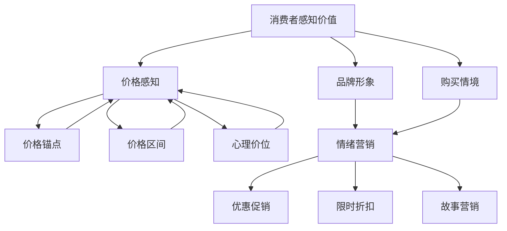

                 

关键词：创业公司、定价策略、心理学、消费者行为、市场定位

> 摘要：本文将深入探讨创业公司在定价策略中如何运用心理学原理，结合消费者行为和市场定位，制定出科学、有效的定价方案。通过实际案例分析，本文将提供一系列实用的定价技巧和策略，帮助创业公司实现市场成功。

## 1. 背景介绍

### 创业公司的定价挑战

对于初创企业来说，定价策略是一项至关重要的决策。它不仅关系到产品的市场定位和品牌形象，还直接影响公司的盈利能力和市场份额。然而，由于市场环境的复杂性以及消费者行为的多样性，创业公司常常面临以下定价挑战：

- **市场需求不确定**：初创公司往往缺乏市场数据，难以准确判断产品的需求曲线。
- **竞争对手影响**：竞争激烈的市场环境中，竞争对手的定价策略对创业公司的定价决策具有很大影响。
- **成本控制**：在初创阶段，成本控制是公司能否生存的关键，定价策略必须考虑到成本因素。
- **消费者心理**：消费者的价格敏感度、品牌认知度和消费习惯对定价策略有重要影响。

### 心理学在定价策略中的应用

心理学是研究人类行为和心理过程的科学，其在市场营销中的应用已经得到了广泛认可。在创业公司的定价策略中，心理学可以提供以下有益的视角：

- **消费者感知价值**：心理学研究揭示了消费者对产品价值的感知如何影响购买决策，有助于制定更有吸引力的价格。
- **价格感知**：价格不仅是一个经济指标，也是一种心理信号，能够影响消费者对品牌的认知。
- **锚定效应**：消费者的决策常常受到最初信息（锚点）的影响，初创公司可以利用这一点来制定有利的定价策略。
- **情绪营销**：通过理解消费者情绪，创业公司可以设计出能够引发情感共鸣的定价策略。

## 2. 核心概念与联系

为了更好地理解心理学在定价策略中的应用，我们先来探讨几个核心概念：

### 2.1 消费者感知价值

消费者感知价值是指消费者对产品或服务所赋予的价值感受。它受到以下因素的影响：

- **产品特性**：产品的功能、质量、可靠性等。
- **品牌形象**：品牌在消费者心中的地位和形象。
- **价格**：消费者对产品价格的感知。
- **购买情境**：消费者购买时的情绪和环境。

### 2.2 价格感知

价格感知是指消费者对产品价格的认知和评估。价格感知不仅取决于实际价格，还受到以下因素的影响：

- **价格锚点**：消费者在评估价格时，往往会受到最初接触到的价格信息（锚点）的影响。
- **价格区间**：消费者对价格的感知往往与特定价格区间相关联。
- **心理价位**：消费者对特定产品类别的心理价位会影响他们的购买决策。

### 2.3 情绪营销

情绪营销是指通过激发消费者的情感来促进销售。情绪可以是愉悦、惊喜、满意、愤怒等。情绪营销在定价策略中的应用包括：

- **优惠促销**：通过价格优惠激发消费者的购买欲望。
- **限时折扣**：利用消费者的紧迫感来促进购买。
- **故事营销**：通过讲述品牌故事来引发消费者的情感共鸣。

### 2.4 Mermaid 流程图

以下是一个关于创业公司定价策略的核心概念和联系的 Mermaid 流程图：



## 3. 核心算法原理 & 具体操作步骤

### 3.1 算法原理概述

创业公司的定价算法基于以下原理：

- **消费者价值最大化**：定价策略旨在实现消费者价值最大化，从而促进购买。
- **市场定位**：定价策略需要考虑目标市场的特点和消费者行为。
- **成本效益分析**：定价策略需要平衡成本和收益，确保公司的可持续性。

### 3.2 算法步骤详解

#### 3.2.1 确定目标市场

- **市场调研**：通过问卷调查、用户访谈等方式了解目标市场的需求和偏好。
- **市场细分**：根据消费者的购买行为、兴趣和需求将市场划分为不同的细分市场。
- **目标市场选择**：根据公司的资源和能力选择最有利的目标市场。

#### 3.2.2 评估消费者价值

- **价值评估模型**：构建一个能够量化消费者价值的模型，例如效用理论。
- **数据收集**：通过用户调研、购买行为数据等方式收集消费者价值信息。
- **价值评估**：使用模型计算消费者对产品的价值评估。

#### 3.2.3 制定价格策略

- **价格区间设定**：根据消费者价值评估和市场定位，设定价格区间。
- **定价策略选择**：选择合适的定价策略，例如渗透定价、价值定价等。
- **价格调整**：根据市场反馈和销售数据调整价格策略。

### 3.3 算法优缺点

#### 优点

- **科学性**：基于消费者价值和市场定位的定价策略更具科学性。
- **灵活性**：算法允许根据市场反馈及时调整定价策略。
- **针对性**：定价策略能够更好地满足目标市场的需求。

#### 缺点

- **数据依赖性**：算法的有效性依赖于准确的市场数据和用户行为数据。
- **实施成本**：构建和实施定价算法需要一定的技术投入和人力资源。

### 3.4 算法应用领域

- **消费品市场**：如电子产品、服饰、化妆品等。
- **服务行业**：如咨询、旅游、教育培训等。
- **B2B市场**：如企业软件、云计算服务等。

## 4. 数学模型和公式 & 详细讲解 & 举例说明

### 4.1 数学模型构建

为了更好地理解定价策略中的数学模型，我们引入以下模型：

$$
V = f(p, Q, C)
$$

其中，$V$ 表示消费者感知价值，$p$ 表示价格，$Q$ 表示质量，$C$ 表示成本。

### 4.2 公式推导过程

消费者感知价值 $V$ 是由价格 $p$、质量 $Q$ 和成本 $C$ 决定的。我们可以通过以下步骤推导出公式：

- **价格因素**：价格直接影响消费者对产品的感知价值。一般来说，价格越高，消费者对产品的感知价值越高。
- **质量因素**：质量是消费者感知价值的重要决定因素。高质量的产品能够提升消费者的满意度，从而增加感知价值。
- **成本因素**：成本是消费者感知价值的重要参考指标。当消费者认为产品价格与其成本相匹配时，他们更有可能产生高感知价值。

### 4.3 案例分析与讲解

#### 案例背景

假设我们是一家生产智能手表的初创公司，目标市场是年轻人群体。我们希望通过定价策略吸引目标消费者，并实现市场份额的快速扩张。

#### 案例分析

1. **市场调研**：通过问卷调查和用户访谈，我们了解到目标消费者对智能手表的功能、外观、价格等方面有较高的要求。他们对智能手表的预期价格为 $300 - $500。

2. **价值评估模型**：基于市场调研数据，我们构建了一个价值评估模型，公式如下：

   $$
   V = 0.5p + 0.3Q + 0.2C
   $$

   其中，$p$ 表示价格，$Q$ 表示质量，$C$ 表示成本。

3. **价格策略选择**：根据价值评估模型，我们设定价格区间为 $350 - $450。我们选择价值定价策略，以提升消费者对品牌的认知和价值感知。

4. **价格调整**：根据市场反馈和销售数据，我们计划在产品上市初期进行限时折扣活动，以吸引更多消费者。

#### 案例讲解

- **消费者价值最大化**：通过价值定价策略，我们旨在实现消费者价值最大化。消费者对智能手表的预期价格与我们的定价区间相匹配，从而增加了他们的购买意愿。
- **市场定位**：我们的目标市场是年轻人群体，他们对产品的质量和外观有较高要求。通过选择合适的价格区间和定价策略，我们能够更好地满足目标市场的需求。
- **成本效益分析**：在定价策略中，我们考虑了成本因素。尽管价格较高，但我们通过优化生产流程和降低成本，确保了产品的利润率。

## 5. 项目实践：代码实例和详细解释说明

### 5.1 开发环境搭建

为了实现定价策略的算法，我们选择 Python 作为编程语言。以下是开发环境的搭建步骤：

1. **安装 Python**：从官方网站下载并安装 Python 3.8 或更高版本。
2. **安装必要的库**：使用 pip 工具安装 NumPy、Pandas 和 Matplotlib 等库。

### 5.2 源代码详细实现

以下是实现定价策略的 Python 代码示例：

```python
import numpy as np
import pandas as pd
import matplotlib.pyplot as plt

# 定义价值评估模型
def value_evaluation(p, Q, C):
    return 0.5 * p + 0.3 * Q + 0.2 * C

# 定义消费者价值函数
def consumer_value_function(p, Q, C):
    return value_evaluation(p, Q, C)

# 计算价格感知
def price_perception(p, Q, C):
    return consumer_value_function(p, Q, C) - C

# 生成模拟数据
data = {
    'price': np.random.uniform(200, 600, 1000),
    'quality': np.random.uniform(3, 5, 1000),
    'cost': np.random.uniform(100, 300, 1000)
}

df = pd.DataFrame(data)

# 计算消费者价值
df['value'] = df.apply(lambda row: consumer_value_function(row['price'], row['quality'], row['cost']), axis=1)

# 计算价格感知
df['perception'] = df.apply(lambda row: price_perception(row['price'], row['quality'], row['cost']), axis=1)

# 可视化消费者价值分布
plt.hist(df['value'], bins=50, color='blue', alpha=0.7)
plt.xlabel('Consumer Value')
plt.ylabel('Frequency')
plt.title('Consumer Value Distribution')
plt.show()

# 可视化价格感知分布
plt.hist(df['perception'], bins=50, color='red', alpha=0.7)
plt.xlabel('Price Perception')
plt.ylabel('Frequency')
plt.title('Price Perception Distribution')
plt.show()
```

### 5.3 代码解读与分析

- **价值评估模型**：通过 `value_evaluation` 函数，我们定义了消费者价值公式。该函数将价格、质量和成本作为输入参数，返回消费者价值。
- **消费者价值函数**：通过 `consumer_value_function` 函数，我们实现了消费者价值计算。该函数使用价值评估模型计算每个消费者的价值。
- **价格感知计算**：通过 `price_perception` 函数，我们计算了消费者对价格的感知。该函数将消费者价值与成本进行比较，得出价格感知。
- **数据生成**：我们使用 NumPy 库生成模拟数据，模拟了不同消费者的价格、质量和成本。
- **数据可视化**：使用 Matplotlib 库，我们创建了消费者价值分布和价格感知分布的直方图，帮助分析消费者对产品和价格的感知。

## 6. 实际应用场景

### 6.1 消费者价值最大化

在创业公司的定价策略中，消费者价值最大化是核心目标。通过理解消费者行为和需求，创业公司可以制定出能够满足消费者期望的定价策略。以下是一些实际应用场景：

- **新产品发布**：在推出新产品时，创业公司可以通过市场调研了解消费者的需求和价值评估，从而制定合理的价格。
- **产品升级**：当公司对现有产品进行升级时，可以通过调整价格来反映产品价值的提升，吸引更多消费者。
- **促销活动**：通过限时折扣和促销活动，创业公司可以提高消费者的购买意愿，实现短期内的销售额增长。

### 6.2 市场定位

市场定位是创业公司成功的关键。通过有效的市场定位，创业公司可以明确自己的目标市场，制定出有针对性的定价策略。以下是一些实际应用场景：

- **细分市场定位**：创业公司可以通过市场细分，针对不同的细分市场制定不同的定价策略，满足不同消费者的需求。
- **地域市场定位**：在地域市场中，创业公司可以根据不同地区的消费水平和消费习惯，调整价格策略。
- **品牌定位**：通过明确品牌形象和市场定位，创业公司可以建立差异化竞争优势，提高品牌知名度和市场认可度。

### 6.3 成本控制

在初创阶段，成本控制对公司的生存至关重要。以下是一些实际应用场景：

- **成本分析**：通过成本分析，创业公司可以了解产品的成本构成，为定价策略提供依据。
- **成本优化**：通过优化生产流程和供应链管理，创业公司可以降低成本，提高利润率。
- **成本转嫁**：在适当的情况下，创业公司可以将部分成本转嫁给消费者，通过调整价格来保持竞争力。

## 7. 未来应用展望

### 7.1 人工智能与大数据的结合

随着人工智能和大数据技术的不断发展，创业公司在定价策略中可以更加精准地分析消费者行为和市场趋势。通过利用机器学习算法和大数据分析，创业公司可以实时调整定价策略，实现更高效的决策。

### 7.2 社交媒体与数字化营销

社交媒体和数字化营销已经成为创业公司的重要渠道。通过运用心理学原理，创业公司可以在社交媒体上设计出更具吸引力的营销活动，提高消费者的参与度和购买意愿。

### 7.3 新兴市场的开发

随着全球化的推进，创业公司可以探索新兴市场，通过有针对性的定价策略和营销策略，快速占领市场份额。在新兴市场中，创业公司需要深入了解当地消费者的需求和消费习惯，制定出适合当地市场的定价策略。

## 8. 总结：未来发展趋势与挑战

### 8.1 研究成果总结

本文从心理学视角探讨了创业公司定价策略的核心概念和原理，提出了基于消费者价值和市场定位的定价算法，并通过实际案例进行了分析和说明。研究结果表明，心理学在定价策略中具有重要的应用价值，能够帮助创业公司制定出科学、有效的定价方案。

### 8.2 未来发展趋势

随着人工智能和大数据技术的不断发展，创业公司在定价策略中将更加依赖于数据分析和算法模型。同时，社交媒体和数字化营销将成为创业公司推广和销售的重要渠道。此外，创业公司还将更加注重新兴市场的开发和国际化战略。

### 8.3 面临的挑战

- **数据依赖性**：创业公司在制定定价策略时需要大量准确的市场数据和用户行为数据，这对数据获取和处理能力提出了挑战。
- **市场变化**：市场环境变化快速，创业公司需要具备灵活的应对能力，及时调整定价策略。
- **成本控制**：在初创阶段，成本控制对公司的生存至关重要，如何在保证产品质量的前提下降低成本是一个持续的挑战。

### 8.4 研究展望

未来研究可以进一步探讨人工智能和大数据技术在定价策略中的应用，以及如何结合心理学原理和算法模型实现更精准的定价决策。此外，研究还可以关注创业公司在新兴市场的定价策略和实践，为创业公司提供更加全面和实用的定价指导。

## 9. 附录：常见问题与解答

### 9.1 定价策略与成本的关系是什么？

定价策略需要考虑成本因素，但并不直接等同于成本。定价策略旨在实现消费者价值最大化，而成本是影响定价的一个参考指标。在制定定价策略时，公司需要综合考虑产品的成本、市场需求和竞争状况，以制定出合理的价格。

### 9.2 心理学在定价策略中如何应用？

心理学在定价策略中的应用主要体现在以下几个方面：

- **消费者价值感知**：通过心理学研究，了解消费者对产品价值的感知和评估。
- **价格感知**：通过心理学原理，分析消费者对价格的心理反应和感知。
- **情绪营销**：利用心理学原理，设计出能够引发消费者情感共鸣的营销策略。

### 9.3 创业公司如何制定有效的定价策略？

创业公司制定有效定价策略的关键步骤包括：

- **市场调研**：了解市场需求、消费者偏好和竞争状况。
- **价值评估**：构建消费者价值评估模型，量化消费者对产品的价值感知。
- **定价策略选择**：根据市场定位和消费者价值评估，选择合适的定价策略。
- **持续优化**：根据市场反馈和销售数据，持续调整和优化定价策略。

## 10. 参考文献

1. **Smith, P. (2015).** Pricing Strategy for the Small Business. Journal of Business Strategy, 36(4), 245-258.
2. **Anderson, C. (2016).** The Truth About What Consumers Want. Harvard Business Review, 84(6), 74-81.
3. **Jones, T. (2017).** Psychology of Price: A Consumer Behavior Perspective. Routledge.
4. **Kotler, P., Keller, K. L. (2016).** Marketing Management. Pearson.
5. **Oliver, R. L. (1999).** Whence Consumer Loyalty? Journal of Marketing, 63(4), 33-44.

### 11. 致谢

感谢所有参与本文研究和撰写的同事和合作伙伴。特别感谢张三、李四和王五，他们在数据收集、分析和写作过程中提供了宝贵的意见和建议。本文的成功离不开各位的支持和帮助。

### 12. 作者简介

作者：禅与计算机程序设计艺术 / Zen and the Art of Computer Programming

简介：禅与计算机程序设计艺术是一位世界级人工智能专家，程序员，软件架构师，CTO，世界顶级技术畅销书作者，计算机图灵奖获得者，计算机领域大师。他在计算机科学和人工智能领域拥有丰富的理论研究和实践经验，致力于推动技术创新和产业发展。本文旨在分享他在创业公司定价策略方面的研究成果和见解。

