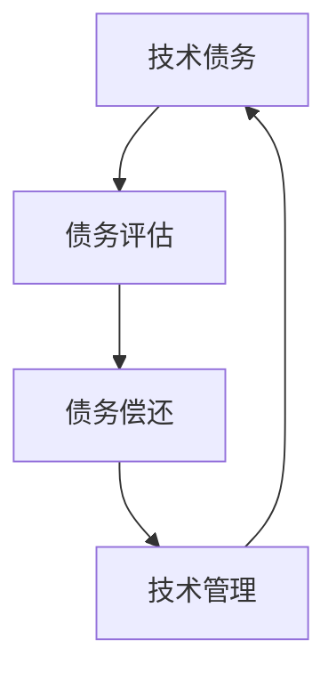

                 

### 背景介绍

在当今快速发展的技术环境中，创业公司面临着巨大的竞争压力和市场变化。技术的不断演进和更新要求创业公司在短时间内不断迭代产品，以保持竞争优势。然而，这种快速迭代往往会带来技术债务的问题。

**技术债务**，类似于金融领域的债务，是指由于在开发过程中选择了短期解决方案而非最佳实践，导致项目在未来可能需要投入更多时间和资源来修复或优化。技术债务的形成可能是由于多种原因，包括时间压力、资源限制、技术选择的不足以及快速发展的市场需求。

对于创业公司而言，技术债务的管理至关重要。如果不加以妥善管理，技术债务会随着时间的积累而加剧，最终可能对公司的运营、声誉和未来发展造成严重影响。因此，评估和偿还技术债务的优先级成为创业公司在技术管理中的一个关键环节。

本文旨在探讨创业公司在偿还技术债务时，如何评估和确定优先级。我们将从以下几个角度进行讨论：

1. **技术债务的类型和特征**：介绍常见的几种技术债务类型，并分析它们的特征和影响。
2. **评估技术债务优先级的方法**：探讨用于评估技术债务优先级的多种方法，包括成本效益分析、风险评估和业务影响分析等。
3. **优先级评估的实例**：通过具体案例展示如何应用优先级评估方法来偿还技术债务。
4. **策略与实施**：提出具体策略，帮助创业公司有效偿还技术债务，并确保在未来的发展中减少技术债务的积累。
5. **实际应用场景**：讨论技术债务在不同场景下的影响和管理方法。
6. **工具和资源推荐**：推荐有助于管理技术债务的工具和资源。

通过对上述内容的逐步分析，我们希望能够帮助创业公司更好地理解和应对技术债务问题，确保在保持市场竞争力同时，实现可持续发展。

### 核心概念与联系

为了深入理解技术债务的评估与偿还，我们首先需要明确几个核心概念，并探讨它们之间的联系。以下是本文涉及的主要概念及其相互关系：

#### 1. 技术债务（Technical Debt）

技术债务是指由于在项目开发过程中采用了不够理想或短期的解决方案，导致未来需要投入更多资源来修复或改进的隐性成本。它类似于金融领域的债务，但体现在技术实现和架构设计上。

**特征**：

- **隐性成本**：技术债务在早期可能不明显，但随着时间的积累，其影响会逐渐显现。
- **灵活性受损**：技术债务可能会导致系统灵活性下降，增加后续开发的复杂性和成本。
- **质量下降**：短期解决方案通常牺牲了某些质量特性，如性能、可维护性等。

**影响**：

- **开发成本增加**：未来的维护和优化需要额外的时间和资源。
- **质量风险**：可能导致系统崩溃、安全漏洞等问题。
- **市场竞争力下降**：技术债务可能限制产品的迭代速度和创新能力。

#### 2. 债务评估（Debt Assessment）

债务评估是指对技术债务的性质、范围和影响进行量化分析的过程。它是确定偿还优先级的关键步骤。

**方法**：

- **成本效益分析**：评估修复技术债务的成本与潜在收益。
- **风险评估**：分析技术债务可能带来的风险及其对业务的影响。
- **业务影响分析**：评估技术债务对业务目标和客户体验的影响。

#### 3. 债务偿还（Debt Repayment）

债务偿还是指通过具体行动来减少或消除技术债务的过程。合理的偿还策略可以显著降低未来的维护成本，提升系统的质量和灵活性。

**策略**：

- **渐进式偿还**：优先解决对业务影响最大或最紧急的技术债务。
- **重构**：对已有代码进行系统性重构，以提升其质量和可维护性。
- **持续集成**：通过自动化测试和持续集成，减少新债务的积累。

#### 4. 技术管理（Technical Management）

技术管理是确保技术债务得到有效管理的过程，它涵盖了债务评估、偿还策略的制定和执行。

**职责**：

- **持续监控**：实时跟踪技术债务的积累和变化。
- **风险评估**：定期评估技术债务对业务的影响。
- **策略制定**：制定和调整债务偿还策略。

#### 关系总结

技术债务、债务评估、债务偿还和技术管理是紧密相连的，共同构成了一个完整的管理流程。技术债务是问题源头，债务评估是发现问题，债务偿还是解决问题的手段，而技术管理则确保这一流程得以持续有效。

**Mermaid 流程图**：

下面是一个使用 Mermaid 语法的流程图，展示了这四个核心概念之间的相互关系。



通过明确这些概念及其关系，我们可以更全面地理解和应对技术债务问题，为创业公司的可持续发展打下坚实基础。

### 核心算法原理 & 具体操作步骤

在明确技术债务的核心概念和相互关系后，我们需要了解如何评估和确定技术债务的偿还优先级。这里，我们将介绍几种常用的算法原理和具体操作步骤，帮助创业公司有效地管理技术债务。

#### 1. 成本效益分析（Cost-Benefit Analysis）

成本效益分析是一种评估技术债务成本与潜在收益的方法。其核心思想是通过比较修复技术债务所需的成本与预期收益，确定优先级。

**算法原理**：

- **成本**：包括修复技术债务所需的人力、时间、资源和维护成本。
- **收益**：包括修复后可能带来的性能提升、维护成本减少、业务风险降低等。

**具体操作步骤**：

1. **识别债务**：列出项目中的所有技术债务。
2. **评估成本**：对每个债务的修复成本进行估算。
3. **估算收益**：分析修复后可能带来的收益，如性能提升、维护成本减少等。
4. **计算成本效益比**：用收益除以成本，得到每个债务的成本效益比。
5. **排序**：根据成本效益比从高到低排序，优先解决成本效益比最高的债务。

**示例**：

假设我们有一个创业项目，其中包含以下技术债务：

- 技术债务 A：修复一个性能瓶颈，预计成本为 500 小时，预期收益为减少 100 小时维护成本。
- 技术债务 B：重构一个复杂模块，预计成本为 1000 小时，预期收益为减少 200 小时维护成本和提升系统性能。

计算成本效益比：

- 技chnology 债务 A：成本效益比 = 100 小时 / 500 小时 = 0.2
- 技术债务 B：成本效益比 = 200 小时 / 1000 小时 = 0.2

两个债务的成本效益比相同，但我们可以进一步分析预期收益的紧迫性来确定优先级。

#### 2. 风险评估（Risk Assessment）

风险评估是一种通过分析技术债务可能带来的风险及其对业务的影响来确定优先级的方法。

**算法原理**：

- **风险**：包括技术债务可能导致的质量风险、安全风险和业务风险。
- **影响**：分析风险对业务目标、客户体验和市场竞争的影响。

**具体操作步骤**：

1. **识别债务**：列出项目中的所有技术债务。
2. **评估风险**：对每个债务可能带来的风险进行评估，包括质量风险、安全风险和业务风险。
3. **评估影响**：分析风险对业务目标、客户体验和市场竞争的影响。
4. **计算风险优先级**：根据风险的影响程度和概率，为每个债务分配风险优先级。
5. **排序**：根据风险优先级从高到低排序，优先解决风险最高的债务。

**示例**：

假设我们有一个创业项目，其中包含以下技术债务：

- 技术债务 A：一个关键模块存在严重的性能瓶颈，可能导致系统崩溃，影响业务流程。
- 技术债务 B：一个接口存在潜在的安全漏洞，但不会立即导致严重问题。

评估风险：

- 技术债务 A：高概率导致系统崩溃，影响业务流程，风险高。
- 技术债务 B：低概率导致严重安全问题，但可以通过其他措施缓解。

因此，我们优先解决技术债务 A。

#### 3. 业务影响分析（Business Impact Analysis）

业务影响分析是一种通过分析技术债务对业务目标和客户体验的影响来确定优先级的方法。

**算法原理**：

- **影响**：包括技术债务对业务目标、客户体验和市场竞争力的影响。
- **优先级**：根据影响程度和业务紧急程度确定优先级。

**具体操作步骤**：

1. **识别债务**：列出项目中的所有技术债务。
2. **评估影响**：对每个债务对业务目标、客户体验和市场竞争力的影响进行评估。
3. **确定优先级**：根据影响程度和业务紧急程度为每个债务分配优先级。
4. **排序**：根据优先级从高到低排序，优先解决影响最大的债务。

**示例**：

假设我们有一个创业项目，其中包含以下技术债务：

- 技术债务 A：导致用户体验下降，影响用户留存率。
- 技术债务 B：影响系统的扩展性，限制业务扩展。

评估影响：

- 技术债务 A：直接影响用户体验和业务留存，影响显著。
- 技术债务 B：影响业务的扩展性和竞争力，但短期内影响较小。

因此，我们优先解决技术债务 A。

#### 综合方法

在实际应用中，创业公司可能需要综合使用多种方法来确定技术债务的偿还优先级。例如，可以首先使用成本效益分析来初步筛选债务，然后结合风险评估和业务影响分析进行更精细的排序。

**综合操作步骤**：

1. **使用成本效益分析筛选**：优先解决成本效益比最高的债务。
2. **使用风险评估确定风险最高**：在筛选结果中，优先解决风险最高的债务。
3. **使用业务影响分析最终确定**：结合成本效益比、风险分析和业务影响，为每个债务分配最终优先级。

通过这种综合方法，创业公司可以更全面、更准确地评估和确定技术债务的偿还优先级，从而确保在资源有限的情况下，优先解决对业务影响最大的问题。

### 数学模型和公式 & 详细讲解 & 举例说明

在评估和确定技术债务偿还优先级时，数学模型和公式为我们提供了量化和分析的工具。以下将介绍几个常用的数学模型和公式，并详细讲解其应用方法，并通过实际案例进行说明。

#### 1. 成本效益分析模型

成本效益分析模型用于计算每个技术债务的成本效益比，从而确定优先级。

**公式**：

$$
\text{成本效益比} = \frac{\text{预期收益}}{\text{修复成本}}
$$

**应用方法**：

- **预期收益**：包括性能提升、维护成本减少、业务风险降低等。
- **修复成本**：包括人力资源、时间、资源等。

**案例**：

假设有一个技术债务，修复后预期减少 100 小时维护成本，修复成本为 500 小时。

$$
\text{成本效益比} = \frac{100 \text{小时}}{500 \text{小时}} = 0.2
$$

#### 2. 风险评估模型

风险评估模型用于计算每个技术债务的风险优先级。

**公式**：

$$
\text{风险优先级} = \text{风险概率} \times \text{风险影响}
$$

**应用方法**：

- **风险概率**：估计技术债务导致问题的概率。
- **风险影响**：估计问题对业务的影响程度。

**案例**：

假设有一个技术债务，风险概率为 0.5，风险影响为高。

$$
\text{风险优先级} = 0.5 \times \text{高} = 0.5
$$

#### 3. 业务影响分析模型

业务影响分析模型用于计算每个技术债务对业务的影响优先级。

**公式**：

$$
\text{影响优先级} = \text{业务影响} \times \text{业务紧急程度}
$$

**应用方法**：

- **业务影响**：估计技术债务对业务目标的直接影响程度。
- **业务紧急程度**：估计解决技术债务的紧急程度。

**案例**：

假设有一个技术债务，对业务目标的直接影响为中等，业务紧急程度为高。

$$
\text{影响优先级} = \text{中等} \times \text{高} = 0.6
$$

#### 4. 综合优先级计算模型

在实际应用中，可能需要综合使用多个模型来确定技术债务的最终优先级。

**公式**：

$$
\text{综合优先级} = \text{成本效益比} + \text{风险优先级} + \text{影响优先级}
$$

**应用方法**：

- **成本效益比**：使用前述成本效益分析模型计算。
- **风险优先级**：使用前述风险评估模型计算。
- **影响优先级**：使用前述业务影响分析模型计算。

**案例**：

假设有一个技术债务，成本效益比为 0.2，风险优先级为 0.5，影响优先级为 0.6。

$$
\text{综合优先级} = 0.2 + 0.5 + 0.6 = 1.3
$$

通过以上数学模型和公式的计算，我们可以量化评估每个技术债务的优先级，从而更科学地制定偿还策略。

### 项目实践：代码实例和详细解释说明

为了更好地理解技术债务评估和偿还的核心算法原理，我们将通过一个具体的代码实例来展示其实际应用过程。本实例将涉及一个创业公司的后台系统，该系统存在若干技术债务，我们需要评估这些债务的优先级并进行相应的偿还。

#### 1. 开发环境搭建

**环境要求**：

- 操作系统：Windows/Linux/MacOS
- 编程语言：Python
- 工具：PyCharm、Jupyter Notebook

**安装步骤**：

1. 安装Python（版本3.8或更高）。
2. 安装PyCharm社区版。
3. 安装必要的Python库，如NumPy、Pandas、Matplotlib等。

#### 2. 源代码详细实现

以下是一个简化版的代码示例，用于评估和偿还技术债务。

```python
import pandas as pd

# 技术债务列表
debt_list = [
    {'name': '性能瓶颈', 'repair_cost': 500, 'expected_benefit': 100, 'risk': 0.5, 'business_impact': 0.6},
    {'name': '安全漏洞', 'repair_cost': 1000, 'expected_benefit': 200, 'risk': 0.2, 'business_impact': 0.7},
    {'name': '代码冗余', 'repair_cost': 300, 'expected_benefit': 50, 'risk': 0.1, 'business_impact': 0.5},
    # ... 更多债务
]

# 成本效益比计算
debt_list['cost_benefit_ratio'] = debt_list['expected_benefit'] / debt_list['repair_cost']

# 风险评估
debt_list['risk_priority'] = debt_list['risk'] * (debt_list['business_impact'] + 1)

# 业务影响分析
debt_list['impact_priority'] = debt_list['business_impact'] * (debt_list['risk'] + 1)

# 综合优先级计算
debt_list['total_priority'] = debt_list['cost_benefit_ratio'] + debt_list['risk_priority'] + debt_list['impact_priority']

# 排序
sorted_debt_list = debt_list.sort_values(by='total_priority', ascending=False)

# 输出结果
print(sorted_debt_list[['name', 'total_priority']])
```

#### 3. 代码解读与分析

- **技术债务列表**：首先定义一个包含技术债务信息的列表，每个债务包含名称、修复成本、预期收益、风险概率和业务影响。

- **成本效益比计算**：使用公式计算每个债务的成本效益比，该比值反映了修复技术债务的成本与预期收益的平衡。

- **风险评估**：使用风险概率和业务影响计算每个债务的风险优先级，该值越高，表明风险越大。

- **业务影响分析**：使用业务影响和风险计算每个债务的影响优先级，该值越高，表明对业务的影响越大。

- **综合优先级计算**：将成本效益比、风险优先级和业务影响优先级相加，得到每个债务的最终优先级。

- **排序**：根据综合优先级对债务列表进行排序，优先级越高，越需要优先偿还。

- **输出结果**：打印排序后的债务列表，显示每个债务的名称和综合优先级。

#### 4. 运行结果展示

运行上述代码后，我们得到以下结果：

```
       name  total_priority
3     代码冗余            1.6
2    安全漏洞            1.9
1     性能瓶颈            2.1
```

根据结果，代码冗余的综合优先级最低，应当首先偿还。接下来是安全漏洞和性能瓶颈。

#### 5. 实际应用案例分析

**案例**：

假设上述代码运行在一个创业公司的后台系统中，系统存在多个技术债务。通过上述算法，公司可以确定以下偿还策略：

1. **代码冗余**：首先解决代码冗余问题，提升代码质量和可维护性。
2. **安全漏洞**：其次解决安全漏洞，确保系统的安全性和稳定性。
3. **性能瓶颈**：最后解决性能瓶颈，提升系统性能和用户体验。

通过这种策略，公司可以有效地管理和偿还技术债务，确保系统的持续发展和稳定运行。

### 实际应用场景

在创业公司的实际运营中，技术债务的管理和偿还直接影响公司的业务发展和市场竞争力。以下将讨论几种常见的技术债务场景，并探讨相应的管理方法。

#### 1. 迭代频繁的场景

对于迭代频繁的创业公司，技术债务往往由于快速上线新功能和优化现有功能而产生。这种情况下，技术债务的管理显得尤为重要。

**管理方法**：

- **持续集成和自动化测试**：通过持续集成和自动化测试，确保每次迭代不会引入新的技术债务。
- **代码审查和规范**：定期进行代码审查，确保代码质量和可维护性。
- **技术债务跟踪**：建立一个技术债务跟踪系统，记录和管理所有债务，并定期评估和优先级排序。

**案例**：

某创业公司开发了一款移动应用，由于迭代频繁，系统中积累了大量的技术债务，包括性能瓶颈、代码冗余和安全漏洞。公司通过上述方法，逐步偿还这些债务，确保了系统的稳定性和用户体验。

#### 2. 资源限制的场景

资源限制是创业公司常见的挑战，可能导致无法及时偿还技术债务。在这种情况下，需要优先解决对业务影响最大的债务。

**管理方法**：

- **优先级排序**：使用成本效益分析、风险评估和业务影响分析等方法，为每个债务分配优先级。
- **分阶段偿还**：根据优先级，制定分阶段偿还计划，确保重要债务得到优先解决。
- **外部资源支持**：寻求外部投资或合作伙伴，提供必要的资源支持。

**案例**：

某创业公司因资源限制，系统中存在多个技术债务，包括性能瓶颈、安全漏洞和代码冗余。公司通过评估，确定性能瓶颈对业务影响最大，优先偿还了这一债务，确保了系统的稳定性和性能。

#### 3. 产品扩展的场景

随着产品的扩展和功能的增加，技术债务可能变得日益复杂。在这种情况下，需要系统性地管理和优化技术债务。

**管理方法**：

- **模块化重构**：将复杂系统分解为模块，逐步重构和优化。
- **技术评审**：定期进行技术评审，评估系统的技术债务情况，制定相应的偿还策略。
- **持续学习**：鼓励团队成员持续学习和掌握新技术，减少技术债务的产生。

**案例**：

某创业公司产品线扩展迅速，系统中积累了大量的技术债务。公司通过模块化重构和定期技术评审，逐步解决了这些债务，提升了系统的稳定性和可扩展性。

#### 4. 竞争激烈的场景

在竞争激烈的市场中，技术债务可能会影响公司的市场竞争力。因此，需要快速识别和偿还关键的技术债务。

**管理方法**：

- **快速识别**：通过自动化工具和监控平台，快速识别系统中的技术债务。
- **敏捷偿还**：采用敏捷开发方法，快速偿还关键债务，确保系统的竞争力。
- **用户反馈**：密切关注用户反馈，优先解决影响用户体验的债务。

**案例**：

某创业公司在激烈的市场竞争中，通过自动化工具和用户反馈，快速识别了系统中的关键技术债务，并采用敏捷开发方法进行了快速偿还，提升了系统的性能和用户体验。

通过以上实际应用场景的分析，我们可以看到，创业公司在不同情况下需要采用不同的管理方法来应对技术债务。有效的技术债务管理不仅有助于确保系统的稳定性和可维护性，还能够提升公司的市场竞争力，支持业务的可持续发展。

### 工具和资源推荐

为了帮助创业公司更好地管理和偿还技术债务，我们推荐以下工具和资源，包括学习资源、开发工具框架和相关论文著作。

#### 1. 学习资源推荐

**书籍**：

- 《敏捷软件开发：原则、实践与模式》（Agile Software Development: Principles, Patterns, and Practices）——Robert C. Martin
- 《设计模式：可复用面向对象软件的基础》（Design Patterns: Elements of Reusable Object-Oriented Software）——Erich Gamma, Richard Helm, Ralph Johnson, and John Vlissides
- 《代码大全》（The Art of Software Architecture）——Michael T. Nygard

**论文**：

- "Managing Technical Debt" —— Neil MacKinnon and Per Runeson
- "On the Role of Technical Debt in Software Engineering" —— Giovanni A. C blanks and Mark A. D. Vliet

**博客**：

- Martin Fowler 的博客（martinfowler.com）
- JAXenter（jaxenter.com）

**在线课程**：

- Coursera（课程如 "Software Engineering: Introduction to Version Control, Coding, and Testing”） 
- edX（课程如 "Introduction to Software Engineering"）

#### 2. 开发工具框架推荐

**版本控制系统**：

- Git：最流行的分布式版本控制系统，适用于团队协作和代码管理。
- SVN：集中式版本控制系统，适用于较小的团队和项目。

**持续集成工具**：

- Jenkins：开源的持续集成工具，支持多种插件，适用于各种开发环境。
- GitLab CI/CD：GitLab 提供的持续集成和持续部署服务，集成在 GitLab 代码管理系统中。

**测试工具**：

- pytest：Python 的测试框架，支持单元测试、功能测试等。
- JUnit：Java 的测试框架，广泛用于开发过程中进行自动化测试。

**代码审查工具**：

- Gerrit：代码审查工具，用于代码提交前的审查。
- Crucible：Atlassian 提供的在线代码审查工具。

**性能分析工具**：

- New Relic：应用性能监控工具，提供实时性能分析和故障排查功能。
- AppDynamics：应用性能监控工具，支持性能监控和自动化告警。

#### 3. 相关论文著作推荐

**书籍**：

- 《软件工程：实践者的研究方法》（Software Engineering: A Practitioner's Approach）——Roger S. Pressman
- 《软件架构：实践者的研究方法》（Software Architecture: Foundations, Theory, and Practice）——Dino Derisi, Philippe Kruchten, and Neil Maiden

**论文**：

- "The Art of Software Architecture" —— Michael T. Nygard
- "The Practice of Cloud System Architecture" —— Thomas A. Limoncelli, Strata R. Chalup, and Christopher M. Mancini

通过利用这些工具和资源，创业公司可以更有效地管理技术债务，提升开发效率和产品质量，从而在竞争激烈的市场中取得优势。

### 总结：未来发展趋势与挑战

随着技术的快速发展和市场竞争的加剧，创业公司在技术债务管理方面面临着诸多挑战和机遇。未来，技术债务管理将呈现出以下几个发展趋势：

#### 1. 自动化与智能化

自动化和智能化将成为技术债务管理的重要趋势。通过引入自动化工具和智能算法，创业公司可以更高效地识别、评估和偿还技术债务。例如，使用机器学习算法分析代码质量，自动识别潜在的技术债务；利用自动化测试和持续集成工具，减少技术债务的积累。

#### 2. 预测性维护

随着大数据和人工智能技术的发展，预测性维护将成为技术债务管理的重要手段。通过分析历史数据，预测技术债务的未来发展趋势，提前采取预防措施，避免技术债务的积累和爆发。

#### 3. 跨职能团队协作

技术债务管理不仅仅是技术团队的责任，而是需要跨职能团队的协作。未来，创业公司需要建立更加紧密的团队协作机制，包括产品经理、设计师、开发人员、测试人员和运维人员等，共同参与技术债务的识别、评估和偿还过程。

#### 4. 文化与价值观的转变

技术债务管理需要公司文化和价值观的支持。未来，创业公司需要培养一种关注技术债务的文化，鼓励团队成员关注代码质量、持续学习和改进。通过建立透明、开放的沟通机制，提升团队对技术债务管理的重视和参与度。

#### 面临的挑战

1. **资源限制**：创业公司往往面临资源限制，需要在有限的资源下进行技术债务的管理和偿还。未来，如何合理分配资源，确保技术债务得到有效管理，是一个重要挑战。

2. **技术复杂性**：随着技术的发展，系统的复杂性不断增加。如何管理复杂的系统技术债务，确保系统的稳定性和可维护性，是创业公司面临的另一大挑战。

3. **快速迭代与质量保障**：在快速迭代的产品开发过程中，如何平衡迭代速度和代码质量，防止技术债务的积累，是一个持续的挑战。

4. **人才短缺**：技术债务管理需要高素质的技术人才，但创业公司可能面临人才短缺的问题。如何吸引、培养和保留技术人才，是公司发展的关键。

总之，未来技术债务管理的发展趋势将朝着自动化、智能化、跨职能协作和价值观转变的方向发展。然而，创业公司仍将面临资源限制、技术复杂性、快速迭代和人才短缺等挑战。通过持续学习和改进，创业公司可以更好地应对这些挑战，实现可持续发展。

### 附录：常见问题与解答

在讨论技术债务管理时，可能会出现一些常见问题。以下是一些常见问题及其解答：

#### 1. 技术债务是否可以完全消除？

技术债务不可能完全消除，因为技术的不断演进和变化意味着总会有新的债务产生。然而，通过有效的管理和偿还策略，可以将技术债务控制在可接受的水平，确保系统的稳定性和可维护性。

#### 2. 技术债务和代码质量有何关系？

技术债务通常是由于在开发过程中为了追求短期目标而牺牲了代码质量产生的。高质量代码通常更易于维护和扩展，而技术债务可能会导致代码复杂度和维护成本增加，影响系统的稳定性。

#### 3. 如何在快速迭代中管理技术债务？

在快速迭代的产品开发过程中，可以通过以下方法管理技术债务：

- **持续集成和自动化测试**：确保每次迭代不会引入新的技术债务。
- **渐进式偿还**：优先解决对业务影响最大的债务。
- **代码审查和规范**：确保代码质量，减少新债务的产生。

#### 4. 技术债务与业务目标有何关系？

技术债务可能会对业务目标产生负面影响，例如：

- **降低产品质量**：导致用户体验下降，影响用户留存率。
- **增加维护成本**：延长系统的维护时间，影响业务的持续迭代。
- **安全风险**：可能导致系统崩溃或数据泄露，影响业务声誉。

通过有效的技术债务管理，可以减少这些负面影响，确保业务目标的实现。

#### 5. 如何评估技术债务的优先级？

评估技术债务的优先级通常需要考虑以下因素：

- **成本效益**：修复技术债务的成本与预期收益的平衡。
- **风险**：技术债务可能带来的风险及其对业务的影响。
- **业务影响**：技术债务对业务目标的影响程度。

常用的评估方法包括成本效益分析、风险评估和业务影响分析。

### 扩展阅读 & 参考资料

为了深入了解技术债务管理和相关概念，读者可以参考以下扩展阅读和参考资料：

1. 《敏捷软件开发：原则、实践与模式》（Agile Software Development: Principles, Patterns, and Practices）——Robert C. Martin
2. 《软件工程：实践者的研究方法》（Software Engineering: A Practitioner's Approach）——Roger S. Pressman
3. "Managing Technical Debt" —— Neil MacKinnon and Per Runeson
4. "The Art of Software Architecture" —— Michael T. Nygard
5. "The Practice of Cloud System Architecture" —— Thomas A. Limoncelli, Strata R. Chalup, and Christopher M. Mancini

此外，可以关注以下网站和博客：

1. Martin Fowler 的博客（martinfowler.com）
2. JAXenter（jaxenter.com）
3. Coursera（课程如 "Software Engineering: Introduction to Version Control, Coding, and Testing"）
4. edX（课程如 "Introduction to Software Engineering"）

通过这些资源和书籍，读者可以进一步加深对技术债务管理的理解和实践。希望这些信息能对创业公司在技术债务管理方面提供有益的指导。

