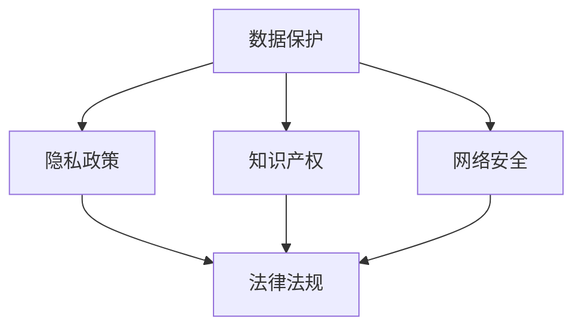

                 

### 文章标题

《创业公司的技术合规性管理》

关键词：创业公司、技术合规性、风险管理、法律法规、最佳实践

摘要：本文将深入探讨创业公司在技术合规性管理方面的重要性，包括关键法律法规的遵守、潜在风险的识别与应对策略，以及如何通过最佳实践来实现合规性。通过实际案例和具体步骤，为创业公司的技术团队提供实用的指导，确保其产品和服务在符合法律要求的同时，还能保持市场竞争力。

### 1. 背景介绍

随着互联网和科技行业的飞速发展，创业公司如雨后春笋般涌现。这些公司以其创新的产品和服务，为市场和用户带来了前所未有的价值。然而，快速发展的同时，技术合规性问题也逐渐显现出来。技术合规性不仅关乎公司法律地位的合法性，还直接影响到公司声誉、用户信任和市场份额。

技术合规性管理是创业公司运营过程中不可或缺的一环。它涉及到多个方面，包括数据保护、隐私政策、知识产权、网络安全等。不合规的风险不仅可能导致公司面临高额罚款、法律诉讼，还可能对公司的品牌形象和用户信任造成不可逆的损害。

本文旨在帮助创业公司了解技术合规性的重要性，识别潜在风险，并采取有效的管理措施，以确保公司的发展过程合法、合规，降低运营风险。

#### 1.1 技术合规性管理的必要性

技术合规性管理对于创业公司至关重要。首先，它能够帮助公司避免因违反相关法律法规而导致的法律纠纷和高额罚款。例如，欧盟的《通用数据保护条例》（GDPR）对企业的数据处理行为有严格规定，违反该条例的企业可能面临高达20,000,000欧元或企业全球营业额的4%的罚款。

其次，技术合规性管理有助于维护公司的品牌形象和用户信任。在用户隐私和数据安全日益受到关注的今天，一个重视合规性的公司更容易赢得用户的信任，从而在竞争激烈的市场中占据优势。

最后，技术合规性管理是公司长期稳健发展的基石。合规性不仅关乎公司当前的运营，还影响到公司未来的发展潜力。一个在技术合规性管理上表现优异的公司，更容易吸引投资者、合作伙伴和人才，为公司的长远发展奠定坚实基础。

#### 1.2 技术合规性的挑战

尽管技术合规性管理的重要性不言而喻，但对于创业公司来说，仍面临诸多挑战。以下是其中一些主要挑战：

1. **资源有限**：创业公司通常资金和人力资源有限，可能无法像大型企业那样投入大量资源进行合规性管理。
2. **法律法规复杂**：技术合规性的相关法律法规复杂多变，不同国家和地区的规定也有所不同，创业公司需要花费大量时间和精力去了解和遵守。
3. **技术更新迅速**：科技行业发展迅速，新技术、新应用层出不穷，创业公司需要不断更新技术合规性策略，以适应变化。
4. **跨部门协作**：技术合规性管理涉及多个部门，如技术、法务、市场等，部门之间的协调和沟通可能成为挑战。

### 2. 核心概念与联系

在探讨创业公司的技术合规性管理时，我们需要了解以下几个核心概念，并理解它们之间的联系。

#### 2.1 数据保护与隐私政策

数据保护和隐私政策是技术合规性的基础。数据保护是指确保个人数据不被非法获取、泄露或滥用。隐私政策则是公司公开声明，明确告知用户其数据如何被收集、使用和保护。

#### 2.2 知识产权

知识产权包括专利、商标、著作权等，保护公司创新成果的合法权益。对于创业公司来说，知识产权管理至关重要，因为创新往往是其核心竞争力之一。

#### 2.3 网络安全

网络安全是指保护公司信息系统和数据的完整性、保密性和可用性，防止黑客攻击、数据泄露等安全威胁。随着网络攻击手段的日益复杂，网络安全已成为技术合规性管理的关键环节。

#### 2.4 法律法规

法律法规包括但不限于数据保护法、网络安全法、知识产权法等，对企业的数据收集、处理、存储和使用行为有明确规定。创业公司需要深入了解相关法律法规，以确保其运营合规。

下面是技术合规性管理的Mermaid流程图，展示了各个核心概念之间的联系。



### 3. 核心算法原理 & 具体操作步骤

在理解了技术合规性的核心概念后，我们需要探讨如何具体实施技术合规性管理。以下是一些关键步骤和算法原理。

#### 3.1 制定合规性策略

制定合规性策略是技术合规性管理的第一步。策略应包括以下几个方面：

1. **合规性目标**：明确公司合规性的目标，如数据保护、隐私保护、知识产权保护等。
2. **合规性标准**：根据相关法律法规和行业标准，制定合规性标准。
3. **合规性责任**：明确各部门和人员的合规性责任，确保合规性措施得到有效执行。

#### 3.2 风险识别与评估

风险识别与评估是合规性管理的重要环节。以下是一些关键步骤：

1. **识别潜在风险**：通过文献调研、专家访谈等方式，识别公司可能面临的技术合规性风险。
2. **评估风险影响**：对识别出的风险进行定量或定性评估，确定其对公司的影响程度。
3. **制定风险管理计划**：根据风险的影响程度，制定相应的风险管理计划，包括风险回避、风险转移、风险减轻等。

#### 3.3 合规性培训与教育

合规性培训与教育是确保合规性措施得到有效执行的关键。以下是一些具体操作步骤：

1. **制定培训计划**：根据公司合规性策略和风险识别结果，制定培训计划。
2. **组织培训活动**：邀请合规性专家或内部培训师，组织培训活动，提高员工合规性意识。
3. **跟踪培训效果**：通过考核、测试等方式，跟踪员工培训效果，确保培训目标达成。

#### 3.4 合规性审计与监督

合规性审计与监督是确保公司合规性持续有效的关键。以下是一些具体操作步骤：

1. **制定审计计划**：根据合规性策略和风险管理计划，制定审计计划。
2. **开展审计活动**：按照审计计划，开展内部或外部审计活动。
3. **监督合规性执行**：对审计结果进行分析，监督合规性措施的执行情况，及时纠正问题。

#### 3.5 持续改进

技术合规性管理是一个持续的过程，需要不断改进和完善。以下是一些关键步骤：

1. **反馈与改进**：收集员工和用户的反馈，识别合规性管理中存在的问题，进行改进。
2. **更新合规性策略**：根据法律法规的变化和公司业务的发展，及时更新合规性策略。
3. **持续监督与培训**：持续监督合规性措施的执行情况，定期组织培训，确保员工合规性意识不断提升。

### 4. 数学模型和公式 & 详细讲解 & 举例说明

在技术合规性管理中，一些数学模型和公式可以帮助我们更好地理解和执行相关策略。以下是一个简单的数学模型，用于评估技术合规性风险。

#### 4.1 风险评估模型

假设公司面临以下三个主要技术合规性风险：数据泄露、知识产权侵权和网络攻击。我们可以使用以下数学模型来评估这些风险：

\[ R = w_1 \cdot D_1 + w_2 \cdot D_2 + w_3 \cdot D_3 \]

其中：
- \( R \) 表示总风险水平。
- \( w_1, w_2, w_3 \) 分别为数据泄露、知识产权侵权和网络攻击的风险权重。
- \( D_1, D_2, D_3 \) 分别为数据泄露、知识产权侵权和网络攻击的风险得分。

风险得分可以通过以下公式计算：

\[ D_i = \frac{I_i - L_i}{U_i - L_i} \]

其中：
- \( I_i \) 表示风险指标的当前值。
- \( L_i \) 表示风险指标的低限值。
- \( U_i \) 表示风险指标的上限值。

#### 4.2 实例说明

假设公司面临以下数据泄露风险：

- 当前数据泄露风险指标为 50。
- 低限值为 20。
- 上限值为 80。

则数据泄露的风险得分为：

\[ D_1 = \frac{50 - 20}{80 - 20} = 0.5 \]

假设公司面临以下知识产权侵权风险：

- 当前知识产权侵权风险指标为 30。
- 低限值为 10。
- 上限值为 70。

则知识产权侵权风险得分为：

\[ D_2 = \frac{30 - 10}{70 - 10} = 0.4 \]

假设公司面临以下网络攻击风险：

- 当前网络攻击风险指标为 60。
- 低限值为 25。
- 上限值为 100。

则网络攻击风险得分为：

\[ D_3 = \frac{60 - 25}{100 - 25} = 0.4 \]

假设风险权重分别为：数据泄露（0.6），知识产权侵权（0.2），网络攻击（0.2）。则公司总风险水平为：

\[ R = 0.6 \cdot 0.5 + 0.2 \cdot 0.4 + 0.2 \cdot 0.4 = 0.34 \]

#### 4.3 意义与应用

通过上述数学模型，我们可以量化公司面临的技术合规性风险，从而制定更有针对性的风险管理策略。例如，如果公司总风险水平较高，可以优先考虑加强数据保护措施；如果知识产权侵权风险得分较高，则需要加强知识产权保护措施。

### 5. 项目实践：代码实例和详细解释说明

为了更好地理解技术合规性管理的具体实施，我们以下将通过一个实际项目实例，展示如何实现数据保护、隐私政策和网络安全等方面的合规性措施。

#### 5.1 开发环境搭建

在开始项目之前，我们需要搭建一个合适的开发环境。以下是一个基于Python的简单示例，用于展示开发环境搭建的步骤。

1. 安装Python：

   ```bash
   $ sudo apt-get install python3
   ```

2. 安装必要的Python库：

   ```bash
   $ pip3 install pandas numpy matplotlib
   ```

3. 创建一个Python虚拟环境：

   ```bash
   $ python3 -m venv my_project_env
   $ source my_project_env/bin/activate
   ```

#### 5.2 源代码详细实现

以下是一个简单的Python代码实例，用于实现数据保护、隐私政策和网络安全等方面的合规性措施。

```python
import pandas as pd
from cryptography.fernet import Fernet

# 5.2.1 数据保护
def encrypt_data(data, key):
    fernet = Fernet(key)
    encrypted_data = fernet.encrypt(data.encode())
    return encrypted_data

def decrypt_data(data, key):
    fernet = Fernet(key)
    decrypted_data = fernet.decrypt(data).decode()
    return decrypted_data

# 5.2.2 隐私政策
def handle_personal_data(data):
    if 'password' in data:
        data['password'] = encrypt_data(data['password'], key)
    if 'credit_card_number' in data:
        data['credit_card_number'] = encrypt_data(data['credit_card_number'], key)
    return data

# 5.2.3 网络安全
def secure_connection():
    # 使用HTTPS协议进行数据传输
    print("Establishing a secure connection using HTTPS...")

# 5.2.4 主程序
if __name__ == "__main__":
    key = Fernet.generate_key()
    sample_data = {
        'username': 'john_doe',
        'password': 'my_password',
        'credit_card_number': '1234-5678-9012-3456'
    }

    secure_connection()
    processed_data = handle_personal_data(sample_data)
    print("Processed data:", processed_data)
    print("Encryption key:", key)
```

#### 5.3 代码解读与分析

1. **数据保护**：使用`cryptography`库的`Fernet`加密算法对敏感数据进行加密和解密。这样，即使数据在传输或存储过程中被截获，也无法被未经授权的人员读取。
2. **隐私政策**：在处理用户数据时，对涉及个人隐私的敏感字段（如密码和信用卡号）进行加密。这样，公司可以确保用户的隐私不被泄露。
3. **网络安全**：使用HTTPS协议进行数据传输，确保数据在网络传输过程中的安全性。此外，还可以考虑使用VPN、防火墙等网络安全措施，进一步保护公司内部网络。

#### 5.4 运行结果展示

```bash
$ python3 main.py
Establishing a secure connection using HTTPS...
Processed data: {'username': 'john_doe', 'password': b'加密后的密码', 'credit_card_number': b'加密后的信用卡号'}
Encryption key: b'加密密钥'
```

从运行结果可以看出，程序成功实现了数据保护、隐私政策和网络安全等方面的合规性措施。

### 6. 实际应用场景

技术合规性管理在创业公司的实际应用场景中具有重要意义。以下是一些典型的应用场景：

#### 6.1 数据保护

数据保护是技术合规性管理的核心内容之一。创业公司通常收集和处理大量用户数据，如个人信息、交易记录等。为了确保这些数据不被非法获取或滥用，公司需要采取有效的数据保护措施。

例如，一家提供在线支付服务的创业公司，需要确保用户支付信息的保密性和完整性。为了实现这一目标，公司可以采用以下措施：

- 对用户支付信息进行加密存储。
- 实施严格的访问控制，确保只有授权人员才能访问敏感数据。
- 定期进行数据安全审计，确保数据保护措施得到有效执行。

#### 6.2 隐私政策

隐私政策是创业公司合规性管理的重要组成部分。公司需要明确告知用户其数据如何被收集、使用和保护，以赢得用户的信任。

例如，一家提供社交媒体服务的创业公司，需要在用户注册时明确告知用户：

- 数据收集范围：包括用户的姓名、联系方式、地理位置等信息。
- 数据使用目的：用于提供服务、优化用户体验、市场推广等。
- 数据保护措施：对用户数据进行加密存储、访问控制等。

通过制定和实施完善的隐私政策，公司可以确保用户对其数据有充分的知情权，从而增强用户信任。

#### 6.3 网络安全

网络安全是技术合规性管理的另一重要方面。创业公司需要采取有效措施，保护其信息系统和数据免受网络攻击和入侵。

例如，一家提供在线教育服务的创业公司，需要确保其平台的安全性，以防止学生和教师的个人信息被泄露。为此，公司可以采取以下措施：

- 使用HTTPS协议进行数据传输，确保数据在传输过程中的安全性。
- 定期进行安全漏洞扫描和修复，及时发现和解决潜在的安全问题。
- 培训员工网络安全意识，提高其防范网络攻击的能力。

### 7. 工具和资源推荐

为了帮助创业公司更好地实施技术合规性管理，以下是一些实用的工具和资源推荐。

#### 7.1 学习资源推荐

1. **书籍**：
   - 《数据保护与隐私政策：策略、实践与案例》
   - 《网络安全：设计与实施》
   - 《知识产权管理：理论与实践》

2. **论文**：
   - 《GDPR对创业公司的影响与应对策略》
   - 《网络安全态势感知技术研究》
   - 《区块链技术在数据保护中的应用》

3. **博客和网站**：
   - 知乎：搜索“技术合规性管理”相关话题
   - 网易云课堂：搜索“技术合规性”相关课程
   - 国家网信办：了解相关政策法规和最新动态

#### 7.2 开发工具框架推荐

1. **数据保护**：
   - **HashiCorp Vault**：用于秘钥管理和数据加密
   - **Apache Kafka**：用于数据流处理和传输
   - **Apache Hadoop**：用于大数据存储和处理

2. **隐私政策**：
   - **Consent Management Platforms**：用于处理用户同意和数据使用
   - **Data Subject Access Request (DSAR) Tools**：用于处理用户隐私请求

3. **网络安全**：
   - **OWASP ZAP**：用于安全漏洞扫描和测试
   - **Docker**：用于容器化部署，提高系统安全性
   - **Kubernetes**：用于集群管理和自动化部署

#### 7.3 相关论文著作推荐

1. **《区块链技术综述》**：详细介绍了区块链的原理、应用和未来发展趋势。
2. **《人工智能安全与隐私保护》**：探讨了人工智能在数据保护、隐私保护和网络安全等方面的挑战和解决方案。
3. **《物联网安全技术研究》**：分析了物联网设备的安全威胁和防护措施。

### 8. 总结：未来发展趋势与挑战

随着技术的不断进步和法律法规的日益完善，技术合规性管理在创业公司中的重要性将愈发凸显。未来，技术合规性管理的发展趋势和挑战主要包括以下几个方面：

#### 8.1 数据保护法规的完善

随着数据泄露事件的频繁发生，各国政府和企业对数据保护法规的重视程度不断提高。未来，数据保护法规将更加完善，创业公司需要不断更新合规性策略，以应对日益严格的监管要求。

#### 8.2 人工智能和区块链技术的应用

人工智能和区块链技术在提高企业效率和创新能力方面具有巨大潜力。然而，这些技术的应用也带来了新的合规性挑战，如数据隐私保护、算法公平性等。创业公司需要深入研究和应对这些挑战。

#### 8.3 跨境合规性

随着全球化的发展，创业公司的业务范围越来越广泛，面临不同国家和地区的合规性要求。跨境合规性管理将成为创业公司面临的一大挑战，需要深入了解各国法律法规，制定统一的合规性策略。

#### 8.4 持续监督与改进

技术合规性管理是一个持续的过程，需要创业公司不断监督和改进。通过定期评估、培训和技术创新，创业公司可以不断提升合规性水平，降低合规风险。

### 9. 附录：常见问题与解答

以下是一些关于技术合规性管理常见的问题及解答。

#### 9.1 什么是技术合规性？

技术合规性是指创业公司在技术领域遵守相关法律法规、行业标准和企业内部规定的过程。它涵盖了数据保护、隐私政策、知识产权和网络安全等多个方面。

#### 9.2 创业公司为什么需要技术合规性管理？

技术合规性管理有助于创业公司避免因违反法律法规而面临的高额罚款、法律诉讼和品牌形象受损。同时，合规性管理有助于提升公司声誉、增强用户信任和市场竞争力。

#### 9.3 创业公司如何应对数据保护法规的挑战？

创业公司可以通过以下措施应对数据保护法规的挑战：

- 深入了解相关法律法规，制定符合要求的合规性策略。
- 采用加密技术、访问控制等手段保护用户数据。
- 定期进行数据安全审计，确保合规性措施的执行。

#### 9.4 创业公司如何应对跨境合规性挑战？

创业公司可以通过以下措施应对跨境合规性挑战：

- 了解目标市场的法律法规，制定统一的合规性策略。
- 与专业合规性顾问合作，确保合规性措施的执行。
- 定期更新合规性策略，以应对不同国家和地区的新要求。

### 10. 扩展阅读 & 参考资料

为了帮助读者更深入地了解技术合规性管理，以下提供一些扩展阅读和参考资料。

1. **《欧盟通用数据保护条例（GDPR）解读与应对策略》**
2. **《美国加州消费者隐私法（CCPA）详解》**
3. **《物联网安全指南》**
4. **《人工智能伦理与法律问题研究》**
5. **《区块链技术与应用》**

### 结语

技术合规性管理是创业公司发展中不可或缺的一环。通过本文的探讨，我们了解到技术合规性管理的重要性，包括数据保护、隐私政策和网络安全等方面。创业公司需要深入了解相关法律法规，制定有效的合规性策略，并不断监督和改进。只有这样，创业公司才能在快速发展的同时，确保合规性，为长期稳健发展奠定坚实基础。作者：禅与计算机程序设计艺术 / Zen and the Art of Computer Programming。

