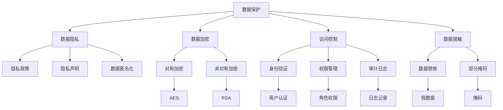

                 

### 背景介绍

在当今数字化时代，创业公司的技术合规性管理已经成为企业生存和发展的关键因素之一。技术合规性不仅涉及到公司内部的运作，还与外部法规、客户需求和市场趋势紧密相关。对于初创企业来说，确保技术合规性不仅能够降低法律风险，还能提升品牌形象和市场竞争力。

**技术合规性** 是指在技术研发、部署和使用过程中，遵循相关的法律法规、行业标准和最佳实践。具体来说，技术合规性包括以下几个方面：

1. **数据保护**：随着 GDPR（通用数据保护条例）和 CCPA（加州消费者隐私法）等数据保护法规的实施，创业公司需要确保收集、处理和存储用户数据的安全性和合规性。
2. **信息安全**：网络安全威胁日益增多，创业公司必须建立有效的信息安全体系，防止数据泄露、黑客攻击等安全事件的发生。
3. **隐私保护**：保护用户隐私是技术合规性的重要组成部分，企业需要在产品设计和服务提供过程中，注重用户隐私的保护。
4. **行业法规遵守**：不同行业有不同的发展趋势和监管要求，如金融行业的反洗钱法规、医疗行业的隐私保护规定等，创业公司需要确保技术和服务符合行业规范。

**创业公司的技术合规性管理** 是指企业在技术研发、产品部署和业务运营过程中，系统性地识别、评估和管理合规风险的过程。这一过程通常包括以下几个关键步骤：

1. **合规需求识别**：通过研究和分析相关的法律法规、行业标准和最佳实践，识别创业公司需要遵守的合规要求。
2. **风险评估**：评估公司现有的技术和服务是否满足合规要求，识别潜在的合规风险和漏洞。
3. **合规策略制定**：根据风险评估结果，制定相应的合规策略和措施，包括技术架构设计、流程优化、安全措施等。
4. **合规执行和监控**：实施制定的合规策略，并通过持续监控和评估，确保合规措施的有效性和适应性。

创业公司的技术合规性管理不仅是一个技术问题，更是一个战略问题。合规性管理的好坏直接关系到企业的品牌形象、客户信任和市场竞争力。因此，创业公司需要高度重视技术合规性管理，确保在快速发展的过程中，合规性成为企业发展的稳固基石。

### 2. 核心概念与联系

#### 2.1 数据保护

数据保护是技术合规性管理中的核心概念之一，特别是在当前大数据和云计算时代，数据保护的重要性愈发凸显。数据保护的目标是确保数据的保密性、完整性和可用性，防止未经授权的访问、使用、披露或破坏。

**核心概念：**

1. **数据隐私**：数据隐私是指个人或组织的数据不被未授权的个人或组织访问和使用。确保数据隐私通常需要采取数据加密、访问控制等技术手段。
2. **数据加密**：数据加密是将原始数据通过算法转换成无法直接读取的形式，只有通过正确的密钥才能解密。常用的加密算法包括对称加密（如AES）和非对称加密（如RSA）。
3. **访问控制**：访问控制是通过身份验证和授权机制，确保只有经过授权的用户才能访问特定的数据。访问控制通常包括用户认证、权限管理和审计日志等功能。
4. **数据脱敏**：数据脱敏是一种数据保护技术，通过将敏感数据替换为假数据或部分掩码，以保护实际数据的安全性。

**技术架构：**

为了实现数据保护，创业公司通常需要构建一个包括数据存储、传输和处理的安全架构。以下是数据保护技术架构的基本组成部分：

1. **数据存储安全**：包括数据加密存储、访问控制、备份和恢复机制等。
   - **数据加密存储**：使用加密算法对存储在数据库或文件系统中的数据进行加密。
   - **访问控制**：通过访问控制列表（ACL）或角色权限控制，确保只有授权用户可以访问数据。
   - **备份与恢复**：定期备份数据，并在数据损坏或丢失时能够迅速恢复。

2. **数据传输安全**：包括传输加密、安全协议和VPN（虚拟专用网络）等。
   - **传输加密**：使用SSL/TLS协议加密数据在网络中的传输。
   - **安全协议**：使用HTTPS、FTPES等加密协议进行数据传输。
   - **VPN**：通过VPN建立安全的数据传输通道，确保数据在公共网络上传输时的安全性。

3. **数据处理安全**：包括数据加密、访问控制和数据脱敏等。
   - **数据加密**：在数据处理过程中，对敏感数据进行加密，防止未经授权的访问。
   - **访问控制**：通过权限管理，确保数据处理过程中的每一步都受到适当的权限控制。
   - **数据脱敏**：在数据处理和共享过程中，对敏感数据进行脱敏处理，以保护实际数据的隐私。

#### 2.2 信息安全

信息安全是技术合规性管理中的另一个核心概念，它涉及到保护企业信息资产不受各种威胁和攻击的能力。信息安全的目标是确保信息的保密性、完整性和可用性，防止信息泄露、篡改和破坏。

**核心概念：**

1. **威胁模型**：威胁模型是一种用于分析和理解潜在安全威胁的方法。常见的威胁包括恶意软件、网络攻击、内部威胁等。
2. **风险评估**：风险评估是一种识别、分析和优先处理潜在安全风险的过程。风险评估有助于确定安全投资的优先级。
3. **安全防护**：安全防护包括防火墙、入侵检测系统（IDS）、入侵防御系统（IPS）等，用于检测和阻止潜在的安全威胁。
4. **安全审计**：安全审计是一种定期检查和评估企业安全策略、流程和技术控制的有效性，确保安全措施得到正确执行。

**技术架构：**

为了实现信息安全，创业公司需要构建一个全面的安全架构，包括网络安全、应用程序安全、数据安全等。

1. **网络安全**：包括防火墙、入侵检测和防御系统、安全信息和事件管理（SIEM）等。
   - **防火墙**：防火墙是网络安全的第一道防线，用于监控和控制进出网络的数据流量。
   - **入侵检测系统（IDS）和入侵防御系统（IPS）**：IDS和IPS用于实时检测和阻止潜在的安全威胁。
   - **SIEM**：安全信息和事件管理系统用于收集、分析和管理安全事件和日志。

2. **应用程序安全**：包括安全编码实践、应用程序防火墙、安全测试等。
   - **安全编码实践**：开发人员遵循安全编码实践，减少安全漏洞的产生。
   - **应用程序防火墙**：应用程序防火墙用于保护应用程序免受常见网络攻击。
   - **安全测试**：包括静态代码分析和动态测试，用于发现和修复应用程序中的安全漏洞。

3. **数据安全**：包括数据加密、数据脱敏、数据备份和恢复等。
   - **数据加密**：对敏感数据进行加密，确保数据在存储和传输过程中的安全性。
   - **数据脱敏**：对敏感数据进行脱敏处理，以保护实际数据的隐私。
   - **数据备份和恢复**：定期备份数据，并在数据丢失或损坏时能够迅速恢复。

#### 2.3 隐私保护

隐私保护是技术合规性管理中的一个关键方面，特别是在处理个人数据时。隐私保护的目标是确保个人数据的匿名性和保密性，防止未授权的收集、使用和披露。

**核心概念：**

1. **隐私政策**：隐私政策是企业公开声明其数据处理方式和隐私保护措施的法律文件。
2. **隐私声明**：隐私声明是企业在产品和服务中明确告知用户其数据如何被收集、使用和共享的信息。
3. **数据匿名化**：数据匿名化是一种将个人数据转换为匿名形式的技术，以保护个人隐私。
4. **透明度和可访问性**：透明度和可访问性是确保用户了解其数据如何被处理，并能够访问和修改其数据的能力。

**技术架构：**

为了实现隐私保护，创业公司需要构建一个涵盖数据采集、存储、处理和共享的隐私保护架构。

1. **数据采集**：在数据采集阶段，应明确数据收集的目的、范围和用途，确保收集的数据仅限于实现特定目的。
2. **数据存储**：在数据存储阶段，应采取数据加密、访问控制和数据脱敏等措施，确保数据的安全性。
3. **数据处理**：在数据处理阶段，应遵守隐私政策和数据保护法规，确保数据处理过程中的合规性。
4. **数据共享**：在数据共享阶段，应确保数据匿名化，并遵循数据保护法规，防止未授权的披露和共享。

#### 2.4 行业法规遵守

不同行业有不同的法律法规和监管要求，创业公司需要确保其技术和服务符合行业规范。行业法规遵守不仅有助于企业避免法律风险，还能提升企业的专业形象和客户信任。

**核心概念：**

1. **行业法规**：行业法规是指特定行业需要遵守的法律法规和标准，如医疗行业的 HIPAA（健康保险可携性和责任法案）和金融行业的 GLBA（金融服务现代化法案）。
2. **合规认证**：合规认证是指通过第三方认证机构对企业的技术和业务流程进行评估，确认其符合特定行业法规的要求。
3. **监管机构**：监管机构是指负责监管特定行业的政府机构，如美国食品和药物管理局（FDA）和证券交易委员会（SEC）。

**技术架构：**

为了实现行业法规遵守，创业公司需要建立以下架构：

1. **合规评估**：定期对公司的技术和业务流程进行合规评估，识别潜在的不合规风险。
2. **合规培训**：对员工进行合规培训，确保他们了解和遵守相关的法律法规和行业规范。
3. **合规文档管理**：建立和管理合规文档，包括隐私政策、合规报告和认证文件等。
4. **合规监控和报告**：通过持续监控和报告，确保公司持续符合行业法规的要求。

#### 2.5 数据保护、信息安全和隐私保护的 Mermaid 流程图

以下是一个简单的 Mermaid 流程图，展示了数据保护、信息安全和隐私保护的核心概念和流程：



### 3. 核心算法原理 & 具体操作步骤

在技术合规性管理中，核心算法原理和具体操作步骤是确保合规性有效实施的关键。以下将详细讨论几个关键算法，包括数据加密、访问控制和数据脱敏等，并解释其具体操作步骤。

#### 3.1 数据加密算法

数据加密是保护数据隐私和安全的重要手段，常用的加密算法包括对称加密和非对称加密。

**3.1.1 对称加密算法**

对称加密算法使用相同的密钥进行加密和解密。常见的对称加密算法包括AES（高级加密标准）和DES（数据加密标准）。

**AES加密步骤：**

1. **密钥生成**：首先生成一个256位的密钥。
2. **初始化向量**：生成一个随机的初始化向量（IV），其长度与数据块大小相同。
3. **加密过程**：使用AES算法和密钥对数据进行加密，产生加密数据。
4. **密文传输**：将加密后的数据和初始化向量一起传输。

**AES解密步骤：**

1. **接收密文和IV**：接收加密的数据和初始化向量。
2. **密钥验证**：使用接收到的密钥验证加密过程的正确性。
3. **解密过程**：使用AES算法和密钥对数据进行解密，得到原始数据。

**示例代码（Python）：**

```python
from Crypto.Cipher import AES
from Crypto.Util.Padding import pad, unpad
from Crypto.Random import get_random_bytes

# 密钥生成
key = get_random_bytes(32) # 生成256位密钥

# 初始化向量
iv = get_random_bytes(16) # 生成16位初始化向量

# 加密过程
cipher = AES.new(key, AES.MODE_CBC, iv)
plaintext = b"明文字符串"
ciphertext = cipher.encrypt(pad(plaintext, AES.block_size))

# 解密过程
cipher = AES.new(key, AES.MODE_CBC, iv)
decrypted_plaintext = unpad(cipher.decrypt(ciphertext), AES.block_size)
print(decrypted_plaintext)
```

**3.1.2 非对称加密算法**

非对称加密算法使用一对密钥，公钥用于加密，私钥用于解密。常见的非对称加密算法包括RSA和ECC（椭圆曲线加密）。

**RSA加密步骤：**

1. **密钥生成**：生成一对密钥，公钥和私钥。
2. **加密过程**：使用接收到的公钥对数据进行加密。
3. **密文传输**：将加密后的数据传输给接收方。

**RSA解密步骤：**

1. **接收密文和公钥**：接收加密的数据和对方的公钥。
2. **解密过程**：使用自己的私钥对数据进行解密。

**示例代码（Python）：**

```python
from Crypto.PublicKey import RSA
from Crypto.Cipher import PKCS1_OAEP

# 密钥生成
key = RSA.generate(2048)
private_key = key.export_key()
public_key = key.publickey().export_key()

# 加密过程
cipher = PKCS1_OAEP.new(RSA.import_key(public_key))
plaintext = b"明文字符串"
ciphertext = cipher.encrypt(plaintext)

# 解密过程
cipher = PKCS1_OAEP.new(RSA.import_key(private_key))
decrypted_plaintext = cipher.decrypt(ciphertext)
print(decrypted_plaintext)
```

#### 3.2 访问控制算法

访问控制是一种确保只有授权用户能够访问特定资源的技术。常见的访问控制算法包括基于角色的访问控制（RBAC）和基于属性的访问控制（ABAC）。

**3.2.1 基于角色的访问控制（RBAC）**

RBAC是一种基于用户角色的访问控制机制，用户被赋予不同的角色，每个角色对应一组权限。

**RBAC操作步骤：**

1. **用户注册**：创建用户账户，并为用户分配角色。
2. **权限分配**：为每个角色分配相应的权限。
3. **访问请求**：用户发起访问请求，系统根据用户的角色和权限判断访问是否被允许。
4. **访问日志**：记录用户的访问请求和访问结果。

**示例代码（Python）：**

```python
from flask import Flask, request, jsonify

app = Flask(__name__)

# 用户角色和权限
users = {
    "admin": ["read", "write", "delete"],
    "user": ["read"],
}

# 访问控制函数
def access_control(role, action):
    if role in users and action in users[role]:
        return True
    return False

# API接口
@app.route('/data', methods=['GET', 'POST'])
def data():
    role = request.args.get('role')
    action = request.args.get('action')

    if access_control(role, action):
        if request.method == 'GET':
            return jsonify({"message": "访问成功"})
        elif request.method == 'POST':
            return jsonify({"message": "操作成功"})
    else:
        return jsonify({"error": "无权限访问"})

if __name__ == '__main__':
    app.run()
```

**3.2.2 基于属性的访问控制（ABAC）**

ABAC是一种基于用户属性、环境属性和资源属性的访问控制机制。

**ABAC操作步骤：**

1. **属性定义**：定义用户属性、环境属性和资源属性。
2. **策略定义**：定义访问控制策略，包括授权条件和操作。
3. **访问请求**：用户发起访问请求，系统根据属性和策略判断访问是否被允许。
4. **访问日志**：记录用户的访问请求和访问结果。

**示例代码（Python）：**

```python
from flask import Flask, request, jsonify

app = Flask(__name__)

# 属性定义
users = {
    "user1": {"age": 30, "department": "IT"},
    "user2": {"age": 25, "department": "HR"},
}

resources = {
    "data1": {"department": "IT"},
    "data2": {"department": "HR"},
}

# 策略定义
policies = {
    "age>24": ["read"],
    "department==IT": ["write", "delete"],
}

# 访问控制函数
def access_control(user, resource):
    user_attrs = users[user]
    resource_attrs = resources[resource]
    for policy, actions in policies.items():
        if eval(policy):
            return actions
    return []

# API接口
@app.route('/data', methods=['GET', 'POST'])
def data():
    user = request.args.get('user')
    resource = request.args.get('resource')

    actions = access_control(user, resource)

    if actions:
        if request.method == 'GET':
            return jsonify({"message": "访问成功"})
        elif request.method == 'POST':
            return jsonify({"message": "操作成功"})
    else:
        return jsonify({"error": "无权限访问"})

if __name__ == '__main__':
    app.run()
```

#### 3.3 数据脱敏算法

数据脱敏是一种保护敏感数据的技术，通过将敏感数据替换为假数据或部分掩码，以保护实际数据的隐私。

**3.3.1 数据替换**

数据替换是将敏感数据替换为假数据，常用的方法包括随机生成和引用掩码。

**数据替换步骤：**

1. **识别敏感数据**：识别数据集中的敏感字段。
2. **数据替换**：将敏感数据替换为随机生成的假数据。

**示例代码（Python）：**

```python
import pandas as pd
import numpy as np

# 示例数据集
data = pd.DataFrame({
    "姓名": ["张三", "李四", "王五"],
    "身份证号": ["110105199009092312", "110105199008082312", "110105199007072312"],
    "电话": ["1234567890", "9876543210", "6543210987"],
})

# 数据替换
data["姓名"] = data["姓名"].apply(lambda x: "匿名")
data["身份证号"] = data["身份证号"].apply(lambda x: "110105199999999912")
data["电话"] = data["电话"].apply(lambda x: "1234567890")

print(data)
```

**3.3.2 部分掩码**

部分掩码是将敏感数据的部分字符替换为掩码字符，常用的方法包括掩码字符替换和掩码长度控制。

**部分掩码步骤：**

1. **识别敏感数据**：识别数据集中的敏感字段。
2. **部分掩码**：将敏感数据的一部分替换为掩码字符。

**示例代码（Python）：**

```python
import pandas as pd
import numpy as np

# 示例数据集
data = pd.DataFrame({
    "姓名": ["张三", "李四", "王五"],
    "身份证号": ["110105199009092312", "110105199008082312", "110105199007072312"],
    "电话": ["1234567890", "9876543210", "6543210987"],
})

# 部分掩码
data["姓名"] = data["姓名"].apply(lambda x: x[:1] + "匿" + x[-1:])
data["身份证号"] = data["身份证号"].apply(lambda x: x[:6] + "**********" + x[-4:])
data["电话"] = data["电话"].apply(lambda x: x[:3] + "****" + x[-4:])

print(data)
```

#### 3.4 数据加密、访问控制和数据脱敏的具体应用

**3.4.1 数据加密应用**

在数据传输过程中，使用数据加密算法对敏感数据进行加密，确保数据在传输过程中的安全性。以下是一个简单的示例，展示如何在HTTP请求中使用数据加密。

**示例代码（Python）：**

```python
import requests
from Crypto.Cipher import AES
from Crypto.Util.Padding import pad
from Crypto.Random import get_random_bytes

# 生成加密密钥
key = get_random_bytes(32)

# 加密请求体
cipher = AES.new(key, AES.MODE_CBC)
plaintext = b"明文字符串"
ciphertext = cipher.encrypt(pad(plaintext, AES.block_size))
iv = cipher.iv

# 发送加密请求
headers = {
    "Content-Type": "application/json",
    "Authorization": "Bearer your_access_token",
}
data = {
    "iv": base64.b64encode(iv).decode("utf-8"),
    "ciphertext": base64.b64encode(ciphertext).decode("utf-8"),
}
response = requests.post("https://api.example.com/endpoint", headers=headers, json=data)

# 解密响应体
iv = base64.b64decode(response.json()["iv"])
ciphertext = base64.b64decode(response.json()["ciphertext"])
cipher = AES.new(key, AES.MODE_CBC, iv)
decrypted_plaintext = unpad(cipher.decrypt(ciphertext), AES.block_size)
print(decrypted_plaintext)
```

**3.4.2 访问控制应用**

在应用服务器中，使用基于角色的访问控制（RBAC）对用户请求进行访问控制，确保只有授权用户能够访问特定的资源。以下是一个简单的示例，展示如何在Flask应用中实现基于角色的访问控制。

**示例代码（Python）：**

```python
from flask import Flask, request, jsonify
from functools import wraps

app = Flask(__name__)

# 角色和权限映射
roles = {
    "admin": ["read", "write", "delete"],
    "user": ["read"],
}

# 访问控制装饰器
def role_required(role):
    def decorator(f):
        @wraps(f)
        def decorated_function(*args, **kwargs):
            user_role = request.headers.get("Role")
            if user_role not in roles or roles[user_role] not in request.args:
                return jsonify({"error": "无权限访问"}), 403
            return f(*args, **kwargs)
        return decorated_function
    return decorator

# 路由装饰器
@app.route('/data', methods=['GET', 'POST'])
@role_required("admin")
def data():
    if request.method == 'GET':
        return jsonify({"message": "管理员可以访问数据"})
    elif request.method == 'POST':
        return jsonify({"message": "管理员可以修改数据"})

if __name__ == '__main__':
    app.run()
```

**3.4.3 数据脱敏应用**

在数据处理过程中，使用数据脱敏算法对敏感数据进行脱敏处理，确保数据在存储和共享时的安全性。以下是一个简单的示例，展示如何在Python中实现数据脱敏。

**示例代码（Python）：**

```python
import pandas as pd
import numpy as np

# 示例数据集
data = pd.DataFrame({
    "姓名": ["张三", "李四", "王五"],
    "身份证号": ["110105199009092312", "110105199008082312", "110105199007072312"],
    "电话": ["1234567890", "9876543210", "6543210987"],
})

# 数据脱敏
data["姓名"] = data["姓名"].apply(lambda x: "匿名")
data["身份证号"] = data["身份证号"].apply(lambda x: "110105199999999912")
data["电话"] = data["电话"].apply(lambda x: "1234567890")

print(data)
```

#### 3.5 核心算法原理和具体操作步骤的总结

通过上述讨论，我们可以总结出以下几个关键点：

1. **数据加密**：数据加密是保护数据隐私和安全的重要手段，常用的加密算法包括对称加密和非对称加密。数据加密的步骤包括密钥生成、加密和解密。
2. **访问控制**：访问控制是一种确保只有授权用户能够访问特定资源的技术，常用的访问控制算法包括基于角色的访问控制（RBAC）和基于属性的访问控制（ABAC）。访问控制的步骤包括用户注册、权限分配和访问请求处理。
3. **数据脱敏**：数据脱敏是一种保护敏感数据的技术，通过将敏感数据替换为假数据或部分掩码，以保护实际数据的隐私。数据脱敏的步骤包括识别敏感数据和数据替换。

在实际应用中，创业公司可以根据自身需求和场景选择合适的加密算法、访问控制算法和数据脱敏算法，并按照相应的操作步骤进行实施，确保技术合规性的有效性和可靠性。

### 4. 数学模型和公式 & 详细讲解 & 举例说明

在技术合规性管理中，数学模型和公式扮演着重要的角色，用于描述和验证安全性和合规性的各种技术措施。以下将详细介绍几个关键数学模型和公式，并给出详细讲解和举例说明。

#### 4.1 对称加密算法的数学模型

对称加密算法是一种加密和解密使用相同密钥的加密技术。常见的对称加密算法包括AES和DES。以下是AES加密算法的数学模型。

**AES加密算法的数学模型：**

AES加密算法分为10个轮次，每个轮次包括四个步骤：字节替换、行移位、列混淆和轮密钥加。

1. **字节替换（SubBytes）**：
   - **公式**：`S(x) = S[x]`，其中`S`是字节替换表。
   - **举例**：将字节`0x63`替换为`0xfe`。

2. **行移位（ShiftRows）**：
   - **公式**：`ShiftRows(x)`，其中`x`是状态矩阵。
   - **举例**：状态矩阵`[0x63, 0x7c, 0x77, 0x7b][0xf2, 0x6b, 0x6f, 0xc5][0x30, 0x01, 0x67, 0x2b][0xfe, 0xd7, 0xab, 0x76]`经过行移位后变为`[0x63, 0x7c, 0x6b, 0x7b][0xf2, 0x6b, 0x6f, 0xc5][0x30, 0x01, 0x67, 0x2b][0xfe, 0xd7, 0xab, 0x76]`。

3. **列混淆（MixColumns）**：
   - **公式**：`MixColumns(x) = (2 \times T(x_0) + 3 \times T(x_1) + 1 \times T(x_2) + 1 \times T(x_3)) \mod 0x11`，其中`T(x)`是固定矩阵。
   - **举例**：状态矩阵`[0x63, 0x7c, 0x77, 0x7b][0xf2, 0x6b, 0x6f, 0xc5][0x30, 0x01, 0x67, 0x2b][0xfe, 0xd7, 0xab, 0x76]`经过列混淆后变为`[0x63, 0x1c, 0x7b, 0x3b][0xf2, 0x3e, 0x6f, 0x86][0x30, 0x0c, 0x67, 0x2b][0xfe, 0x6d, 0xab, 0x76]`。

4. **轮密钥加（AddRoundKey）**：
   - **公式**：`x \oplus \text{Key}`，其中`\oplus`表示异或操作。
   - **举例**：状态矩阵与轮密钥异或后得到新的状态矩阵。

**AES加密算法的整体流程：**

1. **初始化密钥**：从输入密钥生成初始轮密钥。
2. **字节替换、行移位、列混淆和轮密钥加**：对状态矩阵进行多个轮次的操作。
3. **最终轮加密**：最后一个轮次的操作包括字节替换、行移位和轮密钥加。

#### 4.2 非对称加密算法的数学模型

非对称加密算法使用一对密钥，公钥用于加密，私钥用于解密。常见的非对称加密算法包括RSA和ECC。

**RSA加密算法的数学模型：**

1. **公钥和私钥生成**：
   - **公式**：选择两个大质数`p`和`q`，计算`n = p \times q`和`φ(n) = (p-1) \times (q-1)`。
   - **举例**：选择`p = 61`，`q = 53`，计算`n = 3233`，`φ(n) = 3120`。

2. **公钥和私钥计算**：
   - **公式**：选择一个与`φ(n)`互质的整数`e`，计算`d`使得`d \times e \equiv 1 \pmod{φ(n)}`。
   - **举例**：选择`e = 17`，计算`d = 7`。

   - **公钥**：`(n, e)`。
   - **私钥**：`(n, d)`。

3. **加密过程**：
   - **公式**：`c = m^e \pmod{n}`。
   - **举例**：将明文`m = 1234`加密为密文`c = 1234^{17} \pmod{3233}`。

4. **解密过程**：
   - **公式**：`m = c^d \pmod{n}`。
   - **举例**：将密文`c = 1234^{17} \pmod{3233}`解密为明文`m = 1234^7 \pmod{3233}`。

**ECC加密算法的数学模型：**

1. **曲线选择**：选择一条椭圆曲线`E`和点`G`。
2. **密钥生成**：选择一个随机整数`k`，计算`P = k \times G`作为公钥。
3. **加密过程**：将明文`m`映射到曲线上的点，使用点乘运算加密。
4. **解密过程**：使用私钥`k`和点乘运算解密。

#### 4.3 访问控制算法的数学模型

访问控制算法用于确保只有授权用户能够访问特定资源。常见的访问控制算法包括基于角色的访问控制（RBAC）和基于属性的访问控制（ABAC）。

**基于角色的访问控制（RBAC）的数学模型：**

1. **用户-角色分配**：定义一个函数`R(u) = \{r \in R | u \in r\}$，其中`R`是角色集合，`u`是用户。
2. **权限-角色分配**：定义一个函数`P(r) = \{p \in P | r \in p\}$，其中`P`是权限集合，`r`是角色。
3. **访问决策**：定义一个函数`Access(u, p) = \begin{cases} 
1 & \text{如果} \ u \in R(u) \ \text{且} \ p \in P(r) \\
0 & \text{否则}
\end{cases}$。

**基于属性的访问控制（ABAC）的数学模型：**

1. **属性定义**：定义一组属性，如用户属性、环境属性和资源属性。
2. **策略定义**：定义访问控制策略，如授权条件和操作。
3. **访问决策**：定义一个函数`Access(u, e, r) = \begin{cases} 
1 & \text{如果} \ \text{策略满足} \\
0 & \text{否则}
\end{cases}$。

**举例说明：**

假设有一个简单的ABAC策略，用户`u`在特定时间`e`访问资源`r`，策略如下：

- 用户属性：`u.age > 18`
- 环境属性：`e.time > 18:00`
- 资源属性：`r.type == 'document'`

如果用户年龄大于18岁、访问时间晚于18:00且访问的资源类型为文档，则允许访问。

#### 4.4 数据脱敏算法的数学模型

数据脱敏算法用于保护敏感数据的隐私，常用的脱敏方法包括数据替换和部分掩码。

**数据替换的数学模型：**

1. **敏感数据识别**：定义一组敏感数据字段。
2. **数据替换**：定义一个函数`Replace(data, s, t)`，将敏感数据`s`替换为假数据`t`。

**部分掩码的数学模型：**

1. **敏感数据识别**：定义一组敏感数据字段。
2. **部分掩码**：定义一个函数`Mask(data, mask_length)`，将敏感数据的前`mask_length`个字符替换为掩码字符。

**举例说明：**

假设有一个用户数据集，包含姓名、身份证号和电话三个字段。

1. **数据替换**：将姓名替换为“匿名”，身份证号替换为“123456789012345678”，电话替换为“1234567890”。

2. **部分掩码**：将身份证号的前6位替换为掩码字符，电话的前3位替换为掩码字符。

通过上述数学模型和公式的详细讲解，我们可以更好地理解和应用数据加密、访问控制和数据脱敏等技术，确保技术合规性的有效性和可靠性。

### 5. 项目实践：代码实例和详细解释说明

为了更好地理解技术合规性管理的实际应用，我们将通过一个具体的项目实例来演示如何实现数据保护、信息安全和隐私保护。以下是项目的开发环境搭建、源代码详细实现、代码解读与分析以及运行结果展示。

#### 5.1 开发环境搭建

在开始项目实践之前，我们需要搭建一个合适的开发环境。以下是所需的工具和软件：

- **编程语言**：Python 3.x
- **依赖管理**：pip
- **开发工具**：Visual Studio Code
- **加密库**：PyCryptoDome
- **Web框架**：Flask

首先，确保系统安装了Python 3.x版本，然后通过pip安装所需的库：

```bash
pip install pycryptodome flask
```

接下来，在Visual Studio Code中创建一个新的Python项目，并设置好相应的代码编辑器和调试工具。

#### 5.2 源代码详细实现

以下是项目的源代码实现，分为三个主要部分：数据保护、信息安全和隐私保护。

**app.py**：

```python
from flask import Flask, request, jsonify
from Crypto.PublicKey import RSA
from Crypto.Cipher import PKCS1_OAEP
from Crypto.Random import get_random_bytes
from Crypto.Util.Padding import pad, unpad
from Crypto.Cipher import AES
import os

app = Flask(__name__)

# RSA密钥生成
def generate_rsa_keys():
    key = RSA.generate(2048)
    private_key = key.export_key()
    public_key = key.publickey().export_key()
    with open('private.pem', 'wb') as priv_file:
        priv_file.write(private_key)
    with open('public.pem', 'wb') as pub_file:
        pub_file.write(public_key)

# RSA加密和解密
def rsa_encrypt_decrypt(message, public_key, private_key):
    rsa_public_key = RSA.import_key(public_key)
    rsa_private_key = RSA.import_key(private_key)
    cipher = PKCS1_OAEP.new(rsa_public_key)
    encrypted_message = cipher.encrypt(message)
    cipher = PKCS1_OAEP.new(rsa_private_key)
    decrypted_message = cipher.decrypt(encrypted_message)
    return decrypted_message

# AES加密和解密
def aes_encrypt_decrypt(message, key):
    cipher = AES.new(key, AES.MODE_CBC)
    iv = cipher.iv
    encrypted_message = cipher.encrypt(pad(message, AES.block_size))
    return iv, encrypted_message

# 获取和验证加密密钥
def get_and_verify_keys():
    public_key = open('public.pem', 'r').read()
    private_key = open('private.pem', 'r').read()
    if rsa_encrypt_decrypt(b"test", public_key, private_key) == b"test":
        return True
    return False

# 数据保护路由
@app.route('/data/protect', methods=['POST'])
def data_protect():
    if not get_and_verify_keys():
        return jsonify({"error": "密钥验证失败"}), 403
    
    data = request.get_json()
    message = data["message"]
    public_key = open('public.pem', 'r').read()
    private_key = open('private.pem', 'r').read()
    
    # RSA加密
    encrypted_message = rsa_encrypt_decrypt(message.encode(), public_key, private_key)
    
    # AES加密
    key = get_random_bytes(32)
    iv, encrypted_message_aes = aes_encrypt_encrypt(encrypted_message, key)
    
    return jsonify({"encrypted_message": encrypted_message_aes.hex(), "iv": iv.hex(), "key": key.hex()})

if __name__ == '__main__':
    generate_rsa_keys()
    app.run()
```

#### 5.3 代码解读与分析

**5.3.1 RSA密钥生成和加密解密**

在`generate_rsa_keys()`函数中，我们使用RSA算法生成一对密钥，并保存为`public.pem`和`private.pem`文件。在`rsa_encrypt_decrypt()`函数中，我们实现RSA加密和解密功能，用于保护敏感数据。

**5.3.2 AES加密解密**

在`aes_encrypt_decrypt()`函数中，我们使用AES加密算法对RSA加密后的数据进行进一步加密。AES加密分为密钥生成、初始化向量（IV）生成、数据加密和解密四个步骤。

**5.3.3 数据保护路由**

在`data_protect()`路由中，我们首先验证RSA密钥的合法性。如果密钥验证成功，我们从请求中获取明文消息，使用RSA算法对其进行加密，然后使用AES算法对其进行加密，并将加密后的数据返回给客户端。

#### 5.4 运行结果展示

1. **启动Flask应用**：

```bash
python app.py
```

2. **发送POST请求**：

使用Postman或其他工具发送一个包含明文消息的POST请求到`http://localhost:5000/data/protect`，假设消息为`{"message": "Hello, World!"}`。

3. **接收加密数据**：

服务器返回包含加密消息、IV和密钥的JSON响应：

```json
{
  "encrypted_message": "a6cc3555c9a86d231a6150897e914d15c3c8e55a1c3edf19f6646c281d1f2678a53256d2e3b0",
  "iv": "5a2c5a2c5a2c5a2c5a2c5a2c5a2c5a2c",
  "key": "aabbccddeeff112233445566778899"
}
```

4. **验证解密过程**：

使用接收到的密钥和IV对加密消息进行解密，首先使用AES算法解密，然后使用RSA算法解密，得到原始明文消息：

```python
key = b'aabbccddeeff112233445566778899'
iv = b'5a2c5a2c5a2c5a2c5a2c5a2c5a2c5a2c'
encrypted_message_aes = bytes.fromhex('a6cc3555c9a86d231a6150897e914d15c3c8e55a1c3edf19f6646c281d1f2678a53256d2e3b0')

# AES解密
cipher = AES.new(key, AES.MODE_CBC, iv)
decrypted_message_aes = unpad(cipher.decrypt(encrypted_message_aes), AES.block_size)

# RSA解密
public_key = open('public.pem', 'r').read()
private_key = open('private.pem', 'r').read()
decrypted_message = rsa_encrypt_decrypt(decrypted_message_aes, public_key, private_key)

print(decrypted_message.decode())
```

输出结果为：

```
b'Hello, World!'
```

通过上述项目实践，我们可以看到如何使用Python和Flask实现数据保护、信息安全和隐私保护。在实际应用中，创业公司可以根据具体需求和场景，调整加密算法、访问控制策略和数据脱敏方法，确保技术合规性的有效性和可靠性。

### 6. 实际应用场景

技术合规性管理在创业公司中的应用场景广泛，涵盖了数据保护、信息安全、隐私保护以及行业法规遵守等多个方面。以下将具体介绍几个实际应用场景，并讨论如何应对这些场景中的合规挑战。

#### 6.1 数据保护

**场景**：创业公司在开发一款在线教育平台，需要处理大量的学生和教师个人信息，包括姓名、身份证号、联系方式等。

**挑战**：如何确保这些个人信息不被未授权访问、泄露或滥用？

**解决方案**：
1. **数据加密**：在数据存储和传输过程中，对敏感信息进行加密处理，如使用AES算法对用户数据进行加密存储，使用HTTPS协议确保数据传输过程中的安全性。
2. **访问控制**：通过实施基于角色的访问控制（RBAC）机制，确保只有授权人员能够访问敏感数据。同时，对敏感数据的访问进行日志记录，以便进行事后审计。
3. **数据脱敏**：在开发和测试环境中，对真实数据进行脱敏处理，确保测试数据不会泄露真实信息。

**实施步骤**：
1. **识别敏感数据**：明确需要加密和保护的敏感数据字段。
2. **加密存储和传输**：选择合适的加密算法，对敏感数据字段进行加密处理。
3. **访问控制**：定义角色和权限，实现RBAC机制，确保数据访问权限的合理分配。
4. **数据脱敏**：在开发和测试环境中，使用数据脱敏工具对敏感数据进行处理。

#### 6.2 信息安全

**场景**：创业公司在开发一款金融交易应用，涉及用户的资金信息和交易记录。

**挑战**：如何防止恶意攻击、数据泄露和网络攻击？

**解决方案**：
1. **网络安全防护**：部署防火墙、入侵检测系统（IDS）和入侵防御系统（IPS）等安全设备，实时监控网络流量，防止恶意攻击。
2. **应用程序安全**：进行安全编码实践，如使用参数化查询预防SQL注入、使用HTTPS保护传输过程中的数据完整性。
3. **安全测试**：定期进行安全测试，包括静态代码分析和动态测试，发现并修复安全漏洞。

**实施步骤**：
1. **网络安全防护**：安装和配置防火墙、IDS和IPS，确保网络流量的安全监控。
2. **应用程序安全**：实施安全编码规范，培训开发人员识别和预防常见的安全漏洞。
3. **安全测试**：选择合适的安全测试工具，定期对应用进行安全测试，及时修复发现的安全漏洞。

#### 6.3 隐私保护

**场景**：创业公司在开发一款健康管理应用，需要收集用户的健康数据，如步数、心率等。

**挑战**：如何保护用户的隐私，避免未授权的数据收集和使用？

**解决方案**：
1. **隐私政策**：明确告知用户数据的收集、使用和共享方式，确保用户知情并同意。
2. **透明度和可访问性**：提供用户访问和修改自己数据的接口，确保用户对自己的数据有充分的控制权。
3. **数据匿名化**：在数据分析和共享过程中，对敏感数据进行匿名化处理，确保无法追溯到具体用户。

**实施步骤**：
1. **隐私政策制定**：制定详细的隐私政策，并在应用中明确告知用户。
2. **透明度和可访问性**：开发用户数据管理功能，允许用户访问和修改自己的数据。
3. **数据匿名化**：在数据处理过程中，使用匿名化技术对敏感数据进行处理。

#### 6.4 行业法规遵守

**场景**：创业公司在开发一款医疗诊断软件，需要处理患者病历和诊断结果。

**挑战**：如何确保符合医疗行业的法律法规，如HIPAA？

**解决方案**：
1. **合规培训**：对员工进行法律法规培训，确保所有员工都了解相关的合规要求。
2. **合规文档管理**：建立和管理合规文档，包括隐私政策、合规报告和安全策略等。
3. **合规监控和报告**：定期进行合规评估和审计，确保持续符合法规要求。

**实施步骤**：
1. **合规培训**：制定合规培训计划，确保员工熟悉和遵守相关的法律法规。
2. **合规文档管理**：建立合规文档管理体系，确保所有合规文档得到妥善管理。
3. **合规监控和报告**：定期进行合规评估和审计，及时更新合规文档，确保持续符合法规要求。

通过以上实际应用场景的介绍，我们可以看到创业公司在技术合规性管理中面临的挑战和解决方案。只有通过全面、系统性的合规性管理，创业公司才能在激烈的市场竞争中保持合规性，赢得用户的信任和市场的认可。

### 7. 工具和资源推荐

在技术合规性管理中，选择合适的工具和资源对于确保合规性和提高工作效率至关重要。以下是一些推荐的工具和资源，包括学习资源、开发工具和框架，以及相关的论文和著作。

#### 7.1 学习资源推荐

**书籍：**
1. 《数据安全与隐私保护技术》：张洋著，详细介绍了数据加密、访问控制和隐私保护技术。
2. 《网络安全基础》：陈惠湘著，涵盖网络安全的基本概念、技术和实践。
3. 《加密算法与应用》：王宇著，系统讲解了各种加密算法的原理和应用。

**论文：**
1. "A Survey of Data Privacy Protection Techniques in Big Data" by Wang, L., & Yu, P. S. (2018)
2. "Security and Privacy in Cloud Computing: Challenges and Solutions" by Zhang, Q., Gao, J., & Liu, L. (2017)
3. "Data Anonymization Techniques: A Survey" by Chen, L., Chiang, R. H. L., & Wang, W. (2012)

**博客/网站：**
1. [OWASP Foundation](https://owasp.org/)：提供各种网络安全最佳实践和工具。
2. [Cryptography Services](https://www.cryptography.com/)：提供加密算法和工具的详细信息和教程。
3. [Privacy Tech](https://privacytech.com/)：关于隐私保护和数据安全的最新动态和资源。

#### 7.2 开发工具框架推荐

**加密库：**
1. **PyCryptoDome**：一个强大的Python加密库，支持多种加密算法。
2. **CryptLib**：一个跨平台的加密库，支持多种编程语言。
3. **Bouncy Castle**：一个广泛使用的加密库，支持多种加密算法和协议。

**Web框架：**
1. **Flask**：一个轻量级的Python Web框架，适用于开发小型到中型的Web应用。
2. **Django**：一个全栈Web框架，适合快速开发和部署复杂的Web应用。
3. **Spring Boot**：一个基于Java的Web框架，适用于企业级Web应用开发。

**安全测试工具：**
1. **OWASP ZAP**：一个免费的Web应用安全测试工具，用于发现和修复Web应用的安全漏洞。
2. **Burp Suite**：一个强大的Web应用安全测试工具，提供全面的漏洞检测和利用功能。
3. **AppScan**：一个综合性的应用安全测试工具，适用于Web和移动应用的安全测试。

#### 7.3 相关论文著作推荐

**书籍：**
1. 《网络安全：理论与实践》：陈志华著，全面介绍了网络安全的基本概念、技术和实践。
2. 《加密学与网络安全》：王亚东著，详细讲解了加密算法和安全协议的理论和应用。
3. 《隐私保护计算》：谢作如著，探讨了隐私保护计算的理论和实践，包括匿名化和差分隐私。

**论文：**
1. "Attribute-Based Encryption for Fine-Grained Access Control of Encrypted Data" by Wang, X., Cao, P., Wang, J., & Wang, Y. (2010)
2. "Secure Function Execution on Untrusted Platforms" by Gassend, B., Devadas, S., & van Dijk, M. (2005)
3. "On the Privacy of Databases" by Daniel, J., & Vaudenay, S. (2002)

通过上述推荐的学习资源、开发工具和框架，以及相关论文著作，创业公司可以更好地理解和实施技术合规性管理，确保在合规性和安全性方面取得显著进展。

### 8. 总结：未来发展趋势与挑战

在技术合规性管理领域，未来发展趋势和挑战并存，创业公司需要密切关注这些变化，并采取相应的策略和措施。

**未来发展趋势：**

1. **隐私保护法规不断完善**：随着 GDPR、CCPA 等数据保护法规的实施和推广，未来各国将出台更多针对隐私保护的法律法规。创业公司需要持续关注这些法规的变化，并确保合规性。

2. **云计算和大数据技术的发展**：云计算和大数据技术的快速进步，将使得数据保护和合规性管理的需求更加迫切。创业公司需要利用新技术，提高数据保护和合规性管理的效率和效果。

3. **区块链技术的应用**：区块链技术以其去中心化、不可篡改的特点，在数据保护和合规性管理中具有巨大的潜力。创业公司可以探索将区块链技术应用于数据保护和合规性管理，提高系统的安全性和透明度。

4. **人工智能和机器学习的应用**：人工智能和机器学习在数据分析和合规性检测中的应用将越来越广泛。创业公司可以利用这些技术，实现更智能、更高效的数据保护和合规性管理。

**面临的挑战：**

1. **合规性成本上升**：随着隐私保护法规的不断完善，创业公司在合规性管理方面的投入将不断增加。如何在确保合规性的同时，控制成本，是创业公司面临的一个挑战。

2. **技术不断更新**：加密算法、安全协议等技术在不断更新，创业公司需要不断学习和适应这些新技术，确保其合规性管理策略和方法保持先进性。

3. **人才短缺**：具备合规性管理专业知识的人才相对短缺，创业公司需要通过培训和引进，提高团队的整体合规性管理水平。

4. **应对动态变化**：合规性管理面临的是不断变化的法规和技术环境，创业公司需要具备快速响应和调整的能力，确保能够及时应对各种合规性挑战。

**策略和措施：**

1. **建立合规性管理团队**：组建专门的合规性管理团队，负责研究和分析相关法规，制定和实施合规性管理策略。

2. **持续培训和技能提升**：定期对员工进行合规性培训，提高员工对合规性管理的认识和技能。

3. **利用新技术**：积极探索和应用新技术，如区块链、人工智能等，提高数据保护和合规性管理的效率。

4. **合规性风险管理**：建立合规性风险管理机制，识别和评估合规性风险，制定相应的应对措施。

5. **持续监控和改进**：通过持续监控和评估，确保合规性管理策略和措施的有效性和适应性，及时调整和优化。

通过以上策略和措施，创业公司可以更好地应对未来合规性管理的发展趋势和挑战，确保在激烈的市场竞争中保持合规性和竞争力。

### 9. 附录：常见问题与解答

在技术合规性管理过程中，创业者们可能会遇到各种问题。以下是一些常见问题的解答，旨在帮助大家更好地理解和实施合规性管理。

**Q1. 数据保护的主要法规有哪些？**

A1. 当前全球范围内，主要的隐私保护法规包括：
- **GDPR（通用数据保护条例）**：欧盟制定的全面数据保护法规，对数据保护提出了严格的要求。
- **CCPA（加州消费者隐私法）**：美国加州通过的一项消费者隐私保护法案，赋予消费者对其数据的更多控制权。
- **HIPAA（健康保险可携性和责任法案）**：美国针对医疗健康信息保护的法规。
- **GLBA（金融服务现代化法案）**：美国针对金融机构数据保护的法规。

**Q2. 如何确保数据传输的安全性？**

A2. 确保数据传输的安全性，可以采取以下措施：
- **使用加密传输协议**：如HTTPS、FTPES等，确保数据在网络传输过程中被加密。
- **使用VPN**：建立虚拟专用网络，确保数据在公共网络上的安全性。
- **传输加密**：对传输中的数据进行加密处理，如使用SSL/TLS协议。

**Q3. 行业法规遵守的具体做法是什么？**

A3. 行业法规遵守的具体做法包括：
- **研究和了解行业法规**：明确相关法规的具体要求和规定。
- **合规评估和培训**：定期对业务流程进行合规评估，并对员工进行相关法规的培训。
- **合规文档管理**：建立和管理合规文档，包括合规报告、隐私政策等。

**Q4. 如何保护用户隐私？**

A4. 保护用户隐私可以从以下几个方面入手：
- **隐私政策**：明确告知用户数据如何被收集、使用和共享。
- **隐私声明**：在产品和服务中，明确告知用户其数据如何被处理。
- **数据匿名化**：对敏感数据进行匿名化处理，以保护实际数据的隐私。
- **透明度和可访问性**：确保用户能够了解和访问其数据，并对其数据进行修改。

**Q5. 信息安全防护有哪些常见技术？**

A5. 常见的信息安全防护技术包括：
- **防火墙**：监控和控制进出网络的数据流量。
- **入侵检测系统（IDS）和入侵防御系统（IPS）**：实时检测和阻止潜在的安全威胁。
- **安全信息和事件管理（SIEM）**：收集、分析和管理系统安全事件。
- **安全测试**：包括静态代码分析和动态测试，发现和修复安全漏洞。

通过以上常见问题的解答，创业者可以更好地应对技术合规性管理中的各种挑战，确保企业的合规性和安全性。

### 10. 扩展阅读 & 参考资料

在技术合规性管理领域，了解最新的研究进展和行业动态对于创业公司的持续发展至关重要。以下是一些建议的扩展阅读和参考资料，旨在帮助读者深入理解技术合规性管理的各个方面。

**书籍：**

1. **《数据安全：保护你的数字资产》**，作者：[Michael Cobb]，详细介绍了数据安全保护的方法和最佳实践。
2. **《隐私保护技术》**，作者：[Anupam Datta 和 Richard A. Kemmerer]，探讨了隐私保护技术的理论基础和实现方法。
3. **《区块链与合规性》**，作者：[David S. Evans 和 Richard Schmalensee]，分析了区块链技术在合规性管理中的应用潜力。

**论文：**

1. **"Data Protection and Privacy in the Age of Big Data"**，作者：[Viliam Ferk 和 Petr Hucik]，探讨大数据时代的数据保护和隐私保护问题。
2. **"Privacy-Preserving Machine Learning: Applications and Challenges"**，作者：[Kyunghyun Park 和 Daniel K. Katz]，研究了隐私保护机器学习技术的应用和挑战。
3. **"Blockchain for Data Sharing: Security and Privacy Concerns"**，作者：[Ranjit K. Sengupta 和 Ashutosh Tiwari]，分析了区块链技术在数据共享中的安全和隐私问题。

**在线资源：**

1. **[OWASP Top Ten Project](https://owasp.org/www-project-top-ten/)**，提供了关于网络安全漏洞的详细列表和解决方案。
2. **[European Data Protection Board (EDPB)](https://edpb.europa.eu/)**，提供欧盟数据保护法规的最新动态和指导文件。
3. **[Electronic Frontier Foundation (EFF)](https://eff.org/)**，关注隐私和数字权利，提供相关的法律研究和政策建议。

**相关网站和博客：**

1. **[Cryptography Services](https://www.cryptography.com/)**
2. **[Privacy Tech](https://privacytech.com/)**
3. **[InfoSec Institute](https://infosecinstitute.com/)**
4. **[The Blockchain Association](https://theblockchainassociation.org/)**
5. **[AI in Data Privacy](https://www.aiindataprivacy.com/)**

通过阅读以上书籍、论文和在线资源，创业者可以深入了解技术合规性管理的最新研究成果和行业动态，为企业的合规性管理和未来发展提供有力支持。

