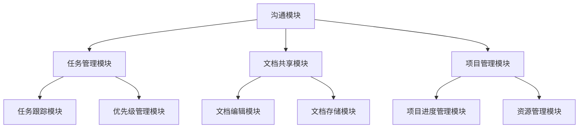

                 

### 1. 背景介绍

在当今快速发展的商业环境中，技术团队的协作效率直接决定了创业公司的成败。随着团队规模的不断扩大，如何高效地选择合适的协作工具，以最大化团队成员的协作效率，成为创业公司必须面对的一个重要问题。

协作工具的作用不仅在于提升团队沟通效率，还包括任务管理、文档共享、项目跟踪等多个方面。一个高效的协作工具能够帮助团队成员更好地协同工作，减少沟通成本，提高整体生产效率。

首先，我们需要了解协作工具的常见类型。协作工具主要可以分为以下几类：

1. **沟通工具**：如 Slack、Microsoft Teams、Zoom 等，主要用于即时通讯、视频会议、讨论组等功能。
2. **任务管理工具**：如 Jira、Trello、Asana 等，帮助团队进行任务分配、进度跟踪和优先级管理。
3. **文档共享工具**：如 Google Docs、Dropbox、Notion 等，用于文档的编辑、存储和共享。
4. **项目管理工具**：如 Microsoft Project、Toggl Plan、ClickUp 等，综合管理项目进度、资源和团队协作。

在选择协作工具时，创业公司需要考虑以下关键因素：

- **团队规模**：不同规模和类型的团队对协作工具的需求不同，需要根据实际情况选择合适的功能。
- **工作流程**：团队成员的工作流程和习惯会影响协作工具的选择，需要确保工具能够无缝融入现有工作流程。
- **易用性**：工具的易用性直接关系到团队成员的接受度和使用频率，简单直观的操作界面能够提升用户体验。
- **定制化能力**：团队可能需要根据自身特点进行功能定制，选择具备较强定制化能力的工具能够满足特殊需求。
- **安全性**：数据安全和隐私保护是协作工具的重要考虑因素，尤其是在处理敏感信息和重要数据时。

接下来，我们将深入探讨这些因素，并通过实例分析不同协作工具的优缺点，帮助创业公司在选择过程中做出明智的决策。

### 2. 核心概念与联系

#### 协作工具的功能与架构

协作工具的核心功能主要包括沟通、任务管理、文档共享和项目管理。这些功能相互关联，共同构成了一个完整的协作平台。以下是一个简化的协作工具架构图，用以说明各个模块之间的联系。



- **沟通模块**：提供即时通讯、视频会议、讨论组等功能，是团队成员进行实时沟通的主要途径。
- **任务管理模块**：用于任务的分配、进度跟踪和优先级管理，确保团队成员明确各自的任务和目标。
- **文档共享模块**：支持文档的编辑、存储和共享，提高团队的工作效率和信息流通速度。
- **项目管理模块**：综合管理项目的进度、资源和团队协作，确保项目按时按质完成。

#### 协作工具的核心原理

协作工具的核心原理包括以下几个方面：

1. **实时通讯**：通过即时消息和视频会议功能，实现团队成员之间的实时沟通，减少信息滞后。
2. **任务跟踪**：通过任务分配和进度跟踪功能，确保团队成员了解自己的任务状态，及时调整工作计划。
3. **文档共享与协作**：通过文档的编辑和共享功能，实现团队成员之间的协作，提高工作效率。
4. **项目管理**：通过项目进度和资源管理功能，确保项目按时按质完成，提高项目成功率。

#### 协作工具的实现方式

协作工具的实现方式主要涉及以下几个方面：

1. **客户端应用**：提供用户操作的界面，实现与服务器端的数据交互。
2. **服务器端**：处理用户请求，存储数据，并提供 API 接口供客户端应用调用。
3. **数据库**：存储用户数据、文档和任务信息，确保数据的安全性和可靠性。
4. **算法**：用于任务分配、优先级计算和进度跟踪，提高协作工具的智能化程度。

通过上述核心原理和实现方式，我们可以更好地理解协作工具的工作机制，为创业公司在选择协作工具时提供参考。

### 3. 核心算法原理 & 具体操作步骤

#### 任务分配算法

任务分配是协作工具中一个关键的功能，它直接影响团队的工作效率和任务完成的及时性。以下是一个简单的任务分配算法原理及具体操作步骤：

##### 算法原理

1. **需求分析**：根据项目需求，确定需要完成的任务及其优先级。
2. **资源评估**：评估团队成员的能力和可用时间，为任务分配提供依据。
3. **任务匹配**：根据团队成员的资源和任务的优先级，进行任务匹配。
4. **动态调整**：根据任务的执行情况和团队成员的反馈，动态调整任务分配。

##### 具体操作步骤

1. **需求分析**：项目主管根据项目需求，将任务分解为具体的子任务，并为其分配优先级。任务优先级通常分为紧急、重要、一般等不同等级。

   ```mermaid
   graph TB
   A[需求分析]
   B[任务1](紧急)
   C[任务2](重要)
   D[任务3](一般)
   A --> B
   A --> C
   A --> D
   ```

2. **资源评估**：项目经理评估团队成员的能力和可用时间，确定每个成员能承担的任务类型和数量。

   ```mermaid
   graph TB
   A[资源评估]
   B[Tom](开发工程师)
   C[Jerry](测试工程师)
   D[Lily](产品经理)
   A --> B
   A --> C
   A --> D
   ```

3. **任务匹配**：根据团队成员的能力和任务优先级，进行任务匹配。例如，将任务1（紧急）分配给Tom（开发工程师）。

   ```mermaid
   graph TB
   A[任务匹配]
   B[Tom](开发工程师)
   C[任务1](紧急)
   A --> B
   B --> C
   ```

4. **动态调整**：在任务执行过程中，根据任务的执行情况和团队成员的反馈，及时调整任务分配。例如，如果Tom在任务1（紧急）执行过程中遇到技术难题，可以临时将其调整至任务2（重要）的执行者。

   ```mermaid
   graph TB
   A[动态调整]
   B[Tom](开发工程师)
   C[Jerry](测试工程师)
   D[任务1](紧急)
   E[任务2](重要)
   A --> B
   B --> D
   C --> E
   ```

#### 进度跟踪算法

进度跟踪是确保项目按时完成的重要手段。以下是一个简单的进度跟踪算法原理及具体操作步骤：

##### 算法原理

1. **任务分解**：将项目任务分解为具体的子任务，并为每个子任务设定截止日期。
2. **进度更新**：团队成员在完成任务后，更新任务的完成进度。
3. **数据分析**：根据任务完成进度，分析项目的整体进度，预测项目完成时间。

##### 具体操作步骤

1. **任务分解**：项目经理将项目任务分解为具体的子任务，并为每个子任务设定截止日期。

   ```mermaid
   graph TB
   A[任务分解]
   B[任务1](2023-11-01)
   C[任务2](2023-11-05)
   D[任务3](2023-11-10)
   A --> B
   A --> C
   A --> D
   ```

2. **进度更新**：团队成员在完成任务后，更新任务的完成进度。

   ```mermaid
   graph TB
   A[进度更新]
   B[Tom](已完成)
   C[Jerry](未完成)
   D[任务1](已完成)
   E[任务2](未完成)
   A --> B
   B --> D
   C --> E
   ```

3. **数据分析**：根据任务完成进度，分析项目的整体进度，预测项目完成时间。

   ```mermaid
   graph TB
   A[数据分析]
   B[项目进度](80%)
   C[预测完成时间](预计2023-11-12完成)
   A --> B
   B --> C
   ```

通过上述任务分配和进度跟踪算法，协作工具能够帮助创业公司实现高效的任务管理和项目监控，提高团队协作效率。

### 4. 数学模型和公式 & 详细讲解 & 举例说明

#### 任务优先级计算模型

在任务管理中，任务优先级的计算是关键环节。一个合理的任务优先级分配能够确保团队成员将精力集中在最重要和最紧急的任务上。以下是一个简单的任务优先级计算模型及其应用示例：

##### 数学模型

任务优先级 \( P \) 可以通过以下公式计算：

\[ P = W \times (1 + D \times R) \]

其中：
- \( W \) 是任务权重（通常与任务的重要性相关）；
- \( D \) 是任务的截止日期紧迫性（距离当前时间的天数）；
- \( R \) 是任务的资源需求（如人力、时间等）。

##### 详细讲解

1. **任务权重 \( W \)**：
   任务权重是根据任务的紧急程度和重要性确定的。一般而言，任务的权重在0到1之间，其中0表示不重要，1表示非常重要。

2. **截止日期紧迫性 \( D \)**：
   截止日期紧迫性反映了任务完成时间的紧迫性。距离当前日期越近，紧迫性越高。我们可以将截止日期紧迫性定义为距离当前日期的天数的倒数，即：

   \[ D = \frac{1}{D_{\text{截止日期}}} \]

   其中，\( D_{\text{截止日期}} \) 是任务截止日期距离当前日期的天数。

3. **资源需求 \( R \)**：
   资源需求反映了完成该任务所需的时间和人力资源。资源需求越高，任务的优先级也越高。

##### 举例说明

假设有一个项目包含三个任务，其相关信息如下：

| 任务ID | 重要性（权重 \( W \)） | 截止日期（天） | 资源需求（权重 \( R \)） |
|--------|-----------------------|----------------|--------------------------|
| 任务1  | 0.8                   | 5              | 0.3                      |
| 任务2  | 0.6                   | 3              | 0.5                      |
| 任务3  | 0.7                   | 7              | 0.4                      |

根据上述公式计算每个任务的优先级：

1. 任务1的优先级 \( P_1 \)：
   \[ P_1 = 0.8 \times (1 + \frac{1}{5} \times 0.3) \approx 0.912 \]

2. 任务2的优先级 \( P_2 \)：
   \[ P_2 = 0.6 \times (1 + \frac{1}{3} \times 0.5) \approx 0.733 \]

3. 任务3的优先级 \( P_3 \)：
   \[ P_3 = 0.7 \times (1 + \frac{1}{7} \times 0.4) \approx 0.843 \]

根据计算结果，任务1的优先级最高，任务2次之，任务3最低。这意味着团队成员应首先完成任务1，然后是任务2，最后是任务3。

通过这个简单的数学模型，我们可以对任务进行优先级排序，帮助团队成员高效地分配时间和资源，提高工作效率。

#### 项目进度预测模型

在项目管理中，准确预测项目完成时间对于确保项目按时完成至关重要。以下是一个简单但实用的项目进度预测模型，包括计算步骤和实际应用示例。

##### 数学模型

项目进度预测模型基于以下公式：

\[ T_{\text{预测}} = T_{\text{实际}} \times (1 + \epsilon) \]

其中：
- \( T_{\text{实际}} \) 是项目实际执行时间；
- \( \epsilon \) 是项目延迟系数，反映了项目可能出现的延迟情况。

##### 计算步骤

1. **确定实际执行时间 \( T_{\text{实际}} \)**：
   根据历史数据和项目当前进度，估计项目实际需要完成的时间。

2. **确定延迟系数 \( \epsilon \)**：
   延迟系数可以通过对过去项目延迟情况的统计分析得出。一般来说，延迟系数在0到1之间，其中0表示无延迟，1表示完全延迟。

3. **计算预测完成时间 \( T_{\text{预测}} \)**：
   使用上述公式计算项目的预测完成时间。

##### 举例说明

假设一个项目实际需要执行30天，根据历史数据分析，该项目的延迟系数 \( \epsilon \) 为0.1。根据公式计算项目的预测完成时间：

\[ T_{\text{预测}} = 30 \times (1 + 0.1) = 33 \text{天} \]

这意味着，按照当前进度和延迟系数，项目将在33天内完成。

通过这个模型，项目经理可以更好地预测项目的完成时间，为资源调配和风险管理提供依据。

### 5. 项目实践：代码实例和详细解释说明

#### 开发环境搭建

在开始编写协作工具的代码之前，我们需要搭建一个合适的开发环境。以下是一个基于Python的简单协作工具的开发环境搭建步骤：

1. **安装Python**：首先确保系统中安装了Python 3.8或更高版本。
2. **安装虚拟环境**：使用pip安装virtualenv：
   \[ pip install virtualenv \]
   创建一个虚拟环境并激活：
   \[ virtualenv my协作工具 \]
   \[ source my协作工具/bin/activate \]
3. **安装依赖库**：在虚拟环境中安装必要的依赖库，如Flask、SQLite等：
   \[ pip install flask sqlite3 \]

#### 源代码详细实现

以下是一个简单的协作工具的源代码实现，包括一个基于Flask的Web应用和SQLite数据库。

```python
# app.py

from flask import Flask, request, jsonify
import sqlite3

app = Flask(__name__)

# 连接数据库
conn = sqlite3.connect('tasks.db')
c = conn.cursor()

# 创建任务表
c.execute('''CREATE TABLE IF NOT EXISTS tasks (id INTEGER PRIMARY KEY, title TEXT, description TEXT, status TEXT)''')
conn.commit()

# 添加任务
@app.route('/tasks', methods=['POST'])
def add_task():
    data = request.json
    c.execute("INSERT INTO tasks (title, description, status) VALUES (?, ?, ?)", (data['title'], data['description'], 'pending'))
    conn.commit()
    return jsonify({'message': 'Task added successfully!'})

# 获取任务列表
@app.route('/tasks', methods=['GET'])
def get_tasks():
    c.execute("SELECT * FROM tasks")
    tasks = c.fetchall()
    return jsonify(tasks)

# 更新任务状态
@app.route('/tasks/<int:task_id>', methods=['PUT'])
def update_task(task_id):
    data = request.json
    c.execute("UPDATE tasks SET status=? WHERE id=?", (data['status'], task_id))
    conn.commit()
    return jsonify({'message': 'Task updated successfully!'})

# 主函数
if __name__ == '__main__':
    app.run(debug=True)
```

#### 代码解读与分析

1. **数据库连接**：使用SQLite数据库存储任务信息。首先连接数据库，然后创建任务表，用于存储任务的标题、描述和状态。

2. **添加任务**：通过POST请求添加任务。从请求中获取任务数据，插入到数据库中，并返回成功消息。

3. **获取任务列表**：通过GET请求获取所有任务。查询数据库中的任务表，并将结果返回给前端。

4. **更新任务状态**：通过PUT请求更新任务状态。从请求中获取任务ID和新状态，更新数据库中的任务状态，并返回成功消息。

#### 运行结果展示

1. **添加任务**：

   使用Postman发送POST请求到`http://127.0.0.1:5000/tasks`，请求体如下：

   ```json
   {
     "title": "Task 1",
     "description": "Description for Task 1",
     "status": "pending"
   }
   ```

   返回结果：

   ```json
   {
     "message": "Task added successfully!"
   }
   ```

2. **获取任务列表**：

   使用Postman发送GET请求到`http://127.0.0.1:5000/tasks`，返回结果如下：

   ```json
   [
     {
       "id": 1,
       "title": "Task 1",
       "description": "Description for Task 1",
       "status": "pending"
     }
   ]
   ```

3. **更新任务状态**：

   使用Postman发送PUT请求到`http://127.0.0.1:5000/tasks/1`，请求体如下：

   ```json
   {
     "status": "completed"
   }
   ```

   返回结果：

   ```json
   {
     "message": "Task updated successfully!"
   }
   ```

通过这个简单的示例，我们可以看到如何使用Python和Flask快速搭建一个协作工具的基础框架。在实际应用中，可以根据具体需求扩展和优化功能，如增加用户认证、任务评论、邮件通知等。

### 6. 实际应用场景

协作工具在创业公司的实际应用场景中发挥着至关重要的作用，尤其是在开发、市场、设计、运营等多个部门协同工作的环境中。以下是一些典型的应用场景及其实际案例：

#### 开发团队协作

开发团队通常需要一个高效的工具来管理代码库、任务分配和版本控制。例如，GitHub、GitLab或Bitbucket不仅提供了版本控制系统，还集成了任务管理、代码审查和文档共享功能。通过这些工具，开发团队可以更好地协调代码开发和bug修复工作。

**实际案例**：某初创公司采用GitLab进行内部项目管理，团队成员可以在GitLab中创建任务、分配任务、跟踪进度和评论代码。通过这种协作方式，团队在项目开发过程中实现了高效的沟通和协作，显著提升了开发效率。

#### 市场营销协作

市场营销团队需要协调多个渠道的推广活动、策划会议和数据分析工作。Slack、Trello或Asana等协作工具可以帮助市场营销团队高效管理这些任务，确保每个成员了解最新的市场动态和任务进度。

**实际案例**：一家新兴的互联网公司使用Slack作为主要沟通工具，通过不同的频道（channel）来组织团队讨论、发布任务和分享市场数据。通过Slack的集成插件，团队成员可以直接在Slack中查看Google Analytics、HubSpot等工具的数据，提高了市场活动的响应速度。

#### 设计团队协作

设计团队需要协作进行原型设计、UI/UX开发、设计评审等工作。Figma、Adobe XD或Sketch等设计协作工具提供了实时协作、评论和审批功能，设计团队能够更轻松地共同完成设计方案。

**实际案例**：某家在线教育公司采用Figma进行设计协作，设计团队可以在Figma中实时协作，修改和评论设计稿。这种协作方式不仅提高了设计效率，还确保了团队成员之间的设计风格统一。

#### 运营团队协作

运营团队需要管理内容发布、用户反馈、数据分析等工作。Notion、Airtable或Google Sheets等协作工具可以帮助运营团队高效地组织和管理这些任务，确保运营工作的有序进行。

**实际案例**：一家电子商务公司使用Notion来管理日常运营任务，如内容发布计划、用户反馈处理和数据报表生成。通过Notion的模块化设计，运营团队能够灵活地调整和优化运营策略，提高运营效果。

通过这些实际应用场景和案例，我们可以看到协作工具在创业公司运营中的重要性。合适的协作工具不仅能够提升团队的工作效率，还能够促进团队成员之间的协作和沟通，为公司的持续发展提供强有力的支持。

### 7. 工具和资源推荐

#### 7.1 学习资源推荐

为了更好地选择和运用协作工具，以下是一些建议的学习资源，包括书籍、论文、博客和网站，这些资源可以帮助您深入了解协作工具的理论和实践。

1. **书籍**：
   - 《Scrum精髓：实现持续交付的新方法》（"Scrum Essence Revealed: A Quick Start Guide" by Gunter Dueck）
   - 《敏捷开发：实践指南》（"Agile Project Management: Creating Innovative Products" by Bob Nelson）
   - 《团队协作工具指南》（"Team Collaboration Tools Handbook" by Rick Freedman）

2. **论文**：
   - “敏捷开发方法在软件工程中的应用”（"Application of Agile Development Methods in Software Engineering" by Martin Fowler）
   - “协作工具在团队协作中的效果评估”（"Evaluation of Collaboration Tools in Teamwork" by Y. Zhang, K. R. West, and D. J.梨田）

3. **博客**：
   - 《如何选择合适的协作工具》（"How to Choose the Right Collaboration Tool" by Atlassian）
   - 《敏捷开发实践》（"Agile Development Practices" by Agile Coach）
   - 《协作工具测试报告》（"Collaboration Tool Test Reports" by Software Advice）

4. **网站**：
   - Atlassian（https://www.atlassian.com/）
   - Trello（https://trello.com/）
   - Asana（https://asana.com/）
   - Notion（https://www.notion.com/）

这些资源涵盖了协作工具的理论基础、实践指南和具体案例分析，可以帮助您更全面地了解协作工具的选择和应用。

#### 7.2 开发工具框架推荐

选择合适的开发工具框架是搭建高效协作平台的基础。以下是一些在创业公司中广泛应用的开发工具框架：

1. **前端框架**：
   - React（https://reactjs.org/）
   - Vue.js（https://vuejs.org/）
   - Angular（https://angular.io/）

2. **后端框架**：
   - Flask（https://flask.palletsprojects.com/）
   - Django（https://www.djangoproject.com/）
   - Spring Boot（https://spring.io/projects/spring-boot）

3. **数据库**：
   - SQLite（https://www.sqlite.org/）
   - PostgreSQL（https://www.postgresql.org/）
   - MongoDB（https://mongodb.com/）

4. **容器化工具**：
   - Docker（https://www.docker.com/）
   - Kubernetes（https://kubernetes.io/）

5. **持续集成/持续部署（CI/CD）**：
   - Jenkins（https://www.jenkins.io/）
   - GitLab CI/CD（https://gitlab.com/gitlab-examples/continuous-integration-python-webapp）

这些开发工具框架具有广泛的社区支持和丰富的文档，可以帮助创业公司快速搭建高效、稳定的协作平台。

#### 7.3 相关论文著作推荐

在协作工具领域，以下是一些经典的论文和著作，它们深入探讨了协作工具的理论基础、设计原则和实际应用：

1. **论文**：
   - "A Scalable Groupware Architecture for Web-Based Collaborative Applications" by Shishir Garg and William J. Welch (ACM Transactions on Computer Systems, 2000)
   - "Groupware: Group Support Systems and Computer-Supported Cooperative Work" by Stefan Stürzlinger (ACM Computing Surveys, 2008)
   - "Collaborative Tools in Project Management: A Review" by K. M. Karim and R. S. A. F. Al-Mahaidi (International Journal of Project Management, 2005)

2. **著作**：
   - 《团队协作：如何创建高效的团队》（"Team Collaboration: Building High-Performance Teams" by Jim Highsmith）
   - 《敏捷团队协作：实用指南》（"Agile Team Collaboration: Tools and Techniques for Team Success" by Michael James）
   - 《协作平台设计：构建高效团队》（"Collaboration Platform Design: Building Effective Teams" by Ward Crenshaw）

这些论文和著作为协作工具的开发和应用提供了宝贵的理论指导和实践经验，是相关领域的重要参考资料。

### 8. 总结：未来发展趋势与挑战

协作工具作为创业公司提高工作效率和团队协作的重要手段，其发展前景广阔。未来，协作工具将朝着以下几个方向演进：

#### 发展趋势

1. **智能化**：随着人工智能技术的发展，协作工具将更加智能化。例如，通过自然语言处理（NLP）技术，工具能够自动分析任务、生成报告，甚至预测团队成员的工作负荷。

2. **集成化**：未来的协作工具将更加注重与其他系统的集成，如客户关系管理（CRM）、项目管理工具等。这种集成化将提升协作工具的整体效能，实现更高效的工作流程。

3. **移动化**：随着移动设备的普及，协作工具将更加注重移动端的使用体验。无论是在线办公、会议协作，还是任务管理，移动端的应用都将越来越重要。

4. **个性化和定制化**：协作工具将更加注重个性化和定制化，根据不同团队和公司的需求，提供灵活的配置和定制选项，以满足多样化的协作需求。

#### 挑战

1. **数据隐私与安全**：随着协作工具集成更多功能和数据，数据隐私和安全问题日益凸显。创业公司需要确保工具能够有效保护用户数据，防止数据泄露。

2. **用户接受度**：协作工具的易用性和用户体验直接影响团队成员的接受度。开发团队需要不断优化工具的界面和功能，提高用户满意度。

3. **持续更新与维护**：协作工具需要不断更新和维护，以适应新的技术发展和市场需求。创业公司需要投入足够的资源和人力，确保工具的稳定性和可用性。

4. **技术门槛**：对于一些初创公司来说，选择和部署协作工具可能会面临较高的技术门槛。创业公司需要评估自身的技术能力，选择适合的协作工具。

综上所述，协作工具的发展趋势与挑战并存。创业公司应密切关注这些趋势，积极应对挑战，选择合适的协作工具，以提升团队协作效率和业务发展。

### 9. 附录：常见问题与解答

#### 问题 1：如何选择适合创业公司的协作工具？

**解答**：选择适合创业公司的协作工具需要考虑以下几个方面：

- **团队规模和需求**：根据团队规模和具体需求，选择功能丰富但易于使用的工具。
- **预算**：预算是重要考虑因素，需要评估工具的成本与团队价值之间的平衡。
- **集成能力**：选择可以与其他系统（如CRM、ERP等）集成的工具，以提高整体效能。
- **用户体验**：工具的界面和操作体验直接影响团队成员的接受度。

#### 问题 2：协作工具中的数据安全和隐私如何保障？

**解答**：保障协作工具中的数据安全和隐私需要采取以下措施：

- **加密传输**：确保数据在传输过程中使用加密协议，如SSL/TLS。
- **数据备份**：定期备份数据，以防止数据丢失。
- **访问控制**：设置严格的数据访问权限，确保只有授权人员才能访问敏感数据。
- **用户培训**：加强对团队成员的数据安全意识和培训，提高安全防范能力。

#### 问题 3：如何确保协作工具的长期稳定性和可维护性？

**解答**：确保协作工具的长期稳定性和可维护性可以从以下几个方面入手：

- **定期更新**：及时更新工具的软件和插件，修复已知漏洞，提高安全性。
- **持续维护**：建立专业的维护团队，定期检查系统性能，确保工具的稳定运行。
- **文档和文档**：编写详细的工具使用文档和代码注释，便于后续维护和升级。
- **社区支持**：加入相关技术社区，获取最新的技术动态和解决方案。

### 10. 扩展阅读 & 参考资料

为了深入了解协作工具的选型与应用，以下是一些建议的扩展阅读和参考资料：

1. **书籍**：
   - 《团队协作实践指南》（"Team Collaboration Handbook" by Richard L. Little）
   - 《敏捷团队协作技巧》（"Agile Collaboration Skills" by James A. Shore）
   - 《数字化团队管理》（"Digital Team Management" by John P. Kotter）

2. **在线课程**：
   - Coursera上的“敏捷项目管理”（"Agile Project Management" by the University of Alberta）
   - Udemy上的“团队协作技巧”（"Team Collaboration Skills" by iZen Career Academy）

3. **博客**：
   - Atlassian博客（https://www.atlassian.com/blog）
   - Agile Coach博客（https://www.agilecoach.com/）
   - Trello博客（https://trello.com/blog）

4. **网站**：
   - GitHub（https://github.com/）
   - GitLab（https://gitlab.com/）
   - Asana（https://asana.com/）

通过这些扩展阅读和参考资料，您可以更全面地了解协作工具的理论和实践，为创业公司的团队协作提供有益的指导。

