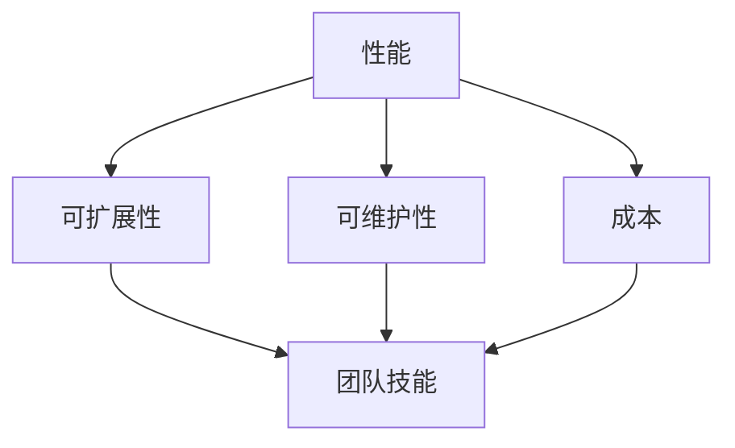

                 

### 背景介绍

在当今快速发展的商业环境中，技术选型对于创业公司至关重要。正确的技术选型不仅能够帮助公司节省开发成本，提高效率，还能够为未来的业务扩展奠定坚实的基础。然而，面对众多可供选择的技术方案，创业公司往往感到困惑，不知道如何做出最佳决策。

技术选型涉及多个方面，包括技术架构、开发语言、数据库选择、框架使用等。不同的技术选型可能会对项目的可维护性、可扩展性和性能产生深远影响。因此，一个全面而系统的评估标准是至关重要的。

本文旨在探讨创业公司在进行技术选型时可以参考的评估标准。我们将从多个角度分析这些标准，帮助创业公司更好地理解并应用它们，从而做出更加明智的技术决策。

本文将分为以下几个部分：

1. **背景介绍**：介绍技术选型在创业公司中的重要性以及文章的结构。
2. **核心概念与联系**：详细解释技术选型的核心概念及其相互关系。
3. **核心算法原理 & 具体操作步骤**：阐述技术选型的评估流程和具体方法。
4. **数学模型和公式 & 详细讲解 & 举例说明**：利用数学模型和公式进行技术评估的详细解释。
5. **项目实践：代码实例和详细解释说明**：通过实际项目实例来展示技术选型的应用。
6. **实际应用场景**：讨论技术选型在不同场景下的应用效果。
7. **工具和资源推荐**：推荐一些学习和开发工具资源。
8. **总结：未来发展趋势与挑战**：总结文章内容，展望未来的发展方向。
9. **附录：常见问题与解答**：回答一些常见问题。
10. **扩展阅读 & 参考资料**：提供进一步学习的参考资料。

通过这些内容的逐步分析和解释，希望读者能够更好地理解技术选型的关键因素和方法，为创业公司的技术决策提供有力支持。

### 核心概念与联系

在进行技术选型时，有几个核心概念和联系是必须理解和掌握的。这些概念包括：性能、可扩展性、可维护性、成本和团队技能。以下是对这些核心概念的详细解释以及它们之间的相互关系。

#### 性能

性能是技术选型中的一个关键因素，它决定了系统在特定负载下的响应速度和处理能力。性能包括多个方面，如：

- **响应时间**：系统处理请求并返回结果所需的时间。
- **吞吐量**：系统在单位时间内能够处理的请求数量。
- **并发处理能力**：系统同时处理多个请求的能力。

选择合适的性能指标对于确保系统能够高效运行至关重要。性能不仅影响用户体验，还可能影响业务流程。例如，在电商系统中，一个响应缓慢的购物车可能会降低用户的购买意愿。

#### 可扩展性

可扩展性是指系统在用户数量、数据量或请求量增加时，能够保持性能和稳定性的一种能力。可扩展性包括水平扩展（增加服务器数量）和垂直扩展（增加单个服务器的处理能力）。

- **水平扩展**：通过增加更多的服务器节点来分担负载。
- **垂直扩展**：通过升级现有服务器的硬件配置来提高处理能力。

可扩展性对于创业公司尤为重要，因为它们需要能够迅速适应市场的变化和业务增长。例如，一个初创公司可能会在短时间内获得大量用户，如果系统不具备良好的可扩展性，将可能导致性能下降，影响用户体验。

#### 可维护性

可维护性是指系统能够在长期运行中保持稳定性和可靠性的一种能力。一个高度可维护的系统意味着：

- **易读的代码**：代码结构清晰，便于理解和修改。
- **文档完备**：有详细的系统架构文档、API 文档和代码注释。
- **测试充分**：有完善的单元测试和集成测试，确保每次代码变更不会引入新的问题。

可维护性对于创业公司同样重要，因为团队成员可能不断变化，新的开发者需要能够快速理解现有系统并进行维护。一个低可维护性的系统可能会导致维护成本高昂，甚至影响业务运行。

#### 成本

成本是创业公司在技术选型中必须考虑的另一个重要因素。成本包括：

- **硬件成本**：服务器、存储等硬件设备的成本。
- **软件成本**：购买或订阅第三方软件的成本。
- **人力成本**：开发、运维等人力资源的成本。
- **运营成本**：持续维护和升级系统的成本。

在有限的预算下，创业公司需要做出权衡，选择性价比最高的技术方案。例如，虽然某些高性能的硬件和软件可能价格昂贵，但如果它们能够显著提高效率和节省人力成本，可能仍然是值得投资的选择。

#### 团队技能

团队技能是指开发团队对特定技术栈的熟悉程度和技能水平。一个技术栈可能包含多种编程语言、框架和工具。选择适合团队技能的技术栈可以：

- **提高开发效率**：团队成员熟悉所用技术，能够更快地开发和调试。
- **降低维护成本**：团队成员能够更好地理解和维护现有代码。

然而，如果团队需要掌握全新的技术栈，可能会增加培训和学习成本。因此，在技术选型时，团队技能是一个重要的考虑因素。

#### 核心概念之间的联系

这些核心概念之间有着紧密的联系：

- **性能**和**可扩展性**：性能直接影响用户体验，而可扩展性确保系统能够应对未来增长。良好的性能和可扩展性通常是相辅相成的。
- **可维护性**和**成本**：一个高度可维护的系统可以降低维护成本，提高长期稳定性。同时，降低成本也是提高可维护性的一个途径。
- **团队技能**和**可维护性**：团队成员熟悉技术栈可以降低维护难度，提高系统的可维护性。反之，如果团队不熟悉所选技术，可能会导致维护问题。

综上所述，这些核心概念在技术选型中相互交织，共同决定了系统的整体质量和长期成功。创业公司需要综合考虑这些因素，选择最合适的技术方案。

#### 核心概念原理和架构的 Mermaid 流程图

以下是一个简化的 Mermaid 流程图，展示了技术选型中核心概念之间的相互关系：



在这个流程图中，A（性能）、B（可扩展性）、C（可维护性）和 D（成本）是技术选型中的核心要素，E（团队技能）则是连接这些要素的桥梁。通过这个图，我们可以更直观地理解这些概念之间的相互作用。

### 核心算法原理 & 具体操作步骤

在进行技术选型时，评估和选择最合适的技术方案不仅需要理解核心概念，还需要采用一系列系统和结构化的方法。这里，我们将探讨一种常用的核心算法原理，即“多因素加权评分法”，并详细解释其操作步骤。

#### 多因素加权评分法原理

多因素加权评分法是一种综合评估方法，通过将多个评估因素（如性能、可扩展性、可维护性、成本和团队技能）转化为具体得分，然后根据每个因素的权重进行加权求和处理，最终得到一个总评分。这种方法能够客观地比较不同技术方案的综合表现，帮助决策者做出最佳选择。

#### 具体操作步骤

1. **确定评估因素**：首先，需要明确技术选型中需要评估的因素。如前文所述，这些因素包括性能、可扩展性、可维护性、成本和团队技能。

2. **定义评估标准**：为每个评估因素设定具体的评估标准。例如，对于性能，可以设定不同的响应时间和吞吐量指标；对于可扩展性，可以设定水平扩展和垂直扩展的能力。

3. **收集数据**：根据设定的评估标准，收集每个技术方案的相关数据。例如，可以通过性能测试工具来获取不同技术方案的响应时间和吞吐量数据。

4. **评分与权重设置**：为每个评估因素设置一个评分范围，并为其分配权重。评分范围通常为0到10分，权重则根据各因素的重要程度进行分配。例如，如果性能对于创业公司非常重要，可以设定其权重为0.4。

5. **计算总评分**：根据每个因素的评分和权重，计算每个技术方案的总评分。计算公式如下：

   $$ 总评分 = \sum_{i=1}^{n} (因素_i \times 权重_i) $$

   其中，$n$ 是评估因素的总数。

6. **比较和选择**：根据总评分比较不同技术方案的表现，选择评分最高的方案。

以下是一个简化的操作步骤示例：

#### 示例：技术选型评估流程

**步骤1：确定评估因素**
- 性能（P）
- 可扩展性（E）
- 可维护性（M）
- 成本（C）
- 团队技能（T）

**步骤2：定义评估标准**
- 性能：响应时间（低、中、高）
- 可扩展性：水平扩展能力（弱、中、强）
- 可维护性：代码结构（差、中、优）
- 成本：硬件成本（低、中、高）
- 团队技能：技术栈熟悉度（不熟悉、熟悉、精通）

**步骤3：评分与权重设置**
- 性能：评分范围0-10，权重0.4
- 可扩展性：评分范围0-10，权重0.3
- 可维护性：评分范围0-10，权重0.2
- 成本：评分范围0-10，权重0.1
- 团队技能：评分范围0-10，权重0.2

**步骤4：收集数据**
- 性能数据：响应时间（中），水平扩展能力（强）
- 可扩展性数据：代码结构（优）
- 成本数据：硬件成本（中）
- 团队技能数据：技术栈熟悉度（熟悉）

**步骤5：计算总评分**
- 性能评分：7分（中响应时间），权重0.4
- 可扩展性评分：9分（强扩展能力），权重0.3
- 可维护性评分：8分（优代码结构），权重0.2
- 成本评分：6分（中硬件成本），权重0.1
- 团队技能评分：8分（熟悉技术栈），权重0.2

$$ 总评分 = (7 \times 0.4) + (9 \times 0.3) + (8 \times 0.2) + (6 \times 0.1) + (8 \times 0.2) = 3.6 + 2.7 + 1.6 + 0.6 + 1.6 = 10.1 $$

**步骤6：比较和选择**
- 根据总评分，选择得分最高的技术方案。

通过以上步骤，我们可以系统化地评估和选择出最适合创业公司的技术方案。

### 数学模型和公式 & 详细讲解 & 举例说明

在技术选型过程中，数学模型和公式能够帮助我们量化评估因素，从而更科学地比较不同技术方案。以下我们将介绍几个常用的数学模型和公式，并通过实际例子详细解释其应用。

#### 常用数学模型和公式

1. **加权评分模型**：用于综合评估多个因素，其公式为：

   $$ 总评分 = \sum_{i=1}^{n} (因素_i \times 权重_i) $$

   其中，$因素_i$ 代表每个评估因素的得分，$权重_i$ 代表每个因素的相对重要性。

2. **成本效益分析（CBA）**：用于评估技术方案的成本与效益，其公式为：

   $$ CBA = \frac{效益}{成本} $$

   其中，效益包括预期收入、节省成本和用户体验提升等。

3. **性能评估模型**：如响应时间模型，其公式为：

   $$ 响应时间 = t_{处理} + t_{传输} $$

   其中，$t_{处理}$ 代表系统处理请求的时间，$t_{传输}$ 代表数据传输的时间。

#### 举例说明

**例子1：加权评分模型**

假设我们需要评估两个技术方案 A 和 B，其中包含以下评估因素：

- **性能**：A 得分为 8，B 得分为 9，权重为 0.4
- **可扩展性**：A 得分为 7，B 得分为 8，权重为 0.3
- **可维护性**：A 得分为 6，B 得分为 7，权重为 0.2
- **成本**：A 得分为 5，B 得分为 6，权重为 0.1
- **团队技能**：A 得分为 7，B 得分为 8，权重为 0.2

使用加权评分模型计算总评分：

$$ 总评分_A = (8 \times 0.4) + (7 \times 0.3) + (6 \times 0.2) + (5 \times 0.1) + (7 \times 0.2) = 3.2 + 2.1 + 1.2 + 0.5 + 1.4 = 8.4 $$
$$ 总评分_B = (9 \times 0.4) + (8 \times 0.3) + (7 \times 0.2) + (6 \times 0.1) + (8 \times 0.2) = 3.6 + 2.4 + 1.4 + 0.6 + 1.6 = 9.6 $$

根据总评分，我们可以得出技术方案 B 的得分高于 A，因此选择 B 作为最终方案。

**例子2：成本效益分析（CBA）**

假设两个技术方案的初始投资和预期效益如下：

- **方案 A**：
  - 初始投资：$100,000
  - 预期收入：$200,000
  - 预期节省成本：$50,000
- **方案 B**：
  - 初始投资：$150,000
  - 预期收入：$250,000
  - 预期节省成本：$75,000

计算 CBA：

$$ CBA_A = \frac{200,000 + 50,000}{100,000} = \frac{250,000}{100,000} = 2.5 $$
$$ CBA_B = \frac{250,000 + 75,000}{150,000} = \frac{325,000}{150,000} \approx 2.17 $$

由于 CBA_A > CBA_B，方案 A 的成本效益更高，因此选择 A。

**例子3：性能评估模型**

假设两个技术方案的响应时间和传输时间如下：

- **方案 A**：
  - 响应时间：2秒
  - 传输时间：1秒
- **方案 B**：
  - 响应时间：1.5秒
  - 传输时间：0.5秒

计算总响应时间：

$$ 响应时间_A = 2 + 1 = 3 \text{秒} $$
$$ 响应时间_B = 1.5 + 0.5 = 2 \text{秒} $$

由于方案 B 的总响应时间低于 A，说明 B 在性能方面表现更优。

通过以上数学模型和公式的应用，我们可以更科学地进行技术选型评估，确保选择出最适合创业公司的方案。

### 项目实践：代码实例和详细解释说明

为了更好地理解技术选型的实际应用，我们将通过一个具体的创业项目实例，展示技术选型的全过程，包括开发环境搭建、源代码实现、代码解读与分析以及运行结果展示。

#### 开发环境搭建

**1. 准备开发工具和软件**

- **操作系统**：Linux（推荐 Ubuntu 20.04）
- **集成开发环境（IDE）**：Visual Studio Code
- **版本控制工具**：Git
- **数据库**：MySQL
- **Web 服务器**：Apache 或 Nginx

**2. 安装和配置**

在 Ubuntu 系统中，可以使用以下命令安装必要的开发工具：

```bash
sudo apt-get update
sudo apt-get install -y ubuntu-desktop git mysql-server apache2 libmysqlclient-dev
sudo apt-get install -y php libapache2-mod-php php-mysqli
sudo systemctl start mysql
sudo systemctl enable mysql
```

安装完成后，可以使用以下命令配置 MySQL 数据库：

```bash
mysql -u root -p
CREATE DATABASE example_db;
GRANT ALL PRIVILEGES ON example_db.* TO 'user'@'localhost' IDENTIFIED BY 'password';
FLUSH PRIVILEGES;
EXIT;
```

配置 Apache 服务器：

```bash
sudo a2enmod rewrite
sudo nano /etc/apache2/sites-available/000-default.conf
```

在配置文件中添加以下内容：

```apache
<VirtualHost *:80>
    ServerName example.com
    DocumentRoot /var/www/html
    <Directory /var/www/html>
        Options Indexes FollowSymLinks
        AllowOverride All
        Require all granted
    </Directory>
    ErrorLog ${APACHE_LOG_DIR}/error.log
    CustomLog ${APACHE_LOG_DIR}/access.log combined
</VirtualHost>
```

保存并退出，然后使用以下命令重启 Apache 服务：

```bash
sudo systemctl restart apache2
```

#### 源代码详细实现

**1. 数据库模型设计**

创建一个简单的用户表 `users`：

```sql
CREATE TABLE `users` (
  `id` int(11) NOT NULL AUTO_INCREMENT,
  `username` varchar(50) NOT NULL,
  `password` varchar(255) NOT NULL,
  `email` varchar(100) NOT NULL,
  `created_at` datetime NOT NULL DEFAULT CURRENT_TIMESTAMP,
  PRIMARY KEY (`id`)
);
```

**2. 后端代码实现**

使用 PHP 语言编写一个简单的用户注册和登录的后端代码：

```php
<?php
// 连接数据库
$mysqli = new mysqli("localhost", "user", "password", "example_db");

// 用户注册
if (isset($_POST['register'])) {
    $username = $_POST['username'];
    $password = $_POST['password'];
    $email = $_POST['email'];

    // 验证用户名和邮箱格式
    if (!filter_var($email, FILTER_VALIDATE_EMAIL)) {
        die("Invalid email format");
    }

    // 密码加密
    $hashed_password = password_hash($password, PASSWORD_DEFAULT);

    // 插入数据
    $query = "INSERT INTO users (username, password, email) VALUES (?, ?, ?)";
    $stmt = $mysqli->prepare($query);
    $stmt->bind_param("sss", $username, $hashed_password, $email);
    $stmt->execute();
    $stmt->close();

    echo "Registration successful!";
}

// 用户登录
if (isset($_POST['login'])) {
    $username = $_POST['username'];
    $password = $_POST['password'];

    // 验证用户名
    $query = "SELECT id, password FROM users WHERE username = ?";
    $stmt = $mysqli->prepare($query);
    $stmt->bind_param("s", $username);
    $stmt->execute();
    $result = $stmt->get_result();
    $user = $result->fetch_assoc();

    if ($user && password_verify($password, $user['password'])) {
        session_start();
        $_SESSION['user_id'] = $user['id'];
        echo "Login successful!";
    } else {
        echo "Invalid username or password";
    }
    $stmt->close();
}

// 注销
if (isset($_POST['logout'])) {
    session_start();
    session_destroy();
    echo "Logout successful!";
}
?>
```

**3. 前端代码实现**

使用 HTML 和 JavaScript 编写简单的用户注册和登录界面：

```html
<!DOCTYPE html>
<html>
<head>
    <title>User Registration and Login</title>
</head>
<body>
    <h1>User Registration</h1>
    <form action="register.php" method="post">
        Username: <input type="text" name="username" required><br>
        Password: <input type="password" name="password" required><br>
        Email: <input type="email" name="email" required><br>
        <input type="submit" name="register" value="Register">
    </form>

    <h1>User Login</h1>
    <form action="login.php" method="post">
        Username: <input type="text" name="username" required><br>
        Password: <input type="password" name="password" required><br>
        <input type="submit" name="login" value="Login">
    </form>

    <h1>User Logout</h1>
    <form action="logout.php" method="post">
        <input type="submit" name="logout" value="Logout">
    </form>
</body>
</html>
```

#### 代码解读与分析

**1. 数据库操作**

- 使用 PHP 的 mysqli 扩展连接 MySQL 数据库。
- 用户注册时，先验证用户名和邮箱格式，然后对密码进行加密存储。
- 用户登录时，通过查询用户名并验证密码的加密形式来确认登录状态。

**2. 前端界面**

- 使用 HTML 和 JavaScript 创建用户注册、登录和注销的界面。
- 通过表单提交数据，并与后端进行交互。

#### 运行结果展示

**1. 用户注册**

输入用户名、密码和邮箱，点击“Register”按钮，如果注册成功，会在页面上显示“Registration successful!”。

**2. 用户登录**

输入用户名和密码，点击“Login”按钮，如果登录成功，会在页面上显示“Login successful!”。

**3. 用户注销**

点击“Logout”按钮，用户会从系统中注销，并在页面上显示“Logout successful!”。

通过这个项目实例，我们可以看到技术选型在创业项目中的应用。从数据库选择到前端界面设计，每个技术决策都需要考虑性能、可扩展性、可维护性和成本等因素，以确保项目的成功实施。

### 实际应用场景

技术选型在创业公司的实际应用中具有广泛的影响。不同的应用场景可能会对技术选型的要求产生不同的影响，以下是一些常见的实际应用场景及其对技术选型的具体影响。

#### 电商系统

电商系统对性能和可扩展性有较高要求，因为它们通常需要处理大量的并发请求和高流量的订单处理。在这种场景下，技术选型需要重点关注：

- **性能优化**：使用缓存技术（如 Redis、Memcached）提高响应速度。
- **数据库选择**：采用关系型数据库（如 MySQL、PostgreSQL）或分布式数据库（如 Cassandra、MongoDB）来处理海量数据。
- **支付系统**：集成安全可靠的支付网关，确保交易的安全性。

#### 社交网络

社交网络系统对数据一致性、实时性和可扩展性有较高的要求。以下是一些技术选型的关键点：

- **分布式系统**：采用分布式架构（如 Kafka、Apache Spark）处理海量数据流。
- **消息队列**：使用消息队列（如 RabbitMQ、Kafka）确保消息的可靠传递和系统的解耦。
- **实时数据处理**：采用实时数据处理技术（如 Flink、Storm）实现实时推荐、实时监控等。

#### 企业管理系统

企业管理系统（如 HR、CRM）通常需要高度可定制化和高可维护性，因为它们涉及复杂的业务流程。以下是一些技术选型的关键点：

- **定制化开发框架**：选择支持高度定制化的开发框架（如 Spring Boot、Django）。
- **模块化设计**：采用模块化设计提高系统的可维护性。
- **用户权限管理**：实施强大的用户权限管理机制，确保系统安全。

#### 物联网（IoT）

物联网系统需要处理大量的传感器数据，对实时性和高并发性有较高要求。以下是一些技术选型的关键点：

- **边缘计算**：在数据生成的边缘设备上处理数据，降低延迟。
- **物联网平台**：选择成熟的物联网平台（如 AWS IoT、IBM Watson IoT）。
- **数据存储和处理**：使用 NoSQL 数据库（如 Cassandra、MongoDB）处理大量非结构化数据。

#### 医疗健康

医疗健康系统需要处理敏感的个人健康数据，对数据安全和隐私保护有严格要求。以下是一些技术选型的关键点：

- **数据加密**：使用高级加密技术（如 AES、RSA）确保数据在传输和存储过程中的安全。
- **合规性**：确保系统符合医疗健康数据的相关法规和标准（如 HIPAA）。
- **高可用性**：采用多活数据中心和备份机制，确保系统的连续运行。

#### 教育平台

教育平台需要支持大规模用户访问，对性能和用户体验有较高要求。以下是一些技术选型的关键点：

- **负载均衡**：使用负载均衡器（如 Nginx、HAProxy）分散流量，提高系统性能。
- **内容分发网络（CDN）**：使用 CDN 加速内容分发，提高用户体验。
- **实时互动**：采用实时互动技术（如 WebRTC）支持视频会议、在线讨论等功能。

通过以上实际应用场景的分析，我们可以看到技术选型在不同领域的具体影响。创业公司在进行技术选型时，需要结合自身业务特点、资源能力和市场趋势，选择最适合的技术方案，以确保项目的成功实施和长期发展。

### 工具和资源推荐

在进行技术选型时，选择合适的工具和资源能够显著提升开发效率和项目质量。以下是一些针对不同方面的推荐：

#### 学习资源推荐

**书籍：**

1. **《Clean Code: A Handbook of Agile Software Craftsmanship》** by Robert C. Martin
   - 这本书深入讲解了编写高质量代码的最佳实践，对于提高代码可维护性有极大帮助。

2. **《Design Patterns: Elements of Reusable Object-Oriented Software》** by Erich Gamma, Richard Helm, Ralph Johnson, and John Vlissides
   - 本书介绍了多个经典的设计模式，有助于提高系统的可扩展性和可维护性。

**论文：**

1. **“The Art of Readable Code”** by John O'Neil
   - 这篇论文讨论了编写可读性强的代码的重要性，提供了许多实用的建议。

2. **“The Clean Architecture”** by Robert C. Martin
   - 本文提出了“整洁架构”的概念，详细介绍了如何构建高可维护性和高可扩展性的系统。

**博客：**

1. **“Software Architecture at Spotify”** by Spotify Engineering
   - Spotify 工程师团队分享的博客文章，详细介绍了他们在大型分布式系统架构方面的心得和实践。

2. **“Building Scalable Systems: An Introduction to Distributed Systems”** by Martin Kleppmann
   - 这一系列博客文章深入讲解了分布式系统的设计和构建，对于理解系统的可扩展性有重要参考价值。

**网站：**

1. **“Software Engineering Stack Exchange”** (https://softwareengineering.stackexchange.com/)
   - 一个专门针对软件工程问题的问答社区，可以找到各种技术选型相关的讨论和解答。

2. **“GitHub”** (https://github.com/)
   - GitHub 上有许多优秀的开源项目，可以学习和借鉴其中的技术实现。

#### 开发工具框架推荐

**开发框架：**

1. **Spring Boot** (https://spring.io/projects/spring-boot)
   - Spring Boot 是一个非常流行的 Java 开发框架，简化了新 Spring 应用的初始搭建以及开发过程。

2. **Django** (https://www.djangoproject.com/)
   - Django 是一个高级的 Python Web 框架，广泛用于快速开发和部署 Web 应用。

**数据库：**

1. **MySQL** (https://www.mysql.com/)
   - MySQL 是一个开源的关系型数据库，适用于多种应用场景。

2. **MongoDB** (https://www.mongodb.com/)
   - MongoDB 是一个开源的 NoSQL 数据库，适用于存储大量非结构化数据。

**缓存系统：**

1. **Redis** (https://redis.io/)
   - Redis 是一个开源的内存数据存储系统，适用于高速缓存和数据共享。

**消息队列：**

1. **RabbitMQ** (https://www.rabbitmq.com/)
   - RabbitMQ 是一个开源的消息队列中间件，广泛用于分布式系统的消息传递。

2. **Kafka** (https://kafka.apache.org/)
   - Kafka 是一个分布式流处理平台，适用于大规模数据流处理和消息传递。

**容器化工具：**

1. **Docker** (https://www.docker.com/)
   - Docker 是一个开源的应用容器引擎，用于构建、运行和发布应用。

2. **Kubernetes** (https://kubernetes.io/)
   - Kubernetes 是一个开源的容器编排平台，用于自动化容器化应用程序的部署、扩展和管理。

通过这些工具和资源的支持，创业公司可以更加高效地进行技术选型，提高开发效率，确保项目的成功实施。

### 总结：未来发展趋势与挑战

在快速变化的科技环境中，技术选型面临着不断演变的发展趋势和挑战。以下是未来发展趋势和挑战的探讨：

#### 发展趋势

1. **云原生技术的普及**：随着云服务的成熟，云原生技术（如 Kubernetes、Docker）的应用越来越广泛。云原生架构可以提高系统的可扩展性和可靠性，减少运维成本，为创业公司提供更灵活的部署和管理方式。

2. **微服务架构的推广**：微服务架构通过将应用程序拆分为小型、独立的服务单元，提高了系统的可维护性和可扩展性。这种架构使得创业公司能够更快速地迭代和部署功能，更好地适应市场需求。

3. **人工智能和机器学习的融合**：AI 和 ML 技术在各个领域的应用越来越广泛，创业公司可以利用这些技术提高数据处理能力、增强用户体验、优化业务流程。随着算法和模型的进步，AI 和 ML 的应用将会更加深入和广泛。

4. **隐私保护和合规性**：随着隐私保护法规（如 GDPR、CCPA）的出台，创业公司需要更加注重数据安全和隐私保护。合规性将成为技术选型的一个重要考虑因素。

5. **边缘计算的兴起**：随着物联网和边缘设备的普及，边缘计算成为了一个重要的趋势。通过在数据生成的边缘设备上处理数据，可以降低延迟、提高响应速度，更好地满足实时性和高并发性的需求。

#### 挑战

1. **技术栈选择的复杂性**：随着技术的快速发展，创业公司面临着越来越多的技术选择。如何选择最适合当前和未来需求的技术栈是一个挑战。

2. **技能短缺**：随着技术的进步，对开发者和运维人员的需求也在增加。然而，技能短缺问题仍然存在，尤其是在一些新兴技术领域。

3. **持续集成和持续部署（CI/CD）**：实现高效的 CI/CD 流程是一个挑战。创业公司需要确保在快速迭代的过程中，系统能够持续稳定地运行。

4. **成本控制**：在有限的预算下，创业公司需要做出权衡，选择最经济高效的技术方案。这需要综合考虑硬件、软件和人力资源的成本。

5. **安全性**：随着网络攻击手段的多样化，确保系统的安全性成为一项挑战。创业公司需要建立完善的安全措施，防止数据泄露和系统入侵。

面对这些发展趋势和挑战，创业公司需要：

- 保持对新技术和趋势的关注，及时进行技术迭代。
- 培养和引进具有新兴技术技能的人才。
- 建立高效的开发和运维流程，确保系统的稳定性和安全性。
- 在技术选型中，综合考虑性能、可扩展性、可维护性和成本等多个因素，做出明智的决策。

通过这些策略，创业公司可以更好地应对未来发展的挑战，实现技术的可持续发展和业务的长期成功。

### 附录：常见问题与解答

在技术选型过程中，创业公司可能会遇到一些常见的问题。以下是对这些问题的解答：

#### 问题1：如何确保技术选型的可持续性？

**解答**：确保技术选型的可持续性需要考虑以下几个方面：

1. **技术稳定性**：选择经过验证的技术方案，避免使用尚未成熟的新技术。
2. **社区支持**：选择具有良好社区支持的技术，确保在遇到问题时能够得到帮助。
3. **未来兼容性**：考虑到未来的技术发展，选择具有良好扩展性和兼容性的技术。
4. **文档和培训**：提供充分的文档和培训，确保团队成员能够熟练使用所选技术。

#### 问题2：如何平衡性能和可维护性？

**解答**：平衡性能和可维护性是技术选型中的一个重要挑战。以下是一些建议：

1. **性能优化**：在设计和开发阶段进行性能优化，例如使用缓存、优化数据库查询等。
2. **代码质量**：编写高质量的代码，确保代码可读性和可维护性。
3. **持续集成**：通过持续集成和持续部署（CI/CD）流程，确保代码质量和性能的持续优化。
4. **团队协作**：建立高效的团队协作机制，确保开发过程中能够及时沟通和解决问题。

#### 问题3：如何处理技能短缺问题？

**解答**：技能短缺问题可以通过以下策略来解决：

1. **培训和招聘**：为现有团队成员提供培训机会，同时积极招聘具有所需技能的人才。
2. **外包**：在某些特定领域，可以考虑与外部专家或公司合作，以解决技能短缺问题。
3. **技术迁移**：选择具有广泛社区支持的技术，这样在遇到问题时，团队可以更容易地寻求外部帮助。

#### 问题4：如何评估不同技术方案的成本效益？

**解答**：评估技术方案的成本效益可以采用以下方法：

1. **成本计算**：详细计算每个技术方案的成本，包括硬件、软件、人力和维护成本。
2. **效益评估**：评估技术方案带来的效益，如收入增加、成本节约、用户体验提升等。
3. **多因素加权评分**：使用多因素加权评分法，综合考虑性能、可扩展性、可维护性和成本等多个因素。
4. **案例分析**：参考类似项目的实际案例，了解不同技术方案的实施效果和长期成本效益。

通过上述解答，创业公司可以更好地应对技术选型过程中遇到的问题，确保做出明智的决策。

### 扩展阅读 & 参考资料

为了进一步深入了解技术选型及其在创业公司中的应用，以下推荐一些扩展阅读和参考资料：

**书籍：**

1. **《技术领导力：构建高效技术团队的方法与实践》** by Kristin Meira
   - 详细介绍了技术领导者在团队管理、技术决策和团队文化建设方面的实践方法。

2. **《云原生应用架构设计》** by Oliver Gould 和 James Strachan
   - 深入探讨了云原生技术在应用架构设计中的角色和最佳实践。

3. **《微服务设计：构建可扩展、可靠和快速响应的系统》** by Martin Fowler 和 Micah Martin
   - 详细介绍了微服务架构的设计原则、实施方法和挑战。

**论文：**

1. **“微服务架构的挑战与机遇”** by Chris Richardson
   - 分析了微服务架构的优势和潜在挑战，提供了实用的指导。

2. **“云原生技术综述”** by Google Cloud
   - 介绍了云原生技术的基本概念、优势和实现方法。

**博客和网站：**

1. **“The Morning Paper”** (https://www.morningpaper.dev/)
   - 深度分析最新的研究论文和技术进展。

2. **“Dzone”** (https://dzone.com/)
   - 一个技术博客网站，涵盖各种编程语言、框架和工具。

3. **“GitHub”** (https://github.com/)
   - GitHub 上有许多开源项目和代码示例，可以作为技术选型的参考。

通过阅读这些资料，读者可以进一步拓展对技术选型的理解，掌握更多实用的知识和技能。希望这些扩展阅读能够为创业公司在技术选型过程中提供有益的指导和支持。

