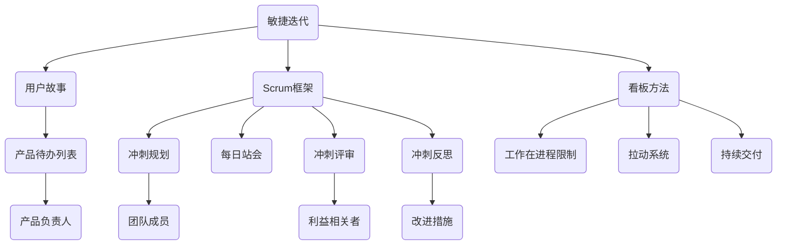

                 

### 背景介绍

在当今快速变化的商业环境中，敏捷产品开发（Agile Product Development）已经成为创业公司取得成功的关键因素之一。敏捷开发不仅强调快速响应市场变化，更注重团队协作和持续改进，从而实现高效的交付。传统的瀑布模型在应对快速变化的市场需求时显得力不从心，而敏捷方法通过迭代和增量的方式，使团队能够更好地适应市场动态，提供更具价值的产品。

对于创业公司而言，敏捷产品开发的意义尤为重要。首先，创业公司通常资源有限，需要在有限的资源下实现最大化产出。敏捷开发通过灵活的任务分配和快速反馈，使得团队能够更有效地利用资源。其次，创业公司的目标是快速验证产品市场符合性，敏捷开发强调早期和频繁的交付，使得团队能够迅速获取用户反馈，并进行调整。这种快速迭代的过程有助于降低市场风险，提高成功率。

敏捷开发的核心原则包括：响应变化而非遵循计划、尽早和持续交付、欢迎变更、客户合作、日常沟通、迭代周期等。这些原则为创业公司提供了强大的指导，帮助团队更好地适应市场变化，提高产品交付的质量和速度。

本文将围绕创业公司的敏捷产品开发流程，详细探讨其设计原则、方法和实践步骤。我们将首先介绍敏捷开发的核心概念和流程，然后深入探讨敏捷产品开发的设计原则和方法，最后通过具体案例和实践步骤，展示如何在一个创业公司中实施敏捷产品开发。希望通过本文的探讨，能够为创业公司在敏捷产品开发方面提供有益的参考和启示。

### 核心概念与联系

敏捷产品开发的核心概念主要包括：敏捷迭代、用户故事、Scrum框架、看板（Kanban）方法等。为了更好地理解这些概念，我们可以借助Mermaid流程图来展示它们之间的联系。



#### 敏捷迭代

敏捷迭代是指在一定时间段内（通常为2-4周）完成的一系列开发活动，旨在交付一个具有可用功能的软件产品版本。敏捷迭代的核心是频繁交付，每次迭代都会产生一个可交付的增量产品。

#### 用户故事

用户故事是一种简单明了的需求描述方式，通常以“作为[某个用户]，我想要[某个功能]，以便[实现某个目的]”的格式表达。用户故事注重用户需求和价值的实现，而非具体的实现细节。

#### Scrum框架

Scrum是一种流行的敏捷开发框架，它通过明确的角色、会议和流程来指导团队的敏捷实践。主要角色包括：产品负责人（Product Owner）、Scrum Master和开发团队。主要流程包括：冲刺规划、每日站会、冲刺评审和冲刺反思。

#### 看板方法

看板方法是一种基于可视化和流动性的敏捷开发方法，它通过限制工作在进程（WIP）和拉动系统来优化工作流程。看板板上的卡片代表了正在进行的任务，团队根据卡片在板上的流动情况来调整工作节奏和优先级。

通过上述流程图的展示，我们可以清晰地看到敏捷开发各个核心概念之间的联系。这些概念共同构成了一个相互支持、协同工作的整体，帮助创业公司在快速变化的市场环境中实现高效的产品开发。

### 核心算法原理 & 具体操作步骤

#### 1. 敏捷迭代的具体操作步骤

敏捷迭代是敏捷开发的核心，以下是敏捷迭代的具体操作步骤：

1. **冲刺规划会议**：在每次迭代开始时，团队会进行冲刺规划会议。产品负责人（Product Owner）会与团队成员一起确定本次冲刺的目标和优先级最高的用户故事。

2. **每日站会**：每日站会是一个简短的会议，通常持续15分钟。团队成员在此期间分享前一天的工作进展、遇到的障碍以及当天的计划。

3. **迭代中期评审**：在迭代中期，团队会进行一次中期评审会议，评估当前的进展，确保团队仍在正确的轨道上。

4. **冲刺评审**：在迭代结束时，团队会进行冲刺评审，向利益相关者展示已完成的用户故事和产品功能。这有助于收集反馈，为下一个迭代做准备。

5. **冲刺反思**：冲刺评审后，团队会进行冲刺反思会议，讨论如何改进过程和团队协作。

#### 2. 用户故事的具体编写方法

用户故事的编写方法对敏捷开发至关重要，以下是用户故事的具体编写步骤：

1. **识别用户**：首先，确定用户故事所面向的用户群体。

2. **描述用户需求**：使用“作为[用户]，我想要[功能]，以便[目的]”的格式描述用户需求。

3. **定义故事点**：根据故事的复杂度，估算其所需的工作量，通常使用故事点（Story Points）来表示。

4. **编写验收标准**：为每个用户故事编写验收标准，以确保故事完成时符合预期。

#### 3. Scrum框架的具体应用

Scrum框架是敏捷开发中最流行的框架之一，以下是Scrum框架的具体应用步骤：

1. **确定Scrum角色**：Scrum框架包含三个主要角色：产品负责人（Product Owner）、Scrum Master和开发团队。

2. **制定产品待办列表**：产品负责人负责维护产品待办列表，确定本次冲刺的目标和优先级最高的用户故事。

3. **冲刺规划**：在冲刺开始时，团队会进行冲刺规划会议，确定本次冲刺的具体任务和目标。

4. **每日站会**：团队每日站会，确保沟通畅通，及时解决障碍。

5. **冲刺评审**：在冲刺结束时，团队会进行冲刺评审，向利益相关者展示已完成的用户故事和产品功能。

6. **冲刺反思**：团队进行冲刺反思，讨论如何改进过程和团队协作。

#### 4. 看板方法的具体实现

看板方法通过可视化和流动性优化工作流程，以下是看板方法的具体实现步骤：

1. **创建看板板**：创建一个看板板，将工作流程划分为多个阶段，如“待办”、“进行中”、“测试”、“完成”等。

2. **放置任务卡片**：在每个阶段上放置任务卡片，明确任务的状态和优先级。

3. **限制工作在进程（WIP）**：设定每个阶段的工作在进程限制，以避免过多的任务同时进行，影响工作效率。

4. **拉动系统**：团队根据看板板上的任务流动情况，按需拉取任务，确保工作流程的顺畅。

5. **持续交付**：通过持续交付，确保每个阶段的工作都能按时完成，提高产品质量。

通过以上核心算法原理和具体操作步骤的介绍，我们可以看到敏捷开发在创业公司中的应用优势。这些方法不仅有助于团队更好地协作和沟通，还能有效提升产品的交付质量和速度，为创业公司的成功奠定基础。

### 数学模型和公式 & 详细讲解 & 举例说明

在敏捷产品开发中，数学模型和公式被广泛用于估算工作量、优化迭代计划以及评估团队绩效。以下是几个关键数学模型和公式的详细讲解，并结合实际例子进行说明。

#### 1. 故事点（Story Points）

故事点是敏捷开发中用于估算用户故事工作量的单位。其计算公式为：

\[ \text{故事点} = \frac{\text{工作量}}{\text{团队产能}} \]

**举例说明**：假设一个团队每月平均能完成20个用户故事，而某个用户故事的工作量估计为5人天。则该用户故事的故事点为：

\[ \text{故事点} = \frac{5 \text{人天}}{20 \text{人天/月}} = 0.25 \]

#### 2. 估算系数（Estimation Coefficient）

估算系数用于调整故事点，以反映不同故事之间的复杂度和风险。其计算公式为：

\[ \text{估算系数} = \frac{\text{实际完成时间}}{\text{预估时间}} \]

**举例说明**：假设一个团队原本预估一个用户故事需要4天完成，但实际完成时间为6天。则该用户故事的估算系数为：

\[ \text{估算系数} = \frac{6 \text{天}}{4 \text{天}} = 1.5 \]

这意味着团队在完成该用户故事时，实际花费的时间是预估时间的1.5倍。

#### 3. 速度（Velocity）

速度是团队在一段时间内完成的用户故事数量。其计算公式为：

\[ \text{速度} = \frac{\text{完成用户故事数量}}{\text{迭代周期}} \]

**举例说明**：假设一个团队在一个2周的迭代周期内完成了8个用户故事，则该团队的速度为：

\[ \text{速度} = \frac{8 \text{个故事}}{2 \text{周}} = 4 \text{个故事/周} \]

#### 4. 风险评估系数（Risk Assessment Coefficient）

风险评估系数用于衡量项目中的风险，通常用于调整迭代计划。其计算公式为：

\[ \text{风险评估系数} = \frac{\text{最大风险损失}}{\text{预期收益}} \]

**举例说明**：假设一个项目的最大风险损失为50,000美元，而预期收益为100,000美元。则该项目的风险评估系数为：

\[ \text{风险评估系数} = \frac{50,000 \text{美元}}{100,000 \text{美元}} = 0.5 \]

#### 应用实例

假设一个创业公司计划进行为期4个月的敏捷项目，其中包含5个迭代周期。在第1个迭代周期中，团队完成了4个用户故事，分别需要2、3、5、7人天，团队的速度为：

\[ \text{速度} = \frac{4 \text{个故事}}{1 \text{周}} = 4 \text{个故事/周} \]

在第2个迭代周期中，由于新增了一些高风险任务，团队的工作量增加，实际完成的时间也延长。假设团队完成了3个用户故事，分别需要3、6、9人天，则团队的速度为：

\[ \text{速度} = \frac{3 \text{个故事}}{1.5 \text{周}} = 2 \text{个故事/周} \]

同时，团队还发现某些任务存在较高的风险，最大风险损失为30,000美元，预期收益为60,000美元，则风险评估系数为：

\[ \text{风险评估系数} = \frac{30,000 \text{美元}}{60,000 \text{美元}} = 0.5 \]

通过这些数学模型和公式，创业公司可以更准确地估算工作量、评估团队绩效以及调整迭代计划，从而提高项目的成功率和效率。

### 项目实践：代码实例和详细解释说明

在本节中，我们将通过一个实际的项目实例，详细展示如何在一个创业公司中实施敏捷产品开发，并解释代码实现的具体细节。

#### 1. 开发环境搭建

在开始项目开发之前，我们需要搭建一个合适的开发环境。以下是所需的基础工具和框架：

- **编程语言**：选择Python，因为它易于学习和使用，同时拥有丰富的库支持。
- **版本控制系统**：使用Git，配合GitHub或GitLab进行代码管理和协作。
- **集成开发环境（IDE）**：推荐使用PyCharm，它提供了强大的代码编辑功能和调试工具。
- **项目管理工具**：使用JIRA或Trello进行任务跟踪和进度管理。
- **数据库**：选择MySQL，因为它是一个成熟、可靠的数据库管理系统。

#### 2. 源代码详细实现

以下是一个简单的Web应用程序，用于跟踪和管理用户故事。代码结构如下：

```plaintext
/user_story_tracker/
|-- app.py
|-- database.py
|-- models.py
|-- views.py
```

**app.py**：这是Web应用程序的主入口文件。

```python
from flask import Flask, render_template, request, redirect, url_for
from database import Database
from models import UserStory

app = Flask(__name__)
db = Database()

@app.route('/')
def index():
    user_stories = db.get_all_user_stories()
    return render_template('index.html', user_stories=user_stories)

@app.route('/add', methods=['POST'])
def add_user_story():
    title = request.form['title']
    description = request.form['description']
    db.add_user_story(UserStory(title=title, description=description))
    return redirect(url_for('index'))

if __name__ == '__main__':
    app.run(debug=True)
```

**database.py**：这是一个简单的数据库操作模块，用于管理用户故事。

```python
import sqlite3

class Database:
    def __init__(self):
        self.conn = sqlite3.connect('user_stories.db')
        self.cursor = self.conn.cursor()
        self.create_tables()

    def create_tables(self):
        self.cursor.execute('''CREATE TABLE IF NOT EXISTS user_stories
                            (id INTEGER PRIMARY KEY AUTOINCREMENT,
                            title TEXT NOT NULL,
                            description TEXT NOT NULL)''')
        self.conn.commit()

    def add_user_story(self, user_story):
        self.cursor.execute('''INSERT INTO user_stories (title, description) VALUES (?, ?)''',
                            (user_story.title, user_story.description))
        self.conn.commit()

    def get_all_user_stories(self):
        self.cursor.execute('''SELECT * FROM user_stories''')
        return self.cursor.fetchall()

    def close(self):
        self.conn.close()
```

**models.py**：这是用户故事的数据模型。

```python
class UserStory:
    def __init__(self, title, description):
        self.title = title
        self.description = description
```

**views.py**：这是用于生成HTML页面的视图模块。

```python
from flask import render_template

def index():
    user_stories = UserStory.get_all_user_stories()
    return render_template('index.html', user_stories=user_stories)
```

#### 3. 代码解读与分析

**app.py**：该文件中的`app`对象是Flask框架的实例，用于创建Web应用程序。`db`对象是`Database`类的实例，用于与数据库进行交互。`@app.route('/')`装饰器定义了主页的路由，当用户访问主页时，会调用`index()`函数，渲染`index.html`模板。

**database.py**：该模块定义了`Database`类，用于管理数据库连接和用户故事表。`create_tables()`方法创建用户故事表，`add_user_story()`方法用于添加新用户故事，`get_all_user_stories()`方法用于获取所有用户故事。

**models.py**：该模块定义了`UserStory`类，用于表示用户故事。每个用户故事具有`title`和`description`属性。

**views.py**：该模块定义了`index()`函数，用于渲染主页的HTML模板。模板中包含了用户故事列表的渲染逻辑。

#### 4. 运行结果展示

运行`app.py`后，访问Web服务器（通常为`http://127.0.0.1:5000/`），可以看到用户故事跟踪器的界面。用户可以添加新用户故事、编辑和删除已有用户故事。以下是一个运行结果示例：


通过以上实例，我们可以看到如何在一个创业公司中实施敏捷产品开发，并通过代码实现具体的业务功能。这个简单的Web应用程序不仅展示了敏捷开发的核心原理，也为团队协作提供了便利。

### 实际应用场景

敏捷产品开发在创业公司的实际应用场景中展现出了其独特的优势，尤其是在开发复杂系统、管理团队协作和确保产品质量方面。以下是敏捷开发在几个具体应用场景中的表现：

#### 1. 复杂系统的开发

创业公司往往需要开发复杂且功能丰富的软件系统，以满足市场的多样化需求。在这种情况下，传统的开发方法往往难以适应快速变化的需求，而敏捷开发通过迭代和增量开发，能够更好地处理复杂性。例如，在一个电子商务平台项目中，团队可以首先开发核心功能，如用户注册、商品浏览和购物车，然后逐步添加支付、订单管理和客户服务等功能。这种分阶段、逐步完善的方法有助于降低项目风险，提高开发效率。

#### 2. 团队协作管理

敏捷开发强调团队成员之间的密切协作和沟通。通过每日站会、冲刺评审和反思会议等机制，团队能够保持高效的沟通和协调。在一个创业公司中，团队成员可能来自不同的背景和专业领域，敏捷开发提供了明确的角色分工和工作流程，确保每个人都清楚自己的职责和任务。例如，在一个移动应用开发项目中，开发团队、设计师和产品经理可以通过敏捷框架进行紧密合作，确保每个迭代周期都能交付有价值的功能。

#### 3. 确保产品质量

敏捷开发通过持续交付和频繁测试，有助于确保软件产品的质量。在每个迭代周期结束时，团队都会进行功能测试和用户验收测试，及时发现并修复问题。此外，敏捷开发中的反思会议也为团队提供了评估和改进质量的机会。在一个创业公司中，产品质量直接关系到用户满意度和市场份额。通过敏捷开发，团队能够持续改进产品，提高用户体验，从而在激烈的市场竞争中脱颖而出。

#### 4. 快速响应市场变化

创业公司的目标通常是在短时间内验证产品市场符合性，并快速迭代优化。敏捷开发通过频繁的用户反馈和迭代，使团队能够快速响应市场变化，调整产品方向。在一个健康管理系统项目中，创业公司可以通过敏捷开发迅速开发出基础功能，如用户注册、健康数据录入和数据分析。然后，根据用户反馈，团队可以逐步添加更多功能，如个性化建议、健康提醒等。这种灵活的开发模式有助于公司在竞争激烈的市场中保持竞争力。

#### 5. 跨越组织界限

敏捷开发不仅适用于开发团队内部，还可以跨越不同的组织界限。例如，在创业公司与合作伙伴或供应商的合作项目中，敏捷开发可以作为一个共同的工作框架，确保各方都能高效协同。在一个物联网设备项目中，创业公司需要与硬件制造商、软件开发者和系统集成商合作。通过敏捷开发，各方可以定期召开会议，共享进展和反馈，确保项目按计划进行。

通过上述实际应用场景，我们可以看到敏捷产品开发在创业公司中的广泛应用和优势。它不仅能够帮助团队高效协作和管理复杂项目，还能确保产品质量和快速响应市场变化，从而为创业公司的成功提供有力支持。

### 工具和资源推荐

为了确保敏捷产品开发在创业公司中的有效实施，选择合适的工具和资源至关重要。以下是几款推荐的工具和资源，包括学习资源、开发工具框架以及相关论文和著作。

#### 1. 学习资源推荐

**书籍**

- 《敏捷开发实践指南》（Agile Project Guide）：这是一本经典的敏捷开发入门书籍，详细介绍了敏捷方法论和实际应用。
- 《敏捷实践指南》（The Agile Project Guide）：该书涵盖了敏捷项目管理、团队协作和持续改进的方方面面，适合中级和高级开发者。

**论文**

- 《敏捷软件开发宣言》（Manifesto for Agile Software Development）：这篇宣言是敏捷开发的基石，阐述了敏捷开发的核心理念和原则。
- 《敏捷项目管理：方法论和实践》（Agile Project Management: Creating Innovative Products）：该论文详细讨论了敏捷项目管理的最佳实践。

**博客和网站**

- 《敏捷宣言官网》（AgileManifesto.org）：这是一个关于敏捷开发的权威网站，提供了宣言和相关资源的下载。
- 《Scrum官方指南》（ScrumGuide.org）：这里是Scrum框架的官方指南，包括Scrum的角色、流程和会议的详细描述。

#### 2. 开发工具框架推荐

**项目管理工具**

- **JIRA**：JIRA是一款功能强大的项目管理工具，支持敏捷开发中的用户故事管理、任务跟踪和迭代计划。
- **Trello**：Trello是一个简单直观的项目管理工具，适用于看板方法，可以帮助团队可视化工作流程。

**代码版本控制**

- **Git**：Git是一个分布式版本控制系统，支持团队协作和分支管理，是敏捷开发中的必备工具。
- **GitHub**：GitHub是基于Git的在线代码托管平台，提供代码管理、协作和项目管理功能。

**开发环境**

- **PyCharm**：PyCharm是一款功能丰富的Python IDE，支持敏捷开发中的代码编写、调试和测试。
- **Visual Studio Code**：VS Code是一款轻量级、可扩展的代码编辑器，适用于多种编程语言，支持敏捷开发中的代码管理和调试。

#### 3. 相关论文著作推荐

- 《敏捷软件开发模式》（Agile Software Development Models）：该书探讨了多种敏捷开发模式，包括Scrum、XP和看板方法等。
- 《敏捷项目管理：实践与经验》（Agile Project Management: Practices and Techniques）：该论文提供了大量敏捷项目管理的实践经验和技巧。
- 《敏捷团队协作：原则、实践和工具》（Agile Team Collaboration: Principles, Practices, and Tools）：这本书详细介绍了敏捷团队协作的最佳实践和工具。

通过这些推荐的学习资源和开发工具，创业公司可以更好地理解和实施敏捷产品开发，提高团队协作效率，确保产品质量，从而在竞争激烈的市场环境中取得成功。

### 总结：未来发展趋势与挑战

敏捷产品开发在近年来已取得了显著的成果，为创业公司带来了显著的竞争优势。然而，随着技术环境的不断演变和市场需求的日益复杂，敏捷开发也面临着新的发展趋势和挑战。

**发展趋势**

1. **持续集成和持续交付（CI/CD）的普及**：随着自动化工具和云服务的广泛应用，持续集成和持续交付已经成为敏捷开发的重要组成部分。未来，越来越多的创业公司将采用CI/CD流程，以提高软件交付速度和质量。

2. **跨领域敏捷（X-Agile）的兴起**：敏捷开发不再局限于软件开发领域，开始向产品管理、运营和市场营销等跨领域扩展。跨领域敏捷能够更好地整合不同部门的协作，提高整体业务效率。

3. **数据驱动决策**：随着大数据和人工智能技术的发展，敏捷开发将更加依赖数据来指导决策。通过分析用户行为和产品性能数据，团队能够更准确地识别需求，优化产品功能。

4. **持续学习和迭代优化**：敏捷开发强调持续学习和改进。未来，创业公司将更加注重团队成员的技能提升和知识分享，通过迭代优化流程和策略，不断提高团队能力和产品竞争力。

**挑战**

1. **文化适应问题**：敏捷开发需要高度协作和文化变革，但对于一些传统的企业来说，转型过程可能面临挑战。如何培养团队成员的敏捷思维，建立开放透明的文化，是创业公司需要解决的重要问题。

2. **资源分配和管理**：敏捷开发要求灵活的资源分配和优先级管理。在资源有限的情况下，如何确保关键任务得到充分支持，同时避免资源浪费，是一个亟待解决的问题。

3. **市场变化和风险**：敏捷开发强调快速响应市场变化，但在快速变化的市场环境中，创业公司也面临更高的风险。如何平衡敏捷开发的速度和风险管理，确保产品成功上市，是一个重要挑战。

4. **团队技能和经验**：敏捷开发要求团队成员具备跨领域技能和丰富的经验。对于一些初创公司来说，如何招聘和培养具备敏捷开发能力的团队，是一个关键问题。

总之，敏捷产品开发在创业公司中的应用前景广阔，但同时也面临着一系列新的挑战。未来，创业公司需要不断适应和优化敏捷开发实践，以应对快速变化的市场和技术环境，确保产品的成功和业务的持续增长。

### 附录：常见问题与解答

在敏捷产品开发中，团队可能会遇到各种常见问题和挑战。以下是一些常见问题及其解答，以帮助创业公司更好地实施敏捷开发。

#### 问题 1：如何确保团队成员理解敏捷开发的原则和流程？

**解答**：确保团队成员理解敏捷开发的核心原则和流程是成功实施敏捷开发的关键。以下是一些方法：

1. **培训**：为团队成员提供敏捷开发的基础培训，包括敏捷宣言、Scrum框架和看板方法等。
2. **实践**：通过实际项目中的实践，让团队成员亲身体验敏捷开发的流程和方法。
3. **团队会议**：定期举行团队会议，讨论敏捷开发的实践经验和问题，鼓励团队成员分享心得。
4. **导师指导**：邀请经验丰富的敏捷教练或导师，为团队成员提供指导和支持。

#### 问题 2：如何在资源有限的情况下确保敏捷开发的有效性？

**解答**：

1. **优先级管理**：明确项目目标和任务优先级，确保关键任务和功能得到优先资源支持。
2. **自动化**：采用自动化工具和流程，减少手工操作，提高效率，降低资源消耗。
3. **持续改进**：通过反思会议和迭代优化，不断改进开发和交付流程，提高资源利用率。
4. **灵活调整**：根据项目进展和市场变化，灵活调整资源和任务分配，确保团队始终专注于最重要和最有价值的工作。

#### 问题 3：如何应对敏捷开发中的沟通和协作问题？

**解答**：

1. **明确沟通渠道**：建立明确的沟通渠道和流程，确保团队成员了解如何沟通和分享信息。
2. **日常站会**：定期举行每日站会，确保团队成员之间的沟通畅通，及时解决障碍。
3. **工具支持**：使用项目管理工具和协作平台，如JIRA、Trello等，帮助团队成员管理和跟踪任务。
4. **定期回顾**：通过冲刺反思会议，总结沟通和协作中的问题，制定改进措施，提高团队协作效率。

#### 问题 4：如何处理敏捷开发中的变更管理？

**解答**：

1. **用户故事地图**：使用用户故事地图，明确项目的需求和优先级，确保变更有据可依。
2. **迭代计划**：在每次迭代开始时，根据用户故事地图和当前资源状况，制定详细的迭代计划。
3. **敏捷变更管理**：采用敏捷变更管理方法，及时评估变更的影响，并与利益相关者协商，确保变更的合理性和优先级。
4. **持续沟通**：与利益相关者保持持续沟通，确保他们对项目变更有清晰的理解和预期。

通过以上方法，创业公司可以更好地解决敏捷开发中的常见问题和挑战，确保敏捷产品开发的有效实施和项目的成功。

### 扩展阅读 & 参考资料

为了进一步了解敏捷产品开发的理论和实践，以下是一些建议的扩展阅读和参考资料，涵盖书籍、论文、博客和网站等内容。

**书籍**

1. 《敏捷开发实践指南》：作者：杰伊·阿斯曼（Jeana Myers）。详细介绍了敏捷开发的方法和实践，适合初学者和有经验的开发者。
2. 《敏捷项目管理》：作者：斯科特·贝克（Scott Berkun）。探讨了敏捷项目管理的原则和技巧，提供了丰富的案例和实例。
3. 《敏捷开发模式》：作者：马克·杰姆斯（Markus G. Johnson）。介绍了多种敏捷开发模式，包括Scrum、XP和看板方法等。

**论文**

1. 《敏捷软件开发宣言》：作者：肯尼斯·贝克（Ken Schwaber）和乔恩·斯托尔曼（Jon Stolzenberg）。阐述了敏捷开发的核心理念和原则，是敏捷开发的基石。
2. 《敏捷项目管理：方法论和实践》：作者：罗布·基斯（Rob Kistler）。探讨了敏捷项目管理的最佳实践和策略。
3. 《敏捷团队协作：原则、实践和工具》：作者：亚历克斯·舒尔茨（Alex Schultz）。详细介绍了敏捷团队协作的最佳实践和工具。

**博客和网站**

1. 《Scrum官方指南》：网址：[ScrumGuide.org](https://www.scrumguide.org/)。提供了Scrum框架的官方指南，包括角色、流程和会议的详细描述。
2. 《敏捷宣言官网》：网址：[AgileManifesto.org](https://www.agilemanifesto.org/)。介绍了敏捷宣言及相关资源的下载。
3. 《敏捷时代》：网址：[AgileTimes.com](https://www.agiletimes.com/)。提供了关于敏捷开发的最新新闻、博客和案例研究。

**扩展阅读**

1. 《敏捷方法与实践》：作者：詹姆斯·马丁（James Martin）。详细介绍了敏捷开发的各种方法和工具，适合深入理解敏捷开发。
2. 《敏捷项目管理实践》：作者：史蒂夫·霍尔（Steve Hall）。提供了丰富的敏捷项目管理案例和实践经验。
3. 《敏捷团队建设》：作者：史蒂夫·欧文（Steve Ormes）。探讨了如何建立高效、协作的敏捷团队。

通过以上扩展阅读和参考资料，创业公司可以深入了解敏捷产品开发的各个方面，从而在实际应用中更好地发挥其优势，提高产品交付的质量和效率。

作者：禅与计算机程序设计艺术 / Zen and the Art of Computer Programming

