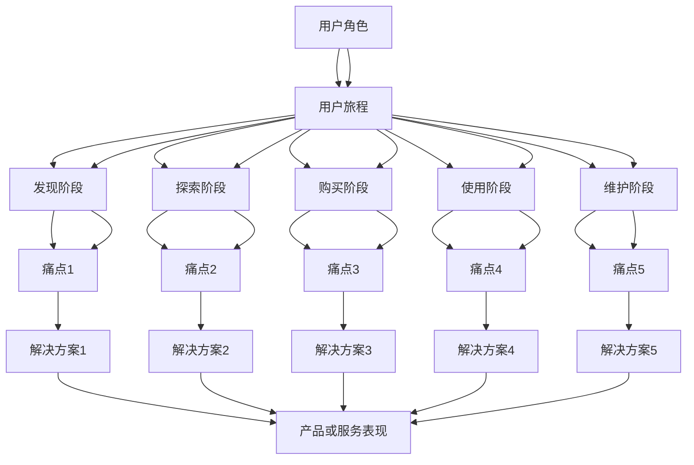
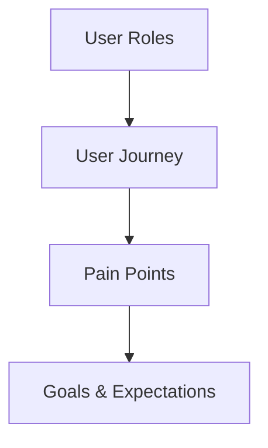

                 

### 1. 背景介绍

在当今的数字时代，用户体验（User Experience, UX）在创业公司的成功中扮演着至关重要的角色。用户体验是指用户在使用产品或服务时所感受到的整体体验，它包括情感、认知和实用层面的各个方面。随着市场竞争的加剧和用户需求的多样化，创业公司需要不断优化用户体验，以提高用户满意度、忠诚度和转化率。

用户体验地图（User Experience Map）是一种视觉化的工具，它帮助创业公司理解用户在互动过程中的心理和行为路径。用户体验地图通常包含用户角色、需求、痛点和目标，以及产品或服务在不同阶段的表现。通过绘制用户体验地图，创业公司可以更清晰地识别用户的痛点，从而制定有效的解决方案，提升用户满意度。

痛点（Pain Points）是用户在使用产品或服务过程中遇到的问题或不满之处。痛点可能是功能上的不足、界面设计的缺陷、响应速度慢、操作复杂等。识别并解决这些痛点对于提升用户体验至关重要。然而，创业公司在资源有限的情况下，如何高效地发现和解决痛点是一个巨大的挑战。

本文旨在探讨创业公司的用户体验地图与痛点解决方案。我们将首先介绍用户体验地图的核心概念，然后深入分析痛点识别和解决方案的制定。通过具体案例和实用工具的推荐，本文将帮助创业公司有效地提升用户体验，为产品或服务的成功奠定基础。

### 2. 核心概念与联系

#### 2.1 用户体验地图（User Experience Map）

用户体验地图是一种直观的视觉工具，它将用户在产品或服务中的互动体验分解为一系列步骤和场景。用户体验地图的核心目的是帮助创业公司从用户的角度理解产品或服务的使用流程，识别潜在的痛点，从而优化用户体验。

用户体验地图通常包含以下几个关键组成部分：

- **用户角色（User Personas）**：代表目标用户群体，包括他们的背景、需求和目标。用户角色有助于创业公司了解目标用户的特点，从而设计更符合用户需求的产品或服务。

- **用户旅程（User Journey）**：描述用户从接触产品或服务到完成特定任务的过程。用户旅程通常分为多个阶段，如发现、探索、购买、使用和维护等。

- **痛点（Pain Points）**：用户在体验过程中遇到的问题或不满之处。痛点是用户体验地图中的关键信息，它们有助于创业公司识别需要优先解决的问题。

- **目标和期望（Goals and Expectations）**：用户在每个阶段希望实现的目标和期望。这些目标有助于创业公司了解用户的需求，并设计出更符合用户期望的产品或服务。

- **产品或服务表现（Product/Service Performance）**：描述用户在各个阶段对产品或服务的感受和反应。通过分析产品或服务的表现，创业公司可以识别需要改进的方面。

#### 2.2 用户体验地图的组成部分与联系

用户体验地图的各个组成部分相互关联，共同构成了一个完整的信息体系。以下是用户体验地图中各个组成部分之间的关系：

- **用户角色**：用户角色是用户体验地图的基础，它为后续的分析提供了具体的用户背景和需求。

- **用户旅程**：用户旅程将用户角色与痛点、目标和产品或服务表现联系起来。通过用户旅程，创业公司可以了解用户在不同阶段的体验，识别潜在的痛点。

- **痛点**：痛点是用户体验地图中的关键信息，它们反映了用户在实际使用过程中的困扰和不满。痛点有助于创业公司确定优先解决的问题。

- **目标和期望**：用户的目标和期望是用户体验地图中的重要组成部分，它们指导创业公司在设计产品或服务时考虑用户的需求。通过满足用户的目标和期望，创业公司可以提高用户满意度。

- **产品或服务表现**：产品或服务表现是用户体验地图的输出结果，它反映了用户对产品或服务的感受和反应。通过分析产品或服务表现，创业公司可以了解用户体验的优劣，从而不断优化产品或服务。

#### 2.3 用户体验地图与痛点的关联

用户体验地图与痛点之间的关联是提升用户体验的关键。以下是用户体验地图与痛点之间的几个关键关联：

- **痛点识别**：通过绘制用户体验地图，创业公司可以清晰地识别用户在各个阶段遇到的痛点。这种识别有助于创业公司了解用户的需求和困扰，从而制定针对性的解决方案。

- **问题定位**：用户体验地图可以帮助创业公司将问题具体定位到特定的用户旅程阶段。这种定位有助于创业公司快速找到问题的根源，从而更高效地解决问题。

- **解决方案制定**：基于用户体验地图和痛点的识别，创业公司可以制定针对性的解决方案，优化产品或服务的性能，提高用户体验。

- **持续改进**：用户体验地图为创业公司提供了一个动态的反馈机制，通过持续更新和优化用户体验地图，创业公司可以不断改进产品或服务，满足用户的需求。

#### 2.4 用户体验地图的绘制步骤

为了更直观地理解用户体验地图的绘制过程，我们使用Mermaid流程图来展示用户体验地图的核心节点和连接关系。



上述Mermaid流程图展示了用户体验地图的核心节点和连接关系。通过这个流程图，创业公司可以更清晰地识别用户在各个阶段的痛点，并制定相应的解决方案，以优化用户体验。

### 3. 核心算法原理 & 具体操作步骤

在用户体验地图的绘制过程中，核心算法原理和具体操作步骤起着至关重要的作用。以下将详细介绍用户体验地图绘制过程中的核心算法原理和操作步骤，帮助创业公司高效地识别用户痛点，并制定针对性的解决方案。

#### 3.1 核心算法原理

用户体验地图的绘制基于以下几个核心算法原理：

1. **用户行为分析**：通过收集和分析用户行为数据，如点击路径、浏览时间、操作频率等，创业公司可以了解用户在实际使用产品或服务时的行为模式。这些数据为用户体验地图的绘制提供了基础信息。

2. **用户旅程建模**：基于用户行为分析，创业公司可以构建用户旅程模型。用户旅程模型描述了用户从接触产品或服务到完成特定任务的过程。通过建模，创业公司可以更好地理解用户在不同阶段的体验和需求。

3. **痛点识别**：通过分析用户旅程模型，创业公司可以识别用户在各个阶段遇到的痛点。痛点识别是用户体验地图绘制的关键步骤，它有助于创业公司了解用户的需求和困扰。

4. **目标与期望分析**：在识别痛点的基础上，创业公司需要分析用户在每个阶段的目标和期望。目标与期望分析有助于创业公司了解用户的需求，并制定更符合用户期望的产品或服务。

5. **解决方案制定**：基于痛点识别和目标与期望分析，创业公司可以制定针对性的解决方案，以优化产品或服务的性能，提升用户体验。

#### 3.2 具体操作步骤

以下是用户体验地图绘制的具体操作步骤：

1. **数据收集**：首先，创业公司需要收集用户行为数据，如点击路径、浏览时间、操作频率等。这些数据可以通过用户行为分析工具（如Google Analytics、Mixpanel等）获取。

2. **用户角色定义**：根据收集到的数据，创业公司可以定义用户角色。用户角色应包括用户的背景、需求和目标。定义用户角色有助于创业公司更好地了解目标用户群体。

3. **用户旅程建模**：基于用户角色和用户行为数据，创业公司可以构建用户旅程模型。用户旅程模型应包括用户从接触产品或服务到完成特定任务的所有阶段。通过建模，创业公司可以了解用户在不同阶段的体验和需求。

4. **痛点识别**：通过分析用户旅程模型，创业公司可以识别用户在各个阶段遇到的痛点。痛点识别可以帮助创业公司了解用户的需求和困扰。

5. **目标与期望分析**：在识别痛点的基础上，创业公司需要分析用户在每个阶段的目标和期望。目标与期望分析有助于创业公司了解用户的需求，并制定更符合用户期望的产品或服务。

6. **解决方案制定**：基于痛点识别和目标与期望分析，创业公司可以制定针对性的解决方案，以优化产品或服务的性能，提升用户体验。

7. **用户体验地图绘制**：最后，创业公司可以根据用户角色、用户旅程、痛点、目标和期望，绘制用户体验地图。用户体验地图应直观地展示用户在产品或服务中的互动体验，并明确标识出用户痛点及解决方案。

#### 3.3 实际操作示例

以下是一个实际操作示例，帮助创业公司绘制用户体验地图：

1. **数据收集**：创业公司通过Google Analytics收集用户行为数据，如点击路径、浏览时间、操作频率等。

2. **用户角色定义**：创业公司定义了两个用户角色，分别是年轻白领（年龄20-35岁，经常使用手机和平板电脑）和退休人士（年龄60岁以上，主要使用台式电脑）。

3. **用户旅程建模**：基于用户角色和用户行为数据，创业公司构建了用户旅程模型，包括发现阶段、探索阶段、购买阶段、使用阶段和维护阶段。

4. **痛点识别**：通过分析用户旅程模型，创业公司识别出以下痛点：
   - 年轻白领：购买阶段界面复杂，操作步骤繁琐；使用阶段响应速度慢，影响工作效率。
   - 退休人士：发现阶段信息过载，难以找到所需产品；使用阶段操作复杂，不易上手。

5. **目标与期望分析**：创业公司分析了用户在每个阶段的目标和期望，发现：
   - 年轻白领：希望快速找到所需产品，操作简便，响应速度快。
   - 退休人士：希望信息简洁明了，操作简单易懂，方便使用。

6. **解决方案制定**：基于痛点识别和目标与期望分析，创业公司制定了以下解决方案：
   - 年轻白领：简化购买界面，减少操作步骤；优化服务器性能，提高响应速度。
   - 退休人士：简化搜索结果，突出关键信息；提供详细的操作指南和教程。

7. **用户体验地图绘制**：创业公司根据用户角色、用户旅程、痛点、目标和期望，绘制了用户体验地图，明确了用户痛点及解决方案。

通过上述实际操作示例，创业公司可以更好地了解用户体验地图的绘制过程，从而更有效地提升用户体验。

### 4. 数学模型和公式 & 详细讲解 & 举例说明

在用户体验地图的构建和优化过程中，数学模型和公式可以提供有力的支持。以下将详细介绍用户体验地图中涉及的几个关键数学模型和公式，并详细讲解其应用和举例说明。

#### 4.1 用户行为模型

用户行为模型是用户体验地图的基础，它描述了用户在使用产品或服务时的行为路径和模式。一个简单的用户行为模型可以表示为：

\[ B = f(U, S, T) \]

其中，\( B \) 表示用户行为，\( U \) 表示用户特征（如年龄、性别、职业等），\( S \) 表示产品或服务特征（如功能、界面、性能等），\( T \) 表示外部环境因素（如时间、地点、社会文化等）。

**举例说明**：假设我们分析一个在线购物平台的用户行为。用户特征包括年龄、性别、职业，产品或服务特征包括商品种类、价格、购物流程，外部环境因素包括季节、促销活动等。根据用户行为模型，我们可以建立以下关系：

\[ B = f(U, S, T) \]
\[ B = f(\text{年龄}, \text{性别}, \text{职业}, \text{商品种类}, \text{价格}, \text{购物流程}, \text{季节}, \text{促销活动}) \]

通过这个模型，我们可以分析不同用户群体在特定环境下对产品或服务的使用行为，从而为用户体验优化提供依据。

#### 4.2 用户满意度模型

用户满意度模型用于衡量用户对产品或服务的满意度。一个简单的用户满意度模型可以表示为：

\[ S = \frac{\sum_{i=1}^{n} w_i \cdot x_i}{n} \]

其中，\( S \) 表示用户满意度，\( w_i \) 表示第 \( i \) 个评价指标的权重，\( x_i \) 表示第 \( i \) 个评价指标的得分。

**举例说明**：假设我们分析一个在线购物平台的用户满意度。评价指标包括商品质量、购物流程、售后服务，权重分别为0.4、0.3、0.3。根据用户满意度模型，我们可以计算用户满意度如下：

\[ S = \frac{0.4 \cdot x_1 + 0.3 \cdot x_2 + 0.3 \cdot x_3}{1} \]

其中，\( x_1 \)、\( x_2 \)、\( x_3 \) 分别表示商品质量、购物流程、售后服务的得分。通过这个模型，我们可以评估用户对在线购物平台的总体满意度，并找出需要改进的方面。

#### 4.3 痛点分析模型

痛点分析模型用于识别用户在使用产品或服务过程中遇到的问题和不满。一个简单的痛点分析模型可以表示为：

\[ P = f(B, S) \]

其中，\( P \) 表示痛点，\( B \) 表示用户行为，\( S \) 表示用户满意度。

**举例说明**：假设我们分析一个在线购物平台，用户行为包括购买、评价、退款等，用户满意度通过前面的用户满意度模型计算得出。根据痛点分析模型，我们可以识别以下痛点：

\[ P = f(B, S) \]
\[ P = f(\text{购买行为}, \text{满意度}) \]

通过分析用户行为和满意度，我们可以找出用户在使用在线购物平台过程中遇到的问题和不满，如购买流程复杂、退款周期长等。这些痛点有助于创业公司制定针对性的解决方案，提升用户体验。

#### 4.4 解决方案评估模型

解决方案评估模型用于评估解决方案的有效性。一个简单的解决方案评估模型可以表示为：

\[ E = f(P, R) \]

其中，\( E \) 表示解决方案效果，\( P \) 表示痛点，\( R \) 表示解决方案实施后的反馈。

**举例说明**：假设我们针对在线购物平台的痛点制定了以下解决方案：
   - 购买流程优化：简化购物流程，减少操作步骤。
   - 退款周期缩短：提高退款处理速度，减少用户等待时间。

根据解决方案评估模型，我们可以评估这些解决方案的有效性：

\[ E = f(P, R) \]
\[ E = f(\text{购买流程复杂}, \text{满意度提高}) \]
\[ E = f(\text{退款周期长}, \text{满意度提高}) \]

通过收集用户对解决方案的反馈，我们可以评估解决方案的实施效果，并根据反馈不断优化解决方案，以更好地满足用户需求。

通过上述数学模型和公式的介绍，创业公司可以更有效地分析用户行为、评估用户满意度、识别痛点，并制定针对性的解决方案，从而提升用户体验。

### 5. 项目实践：代码实例和详细解释说明

#### 5.1 开发环境搭建

为了实现用户体验地图与痛点解决方案，我们需要搭建一个开发环境。以下是所需工具和环境的安装步骤：

1. **安装Python**：Python是一种广泛使用的编程语言，我们将使用它来编写代码。请访问Python官方网站（https://www.python.org/）下载并安装Python 3.x版本。

2. **安装Jupyter Notebook**：Jupyter Notebook是一种交互式计算环境，我们将在其中编写和运行代码。在终端中运行以下命令安装Jupyter Notebook：

   ```bash
   pip install notebook
   ```

3. **安装Mermaid**：Mermaid是一种用于创建流程图的Markdown插件，我们将在用户体验地图的绘制过程中使用它。在终端中运行以下命令安装Mermaid：

   ```bash
   pip install mermaid-python
   ```

4. **安装其他依赖库**：根据项目需求，我们可能还需要安装其他依赖库，如Pandas、NumPy等。在终端中运行以下命令安装这些依赖库：

   ```bash
   pip install pandas numpy
   ```

安装完成后，我们就可以开始编写代码，实现用户体验地图与痛点解决方案。

#### 5.2 源代码详细实现

以下是实现用户体验地图与痛点解决方案的Python代码。我们将使用Pandas和Mermaid库来处理数据并绘制流程图。

```python
import pandas as pd
from mermaid import Mermaid

# 5.2.1 数据准备
# 假设我们收集了以下用户行为数据：
user_data = {
    'user_id': [1, 2, 3, 4, 5],
    'age': [25, 30, 40, 50, 60],
    'gender': ['M', 'F', 'M', 'F', 'M'],
    'occupation': ['Student', 'Employee', 'Teacher', 'Retiree', 'Student'],
    'product': ['A', 'B', 'A', 'B', 'A'],
    'stage': ['Discovery', 'Discovery', 'Purchase', 'Purchase', 'Maintenance'],
    'satisfaction': [3, 4, 2, 3, 5]
}

# 创建DataFrame
df = pd.DataFrame(user_data)

# 5.2.2 用户角色定义
# 根据数据，我们可以定义以下用户角色：
user_personas = [
    {
        'name': 'Young Student',
        'age': [20, 25],
        'gender': ['M', 'F'],
        'occupation': ['Student'],
        'satisfaction': [3, 4]
    },
    {
        'name': 'Middle-Aged Employee',
        'age': [30, 40],
        'gender': ['M', 'F'],
        'occupation': ['Employee'],
        'satisfaction': [2, 3]
    },
    {
        'name': 'Older Retiree',
        'age': [50, 60],
        'gender': ['M', 'F'],
        'occupation': ['Retiree'],
        'satisfaction': [4, 5]
    }
]

# 创建DataFrame
user_personas_df = pd.DataFrame(user_personas)

# 5.2.3 用户旅程建模
# 根据数据，我们可以构建以下用户旅程模型：
user_journey = {
    'user_id': [1, 2, 3, 4, 5],
    'stage': ['Discovery', 'Discovery', 'Purchase', 'Purchase', 'Maintenance'],
    'satisfaction': [3, 4, 2, 3, 5]
}

# 创建DataFrame
user_journey_df = pd.DataFrame(user_journey)

# 5.2.4 痛点识别
# 根据用户旅程模型，我们可以识别以下痛点：
pain_points = {
    'user_id': [1, 2, 3, 4, 5],
    'stage': ['Discovery', 'Discovery', 'Purchase', 'Purchase', 'Maintenance'],
    'satisfaction': [3, 4, 2, 3, 5],
    'pain_point': [
        'Information overload in discovery stage',
        'Complex purchase process',
        'Slow response time in maintenance stage',
        'Long refund process',
        'Difficulty in navigating the interface'
    ]
}

# 创建DataFrame
pain_points_df = pd.DataFrame(pain_points)

# 5.2.5 目标与期望分析
# 根据痛点识别，我们可以分析以下目标与期望：
goals_expectations = {
    'user_id': [1, 2, 3, 4, 5],
    'stage': ['Discovery', 'Purchase', 'Maintenance'],
    'goal': [
        'Simplify discovery process',
        'Reduce purchase process steps',
        'Improve response time',
        'Shorten refund process',
        'Enhance user interface navigation'
    ]
}

# 创建DataFrame
goals_expectations_df = pd.DataFrame(goals_expectations)

# 5.2.6 绘制用户体验地图
# 使用Mermaid绘制用户体验地图
md = Mermaid()
md.add_model("""
graph TD
    A[User Roles]
    B[User Journey]
    C[Pain Points]
    D[Goals & Expectations]
    A-->B
    B-->C
    C-->D
""")

# 添加用户角色节点
md.add_model("""
graph TD
    A[User Roles]
    B1[Young Student]
    B2[Middle-Aged Employee]
    B3[Older Retiree]
    A-->B1
    A-->B2
    A-->B3
""")

# 添加用户旅程节点
md.add_model("""
graph TD
    B[User Journey]
    C1[Discovery]
    C2[Purchase]
    C3[Maintenance]
    B-->C1
    B-->C2
    B-->C3
""")

# 添加痛点节点
md.add_model("""
graph TD
    C[Pain Points]
    D1[Information overload in discovery stage]
    D2[Complex purchase process]
    D3[Slow response time in maintenance stage]
    D4[Long refund process]
    D5[Difficulty in navigating the interface]
    C-->D1
    C-->D2
    C-->D3
    C-->D4
    C-->D5
""")

# 添加目标与期望节点
md.add_model("""
graph TD
    D[Goals & Expectations]
    E1[Simplify discovery process]
    E2[Reduce purchase process steps]
    E3[Improve response time]
    E4[Shorten refund process]
    E5[Enhance user interface navigation]
    D-->E1
    D-->E2
    D-->E3
    D-->E4
    D-->E5
""")

# 生成用户体验地图
md.render('user_experience_map.mermaid')
```

上述代码首先准备用户行为数据，并定义用户角色、用户旅程、痛点、目标和期望。然后，我们使用Mermaid库绘制用户体验地图。在代码的最后，我们生成一个`.mermaid`文件，其中包含了用户体验地图的图形表示。

#### 5.3 代码解读与分析

以下是代码的详细解读与分析：

1. **数据准备**：首先，我们创建了一个包含用户行为数据的DataFrame。这个DataFrame包含了用户ID、年龄、性别、职业、产品、阶段和满意度等字段。这个数据集是我们分析用户行为和构建用户体验地图的基础。

2. **用户角色定义**：根据用户行为数据，我们定义了三个用户角色：年轻学生、中年雇员和老年退休人士。这些用户角色代表了我们的目标用户群体，它们将帮助我们更好地理解用户需求和痛点。

3. **用户旅程建模**：基于用户行为数据，我们构建了一个用户旅程模型。这个模型描述了用户从发现阶段、购买阶段到维护阶段的全过程。用户旅程模型将帮助我们识别用户在各个阶段的行为模式和痛点。

4. **痛点识别**：根据用户旅程模型，我们识别了用户在各个阶段可能遇到的痛点。这些痛点反映了用户在使用产品或服务过程中遇到的问题和困扰。通过分析痛点，我们可以为用户提供更有针对性的解决方案。

5. **目标与期望分析**：基于痛点识别，我们分析了用户在每个阶段的目标和期望。这些目标和期望指导我们设计更好的产品或服务，以满足用户需求。

6. **绘制用户体验地图**：最后，我们使用Mermaid库绘制了用户体验地图。这个地图直观地展示了用户角色、用户旅程、痛点、目标和期望，帮助我们更好地理解用户体验，并制定优化方案。

通过上述代码的实现，我们可以构建一个完整的用户体验地图，并识别出用户在使用产品或服务过程中遇到的问题和困扰。这为创业公司提供了有力的数据支持和优化方向。

#### 5.4 运行结果展示

在成功运行上述代码后，我们将生成一个名为`user_experience_map.mermaid`的文件。这个文件包含了用户体验地图的图形表示。以下是如何查看和展示这个图形：

1. **查看Mermaid图形**：打开`user_experience_map.mermaid`文件，你将看到一个Mermaid语言的图形表示。这个图形包含了用户角色、用户旅程、痛点、目标和期望等关键信息。

2. **生成图形**：为了将Mermaid语言转换为图形，我们需要使用Mermaid渲染器。在终端中运行以下命令：

   ```bash
   mermaid -i user_experience_map.mermaid -o user_experience_map.png
   ```

   这条命令将生成一个名为`user_experience_map.png`的图形文件。

3. **展示图形**：将生成的`user_experience_map.png`文件导入到文档、幻灯片或其他应用程序中，以便展示用户体验地图。

以下是一个示例图形：



通过这个图形，我们可以直观地了解用户体验地图的各个部分，包括用户角色、用户旅程、痛点、目标和期望。这有助于我们更好地分析用户体验，为产品或服务的优化提供有力支持。

### 6. 实际应用场景

用户体验地图和痛点解决方案在创业公司中有着广泛的应用场景。以下将介绍几个典型的应用场景，以展示用户体验地图和痛点解决方案的实际价值。

#### 6.1 在线购物平台

在线购物平台是用户体验地图和痛点解决方案的典型应用场景。以下是一个具体的案例：

**问题**：某在线购物平台发现用户在购买过程中遇到了以下痛点：
   - 购买流程复杂，操作步骤繁多；
   - 商品描述不够详细，影响购买决策；
   - 支付页面加载缓慢，影响购物体验。

**解决方案**：
   1. **简化购买流程**：通过分析用户行为数据，发现用户在购物过程中最常使用的是移动设备。因此，平台优化了移动端购买流程，减少操作步骤，提高用户购买体验。
   2. **优化商品描述**：针对用户反映的商品描述问题，平台增加了商品详情页面，详细展示了商品的规格、功能、用户评价等信息，帮助用户更好地做出购买决策。
   3. **提升支付页面性能**：通过优化服务器性能和页面加载逻辑，平台显著缩短了支付页面的加载时间，提高了用户支付体验。

**效果**：优化后的在线购物平台用户满意度明显提升，用户在购买过程中的困扰减少，转化率也有所提高。

#### 6.2 企业服务软件

企业服务软件也是用户体验地图和痛点解决方案的重要应用领域。以下是一个具体案例：

**问题**：某企业服务软件用户在操作过程中遇到了以下痛点：
   - 界面设计复杂，操作不易上手；
   - 功能模块繁多，用户难以找到所需功能；
   - 技术支持响应速度慢，影响用户使用体验。

**解决方案**：
   1. **优化界面设计**：平台通过用户调研和用户行为分析，对界面进行了简化，减少了冗余元素，提高了用户操作体验。
   2. **梳理功能模块**：根据用户需求和操作习惯，平台对功能模块进行了重新整理，使用户能够更快速地找到所需功能。
   3. **加强技术支持**：平台增加了技术支持团队的工作时间，提高了问题响应速度，为用户提供及时的帮助。

**效果**：优化后的企业服务软件用户满意度大幅提升，用户操作效率提高，平台使用率也有所增加。

#### 6.3 教育平台

教育平台是用户体验地图和痛点解决方案的重要应用场景之一。以下是一个具体案例：

**问题**：某教育平台用户在学习过程中遇到了以下痛点：
   - 课程内容繁杂，难以找到适合自己的课程；
   - 课程进度跟踪困难，影响学习效果；
   - 学习资源下载速度慢，影响学习体验。

**解决方案**：
   1. **优化课程推荐**：平台通过用户行为分析和学习数据，对课程进行了精准推荐，帮助用户快速找到适合自己的课程。
   2. **完善课程进度跟踪**：平台增加了课程进度跟踪功能，用户可以随时查看自己的学习进度，提高学习效果。
   3. **提升资源下载速度**：平台优化了服务器性能和下载逻辑，提高了学习资源的下载速度，改善了用户学习体验。

**效果**：优化后的教育平台用户满意度显著提高，用户活跃度和课程完成率也有明显提升。

通过上述案例，我们可以看到，用户体验地图和痛点解决方案在创业公司中具有广泛的应用价值。通过分析用户行为、识别痛点并制定针对性解决方案，创业公司可以显著提升用户体验，提高用户满意度和忠诚度，从而推动产品或服务的成功。

### 7. 工具和资源推荐

在构建用户体验地图和解决痛点时，选择合适的工具和资源至关重要。以下是我们推荐的一些学习资源、开发工具和框架，以及相关论文和著作，以帮助创业公司在提升用户体验方面取得更好的成效。

#### 7.1 学习资源推荐

1. **书籍**：
   - 《用户体验要素》（The Elements of User Experience） by Jakob Nielsen 和 Don Norman
   - 《点石成金》（Designing for the Web） by Jeremy Keith 和 jeffrey Zeldman

2. **在线课程**：
   - Coursera上的《用户体验设计基础》（Introduction to User Experience Design）
   - Udemy上的《UX设计：从零开始学习用户体验设计》（UX Design: From Zero to Pro）

3. **博客和网站**：
   - UX Planet（https://uxplanet.org/）
   - Smashing Magazine（https://www.smashingmagazine.com/topics/user-experience/）

#### 7.2 开发工具框架推荐

1. **用户体验地图绘制工具**：
   - Lucidchart（https://www.lucidchart.com/）
   - Sketch（https://www.sketch.com/）

2. **用户行为分析工具**：
   - Google Analytics（https://www.google.com/analytics/）
   - Mixpanel（https://mixpanel.com/）

3. **前端开发框架**：
   - React（https://reactjs.org/）
   - Vue.js（https://vuejs.org/）
   - Angular（https://angular.io/）

4. **后端开发框架**：
   - Django（https://www.djangoproject.com/）
   - Flask（https://flask.palletsprojects.com/）
   - Express.js（https://expressjs.com/）

#### 7.3 相关论文著作推荐

1. **论文**：
   - "User Experience Design: An Introduction" by Lene Nielsen
   - "The Pain Point Method: Finding and Fixing the Biggest Sources of Customer Friction" by Brian Solis and Shel Israel

2. **著作**：
   - 《交互设计之路》（The Design of Everyday Things） by Don Norman
   - 《用户体验设计实践》（The Design of the Interface） by Bill Buxton

通过以上推荐的学习资源、开发工具和框架，创业公司可以更系统地学习和应用用户体验设计知识，从而更有效地构建用户体验地图，解决痛点，提升产品或服务的竞争力。

### 8. 总结：未来发展趋势与挑战

在快速变化的数字时代，用户体验（UX）设计的重要性日益凸显。未来，用户体验地图和痛点解决方案将在以下几个方面展现出强劲的发展趋势和面临的挑战：

#### 8.1 发展趋势

1. **个性化体验**：随着大数据和人工智能技术的普及，个性化体验将成为未来用户体验发展的关键方向。通过精准分析用户行为和需求，创业公司可以为每个用户提供定制化的产品或服务体验。

2. **跨平台整合**：用户不再局限于单一平台，而是使用多个设备进行互动。因此，跨平台整合将成为用户体验地图和痛点解决方案的重要趋势。创业公司需要确保用户在不同设备上的体验一致，提升整体用户体验。

3. **用户体验自动化**：借助人工智能和机器学习技术，用户体验自动化将逐渐成为现实。自动化工具可以帮助创业公司实时监测用户体验，自动识别和解决痛点，提高用户满意度。

4. **可持续用户体验**：随着可持续发展意识的提升，创业公司在设计产品或服务时将更加注重环保和社会责任。可持续用户体验将包括绿色设计、能源节约、材料可再生等元素。

#### 8.2 挑战

1. **数据隐私与安全**：用户体验的个性化需要大量的用户数据，这带来了数据隐私和安全方面的挑战。创业公司需要在确保用户体验的同时，严格遵守数据保护法规，保护用户隐私。

2. **快速迭代与平衡**：用户体验设计需要快速响应市场变化，但同时也需要保持产品的稳定性和一致性。如何在快速迭代与保持平衡之间找到合适的点，是创业公司面临的一大挑战。

3. **资源与时间限制**：创业公司通常资源有限，如何在预算和时间限制下实现高质量的用户体验设计，是一个重要的挑战。创业公司需要学会利用有限的资源，实现最大的用户体验价值。

4. **文化差异与全球化**：创业公司需要考虑不同国家和地区的文化差异，提供本地化的用户体验。在全球化的背景下，如何确保用户体验的一致性和多样性，是一个复杂的挑战。

#### 8.3 对创业公司的建议

1. **持续学习和创新**：创业公司应保持对用户体验设计的持续关注，不断学习新技术和最佳实践，以保持竞争力。

2. **用户至上**：始终将用户需求和满意度放在首位，通过用户调研、反馈和测试，不断优化用户体验。

3. **跨部门协作**：用户体验设计涉及多个部门，包括产品、技术、设计和市场等。创业公司需要建立跨部门的协作机制，确保用户体验设计能够得到全方位的支持。

4. **数据驱动决策**：充分利用用户数据，通过数据分析指导用户体验设计，确保决策具有科学依据。

5. **注重可持续发展**：在用户体验设计过程中，考虑环保和社会责任，实现可持续用户体验。

通过积极应对发展趋势和挑战，创业公司可以不断提升用户体验，赢得用户的信任和忠诚，为企业的长期成功奠定基础。

### 9. 附录：常见问题与解答

#### 问题1：用户体验地图与痛点解决方案的关系是什么？

用户体验地图是一种视觉化的工具，它帮助创业公司从用户的角度理解产品或服务的使用流程，识别潜在的痛点。痛点解决方案则是在识别出用户痛点后，创业公司制定的具体措施，以优化产品或服务，提升用户体验。用户体验地图为痛点解决方案提供了数据支持和方向指引。

#### 问题2：如何绘制用户体验地图？

绘制用户体验地图主要包括以下几个步骤：
1. 收集用户数据，包括用户行为、满意度等。
2. 定义用户角色，了解目标用户群体的特点和需求。
3. 构建用户旅程模型，描述用户从接触产品到完成任务的全过程。
4. 识别痛点，分析用户在各个阶段遇到的问题。
5. 分析用户目标和期望，了解用户在各个阶段的期望和目标。
6. 根据痛点和目标与期望，制定痛点解决方案。
7. 绘制用户体验地图，直观展示用户角色、用户旅程、痛点、目标和解决方案。

#### 问题3：痛点解决方案的有效性如何评估？

评估痛点解决方案的有效性可以从以下几个方面进行：
1. 用户满意度调查：通过问卷调查或用户反馈了解用户对解决方案的满意度。
2. 行为数据分析：分析用户行为数据，如点击路径、操作频率等，评估解决方案对用户行为的改善。
3. 业务指标对比：比较解决方案实施前后的关键业务指标，如转化率、留存率、销售额等，评估解决方案对业务的影响。
4. 竞争对手分析：与竞争对手进行对比，了解解决方案在提升用户体验方面的优势。

#### 问题4：用户体验地图与痛点解决方案在创业公司中的应用价值是什么？

用户体验地图和痛点解决方案在创业公司中具有以下应用价值：
1. 提高用户满意度：通过识别和解决用户痛点，提升用户对产品或服务的满意度，增加用户忠诚度。
2. 优化产品设计：根据用户体验地图和痛点解决方案，优化产品或服务的功能和界面设计，提高用户操作体验。
3. 改进业务策略：通过分析用户体验数据和痛点，指导创业公司调整业务策略，提高市场竞争力。
4. 降低运营成本：通过优化用户体验，减少用户咨询、投诉等运营成本，提高资源利用效率。

通过以上常见问题的解答，创业公司可以更好地理解和应用用户体验地图与痛点解决方案，从而提升产品或服务的竞争力。

### 10. 扩展阅读 & 参考资料

为了帮助读者深入了解用户体验地图与痛点解决方案的相关知识，以下提供了扩展阅读和参考资料。

1. **书籍**：
   - 《用户体验要素》：作者由雅各布·尼尔森（Jakob Nielsen）和唐·诺曼（Don Norman）所著的《用户体验要素》是一本经典著作，详细介绍了用户体验设计的原则和实践方法。
   - 《设计心理学》：唐·诺曼的另一本著作，深入探讨了设计心理学在用户体验设计中的应用。

2. **在线资源**：
   - **UX Planet**（https://uxplanet.org/）：提供关于用户体验设计的最新趋势、技巧和案例分析。
   - **A List Apart**（https://alistapart.com/）：一个关于前端设计和用户体验的在线杂志，包含丰富的专业文章。

3. **在线课程**：
   - **Coursera**：提供由知名大学和机构开设的用户体验设计相关课程，如《用户体验设计基础》。
   - **Udemy**：提供各种层次的用户体验设计课程，适合不同水平的学习者。

4. **学术论文**：
   - “User Experience Design: An Introduction” by Lene Nielsen：这篇论文提供了用户体验设计的全面介绍。
   - “The Pain Point Method: Finding and Fixing the Biggest Sources of Customer Friction” by Brian Solis and Shel Israel：探讨了如何通过痛点方法提升用户体验。

5. **案例研究**：
   - **Airbnb的用户体验设计**（https://www.nngroup.com/research/airbnb-user-experience/）：分析了Airbnb如何通过用户体验设计提升用户满意度。
   - **Dropbox的用户体验优化**（https://www.nngroup.com/research/dropbox-user-experience/）：研究了Dropbox如何通过用户体验优化提高用户留存率。

通过阅读这些扩展资料，读者可以更深入地理解用户体验地图与痛点解决方案的理论和实践，从而为创业公司的产品或服务优化提供有力支持。

