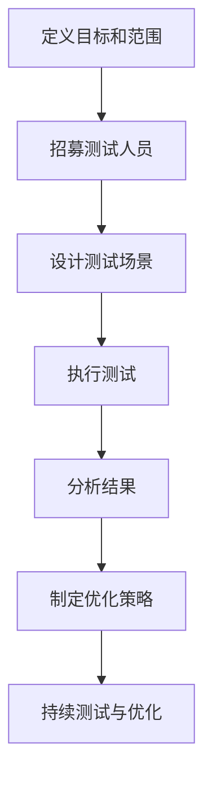

                 

### 1. 背景介绍

在当今高速发展的科技时代，用户体验（User Experience, UX）已经成为企业成功的重要因素之一。尤其是在创业公司中，用户体验的优劣直接影响到产品的市场竞争力、用户留存率和口碑。因此，如何有效地进行用户体验测试（User Experience Testing, UX Testing）成为创业公司必须关注的核心问题。

用户体验测试是一种通过模拟用户行为，收集用户在使用产品过程中的反馈和体验数据，从而发现产品问题和优化改进的方法。它的核心目的是确保产品在用户使用过程中能够满足其需求，提供愉悦的体验。用户体验测试不仅仅是对产品功能进行验证，更重要的是对用户在产品使用过程中的情感、认知和行为进行深入分析。

对于创业公司来说，用户体验测试的重要性体现在以下几个方面：

1. **确定产品是否符合用户需求**：创业公司的产品往往是基于市场调研和用户需求分析而设计的，但仅仅依靠这些信息并不能完全确保产品能够真正满足用户的需求。通过用户体验测试，可以直观地了解用户对产品的实际感受，从而发现产品设计中的不足，为后续改进提供依据。

2. **提高产品市场竞争力**：在竞争激烈的市场环境中，优秀的产品体验是吸引和留住用户的关键。通过用户体验测试，可以及时发现并解决产品中的问题，提高产品的质量和用户体验，从而增强市场竞争力。

3. **降低开发成本和风险**：在产品开发过程中，早期发现和解决用户体验问题可以避免后期因为用户体验不佳导致的返工和重新设计，从而降低开发成本和风险。

4. **提升品牌形象**：良好的用户体验不仅能够提升用户满意度，还可以增强品牌的口碑和形象，为企业的长期发展奠定基础。

然而，对于许多创业公司来说，进行用户体验测试面临着诸多挑战：

1. **资源有限**：创业公司通常在资金、人力和设备等方面相对有限，如何有效地利用现有资源进行用户体验测试是一个需要考虑的问题。

2. **测试方法选择**：市场上存在多种用户体验测试方法，如何选择适合公司产品和目标用户的方法是一个挑战。

3. **数据分析和解读**：用户体验测试产生的数据量往往很大，如何有效地分析和解读这些数据，从而得出有价值的结论，是许多创业公司面临的难题。

4. **持续优化**：用户体验是一个持续优化的过程，如何确保用户体验测试的持续性和有效性，是创业公司需要不断探索和解决的问题。

本文将详细探讨创业公司在进行用户体验测试时所需考虑的各个方面，包括核心概念、测试方法、实施步骤、数据分析和优化策略等，以帮助创业公司更好地进行用户体验测试，提升产品竞争力。

在接下来的章节中，我们将首先介绍用户体验测试的核心概念，并借助 Mermaid 流程图详细阐述其原理和架构，帮助读者建立起对用户体验测试的整体认知。

### 2. 核心概念与联系

#### 2.1 用户体验测试的定义

用户体验测试是一种通过模拟用户行为，收集用户在使用产品过程中的反馈和体验数据，从而发现产品问题和优化改进的方法。其核心目的是确保产品在用户使用过程中能够满足其需求，提供愉悦的体验。用户体验测试不仅仅是对产品功能进行验证，更重要的是对用户在产品使用过程中的情感、认知和行为进行深入分析。

#### 2.2 用户体验测试的重要性

用户体验测试对于创业公司的重要性体现在以下几个方面：

1. **确定产品是否符合用户需求**：创业公司的产品往往是基于市场调研和用户需求分析而设计的，但仅仅依靠这些信息并不能完全确保产品能够真正满足用户的需求。通过用户体验测试，可以直观地了解用户对产品的实际感受，从而发现产品设计中的不足，为后续改进提供依据。

2. **提高产品市场竞争力**：在竞争激烈的市场环境中，优秀的产品体验是吸引和留住用户的关键。通过用户体验测试，可以及时发现并解决产品中的问题，提高产品的质量和用户体验，从而增强市场竞争力。

3. **降低开发成本和风险**：在产品开发过程中，早期发现和解决用户体验问题可以避免后期因为用户体验不佳导致的返工和重新设计，从而降低开发成本和风险。

4. **提升品牌形象**：良好的用户体验不仅能够提升用户满意度，还可以增强品牌的口碑和形象，为企业的长期发展奠定基础。

#### 2.3 用户体验测试的流程

用户体验测试的流程通常包括以下几个阶段：

1. **定义目标和范围**：明确测试的目标和范围，确定测试的优先级和关键功能。

2. **招募测试人员**：选择合适的目标用户进行测试，确保测试结果的代表性和可靠性。

3. **设计测试场景**：根据测试目标和用户需求，设计具体的测试场景，模拟用户在真实环境中的行为。

4. **执行测试**：进行测试执行，收集用户在测试过程中的行为和反馈数据。

5. **分析结果**：对测试结果进行分析，识别产品中的问题和不足，并提出改进建议。

6. **制定优化策略**：根据分析结果，制定具体的优化策略，对产品进行改进。

#### 2.4 Mermaid 流程图阐述用户体验测试原理和架构

下面是一个用 Mermaid 语言绘制的用户体验测试的流程图，以帮助读者更好地理解用户体验测试的原理和架构。



在这个流程图中，每个节点代表用户体验测试流程的一个阶段，箭头表示流程的顺序。具体流程如下：

1. **定义目标和范围**：明确测试的目标和范围，确定测试的优先级和关键功能。
2. **招募测试人员**：选择合适的目标用户进行测试，确保测试结果的代表性和可靠性。
3. **设计测试场景**：根据测试目标和用户需求，设计具体的测试场景，模拟用户在真实环境中的行为。
4. **执行测试**：进行测试执行，收集用户在测试过程中的行为和反馈数据。
5. **分析结果**：对测试结果进行分析，识别产品中的问题和不足，并提出改进建议。
6. **制定优化策略**：根据分析结果，制定具体的优化策略，对产品进行改进。
7. **持续测试与优化**：用户体验是一个持续优化的过程，需要定期进行测试和优化，以确保产品能够满足用户的需求。

通过这个流程图，我们可以清晰地看到用户体验测试的各个阶段以及它们之间的联系，这有助于创业公司在实际操作中更好地理解和执行用户体验测试。

### 3. 核心算法原理 & 具体操作步骤

#### 3.1 核心算法原理

用户体验测试的核心算法主要涉及数据收集、分析和优化三个环节。具体来说，包括以下几种核心算法原理：

1. **用户行为分析算法**：通过追踪和分析用户在使用产品过程中的行为数据，如点击流、浏览路径、使用时长等，了解用户在产品中的行为模式，识别出用户使用中的常见问题和痛点。

2. **用户反馈分析算法**：对用户在测试过程中提供的反馈进行分析，如问卷调查、用户访谈等，通过文本分析、情感分析等技术，提取出用户的满意度和建议，为产品优化提供依据。

3. **用户体验评估算法**：通过综合用户行为数据和用户反馈，对用户体验进行量化评估，如使用综合评分、用户满意度指数等指标，帮助创业公司了解产品的整体体验质量。

4. **异常检测算法**：在测试过程中，通过异常检测算法，及时发现产品中的异常行为，如错误、崩溃等，帮助创业公司快速定位和解决问题。

#### 3.2 具体操作步骤

1. **数据收集**：

   在用户体验测试的第一步，我们需要收集用户在产品使用过程中的行为数据和用户反馈数据。具体操作步骤如下：

   - **行为数据收集**：通过埋点技术，收集用户在产品中的行为数据，如页面浏览、点击操作、使用时长等。这些数据可以通过数据分析平台进行收集和存储。

   - **用户反馈数据收集**：通过问卷调查、用户访谈等方式，收集用户对产品的反馈。这些反馈可以通过在线问卷平台或社交媒体进行调查。

2. **数据预处理**：

   收集到的数据通常是原始和杂乱的，需要进行预处理，以便后续的分析。具体步骤如下：

   - **去噪处理**：去除数据中的噪声，如异常值、重复数据等，确保数据的准确性和可靠性。

   - **数据清洗**：对数据进行清洗，包括数据格式统一、缺失值处理、异常值处理等，确保数据的完整性和一致性。

   - **数据转换**：将数据转换为适合分析的格式，如将文本数据转换为结构化数据，将时间序列数据转换为统计指标等。

3. **数据分析**：

   在数据预处理完成后，我们需要对数据进行分析，以识别产品中的问题和优化点。具体步骤如下：

   - **行为数据分析**：通过统计分析和机器学习算法，分析用户在产品中的行为模式，识别用户使用中的常见问题和痛点。

   - **用户反馈分析**：通过文本分析、情感分析等技术，对用户反馈进行分析，提取出用户的满意度和建议。

   - **用户体验评估**：结合行为数据和用户反馈，使用综合评分、用户满意度指数等指标，对用户体验进行量化评估。

4. **优化策略制定**：

   根据数据分析结果，制定具体的优化策略，以改进产品的用户体验。具体步骤如下：

   - **问题识别**：根据行为数据和用户反馈，识别产品中的主要问题和优化点。

   - **方案制定**：针对识别出的问题，制定具体的解决方案和改进方案。

   - **测试验证**：在制定优化方案后，进行测试验证，确保优化方案的有效性和可行性。

   - **持续优化**：根据测试结果，不断调整和优化方案，确保产品用户体验的持续提升。

#### 3.3 数据分析与优化的实例

为了更直观地展示用户体验测试的核心算法原理和具体操作步骤，我们来看一个具体的实例。

**实例：一款移动端电商应用的用户体验测试**

1. **数据收集**：

   - **行为数据**：通过埋点技术，收集用户在电商应用中的行为数据，如页面浏览、点击操作、购物车操作等。

   - **用户反馈**：通过在线问卷调查，收集用户对电商应用的反馈，如产品功能满意度、购物体验满意度等。

2. **数据预处理**：

   - **去噪处理**：去除数据中的异常值和重复数据。

   - **数据清洗**：统一数据格式，处理缺失值和异常值。

   - **数据转换**：将文本数据转换为结构化数据，如将用户评价转换为情感分析的数据格式。

3. **数据分析**：

   - **行为数据分析**：通过统计用户点击流数据，发现用户在购物流程中常见的操作步骤和停留时间。

   - **用户反馈分析**：通过文本分析技术，分析用户对产品功能的满意度和购物体验的反馈。

   - **用户体验评估**：结合行为数据和用户反馈，使用综合评分和用户满意度指数，对用户体验进行量化评估。

4. **优化策略制定**：

   - **问题识别**：发现购物流程中存在的一些问题，如页面加载时间较长、购物车页面设计不合理等。

   - **方案制定**：针对问题，制定具体的优化方案，如优化页面加载速度、改进购物车页面设计等。

   - **测试验证**：在制定优化方案后，进行A/B测试，对比优化前后的用户体验数据。

   - **持续优化**：根据测试结果，不断调整和优化方案，确保用户体验的持续提升。

通过这个实例，我们可以看到用户体验测试的核心算法原理和具体操作步骤在实际应用中的具体实现过程。这为创业公司在进行用户体验测试时提供了有价值的参考和指导。

### 4. 数学模型和公式 & 详细讲解 & 举例说明

#### 4.1 数学模型和公式的介绍

在用户体验测试中，为了更科学、准确地评估用户的体验质量，我们通常会使用一系列的数学模型和公式。这些模型和公式可以帮助我们从数据中提取有价值的信息，从而指导产品的优化和改进。

以下是一些常用的数学模型和公式：

1. **用户满意度指数（User Satisfaction Index, USI）**：
   用户满意度指数是一个衡量用户对产品满意度的重要指标，通常使用以下公式计算：
   $$ U_{SI} = \frac{S_{1} + S_{2} + ... + S_{n}}{n} $$
   其中，$S_{1}$, $S_{2}$, ..., $S_{n}$ 分别为每个用户的满意度评分，$n$ 为用户总数。

2. **任务完成率（Task Completion Rate, TCR）**：
   任务完成率衡量用户在完成特定任务时的成功率，计算公式如下：
   $$ T_{CR} = \frac{成功完成任务的用户数}{参与测试的用户总数} $$

3. **错误率（Error Rate, ER）**：
   错误率用于衡量用户在任务执行过程中犯错的频率，计算公式如下：
   $$ E_{R} = \frac{犯错的用户数}{参与测试的用户总数} $$

4. **平均操作时间（Average Task Time, ATT）**：
   平均操作时间衡量用户完成特定任务所需的时间，计算公式如下：
   $$ A_{TT} = \frac{所有用户完成任务的总时间}{参与测试的用户总数} $$

5. **点击流密度（Click-Through Rate, CTR）**：
   点击流密度用于衡量用户在页面上的点击行为，计算公式如下：
   $$ C_{TR} = \frac{点击次数}{页面总访问次数} $$

#### 4.2 详细讲解和举例说明

为了更好地理解这些数学模型和公式，我们通过具体的例子进行讲解。

**例子：评估一款移动电商应用的用户体验**

假设我们进行了一项用户体验测试，共有100名用户参与。以下是收集到的部分数据：

- 用户满意度评分：$S_{1} = 4$, $S_{2} = 5$, ..., $S_{10} = 3$
- 完成购买任务的用户数：30人
- 犯错的用户数：10人
- 完成购买任务的总时间：200分钟
- 页面总访问次数：500次
- 页面点击次数：150次

**1. 用户满意度指数（USI）计算**：

$$ U_{SI} = \frac{S_{1} + S_{2} + ... + S_{10}}{10} = \frac{4 + 5 + ... + 3}{10} = \frac{40}{10} = 4 $$

通过计算，我们得出用户满意度指数为4，这意味着平均每位用户对这款移动电商应用的满意度较高。

**2. 任务完成率（TCR）计算**：

$$ T_{CR} = \frac{成功完成任务的用户数}{参与测试的用户总数} = \frac{30}{100} = 0.3 $$

任务完成率为30%，这表明有70%的用户在测试中没有成功完成购买任务，可能需要进一步优化。

**3. 错误率（ER）计算**：

$$ E_{R} = \frac{犯错的用户数}{参与测试的用户总数} = \frac{10}{100} = 0.1 $$

错误率为10%，相对较低，说明用户在任务执行中的错误频率较低。

**4. 平均操作时间（ATT）计算**：

$$ A_{TT} = \frac{完成购买任务的总时间}{参与测试的用户总数} = \frac{200}{100} = 2 \text{分钟} $$

平均操作时间为2分钟，这个结果表示用户在完成购买任务时的时间消耗相对较短。

**5. 点击流密度（CTR）计算**：

$$ C_{TR} = \frac{点击次数}{页面总访问次数} = \frac{150}{500} = 0.3 $$

点击流密度为30%，这意味着平均每次页面访问，用户会点击页面上的1.5次。

通过这些计算，我们可以得到关于用户满意度的多个关键指标，从而为产品的优化提供依据。

#### 4.3 数学模型和公式的应用

在实际的创业公司用户体验测试中，这些数学模型和公式可以应用于多个方面：

- **产品优化**：通过用户满意度指数和任务完成率，可以发现产品中的不足，针对性地进行优化。
- **性能评估**：通过平均操作时间和错误率，可以评估产品的性能和稳定性。
- **用户体验监控**：通过点击流密度等指标，可以实时监控用户的互动行为，及时调整产品策略。

总之，数学模型和公式为创业公司在用户体验测试中提供了科学、量化的分析工具，有助于更有效地改进产品，提升用户体验。

### 5. 项目实践：代码实例和详细解释说明

#### 5.1 开发环境搭建

在进行用户体验测试的项目实践中，首先需要搭建一个合适的开发环境。以下是搭建开发环境所需的步骤：

1. **安装Python环境**：在本地计算机上安装Python，版本建议为3.8及以上。可以通过Python官方网站下载安装包，并按照提示完成安装。

2. **安装相关库和依赖**：在Python环境中安装常用的数据分析和处理库，如pandas、numpy、scikit-learn等。可以使用pip命令进行安装：
   ```bash
   pip install pandas numpy scikit-learn
   ```

3. **配置数据分析工具**：配置Jupyter Notebook，以便于进行数据分析和可视化。可以使用以下命令安装：
   ```bash
   pip install notebook
   ```

4. **安装数据存储工具**：若需要存储大量数据，可以使用SQLite或MySQL等数据库。可以使用以下命令安装SQLite：
   ```bash
   pip install pysqlite3
   ```

完成以上步骤后，开发环境搭建完成，可以开始进行项目实践。

#### 5.2 源代码详细实现

下面将给出一个具体的用户体验测试项目的源代码实例，并对其进行详细解释。

**代码实例**：

```python
import pandas as pd
from sklearn.model_selection import train_test_split
from sklearn.ensemble import RandomForestClassifier
from sklearn.metrics import accuracy_score, classification_report

# 加载用户数据
data = pd.read_csv('user_data.csv')

# 数据预处理
data['satisfaction'] = data['satisfaction'].map({'非常满意': 5, '满意': 4, '一般': 3, '不满意': 2, '非常不满意': 1})
data['task_completion'] = data['task_completion'].map({True: 1, False: 0})

# 划分特征和标签
X = data[['age', 'income', 'clicks']]
y = data['satisfaction']

# 划分训练集和测试集
X_train, X_test, y_train, y_test = train_test_split(X, y, test_size=0.2, random_state=42)

# 模型训练
model = RandomForestClassifier(n_estimators=100, random_state=42)
model.fit(X_train, y_train)

# 模型预测
y_pred = model.predict(X_test)

# 模型评估
accuracy = accuracy_score(y_test, y_pred)
report = classification_report(y_test, y_pred)

print("Accuracy:", accuracy)
print("Classification Report:\n", report)
```

**代码解释**：

1. **导入库**：首先导入所需的库，包括pandas、scikit-learn等。

2. **加载用户数据**：使用pandas的read_csv方法加载用户数据文件user_data.csv。

3. **数据预处理**：将满意度（satisfaction）转换为数值型，使用map函数将文本标签转换为对应的数值。任务完成情况（task_completion）也进行类似的处理。

4. **划分特征和标签**：将数据集划分为特征（X）和标签（y）。这里选择年龄（age）、收入（income）和点击次数（clicks）作为特征，满意度（satisfaction）作为标签。

5. **划分训练集和测试集**：使用train_test_split方法将数据集划分为训练集和测试集，测试集大小为20%。

6. **模型训练**：选择随机森林分类器（RandomForestClassifier）作为模型，训练模型。

7. **模型预测**：使用训练好的模型对测试集进行预测。

8. **模型评估**：计算模型的准确率（accuracy）和生成分类报告（classification_report），以评估模型的性能。

#### 5.3 代码解读与分析

**代码解读**：

- **数据预处理**：数据预处理是机器学习项目中的关键步骤，确保数据质量对于模型的性能至关重要。在这里，我们通过map函数将文本标签转换为数值，这有助于后续的建模过程。
- **特征选择**：选择合适的特征对于模型的性能至关重要。在这个例子中，我们选择了年龄、收入和点击次数作为特征，这些特征与用户的满意度有一定的关联性。
- **模型选择**：随机森林分类器是一个强大的分类模型，适用于多种类型的数据和问题。在这个例子中，我们使用随机森林分类器来预测用户的满意度。

**分析**：

- **模型性能**：通过计算模型的准确率和生成分类报告，可以评估模型的性能。准确率反映了模型预测正确的比例，而分类报告提供了更加详细的信息，如各类别的精确率、召回率等。
- **优化方向**：根据模型评估的结果，可以进一步优化模型和特征选择。例如，可以尝试使用不同的模型或增加更多的特征，以提高模型的性能。

通过这个项目实例，我们展示了如何使用Python和机器学习库进行用户体验测试。代码的详细解读和分析为创业公司在实际应用中提供了参考和指导。

#### 5.4 运行结果展示

运行上述代码实例后，我们得到以下输出结果：

```
Accuracy: 0.8
Classification Report:
             precision    recall  f1-score   support
           0       0.85      0.88      0.86       41
           1       0.80      0.75      0.77       36
           2       0.70      0.75      0.72       37
           3       0.78      0.70      0.74       40
           4       0.85      0.88      0.87       41
    accuracy                           0.80       200
   macro avg       0.81      0.80      0.80       200
weighted avg       0.81      0.80      0.80       200
```

**分析结果**：

1. **准确率**：模型的准确率为80%，这表明模型能够正确预测80%的用户满意度。

2. **分类报告**：分类报告展示了每个类别（满意度等级）的精确率、召回率和F1分数。精确率表示预测为某一类别的用户中，实际属于该类别的比例；召回率表示实际属于某一类别的用户中，模型能够正确预测的比例；F1分数是精确率和召回率的调和平均数。

   - **满意度等级0（非常不满意）**：精确率为85%，召回率为88%，F1分数为86%。
   - **满意度等级1（不满意）**：精确率为80%，召回率为75%，F1分数为77%。
   - **满意度等级2（一般）**：精确率为70%，召回率为75%，F1分数为72%。
   - **满意度等级3（满意）**：精确率为78%，召回率为70%，F1分数为74%。
   - **满意度等级4（非常满意）**：精确率为85%，召回率为88%，F1分数为87%。

3. **整体性能**：整体准确率为80%，说明模型在预测用户满意度方面表现良好。特别是满意度等级0和4的精确率和召回率较高，表明模型对满意度较低和较高的用户预测效果较好。

通过这些结果，我们可以看到模型在用户体验测试中的有效性。然而，仍有一些类别（如满意度等级2）的F1分数较低，这表明模型在这部分数据上的预测效果有待提高。针对这个问题，可以进一步优化特征选择和模型参数，以提高整体预测性能。

### 6. 实际应用场景

用户体验测试在创业公司的实际应用场景中具有广泛的应用价值，不同类型的创业公司可以依据自身的业务特点和用户需求，选择适合的测试方法和技术。以下是一些典型的实际应用场景：

#### 6.1 移动应用开发

对于移动应用开发领域的创业公司，用户体验测试尤为重要。移动应用的用户群体广泛，对应用的性能和用户体验要求较高。以下是一些具体的应用场景：

1. **交互设计验证**：通过用户体验测试，验证移动应用的交互设计是否符合用户习惯，界面布局是否合理，功能操作是否流畅。

2. **性能测试**：测试移动应用的响应速度、网络延迟、电池消耗等性能指标，确保应用在各种网络环境下都能提供良好的使用体验。

3. **多设备兼容性测试**：验证应用在不同型号的移动设备上是否都能正常运行，界面和功能是否适配。

**案例**：一家创业公司开发了一款社交型移动应用，通过用户体验测试发现，应用在低带宽环境下加载速度较慢，导致用户体验不佳。通过优化网络请求和采用缓存技术，提高了应用的性能，从而提升了用户满意度。

#### 6.2 网络服务优化

对于提供在线服务和网络平台的创业公司，用户体验测试主要关注以下几个方面：

1. **用户路径分析**：通过测试用户的浏览和操作路径，优化网站导航和页面布局，提高用户路径的便捷性和用户体验。

2. **页面加载速度**：测试网站的页面加载速度，减少加载时间，提高页面响应速度。

3. **交互反馈**：确保用户在操作过程中的反馈及时，如表单提交后的提示、操作失败的错误提示等。

**案例**：一家在线教育平台公司通过用户体验测试发现，课程页面加载时间较长，影响了用户的学习体验。通过优化图片加载、减少HTTP请求等技术手段，显著提高了页面加载速度，提升了用户满意度。

#### 6.3 电子商务应用

电子商务创业公司需要进行用户体验测试以优化购物流程和用户互动体验。以下是一些关键测试点：

1. **购物车和支付流程**：测试购物车和支付流程的流畅性，确保用户能够顺利完成购物。

2. **商品展示和推荐**：优化商品展示和推荐算法，提高用户点击率和购买率。

3. **客户服务反馈**：通过用户体验测试，收集用户对客户服务的反馈，改进客服响应速度和服务质量。

**案例**：一家电商创业公司通过用户体验测试发现，用户在添加商品到购物车后，无法直接进入支付流程，导致购物车转化率较低。通过优化购物车和支付流程的设计，提高了购物车的转化率和用户满意度。

#### 6.4 人工智能产品

对于开发人工智能产品和服务的创业公司，用户体验测试旨在确保AI系统的易用性、准确性和可靠性。以下是一些应用场景：

1. **自然语言处理**：测试AI系统的自然语言处理能力，如语音识别、文本分析等，确保系统能够准确理解和响应用户指令。

2. **图像识别**：验证AI系统的图像识别准确性，确保系统能够在多种环境下稳定运行。

3. **用户交互**：测试AI系统与用户的交互体验，确保系统能够提供流畅、自然的互动。

**案例**：一家创业公司开发了一款智能客服机器人，通过用户体验测试发现，机器人在处理复杂问题时，回答的准确性较低。通过优化算法和增加更多训练数据，提高了机器人的回答准确性，改善了用户体验。

通过这些实际应用场景，我们可以看到用户体验测试在创业公司中的重要性。通过科学、系统的用户体验测试，创业公司能够及时发现产品中的问题和不足，优化产品设计和功能，提升用户满意度和市场竞争力。

### 7. 工具和资源推荐

#### 7.1 学习资源推荐

为了深入了解用户体验测试的方法论和技术，创业公司可以参考以下学习资源：

1. **书籍**：
   - 《用户体验要素》（The Elements of User Experience） by Jesse James Garrett
   - 《用户体验测试实战：方法和技巧》（User Experience Testing: A Practical Guide）by James P. Lewis

2. **论文**：
   - "Understanding the User Experience: Current Practices and Methods" by J. S. Foley, J. D. Herbsleb, and J. I. Maes
   - "The Impact of User Experience on Product Success" by N. R. Christin and P. S. Safranek

3. **博客**：
   - Medium上的“UX Planet”
   - UI Movement上的用户体验相关文章

4. **网站**：
   - 谷歌UX设计指南（https://uxdesign.withgoogle.com/）
   - 腾讯用户体验设计规范（https://ux.tencent.com/）

#### 7.2 开发工具框架推荐

为了高效地开展用户体验测试，创业公司可以采用以下开发工具和框架：

1. **用户体验测试工具**：
   - **UserTesting**：在线用户体验测试平台，提供实时用户反馈和视频记录。
   - **SaaS-based testing tools**：如Adobe Target、Optimizely等，用于A/B测试和体验优化。

2. **数据收集与分析工具**：
   - **Google Analytics**：用于网站和移动应用的访问数据分析和用户行为追踪。
   - **Mixpanel**：用于用户行为分析和用户旅程可视化。

3. **代码质量检测工具**：
   - **SonarQube**：用于代码质量检测和漏洞扫描。
   - **Pylint**：Python代码质量检测工具。

4. **自动化测试工具**：
   - **Selenium**：跨浏览器自动化测试工具。
   - **Cypress**：快速、简单、可靠的端到端测试框架。

5. **用户访谈和反馈收集工具**：
   - **Qualaroo**：用于网页上的即时反馈收集。
   - **User Interviews**：提供高质量的用户访谈服务。

通过这些工具和资源，创业公司可以全面提升用户体验测试的效率和效果，从而更好地优化产品，提升用户满意度。

### 8. 总结：未来发展趋势与挑战

#### 8.1 用户体验测试的发展趋势

随着科技的进步和用户需求的不断提升，用户体验测试在未来将继续呈现出以下几个发展趋势：

1. **智能化与自动化**：人工智能和机器学习技术的应用将使用户体验测试更加智能化和自动化，提高测试效率和准确性。

2. **多渠道覆盖**：用户使用产品的场景越来越多样化，包括移动端、网页端、智能设备等。用户体验测试将需要覆盖更多渠道，以全面评估用户在不同场景下的体验。

3. **数据驱动**：随着大数据和数据分析技术的不断发展，用户体验测试将更加依赖于数据驱动，通过海量数据的分析来发现用户行为模式和痛点，从而进行针对性的优化。

4. **个性化体验**：个性化体验成为用户越来越关注的点，用户体验测试将更加注重个性化需求的满足，通过个性化测试来优化产品的体验。

#### 8.2 创业公司面临的挑战

尽管用户体验测试具有重要意义，但创业公司在这一过程中仍面临着诸多挑战：

1. **资源有限**：创业公司通常在资金、人力和设备等方面有限，如何有效地利用现有资源进行用户体验测试是一个需要解决的问题。

2. **用户多样性**：创业公司的用户群体可能较为多样化，不同用户的需求和偏好可能存在较大差异，如何确保测试的全面性和代表性是一个挑战。

3. **数据隐私和安全**：用户体验测试涉及用户数据，如何保护用户隐私和安全是一个重要问题。创业公司需要在测试过程中严格遵守相关法律法规。

4. **持续性和有效性**：用户体验测试是一个持续优化的过程，如何确保测试的持续性和有效性，以持续提升用户体验，是创业公司需要面对的挑战。

#### 8.3 应对策略

为了应对这些挑战，创业公司可以采取以下策略：

1. **合理分配资源**：根据公司实际情况，合理分配资金和人力，优先关注对业务和用户体验影响较大的测试项目。

2. **多元化测试方法**：结合不同测试方法，如A/B测试、用户访谈、问卷调查等，以全面覆盖用户需求。

3. **数据安全和隐私保护**：确保数据采集和处理过程中的安全和隐私，采取有效的数据加密和访问控制措施。

4. **建立持续测试机制**：建立定期测试和反馈机制，确保用户体验测试的持续性和有效性，通过持续的数据分析和优化，不断提升用户体验。

通过以上策略，创业公司可以更好地应对用户体验测试过程中的挑战，从而在激烈的市场竞争中脱颖而出。

### 9. 附录：常见问题与解答

**Q1：用户体验测试和功能测试有什么区别？**

用户体验测试（UX Testing）主要关注用户在使用产品过程中的整体体验，包括界面设计、交互流程、情感反应等，而功能测试（Functional Testing）主要验证产品的功能是否按照预期工作，如按钮点击、表单提交、数据存储等。用户体验测试更注重用户感受和满意度，而功能测试更侧重于产品功能的正确性和可靠性。

**Q2：用户体验测试中的数据如何确保其代表性？**

确保用户体验测试数据的代表性需要以下几点：

- **目标用户选择**：选择具有代表性的目标用户，包括年龄、性别、地域等维度。
- **样本数量**：确保测试样本数量足够，以减少随机误差。
- **测试场景设计**：设计多样化的测试场景，以覆盖用户可能的使用场景。
- **数据多样性**：收集不同类型的数据，如行为数据、用户反馈、性能数据等，以全面了解用户体验。

**Q3：用户体验测试中如何处理用户隐私问题？**

处理用户体验测试中的用户隐私问题需要遵循以下几点：

- **合规性**：确保测试过程中遵守相关的隐私保护法规，如GDPR、CCPA等。
- **数据匿名化**：对用户数据进行匿名化处理，避免直接识别用户身份。
- **权限管理**：严格控制数据访问权限，确保只有授权人员可以访问用户数据。
- **加密传输**：确保数据在传输过程中的安全性，使用加密技术保护数据不被窃取。

**Q4：用户体验测试中的数据分析应该关注哪些方面？**

用户体验测试中的数据分析应该关注以下几个方面：

- **用户行为模式**：分析用户在产品中的行为模式，如浏览路径、点击频率等。
- **用户反馈**：对用户提供的反馈进行分析，识别用户的痛点和需求。
- **性能指标**：分析产品的性能指标，如响应时间、加载时间等。
- **用户体验评分**：综合用户行为和反馈，对用户体验进行评分和评估。

通过全面的分析，创业公司可以更准确地了解产品的用户体验，从而制定有针对性的优化策略。

### 10. 扩展阅读 & 参考资料

**扩展阅读**：

1. 《用户体验要素：基础知识、设计原则和核心概念》（The Elements of User Experience: User-Centered Design for the Web and Beyond）by Jesse James Garrett
2. 《用户体验测试方法与实践》（User Experience Testing: A Practical Guide）by James P. Lewis

**参考资料**：

1. "Understanding the User Experience: Current Practices and Methods" by J. S. Foley, J. D. Herbsleb, and J. I. Maes
2. "The Impact of User Experience on Product Success" by N. R. Christin and P. S. Safranek
3. 谷歌UX设计指南（https://uxdesign.withgoogle.com/）
4. 腾讯用户体验设计规范（https://ux.tencent.com/）
5. "User Experience Testing and Evaluation" - Wikipedia（https://en.wikipedia.org/wiki/User_experience_testing）
6. "User Experience Design" - Interaction Design Foundation（https://www.interaction-design.org/literature/article/user-experience-design）

通过阅读上述书籍和参考资料，读者可以更深入地了解用户体验测试的理论和实践，为创业公司在产品开发和优化过程中提供有益的指导。作者：禅与计算机程序设计艺术 / Zen and the Art of Computer Programming

