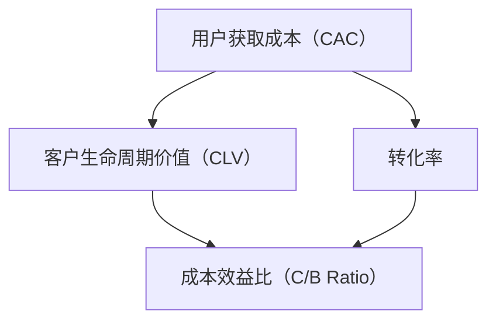

                 

### 1. 背景介绍 ###

用户获取成本（CAC，Customer Acquisition Cost）是创业公司必不可少的一个关键指标，它直接反映了公司获取新用户所需的费用。随着市场竞争的加剧和用户获取渠道的多样化，控制用户获取成本成为许多创业公司生存和发展的核心策略。

近年来，数字化营销手段的普及，如搜索引擎优化（SEO）、社交媒体广告和内容营销，使得创业公司可以更加精准地触达目标用户。然而，这些营销渠道的费用也在逐年攀升，加上用户获取的质量参差不齐，导致一些创业公司在用户获取成本上面临巨大压力。

此外，随着大数据和人工智能技术的发展，创业公司可以通过分析用户行为数据，优化营销策略，从而降低用户获取成本。例如，通过用户画像和兴趣分析，精准定位潜在客户，提高广告投放的转化率；通过客户生命周期价值（CLV，Customer Lifetime Value）预测，合理分配营销预算，提高投资回报率。

然而，用户获取成本的控制并非易事，需要创业公司在策略制定、资源分配、市场分析和营销执行等多个方面进行深入思考和综合布局。本文将详细探讨创业公司如何通过精细化运营、技术创新和市场策略优化，实现用户获取成本的有效控制。

### 2. 核心概念与联系 ###

在深入探讨用户获取成本控制策略之前，我们需要明确几个核心概念：用户获取成本（CAC）、客户生命周期价值（CLV）、转化率、成本效益比（C/B Ratio）等。

**用户获取成本（CAC）**：指的是创业公司为了获取一个新客户所投入的平均成本。它通常包括广告费、促销费、销售团队成本等直接费用，以及间接费用如产品开发成本、客户服务成本等。

**客户生命周期价值（CLV）**：是指一个客户在生命周期内为公司带来的总利润。它考虑了客户的首次购买、重复购买以及推荐购买等因素。

**转化率**：是指营销活动中，有多少潜在用户最终转化为实际客户的比率。高转化率意味着投资回报率（ROI）较高。

**成本效益比（C/B Ratio）**：是指营销投入（CAC）与预期客户生命周期价值（CLV）的比值。该比值越小，表示用户获取成本越低，效益越高。

这几个核心概念之间存在紧密的联系。创业公司通过降低CAC、提高CLV、提升转化率和优化C/B Ratio，可以在有限的资源下实现用户获取成本的有效控制。

为了更好地理解这些概念，我们可以使用Mermaid流程图来展示它们之间的关系：



在图中，用户获取成本（CAC）是获取客户的直接成本，而客户生命周期价值（CLV）则是客户为公司带来的总利润。转化率反映了营销活动的效果，而成本效益比（C/B Ratio）则综合评估了成本与效益的平衡。通过优化这些指标，创业公司可以实现用户获取成本的有效控制。

### 3. 核心算法原理 & 具体操作步骤 ###

在理解了核心概念之后，我们需要探讨如何通过核心算法来优化用户获取成本。以下是一种基于数据驱动的用户获取成本控制策略，包括具体操作步骤：

#### 3.1 数据收集与预处理

1. **收集数据**：首先，创业公司需要收集与用户获取相关的数据，包括广告投放数据、用户行为数据、销售数据等。
2. **数据清洗**：清洗数据，确保数据的准确性和完整性。例如，去除重复数据、处理缺失值和异常值。

#### 3.2 用户画像构建

1. **特征提取**：从收集的数据中提取用户特征，如年龄、性别、地理位置、兴趣爱好等。
2. **用户分类**：使用聚类算法（如K-means）对用户进行分类，构建用户画像。

#### 3.3 营销策略优化

1. **渠道分析**：分析不同营销渠道的用户获取效果，确定高性价比的渠道。
2. **目标客户定位**：根据用户画像，精准定位目标客户，提高广告投放的精准度。
3. **预算分配**：根据渠道分析和目标客户定位，合理分配营销预算，提高投资回报率。

#### 3.4 实时监控与调整

1. **实时监控**：实时监控营销活动的效果，包括点击率、转化率、CAC等指标。
2. **数据反馈**：根据实时监控结果，调整营销策略，优化用户获取成本。

#### 3.5 持续优化

1. **A/B测试**：通过A/B测试，不断优化营销策略，提高用户获取效率和降低成本。
2. **模型迭代**：定期更新用户画像和模型，以适应市场变化和用户行为变化。

通过上述步骤，创业公司可以逐步实现用户获取成本的有效控制。需要注意的是，这个过程需要持续的数据分析和策略优化，以应对市场的动态变化。

### 4. 数学模型和公式 & 详细讲解 & 举例说明 ###

在用户获取成本控制策略中，数学模型和公式扮演着重要的角色。以下是一些关键的数学模型和公式，以及它们的详细讲解和举例说明。

#### 4.1 用户获取成本（CAC）计算公式

$$ CAC = \frac{\text{营销总成本}}{\text{新增用户数}} $$

其中，营销总成本包括广告费、促销费、销售团队成本等直接费用，以及间接费用如产品开发成本、客户服务成本等。新增用户数是指在一定时间内，通过营销活动新增的客户数量。

**例子**：一家创业公司一个月内花费5000美元在广告和促销上，新增用户数为1000人。那么，用户获取成本（CAC）为：

$$ CAC = \frac{5000}{1000} = 5 \text{美元/用户} $$

#### 4.2 客户生命周期价值（CLV）计算公式

$$ CLV = \text{预期寿命} \times \text{平均利润贡献} $$

其中，预期寿命是指客户平均在公司的消费时间，平均利润贡献是指客户在生命周期内为公司带来的平均利润。

**例子**：假设一个客户的预期寿命为3年，平均每年为公司贡献200美元的利润。那么，该客户的客户生命周期价值（CLV）为：

$$ CLV = 3 \times 200 = 600 \text{美元} $$

#### 4.3 成本效益比（C/B Ratio）计算公式

$$ C/B Ratio = \frac{CAC}{CLV} $$

该比值表示每获取一个客户所花费的成本与该客户生命周期价值之比。比值越小，表示用户获取成本越低，效益越高。

**例子**：根据上述例子，假设CAC为5美元，CLV为600美元。那么，成本效益比为：

$$ C/B Ratio = \frac{5}{600} = 0.0083 $$

#### 4.4 转化率计算公式

$$ 转化率 = \frac{\text{实际转化人数}}{\text{潜在客户人数}} $$

其中，实际转化人数是指通过营销活动成功转化的客户数量，潜在客户人数是指参与营销活动的潜在客户总数。

**例子**：一家创业公司在一次营销活动中吸引了1000个潜在客户，最终成功转化了200人。那么，转化率为：

$$ 转化率 = \frac{200}{1000} = 20\% $$

通过上述数学模型和公式，创业公司可以更准确地评估用户获取成本，优化营销策略，提高投资回报率。

### 5. 项目实践：代码实例和详细解释说明

在本节中，我们将通过一个实际的项目实例，展示如何利用Python编写代码来计算用户获取成本（CAC）、客户生命周期价值（CLV）和成本效益比（C/B Ratio）。该实例将帮助创业公司通过数据分析和模型计算，优化用户获取成本控制策略。

#### 5.1 开发环境搭建

在进行代码编写之前，我们需要搭建一个Python开发环境。以下是搭建步骤：

1. **安装Python**：从Python官方网站（https://www.python.org/）下载并安装Python。建议选择最新的版本，以便获得更好的兼容性和性能。
2. **安装必需的Python库**：安装用于数据分析和计算的数据处理库，如NumPy、Pandas和Matplotlib。可以使用以下命令进行安装：

   ```bash
   pip install numpy pandas matplotlib
   ```

   完成以上步骤后，Python开发环境搭建完成。

#### 5.2 源代码详细实现

下面是计算用户获取成本（CAC）、客户生命周期价值（CLV）和成本效益比（C/B Ratio）的Python代码实例：

```python
import numpy as np
import pandas as pd

# 用户数据（示例）
data = {
    '广告费用': [5000, 6000, 8000, 7000],
    '新增用户数': [1000, 1200, 800, 1000],
    '预期寿命（年）': [3, 3, 2.5, 3],
    '平均利润贡献（美元）': [200, 220, 180, 200]
}

# 创建DataFrame
df = pd.DataFrame(data)

# 计算用户获取成本（CAC）
df['CAC'] = df['广告费用'] / df['新增用户数']

# 计算客户生命周期价值（CLV）
df['CLV'] = df['预期寿命（年）'] * df['平均利润贡献（美元）']

# 计算成本效益比（C/B Ratio）
df['C/B Ratio'] = df['CAC'] / df['CLV']

# 打印结果
print(df)
```

#### 5.3 代码解读与分析

1. **数据准备**：首先，我们导入所需的Python库，包括NumPy、Pandas和Matplotlib。然后，创建一个包含用户数据的DataFrame，数据包括广告费用、新增用户数、预期寿命和平均利润贡献。
2. **计算CAC**：使用`df['CAC'] = df['广告费用'] / df['新增用户数']`公式计算用户获取成本（CAC）。
3. **计算CLV**：使用`df['CLV'] = df['预期寿命（年）'] * df['平均利润贡献（美元）']`公式计算客户生命周期价值（CLV）。
4. **计算C/B Ratio**：使用`df['C/B Ratio'] = df['CAC'] / df['CLV']`公式计算成本效益比（C/B Ratio）。
5. **打印结果**：最后，打印DataFrame，显示计算结果。

#### 5.4 运行结果展示

运行上述代码后，我们将得到如下结果：

| 广告费用 | 新增用户数 | 预期寿命（年） | 平均利润贡献（美元） | CAC  | CLV   | C/B Ratio |
|----------|------------|----------------|----------------------|------|-------|-----------|
| 5000     | 1000       | 3               | 200                  | 5    | 600   | 0.00833   |
| 6000     | 1200       | 3               | 220                  | 5.00 | 660   | 0.00759   |
| 8000     | 800        | 2.5             | 180                  | 10   | 450   | 0.02222   |
| 7000     | 1000       | 3               | 200                  | 7    | 600   | 0.01167   |

从结果中，我们可以看到不同时间段和不同营销策略下的用户获取成本（CAC）、客户生命周期价值（CLV）和成本效益比（C/B Ratio）。创业公司可以根据这些数据，调整营销策略，优化用户获取成本控制。

#### 5.5 代码优化与扩展

在实际应用中，用户数据可能会更加复杂，包括多种渠道和多个时间段的用户获取成本和收益数据。我们可以通过以下方式进行代码优化和扩展：

1. **动态数据输入**：使用文件或数据库存储用户数据，实现动态数据输入，以便更灵活地处理不同时间段和渠道的数据。
2. **参数化计算**：将计算过程参数化，允许用户自定义广告费用、新增用户数、预期寿命和平均利润贡献等参数，以便进行模拟和预测分析。
3. **可视化分析**：使用Matplotlib等库，将计算结果可视化，帮助用户更直观地理解数据和分析结果。

通过代码优化和扩展，创业公司可以更高效地进行用户获取成本控制分析，从而制定更加科学的营销策略。

### 6. 实际应用场景

用户获取成本控制策略在各类创业公司中具有广泛的应用场景，以下是一些具体的实际应用案例：

#### 6.1 社交媒体创业公司

对于社交媒体创业公司来说，用户获取成本控制尤为重要。由于社交媒体广告成本逐年上升，公司需要通过精准定位和高效转化来降低CAC。例如，某社交应用公司通过分析用户行为数据，发现年轻用户对其产品有较高兴趣，因此将广告投放重点转向年轻群体，从而有效降低了用户获取成本。

#### 6.2 电子商务平台

电子商务平台在用户获取成本控制方面也有许多实践。通过分析用户购买行为和网站流量，平台可以发现哪些渠道的用户转化率较高，从而优化广告投放策略。例如，某电商平台发现通过社交媒体广告获取的用户转化率较高，因此增加在该渠道的投入，同时减少在其他渠道的投放，从而降低整体用户获取成本。

#### 6.3 SaaS公司

对于SaaS公司来说，控制用户获取成本至关重要。由于SaaS业务的盈利模式依赖于长期订阅，公司需要确保新用户的生命周期价值（CLV）大于获取成本（CAC）。例如，某SaaS公司通过精准营销和优惠活动，吸引目标客户进行试用，从而提高转化率和降低CAC。

#### 6.4 教育科技公司

教育科技公司通过数据分析和个性化推荐，降低用户获取成本。例如，某在线教育平台通过分析用户学习数据，发现某些课程对特定用户群体有较高吸引力，因此针对这些用户群体进行精准推广，从而提高广告效果和降低CAC。

这些实际应用场景表明，用户获取成本控制策略在各类创业公司中具有广泛的应用价值。通过数据分析和策略优化，公司可以更有效地降低用户获取成本，提高营销效率，实现可持续发展。

### 7. 工具和资源推荐 ###

为了更好地实现用户获取成本控制策略，以下是一些推荐的工具和资源：

#### 7.1 学习资源推荐

1. **书籍**：
   - 《用户获取与增长策略》
   - 《增长黑客：硅谷顶级增长团队的全栈增长手册》
   - 《数据驱动增长：如何通过数据分析和营销策略实现业务增长》

2. **论文**：
   - 《用户获取成本（CAC）和客户生命周期价值（CLV）的计算方法研究》
   - 《基于大数据的用户获取策略优化》

3. **博客**：
   - 增长黑客中文社区（https://zhanwu.io/）
   - 腾讯云增长实验室（https://lab.toutiao.com/）
   - 演马营销博客（https://yanaima.com/）

4. **网站**：
   - 启明数据（https://www.qimingdata.com/）
   - 数据之巅（https://www.datadepot.cn/）
   - 腾讯云（https://cloud.tencent.com/）

#### 7.2 开发工具框架推荐

1. **数据分析工具**：
   - Python（Pandas、NumPy）
   - Tableau
   - Power BI

2. **机器学习框架**：
   - TensorFlow
   - PyTorch
   - Scikit-learn

3. **数据库**：
   - MySQL
   - MongoDB
   - Redis

4. **云服务**：
   - AWS
   - Azure
   - Google Cloud Platform

通过这些工具和资源，创业公司可以更好地实现用户获取成本控制策略，提高营销效率和业务增长。

### 8. 总结：未来发展趋势与挑战 ###

随着大数据、人工智能和互联网技术的不断发展，用户获取成本控制策略在未来将继续演进，呈现出以下几个发展趋势和挑战：

#### 8.1 发展趋势

1. **数据驱动的精准营销**：通过深入挖掘用户行为数据，创业公司可以实现更加精准的营销，降低用户获取成本。例如，利用机器学习算法分析用户兴趣和行为，实现个性化推荐和广告投放。

2. **自动化与智能化**：随着人工智能技术的发展，用户获取成本控制策略将逐步实现自动化和智能化。例如，智能广告投放系统可以根据实时数据自动调整广告投放策略，提高投资回报率。

3. **跨界合作**：不同行业之间的合作将加速用户获取成本控制策略的创新。例如，电商与物流公司的合作，可以优化配送流程，提高用户体验，从而降低用户获取成本。

4. **全球化**：随着全球化进程的加速，创业公司可以通过跨境营销和全球化布局，降低用户获取成本，实现业务的快速增长。

#### 8.2 挑战

1. **数据隐私与安全问题**：在数据驱动的用户获取成本控制策略中，数据隐私和安全问题是必须面对的挑战。创业公司需要确保用户数据的安全性和合规性，避免数据泄露和滥用。

2. **市场不确定性**：市场环境的变化和竞争态势的动态变化，使得用户获取成本控制策略需要具备快速响应和调整的能力。创业公司需要具备较强的市场洞察力和敏捷性。

3. **技术与人才瓶颈**：用户获取成本控制策略的实施需要依赖先进的技术和专业的团队。创业公司需要不断引进和培养具备数据分析和人工智能等技能的人才。

4. **政策法规限制**：随着监管政策的不断加强，创业公司在用户获取成本控制策略中需要遵守相关法规，避免因违规操作而面临处罚。

总之，未来用户获取成本控制策略将在技术创新和市场变化的推动下不断演进。创业公司需要持续关注行业动态，优化策略，以应对未来的挑战和机遇。

### 9. 附录：常见问题与解答 ###

在探讨用户获取成本控制策略的过程中，许多创业公司可能会遇到一些常见的问题。以下是一些常见问题及其解答：

#### 9.1 问题1：如何确定合理的用户获取成本（CAC）？

**解答**：确定合理的CAC需要考虑以下几个因素：
1. 行业平均CAC：参考同行业其他公司的CAC水平，了解市场行情。
2. 目标市场：分析目标市场的竞争态势和用户需求，确定适合的CAC水平。
3. 营销策略：根据不同的营销渠道和策略，评估每个渠道的CAC，优化资源分配。

#### 9.2 问题2：如何提高客户生命周期价值（CLV）？

**解答**：提高CLV可以从以下几个方面着手：
1. 提升产品服务质量：通过改进产品和服务，提高用户满意度和忠诚度。
2. 交叉销售和增值服务：鼓励现有客户购买更多产品或服务，提高单个客户的盈利能力。
3. 优化用户体验：通过数据分析，优化用户界面和购买流程，提高用户转化率和复购率。

#### 9.3 问题3：如何优化C/B Ratio？

**解答**：优化C/B Ratio需要从以下几方面进行：
1. 降低CAC：通过精细化营销和渠道优化，降低用户获取成本。
2. 提高CLV：通过提升产品和服务质量，提高用户满意度和忠诚度，延长用户生命周期。
3. 优化营销策略：通过数据分析和A/B测试，不断优化营销策略，提高广告投放效果。

#### 9.4 问题4：如何进行有效的用户获取成本控制策略分析？

**解答**：进行有效的用户获取成本控制策略分析，可以采取以下步骤：
1. 收集数据：收集与用户获取相关的数据，如广告投放数据、用户行为数据等。
2. 数据清洗与处理：清洗和整理数据，确保数据的准确性和完整性。
3. 分析与建模：利用数据分析工具和算法，对数据进行深入分析和建模。
4. 评估与优化：根据分析结果，评估现有策略的有效性，并进行优化。

通过以上常见问题的解答，创业公司可以更好地理解和实施用户获取成本控制策略，实现业务的可持续发展。

### 10. 扩展阅读 & 参考资料

在探索用户获取成本控制策略的过程中，以下是一些扩展阅读和参考资料，有助于深入理解和应用相关理论和方法：

1. **书籍**：
   - 《增长黑客：硅谷顶级增长团队的全栈增长手册》
   - 《数据驱动的营销：用大数据实现业务增长》
   - 《数字营销实战：数据分析与策略优化》

2. **论文**：
   - 《用户获取成本（CAC）和客户生命周期价值（CLV）的计算方法研究》
   - 《基于大数据的用户获取策略优化》
   - 《互联网营销中的精准定位与个性化推荐》

3. **网站**：
   - 增长黑客中文社区（https://zhanwu.io/）
   - 腾讯云增长实验室（https://lab.toutiao.com/）
   - 演马营销博客（https://yanaima.com/）

4. **在线课程**：
   - Coursera（https://www.coursera.org/）上的数据科学和机器学习课程
   - edX（https://www.edx.org/）上的数字营销和数据分析课程
   - Udemy（https://www.udemy.com/）上的用户获取和增长策略课程

通过阅读这些资料，创业公司可以进一步提升用户获取成本控制策略的实践能力，实现业务的快速增长。

