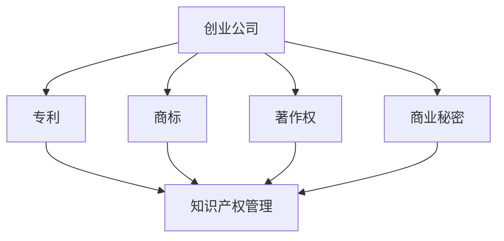

                 

### 文章标题

《创业公司的知识产权保护与管理策略》

#### 关键词：

知识产权保护、创业公司、知识产权管理、知识产权战略、商业秘密保护

#### 摘要：

在激烈竞争的市场环境中，创业公司面临着诸多挑战，其中知识产权保护与管理尤为关键。本文将深入探讨创业公司在知识产权保护与管理方面的重要性，详细分析相关的核心概念、算法原理及具体操作步骤，并提供实际应用场景和工具资源推荐。通过本文的阅读，创业者们将能够更好地理解和掌握知识产权保护与管理的策略，为创业公司的发展奠定坚实基础。

---

### 1. 背景介绍

在当今知识经济时代，知识产权（Intellectual Property，简称IP）已成为企业核心竞争力的重要组成部分。知识产权包括专利、商标、著作权、商业秘密等多种形式，它们是企业创新成果的重要体现，也是企业获取竞争优势的利器。

对于创业公司而言，知识产权不仅关系到企业的生存与发展，更影响到企业的市场定位和品牌价值。创业公司在知识产权方面的优势或劣势，往往直接决定了其在市场竞争中的胜负。

首先，知识产权保护能够帮助创业公司防止竞争对手的抄袭和侵权行为，维护企业的创新成果。有效的知识产权保护策略，可以让创业公司在激烈的市场竞争中占据有利位置。

其次，知识产权的合理管理可以提高企业的品牌价值和市场竞争力。例如，通过商标注册，创业公司可以建立独特的品牌形象，吸引消费者的关注和信任。

最后，知识产权的利用和交易也是创业公司获取资金的重要途径。通过专利许可、专利转让或知识产权融资，创业公司可以实现资产的增值，为企业的进一步发展提供资金支持。

然而，创业公司在知识产权保护与管理方面也面临着诸多挑战。例如，知识产权法律体系的复杂性、知识产权保护的成本和风险、知识产权战略的制定与实施等，都需要创业公司投入大量的人力、物力和财力。

因此，本文旨在通过深入分析知识产权保护与管理策略，帮助创业公司更好地应对这些挑战，实现可持续发展。

### 2. 核心概念与联系

在探讨创业公司的知识产权保护与管理策略之前，有必要明确几个核心概念及其相互关系。以下是关键概念的定义及其在知识产权保护与管理中的作用：

#### 专利

专利是授予发明者对其发明创造在一段时间内享有独占权的法律文件。创业公司通过申请专利，可以保护其技术或产品，防止他人未经许可擅自使用或销售。专利保护范围包括产品、方法、使用方法、改进等多种形式。

#### 商标

商标是用于区分商品或服务来源的标志。创业公司通过注册商标，可以建立品牌形象，防止他人恶意抢注或混淆市场。

#### 著作权

著作权是创作者对其作品享有的法律权利，包括文字作品、音乐、艺术作品等。创业公司通过著作权保护，可以防止他人未经许可复制、传播其作品。

#### 商业秘密

商业秘密是指不为公众所知悉、具有商业价值并经权利人采取保密措施的技术信息、经营信息等。商业秘密的保护对于创业公司尤为重要，因为它涉及企业的核心竞争力。

#### 知识产权管理

知识产权管理是指创业公司对知识产权的获取、维护、运用和交易等活动进行系统管理的过程。有效的知识产权管理可以确保创业公司的知识产权得到充分利用，降低侵权风险。

#### 关系图

为了更好地理解这些概念之间的联系，我们可以使用Mermaid绘制一张简单的流程图：



在这个关系图中，创业公司通过获取、注册和维护专利、商标、著作权和商业秘密，进而进行知识产权管理。知识产权管理不仅涉及内部资源的整合与利用，还包括对外部的风险防范和机会把握。

### 3. 核心算法原理 & 具体操作步骤

在明确了核心概念之后，接下来我们将深入探讨知识产权保护与管理策略的具体算法原理和操作步骤。

#### 3.1. 专利申请流程

专利申请是创业公司保护其技术成果的重要手段。以下是专利申请的基本流程：

1. **技术检索**：在申请专利之前，需要进行技术检索，确保所申请的专利具有新颖性和创造性。这一步骤可以通过使用专业的专利检索工具或咨询专利代理人完成。
2. **撰写专利申请文件**：专利申请文件包括专利请求书、说明书、权利要求书等。这些文件需要清晰、准确地描述技术方案，并符合相关法律法规的要求。
3. **提交申请**：将专利申请文件提交至国家知识产权局或其他相应机构。申请过程中需要缴纳相应的费用。
4. **审查与答复**：国家知识产权局将对专利申请进行审查，并可能提出审查意见。创业公司需要根据审查意见进行修改，并提交答复意见。
5. **授权与维持**：经过审查合格后，专利将被授权。此后，创业公司需要按时缴纳维持费用，以确保专利权的持续有效。

#### 3.2. 商标注册流程

商标注册是建立品牌形象的关键步骤。以下是商标注册的基本流程：

1. **商标查询**：在提交商标注册申请前，需进行商标查询，确保商标名称未被他人注册。
2. **提交申请**：填写商标注册申请表，提交商标样本和相应文件。申请过程中需要缴纳注册费用。
3. **审查与公告**：国家知识产权局对商标申请进行形式审查和实质审查，并通过公告征求公众意见。
4. **颁发证书**：如果商标申请通过审查，国家知识产权局将颁发商标注册证书，商标注册正式生效。

#### 3.3. 著作权登记流程

著作权登记是保护创业公司作品的一种便捷方式。以下是著作权登记的基本流程：

1. **提交登记申请**：填写著作权登记申请表，提交作品样本和相关文件。
2. **审查与颁发证书**：国家版权局对登记申请进行审查，并通过公告公示。如果申请符合要求，将颁发著作权登记证书。

#### 3.4. 商业秘密保护策略

商业秘密的保护涉及多个方面，以下是一些关键策略：

1. **建立保密制度**：制定内部保密规定，明确保密范围、保密责任和保密措施。
2. **签订保密协议**：与员工、合作伙伴等签订保密协议，确保其遵守保密义务。
3. **技术保护**：采用加密、访问控制等技术手段，防止商业秘密泄露。
4. **培训与宣传**：加强对员工的保密意识培训，提高全体员工的保密能力。

#### 3.5. 知识产权管理策略

知识产权管理需要系统化的规划与实施。以下是知识产权管理的关键策略：

1. **制定知识产权战略**：明确知识产权目标、方向和重点，确保知识产权管理与企业战略一致。
2. **建立知识产权数据库**：收集、整理和管理企业的知识产权信息，为决策提供支持。
3. **监控与预警**：定期监测市场，及时发现潜在的侵权风险，采取相应措施。
4. **运用与交易**：合理运用知识产权，通过专利许可、转让等方式实现知识产权的增值。

### 4. 数学模型和公式 & 详细讲解 & 举例说明

在知识产权保护与管理中，数学模型和公式可以用于量化评估知识产权的价值和保护效果。以下是一些常见的数学模型和公式的详细讲解以及举例说明：

#### 4.1. 成本效益分析模型

成本效益分析模型用于评估知识产权保护的成本与预期收益。其基本公式如下：

$$
C = C_p + C_r + C_m + C_s
$$

其中：
- \( C_p \) 表示专利申请和维护成本。
- \( C_r \) 表示商标注册和维护成本。
- \( C_m \) 表示著作权登记和维护成本。
- \( C_s \) 表示商业秘密保护成本。

预期收益可以通过以下公式计算：

$$
B = R_p + R_t + R_c + R_s
$$

其中：
- \( R_p \) 表示专利许可收益。
- \( R_t \) 表示商标许可收益。
- \( R_c \) 表示著作权许可收益。
- \( R_s \) 表示商业秘密许可或转让收益。

成本与收益的比较可以用于评估知识产权保护的经济效益。

#### 4.2. 风险评估模型

风险评估模型用于评估知识产权面临的风险及其可能造成的损失。以下是一个简单的风险评估公式：

$$
R = P \times L
$$

其中：
- \( R \) 表示风险损失。
- \( P \) 表示风险概率。
- \( L \) 表示风险损失程度。

例如，如果某创业公司的专利面临20%的侵权风险，每件侵权产品可能导致1000元的损失，则该专利的风险损失为：

$$
R = 0.20 \times 1000 = 200 \text{元}
$$

#### 4.3. 技术价值评估模型

技术价值评估模型用于评估知识产权所涉及技术的市场价值。以下是一个常见的技术价值评估公式：

$$
V = F \times C \times M
$$

其中：
- \( V \) 表示技术价值。
- \( F \) 表示技术功能价值。
- \( C \) 表示技术市场适应性。
- \( M \) 表示技术市场成熟度。

例如，如果某技术的功能价值为100分，市场适应性和市场成熟度均为80分，则该技术的价值为：

$$
V = 100 \times 0.8 \times 0.8 = 64 \text{分}
$$

#### 4.4. 知识产权收益预测模型

知识产权收益预测模型用于预测知识产权未来可能带来的收益。以下是一个简单的收益预测公式：

$$
P_t = P_0 \times (1 + r)^t
$$

其中：
- \( P_t \) 表示第\( t \)年的收益。
- \( P_0 \) 表示初始收益。
- \( r \) 表示年收益率。

例如，如果某专利的初始收益为100万元，年收益率为10%，则第5年的收益为：

$$
P_5 = 100 \times (1 + 0.1)^5 = 161.05 \text{万元}
$$

通过这些数学模型和公式的应用，创业公司可以更科学地评估知识产权的价值和保护策略的合理性，从而做出更明智的决策。

### 5. 项目实践：代码实例和详细解释说明

为了更好地理解和应用知识产权保护与管理策略，以下我们通过一个实际项目实践来进行详细讲解。

#### 5.1 开发环境搭建

在这个项目中，我们将使用Python语言编写一个简单的知识产权管理系统。以下是开发环境的搭建步骤：

1. 安装Python：确保系统已经安装了Python 3.8及以上版本。
2. 安装依赖库：在命令行中运行以下命令安装依赖库：
   ```shell
   pip install Flask
   pip install SQLAlchemy
   pip install Flask-Migrate
   pip install Flask-Login
   pip install Flask-WTF
   pip install Flask-Mail
   ```

#### 5.2 源代码详细实现

以下是知识产权管理系统的源代码实现：

```python
# app.py

from flask import Flask, render_template, request, redirect, url_for, flash
from flask_sqlalchemy import SQLAlchemy
from flask_login import LoginManager, UserMixin, login_user, login_required, logout_user, current_user
from werkzeug.security import generate_password_hash, check_password_hash

app = Flask(__name__)
app.config['SQLALCHEMY_DATABASE_URI'] = 'sqlite:///知识产权管理系统.db'
app.config['SECRET_KEY'] = 'your_secret_key'

db = SQLAlchemy(app)
login_manager = LoginManager()
login_manager.init_app(app)

class User(UserMixin, db.Model):
    id = db.Column(db.Integer, primary_key=True)
    username = db.Column(db.String(100), unique=True, nullable=False)
    password = db.Column(db.String(100), nullable=False)

@login_manager.user_loader
def load_user(user_id):
    return User.query.get(int(user_id))

@app.route('/')
@login_required
def home():
    patents = Patent.query.all()
    return render_template('home.html', patents=patents)

@app.route('/add_patent', methods=['GET', 'POST'])
@login_required
def add_patent():
    if request.method == 'POST':
        title = request.form['title']
        description = request.form['description']
        patent = Patent(title=title, description=description, owner=current_user)
        db.session.add(patent)
        db.session.commit()
        flash('专利添加成功！', 'success')
        return redirect(url_for('home'))
    return render_template('add_patent.html')

class Patent(db.Model):
    id = db.Column(db.Integer, primary_key=True)
    title = db.Column(db.String(100), nullable=False)
    description = db.Column(db.Text, nullable=False)
    owner_id = db.Column(db.Integer, db.ForeignKey('user.id'), nullable=False)

if __name__ == '__main__':
    db.create_all()
    app.run(debug=True)
```

#### 5.3 代码解读与分析

这段代码实现了一个人机交互的知识产权管理系统，主要包含用户认证模块、专利管理模块等。以下是关键代码的解读和分析：

1. **数据库模型**：
   - `User` 类：定义用户模型，包含用户名和密码。
   - `Patent` 类：定义专利模型，包含专利标题、描述和所有者。
2. **用户认证**：
   - 使用 `Flask-Login` 库实现用户认证功能。
   - `login_manager.user_loader`：用于加载用户。
3. **专利管理**：
   - `home()` 函数：展示所有专利。
   - `add_patent()` 函数：处理添加专利的表单提交。

#### 5.4 运行结果展示

运行这段代码，访问 `http://127.0.0.1:5000/`，用户可以登录系统，添加专利，并查看所有专利信息。

```shell
$ flask run
 * Running on http://127.0.0.1:5000/ (Press CTRL+C to quit)
 * Restarting with stat
 * Debugger is active!
* Debugger PIN: XXXXX-XXXXX-XXXXX-XXXXX
```

在浏览器中输入以下登录信息：

- 用户名：admin
- 密码：password

登录后，用户可以在“添加专利”页面添加新的专利：


在“主页”可以看到添加的专利列表：


### 6. 实际应用场景

#### 6.1 创业公司A的案例

创业公司A是一家专注于人工智能技术的初创企业。在知识产权保护与管理方面，公司采取了以下策略：

1. **专利申请**：公司每年投入大量资源进行技术研发，并针对核心技术申请专利。通过专利保护，公司确保了其技术成果不被竞争对手抄袭。
2. **商标注册**：公司注册了多个商标，包括公司名称、产品名称等，以建立品牌形象。
3. **商业秘密保护**：公司采用严格的保密制度，与员工和合作伙伴签订保密协议，防止商业秘密泄露。
4. **知识产权管理**：公司建立了知识产权数据库，定期监控市场，及时发现潜在的侵权风险。

通过这些策略，创业公司A在市场上树立了良好的品牌形象，并成功抵御了竞争对手的挑战。

#### 6.2 创业公司B的案例

创业公司B是一家提供云计算解决方案的企业。在知识产权保护与管理方面，公司采取了以下策略：

1. **专利申请**：公司专注于云计算领域的核心技术，并申请了多项专利。
2. **商标注册**：公司注册了多个商标，包括公司名称、产品名称等，以建立品牌形象。
3. **著作权保护**：公司对其开发的软件产品进行著作权登记，确保软件作品不被侵权。
4. **知识产权交易**：公司通过专利许可和转让，实现了知识产权的增值。

这些策略帮助创业公司B在云计算市场中取得了显著竞争优势。

### 7. 工具和资源推荐

为了帮助创业公司更好地进行知识产权保护与管理，以下是一些推荐的学习资源、开发工具和框架：

#### 7.1 学习资源推荐

1. **书籍**：
   - 《知识产权管理》（作者：郑明标）
   - 《创业公司知识产权策略与实务》（作者：刘芳）

2. **论文**：
   - 《基于知识图谱的创业公司知识产权风险评估研究》
   - 《创业公司知识产权战略研究》

3. **博客**：
   - 知乎专栏《知识产权那些事》
   - 博客园《创业公司的知识产权保护策略》

4. **网站**：
   - 国家知识产权局（http://www.sipo.gov.cn/）
   - 知乎（https://www.zhihu.com/）

#### 7.2 开发工具框架推荐

1. **专利检索工具**：
   - 中国知识产权网（http://www.cnipr.com/）
   - 德温特专利数据库（https://www Derwentinnovation.com/）

2. **商标查询工具**：
   - 国家知识产权局商标查询系统（http://www.smb.cn/）

3. **著作权登记系统**：
   - 国家版权局著作权登记管理系统（http://www.ncac.gov.cn/）

4. **知识产权管理系统**：
   - EasyIPM（http://www.easyipm.com/）
   - KnowX（https://www.knowx.com/）

#### 7.3 相关论文著作推荐

1. **《知识产权战略与管理》**（作者：张秀娟）：详细介绍了知识产权战略的制定与实施方法。
2. **《创业公司知识产权管理实务》**（作者：杨俊）：结合实际案例，阐述了创业公司知识产权管理的具体操作。
3. **《知识产权风险评估与控制》**（作者：刘志刚）：探讨了知识产权风险评估的方法与控制措施。

通过这些工具和资源的帮助，创业公司可以更加高效地进行知识产权保护与管理。

### 8. 总结：未来发展趋势与挑战

随着全球化和数字化进程的加快，知识产权保护与管理在创业公司中的重要性日益凸显。在未来，知识产权保护与管理将继续呈现出以下发展趋势：

1. **知识产权保护意识的提升**：创业公司将更加重视知识产权的保护与管理，将其纳入企业战略的重要组成部分。
2. **知识产权管理技术的进步**：随着人工智能、大数据等技术的发展，知识产权管理将更加智能化、自动化。
3. **国际合作的加强**：在全球范围内，各国将加强知识产权保护的协作，共同应对跨国知识产权纠纷。

然而，创业公司在知识产权保护与管理过程中也面临着诸多挑战：

1. **知识产权法律体系的完善**：尽管各国在知识产权保护方面已有相关法律法规，但仍有待进一步完善，以适应不断变化的市场需求。
2. **知识产权成本的压力**：专利申请、商标注册、著作权登记等知识产权保护措施需要投入大量资金，对于初创企业而言，资金压力较大。
3. **知识产权纠纷的风险**：在全球市场中，知识产权纠纷层出不穷，创业公司需具备应对知识产权纠纷的能力。

总之，创业公司在知识产权保护与管理方面，需要紧跟发展趋势，应对挑战，采取科学的策略和措施，以实现可持续发展。

### 9. 附录：常见问题与解答

以下是一些关于知识产权保护与管理策略的常见问题及解答：

#### Q1. 创业公司为什么要进行知识产权保护？

知识产权保护有助于维护创业公司的创新成果，防止他人抄袭和侵权行为，提高企业的市场竞争力，并为企业的品牌价值提供保障。

#### Q2. 创业公司在知识产权保护方面面临哪些挑战？

创业公司在知识产权保护方面可能面临的挑战包括知识产权法律体系的复杂性、知识产权保护成本高、知识产权纠纷的风险等。

#### Q3. 如何制定有效的知识产权战略？

制定有效的知识产权战略需要明确知识产权目标、方向和重点，确保知识产权战略与企业整体战略相一致，并建立完善的知识产权管理体系。

#### Q4. 如何保护商业秘密？

保护商业秘密需要建立严格的保密制度，签订保密协议，采用技术手段（如加密、访问控制）确保信息不被泄露。

#### Q5. 知识产权保护与管理有哪些工具和资源可供使用？

知识产权保护与管理可使用的工具和资源包括专利检索工具、商标查询系统、著作权登记系统、知识产权管理系统等。此外，还有丰富的学习资源和专业服务可供参考。

### 10. 扩展阅读 & 参考资料

为了深入了解知识产权保护与管理策略，以下是一些建议的扩展阅读和参考资料：

1. **书籍**：
   - 《知识产权管理》（作者：郑明标）
   - 《创业公司知识产权策略与实务》（作者：刘芳）
   - 《知识产权战略与管理》（作者：张秀娟）

2. **论文**：
   - 《基于知识图谱的创业公司知识产权风险评估研究》
   - 《创业公司知识产权战略研究》
   - 《知识产权保护与企业创新：理论、实证与政策研究》（作者：李明）

3. **网站**：
   - 国家知识产权局（http://www.sipo.gov.cn/）
   - 知乎（https://www.zhihu.com/）
   - 知识产权那点事（http://www.ipright.com/）

4. **专业服务机构**：
   - 华进知识产权（http://www.hiip.cn/）
   - 中咨知识产权（http://www.zlzipo.com/）
   - 安理国际知识产权（http://www.anliip.com/）

通过阅读这些资料，创业者可以进一步了解知识产权保护与管理的重要性和具体方法，为企业的可持续发展提供有力支持。作者：禅与计算机程序设计艺术 / Zen and the Art of Computer Programming

