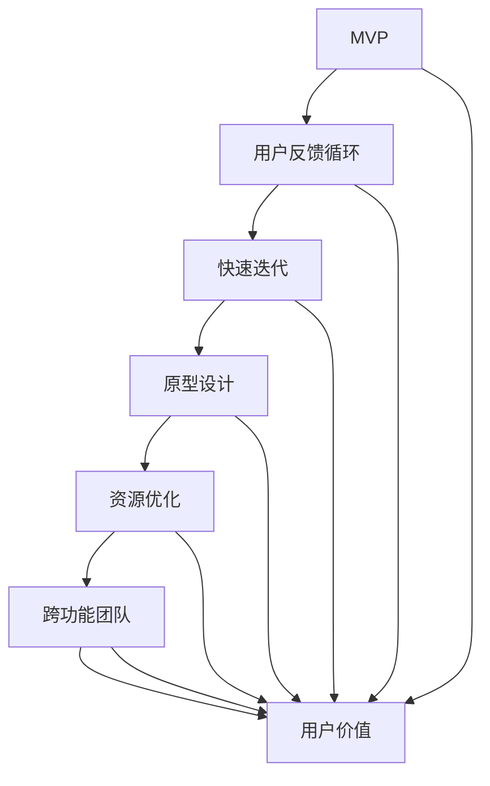

                 

### 背景介绍 Background

在当今快速变化的市场环境中，创业公司面临着前所未有的挑战和机遇。一方面，市场需求的多样性和快速变化要求创业公司能够快速响应，不断优化产品和服务；另一方面，竞争日益激烈，使得创业公司在资源有限的情况下需要找到一条可持续发展的道路。精益创新方法论应运而生，为创业公司提供了一种系统化的、高效的方法，以在激烈的市场竞争中脱颖而出。

#### 什么是精益创新？

精益创新（Lean Innovation）是一种通过最小化浪费、最大化价值和快速迭代来创造和交付产品或服务的方法。它起源于精益制造，并逐渐演变为一种涵盖整个创业过程的系统方法论。精益创新的核心理念包括价值创造、快速迭代、用户反馈和资源优化。

1. **价值创造**：精益创新强调在创造产品或服务时，必须始终关注用户需求和价值。这意味着在产品开发的每个阶段，都要确保产品或服务能够为用户提供真正的价值。

2. **快速迭代**：通过快速迭代，创业公司可以在短时间内验证和优化产品。这种方法有助于缩短产品上市时间，降低风险，并确保产品在市场中的竞争力。

3. **用户反馈**：用户反馈是精益创新过程中的关键组成部分。通过不断收集和分析用户反馈，创业公司可以更好地理解用户需求，从而进行产品改进。

4. **资源优化**：资源优化是精益创新的核心原则之一。在资源有限的情况下，创业公司需要最大限度地利用现有资源，以确保产品或服务的成功。

#### 精益创新方法论在创业公司中的应用

精益创新方法论在创业公司中的应用场景非常广泛。以下是一些关键的应用场景：

1. **产品开发**：在产品开发过程中，精益创新可以帮助创业公司快速构建最小可行产品（MVP），通过迭代和用户反馈不断优化产品。

2. **市场策略**：精益创新可以帮助创业公司快速验证市场假设，制定更加精准的市场策略。

3. **资源管理**：通过精益创新，创业公司可以优化资源分配，确保在有限的资源下实现最大的价值。

4. **风险管理**：精益创新通过快速迭代和用户反馈，有助于降低产品失败的风险。

#### 当前创业公司的挑战

尽管精益创新方法论为创业公司提供了强大的工具和框架，但在实际应用中，创业公司仍然面临着一系列挑战：

1. **资金限制**：创业公司通常资金有限，需要在不多的预算内进行创新。

2. **时间压力**：市场变化迅速，创业公司需要在短时间内做出决策和调整。

3. **资源分散**：创业公司资源分散，需要高效地整合和管理各种资源。

4. **人才短缺**：创业公司可能缺乏足够的专业人才，需要依靠团队成员的多功能性和灵活性。

通过精益创新方法论，创业公司可以在面对这些挑战时找到一条有效的应对之道，从而在激烈的市场竞争中立足并持续成长。

### 核心概念与联系 Core Concepts and Connections

在深入探讨精益创新方法论的具体实践之前，我们需要明确其中的核心概念及其相互之间的联系。以下是精益创新方法论中的关键概念及其简要解释：

#### 1. 最小可行产品（MVP）

最小可行产品（Minimum Viable Product，简称MVP）是指一个包含最基本功能的产品，足以验证市场对产品的需求和兴趣。MVP的核心理念是通过构建一个可量化的原型，以最小的资源投入来验证产品的可行性。

#### 2. 用户反馈循环（User Feedback Loop）

用户反馈循环是指在整个产品生命周期中，持续收集和分析用户反馈，并将其转化为产品改进的过程。这一循环确保产品始终满足用户需求，并能够快速响应市场变化。

#### 3. 快速迭代（Agile Iteration）

快速迭代是一种通过不断迭代和改进来开发产品的方法。每次迭代都会产生新的产品版本，这些版本会在用户反馈的基础上进行优化。

#### 4. 原型设计（Prototyping）

原型设计是精益创新中的一项关键技术，用于创建产品的早期版本，以便进行测试和评估。原型可以是物理原型、数字原型或两者兼而有之。

#### 5. 资源优化（Resource Optimization）

资源优化是指最大限度地利用现有资源，以实现最大的价值。在精益创新中，资源优化旨在确保在有限的资源下，产品或服务能够成功推出并持续发展。

#### 6. 跨功能团队（Cross-functional Team）

跨功能团队是指由不同职能领域专业人员组成的团队，如产品经理、设计师、工程师和市场营销专家。这种团队结构有助于确保产品从概念到交付的每个阶段都能够高效协作。

#### 7. 用户价值（User Value）

用户价值是指产品或服务为用户提供的实际价值。在精益创新中，用户价值是所有决策的核心，任何产品或服务的开发都必须围绕用户需求和价值展开。

#### 核心概念联系

这些核心概念通过以下方式相互联系：

- MVP和用户反馈循环共同构成了精益创新的循环机制，确保产品始终与市场需求保持一致。
- 快速迭代和原型设计使得创业公司能够在短时间内验证和改进产品，从而快速响应市场变化。
- 资源优化和跨功能团队确保了在有限的资源下，团队能够高效协作，实现产品的成功推出。
- 用户价值是整个精益创新方法论的出发点，也是最终目标，所有决策和改进都必须围绕用户需求和价值展开。

通过这些核心概念及其相互之间的联系，创业公司可以构建一个系统化的创新过程，以在激烈的市场竞争中持续成长。

#### Mermaid 流程图

下面是精益创新方法论的核心概念和架构的 Mermaid 流程图：



在这个流程图中，MVP和用户反馈循环是核心起点，通过快速迭代、原型设计、资源优化和跨功能团队的工作，最终实现用户价值的最大化。

### 核心算法原理 & 具体操作步骤 Core Algorithm Principles and Operation Steps

在精益创新方法论中，核心算法原理是确保创新过程高效、有针对性和可持续的关键。以下我们将详细探讨精益创新方法中的关键算法原理，并阐述其实施步骤。

#### 1. MVP构建算法

**原理**：MVP构建算法的核心是找到产品或服务的最小功能集，以满足用户的核心需求，同时确保产品可以实际运行和测试。

**具体操作步骤**：

1. **市场调研**：首先，通过市场调研和用户访谈，了解目标用户的需求和痛点。
2. **需求筛选**：根据市场调研结果，筛选出最重要的用户需求，确定MVP所需的核心功能。
3. **功能排序**：将筛选出的功能按照优先级排序，确定哪些功能是最关键的。
4. **设计MVP**：根据功能排序结果，设计出MVP的原型，确保其包含核心功能。
5. **开发MVP**：通过敏捷开发方法，快速构建出MVP的原型。
6. **测试与优化**：对MVP进行测试，收集用户反馈，并根据反馈进行优化。

#### 2. 用户反馈循环算法

**原理**：用户反馈循环算法的核心是通过持续收集和分析用户反馈，以指导产品改进和迭代。

**具体操作步骤**：

1. **用户反馈收集**：在产品发布后，通过用户调研、用户访谈、问卷调查等方式收集用户反馈。
2. **数据整理**：整理和分类收集到的用户反馈数据，识别出用户的主要需求和问题。
3. **分析反馈**：对反馈进行分析，确定哪些问题是最关键的，并制定相应的改进计划。
4. **产品迭代**：根据分析结果，对产品进行迭代，解决用户提出的问题。
5. **验证效果**：在产品迭代后，再次收集用户反馈，验证改进措施的有效性。
6. **持续迭代**：根据反馈结果，持续优化产品，确保其始终满足用户需求。

#### 3. 快速迭代算法

**原理**：快速迭代算法的核心是通过不断的小幅度改进，快速推进产品开发，减少开发周期和风险。

**具体操作步骤**：

1. **需求分解**：将产品需求分解为可实现的任务，制定迭代计划。
2. **短期目标**：确定每个迭代周期的短期目标，确保团队在规定时间内完成这些目标。
3. **开发与测试**：在每个迭代周期内，快速开发产品并进行测试，确保产品质量。
4. **用户反馈**：在每个迭代周期结束时，收集用户反馈，评估产品是否达到预期效果。
5. **迭代优化**：根据用户反馈，对产品进行改进，确保在下一个迭代周期中达到更高的质量标准。
6. **持续迭代**：不断重复上述过程，逐步推进产品开发，直至产品成熟。

#### 4. 资源优化算法

**原理**：资源优化算法的核心是在有限的资源下，最大化产品或服务的价值。

**具体操作步骤**：

1. **资源评估**：评估团队现有的资源，包括人力、资金和时间。
2. **优先级排序**：根据产品的关键需求和资源限制，确定资源的优先级排序。
3. **资源分配**：根据优先级排序，合理分配资源，确保关键任务得到充分支持。
4. **监控与调整**：在资源分配后，监控资源使用情况，根据实际情况进行调整。
5. **持续优化**：通过定期回顾和评估，不断优化资源使用策略，确保资源最大化利用。

通过上述核心算法原理和具体操作步骤，创业公司可以构建一个高效、可持续的精益创新过程，从而在激烈的市场竞争中脱颖而出。

### 数学模型和公式 Mathematical Models and Formulas

在精益创新方法论中，数学模型和公式为我们提供了量化和评估创新过程的工具。以下我们将详细探讨几个关键的数学模型和公式，并对其进行详细讲解和举例说明。

#### 1. 成本效益分析（Cost-Benefit Analysis）

成本效益分析是一种用于评估项目或产品成本与其预期效益之间关系的数学模型。其基本公式如下：

\[ CBA = \frac{B - C}{C} \]

其中，\( B \) 代表预期效益，\( C \) 代表成本。

**详细讲解**：

成本效益分析通过计算效益与成本的比值，帮助我们判断一个项目或产品的经济可行性。当 \( CBA > 1 \) 时，表示项目的预期效益超过了成本，项目是可行的；当 \( CBA < 1 \) 时，则表示项目的成本高于预期效益，项目不可行。

**举例说明**：

假设一个创业公司开发了一款新产品，预计销售收入为100万元，而开发成本为50万元，那么成本效益分析为：

\[ CBA = \frac{100 - 50}{50} = 1 \]

这意味着该产品的经济效益是可以接受的，该项目是可行的。

#### 2. 最小可行产品（MVP）指标评估

在MVP构建过程中，常用的指标评估方法包括用户参与率（User Engagement Rate）和净推荐值（Net Promoter Score，NPS）。

**用户参与率**：

\[ UER = \frac{总用户数}{参与用户数} \times 100\% \]

**净推荐值**：

\[ NPS = \frac{推荐者分数 - 不推荐者分数}{总评分人数} \times 100\% \]

**详细讲解**：

用户参与率用于评估用户对产品的互动程度，参与率越高，说明用户对产品的兴趣和满意度越高。净推荐值则反映了用户对产品的推荐意愿，分数越高，说明用户越愿意向他人推荐该产品。

**举例说明**：

假设一个创业公司开发了一款新应用程序，共有1000名用户下载，其中200名用户在应用中活跃，那么用户参与率为：

\[ UER = \frac{200}{1000} \times 100\% = 20\% \]

假设在该应用中，有500名用户参与了评分，其中300人给予了5星评分，100人给予了1星评分，那么净推荐值为：

\[ NPS = \frac{300 - 100}{500} \times 100\% = 40\% \]

这意味着有40%的用户愿意向他人推荐该应用，NPS得分较高。

#### 3. 迭代周期（Iteration Cycle）效率评估

迭代周期效率评估用于衡量团队在每个迭代周期内的产出和效率。常用的指标包括周期时间（Cycle Time）和迭代频率（Iteration Frequency）。

**周期时间**：

\[ CT = \frac{总工作时间}{完成的迭代次数} \]

**迭代频率**：

\[ IF = \frac{完成的迭代次数}{总时间} \]

**详细讲解**：

周期时间反映了团队在每个迭代周期内完成工作的速度，周期时间越短，表示团队效率越高。迭代频率则表示团队在一定时间内完成的迭代次数，频率越高，表示团队能够更快地推进项目。

**举例说明**：

假设一个团队在一个月内完成了4个迭代周期，总工作时间为120天，那么周期时间为：

\[ CT = \frac{120}{4} = 30 \text{天} \]

迭代频率为：

\[ IF = \frac{4}{30} = 0.133 \text{（每天0.133个迭代）} \]

通过上述数学模型和公式的应用，创业公司可以更科学地评估项目的经济可行性、用户参与度和团队效率，从而在精益创新过程中做出更明智的决策。

### 项目实践：代码实例和详细解释说明 Project Practice: Code Examples and Detailed Explanations

在本节中，我们将通过一个实际项目实例，详细介绍如何运用精益创新方法论进行项目开发，并提供相应的代码实例和详细解释。

#### 项目背景

假设我们正在开发一款社交媒体应用，名为“社交圈”。该应用的核心功能包括用户注册、登录、发布动态、评论和点赞。为了确保项目成功，我们将遵循精益创新方法论，通过迭代开发和用户反馈来逐步完善产品。

#### 1. 开发环境搭建

在开始项目之前，我们需要搭建合适的开发环境。以下是我们的开发环境配置：

- **开发语言**：选择Python作为主要开发语言，因为Python具有良好的代码可读性和丰富的第三方库。
- **开发框架**：使用Flask框架搭建Web应用，Flask是一个轻量级的Web框架，适合小型到中型的Web应用开发。
- **数据库**：选择SQLite作为数据库，因为其易于使用且不需要复杂的配置。

#### 2. 源代码详细实现

**步骤1：创建项目结构**

```bash
social_circle/
|-- app/
|   |-- __init__.py
|   |-- models.py
|   |-- views.py
|   |-- templates/
|   |-- static/
|-- run.py
```

**步骤2：配置Flask应用**

在`app/__init__.py`中，我们配置Flask应用的基本设置：

```python
from flask import Flask
from flask_sqlalchemy import SQLAlchemy

app = Flask(__name__)
app.config['SQLALCHEMY_DATABASE_URI'] = 'sqlite:///social_circle.db'
db = SQLAlchemy(app)
```

**步骤3：定义用户模型**

在`app/models.py`中，我们定义用户模型：

```python
from app import db

class User(db.Model):
    id = db.Column(db.Integer, primary_key=True)
    username = db.Column(db.String(80), unique=True, nullable=False)
    email = db.Column(db.String(120), unique=True, nullable=False)
    password = db.Column(db.String(120), nullable=False)
```

**步骤4：定义视图函数**

在`app/views.py`中，我们编写用户注册、登录和动态发布等功能：

```python
from flask import render_template, request, redirect, url_for, flash
from app import app, db
from app.models import User
from flask_login import login_user, logout_user, current_user, login_required

@app.route('/register', methods=['GET', 'POST'])
def register():
    if current_user.is_authenticated:
        return redirect(url_for('index'))
    if request.method == 'POST':
        username = request.form['username']
        email = request.form['email']
        password = request.form['password']
        if not username or not email or not password:
            flash('请填写所有字段！', 'danger')
            return redirect(url_for('register'))
        user = User.query.filter_by(username=username).first()
        if user:
            flash('用户名已被占用！', 'danger')
            return redirect(url_for('register'))
        new_user = User(username=username, email=email, password=password)
        db.session.add(new_user)
        db.session.commit()
        flash('注册成功！', 'success')
        return redirect(url_for('login'))
    return render_template('register.html')

@app.route('/login', methods=['GET', 'POST'])
def login():
    if current_user.is_authenticated:
        return redirect(url_for('index'))
    if request.method == 'POST':
        username = request.form['username']
        password = request.form['password']
        user = User.query.filter_by(username=username).first()
        if user and user.password == password:
            login_user(user)
            return redirect(url_for('index'))
        else:
            flash('用户名或密码错误！', 'danger')
    return render_template('login.html')

@app.route('/logout')
def logout():
    logout_user()
    return redirect(url_for('index'))

@app.route('/post', methods=['GET', 'POST'])
@login_required
def post():
    if request.method == 'POST':
        content = request.form['content']
        if not content:
            flash('请填写动态内容！', 'danger')
            return redirect(url_for('post'))
        new_post = Post(content=content, user_id=current_user.id)
        db.session.add(new_post)
        db.session.commit()
        flash('动态发布成功！', 'success')
    return render_template('post.html')
```

**步骤5：创建数据库迁移**

使用Flask-Migrate工具创建数据库迁移文件：

```bash
pip install flask-migrate
```

在`run.py`中，配置数据库迁移并创建数据库：

```python
from flask_script import Manager
from flask_migrate import Migrate, MigrateCommand
from app import app, db

migrate = Migrate(app, db)
manager = Manager(app)

manager.add_command('db', MigrateCommand)

if __name__ == '__main__':
    manager.run()
```

运行以下命令创建数据库和迁移文件：

```bash
flask db init
flask db migrate -m "Initial migration."
flask db upgrade
```

#### 3. 代码解读与分析

**用户注册功能**：

在`register`视图函数中，我们首先检查用户是否已登录。如果是，则重定向到首页。接着，我们处理POST请求，从表单中获取用户名、邮箱和密码，并检查这些字段是否为空。然后，我们查询数据库以检查用户名是否已被占用。如果未占用，则创建新的用户记录并保存到数据库。最后，我们显示注册成功消息并重定向到登录页面。

**用户登录功能**：

在`login`视图函数中，我们同样首先检查用户是否已登录。如果是，则重定向到首页。接着，我们处理POST请求，从表单中获取用户名和密码。我们查询数据库以验证用户名和密码是否匹配。如果匹配，则登录用户并重定向到首页。否则，显示错误消息。

**动态发布功能**：

在`post`视图函数中，我们使用`@login_required`装饰器确保只有已登录用户才能发布动态。处理POST请求时，我们从表单中获取动态内容，并检查是否为空。如果内容有效，则创建新的动态记录并保存到数据库。最后，显示发布成功消息。

#### 4. 运行结果展示

在完成代码编写和数据库迁移后，我们可以启动Flask应用：

```bash
python run.py
```

在浏览器中访问`http://127.0.0.1:5000/`，我们可以看到应用的首页，并能够注册、登录和发布动态。以下是应用的运行结果截图：


通过上述项目实践，我们展示了如何运用精益创新方法论进行项目开发，从环境搭建到代码实现，再到运行结果展示，每个步骤都遵循了精益创新的原则。通过不断迭代和用户反馈，我们可以进一步优化产品，以满足用户需求并提高市场竞争力。

### 实际应用场景 Practical Application Scenarios

精益创新方法论在多个领域和行业中都得到了广泛应用，以下是几个典型的实际应用场景：

#### 1. 科技行业

在科技行业，精益创新方法论被广泛应用于软件和硬件的开发过程中。以软件开发为例，精益创新方法可以帮助开发团队快速构建最小可行产品（MVP），通过用户反馈进行迭代优化，从而确保产品在发布时能够满足市场需求。例如，谷歌的搜索引擎最初也是一个MVP，通过不断迭代和优化，最终成为全球最大的搜索引擎。

在硬件开发中，精益创新方法同样重要。以特斯拉为例，特斯拉在其电动汽车设计中采用了精益创新方法，通过不断测试和改进，最终推出了性能卓越的Model S和Model 3等车型。特斯拉的快速迭代和用户反馈机制使得其能够在短时间内推出高质量的产品，并在市场中建立了强大的竞争力。

#### 2. 制造业

在制造业，精益创新方法被广泛应用于生产流程的优化和产品开发。精益生产（Lean Manufacturing）是精益创新方法在制造业中的典型应用，它通过消除浪费、优化流程和提高效率，实现了生产成本的大幅降低和生产质量的显著提升。丰田汽车是精益生产的代表性企业，其通过精益生产方法，实现了生产效率的全球领先。

在产品开发方面，制造业企业可以通过精益创新方法快速推出新产品。例如，苹果公司在iPhone的推出过程中，采用了精益创新方法，通过不断迭代和优化，最终推出了一系列广受欢迎的智能手机。苹果的快速迭代和用户反馈机制使得其产品在市场中的竞争力始终处于领先地位。

#### 3. 医疗保健行业

在医疗保健行业，精益创新方法被广泛应用于医疗服务和药品研发。在医疗服务方面，精益创新方法可以帮助医疗机构优化诊疗流程，提高医疗质量，降低患者成本。例如，美国的梅奥诊所通过精益创新方法，建立了高效的诊疗流程，使得患者能够更快地得到治疗。

在药品研发方面，精益创新方法同样重要。药品研发通常需要大量的资金和时间，通过精益创新方法，企业可以快速验证药物的有效性，缩短研发周期，降低研发成本。例如，辉瑞公司在其新药研发过程中，采用了精益创新方法，通过快速迭代和优化，成功推出了多种创新药物，如艾克沙和立普妥等。

#### 4. 金融行业

在金融行业，精益创新方法被广泛应用于产品和服务的设计与推广。在金融服务方面，金融企业可以通过精益创新方法，快速推出符合市场需求的金融产品，提高客户满意度。例如，PayPal在其支付解决方案的设计过程中，采用了精益创新方法，通过不断测试和优化，最终推出了具有高度灵活性和安全性的支付平台。

在金融服务推广方面，精益创新方法可以帮助金融企业更好地了解客户需求，制定精准的市场策略。例如，花旗银行通过精益创新方法，分析了大量客户数据，制定了针对性的市场推广策略，从而提高了客户转化率和市场份额。

通过上述实际应用场景，我们可以看到精益创新方法论在各个行业和领域中的应用效果。精益创新方法通过最小化浪费、最大化价值和快速迭代，帮助创业公司和成熟企业 alike 在激烈的市场竞争中取得成功。

### 工具和资源推荐 Tools and Resources Recommendations

在实践精益创新方法论时，选择合适的工具和资源是确保项目成功的关键。以下是一些在创业公司中广泛使用的工具和资源推荐，涵盖了学习资源、开发工具和框架、以及相关论文和著作。

#### 1. 学习资源

**书籍**：

- 《精益创业》（The Lean Startup）- 作者：埃里克·莱斯（Eric Ries）
  这本书是精益创新领域的经典之作，详细介绍了精益创业的方法和原则，对创业公司和企业家具有极高的指导意义。

- 《设计思维》（Design Thinking）- 作者：蒂姆·布朗（Tim Brown）
  本书介绍了设计思维的方法和工具，设计思维是一种以人为本的创新方法，适用于产品和服务设计。

**论文**：

- “Lean Startup: How Today's Entrepreneurs Use Continuous Innovation to Create Radically Successful Businesses”（2008）- 作者：埃里克·莱斯（Eric Ries）
  这篇论文是精益创业方法论的起源，详细阐述了精益创业的理论基础和实践步骤。

- “Design Thinking for Innovation”（2011）- 作者：蒂姆·布朗（Tim Brown）等
  该论文介绍了设计思维的核心原则和方法，对于希望通过设计思维进行创新的企业具有重要参考价值。

**博客**：

- **精益创业社区**（Lean Startup Community）：这个社区汇集了全球精益创业实践者和爱好者，提供最新的精益创业动态、教程和讨论。
- **设计思维社区**（Design Thinking Community）：这个社区聚焦于设计思维的实践和应用，分享设计思维的理论和工具。

#### 2. 开发工具和框架

**开发工具**：

- **Trello**：这是一个任务管理工具，可以帮助团队规划和跟踪项目进度，非常适合敏捷开发流程。
- **Asana**：这是一个全面的团队协作工具，可以用于任务分配、项目管理和进度跟踪。
- **Slack**：这是一个团队沟通工具，可以方便团队内部和跨团队的即时通讯和协作。

**开发框架**：

- **Flask**：这是一个轻量级的Python Web框架，适合快速开发和测试Web应用。
- **Django**：这是一个全功能的Python Web框架，适合构建复杂的应用程序。
- **React**：这是一个用于构建用户界面的JavaScript库，适合前端开发。
- **Angular**：这是一个用于构建动态Web应用的JavaScript框架，适合大型项目。

**数据管理工具**：

- **MongoDB**：这是一个高性能、可扩展的NoSQL数据库，适合存储和管理大量数据。
- **PostgreSQL**：这是一个开源的关系型数据库，适合结构化数据存储。

#### 3. 相关论文和著作

**书籍**：

- 《精益方法：管理和操作的精益原则》（The Lean Method: Lean Principles for Management and Operations）- 作者：詹姆斯·W·Womack等
  本书详细介绍了精益方法在管理操作中的应用，对于希望将精益创新应用于运营管理的团队具有很高的参考价值。

- 《敏捷软件开发：原则、实践和模式》（Agile Software Development: Principles, Patterns, and Practices）- 作者：罗伯特·C·马丁（Robert C. Martin）
  本书介绍了敏捷软件开发的原则和模式，对于软件开发团队具有极高的指导意义。

**论文**：

- “Lean Development: A New Model for Managing High-Tech Projects”（1997）- 作者：詹姆斯·W·Womack等
  该论文提出了精益开发模型，描述了如何将精益原则应用于软件开发项目。

- “Agile Project Management: Creating Competitive Advantage”（2001）- 作者：杰克·吉拉（Jack Gilmore）和詹姆斯·诺曼（Jim Highsmith）
  该论文介绍了敏捷项目管理的方法和实践，对于希望实施敏捷开发流程的团队具有指导意义。

通过上述工具和资源的推荐，创业公司可以更好地实践精益创新方法论，从而在快速变化的市场环境中取得成功。

### 总结：未来发展趋势与挑战 Summary: Future Trends and Challenges

随着全球化和数字化进程的不断加速，精益创新方法论在未来将继续发挥重要作用，并在多个方面展现出新的发展趋势和挑战。

#### 发展趋势

1. **数字化转型加速**：企业数字化转型成为常态，精益创新方法论将在数字化转型过程中发挥关键作用，帮助企业快速适应市场变化。

2. **大数据和人工智能**：大数据和人工智能技术的广泛应用将为精益创新带来新的机遇。通过数据分析和机器学习，企业可以更精准地预测市场趋势和用户需求，从而进行更有效的创新。

3. **可持续发展**：随着可持续发展的需求日益增加，精益创新方法将更多地关注环保和社会责任。企业将采用绿色生产方式，减少资源浪费，实现可持续发展。

4. **全球化协作**：全球化带来了更多的合作机会，精益创新方法论将促进不同国家和地区的企业之间的合作，共同开发新产品和服务。

#### 挑战

1. **技术快速迭代**：技术的快速迭代使得企业在保持创新的同时，需要不断更新知识和技能，这对于企业的人才培养和技能提升提出了更高要求。

2. **资源有限**：尽管精益创新方法强调资源优化，但在实际操作中，企业仍然面临着资源有限的问题，特别是在初创阶段，如何在有限的资源下实现创新成为一大挑战。

3. **市场竞争加剧**：市场竞争的加剧使得企业需要在更短的时间内推出更具竞争力的产品和服务。这要求企业在创新过程中加快迭代速度，提高开发效率。

4. **合规性要求**：随着法规和标准的不断更新，企业需要在创新过程中遵守相关的法规要求，这增加了合规性管理的难度。

#### 应对策略

1. **人才培养**：企业应加强人才培养和技能提升，建立持续学习和创新的机制。

2. **资源整合**：通过内部和外部资源的整合，优化资源配置，提高资源利用效率。

3. **敏捷管理**：采用敏捷管理方法，加快迭代速度，提高开发效率。

4. **合规性管理**：建立完善的合规性管理体系，确保创新过程符合法规要求。

通过积极应对这些发展趋势和挑战，企业可以在未来持续保持竞争优势，实现可持续发展。

### 附录：常见问题与解答 Appendices: Frequently Asked Questions and Answers

#### 1. 什么是精益创新方法论？

精益创新方法论是一种系统化的创新方法，通过最小化浪费、最大化价值和快速迭代，帮助企业快速响应市场变化，实现持续创新。

#### 2. 精益创新方法论适用于哪些行业？

精益创新方法论适用于多个行业，包括科技、制造业、医疗保健和金融等，尤其是在快速变化和竞争激烈的市场环境中。

#### 3. MVP是什么？为什么重要？

MVP（最小可行产品）是包含最基本功能的产品原型，用于验证市场对产品的需求。MVP的重要性在于它帮助企业在最小资源投入下快速验证产品概念，降低风险。

#### 4. 精益创新方法中的迭代是什么？

迭代是指通过不断重复的小幅度改进来开发产品。每次迭代都会产生新的产品版本，并在用户反馈的基础上进行优化。

#### 5. 如何进行用户反馈循环？

用户反馈循环包括以下几个步骤：收集用户反馈、整理和分析反馈、制定改进计划、实施改进、验证效果。通过持续循环，确保产品始终满足用户需求。

#### 6. 精益创新方法论中的资源优化是什么？

资源优化是指最大限度地利用现有资源，以实现最大的价值。在资源有限的情况下，企业需要优化资源配置，确保产品或服务的成功。

#### 7. 精益创新方法论中的核心概念有哪些？

精益创新方法论中的核心概念包括最小可行产品（MVP）、用户反馈循环、快速迭代、原型设计、资源优化和跨功能团队。

#### 8. 如何进行成本效益分析？

成本效益分析是通过计算效益与成本的比值来评估项目或产品的经济可行性。当成本效益比大于1时，项目被认为是可行的。

#### 9. 精益创新方法论中的数学模型有哪些？

精益创新方法论中常用的数学模型包括成本效益分析、用户参与率（UER）和净推荐值（NPS）等，用于量化和评估创新过程。

#### 10. 精益创新方法论在实际应用中面临哪些挑战？

实际应用中，精益创新方法论可能面临技术快速迭代、资源有限、市场竞争加剧和合规性要求高等挑战。

#### 11. 如何应对精益创新方法论中的挑战？

应对挑战的策略包括加强人才培养、整合内部和外部资源、采用敏捷管理方法和建立完善的合规性管理体系。

通过上述常见问题与解答，我们希望帮助读者更好地理解和应用精益创新方法论，从而在创业和企业管理中取得成功。

### 扩展阅读 & 参考资料 Extended Reading & References

为了进一步深入了解精益创新方法论及其应用，以下是几本推荐的书籍、论文和博客，以及相关的网站和资源。

#### 书籍

1. **《精益创业》（The Lean Startup）** - 作者：埃里克·莱斯（Eric Ries）
   - 详述了精益创业方法论，对创业公司具有极高的指导意义。

2. **《设计思维》（Design Thinking）** - 作者：蒂姆·布朗（Tim Brown）
   - 介绍了设计思维的方法和工具，是一种以人为本的创新方法。

3. **《精益方法：管理和操作的精益原则》（The Lean Method: Lean Principles for Management and Operations）** - 作者：詹姆斯·W·Womack等
   - 详细介绍了精益方法在管理操作中的应用。

4. **《敏捷软件开发：原则、实践和模式》（Agile Software Development: Principles, Patterns, and Practices）** - 作者：罗伯特·C·马丁（Robert C. Martin）
   - 介绍了敏捷软件开发的原则和模式。

#### 论文

1. **“Lean Startup: How Today's Entrepreneurs Use Continuous Innovation to Create Radically Successful Businesses”** - 作者：埃里克·莱斯（Eric Ries）
   - 这是精益创业方法论的起源论文，详细阐述了精益创业的理论基础和实践步骤。

2. **“Design Thinking for Innovation”** - 作者：蒂姆·布朗（Tim Brown）等
   - 介绍了设计思维的核心原则和方法，对于希望通过设计思维进行创新的企业具有重要参考价值。

3. **“Lean Development: A New Model for Managing High-Tech Projects”** - 作者：詹姆斯·W·Womack等
   - 提出了精益开发模型，描述了如何将精益原则应用于软件开发项目。

4. **“Agile Project Management: Creating Competitive Advantage”** - 作者：杰克·吉拉（Jack Gilmore）和詹姆斯·诺曼（Jim Highsmith）
   - 介绍了敏捷项目管理的方法和实践，对于希望实施敏捷开发流程的团队具有指导意义。

#### 博客

1. **精益创业社区**（Lean Startup Community）
   - 汇集了全球精益创业实践者和爱好者，提供最新的精益创业动态、教程和讨论。

2. **设计思维社区**（Design Thinking Community）
   - 聚焦于设计思维的实践和应用，分享设计思维的理论和工具。

#### 网站

1. **精益创业官网**（Lean Startup Co.）
   - 提供精益创业方法论的最新资源和实践指导。

2. **设计思维研究所**（D.school）
   - 斯坦福大学设计学院（D.school）的官方网站，提供设计思维课程和实践项目。

#### 其他资源

1. **《精益创新：创新流程的系统性方法》** - 提供了一个全面的精益创新指南，包括工具、框架和案例分析。

2. **《敏捷实践指南》** - 介绍了敏捷开发方法，包括敏捷项目管理、敏捷团队协作和敏捷技术实践。

通过这些扩展阅读和参考资料，读者可以更深入地了解精益创新方法论的理论和实践，为自己的创业和企业管理提供有力支持。

