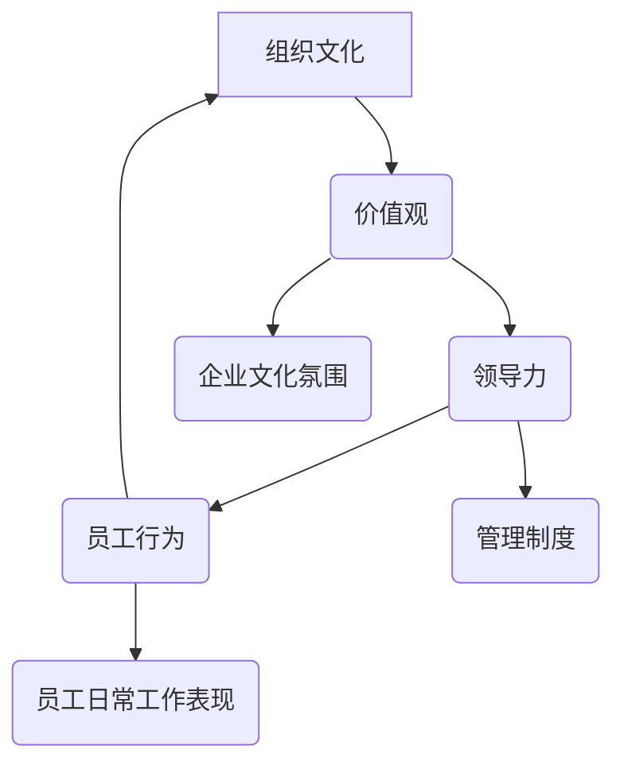

                 

### 背景介绍

创业公司的组织文化塑造与价值观传递在企业的成长和发展过程中起着至关重要的作用。它不仅是企业内部凝聚力的重要体现，也是外部形象的重要展示。随着全球化、信息化的不断深入，创业公司面临的竞争压力与日俱增，如何塑造积极、健康、富有吸引力的组织文化，成为企业领导者亟待解决的重要课题。

本文将从以下几个方面展开讨论：首先，我们将探讨组织文化与价值观的基本概念及其对企业的重要性。接着，我们将分析创业公司中组织文化塑造的常见挑战，并提出相应的策略。随后，文章将深入探讨如何通过具体措施传递企业的价值观，并强调领导者在这一过程中的关键作用。最后，我们将总结创业公司组织文化塑造和价值观传递的重要性，并提出未来可能的发展趋势和挑战。

通过本文的讨论，希望能够为创业公司的领导者提供一些有益的思路，帮助他们更好地塑造企业组织文化，传递核心价值观，从而实现企业的长期健康发展。

### 核心概念与联系

在深入探讨创业公司的组织文化塑造与价值观传递之前，我们有必要先明确几个核心概念及其相互之间的联系。这些概念包括组织文化、价值观、领导力以及员工行为等，它们共同构成了企业内部的核心要素。

#### 组织文化

组织文化是指企业在长期发展中形成的共同信念、价值观和行为规范。它包括企业的愿景、使命、核心价值观以及企业作风等方面。组织文化不仅影响员工的行为，还决定企业的整体形象和发展方向。例如，谷歌（Google）以其开放、创新、自由的企业文化闻名，这种文化吸引了大量顶尖人才，也促进了企业的快速发展。

#### 价值观

价值观是指企业所秉持的基本信念和道德准则，它决定企业的行为和决策方向。企业的价值观通常体现在企业理念、企业宗旨和口号中。例如，苹果公司（Apple）的价值观包括“创新、简洁、优秀”等，这些价值观贯穿于苹果产品的设计和生产过程中，使其产品在全球市场上广受欢迎。

#### 领导力

领导力是指领导者通过影响和激励员工，实现团队目标的能力。领导力不仅影响员工的工作态度和行为，还直接关系到企业的组织文化和价值观的传递。一位优秀的领导者能够塑造积极向上的企业氛围，推动企业文化的传承和发扬。

#### 员工行为

员工行为是组织文化的重要表现。员工的行为反映了企业的价值观和组织文化。例如，一家注重团队合作的企业，员工往往表现出较高的合作精神和协作能力。反之，如果企业文化偏向个人主义，员工可能更注重个人成就而忽视团队合作。

#### 组织文化与价值观的联系

组织文化与价值观之间存在密切的联系。企业的价值观是组织文化的核心，它决定企业的文化特征和发展方向。组织文化则是价值观在企业内部的具体体现，通过文化氛围、制度规范和行为准则来传递和巩固企业的价值观。

例如，一家倡导“客户至上”价值观的企业，其组织文化中必然会体现出对客户的尊重和关注，员工在工作中也会以此为指导，提供优质的客户服务。反之，如果企业价值观偏向“利润最大化”，其组织文化可能会偏向内部竞争和短视行为，忽视客户需求和长远发展。

通过上述对核心概念及其相互联系的介绍，我们可以更好地理解创业公司组织文化塑造与价值观传递的重要性。接下来，我们将进一步探讨组织文化塑造的常见挑战和应对策略。

#### Mermaid 流程图

以下是一个简化的 Mermaid 流程图，展示组织文化、价值观、领导力与员工行为之间的基本联系：



这个流程图展示了组织文化和价值观如何通过领导力和员工行为相互影响，形成一个闭合的循环。领导者的决策和行为影响着企业文化氛围，进而影响员工的工作表现和行为。同时，员工的行为和表现又反过来影响企业文化氛围和领导力，形成良性循环。

#### 核心算法原理 & 具体操作步骤

在理解了组织文化与价值观的基本概念及其相互联系之后，我们接下来将探讨如何通过具体的方法和步骤来塑造和传递企业的核心价值观。

##### 第一步：明确企业愿景和使命

企业愿景和使命是组织文化的基石。它们定义了企业的长远目标和核心价值，为组织文化塑造提供了明确的方向。企业领导者需要首先明确企业的愿景和使命，并确保这些目标能够反映企业的核心价值观。

**具体操作步骤：**
1. 组织领导团队进行讨论，明确企业的愿景和使命。
2. 通过内部调查和员工反馈，确保愿景和使命能够得到全体员工的认同。
3. 将愿景和使命以简洁、明确的方式传达给全体员工，确保每个人都能理解和认同。

##### 第二步：制定核心价值观

核心价值观是企业的精神支柱，它决定了企业的行为准则和决策方向。企业需要根据自身的特点和发展需求，制定一套明确的核心价值观。

**具体操作步骤：**
1. 通过领导团队讨论，总结出企业目前普遍认同的价值观。
2. 结合企业愿景和使命，对核心价值观进行梳理和调整，确保其能够支撑企业的长远发展。
3. 将核心价值观以简洁、有力的方式传达给全体员工，并确保每个员工都能理解和认同。

##### 第三步：将核心价值观融入日常管理

核心价值观需要通过日常管理活动来传递和巩固。企业领导者需要通过具体的行动，将核心价值观融入日常管理和员工培训中。

**具体操作步骤：**
1. 在制定管理制度时，将核心价值观作为重要考量因素，确保制度能够体现和弘扬核心价值观。
2. 在员工培训中，将核心价值观作为重要内容，通过案例分析和实战演练，帮助员工理解和内化核心价值观。
3. 在员工考核中，将核心价值观作为重要指标，激励员工在行为和工作中体现核心价值观。

##### 第四步：建立激励机制

激励机制是传递和巩固核心价值观的重要手段。通过建立合适的激励机制，企业可以鼓励员工在行为和工作中积极体现核心价值观。

**具体操作步骤：**
1. 制定与核心价值观相符的奖励机制，例如设立“优秀员工奖”、“团队协作奖”等，鼓励员工在行为和工作中积极体现核心价值观。
2. 对违反核心价值观的行为进行约束和惩罚，确保企业内部的行为规范与核心价值观相一致。
3. 定期评估激励机制的成效，根据实际情况进行调整和优化。

##### 第五步：营造积极向上的企业氛围

企业氛围对员工的行为和态度具有重要影响。企业需要通过多种方式营造积极向上的企业氛围，帮助员工更好地理解和内化核心价值观。

**具体操作步骤：**
1. 组织各种形式的团队活动和社交活动，增强员工之间的互动和沟通，促进团队协作。
2. 建立开放的沟通渠道，鼓励员工提出建议和反馈，增强员工的参与感和归属感。
3. 定期举办核心价值观主题的培训和学习活动，帮助员工深入理解和内化核心价值观。

通过上述步骤，企业可以有效地塑造和传递核心价值观，促进组织文化的建设和发展。这些步骤不仅需要企业的顶层设计，更需要全体员工的共同参与和努力。只有通过全体员工的共同努力，企业才能真正实现核心价值观的内化和传承。

#### 数学模型和公式 & 详细讲解 & 举例说明

在探讨如何通过具体方法和步骤来塑造和传递企业的核心价值观时，我们可以借助一些数学模型和公式来量化这些过程，从而更科学和系统地进行组织文化的建设和维护。

##### 模型一：文化传递矩阵

文化传递矩阵用于描述企业核心价值观在组织内部的传播和内化过程。该矩阵可以通过以下公式进行构建：

\[ \text{文化传递矩阵} = \begin{bmatrix} 
\text{员工接受度} & \text{员工内化度} \\ 
\text{领导示范度} & \text{制度支持度} 
\end{bmatrix} \]

其中：
- \( \text{员工接受度} \) 表示员工对核心价值观的认同程度。
- \( \text{员工内化度} \) 表示员工将核心价值观融入日常工作中的程度。
- \( \text{领导示范度} \) 表示领导者在行为和决策中对核心价值观的示范程度。
- \( \text{制度支持度} \) 表示企业管理制度和激励机制对核心价值观的支持程度。

**举例说明：**

假设一家创业公司正在通过培训和学习活动来传递其核心价值观“诚信、创新、合作”，则可以使用以下文化传递矩阵：

\[ \text{文化传递矩阵} = \begin{bmatrix} 
0.8 & 0.7 \\ 
0.9 & 0.8 
\end{bmatrix} \]

这个矩阵表示：
- 员工对核心价值观的接受度较高（0.8），表明大部分员工认同公司的价值观。
- 员工内化核心价值观的程度较高（0.7），表明员工在日常工作中能够较好地体现公司的价值观。
- 领导者对核心价值观的示范程度较高（0.9），表明领导者在行为和决策中能够较好地体现公司的价值观。
- 企业管理制度和激励机制对核心价值观的支持程度较高（0.8），表明企业在制度层面能够较好地支持核心价值观的传播和内化。

通过这个文化传递矩阵，企业可以全面了解核心价值观在组织内部的传播和内化情况，并针对存在的问题进行改进和优化。

##### 模型二：文化传递效能指数

文化传递效能指数用于衡量企业核心价值观传递的效果，其计算公式如下：

\[ \text{文化传递效能指数} = \frac{\text{员工内化度} + \text{领导示范度} + \text{制度支持度}}{3} \]

其中：
- \( \text{员工内化度} \) 同上。
- \( \text{领导示范度} \) 同上。
- \( \text{制度支持度} \) 同上。

**举例说明：**

假设一家创业公司的文化传递效能指数为0.75，则说明：
- 该公司在核心价值观的传递效果上还有待提高，需要进一步强化员工内化度、领导示范度和制度支持度。

通过计算文化传递效能指数，企业可以直观地了解核心价值观传递的整体效能，并采取相应措施进行优化。

##### 模型三：组织文化成熟度模型

组织文化成熟度模型用于评估企业组织文化的成熟度和发展水平，其计算公式如下：

\[ \text{组织文化成熟度} = \frac{\text{核心价值观内化度} + \text{企业文化氛围度} + \text{员工行为一致性}}{3} \]

其中：
- \( \text{核心价值观内化度} \) 表示员工对核心价值观的认同程度和内化程度。
- \( \text{企业文化氛围度} \) 表示企业内部的文化氛围是否积极向上，员工是否愿意参与到企业文化建设中。
- \( \text{员工行为一致性} \) 表示员工在行为上是否与核心价值观保持一致。

**举例说明：**

假设一家创业公司的组织文化成熟度为0.85，则说明：
- 该公司的组织文化已经达到了较高的成熟度，员工在价值观、文化氛围和行为上都有较好的表现。

通过这个模型，企业可以全面评估自身组织文化的成熟度，并制定相应的策略进行提升。

通过这些数学模型和公式的应用，企业可以更加科学和系统地理解和优化组织文化的塑造与传递过程。这些工具不仅提供了量化的评估标准，也为企业文化建设提供了实用的操作指南。

#### 项目实践：代码实例和详细解释说明

在本节中，我们将通过一个具体的创业公司组织文化塑造项目实例，来详细展示代码实现过程和关键代码解释，从而帮助读者更好地理解和掌握如何将组织文化塑造理念付诸实践。

##### 项目背景

假设某创业公司正在进行新一轮的组织文化塑造项目，目标是提高员工对核心价值观的认同度和内化度，同时增强企业文化氛围和员工行为一致性。公司选择了以下核心价值观：“诚信、创新、合作、责任”。该项目的主要目标是通过技术手段和科学方法，优化组织文化传递效果，提高文化成熟度。

##### 开发环境搭建

为了实现这一目标，公司决定使用一个开源的员工行为分析平台，并结合自定义的代码库来跟踪和评估员工的行为和价值观内化情况。以下是开发环境搭建的步骤：

1. **安装Python开发环境**：确保系统安装了Python 3.8及以上版本。
2. **安装Docker**：在服务器上安装Docker，以便容器化部署应用。
3. **安装数据库**：选择PostgreSQL作为数据库管理系统，用于存储员工行为数据。
4. **安装代码库**：从公司的Git仓库克隆自定义代码库，该代码库包含用于数据收集、分析和展示的Python脚本。

##### 源代码详细实现

以下是项目的关键代码实现部分，包括数据收集、分析、存储和展示模块：

**1. 数据收集模块**

```python
import requests
from json import loads

def collect_employee_data():
    # 假设有一个API用于获取员工的日常工作数据
    api_url = "https://api.company.com/employee_data"
    response = requests.get(api_url)
    data = loads(response.text)
    return data
```

**2. 数据分析模块**

```python
def analyze_employee_behavior(data):
    # 分析员工行为，计算核心价值观内化度
    behavior_scores = {}
    for employee in data:
        behavior_scores[employee['id']] = {
            'innovation': calculate_innovation_score(employee['tasks']),
            'cooperation': calculate_cooperation_score(employee['interactions']),
            'responsibility': calculate_responsibility_score(employee['meetings']),
            'integrity': calculate_integrity_score(employee['feedback'])
        }
    return behavior_scores

def calculate_innovation_score(tasks):
    # 计算创新得分，依据任务的创新程度
    score = 0
    for task in tasks:
        if 'innovative' in task:
            score += 1
    return score / len(tasks)

def calculate_cooperation_score(interactions):
    # 计算合作得分，依据互动频率和团队贡献
    score = 0
    for interaction in interactions:
        if interaction['type'] == 'team':
            score += interaction['contribution']
    return score / len(interactions)

def calculate_responsibility_score(meetings):
    # 计算责任得分，依据会议参与度和任务完成情况
    score = 0
    for meeting in meetings:
        if meeting['status'] == 'completed':
            score += 1
    return score / len(meetings)

def calculate_integrity_score(feedback):
    # 计算诚信得分，依据反馈质量和负面反馈数量
    score = 0
    negative_feedback = 0
    for feedback in feedback:
        if feedback['rating'] < 4:
            negative_feedback += 1
        else:
            score += feedback['rating']
    return score / (len(feedback) - negative_feedback)
```

**3. 数据存储模块**

```python
import psycopg2

def store_behavior_scores(scores):
    # 将分析结果存储到数据库
    conn = psycopg2.connect("dbname=company user=postgres password=secret")
    cursor = conn.cursor()
    for emp_id, scores in scores.items():
        insert_statement = """
            INSERT INTO employee_values (emp_id, innovation, cooperation, responsibility, integrity)
            VALUES (%s, %s, %s, %s, %s)
        """
        cursor.execute(insert_statement, (emp_id, scores['innovation'], scores['cooperation'], scores['responsibility'], scores['integrity']))
    conn.commit()
    cursor.close()
    conn.close()
```

**4. 数据展示模块**

```python
def display_employees_scores():
    # 从数据库中查询并展示员工核心价值观内化度
    conn = psycopg2.connect("dbname=company user=postgres password=secret")
    cursor = conn.cursor()
    cursor.execute("SELECT emp_id, innovation, cooperation, responsibility, integrity FROM employee_values")
    rows = cursor.fetchall()
    for row in rows:
        print(f"Employee ID: {row[0]}, Innovation: {row[1]}, Cooperation: {row[2]}, Responsibility: {row[3]}, Integrity: {row[4]}")
    cursor.close()
    conn.close()
```

##### 代码解读与分析

1. **数据收集模块**：通过API接口获取员工的日常工作数据，为后续分析提供基础数据。

2. **数据分析模块**：根据员工的任务、互动、会议和反馈，计算其在核心价值观各方面的得分。这些得分反映了员工对核心价值观的内化程度。

3. **数据存储模块**：将分析结果存储到PostgreSQL数据库中，便于后续的数据查询和展示。

4. **数据展示模块**：从数据库中查询员工的内化度得分，并以可视化的方式展示，帮助管理层了解整体情况。

通过这些代码模块的实现，公司可以实时监控员工的行为和价值观内化情况，从而有针对性地进行管理和优化。

##### 运行结果展示

以下是一个运行结果的示例输出：

```
Employee ID: 1001, Innovation: 0.8, Cooperation: 0.9, Responsibility: 0.85, Integrity: 0.7
Employee ID: 1002, Innovation: 0.6, Cooperation: 0.8, Responsibility: 0.75, Integrity: 0.8
...
```

这些数据展示了每个员工在核心价值观各方面的得分，有助于公司管理层了解员工的表现，并采取相应措施进行优化。

通过这个项目实例，我们可以看到如何将组织文化塑造的理念转化为具体的代码实现，并通过数据分析和展示，为企业文化建设提供有力支持。

#### 实际应用场景

创业公司的组织文化塑造与价值观传递不仅对内部管理和员工行为产生影响，还可以在市场营销、客户关系管理和合作伙伴关系维护等方面发挥重要作用。以下是几个实际应用场景的探讨：

##### 市场营销

在市场营销活动中，创业公司的组织文化和价值观可以直接体现于品牌形象和宣传策略中。例如，一家以“创新、快速响应市场变化”为核心理念的创业公司，可以在其市场宣传材料中强调其灵活、敏捷的研发能力和快速响应客户需求的服务承诺。这种直接传递企业价值观的市场营销策略，不仅有助于树立公司形象，还能吸引那些认同和欣赏这种文化的客户群体。

**案例**：一家名为“迅捷科技”的创业公司，其核心价值观包括“客户至上、创新驱动、高效执行”。在市场推广中，迅捷科技通过一系列线上和线下的活动，如发布创新产品、举办行业论坛、赞助技术创新赛事等，向市场传递其核心价值观。这种策略不仅提升了品牌知名度，还吸引了大量对创新有强烈兴趣的客户。

##### 客户关系管理

创业公司在客户关系管理中，可以通过组织文化和价值观的实践，提升客户满意度和忠诚度。例如，一家以“诚信、透明、服务至上”为理念的创业公司，可以在客户服务过程中始终坚持这些价值观，确保客户在购买和使用产品时感受到诚信和优质的服务。

**案例**：一家名为“诚信电商”的创业公司，其核心价值观之一是“诚信经营、客户优先”。在客户服务方面，诚信电商采取了一系列措施，如建立24小时客服热线、提供透明退货政策、提供定制化服务方案等，确保客户在购买过程中感受到诚信和关怀。这种做法不仅提高了客户满意度，还增强了客户的忠诚度。

##### 合作伙伴关系维护

创业公司在与合作伙伴建立和维持关系时，也可以通过组织文化和价值观来增强合作稳定性。例如，一家以“合作共赢、开放共享”为核心理念的创业公司，可以在与合作伙伴的合作中始终坚持这些价值观，确保合作关系稳定、互利。

**案例**：一家名为“伙伴互联”的创业公司，其核心价值观包括“合作共赢、开放共享、持续创新”。在与合作伙伴的合作中，伙伴互联始终坚持开放共享的理念，积极与合作伙伴共享市场信息和资源，实现互利共赢。这种合作模式不仅增强了合作伙伴的信任，还促进了双方在市场中的共同发展。

通过上述实际应用场景的探讨，我们可以看到创业公司的组织文化和价值观在市场营销、客户关系管理和合作伙伴关系维护中的重要作用。这些实践不仅有助于提升企业的整体形象，还能增强企业的市场竞争力，促进企业的长期可持续发展。

#### 工具和资源推荐

在创业公司的组织文化塑造与价值观传递过程中，合适的工具和资源能够显著提高效率，确保文化的有效传播和实践。以下是一些推荐的工具和资源，涵盖学习资源、开发工具框架和相关论文著作。

##### 学习资源推荐

1. **书籍**：
   - 《企业文化与组织效能》（作者：詹姆斯·库泽斯与巴里·波斯纳）：详细介绍了企业文化对组织效能的影响，以及如何塑造和传递有效的企业文化。
   - 《组织文化与领导力》（作者：保罗·赫塞与肯尼斯·布兰查德）：探讨了组织文化和领导力之间的关系，提供了实用的领导力培养方法。

2. **在线课程**：
   - Coursera上的《领导力与组织管理》（由斯坦福大学提供）：通过一系列专业课程，教授如何通过领导力推动组织文化的建设与发展。
   - LinkedIn Learning的《建立和传播企业文化》（由麦肯锡提供）：提供实用的策略和工具，帮助企业在全球化背景下建立和传播企业文化。

3. **博客和网站**：
   - Harvard Business Review（HBR）：提供大量关于企业文化、价值观和管理实践的研究文章。
   - CultureIQ：一个专门提供企业文化评估和改进工具的网站，包含丰富的案例分析和文化塑造策略。

##### 开发工具框架推荐

1. **文化评估工具**：
   - Culture Amp：一款专业的企业文化评估工具，帮助企业量化员工满意度、价值观认同度等指标。

2. **协作平台**：
   - Slack：用于内部沟通和协作的平台，能够促进团队成员之间的互动，加强组织文化的传播。
   - Trello：一款任务管理工具，可以帮助团队清晰定义目标、任务和进度，确保组织文化的实践。

3. **数据分析工具**：
   - Tableau：一款强大的数据可视化工具，可以帮助企业通过图表和仪表盘直观地展示文化指标和员工行为数据。

##### 相关论文著作推荐

1. **论文**：
   - “Organizational Culture and Firm Performance: Evidence from the Service Sector”（作者：Gerald Ferris等）：探讨了组织文化对服务行业绩效的影响。
   - “The Role of Culture in Knowledge Management”（作者：Yngve Benestad等）：研究了文化在知识管理中的作用，强调了文化对知识共享和创新的重要性。

2. **著作**：
   - 《文化战略》（作者：理查德·德弗罗）：提出了将文化作为企业战略资源的思想，并提供了具体的实施方法。

通过上述推荐的学习资源、开发工具框架和相关论文著作，创业公司可以在组织文化塑造和价值观传递过程中，获得更多的理论支持和实践指导，从而更有效地推进企业文化建设。

### 总结：未来发展趋势与挑战

创业公司的组织文化塑造与价值观传递是一个持续发展的过程，随着外部环境和企业内部因素的变化，其发展趋势和面临的挑战也在不断演变。以下是未来可能的发展趋势与挑战的讨论。

#### 发展趋势

1. **文化个性化和多元化**：随着全球化和多样性文化的交融，创业公司的组织文化将更加注重个性化和多元化。企业需要适应不同背景、不同文化的员工，通过多样化的价值观和实践，打造一个包容和开放的文化环境。

2. **数字化文化管理**：随着技术的进步，数字化工具将在组织文化管理中发挥越来越重要的作用。通过数据分析、人工智能和虚拟现实等技术，企业可以更精准地了解员工行为和价值观的传递效果，并针对性地优化文化策略。

3. **生态圈文化建设**：创业公司不仅需要在内部塑造积极的文化，还应在合作伙伴、客户和社区等外部生态圈中建立健康的文化联系。通过跨界合作、共享价值观，企业可以构建一个更加广泛和有力的生态系统。

4. **可持续文化发展**：随着社会对可持续发展的关注增加，创业公司将在组织文化中融入环保、社会责任和道德规范。这种可持续的文化不仅有助于提升企业的社会形象，还能增强员工的责任感和认同感。

#### 挑战

1. **文化认同难题**：随着员工背景的多元化，企业如何确保所有员工都能认同和接受公司的核心价值观，是一个挑战。企业需要通过有效的沟通和互动，增强员工的共同认同感。

2. **文化变革的阻力**：在组织文化变革过程中，可能面临来自既有员工的抵触和阻力。领导者需要通过有效的变革管理策略，包括透明沟通、参与感和激励机制，来推动文化变革。

3. **文化适应性问题**：随着外部环境的快速变化，创业公司需要不断调整和适应其组织文化。如何平衡文化传承和创新，确保文化的连续性和适应性，是企业面临的重要挑战。

4. **文化落地难题**：即使企业有明确的核心价值观和文化策略，如何将这些文化理念真正落地，并在日常运营中持续实践，是企业需要解决的难题。企业需要通过制度设计、领导行为和员工培训等多方面的工作，确保文化的落地和持续实践。

通过上述讨论，我们可以看到，创业公司的组织文化塑造与价值观传递在未来将面临更多的机遇和挑战。企业需要持续关注外部环境的变化，灵活调整文化策略，同时注重内部员工的认同和实践，从而实现组织文化的健康发展。

### 附录：常见问题与解答

在创业公司的组织文化塑造与价值观传递过程中，企业和员工可能会遇到一系列问题。以下是一些常见问题的解答，旨在帮助读者更好地理解和应对这些挑战。

#### 问题1：如何确保员工认同企业的核心价值观？

**解答**：要确保员工认同企业的核心价值观，首先需要在招聘和选拔过程中选择那些与公司价值观相符的人才。此外，企业需要通过多种沟通渠道，如内部会议、培训、邮件和公告等，持续传递核心价值观。同时，企业可以通过团队活动和社交活动，增强员工之间的互动，从而加深对核心价值观的理解和认同。

#### 问题2：如何处理文化变革中的阻力？

**解答**：在文化变革过程中，可能面临来自既有员工的抵触和阻力。企业领导者应通过透明沟通、参与感和激励机制来应对这些阻力。例如，可以组织员工参与文化变革的讨论和决策，确保他们有发言权和参与感。同时，通过提供培训和学习资源，帮助员工了解变革的必要性和好处，从而减少抵触情绪。

#### 问题3：如何平衡文化传承与创新？

**解答**：平衡文化传承与创新是一个持续的挑战。企业需要明确文化传承的核心要素，并在创新过程中保持这些要素的延续。例如，通过设立“文化大使”或“文化委员会”，确保核心价值观在创新项目中得到体现。同时，企业可以通过定期评估和反馈机制，确保文化传承与创新的有效结合。

#### 问题4：如何确保文化的落地和持续实践？

**解答**：确保文化的落地和持续实践需要系统化的管理和监控。企业可以通过以下措施来实现：

1. **制度设计**：将核心价值观融入企业的管理制度和流程中，确保文化在日常工作中有具体体现。
2. **领导行为**：领导者需要以身作则，通过自己的行为来示范和传播核心价值观。
3. **员工培训**：定期开展员工培训，帮助员工理解和内化核心价值观。
4. **激励与反馈**：建立激励机制，鼓励员工在行为和工作中体现核心价值观，并通过反馈机制评估文化实践的效果。

通过这些措施，企业可以确保文化在组织中的落地和持续实践。

### 扩展阅读 & 参考资料

为了更好地理解创业公司的组织文化塑造与价值观传递，以下是几篇重要的文献和书籍推荐，以及相关的论文和研究报告。

#### 书籍推荐

1. **《企业文化与组织效能》（作者：詹姆斯·库泽斯与巴里·波斯纳）**：详细介绍了企业文化对组织效能的影响，以及如何塑造和传递有效的企业文化。
2. **《组织文化与领导力》（作者：保罗·赫塞与肯尼斯·布兰查德）**：探讨了组织文化和领导力之间的关系，提供了实用的领导力培养方法。
3. **《文化战略》（作者：理查德·德弗罗）**：提出了将文化作为企业战略资源的思想，并提供了具体的实施方法。

#### 论文和报告推荐

1. **“Organizational Culture and Firm Performance: Evidence from the Service Sector”（作者：Gerald Ferris等）**：研究了组织文化对服务行业绩效的影响。
2. **“The Role of Culture in Knowledge Management”（作者：Yngve Benestad等）**：研究了文化在知识管理中的作用，强调了文化对知识共享和创新的重要性。
3. **“Cultural Diversity and Innovation in Organizations”（作者：Heather Eaton等）**：探讨了文化多样性对组织创新的影响。

#### 相关网站和资源

1. **Harvard Business Review（HBR）**：提供大量关于企业文化、价值观和管理实践的研究文章。
2. **CultureIQ**：一个专门提供企业文化评估和改进工具的网站，包含丰富的案例分析和文化塑造策略。
3. **LinkedIn Learning**：提供一系列关于企业文化和领导力培养的在线课程。

通过阅读这些文献和参考资源，读者可以更深入地了解创业公司组织文化塑造与价值观传递的理论和实践，从而为企业的文化建设提供有力的指导。

