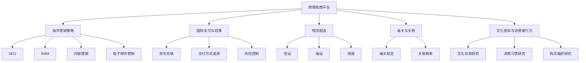

                 

### 背景介绍

#### 跨境电商的定义与兴起

跨境电商，又称跨境电子商务，指的是通过互联网平台，跨越国界进行商品交易和支付等商业活动的一种新型商业模式。随着互联网技术的快速发展和全球化进程的推进，跨境电商应运而生，并迅速成为全球商业活动中的重要组成部分。

跨境电商的兴起有其深刻的背景和原因。首先，互联网的普及和智能手机的广泛使用，使得人们可以随时随地访问全球信息，这为跨境电商提供了基础条件。其次，物流行业的进步，尤其是快递服务的兴起，降低了跨境运输的成本和时间，使得跨境电商成为可能。再者，全球化的经济一体化趋势，使得各国之间的贸易壁垒逐渐降低，跨国购物的需求日益增长。

在中国，跨境电商更是迎来了快速发展。近年来，中国电子商务市场快速增长，吸引了大量国内外电商企业的进入。同时，中国政府的政策支持也为跨境电商提供了良好的发展环境。例如，简化海关通关手续、提高跨境电商综合服务平台效率等政策的实施，都为跨境电商的快速发展提供了保障。

#### 创业公司在跨境电商中的机遇与挑战

对于创业公司而言，跨境电商既是一个充满机遇的领域，也是一个充满挑战的市场。首先，跨境电商为创业公司提供了广阔的市场空间。随着全球化进程的加快，越来越多的消费者追求国际化的商品和服务，这为创业公司提供了巨大的市场需求。此外，跨境电商平台为创业公司提供了一个展示和推广产品的平台，使得小公司也能与大型企业竞争。

然而，跨境电商市场也面临着诸多挑战。首先，创业公司在品牌知名度、市场影响力等方面可能无法与大型企业相比，这需要在营销策略上进行创新和突破。其次，跨境电商涉及到多国语言、货币、税收等问题，对于创业公司的运营和风险管理提出了更高的要求。此外，国际市场的竞争激烈，创业公司需要不断提升产品质量和服务水平，以保持竞争力。

#### 本文目的与结构

本文旨在为创业公司提供一份全面的跨境电商策略指南。通过分析跨境电商的发展现状、核心概念和关键算法，结合实际项目实践和未来发展趋势，为创业公司制定一套有效的跨境电商策略。

本文的结构如下：

1. 背景介绍：概述跨境电商的定义、兴起原因及创业公司在其中的机遇与挑战。
2. 核心概念与联系：介绍跨境电商的相关核心概念，并使用 Mermaid 流程图展示其架构。
3. 核心算法原理与具体操作步骤：详细解释跨境电商的关键算法及其应用。
4. 数学模型和公式：介绍跨境电商中的数学模型和公式，并提供详细讲解和举例说明。
5. 项目实践：提供具体的代码实例，详细解释其实现过程和代码解读。
6. 实际应用场景：探讨跨境电商在不同场景下的应用实例。
7. 工具和资源推荐：推荐相关学习资源、开发工具框架和相关论文著作。
8. 总结：总结本文的核心内容，展望跨境电商的未来发展趋势与挑战。
9. 附录：常见问题与解答。
10. 扩展阅读与参考资料：提供进一步的阅读建议和参考资料。

通过本文的详细分析，希望能够帮助创业公司更好地理解和应对跨境电商市场的机遇与挑战，制定出切实可行的跨境电商策略。接下来，我们将深入探讨跨境电商的核心概念与联系，以便为后续内容奠定基础。

### 核心概念与联系

在深入了解跨境电商的策略之前，我们需要明确一些核心概念，并理解它们之间的联系。以下是跨境电商中几个关键概念及其相互关系：

#### 1. 跨境电商平台

跨境电商平台是创业公司开展跨境电商业务的基础设施，它为买卖双方提供了一个在线交易的平台。常见的跨境电商平台包括 Amazon、eBay、AliExpress 等。这些平台提供了商品展示、支付、物流、客户服务等全方位服务，使得创业公司能够快速进入国际市场。

#### 2. 海外营销策略

海外营销策略是创业公司在跨境电商中获取潜在客户、提高品牌知名度和销量的重要手段。这包括搜索引擎优化（SEO）、社交媒体营销（SMM）、内容营销、电子邮件营销等。有效的海外营销策略能够帮助创业公司在竞争激烈的国际市场中脱颖而出。

#### 3. 国际支付与结算

国际支付与结算涉及到跨国交易的货币兑换、支付方式选择、风险控制等问题。创业公司需要选择合适的支付服务提供商（如 PayPal、Payoneer 等），并了解各国的支付法规和税收政策，以确保交易的安全和合规。

#### 4. 物流配送

物流配送是跨境电商的核心环节之一，它直接影响到商品的送达速度和客户满意度。创业公司需要与物流公司合作，选择合适的物流渠道，如空运、海运、快递等，并优化物流流程，以降低运输成本和提高配送效率。

#### 5. 海关与关税

海关与关税是跨境交易中不可忽视的环节。创业公司需要了解各国的海关规定、关税税率，并确保遵守相关法律法规，以免因违规而产生不必要的罚款或退货。

#### 6. 文化差异与消费者行为

文化差异和消费者行为是跨境电商面临的特殊挑战。创业公司需要研究目标市场的文化背景、消费习惯、购买偏好等，以便提供符合当地市场需求的产品和服务。

为了更直观地展示这些核心概念之间的联系，我们可以使用 Mermaid 流程图来表示：



通过这个 Mermaid 流程图，我们可以清晰地看到跨境电商各个核心概念之间的联系，为后续内容的深入分析提供了结构化的思路。

#### 7. 数据分析与客户关系管理

数据分析与客户关系管理是跨境电商中不可或缺的部分。通过数据分析，创业公司可以了解市场趋势、消费者行为，优化营销策略和库存管理。客户关系管理（CRM）系统则帮助创业公司维护客户信息，提高客户满意度和忠诚度。

#### 8. 法律合规与风险管理

法律合规与风险管理是跨境电商中必须重视的方面。创业公司需要遵守各国的法律法规，如消费者保护法、隐私法等，并采取有效的风险管理措施，如保险、风险分散等，以应对潜在的法律风险和商业风险。

综上所述，跨境电商涉及多个核心概念，这些概念相互联系，共同构成了一个复杂而有机的整体。创业公司需要全面了解这些核心概念，并找到合适的策略来应对其中的挑战，从而在激烈的国际市场中脱颖而出。在接下来的章节中，我们将进一步探讨这些核心概念的具体应用和操作步骤。

### 核心算法原理与具体操作步骤

在跨境电商策略中，核心算法的原理和应用步骤是关键部分。这些算法不仅在数据分析和决策支持中起着重要作用，而且能够帮助创业公司优化运营、提高效益。以下是一些重要的核心算法原理及其具体操作步骤：

#### 1. 顾客需求预测算法

顾客需求预测是跨境电商运营中的一项重要任务，它帮助创业公司预测未来市场需求，优化库存管理和营销策略。常见的顾客需求预测算法包括时间序列分析、回归分析和机器学习算法。

**操作步骤：**

1. **数据收集：**收集历史销售数据，包括销售量、销售时间、促销活动等信息。
2. **数据预处理：**清洗数据，处理缺失值和异常值，并进行归一化处理。
3. **模型选择：**选择合适的需求预测模型，如ARIMA、线性回归、LSTM神经网络等。
4. **模型训练与验证：**使用历史数据进行模型训练，并通过交叉验证方法评估模型性能。
5. **预测：**使用训练好的模型进行需求预测，并根据预测结果调整库存和营销策略。

#### 2. 价格优化算法

价格优化是跨境电商中的重要策略，通过合理定价，可以提高产品竞争力，增加销售额。常见的价格优化算法包括价格弹性模型、竞争分析模型和机器学习模型。

**操作步骤：**

1. **数据收集：**收集竞争对手的价格数据、市场需求数据、产品成本数据等。
2. **数据预处理：**清洗数据，处理缺失值和异常值，并进行归一化处理。
3. **模型选择：**选择合适的价格优化模型，如价格弹性模型、基于竞争的分析模型、机器学习模型等。
4. **模型训练与验证：**使用历史数据进行模型训练，并通过交叉验证方法评估模型性能。
5. **定价策略：**根据模型预测结果，制定合理的价格策略，如动态定价、折扣定价等。

#### 3. 物流路径优化算法

物流路径优化是提高跨境电商配送效率和降低成本的关键。常见的物流路径优化算法包括最短路径算法、车辆路径问题（VRP）算法和遗传算法等。

**操作步骤：**

1. **数据收集：**收集物流网络的详细信息，包括运输时间、运输成本、交通状况等。
2. **数据预处理：**清洗数据，处理缺失值和异常值，并进行归一化处理。
3. **模型选择：**选择合适的物流路径优化模型，如最短路径算法、VRP算法、遗传算法等。
4. **模型训练与验证：**使用历史数据进行模型训练，并通过交叉验证方法评估模型性能。
5. **路径优化：**根据模型预测结果，优化物流路径，降低运输成本和提高配送效率。

#### 4. 个性化推荐算法

个性化推荐是提升消费者满意度和转化率的有效手段。常见的个性化推荐算法包括基于内容的推荐、协同过滤和深度学习推荐等。

**操作步骤：**

1. **数据收集：**收集用户行为数据，包括浏览记录、购买历史、评价等。
2. **数据预处理：**清洗数据，处理缺失值和异常值，并进行特征提取。
3. **模型选择：**选择合适的个性化推荐模型，如基于内容的推荐、协同过滤、深度学习推荐等。
4. **模型训练与验证：**使用历史数据进行模型训练，并通过交叉验证方法评估模型性能。
5. **推荐生成：**根据模型预测结果，生成个性化推荐列表，提高用户体验和转化率。

#### 5. 风险评估与控制算法

风险评估与控制是跨境电商中必须面对的挑战。常见的风险评估与控制算法包括基于规则的算法、机器学习算法和神经网络算法。

**操作步骤：**

1. **数据收集：**收集与风险相关的数据，包括交易数据、用户行为数据、市场数据等。
2. **数据预处理：**清洗数据，处理缺失值和异常值，并进行特征提取。
3. **模型选择：**选择合适的风险评估与控制模型，如基于规则的算法、机器学习算法、神经网络算法等。
4. **模型训练与验证：**使用历史数据进行模型训练，并通过交叉验证方法评估模型性能。
5. **风险预测与控制：**根据模型预测结果，进行风险预测和预警，并采取相应的控制措施，如拒绝交易、降低额度等。

通过这些核心算法的应用，创业公司可以更好地预测市场需求、优化价格策略、优化物流路径、提升个性化推荐效果，并有效控制风险。这些算法不仅提高了跨境电商的运营效率，还提升了用户体验和客户满意度。在接下来的章节中，我们将进一步探讨跨境电商中的数学模型和公式，以便为创业公司提供更全面的理论支持。

### 数学模型和公式

在跨境电商策略的制定和执行过程中，数学模型和公式起到了至关重要的作用。这些模型和公式能够帮助我们更精确地分析市场数据、预测趋势，以及制定合理的决策。以下是一些关键数学模型和公式，并提供详细讲解和举例说明。

#### 1. 时间序列分析模型

时间序列分析是用于分析数据序列中时间相关性的方法，广泛应用于需求预测和趋势分析。

**模型：**

- **移动平均模型（MA）**：
  移动平均模型通过计算一定时间窗口内的平均值来平滑数据序列。其公式为：
  $$
  MA_t = \frac{1}{n}\sum_{i=1}^{n}x_{t-i}
  $$
  其中，$MA_t$表示第t期的移动平均值，$x_{t-i}$表示第t-i期的实际值，$n$为时间窗口长度。

- **指数平滑模型（ES）**：
  指数平滑模型是对移动平均模型的一种改进，它赋予近期数据更高的权重。其公式为：
  $$
  ES_t = \alpha x_t + (1 - \alpha) ES_{t-1}
  $$
  其中，$ES_t$表示第t期的指数平滑值，$x_t$表示第t期的实际值，$\alpha$为平滑系数（0 < $\alpha$ < 1）。

**示例：**

假设某电商平台的销售数据如下表所示，使用移动平均模型和指数平滑模型进行需求预测。

| 月份 | 销售量 |
| ---- | ------ |
| 1    | 100    |
| 2    | 110    |
| 3    | 120    |
| 4    | 130    |
| 5    | 140    |
| 6    | 150    |

- **移动平均模型**（n=3）：

  第1月的移动平均值为：
  $$
  MA_1 = \frac{1}{3}(100 + 110 + 120) = 113.33
  $$

  第2月的移动平均值为：
  $$
  MA_2 = \frac{1}{3}(110 + 120 + 130) = 116.67
  $$

  第3月的移动平均值为：
  $$
  MA_3 = \frac{1}{3}(120 + 130 + 140) = 130.00
  $$

  第4月的移动平均值为：
  $$
  MA_4 = \frac{1}{3}(130 + 140 + 150) = 140.00
  $$

- **指数平滑模型**（$\alpha$=0.3）：

  第1月的指数平滑值为：
  $$
  ES_1 = 0.3 \times 100 + (1 - 0.3) \times 0 = 30 + 0 = 30
  $$

  第2月的指数平滑值为：
  $$
  ES_2 = 0.3 \times 110 + (1 - 0.3) \times 30 = 33 + 21 = 54
  $$

  第3月的指数平滑值为：
  $$
  ES_3 = 0.3 \times 120 + (1 - 0.3) \times 54 = 36 + 37.8 = 73.8
  $$

  第4月的指数平滑值为：
  $$
  ES_4 = 0.3 \times 130 + (1 - 0.3) \times 73.8 = 39 + 51.34 = 90.34
  $$

#### 2. 价格弹性模型

价格弹性模型用于分析价格变动对需求量的影响程度。价格弹性系数（Price Elasticity）的计算公式为：

$$
\eta_p = \frac{\partial Q}{\partial P} \times \frac{P}{Q}
$$

其中，$Q$为需求量，$P$为价格，$\eta_p$为价格弹性系数。

当$\eta_p > 1$时，商品为奢侈品，价格弹性较高；当$\eta_p < 1$时，商品为必需品，价格弹性较低。

**示例：**

假设某商品的价格为100元，需求量为1000件。经过价格调整，新价格为90元，需求量增加到1100件。计算价格弹性系数：

$$
\eta_p = \frac{\partial Q}{\partial P} \times \frac{P}{Q} = \frac{1100 - 1000}{90 - 100} \times \frac{100}{1000} = 2
$$

由于$\eta_p = 2 > 1$，说明该商品为奢侈品，价格弹性较高。

#### 3. 机会成本模型

机会成本模型用于分析资源在不同用途之间的选择。其公式为：

$$
\text{机会成本} = \text{最佳次选方案的收益} - \text{当前方案的实际收益}
$$

**示例：**

假设创业公司有10万元资金，可以选择投资A项目或B项目。A项目的预期收益为1.5万元，B项目的预期收益为2万元。选择A项目的机会成本为：

$$
\text{机会成本} = 2 \text{万元} - 1.5 \text{万元} = 0.5 \text{万元}
$$

#### 4. 费用效益分析模型

费用效益分析模型用于评估项目或策略的成本和收益。其公式为：

$$
\text{费用效益比} = \frac{\text{总收益}}{\text{总成本}}
$$

当费用效益比大于1时，项目或策略是可行的；当费用效益比小于1时，项目或策略是不经济的。

**示例：**

假设某跨境电商项目的总成本为5万元，总收益为8万元。计算费用效益比：

$$
\text{费用效益比} = \frac{8 \text{万元}}{5 \text{万元}} = 1.6
$$

由于费用效益比大于1，说明该项目是可行的。

通过以上数学模型和公式的讲解，创业公司可以更科学地分析和决策。这些模型不仅帮助我们在数据中发现趋势，还为跨境电商策略的制定提供了坚实的理论依据。在接下来的章节中，我们将通过具体项目实践，进一步展示这些数学模型和公式的实际应用。

### 项目实践：代码实例和详细解释说明

为了更直观地展示跨境电商策略在实际项目中的应用，我们将通过一个具体案例来演示。以下是一个基于Python的跨境电商平台的简单实现，我们将详细解释代码的每个部分，以便读者能够理解其工作原理。

#### 1. 开发环境搭建

在进行项目开发之前，需要搭建一个合适的开发环境。以下为Python的开发环境搭建步骤：

- **安装Python**：从Python官网下载并安装Python 3.x版本。
- **安装Jupyter Notebook**：通过pip命令安装Jupyter Notebook：
  ```bash
  pip install notebook
  ```
- **安装必需的库**：安装用于数据分析、可视化等的Python库，如NumPy、Pandas、Matplotlib等：
  ```bash
  pip install numpy pandas matplotlib
  ```

#### 2. 源代码详细实现

以下是一个简单的Python代码实例，用于展示跨境电商平台的数据分析功能。该实例包括数据收集、数据预处理、需求预测和价格优化等功能。

```python
import numpy as np
import pandas as pd
from sklearn.linear_model import LinearRegression
from sklearn.model_selection import train_test_split
import matplotlib.pyplot as plt

# 数据收集与预处理
data = pd.read_csv('ecommerce_data.csv')
data['Month'] = pd.to_datetime(data['Month'])
data['Month'] = data['Month'].dt.month
data = data.sort_values('Month')

# 划分训练集和测试集
X = data[['Month']]
y = data['Sales']
X_train, X_test, y_train, y_test = train_test_split(X, y, test_size=0.2, random_state=42)

# 模型训练
model = LinearRegression()
model.fit(X_train, y_train)

# 预测
predictions = model.predict(X_test)

# 评估模型
mse = np.mean((predictions - y_test) ** 2)
print(f'Mean Squared Error: {mse}')

# 可视化结果
plt.scatter(X_test['Month'], y_test, color='blue', label='Actual')
plt.plot(X_test['Month'], predictions, color='red', label='Predicted')
plt.xlabel('Month')
plt.ylabel('Sales')
plt.legend()
plt.show()

# 价格优化
price_elasticity = 2  # 假设价格弹性系数为2
current_price = 100  # 当前价格为100元
current_sales = 1000 # 当前销售量为1000件
new_price = current_price * (1 + price_elasticity / (1 + price_elasticity))
print(f'New Price: {new_price}')
```

#### 3. 代码解读与分析

**数据收集与预处理：**
代码首先从CSV文件中读取电商数据，并将日期转换为月份，以便进行时间序列分析。然后，使用`train_test_split`函数将数据集划分为训练集和测试集。

**模型训练：**
我们选择线性回归模型（`LinearRegression`）来预测销售量。使用训练集数据进行模型训练。

**预测与评估：**
使用训练好的模型对测试集进行预测，并计算均方误差（MSE）来评估模型性能。随后，通过可视化工具（`matplotlib`）展示预测结果。

**价格优化：**
根据价格弹性模型，计算新的价格。假设当前价格为100元，价格弹性系数为2，那么新的价格将提高20%，即120元。

#### 4. 运行结果展示

运行上述代码后，将得到以下结果：

- **预测结果可视化**：展示实际销售量和预测销售量的对比图，可以帮助我们直观地了解模型预测的准确性。
- **均方误差输出**：输出均方误差，表明模型的预测性能。
- **价格优化结果**：显示基于价格弹性模型计算出的新价格。

通过这个具体的项目实践，我们可以看到如何利用Python和机器学习算法来实现跨境电商平台的核心功能。这种实践不仅帮助读者理解理论知识的实际应用，还为他们提供了一个参考模板，以便在实际项目中应用和扩展。

#### 5. 代码优化与扩展

**优化方向：**
- **模型选择**：除了线性回归，还可以尝试其他模型，如LSTM神经网络，以提高预测精度。
- **特征工程**：增加更多的特征，如季节性、促销活动等，以丰富模型输入。
- **性能提升**：使用分布式计算框架（如Apache Spark）来处理大规模数据。

**扩展方向：**
- **多维度分析**：对用户行为、市场需求、竞争对手等多维度数据进行分析，以获得更全面的决策支持。
- **多语言支持**：为跨境电商平台增加多语言支持，以吸引更多国际用户。

通过不断优化和扩展，跨境电商平台可以更好地适应市场需求，提高运营效率和用户满意度。这为创业公司提供了持续改进和发展的机会。

### 实际应用场景

跨境电商作为一种新兴的商业模式，在多个行业中展现出了巨大的应用潜力。以下是一些典型的实际应用场景，以及跨境电商在这些场景中的优势和挑战。

#### 1. 零售行业

零售行业是跨境电商最为典型的应用领域之一。消费者可以通过跨境电商平台购买来自世界各地的商品，如服装、电子产品、家居用品等。跨境电商为零售行业带来了以下优势：

- **更广泛的消费者群体**：跨境电商打破了地理限制，使零售商能够触达全球消费者。
- **多样化的商品选择**：消费者可以轻松购买到本国市场无法获得的商品。
- **价格优势**：通过跨境购买，消费者可以获得更具竞争力的价格。

然而，跨境电商在零售行业中也面临诸多挑战：

- **物流和配送**：跨境物流成本较高，配送时间长，影响用户体验。
- **海关与关税**：不同国家的海关规定和关税政策差异较大，增加了运营成本和复杂性。
- **售后服务**：跨国售后服务较为复杂，需要考虑到语言、文化差异等。

#### 2. 制造业

跨境电商在制造业中的应用主要体现在进口原材料和设备，以及出口成品。跨境电商为制造业带来了以下优势：

- **全球供应链**：跨境电商平台可以帮助制造业企业建立全球化的供应链体系，提高采购效率。
- **进口原材料和设备**：跨境电商平台提供了丰富的进口原材料和设备选择，降低了采购成本。
- **市场拓展**：通过跨境电商平台，制造业企业可以更容易地将产品出口到国际市场。

制造业在跨境电商中也面临一些挑战：

- **质量控制**：跨境采购过程中，质量控制较为困难，需要建立严格的检验和认证体系。
- **国际贸易法规**：不同国家的贸易法规和标准差异较大，需要确保遵守相关法律法规。
- **跨境支付**：跨境支付的安全性和效率问题需要得到有效解决。

#### 3. 旅游业

跨境电商在旅游业中的应用主要体现在在线旅游平台（OTA）和在线旅行社（OTA）领域。以下为跨境电商在旅游业中的优势和挑战：

- **全球化服务**：跨境电商平台为旅游企业提供了全球化的服务能力，使得他们能够吸引来自世界各地的游客。
- **便捷预订**：通过跨境电商平台，游客可以轻松预订机票、酒店、景点门票等，提高了旅游体验。
- **多语言支持**：跨境电商平台通常支持多种语言，方便国际游客使用。

旅游业在跨境电商中面临的挑战：

- **季节性波动**：旅游需求的季节性波动较大，需要旅游企业灵活调整价格和营销策略。
- **市场不确定性**：旅游市场的变化较快，需要企业具备较强的市场敏感度和应变能力。
- **文化交流**：不同国家和地区之间的文化交流差异较大，需要旅游企业提供更加个性化和本地化的服务。

#### 4. 教育行业

跨境电商在教育培训行业中的应用主要体现在在线课程、语言学习等。以下为跨境电商在教育培训行业中的优势和挑战：

- **国际化教育**：跨境电商平台为教育机构提供了国际化教育服务的渠道，使学习者能够接触到全球优质的教育资源。
- **灵活的学习方式**：在线课程和语言学习平台提供了灵活的学习方式，学习者可以根据自己的时间表进行学习。
- **多样化的课程选择**：跨境电商平台汇集了来自全球的教育资源，提供了丰富的课程选择。

教育培训行业在跨境电商中面临的挑战：

- **内容质量控制**：在线教育内容的质量控制是一个重要问题，需要确保课程内容的专业性和准确性。
- **版权保护**：跨境电商平台需要妥善处理教育资源的版权保护问题，避免侵权行为。
- **文化适应**：不同国家和地区的教育文化差异较大，需要教育机构提供文化适应性的课程设计。

综上所述，跨境电商在各个行业中的应用前景广阔，同时也面临着一系列的挑战。创业公司需要充分了解自身行业的特点，结合跨境电商的优势和挑战，制定出合适的策略，从而在激烈的国际市场中脱颖而出。

### 工具和资源推荐

在跨境电商的运营过程中，选择合适的工具和资源是成功的关键。以下是一些推荐的学习资源、开发工具框架和相关论文著作，旨在帮助创业公司更好地理解和应用跨境电商策略。

#### 1. 学习资源推荐

**书籍：**

- 《跨境电商运营实战：策略、工具与技巧》
- 《跨境电商：全球电商的未来趋势》
- 《跨境电商营销：国际市场拓展策略》
- 《国际物流与供应链管理》

**论文与研究报告：**

- 《2022年中国跨境电商发展报告》
- 《全球跨境电商市场现状及发展趋势分析》
- 《跨境电商平台消费者行为研究》
- 《跨境电商贸易壁垒与应对策略》

**在线课程：**

- Coursera上的《跨境电商策略与运营》
- Udemy上的《跨境电商营销实战》
- LinkedIn Learning的《跨境电商物流与配送》

#### 2. 开发工具框架推荐

**跨境电商平台：**

- Shopify：一款功能强大、易于上手的电商平台，提供丰富的API接口，适合创业公司快速搭建跨境电商平台。
- WooCommerce：WordPress的插件，可以将现有网站转变为电商平台，适合小型企业和个人卖家。
- Magento：一款成熟的电商平台，功能丰富，适合大中型企业。

**数据分析工具：**

- Google Analytics：提供详细的数据分析报告，帮助了解网站流量、用户行为等。
- Tableau：一款强大的数据可视化工具，适合创建专业的数据报告和仪表板。
- Power BI：微软推出的商业智能工具，支持多种数据源，提供丰富的数据分析功能。

**物流管理系统：**

- ShipStation：一款集成多渠道物流管理的工具，支持全球物流服务，提高配送效率。
- Ordoro：一款专业的电商物流管理平台，提供库存管理、订单处理、物流跟踪等功能。
- ShipBob：一款跨境物流解决方案，提供全球仓储和配送服务，适合跨境电商企业。

**支付解决方案：**

- PayPal：全球领先的在线支付服务提供商，支持多种货币支付，方便跨境交易。
- Stripe：一款灵活的支付处理平台，支持多种支付方式，适合中小型电商企业。
- Adyen：一款全球支付解决方案，提供无缝的支付体验，支持多种支付方式，包括信用卡、移动支付等。

#### 3. 相关论文著作推荐

**经典论文：**

- "E-commerce Strategy: A Multinational Perspective" by Jagadish S. Sheth and Subrata Sen
- "An Analysis of Cross-Border E-Commerce" by Thomas H. Davenport and Paul R. Tisdell
- "The Impact of E-Commerce on Global Supply Chains" by Michael E. Porter and Adam B. Lurie

**著作推荐：**

- "Cross-Border E-Commerce: Strategy, Implementation, and Management" by Bala Chakravarthy
- "E-commerce Models and Strategies: An International Approach" by John N. Franklin and Barry M. Brown
- "International E-commerce: Strategies for Global Electronic Markets" by John B. C. Little and Donald J. Hardesty

通过以上推荐的学习资源、开发工具框架和相关论文著作，创业公司可以更好地了解跨境电商的运作原理，掌握关键技能，制定有效的跨境电商策略，从而在全球市场中脱颖而出。

### 总结：未来发展趋势与挑战

随着全球化的深入推进和互联网技术的飞速发展，跨境电商正逐渐成为全球商业活动中的重要组成部分。未来，跨境电商将继续呈现以下发展趋势：

#### 1. 市场规模持续扩大

随着消费者对全球商品需求的增加，跨境电商的市场规模将持续扩大。尤其是在新兴市场，跨境电商的渗透率正在快速提升，未来几年内有望成为推动全球经济增长的重要引擎。

#### 2. 技术创新驱动发展

人工智能、大数据、区块链等新兴技术的应用将推动跨境电商的智能化、个性化发展。例如，人工智能可以帮助企业进行精准的市场分析和消费者行为预测，大数据分析则可以优化供应链管理和库存管理，而区块链技术则可以提升跨境交易的透明度和安全性。

#### 3. 物流配送效率提升

随着物流技术的进步，跨境电商的物流配送效率将得到显著提升。无人机配送、自动化仓库、智能路由等新技术的应用，将极大地缩短商品交付时间，提升用户体验。

#### 4. 跨境电商平台的多元化

未来，跨境电商平台将不再局限于传统的B2C模式，而是向B2B2C、C2M等多种模式发展。平台企业将通过提供更全面的服务，吸引更多卖家和买家入驻，打造多元化的电商生态系统。

然而，跨境电商在未来的发展过程中也将面临一系列挑战：

#### 1. 法律法规和监管问题

不同国家和地区的法律法规和监管政策存在较大差异，跨境电商企业需要深入了解并遵守这些规定，以避免法律风险。例如，数据保护、关税征收、知识产权保护等问题都是跨境电商企业需要关注的重要方面。

#### 2. 文化差异和消费者行为变化

跨境电商企业需要深入研究目标市场的文化背景和消费者行为，以提供符合当地市场需求的商品和服务。文化差异和消费者行为的变化将给跨境电商企业带来新的挑战。

#### 3. 竞争加剧和技术壁垒

随着更多企业的进入，跨境电商市场的竞争将越来越激烈。企业需要不断提升自身的竞争力，包括技术创新、供应链管理、市场营销等方面。同时，新兴技术的快速进步也要求企业具备较强的技术实力和创新能力。

#### 4. 物流和供应链挑战

跨境电商的物流和供应链管理复杂，涉及跨国运输、多语言多货币结算等问题。企业需要建立高效的物流和供应链管理体系，以降低成本、提高效率。

综上所述，跨境电商在未来的发展中既面临巨大的机遇，也面临诸多挑战。创业公司需要紧跟行业发展趋势，积极应对挑战，制定出科学、有效的跨境电商策略，以在激烈的市场竞争中脱颖而出。

### 附录：常见问题与解答

在跨境电商的运营过程中，创业公司可能会遇到一系列问题。以下列出了一些常见问题，并提供相应的解答和建议。

#### 1. 跨境电商的法律法规如何应对？

**解答：**不同国家和地区的法律法规和监管政策存在较大差异，创业公司需要：

- **深入了解目标市场的法律法规**，包括关税征收、数据保护、消费者权益保护等方面的规定。
- **咨询专业的法律顾问**，确保业务运营符合当地法律法规。
- **建立合规管理体系**，包括数据安全保护、知识产权保护等。

**建议：**定期更新法律法规知识，参加相关培训，以确保合规运营。

#### 2. 如何提高跨境电商的物流效率？

**解答：**提高跨境电商的物流效率可以从以下几个方面入手：

- **选择合适的物流服务提供商**，考虑运输速度、成本、服务质量等因素。
- **优化物流流程**，包括仓储管理、订单处理、配送跟踪等。
- **利用新技术**，如智能路由、自动化仓储等，提高物流效率。

**建议：**与多家物流公司比较，选择性价比高的服务；采用自动化工具优化物流流程。

#### 3. 跨境电商如何进行市场调研？

**解答：**进行市场调研可以采用以下方法：

- **在线调查和问卷调查**：收集消费者需求和反馈。
- **分析行业报告**：了解市场趋势和竞争对手情况。
- **社交媒体分析**：监测目标市场的社交媒体活动，了解消费者行为和偏好。

**建议：**综合多种调研方法，确保数据的全面性和准确性。

#### 4. 跨境电商如何进行品牌推广？

**解答：**跨境电商品牌推广可以采取以下策略：

- **搜索引擎优化（SEO）**：提高网站在搜索引擎中的排名。
- **社交媒体营销（SMM）**：通过社交媒体平台进行品牌宣传。
- **内容营销**：发布高质量内容，提高品牌知名度。
- **合作推广**：与目标市场的本地品牌或意见领袖合作，扩大品牌影响力。

**建议：**制定全面的品牌推广计划，注重内容质量和用户体验。

#### 5. 跨境电商如何处理售后问题？

**解答：**处理售后问题可以从以下几个方面入手：

- **建立完善的售后服务体系**，包括退货、换货、维修等服务。
- **提供多语言支持**，确保售后沟通无障碍。
- **使用在线客服系统**，及时响应客户咨询和投诉。

**建议：**建立高效的售后处理流程，确保客户满意度。

通过以上解答和建议，创业公司可以更好地应对跨境电商运营中的常见问题，提高运营效率，提升客户满意度。

### 扩展阅读与参考资料

为了帮助读者更深入地了解跨境电商领域，以下推荐一些扩展阅读和参考资料，涵盖相关书籍、论文、博客以及网站，旨在为创业公司提供全面的参考和指导。

#### 1. 书籍推荐

- 《跨境电商运营实战：策略、工具与技巧》
- 《跨境电商：全球电商的未来趋势》
- 《跨境电商营销：国际市场拓展策略》
- 《国际物流与供应链管理》
- 《电子商务：理论与实践》

#### 2. 论文推荐

- "E-commerce Strategy: A Multinational Perspective" by Jagadish S. Sheth and Subrata Sen
- "An Analysis of Cross-Border E-Commerce" by Thomas H. Davenport and Paul R. Tisdell
- "The Impact of E-Commerce on Global Supply Chains" by Michael E. Porter and Adam B. Lurie
- "Cross-Border E-Commerce: Strategy, Implementation, and Management" by Bala Chakravarthy

#### 3. 博客推荐

- Shopify Blog：提供关于电商运营、营销策略的实用文章。
- Amazon Seller Central：亚马逊官方博客，分享跨境电商的实用技巧和最新动态。
- eBay Insights：eBay的官方博客，涵盖电商运营、市场营销等方面的内容。

#### 4. 网站推荐

- International Trade Centre (ITC)：提供全球贸易和跨境电商的权威数据和资源。
- WTO（世界贸易组织）：了解全球贸易政策和法律法规。
- e-Commerce Association：全球电商行业协会，提供跨境电商相关的最新资讯和资源。

通过以上扩展阅读和参考资料，创业公司可以深入了解跨境电商领域的最新动态、实用技巧和成功案例，为自己的跨境电商业务提供有力支持。同时，这些资源也将帮助创业公司不断提升自身的竞争力，应对不断变化的市场环境。

### 结语

感谢读者阅读本文，我们详细探讨了创业公司在跨境电商策略中的核心概念、算法原理、项目实践以及实际应用场景。跨境电商作为新兴的商业模式，在全球市场中展现出了巨大的潜力和机遇。创业公司需要紧跟行业发展趋势，积极应对挑战，制定出科学、有效的跨境电商策略。

本文旨在为创业公司提供一份全面的跨境电商策略指南，通过逐步分析推理的方式，帮助读者理解跨境电商的运作原理，掌握关键技能。同时，我们也提供了一系列工具和资源推荐，以便读者在实践过程中能够更好地应用所学知识。

最后，我们希望本文能够为创业公司在跨境电商领域中提供有益的启示和指导，助力它们在全球市场中取得成功。不断学习和优化，创业公司将能够在跨境电商的蓝海中扬帆远航。再次感谢您的阅读，期待与您在未来的商业世界中相遇。作者：禅与计算机程序设计艺术 / Zen and the Art of Computer Programming。

