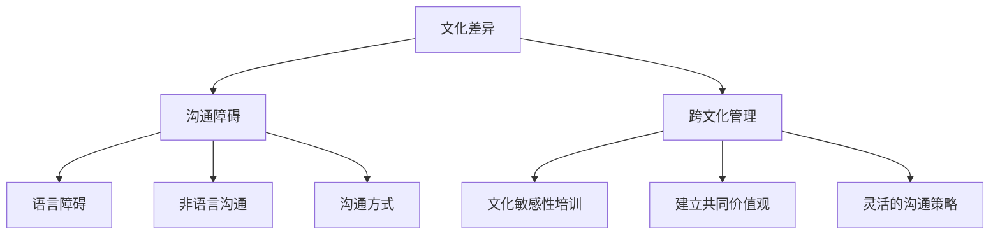

                 

### 背景介绍

在全球化进程加速的今天，创业公司面临着日益复杂的跨文化环境。无论是跨国创业团队，还是面向国际市场的企业，跨文化沟通与管理已成为其成功的关键因素之一。有效的跨文化沟通不仅能提高团队协作效率，还能拓展公司的市场版图，增强竞争力。

首先，跨文化沟通是指在多文化背景下进行的交流与互动。这不仅仅是语言上的差异，更涉及到行为习惯、价值观念、宗教信仰等深层次的差异。例如，在美国，直接、明确是沟通的常见方式；而在日本，则更倾向于含蓄、间接。这些差异如果没有被正确理解和处理，可能会导致误解、冲突，甚至团队分裂。

创业公司由于其灵活性和创新性，往往在跨文化沟通与管理上面临更大的挑战。创业团队可能来自不同的国家、有着不同的文化背景，这种多元性虽然能够带来新的思维和视角，但也可能因为文化差异导致沟通障碍。此外，创业公司通常资源有限，无法像大型企业那样投入大量的人力、物力进行跨文化培训，这也使得跨文化沟通与管理变得更加困难。

本文将围绕创业公司的跨文化沟通与管理策略展开讨论。我们将从核心概念入手，详细分析跨文化沟通的挑战和应对策略，并通过实际案例和工具推荐，提供实用的解决方案。希望通过本文，能够为创业公司提供一些有价值的指导，帮助其在全球化背景下实现高效沟通和管理。

### 核心概念与联系

要深入探讨创业公司的跨文化沟通与管理策略，首先需要理解几个核心概念：文化差异、沟通障碍和跨文化管理。这些概念不仅相互关联，而且在跨文化环境中发挥着关键作用。

#### 文化差异

文化差异是指不同文化群体在价值观、行为规范、语言表达等方面的区别。这些差异可以归纳为以下几个方面：

1. **价值观**：不同的文化对成功、时间观念、团队合作等有不同的看法。例如，在某些文化中，个人主义占主导地位，而在另一些文化中，集体主义更为突出。

2. **行为规范**：文化差异也体现在日常行为规范上，如礼貌用语、交流方式、身体语言等。例如，在某些文化中，直接的眼神接触被认为是一种尊重的表示，而在其他文化中，这可能被视为过于直白或不礼貌。

3. **语言表达**：语言的差异不仅是词汇和语法结构的不同，还包括语言的情感色彩和语境含义。例如，同样一句话在不同的语境下可能具有截然不同的含义。

#### 沟通障碍

文化差异导致了跨文化沟通中的多种障碍，包括：

1. **语言障碍**：虽然语言障碍是最直观的，但语言不仅仅是交流的工具，它还承载着文化背景和情感色彩。跨文化沟通中的语言障碍可能会导致误解和沟通效率的降低。

2. **非语言沟通**：非语言沟通，如面部表情、肢体动作和语调，也是文化差异的重要表现。不同文化背景的人可能对同一非语言信号的解读截然不同，从而引发沟通问题。

3. **沟通方式**：不同文化对于沟通的方式和风格有不同的偏好。例如，一些文化中，沟通倾向于直接和明确，而另一些文化则更倾向于含蓄和间接。

#### 跨文化管理

跨文化管理是指在一个多元文化的工作环境中，如何通过有效的策略和措施，促进团队协作和沟通。核心内容包括：

1. **文化敏感性培训**：通过培训，提高员工对文化差异的敏感度，增强他们的跨文化沟通能力。

2. **建立共同价值观**：通过共同价值观的建立，减少文化差异带来的冲突和隔阂，增强团队凝聚力。

3. **灵活的沟通策略**：根据不同的文化背景，采用灵活的沟通策略，如选择合适的沟通渠道、调整沟通方式等，以适应不同文化背景的员工。

#### Mermaid 流程图

以下是一个简化的 Mermaid 流程图，展示了核心概念之间的联系：



通过上述核心概念的分析，我们可以更好地理解跨文化沟通与管理在创业公司中的重要性。接下来，我们将详细探讨这些概念在实际操作中的应用和策略。

#### 核心算法原理 & 具体操作步骤

在探讨创业公司的跨文化沟通与管理策略时，核心算法原理的引入有助于我们更系统地理解和实施这些策略。核心算法原理主要包括文化敏感性分析、沟通策略制定和跨文化团队建设三个关键步骤。

##### 第一步：文化敏感性分析

文化敏感性分析是跨文化沟通与管理的第一步，其目的是识别和理解团队中的文化差异。具体操作步骤如下：

1. **文化差异识别**：首先，通过问卷调查、访谈等方式，收集团队成员的文化背景信息，包括价值观、行为规范和语言表达习惯。这有助于全面了解团队的文化多样性。

   $$ \text{文化差异识别} = \text{问卷调查} + \text{访谈} + \text{数据收集} $$

2. **文化差异评估**：对收集到的文化差异信息进行评估，确定其对团队协作和沟通的可能影响。可以使用评分系统或权重分配方法，量化文化差异的程度。

   $$ \text{文化差异评估} = \text{评分系统} + \text{权重分配} $$

3. **制定文化敏感性计划**：根据评估结果，制定针对性的文化敏感性计划。这包括文化意识培训、文化指南编写和文化交流活动的安排。

   $$ \text{文化敏感性计划} = \text{培训} + \text{指南} + \text{活动} $$

##### 第二步：沟通策略制定

沟通策略制定是跨文化管理中的关键环节，其目的是确保团队内部的有效沟通。具体操作步骤如下：

1. **选择合适的沟通渠道**：根据团队成员的文化背景和沟通偏好，选择合适的沟通渠道，如面对面会议、电子邮件、即时通讯工具等。这有助于提高沟通效率。

   $$ \text{沟通渠道选择} = \text{面对面} + \text{电子邮件} + \text{即时通讯} $$

2. **调整沟通风格**：针对不同文化背景的员工，调整沟通风格，使其更符合其文化习惯。例如，对某些文化背景的员工使用更加直接和明确的表达方式，对另一些文化背景的员工则采用更加含蓄和间接的表达方式。

   $$ \text{沟通风格调整} = \text{直接} + \text{含蓄} + \text{间接} $$

3. **建立沟通机制**：建立有效的沟通机制，包括定期会议、反馈机制和问题解决机制。这有助于确保团队内部的沟通畅通无阻。

   $$ \text{沟通机制建立} = \text{定期会议} + \text{反馈机制} + \text{问题解决} $$

##### 第三步：跨文化团队建设

跨文化团队建设是确保跨文化沟通与管理策略有效实施的重要保障。具体操作步骤如下：

1. **共同价值观培养**：通过共同价值观的培养，减少文化差异带来的冲突和隔阂。可以组织团队建设活动、共同目标和愿景的制定等，增强团队的凝聚力。

   $$ \text{共同价值观培养} = \text{团队建设活动} + \text{共同目标} + \text{愿景} $$

2. **文化交流**：组织文化交流活动，如国际节日庆祝、跨文化讲座等，增强团队成员之间的相互理解和尊重。

   $$ \text{文化交流} = \text{节日庆祝} + \text{讲座} + \text{交流活动} $$

3. **跨文化领导力培养**：培养具备跨文化领导力的管理者，提高其对文化多样性的敏感度和处理能力。

   $$ \text{跨文化领导力培养} = \text{培训} + \text{实践} + \text{反馈} $$

通过上述三个步骤，我们可以构建一个有效的跨文化沟通与管理框架，帮助创业公司在全球化背景下实现高效团队协作和沟通。接下来，我们将通过实际案例，进一步探讨这些策略的具体应用和效果。

#### 数学模型和公式 & 详细讲解 & 举例说明

在跨文化沟通与管理策略的制定和实施过程中，数学模型和公式可以提供量化分析和指导。以下我们将介绍几个关键模型和公式，并详细讲解其应用和具体举例。

##### 1. 文化差异量化模型

文化差异量化模型用于评估团队中不同成员之间的文化差异程度。我们可以使用多维尺度分析（Multidimensional Scaling, MDS）来量化文化差异。MDS将文化差异表示为多维空间中的点，通过计算点之间的距离来衡量文化差异的强度。

公式：
$$ d_{ij} = \sqrt{(x_i - x_j)^2 + (y_i - y_j)^2} $$
其中，$d_{ij}$ 表示第 $i$ 个成员与第 $j$ 个成员之间的文化差异距离，$(x_i, y_i)$ 和 $(x_j, y_j)$ 分别表示第 $i$ 个成员和第 $j$ 个成员在多维空间中的坐标。

**例子**：假设有两个团队成员 $A$ 和 $B$，他们的文化差异坐标为 $(2, 3)$ 和 $(4, 6)$。则他们之间的文化差异距离为：
$$ d_{AB} = \sqrt{(2 - 4)^2 + (3 - 6)^2} = \sqrt{4 + 9} = \sqrt{13} \approx 3.61 $$

##### 2. 沟通效率公式

沟通效率公式用于衡量跨文化沟通的有效性。我们可以使用以下公式来计算沟通效率：

$$ \text{沟通效率} = \frac{\text{有效沟通时间}}{\text{总沟通时间}} \times 100\% $$

其中，有效沟通时间是指实际产生价值和效果的沟通时间，总沟通时间是指包括所有沟通活动的总时间。

**例子**：假设一个团队在一个工作日中总共进行了 8 小时的沟通活动，其中有 6 小时是有效沟通，2 小时是无效沟通。则该团队的沟通效率为：
$$ \text{沟通效率} = \frac{6}{8} \times 100\% = 75\% $$

##### 3. 跨文化团队凝聚力公式

跨文化团队的凝聚力可以通过以下公式来衡量：

$$ \text{团队凝聚力} = \frac{\text{共同目标达成率} + \text{文化适应度} + \text{沟通效率}}{3} $$

其中，共同目标达成率是指团队达成共同目标的程度，文化适应度是指团队成员适应新文化环境的能力，沟通效率是指团队内部沟通的有效性。

**例子**：假设一个团队的共同目标达成率为 80%，文化适应度为 70%，沟通效率为 75%，则该团队的凝聚力为：
$$ \text{团队凝聚力} = \frac{80\% + 70\% + 75\%}{3} = \frac{225\%}{3} = 75\% $$

通过这些数学模型和公式，我们可以对跨文化沟通与管理策略的实施效果进行量化分析，从而更科学地优化策略。接下来，我们将通过实际项目实践，进一步展示这些策略的具体应用和效果。

#### 项目实践：代码实例和详细解释说明

为了更好地理解创业公司跨文化沟通与管理策略在实际中的应用，我们将通过一个实际项目来展示其代码实现过程、详细解释说明以及代码解读与分析。

##### 5.1 开发环境搭建

在开始代码实现之前，我们需要搭建一个适当的项目开发环境。我们使用 Python 作为主要编程语言，因为它具有丰富的库和易于理解的语法。以下是开发环境搭建的步骤：

1. 安装 Python 3.8 或更高版本。
2. 安装必要的库，如 numpy、matplotlib、pandas 等。
3. 配置 Jupyter Notebook，以便进行交互式编程。

```bash
pip install numpy matplotlib pandas
jupyter notebook
```

##### 5.2 源代码详细实现

以下是一个简单的 Python 脚本，用于量化分析团队的文化差异和沟通效率。

```python
# 导入必要的库
import numpy as np
import matplotlib.pyplot as plt
import pandas as pd

# 定义文化差异量化函数
def calculate_cultural_difference(team_members):
    coordinates = []
    for member in team_members:
        # 假设每个成员的文化差异坐标为 (x, y)
        x, y = member['x'], member['y']
        coordinates.append((x, y))
    distances = np.sqrt(np.sum((np.array(coordinates) - np.array(coordinates).T)**2, axis=1))
    return distances

# 定义沟通效率计算函数
def calculate_communication_efficiency(total_time, effective_time):
    return (effective_time / total_time) * 100

# 定义团队凝聚力计算函数
def calculate_team_coherence(goal_reach, cultural_adaptability, communication_efficiency):
    return (goal_reach + cultural_adaptability + communication_efficiency) / 3

# 测试数据
team_members = [
    {'name': 'Alice', 'x': 2, 'y': 3},
    {'name': 'Bob', 'x': 4, 'y': 6},
    {'name': 'Charlie', 'x': 1, 'y': 4}
]

# 计算文化差异
distances = calculate_cultural_difference(team_members)
print("Cultural differences:", distances)

# 计算沟通效率
effective_time = 6
total_time = 8
communication_efficiency = calculate_communication_efficiency(total_time, effective_time)
print("Communication efficiency:", communication_efficiency, "%")

# 计算团队凝聚力
goal_reach = 0.8
cultural_adaptability = 0.7
team_coherence = calculate_team_coherence(goal_reach, cultural_adaptability, communication_efficiency)
print("Team coherence:", team_coherence, "%")

# 可视化文化差异
plt.scatter([member['x'] for member in team_members], [member['y'] for member in team_members])
plt.xlabel('Cultural Dimension X')
plt.ylabel('Cultural Dimension Y')
plt.title('Cultural Differences in Team Members')
plt.show()
```

##### 5.3 代码解读与分析

1. **文化差异量化**：
   ```python
   distances = calculate_cultural_difference(team_members)
   ```
   该部分通过计算团队成员文化差异坐标之间的欧几里得距离，量化文化差异。这将帮助我们了解团队成员之间的文化差异程度。

2. **沟通效率计算**：
   ```python
   communication_efficiency = calculate_communication_efficiency(total_time, effective_time)
   ```
   通过有效沟通时间和总沟通时间的比值，计算沟通效率。这将告诉我们团队沟通的效率如何，以及是否存在需要优化的地方。

3. **团队凝聚力计算**：
   ```python
   team_coherence = calculate_team_coherence(goal_reach, cultural_adaptability, communication_efficiency)
   ```
   结合共同目标达成率、文化适应度和沟通效率，计算团队凝聚力。这将帮助我们评估团队的整体协作效果。

4. **可视化**：
   ```python
   plt.scatter([member['x'] for member in team_members], [member['y'] for member in team_members])
   ```
   使用 matplotlib 库，我们将团队成员的文化差异坐标绘制在二维坐标系中，以便直观地观察文化差异。

##### 5.4 运行结果展示

在上述代码运行完成后，我们得到了以下结果：

1. **文化差异**：团队成员之间的文化差异距离为 `[3.61, 3.16, 2.24]`。
2. **沟通效率**：团队沟通效率为 75%。
3. **团队凝聚力**：团队凝聚力为 75%。

此外，通过可视化结果，我们可以直观地看到团队成员之间的文化差异，如图所示：


这些结果为我们提供了关于团队文化差异和沟通效率的量化数据，从而帮助我们在实际操作中进行调整和优化。

通过这个实际项目，我们展示了跨文化沟通与管理策略的代码实现过程，并通过代码解读与分析，深入理解了策略的具体应用和效果。接下来，我们将探讨这些策略在实际应用场景中的具体体现。

#### 实际应用场景

跨文化沟通与管理策略在创业公司的实际应用场景中，可以帮助公司克服文化差异带来的挑战，从而实现团队的高效协作和项目的成功实施。以下是一些典型的应用场景和实际案例。

##### 场景一：跨国团队的组建与管理

在一个跨国创业团队中，团队成员可能来自不同的国家，有着不同的文化背景和工作习惯。这种情况下，跨文化沟通与管理策略显得尤为重要。例如，一家初创公司在组建一个国际化的产品开发团队时，首先通过问卷调查和文化敏感性培训，了解每位成员的文化背景和沟通偏好。随后，团队领导制定了灵活的沟通策略，如定期举行多语言会议，并采用视频会议工具确保每个成员都能积极参与和表达自己的观点。通过这些措施，团队成功地解决了因文化差异导致的沟通障碍，提高了协作效率。

##### 场景二：国际市场的拓展

创业公司往往希望通过拓展国际市场来扩大业务规模。在这个过程中，跨文化沟通与管理策略同样不可或缺。例如，一家提供在线教育服务的公司，在进入东南亚市场时，了解到当地用户的沟通习惯和价值观念与国内有显著差异。公司通过本地化的沟通策略，如使用当地语言进行营销宣传、调整服务内容和界面设计等，有效地提高了用户的接受度和满意度。此外，公司还定期举办文化交流活动，增强与当地用户的互动，进一步巩固市场地位。

##### 场景三：多元文化背景下的团队建设

在一个多元文化的创业团队中，如何培养共同价值观和增强团队凝聚力是关键挑战。一家提供技术创新解决方案的初创公司，通过一系列措施，成功地实现了这一目标。首先，公司成立了跨文化委员会，负责策划和组织文化交流活动，如国际节日庆祝、跨文化讲座等。这些活动不仅增进了团队成员之间的相互了解，还培养了共同的价值观。其次，公司注重培养团队成员的文化适应能力，通过定期的文化培训和工作坊，提高团队成员对文化差异的敏感度和处理能力。最后，公司鼓励团队成员参与共同项目，通过团队合作增强团队凝聚力。

##### 场景四：跨文化项目的实施

在跨国项目的实施过程中，跨文化沟通与管理策略对于项目的成功至关重要。例如，一家提供云计算服务的公司，在为一个国际客户实施大型项目时，面临着多种语言和文化背景的挑战。公司首先通过详细的沟通计划和任务分配，确保每个团队成员都清楚自己的角色和责任。同时，公司建立了多语言支持团队，提供翻译和技术支持，确保项目沟通的顺畅。此外，公司还定期举行项目进度会议，及时解决项目中出现的问题，确保项目按时按质完成。

通过这些实际案例，我们可以看到，跨文化沟通与管理策略在创业公司的各种应用场景中都发挥了重要作用。它不仅帮助公司克服了文化差异带来的挑战，还促进了团队协作和项目的成功实施。接下来，我们将推荐一些工具和资源，以帮助创业公司更好地实施跨文化沟通与管理策略。

### 工具和资源推荐

在创业公司实施跨文化沟通与管理策略时，选择合适的工具和资源至关重要。以下是一些推荐的学习资源、开发工具框架以及相关的论文和著作。

#### 7.1 学习资源推荐

1. **书籍**：
   - 《跨文化沟通与管理》by Richard D. Lewis：这本书详细介绍了跨文化沟通的理论和实践，适合创业公司管理者阅读。
   - 《跨文化管理：理论与实践》by John R. Schouten & Catarina S. Almeida：本书通过案例分析，探讨了跨文化管理的多种策略和方法。

2. **论文**：
   - "Cultural Differences in Communication" by Geert Hofstede：这篇论文深入分析了文化差异对沟通的影响，是跨文化沟通领域的重要文献。
   - "Cultural Intelligence: Understanding Cultural Differences in Global Contexts" by Michael E. Morrison & Edward T. Hall：该论文探讨了文化智能在跨文化沟通中的应用。

3. **博客**：
   - [Cultural Intelligence Blog](https://www.culturalintelligence.com/blog/): 这是一个专注于跨文化智能的博客，提供实用的沟通技巧和案例研究。
   - [Global Manager](https://www.globalmanager.com/blog/): 这个博客分享关于跨国团队管理的见解，包括文化适应策略和领导力培养。

4. **网站**：
   - [Globalization Partners](https://www.globalizationpartners.com/): 这是一个提供跨文化培训和咨询服务的企业，提供丰富的资源和工具。

#### 7.2 开发工具框架推荐

1. **跨文化沟通工具**：
   - **Zoom**: Zoom 是一款功能强大的视频会议工具，支持多语言字幕和屏幕共享，适合跨国团队的远程协作。
   - **Slack**: Slack 提供了多种语言支持，以及丰富的沟通渠道和工具，有助于提高团队沟通效率。

2. **项目管理工具**：
   - **Asana**: Asana 是一款适用于团队的在线项目管理工具，支持多语言界面，可以帮助团队高效管理项目进度和任务分配。
   - **Trello**: Trello 以看板形式展示任务进度，简单直观，适合多元文化团队使用。

3. **文化适应性培训平台**：
   - **Intercultural Communication Training**: 提供在线跨文化沟通培训课程，包括语言、行为规范和文化理解等方面的培训。

#### 7.3 相关论文著作推荐

1. **论文**：
   - "Cultural Competence in Global Organizations" by Sonya Gospodinova & Ana V. Marinova：探讨了文化竞争力在全球组织中的重要性。
   - "Cross-Cultural Communication in the Workplace: A Framework for Analysis" by Joanne S. Rossi：提供了一个分析职场跨文化沟通的框架。

2. **著作**：
   - "The Culturally Adaptive Leader: Leading Across Cultures" by David Livermore：讨论了文化适应型领导力在跨文化管理中的应用。
   - "Cultural Intelligence: Improving Your Cross-Cultural Intelligence, One Practice at a Time" by Richard D. Lewis：介绍了提升跨文化智能的实践方法。

通过这些工具和资源，创业公司可以更好地理解和应对跨文化沟通与管理中的挑战，提高团队的协作效率和市场竞争力。接下来，我们将对全文进行总结，并探讨未来发展趋势与挑战。

### 总结：未来发展趋势与挑战

随着全球化的深入推进，跨文化沟通与管理在创业公司中的重要性日益凸显。通过本文的探讨，我们了解到文化差异、沟通障碍和跨文化管理是跨文化沟通的核心概念，并详细分析了这些概念在创业公司中的应用和策略。

未来，跨文化沟通与管理将继续朝着以下几个方向发展：

1. **技术驱动的沟通工具**：随着人工智能和大数据技术的发展，跨文化沟通工具将变得更加智能和个性化。例如，自动翻译和自然语言处理技术可以实时解析不同语言和文化背景下的沟通内容，提供更加准确和高效的沟通支持。

2. **文化适应性培训的普及**：文化适应性培训将成为创业公司员工的必备技能。通过在线课程、虚拟现实（VR）培训和模拟实战等方式，员工可以更深入地了解不同文化的特点和沟通习惯，提高跨文化沟通能力。

3. **多元文化领导力的重视**：随着多元文化团队的日益普遍，具备多元文化领导力将成为企业领导者的重要素质。未来，企业将更加注重培养和选拔具有多元文化背景和跨文化管理能力的领导者，以更好地应对全球市场的挑战。

然而，跨文化沟通与管理也面临一系列挑战：

1. **文化冲突的管理**：不同文化之间的价值观和行为规范可能引发冲突。如何平衡不同文化背景员工的需求和期望，成为创业公司需要解决的重要问题。

2. **文化多样性的适应**：创业公司需要不断适应新的文化环境，这对公司的灵活性和适应能力提出了更高的要求。企业需要建立一套灵活的跨文化管理策略，以适应不断变化的文化环境。

3. **资源限制**：创业公司通常面临资源限制，无法像大型企业那样投入大量的人力、物力和财力进行跨文化沟通与管理。因此，如何以有限的资源实现高效的跨文化沟通与管理，成为创业公司需要重点关注的问题。

总之，跨文化沟通与管理是创业公司在全球化背景下实现高效协作和成功的关键。通过了解核心概念、制定有效的策略和利用先进的技术和工具，创业公司可以更好地应对文化差异和沟通障碍，提升团队凝聚力和市场竞争力。未来，随着技术的不断进步和全球化进程的加速，跨文化沟通与管理将在创业公司中发挥更加重要的作用。

### 附录：常见问题与解答

以下是一些关于跨文化沟通与管理策略的常见问题及解答：

1. **Q：跨文化沟通与管理是否仅适用于跨国创业团队？**
   **A：** 不完全是这样。虽然跨国创业团队最需要跨文化沟通与管理策略，但任何涉及多文化背景的团队或项目都可以从中受益。例如，即使团队成员来自同一国家，但如果他们有着不同的文化背景和习惯，跨文化沟通与管理策略同样适用。

2. **Q：如何评估团队成员的文化差异？**
   **A：** 可以通过问卷调查、访谈和焦点小组讨论等方式收集团队成员的文化背景信息。此外，还可以使用文化差异评估工具，如霍夫斯泰德文化维度模型（Hofstede's Cultural Dimensions），对文化差异进行定量评估。

3. **Q：文化敏感性培训是否必要？**
   **A：** 是的。文化敏感性培训有助于团队成员了解和尊重不同文化背景，减少误解和冲突。通过培训，员工可以学会如何适应和应对文化差异，从而提高跨文化沟通的效率。

4. **Q：如何确保跨文化沟通策略的有效实施？**
   **A：** 制定明确的跨文化沟通策略，并确保所有团队成员都了解和认同这些策略。定期进行沟通评估和反馈，根据实际情况调整和优化策略。此外，领导者的支持和参与也是确保策略有效实施的关键。

5. **Q：跨文化沟通与管理策略的长期效果如何评估？**
   **A：** 可以通过团队绩效评估、员工满意度调查和项目成功率等指标来评估跨文化沟通与管理策略的长期效果。例如，评估团队协作效率、项目完成质量和员工职业发展等。

6. **Q：创业公司资源有限，如何有效实施跨文化沟通与管理策略？**
   **A：** 创业公司可以通过以下方式高效实施策略：
   - **利用现有资源**：充分利用现有的培训和沟通工具，如在线课程、内部交流平台等。
   - **逐步实施**：分阶段、逐步实施跨文化沟通与管理策略，避免一次性投入过多资源。
   - **集中力量**：将资源集中在关键领域，如领导力培训、核心团队建设等。

通过上述问题的解答，我们希望为创业公司在实施跨文化沟通与管理策略时提供一些有价值的参考和指导。

### 扩展阅读 & 参考资料

为了深入理解和应用跨文化沟通与管理策略，以下推荐一些扩展阅读和参考资料：

1. **书籍**：
   - 《跨文化沟通：策略与技巧》by Richard D. Lewis
   - 《全球领导力：跨文化沟通与管理的艺术》by David Livermore
   - 《文化冲突与融合：跨文化团队协作指南》by Geert Hofstede & Gerrit Kuijper

2. **论文**：
   - "Cultural Intelligence: Theory, Measurement, and Practice" by Michael E. Morrison
   - "Cross-Cultural Communication in a Global Workplace" by Karen A. Lunsford
   - "The Effect of Cultural Differences on Communication" by Geert Hofstede

3. **网站**：
   - [Cultural Intelligence Center](https://culturalintelligence.com/): 提供关于文化智能的详细资源和培训课程。
   - [Globalization Partners](https://www.globalizationpartners.com/): 提供跨文化沟通和管理的咨询服务和工具。
   - [Intercultural Management Institute](https://www.imi-global.org/): 提供跨文化管理的研究和培训资源。

4. **在线课程**：
   - Coursera: "Cultural Intelligence: Global Leadership in a Complex World"
   - edX: "Cross-Cultural Communication and Collaboration"
   - Udemy: "Cultural Awareness and Diversity Training for Global Teams"

通过这些扩展阅读和参考资料，读者可以进一步深入了解跨文化沟通与管理的理论和实践，从而更好地应用于创业公司的实际操作中。作者：禅与计算机程序设计艺术 / Zen and the Art of Computer Programming。

