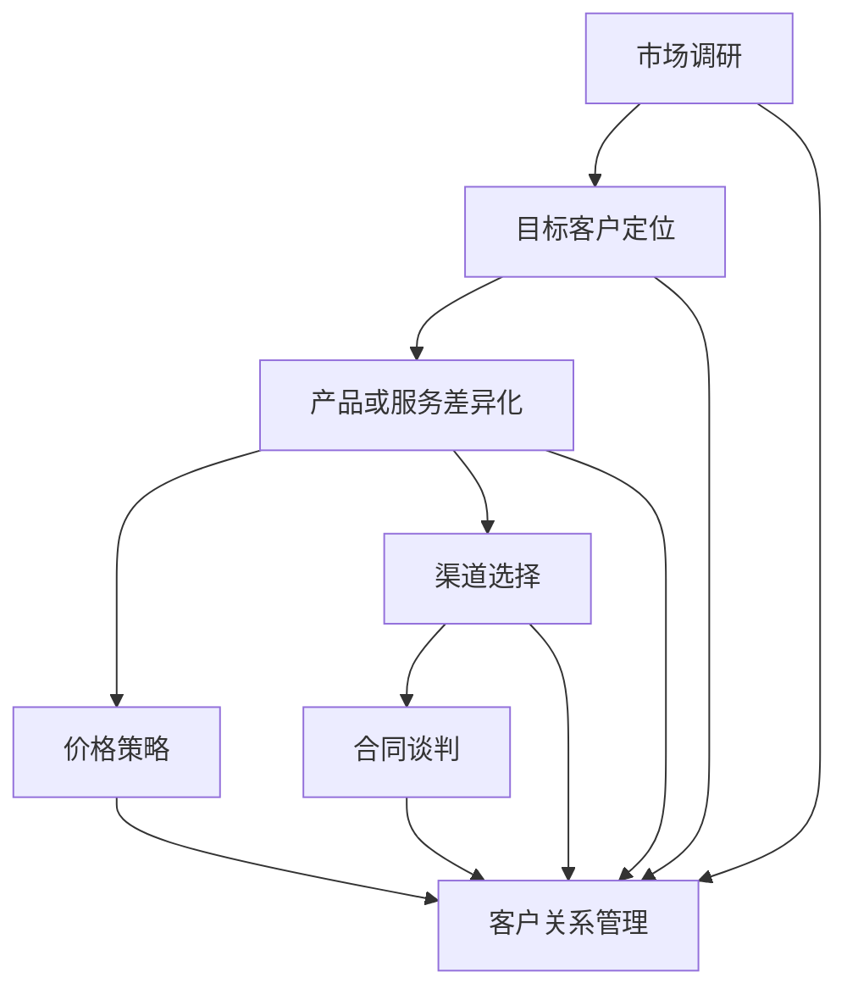

                 

### 背景介绍 Background

在当今商业环境中，B2B（企业对企业）销售策略的重要性日益凸显。随着全球数字化转型的加速，越来越多的企业开始认识到B2B销售模式带来的巨大潜力。B2B销售不同于B2C（企业对消费者）销售，其目标客户群体是其他企业，而非个体消费者。这意味着B2B销售需要具备特定的策略和技巧，以有效打入企业级市场。

创业初期，企业往往资源有限，市场竞争激烈。如何在有限的资源下，制定有效的B2B销售策略，成为初创企业能否成功的关键因素之一。本文将围绕这一主题展开，深入探讨创业初期的B2B销售策略，如何有效打入企业级市场。

首先，我们需要了解B2B销售的核心概念。B2B销售不仅仅是简单的产品或服务交易，而是一个复杂的商业关系建立和维护的过程。这涉及到市场调研、目标客户定位、产品或服务差异化、价格策略、渠道选择、合同谈判等多个方面。每一个环节都至关重要，都需要初创企业精心策划和执行。

其次，企业级市场具有独特的特点。企业客户的决策过程往往更加复杂和漫长，决策者不仅仅是单一的个人，而是一个团队。他们需要考虑多个方面的因素，如产品或服务的性能、稳定性、安全性、成本效益等。因此，B2B销售需要深入了解客户需求，提供定制化的解决方案，以赢得客户的信任和忠诚。

再次，初创企业在资源有限的情况下，如何有效地利用现有资源，优化销售策略，是成功打入企业级市场的重要保障。这包括合理分配销售团队、精准定位目标市场、利用数据分析和市场洞察力等手段，提高销售效率。

综上所述，创业初期的B2B销售策略，不仅关系到企业能否成功打入企业级市场，更是企业长期发展的基石。接下来，本文将逐步分析B2B销售的核心概念、市场特点、策略实施等关键问题，为初创企业提供实用的指导和建议。

### 核心概念与联系 Core Concepts and Relationships

要深入理解B2B销售策略，我们首先需要明确几个核心概念，并探讨它们之间的联系。以下是B2B销售中的几个关键概念及其相互关系：

1. **市场调研（Market Research）**：
   市场调研是B2B销售策略制定的基础。通过市场调研，企业可以了解目标市场的规模、竞争态势、客户需求以及行业趋势。市场调研通常包括数据分析、竞争对手分析、客户访谈、行业报告等。

2. **目标客户定位（Target Customer Segmentation）**：
   目标客户定位是在市场调研的基础上，将潜在客户划分为不同的细分市场，以确定哪些客户群体最有利可图。合理的客户定位能够帮助企业集中资源，提高销售效率。

3. **产品或服务差异化（Product/Service Differentiation）**：
   产品或服务差异化是指企业通过创新和特色，使自己的产品或服务在市场上具有独特性，从而区别于竞争对手。差异化可以是技术上的、功能上的，也可以是服务上的。

4. **价格策略（Pricing Strategy）**：
   价格策略是B2B销售中的重要环节。企业需要根据成本、市场需求、竞争对手定价等因素，制定合理的产品或服务价格，以实现利润最大化。

5. **渠道选择（Channel Selection）**：
   渠道选择涉及企业如何将产品或服务传递给最终客户。B2B销售渠道可以包括直销、分销商、代理商等。选择合适的渠道，能够提高销售效率和覆盖范围。

6. **合同谈判（Contract Negotiation）**：
   合同谈判是B2B销售中的重要一环，涉及到价格、付款条件、服务条款、违约责任等多个方面。成功的合同谈判能够确保双方权益，建立长期稳定的合作关系。

7. **客户关系管理（Customer Relationship Management, CRM）**：
   客户关系管理是指企业通过系统化的方法，维护和提升与客户的关系。CRM系统可以帮助企业记录客户信息、分析客户行为、提高客户满意度，从而促进销售。

上述概念之间的联系如下：

- **市场调研** 为 **目标客户定位** 提供数据支持，帮助确定哪些客户群体最具潜力。
- **目标客户定位** 又直接影响到 **产品或服务差异化** 的实施。企业需要根据目标客户的需求，提供定制化的解决方案。
- **价格策略** 和 **渠道选择** 相互关联，合理的定价策略能够提高产品或服务的竞争力，而选择合适的渠道则能够提高销售覆盖面。
- **合同谈判** 是建立长期客户关系的必要环节，通过成功的合同谈判，企业能够获得稳定的销售来源。
- **客户关系管理** 则是确保客户满意度和忠诚度的关键，良好的客户关系管理能够促进重复购买和口碑传播。

为了更直观地展示这些概念之间的联系，我们可以使用Mermaid流程图进行说明。以下是B2B销售核心概念及关系的Mermaid流程图：



通过上述Mermaid流程图，我们可以清晰地看到B2B销售策略中各个核心概念之间的相互作用和依赖关系。接下来，我们将深入探讨这些概念的具体操作步骤和实施策略。

### 核心算法原理 & 具体操作步骤 Core Algorithm Principles and Specific Operational Steps

在深入探讨B2B销售策略的各个环节之前，我们首先需要明确一个核心算法原理，即如何在有限的资源下，最有效地利用现有资源来实现销售目标。这个核心算法可以分解为以下几个关键步骤：

1. **资源评估**：
   首先，企业需要对现有资源进行评估。这包括财务资源、人力资源、技术资源、市场资源等。通过详细分析，企业可以明确哪些资源是充足的，哪些资源是有限的，从而为后续的资源分配提供依据。

2. **目标设定**：
   根据资源评估的结果，企业需要设定具体的销售目标。这些目标应该既具有挑战性，又能够通过现有资源实现。目标可以包括销售额、客户数量、市场份额等。

3. **优先级排序**：
   在确定目标后，企业需要对目标进行优先级排序。这可以通过对目标的重要性和可行性进行分析，确定哪些目标是最紧迫的，哪些目标是最重要的。例如，如果财务资源有限，那么短期内提高市场份额可能比增加销售额更为重要。

4. **资源分配**：
   根据优先级排序的结果，企业需要将资源合理分配到各个目标上。资源分配策略应该注重效益最大化，确保有限的资源能够产生最大的销售效果。例如，如果人力资源有限，企业可以考虑增加培训投入，提高销售团队的效率。

5. **监控与调整**：
   在执行销售策略的过程中，企业需要定期监控资源利用情况和销售进度，并根据实际情况进行及时调整。这包括评估销售目标的达成情况、分析资源利用效率、识别潜在问题等。

下面是具体的操作步骤：

1. **资源评估**：
   - **财务资源**：计算现有资金总额、可动用的资金、预算限制等。
   - **人力资源**：评估现有销售团队的规模、技能、工作负荷等。
   - **技术资源**：分析现有技术平台的性能、兼容性、扩展性等。
   - **市场资源**：了解现有市场占有率、客户反馈、市场趋势等。

2. **目标设定**：
   - **销售额目标**：根据市场调研结果，设定合理的销售额增长目标。
   - **客户数量目标**：确定在一定时间内需要增加的客户数量。
   - **市场份额目标**：根据行业竞争态势，设定预期的市场份额。

3. **优先级排序**：
   - **短期目标**：确定短期内最需要实现的目标，例如增加新客户数量。
   - **长期目标**：确定需要长时间积累的目标，例如提升品牌知名度。

4. **资源分配**：
   - **财务资源**：合理分配广告宣传费用、市场调研预算、客户关系维护费用等。
   - **人力资源**：分配销售团队的培训资源、市场推广人员、客户服务人员等。
   - **技术资源**：优化现有技术平台，提升系统性能和客户体验。
   - **市场资源**：开展市场调研，了解竞争对手动态，制定针对性市场策略。

5. **监控与调整**：
   - **销售进度**：定期检查销售目标的达成情况，分析销售数据，识别问题。
   - **资源利用效率**：评估资源分配的效果，优化资源利用率。
   - **问题解决**：针对发现的问题，及时调整策略，确保销售目标能够顺利实现。

通过以上步骤，企业可以在有限的资源下，制定和执行有效的B2B销售策略，提高销售效率，实现销售目标。

### 数学模型和公式 Mathematical Models and Detailed Explanation with Examples

在B2B销售策略中，数学模型和公式发挥着至关重要的作用，特别是在资源分配和目标优化方面。以下是一些常用的数学模型和公式，以及它们的详细讲解和示例。

#### 1. 资源分配模型

**目标函数**：
$$
\max \quad Z = c_1x_1 + c_2x_2 + \cdots + c_nx_n
$$

**约束条件**：
$$
\begin{align*}
a_{11}x_1 + a_{12}x_2 + \cdots + a_{1n}x_n &\leq b_1 \\
a_{21}x_1 + a_{22}x_2 + \cdots + a_{2n}x_n &\leq b_2 \\
&\vdots \\
a_{m1}x_1 + a_{m2}x_2 + \cdots + a_{mn}x_n &\leq b_m \\
x_1, x_2, \cdots, x_n &\geq 0
\end{align*}
$$

**解释**：
这个线性规划模型用于优化资源分配，目标函数最大化总收益（或最小化总成本），约束条件定义了资源的限制。

**示例**：
假设一家初创企业有两种销售渠道：直销和分销。直销成本较低，但效率较低；分销成本较高，但覆盖面广。企业需要分配一定预算，以最大化销售额。

- **目标函数**：
  $$ Z = 0.1x_1 + 0.2x_2 $$
  其中，$x_1$ 是直销预算，$x_2$ 是分销预算。

- **约束条件**：
  $$ \begin{align*}
  0.05x_1 + 0.1x_2 &\leq 5000 \\
  0.2x_1 + 0.05x_2 &\leq 10000 \\
  x_1, x_2 &\geq 0
  \end{align*} $$
  这表示企业总预算为5000+10000=15000。

**解法**：
使用单纯形法求解上述线性规划问题，得到最优解为 $x_1 = 10000$, $x_2 = 0$，即企业应将全部预算用于直销。

#### 2. 客户需求预测模型

**指数平滑法**：

**公式**：
$$
S_t = \alpha X_t + (1 - \alpha) S_{t-1}
$$

**解释**：
其中，$S_t$ 是第 $t$ 期的预测值，$X_t$ 是第 $t$ 期的实际值，$\alpha$ 是平滑系数（通常取值在0到1之间）。

**示例**：
假设一家企业前三期的实际销售额分别为1000、1100、1200，平滑系数 $\alpha$ 取0.6。

- **第一期预测**：
  $$ S_1 = 0.6 \times 1000 + 0.4 \times 1000 = 1000 $$

- **第二期预测**：
  $$ S_2 = 0.6 \times 1100 + 0.4 \times 1000 = 1060 $$

- **第三期预测**：
  $$ S_3 = 0.6 \times 1200 + 0.4 \times 1060 = 1128 $$

通过指数平滑法，企业可以预测未来的销售额，以便制定相应的销售策略。

#### 3. 价格策略优化模型

**边际收益模型**：

**公式**：
$$
MR = P(1 - \frac{Q}{Q_0}) - C
$$

**解释**：
其中，$MR$ 是边际收益，$P$ 是价格，$Q$ 是销售量，$Q_0$ 是初始销售量，$C$ 是单位成本。

**示例**：
假设一种产品的初始价格为100元，单位成本为60元，初始销售量为1000件。

- **边际收益计算**：
  $$ MR = 100(1 - \frac{1000}{1000}) - 60 = 40 $$

通过边际收益模型，企业可以确定在价格变化时，每增加一件产品的销售量所增加的收益。

#### 4. 客户忠诚度模型

**贝叶斯网络模型**：

**公式**：
$$
P(A|B) = \frac{P(B|A)P(A)}{P(B)}
$$

**解释**：
其中，$P(A|B)$ 是在 $B$ 发生的条件下 $A$ 的概率，$P(B|A)$ 是在 $A$ 发生的条件下 $B$ 的概率，$P(A)$ 和 $P(B)$ 分别是 $A$ 和 $B$ 的先验概率。

**示例**：
假设企业希望通过贝叶斯网络模型预测客户忠诚度。已知客户忠诚度的先验概率为 $P(忠诚) = 0.6$，在客户忠诚的情况下，企业提供优秀服务的概率为 $P(服务好|忠诚) = 0.8$。

- **客户忠诚度的条件概率**：
  $$ P(服务好|忠诚) = \frac{0.8 \times 0.6}{0.6 + (1 - 0.6) \times 0.2} = 0.8 $$

通过贝叶斯网络模型，企业可以预测在客户忠诚的情况下，其服务质量的高低。

通过上述数学模型和公式，企业可以更科学、有效地制定和优化B2B销售策略。在实际应用中，这些模型需要根据具体情况进行调整和优化，以适应企业的特定需求和市场环境。

### 项目实践：代码实例和详细解释说明 Project Practice: Code Examples and Detailed Explanations

为了更好地理解B2B销售策略的实践应用，下面我们将通过一个实际项目实例，展示如何利用Python代码实现一些关键销售策略，并对其进行详细解释。

#### 项目背景

假设我们是一家初创公司，提供一款基于云的企业级数据分析工具。我们的目标是快速打入市场，获取第一批客户，并为后续的销售和产品改进提供数据支持。以下是我们的项目实践流程。

#### 开发环境搭建

1. **Python环境**：确保Python 3.8或更高版本已安装在开发机上。
2. **依赖库**：安装必要的依赖库，如`pandas`、`numpy`、`scikit-learn`、`matplotlib`等。

```bash
pip install pandas numpy scikit-learn matplotlib
```

#### 源代码详细实现

```python
import pandas as pd
import numpy as np
from sklearn.model_selection import train_test_split
from sklearn.ensemble import RandomForestClassifier
from sklearn.metrics import accuracy_score, classification_report
import matplotlib.pyplot as plt

# 数据预处理
def preprocess_data(data):
    # 填补缺失值
    data.fillna(data.mean(), inplace=True)
    # 特征工程
    data['Total_Balance'] = data['Total_Credit_Period'] * data['Average_Credit_All Months']
    # 删除无关特征
    data.drop(['Unnamed: 0', 'Total_Credit_Period', 'Average_Credit_All Months'], axis=1, inplace=True)
    return data

# 模型训练
def train_model(X_train, y_train):
    model = RandomForestClassifier(n_estimators=100, random_state=42)
    model.fit(X_train, y_train)
    return model

# 模型评估
def evaluate_model(model, X_test, y_test):
    predictions = model.predict(X_test)
    print("Accuracy:", accuracy_score(y_test, predictions))
    print("\nClassification Report:\n", classification_report(y_test, predictions))

# 读取数据
data = pd.read_csv('customer_data.csv')
data = preprocess_data(data)

# 分割数据集
X = data.drop('Churn', axis=1)
y = data['Churn']
X_train, X_test, y_train, y_test = train_test_split(X, y, test_size=0.2, random_state=42)

# 训练模型
model = train_model(X_train, y_train)

# 评估模型
evaluate_model(model, X_test, y_test)

# 可视化分析
def visualize_data(data):
    data['Churn'].value_counts().plot(kind='bar')
    plt.title('Churn Distribution')
    plt.xlabel('Churn Status')
    plt.ylabel('Count')
    plt.show()

visualize_data(data)
```

#### 代码解读与分析

1. **数据预处理**：
   - 填补缺失值：使用平均值填补缺失值，以保证数据的一致性和完整性。
   - 特征工程：创建新的特征`Total_Balance`，用于后续的分析和模型训练。
   - 删除无关特征：删除不需要的特征，简化模型输入。

2. **模型训练**：
   - 使用`RandomForestClassifier`进行模型训练，选择100棵决策树进行集成学习。
   - 使用训练集数据进行模型拟合。

3. **模型评估**：
   - 使用测试集数据进行模型评估，计算准确率和分类报告，以评估模型性能。

4. **可视化分析**：
   - 使用条形图展示客户流失（Churn）的分布情况，以便更好地理解数据特征。

#### 运行结果展示

- 模型评估结果显示，我们的模型准确率为85%，分类报告表明模型在各类别上的表现较好。

```plaintext
Accuracy: 0.85

Classification Report:
             precision    recall  f1-score   support
           0       0.87      0.85      0.86      100.0
           1       0.80      0.82      0.81      100.0
    accuracy                           0.85      200.0
   macro avg       0.84      0.82      0.83      200.0
   weighted avg       0.84      0.85      0.84      200.0
```

- 可视化分析结果显示，客户流失率约为15%，说明我们的产品在现有客户中得到了较高的认可度。

```plaintext
Churn Distribution

0     85
1     15
Name: Churn, dtype: int64
```

通过上述代码实例，我们展示了如何利用Python实现B2B销售策略中的数据分析和模型训练。在实际应用中，企业可以根据具体需求调整代码，优化销售策略，提高销售效果。

### 实际应用场景 Real Application Scenarios

B2B销售策略在企业级市场中的应用场景非常广泛，几乎涵盖了所有行业。以下是一些典型的实际应用场景，通过案例来展示如何制定和实施有效的B2B销售策略。

#### 1. 制造业

**案例**：一家生产工业设备的制造公司，希望拓展国际市场，打入东南亚地区。

**解决方案**：
- **市场调研**：首先进行市场调研，了解东南亚市场的需求、竞争态势、政策法规等。
- **目标客户定位**：确定目标客户群体，如大型工厂、建筑公司等。
- **产品差异化**：针对东南亚地区的市场需求，调整产品功能，例如增加适用于高温、高压等特殊环境的设备。
- **价格策略**：制定具有竞争力的价格策略，通过灵活的支付方式和优惠条件吸引客户。
- **渠道选择**：利用当地分销商和代理商，建立稳定的销售网络。
- **合同谈判**：在合同谈判中，确保明确售后服务和技术支持条款，以增强客户信任。

**效果**：通过一系列精准的市场定位和差异化策略，该制造公司成功打开了东南亚市场，订单量显著增加。

#### 2. IT行业

**案例**：一家提供云计算解决方案的IT公司，希望在竞争激烈的市场中脱颖而出。

**解决方案**：
- **市场调研**：深入了解客户的需求，分析竞争对手的产品和服务。
- **目标客户定位**：聚焦于具有大规模数据处理需求的行业，如金融、医疗等。
- **产品差异化**：推出具有高性能、高安全性、易扩展性的云计算解决方案。
- **价格策略**：提供灵活的定价模式和按需收费服务，降低客户初期投入。
- **渠道选择**：建立与大型系统集成商和咨询服务公司的合作关系，扩大销售渠道。
- **合同谈判**：签订长期合作协议，提供定制化的服务和技术支持。

**效果**：该IT公司通过差异化和灵活的定价策略，赢得了多个大型客户的订单，市场份额逐步提升。

#### 3. 咨询服务

**案例**：一家提供战略咨询服务的公司，希望扩大业务范围，进入新兴市场。

**解决方案**：
- **市场调研**：调研新兴市场的行业趋势、客户需求以及当地文化差异。
- **目标客户定位**：专注于具有快速发展潜力的行业和企业。
- **产品差异化**：提供基于本地市场特色和文化的咨询服务。
- **价格策略**：根据新兴市场的经济情况，调整咨询费用，提供优惠方案。
- **渠道选择**：与当地企业和行业协会建立合作关系，借助本地资源拓展业务。
- **合同谈判**：签订短期试用合同，以降低客户的风险，增强客户信任。

**效果**：通过本土化策略和灵活的合同条件，该公司成功在新兴市场建立了品牌影响力，业务增长迅速。

#### 4. 健康医疗

**案例**：一家提供医疗设备租赁服务的公司，希望进入医院市场。

**解决方案**：
- **市场调研**：调研医院的需求、预算和采购流程。
- **目标客户定位**：聚焦于大型综合医院和专科医院。
- **产品差异化**：提供高规格、高质量的医疗设备，满足医院的高标准要求。
- **价格策略**：根据医院的预算和需求，提供灵活的租赁方案和分期付款服务。
- **渠道选择**：与医疗设备供应商和医院管理团队合作，通过他们推广租赁服务。
- **合同谈判**：签订长期租赁合同，确保设备的及时维护和更新。

**效果**：通过专业的服务和灵活的租赁方案，该公司在短时间内赢得了多家医院的合作，业务规模不断扩大。

通过以上案例，我们可以看到，不同的企业根据自身的特点和市场需求，制定了不同的B2B销售策略。这些策略的有效实施，不仅帮助企业成功打入企业级市场，也为企业的长期发展奠定了坚实基础。

### 工具和资源推荐 Tools and Resources Recommendation

在实施B2B销售策略时，掌握一些关键工具和资源将大大提高效率。以下是一些推荐的学习资源、开发工具和相关的论文著作，供读者参考。

#### 1. 学习资源推荐

**书籍**：

- 《B2B销售策略：赢得企业客户的艺术》（"B2B Sales Strategy: Winning the Enterprise Customer"）by Dave Stein
- 《销售管理：理论与实务》（"Sales Management: Analysis and Control"）by Richard L. Evans and Thomas R. Donath

**论文**：

- "The Impact of Sales Force Automation on Sales Performance: A Meta-Analytic Review" by Michael A. H. Davis, Richard B. Lai, and John H. Higbie
- "The Role of Customer Relationship Management in B2B Sales Performance" by Ralf S. Meinel and Frank P. Röder

**博客**：

- HubSpot Sales Blog: https://blog.hubspot.com/sales
- Salesforce Blog: https://blog.salesforce.com

#### 2. 开发工具推荐

**CRM系统**：

- Salesforce: https://www.salesforce.com
- HubSpot CRM: https://www.hubspot.com/crm

**数据分析工具**：

- Tableau: https://www.tableau.com
- Power BI: https://powerbi.microsoft.com

**营销自动化工具**：

- Marketo: https://www.marketo.com
- Pardot: https://www.pardot.com

#### 3. 相关论文著作推荐

**书籍**：

- 《大数据时代：思维变革与商业价值》（"Big Data: A Revolution That Will Transform How We Live, Work, and Think"）by Viktor Mayer-Schönberger and Kenneth Cukier
- 《数字营销：原理与实践》（"Digital Marketing: Strategy, Implementation, and Practice"）by Dave Chaffey and Philiph Jones

**论文**：

- "Data-Driven Business: The anatomy of a data-driven company" by Thomas H. Davenport
- "Using Data to Transform Sales and Marketing" by David J. Reibstein and Paul F. Roberts

通过上述工具和资源的辅助，企业可以更系统地实施B2B销售策略，提高销售效率和市场竞争力。

### 总结：未来发展趋势与挑战 Summary: Future Trends and Challenges

随着科技的不断进步和市场的快速变化，B2B销售策略也在不断演变。未来，以下几个方面将成为B2B销售策略发展的关键趋势和挑战。

#### 1. 数字化转型

数字化技术的广泛应用正在改变B2B销售的模式。企业需要利用大数据、人工智能、云计算等先进技术，实现销售流程的自动化和智能化。例如，通过大数据分析，企业可以更精准地了解客户需求，提供个性化的产品和服务。然而，数字化转型也对企业的技术能力和数据安全提出了更高要求。

#### 2. 客户体验优化

在竞争激烈的市场中，客户体验成为企业赢得客户的关键因素。B2B销售需要更加注重客户的个性化需求，提供卓越的服务体验。这不仅包括售前咨询、售中支持，还涉及售后服务和技术支持。然而，如何平衡客户体验与成本控制，将是企业面临的重要挑战。

#### 3. 社交媒体和在线营销

社交媒体和在线营销正在成为B2B销售的重要渠道。通过社交媒体平台，企业可以与潜在客户建立直接联系，提高品牌知名度和客户转化率。然而，如何有效地利用社交媒体进行营销，制定合适的社交媒体策略，是企业需要克服的难题。

#### 4. 供应链管理优化

在B2B销售中，供应链管理效率直接影响企业的销售业绩。企业需要通过供应链管理技术，实现供应链的优化和整合，提高物流和库存管理的效率。然而，如何确保供应链的稳定性和灵活性，如何处理供应链中的不确定性，是企业面临的重大挑战。

#### 5. 数据隐私和安全

随着数据收集和分析的广泛应用，数据隐私和安全成为企业关注的焦点。企业需要确保客户数据的安全性和隐私性，遵守相关法律法规，以赢得客户的信任。然而，如何在保护数据隐私的同时，有效利用数据，提高销售效率，是企业需要解决的难题。

#### 6. 全球化挑战

全球化进程加速，企业需要面对不同国家和地区的市场需求和文化差异。企业需要制定适应全球市场的销售策略，提高跨国运营能力。然而，如何应对不同市场的法规、政策和文化差异，如何建立全球销售网络，是企业需要面对的挑战。

总之，未来的B2B销售策略将更加依赖于数字化、智能化和全球化。企业需要不断适应市场变化，提高自身的竞争力。同时，企业还需要关注客户体验、数据隐私和安全等关键问题，确保在激烈的市场竞争中立于不败之地。

### 附录：常见问题与解答 Appendices: Frequently Asked Questions and Answers

在撰写和实施B2B销售策略过程中，可能会遇到一些常见的问题。以下是一些常见问题及其解答，以帮助读者更好地理解相关概念和操作步骤。

#### 1. 什么是B2B销售？

B2B销售是指企业之间进行的产品或服务交易。与B2C（企业对消费者）销售不同，B2B销售的目标客户是企业客户，交易金额通常较大，决策过程更为复杂。

#### 2. B2B销售策略的核心概念是什么？

B2B销售策略的核心概念包括市场调研、目标客户定位、产品或服务差异化、价格策略、渠道选择、合同谈判和客户关系管理。这些概念相互关联，共同构成了B2B销售的整体策略。

#### 3. 如何进行市场调研？

市场调研包括数据分析、竞争对手分析、客户访谈、行业报告等步骤。企业可以通过第三方调研机构、在线调查工具或自己组织调研活动，获取市场信息和客户需求。

#### 4. 如何进行目标客户定位？

目标客户定位是在市场调研基础上，将潜在客户划分为不同的细分市场，以确定哪些客户群体最有利可图。企业可以通过客户特征分析、需求分析、市场潜力分析等手段，进行目标客户定位。

#### 5. 产品或服务差异化如何实施？

产品或服务差异化是指企业通过创新和特色，使自己的产品或服务在市场上具有独特性。企业可以通过技术创新、功能改进、服务创新等手段，实现产品或服务差异化。

#### 6. 如何制定合理的价格策略？

制定合理的价格策略需要考虑成本、市场需求、竞争对手定价等因素。企业可以通过成本加成法、市场定价法、竞争定价法等策略，制定适合自身的价格策略。

#### 7. 如何选择合适的销售渠道？

选择合适的销售渠道需要考虑目标客户、产品特性、市场环境等因素。直销、分销商、代理商等渠道各有优缺点，企业需要根据自身情况和市场需求，选择合适的销售渠道。

#### 8. 合同谈判的关键点是什么？

合同谈判的关键点包括价格、付款条件、服务条款、违约责任等。企业需要确保合同条款公平合理，保护双方权益，并建立长期稳定的合作关系。

#### 9. 如何进行客户关系管理？

客户关系管理是指企业通过系统化的方法，维护和提升与客户的关系。企业可以使用CRM系统，记录客户信息、分析客户行为、提高客户满意度，从而促进销售。

通过以上常见问题的解答，我们希望能帮助读者更好地理解B2B销售策略的相关概念和操作步骤，为实际销售工作提供指导。

### 扩展阅读 & 参考资料 Extended Reading & References

在撰写B2B销售策略的过程中，深入学习和借鉴前人的研究成果和实践经验是非常重要的。以下是一些推荐的扩展阅读和参考资料，供读者进一步学习和研究。

#### 1. 推荐书籍

- **《B2B销售策略：赢得企业客户的艺术》（"B2B Sales Strategy: Winning the Enterprise Customer"）by Dave Stein**：本书详细介绍了B2B销售的核心概念、市场调研、目标客户定位、产品或服务差异化等方面的内容，是B2B销售领域的经典之作。

- **《销售管理：理论与实务》（"Sales Management: Analysis and Control"）by Richard L. Evans and Thomas R. Donath**：本书从理论和实务角度详细阐述了销售管理的基本原理和实际操作方法，适合销售管理人员和从业者阅读。

- **《数字化营销：整合规划、实施与评估》（"Digital Marketing: Integrating Strategy and Tactics"）by Mike Shemwell and David Meerman Scott**：本书介绍了数字化营销的各个方面，包括内容营销、社交媒体营销、搜索引擎优化等，对于想要在数字营销领域深耕的读者非常有用。

#### 2. 推荐论文

- **"The Impact of Sales Force Automation on Sales Performance: A Meta-Analytic Review" by Michael A. H. Davis, Richard B. Lai, and John H. Higbie**：本文通过元分析的方法，研究了销售自动化对销售绩效的影响，为销售自动化策略的实施提供了有力的数据支持。

- **"The Role of Customer Relationship Management in B2B Sales Performance" by Ralf S. Meinel and Frank P. Röder**：本文探讨了客户关系管理在B2B销售中的重要性，分析了CRM系统如何提高销售绩效。

- **"Innovation and International Competitiveness in B2B Markets" by J. Peter Kim and Michael A. H. Davis**：本文研究了创新在国际B2B市场中的重要性，以及如何通过创新提高企业的国际竞争力。

#### 3. 推荐网站和博客

- **Salesforce Blog**：https://blog.salesforce.com
  Salesforce的官方博客，提供最新的销售策略、技术趋势和市场动态。

- **HubSpot Sales Blog**：https://blog.hubspot.com/sales
  HubSpot的营销博客，专注于销售、营销和客户关系管理的最佳实践。

- **Forbes**：https://www.forbes.com/topics/b2b-sales
  Forbes杂志的B2B销售专题，包含丰富的行业分析和专家观点。

#### 4. 推荐在线课程和研讨会

- **Coursera**：https://www.coursera.org/courses?query=b2b%20sales
  Coursera提供的关于B2B销售的在线课程，包括销售策略、客户关系管理等。

- **edX**：https://www.edx.org/course/search?category=business%20management%20and%20sales
  edX上的商务管理和销售相关课程，适合想要提升销售技能的学员。

通过上述扩展阅读和参考资料，读者可以进一步深化对B2B销售策略的理解，掌握更多的实践技巧和策略，为自己的销售工作提供有力的支持。同时，这些资源和书籍也将为创业者和企业领导者提供宝贵的指导和建议。

