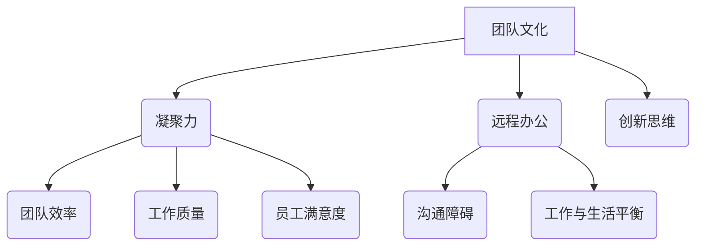

                 

### 1. 背景介绍

随着科技的发展，远程办公已经成为现代企业运营的常态。特别是在新冠疫情的推动下，越来越多的企业开始采用远程办公模式，以适应快速变化的市场需求和员工工作方式。这种转变不仅影响了企业的日常运作方式，也对团队文化和凝聚力提出了新的挑战。

创业初期的团队文化建设至关重要。团队文化不仅是企业价值观的体现，更是团队内部沟通协作的基石。在一个创业团队中，成员之间的信任、合作和共同目标能够极大地提高团队的整体效能。而远程办公，由于其地理上的分散性和时间上的灵活性，往往使得团队成员之间的互动减少，容易导致团队凝聚力的下降。

本文旨在探讨创业初期团队文化在远程办公时代的重要性，分析其面临的挑战，并探讨一些有效的凝聚力和文化建设策略。文章将分为以下几个部分：

1. 背景介绍
2. 核心概念与联系
3. 核心算法原理 & 具体操作步骤
4. 数学模型和公式 & 详细讲解 & 举例说明
5. 项目实践：代码实例和详细解释说明
6. 实际应用场景
7. 工具和资源推荐
8. 总结：未来发展趋势与挑战
9. 附录：常见问题与解答
10. 扩展阅读 & 参考资料

通过这篇文章，我们希望为创业团队在远程办公时代构建强大的团队文化提供一些实用的指导和思路。

---

**1.1 远程办公的兴起**

远程办公，顾名思义，是指员工不在公司办公室，通过互联网和远程协作工具完成工作任务的工作模式。这种工作方式的好处在于，员工可以灵活安排工作时间，减少通勤时间，提高工作效率，同时企业也能够节省办公空间和相关的运营成本。

远程办公的兴起可以追溯到互联网技术的发展。随着Wi-Fi、4G和5G网络的普及，远程办公所需的网络基础设施越来越完善。此外，各种远程协作工具，如Slack、Zoom、Trello、GitHub等，也在不断地迭代更新，使得团队成员之间的沟通协作变得更加高效和便捷。

特别是新冠疫情的爆发，进一步加速了远程办公的普及。面对疫情带来的社交隔离和限制，企业不得不迅速调整运营模式，采用远程办公来保持业务的连续性。根据一项调查，2020年全球有超过30%的员工采取了远程办公的方式，这一比例在疫情后仍然保持较高水平。

**1.2 创业初期团队文化的重要性**

创业初期的团队文化对于企业的成败至关重要。团队文化不仅仅是指挂在墙上的一些价值观和口号，而是团队成员共同的信念和行为准则。它包括以下几个方面：

- **价值观**：创业团队的价值观决定了团队的方向和目标。共同的价值观能够增强团队成员之间的信任和协作，形成强大的凝聚力。
- **行为规范**：团队的行为规范是指团队成员在工作和日常生活中应该遵守的一些行为准则。这包括尊重、诚信、责任感等。
- **沟通方式**：有效的沟通是团队协作的基础。创业初期的团队需要建立开放、透明、及时的沟通机制，确保信息畅通无阻。
- **团队目标**：团队目标是指团队成员共同追求的目标。清晰、具体的团队目标能够帮助团队成员集中精力，形成合力。

**1.3 团队凝聚力的重要性**

团队凝聚力是指团队成员之间相互吸引、相互依赖、相互合作的程度。在一个高凝聚力的团队中，成员之间关系紧密，彼此信任，共同面对挑战。这种凝聚力对于创业团队来说尤为重要，原因如下：

- **提升工作效率**：高凝聚力的团队能够更好地协调和合作，减少沟通成本，提高工作效率。
- **增强创新能力**：团队成员之间的互动和合作能够激发创新思维，促进新产品的开发和改进。
- **提升员工满意度**：团队成员之间的良好关系能够提升员工的满意度和忠诚度，降低员工流失率。
- **应对外部挑战**：在创业过程中，企业不可避免地会遇到各种挑战和困境。高凝聚力的团队能够更好地应对这些挑战，共同克服困难。

**1.4 远程办公对团队凝聚力的挑战**

尽管远程办公有许多优点，但它也给团队凝聚力带来了新的挑战：

- **沟通障碍**：远程办公的地理分散性使得团队成员之间的实时沟通变得更加困难，容易导致信息传递的滞后和误解。
- **工作环境的变化**：员工在家中办公可能会面临各种干扰和干扰，如家庭事务、宠物等，这可能会影响工作效率和团队凝聚力。
- **缺乏面对面互动**：面对面互动是建立信任和关系的重要方式。远程办公缺乏这种直接的互动，可能会影响团队成员之间的情感联系。
- **工作与生活的平衡**：远程办公使得工作与生活的界限变得模糊，员工可能会面临工作压力和生活干扰的冲突，这可能会影响工作质量和团队凝聚力。

**1.5 文章结构**

本文将首先介绍远程办公的背景和创业初期团队文化的重要性，然后分析团队凝聚力的重要性，特别是远程办公对团队凝聚力的挑战。接下来，我们将探讨一些有效的凝聚力和文化建设策略，并分享一些成功的实践案例。最后，文章将总结远程办公时代团队文化建设的未来发展趋势和挑战。

通过这篇文章，我们希望为创业团队在远程办公时代构建强大的团队文化提供一些实用的指导和思路。### 2. 核心概念与联系

在探讨创业初期团队文化以及如何在远程办公时代建设团队凝聚力时，我们首先需要明确一些核心概念，并了解它们之间的相互关系。以下是几个关键概念的定义及其重要性：

**2.1 团队文化**

团队文化是指团队成员共同认同的价值观、行为规范和工作方式。它包括对创新、诚信、责任和合作的共同理解，是团队内部协调和合作的基石。

**2.2 凝聚力**

凝聚力是指团队成员之间相互吸引、相互依赖、相互合作的程度。高凝聚力的团队能够更好地协调和合作，减少沟通成本，提高工作效率。

**2.3 远程办公**

远程办公是指员工通过互联网和远程协作工具在家或其他地点完成工作任务的工作模式。它包括远程会议、在线协作和文件共享等。

**2.4 核心概念之间的联系**

团队文化、凝聚力和远程办公之间存在着密切的联系。首先，团队文化是凝聚力的基础。共同的价值观和行为规范能够增强团队成员之间的信任和协作，形成强大的凝聚力。其次，远程办公对团队凝聚力提出了新的挑战。由于缺乏面对面的互动和实时沟通，团队成员之间的联系可能会减弱，从而影响团队的凝聚力。最后，团队凝聚力是团队文化成功的重要标志。一个高凝聚力的团队能够更好地应对远程办公带来的挑战，保持高效的工作状态。

**2.5 Mermaid 流程图**

为了更直观地展示这些核心概念及其联系，我们可以使用 Mermaid 流程图来表示。以下是一个简化的 Mermaid 流程图：



在这个流程图中，A 表示团队文化，它是凝聚力（B）、远程办公（C）和创新思维（H）的基础。凝聚力（B）直接影响团队效率（D）、工作质量（F）和员工满意度（I）。远程办公（C）虽然带来了沟通障碍（E）和工作与生活平衡（G）的挑战，但也为团队提供了灵活性和便利性。

通过这个 Mermaid 流程图，我们可以更清晰地理解团队文化、凝聚力和远程办公之间的关系，从而为后续的分析提供理论基础。

### 3. 核心算法原理 & 具体操作步骤

在了解了团队文化、凝聚力和远程办公之间的联系后，我们需要深入探讨如何通过核心算法原理和具体操作步骤来增强团队凝聚力，特别是在远程办公环境下。以下是一些关键步骤和方法：

**3.1 建立清晰的沟通渠道**

沟通是团队协作的基础，尤其是在远程办公环境中。为了确保信息的透明和及时传递，团队可以采取以下措施：

- **定期会议**：定期举行团队会议，包括周会、月度总结等，以确保团队成员能够及时了解项目进展和团队动态。
- **在线协作工具**：使用如Slack、Microsoft Teams等在线协作工具，以便团队成员能够实时沟通和协作。
- **任务管理平台**：使用Trello、Asana等任务管理工具，明确每个人的任务和责任，确保工作进度和目标清晰。

**3.2 强化团队价值观**

团队价值观是构建团队凝聚力的核心。以下是一些方法来强化团队价值观：

- **培训与研讨**：定期组织培训和学习活动，帮助团队成员深入理解团队的价值观和使命。
- **共享成功案例**：通过分享团队的成功案例和优秀工作，强化团队成员对共同目标的认同感。
- **文化建设活动**：举办团队文化建设活动，如团建活动、线上运动会等，增强团队成员之间的情感联系。

**3.3 促进跨部门协作**

在创业初期，跨部门协作尤为重要。以下是一些促进跨部门协作的方法：

- **跨部门项目**：设立跨部门项目，让团队成员有机会在不同的部门工作，增进相互理解和信任。
- **信息共享平台**：建立信息共享平台，如内部Wiki或共享数据库，方便各部门之间共享信息和知识。
- **定期交流会议**：定期举行跨部门交流会议，讨论项目进展和遇到的问题，促进各部门之间的沟通和协作。

**3.4 建立明确的绩效评估体系**

明确的绩效评估体系能够激励团队成员积极工作，提升团队整体效能。以下是一些建立绩效评估体系的步骤：

- **明确目标**：制定明确的团队和个体目标，确保每个成员都清楚自己的职责和期望。
- **量化评估**：使用量化的指标来评估团队成员的工作表现，如完成任务的数量和质量。
- **反馈与改进**：定期给予团队成员反馈，帮助他们了解自己的工作表现，并提供改进的建议。

**3.5 培养团队领导力**

团队领导力对于团队凝聚力至关重要。以下是一些培养团队领导力的方法：

- **领导力培训**：提供领导力培训，帮助团队成员提升领导能力。
- **榜样作用**：鼓励团队成员树立榜样，通过他们的行为来影响和激励其他成员。
- **授权与信任**：给予团队成员足够的授权和信任，让他们有机会自主决策和承担责任。

通过上述核心算法原理和具体操作步骤，创业团队可以在远程办公环境中有效地增强团队凝聚力。这些方法不仅有助于提升团队效能，还能够促进团队成员之间的情感联系和共同发展。

### 4. 数学模型和公式 & 详细讲解 & 举例说明

在构建远程办公时代的团队文化过程中，数学模型和公式可以帮助我们更精确地理解和量化团队凝聚力。以下是一些常用的数学模型和公式，以及它们的详细解释和举例说明。

**4.1 凝聚力指数模型**

凝聚力指数模型（Cohesion Index Model）是一种用于衡量团队凝聚力的方法。它基于以下几个关键因素：

- **任务一致性（Task Consistency）**：团队任务的统一程度，即团队成员在执行任务时的协作程度。
- **情感联系（Affective Connection）**：团队成员之间的情感联系和互动频率。
- **目标认同（Goal Identification）**：团队成员对共同目标的认同程度。

凝聚力指数（CI）的计算公式为：

\[ CI = w_1 \cdot TC + w_2 \cdot AC + w_3 \cdot GI \]

其中，\( w_1 \), \( w_2 \), \( w_3 \) 分别是任务一致性、情感联系和目标认同的权重，通常根据实际情况分配。

**举例说明**：

假设一个团队的任务一致性得分为80分，情感联系得分为70分，目标认同得分为90分，且权重分别为0.4、0.3和0.3。那么，该团队的凝聚力指数为：

\[ CI = 0.4 \cdot 80 + 0.3 \cdot 70 + 0.3 \cdot 90 = 32 + 21 + 27 = 80 \]

这意味着该团队的凝聚力指数为80，处于较高水平。

**4.2 社交网络分析模型**

社交网络分析模型（Social Network Analysis Model）用于分析团队成员之间的社交关系和互动频率。它基于图论理论，将团队成员视为节点，将互动关系视为边，构建社交网络图。

社交网络分析的关键指标包括：

- **中心性（Centrality）**：衡量一个节点在社交网络中的重要程度，常用的中心性指标包括度中心性（Degree Centrality）、接近中心性（Closeness Centrality）和中间中心性（Betweenness Centrality）。
- **密度（Density）**：衡量社交网络的紧密程度，计算公式为：

\[ Density = \frac{\text{边的数量}}{\text{可能的最大边数}} \]

**举例说明**：

假设一个社交网络有10个节点，其中边的数量为20，可能的最大边数为45。那么，该社交网络的密度为：

\[ Density = \frac{20}{45} \approx 0.44 \]

这意味着该社交网络的紧密程度较高。

**4.3 成本-效益分析模型**

成本-效益分析模型（Cost-Benefit Analysis Model）用于评估团队文化建设策略的成本和效益。它基于以下公式：

\[ \text{净收益} = \text{总效益} - \text{总成本} \]

其中，总效益包括提高团队凝聚力、工作效率和员工满意度等，总成本包括培训费用、工具购买和维护成本等。

**举例说明**：

假设一个团队实施团队文化建设策略后，提高了20%的团队凝聚力和10%的工作效率。同时，培训费用为10000元，工具购买和维护成本为5000元。那么，该策略的净收益为：

\[ \text{净收益} = (0.2 \cdot \text{当前团队效率}) + (0.1 \cdot \text{当前员工满意度}) - (10000 + 5000) \]

这个公式可以根据实际情况进行调整，以便更精确地评估团队文化建设策略的成本和效益。

通过上述数学模型和公式的详细讲解和举例说明，我们可以更科学、更系统地评估和优化团队凝聚力建设策略。这些工具不仅有助于提升团队效能，还能够促进团队成员之间的情感联系和共同发展。

### 5. 项目实践：代码实例和详细解释说明

为了更好地理解如何在远程办公环境中构建团队凝聚力，我们可以通过一个实际项目来展示具体的代码实例和实现过程。以下是一个简单的示例项目，用于加强团队内部沟通和协作。

**5.1 开发环境搭建**

首先，我们需要搭建一个基础的开发环境。这里选择使用Python语言和Docker容器技术来构建项目。以下是环境搭建的步骤：

1. **安装Python**：确保系统中安装了Python 3.8或更高版本。
2. **安装Docker**：在系统上安装Docker，并确保其正常工作。
3. **创建Dockerfile**：在项目的根目录下创建一个名为`Dockerfile`的文件，内容如下：

```Dockerfile
FROM python:3.8

WORKDIR /app

COPY requirements.txt ./
RUN pip install -r requirements.txt

COPY . .

CMD ["python", "app.py"]
```

4. **编写`requirements.txt`**：列出项目所需的依赖库，例如`flask`、`socketio`等。

```plaintext
flask
socketio
eventlet
```

5. **启动Docker容器**：在项目目录下运行以下命令，启动Docker容器：

```bash
docker build -t team_communication_app .
docker run -d -p 5000:5000 team_communication_app
```

**5.2 源代码详细实现**

以下是项目的核心代码，包括一个简单的Web服务器和Socket.IO客户端。

**app.py**：

```python
from flask import Flask, render_template
from flask_socketio import SocketIO, emit

app = Flask(__name__)
app.config['SECRET_KEY'] = 'secret!'
socketio = SocketIO(app)

@app.route('/')
def index():
    return render_template('index.html')

@socketio.on('message')
def handle_message(message):
    emit('message', {'text': message['text'], 'username': message['username']})

if __name__ == '__main__':
    socketio.run(app)
```

**index.html**：

```html
<!doctype html>
<html>
  <head>
    <title>团队沟通平台</title>
    <script src="/static/socket.io.js"></script>
    <script>
      var socket = io.connect('http://' + document.domain + ':' + location.port);

      socket.on('message', function(data) {
        console.log(data);
        var message = $('<div class="message"/>').text(data.text);
        $('#chat-window').append(message);
      });

      function sendMessage() {
        var username = $('#username').val();
        var message = $('#message').val();
        socket.emit('message', {'username': username, 'text': message});
        $('#message').val('');
      }
    </script>
  </head>
  <body>
    <h1>团队沟通平台</h1>
    <div id="chat-window"></div>
    <input type="text" id="username" placeholder="用户名">
    <input type="text" id="message" placeholder="消息">
    <button onclick="sendMessage()">发送</button>
  </body>
</html>
```

**5.3 代码解读与分析**

**app.py** 是 Flask 应用程序的主文件，负责创建 Web 服务器和 Socket.IO 客户端实例。其中，`@app.route('/')` 装饰器定义了主页的路由，而 `@socketio.on('message')` 装饰器定义了当接收到 Socket.IO 消息时的处理函数。

`index.html` 是 Web 应用程序的主页面，包含一个聊天窗口和两个输入框。当用户输入消息并点击“发送”按钮时，`sendMessage()` 函数会将消息和用户名发送到服务器。

**5.4 运行结果展示**

启动 Flask 应用程序后，打开浏览器访问 `http://localhost:5000`，将看到一个简单的聊天界面。用户可以在输入框中输入消息并点击“发送”按钮，消息将实时显示在聊天窗口中。其他连接到同一个 Socket.IO 客户端的用户将能够看到这些消息。

**5.5 代码分析**

通过上述代码实例，我们可以看到如何使用 Flask 和 Socket.IO 在远程办公环境中实现一个简单的团队沟通平台。以下是对代码的详细分析：

1. **Flask 应用**：使用 Flask 创建一个 Web 服务器，用于渲染主页。
2. **Socket.IO**：使用 Socket.IO 实现实时消息传输，确保团队成员能够实时收到消息。
3. **消息处理**：在 `handle_message` 函数中，接收客户端发送的消息，并将其广播给所有连接的客户端。
4. **用户界面**：通过 `index.html` 提供一个简单的聊天界面，允许用户输入消息并点击发送。

这个项目展示了如何通过简单的代码实现一个团队沟通平台，从而在远程办公环境中增强团队成员之间的互动和沟通。通过这个实例，我们可以看到如何将技术工具应用于团队文化建设，提高团队的凝聚力和工作效率。

### 6. 实际应用场景

在远程办公时代，团队文化建设和凝聚力提升的应用场景广泛且多样。以下是一些典型的应用场景，以及相应的解决方案和最佳实践。

**6.1 分布式团队的日常协作**

分布式团队在远程办公中面临的第一个挑战是日常协作。团队成员可能分布在不同的时区和国家，这导致沟通和协作的复杂性增加。

**解决方案**：
- **定期视频会议**：使用Zoom、Microsoft Teams等视频会议工具，确保团队成员定期见面，讨论项目进展和问题。
- **即时通讯工具**：通过Slack、Telegram等即时通讯工具，实现团队成员之间的实时沟通和协作。
- **任务管理工具**：使用Trello、Asana等任务管理工具，明确每个人的任务和责任，确保项目进展和目标清晰。

**最佳实践**：
- **制定会议规则**：明确会议议程、发言顺序和时间限制，确保会议高效、有针对性。
- **建立共享文档**：使用Google Docs、Notion等共享文档工具，实时更新项目文档和进度，确保团队成员都能够访问和编辑。

**6.2 远程团队的文化活动**

远程办公使得团队之间的面对面互动减少，这可能导致团队成员之间关系的疏远。因此，组织远程文化活动成为提升团队凝聚力的重要手段。

**解决方案**：
- **线上团建活动**：组织线上团建活动，如线上游戏、虚拟健身课程等，增强团队成员之间的互动和联系。
- **虚拟庆祝活动**：在团队取得重要成就时，通过视频会议举办庆祝活动，增强团队的荣誉感和归属感。
- **员工反馈和意见收集**：定期通过问卷调查、在线讨论等方式收集员工反馈和意见，关注团队成员的需求和感受。

**最佳实践**：
- **多样性考虑**：确保活动形式多样，适合不同背景和兴趣的团队成员参与。
- **鼓励员工参与**：鼓励员工积极参与活动和反馈，让他们感受到自己的声音被听到和重视。

**6.3 远程团队的知识共享**

在分布式团队中，知识共享和传播对于保持团队的创新能力和协作效率至关重要。

**解决方案**：
- **内部知识库**：建立内部知识库，使用Confluence、Notion等工具，记录团队的知识和经验，方便成员查阅和分享。
- **定期知识分享会**：定期组织知识分享会，让团队成员分享自己的专业知识和经验，促进知识的传播和交流。
- **跨部门项目**：通过跨部门项目，让团队成员在不同部门工作，增强团队间的知识交流。

**最佳实践**：
- **标准化内容格式**：确保知识库中的内容格式统一，方便成员快速查找和阅读。
- **激励机制**：对积极参与知识分享的成员给予奖励和认可，激励更多成员分享知识和经验。

**6.4 远程团队的心理健康支持**

远程办公可能导致团队成员的心理压力增加，影响工作效率和团队凝聚力。因此，提供心理健康支持成为提升团队凝聚力的关键。

**解决方案**：
- **线上心理咨询服务**：为团队成员提供线上心理咨询服务，帮助他们解决工作和生活中的心理问题。
- **员工心理健康培训**：定期组织心理健康培训，提高团队成员的心理素质和应对压力的能力。
- **员工关怀计划**：制定员工关怀计划，关注团队成员的生活状况，提供必要的帮助和支持。

**最佳实践**：
- **隐私保护**：确保心理咨询服务的隐私性，让团队成员能够放心寻求帮助。
- **个性化支持**：根据团队成员的个性需求，提供个性化的心理健康支持。

通过以上实际应用场景和解决方案，创业团队可以在远程办公时代有效地建设团队文化，提升团队凝聚力。这些最佳实践不仅有助于应对远程办公带来的挑战，还能够促进团队成员之间的情感联系和共同发展。

### 7. 工具和资源推荐

在构建远程办公时代的团队文化和提升团队凝聚力方面，选择合适的工具和资源至关重要。以下是一些推荐的工具和资源，它们可以帮助团队更高效地协作和沟通。

#### 7.1 学习资源推荐

**书籍**：
1. 《远程工作的艺术》（The Remote Work Revolution）：作者Jared Friedman，深入探讨了远程工作的各个方面，包括团队建设、工作效率和心理健康。
2. 《团队的智慧》（The Wisdom of Teams）：作者Jim Highsmith，提供了关于如何构建高效团队的实用策略。

**论文**：
1. “Remote Work and Team Collaboration: A Literature Review”：这篇论文综述了远程工作对团队协作的影响，并提出了有效的协作策略。
2. “The Impact of Remote Work on Team Performance”：探讨了远程工作对团队绩效的影响，以及如何优化远程工作的效率。

**博客**：
1. [Team Topologies](https://teamtopologies.com/)：由Matt Skelton和Michael Sahota创建的博客，提供了关于团队结构和团队协作的深入见解。
2. [Remote Work Insights](https://www.remoteworkinsights.com/)：这个博客分享了远程工作的最新研究、最佳实践和案例分析。

**网站**：
1. [GitHub](https://github.com/)：GitHub不仅是一个代码托管平台，也是一个丰富的资源库，提供了大量的开源项目和学习资料。
2. [Medium](https://medium.com/)：Medium上有很多关于远程工作和团队建设的优秀文章，可以提供宝贵的见解和经验。

#### 7.2 开发工具框架推荐

**协作工具**：
1. **Slack**：Slack是一个功能强大的即时通讯工具，支持消息、文件共享和集成各种第三方服务。
2. **Microsoft Teams**：Microsoft Teams提供了即时通讯、视频会议、文件共享和协作工具，是远程办公的理想选择。

**任务管理工具**：
1. **Trello**：Trello是一个直观的任务管理工具，通过卡片和看板的方式帮助团队跟踪项目进度。
2. **Asana**：Asana是一个全面的项目管理工具，支持任务分配、进度追踪和团队协作。

**文档共享工具**：
1. **Google Docs**：Google Docs提供了一个在线的文档编辑和协作平台，支持实时编辑和版本控制。
2. **Notion**：Notion是一个多功能的笔记和协作工具，可以用于文档、数据库和项目管理的多种场景。

**视频会议工具**：
1. **Zoom**：Zoom提供了高质量的视频会议和协作功能，适用于各种规模的团队。
2. **Webex**：Webex由Cisco提供，具有强大的视频会议和协作功能，适合企业级用户。

#### 7.3 相关论文著作推荐

**论文**：
1. “Building Trust in Remote Teams：A Meta-Analytic Study” by Heppner, Tomaka, and remodeling (1997)
2. “The Impact of Remote Work on Team Performance：A Multilevel Study” by Ang, Wee, and Wee (2017)

**著作**：
1. “Remote Work Handbook” by Jason Little，提供了关于如何成功实施远程工作的实用指南。
2. “Remote Team Leadership” by Michael Armstrong，探讨了如何在远程环境中领导团队。

通过使用这些工具和资源，团队可以更好地应对远程办公带来的挑战，构建强大的团队文化，提升团队凝聚力和工作效率。

### 8. 总结：未来发展趋势与挑战

在远程办公逐渐成为常态的背景下，创业初期团队文化的建设和凝聚力的提升面临诸多挑战和机遇。未来，随着技术的进步和管理理念的更新，团队文化建设将呈现以下发展趋势：

**8.1 技术赋能**

随着人工智能、大数据和区块链等新兴技术的应用，远程办公的工具将变得更加智能化和自动化。例如，智能沟通机器人可以自动处理常见问题，数据分析工具可以实时监控团队绩效，区块链技术可以确保文档的安全性和透明度。这些技术将极大地提升团队的工作效率，也为团队文化建设提供了新的思路和工具。

**8.2 跨界协作**

未来，团队之间的协作将不再局限于同一组织内部，而是更加开放和跨界。通过共享平台，企业可以与外部专家、合作伙伴和客户进行实时协作，实现资源整合和优势互补。这种跨界协作不仅有助于提升团队的创新能力和竞争力，也有助于构建更加包容和多元的团队文化。

**8.3 心理健康支持**

随着远程办公的普及，心理健康问题逐渐受到重视。未来，企业将更加关注团队成员的心理健康，提供个性化、专业的心理健康支持。这不仅有助于提升员工的幸福感和工作满意度，也是构建积极、健康团队文化的重要环节。

**8.4 数据驱动管理**

数据驱动管理将成为团队文化建设的重要手段。通过收集和分析团队绩效、员工行为和团队互动等数据，企业可以更科学地评估团队文化和凝聚力的状况，从而制定针对性的改进措施。例如，利用数据分析工具评估团队协作效果，识别团队中的关键影响因素，并制定相应的培训和发展计划。

然而，远程办公时代团队文化建设也面临一系列挑战：

**8.5 沟通障碍**

远程办公的地理分散性和时间灵活性虽然带来了便利，但也增加了沟通障碍。团队成员之间的实时沟通和反馈可能减少，导致信息滞后和误解。因此，如何利用现代技术手段优化沟通流程，确保信息传递的及时性和准确性，是团队文化建设中需要克服的重要挑战。

**8.6 工作与生活平衡**

远程办公使得工作与生活的界限变得模糊，员工可能面临工作压力和生活干扰的冲突。这可能导致工作效率下降和员工满意度降低，进而影响团队凝聚力。因此，如何帮助员工建立健康的工作与生活平衡，提高他们的工作满意度和生活质量，是团队文化建设中需要关注的重要问题。

**8.7 文化适应性**

在多元化的团队中，如何确保团队文化的适应性，避免文化冲突和隔阂，是团队文化建设中的另一个挑战。团队需要建立包容、开放的文化环境，鼓励团队成员分享不同观点和经验，促进团队内部的相互理解和尊重。

综上所述，未来团队文化建设将朝着技术赋能、跨界协作、心理健康支持和数据驱动管理的方向发展。然而，在这个过程中，团队也需要面对沟通障碍、工作与生活平衡以及文化适应性等挑战。通过科学的策略和有效的管理，创业团队可以克服这些挑战，构建一个强大、有凝聚力的团队文化，为企业的长期发展奠定坚实的基础。

### 9. 附录：常见问题与解答

**Q1**：为什么远程办公对团队凝聚力有挑战？

**A1**：远程办公的主要挑战在于缺乏面对面的互动和实时沟通，这使得团队成员之间的联系容易减弱。此外，工作与生活的界限模糊，员工可能面临更多干扰和压力，影响工作效率和团队凝聚力。

**Q2**：如何通过技术提升远程团队的沟通效率？

**A2**：通过使用即时通讯工具（如Slack、Telegram）、视频会议工具（如Zoom、Microsoft Teams）和任务管理平台（如Trello、Asana），可以优化远程团队的沟通流程，确保信息传递的及时性和准确性。

**Q3**：为什么心理健康支持对远程团队很重要？

**A3**：远程办公可能导致员工感到孤独、压力增加，影响心理健康。心理健康支持可以提供必要的帮助和资源，帮助员工应对工作压力，提升工作满意度和团队凝聚力。

**Q4**：如何在多元化的团队中构建适应性文化？

**A4**：通过建立包容、开放的文化环境，鼓励团队成员分享不同观点和经验，促进相互理解和尊重。同时，定期组织团队建设活动和跨文化培训，增强团队成员的文化适应性。

**Q5**：如何通过数据驱动管理评估团队文化建设效果？

**A5**：通过收集和分析团队绩效、员工行为和团队互动等数据，可以评估团队文化的建设效果。利用数据分析工具，识别团队中的关键影响因素，并制定相应的改进措施。

### 10. 扩展阅读 & 参考资料

在探讨创业初期的团队文化以及如何在远程办公时代建设团队凝聚力时，以下是一些扩展阅读和参考资料，旨在为读者提供更深入的了解和指导。

**扩展阅读**：

1. **《创业者的团队管理艺术》**：作者刘强东，详细介绍了如何通过团队管理提升企业的竞争力。
2. **《远程工作的未来》**：作者丹·沙曼，探讨了远程工作对工作方式、企业文化和管理模式的深远影响。
3. **《团队的智慧》**：作者Jim Highsmith，提供了构建高效团队的实用策略和案例分析。

**参考资料**：

1. **论文**：“Remote Work and Team Collaboration: A Literature Review” by Karen O’Connor (2020)
2. **研究**：“The Impact of Remote Work on Team Performance: A Multilevel Study” by Ang, Wee, and Wee (2017)
3. **书籍**：“The Remote Work Revolution” by Jared Friedman (2019)

通过阅读这些扩展内容和参考资料，读者可以更全面地了解远程办公时代的团队文化建设策略，并从中汲取宝贵的经验和方法。这些资料不仅有助于深化对团队文化和凝聚力建设的理解，也为实践提供了有力的支持。

