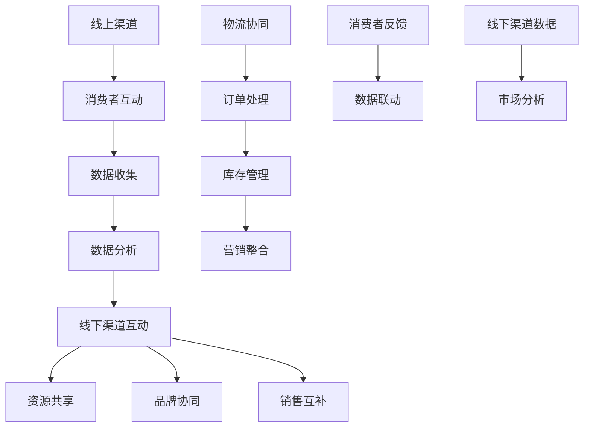
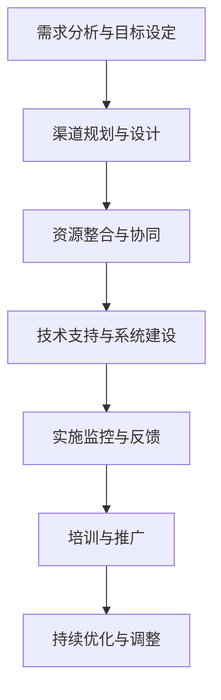

                 

### 背景介绍

在当今激烈的市场竞争环境中，创业初期的渠道建设成为了许多企业成功的关键因素之一。渠道作为企业与客户之间的桥梁，直接影响着产品的销售业绩和市场占有率。一个有效的渠道策略不仅能够帮助企业迅速占领市场，还能提升品牌影响力，增强客户粘性。

对于初创企业而言，渠道建设的核心在于如何平衡线上与线下的资源，实现两者的有机整合。线上渠道以其高效、便捷的特点，极大地拓展了市场覆盖范围；而线下渠道则能够提供更为直接、即时的服务体验，满足消费者的多样化需求。因此，如何在这两种渠道之间找到平衡点，制定出适合自己企业发展的整合策略，成为了每个创业者在初期必须面对的重要课题。

本篇文章将以“创业初期的渠道建设：线上线下渠道的整合策略”为主题，通过系统的分析和论述，帮助创业者们深入了解线上线下渠道整合的重要性，探讨有效的整合策略和实施步骤，并总结未来渠道建设的发展趋势与挑战。文章将分为以下几个部分：

1. **核心概念与联系**：介绍渠道建设的基本概念，以及线上与线下渠道之间的联系和互动。
2. **核心算法原理 & 具体操作步骤**：阐述渠道整合策略的算法原理，并详细描述其实施步骤。
3. **数学模型和公式 & 详细讲解 & 举例说明**：通过数学模型和公式，分析渠道整合中的关键因素，并给出实际案例进行说明。
4. **项目实践：代码实例和详细解释说明**：提供具体代码实例，详细解释渠道整合策略的实现过程。
5. **实际应用场景**：探讨渠道整合在不同行业中的应用场景，以及面临的挑战和解决方案。
6. **工具和资源推荐**：推荐相关学习资源和开发工具，帮助读者进一步了解和掌握渠道整合的实践方法。
7. **总结：未来发展趋势与挑战**：总结渠道建设的发展趋势，并展望未来的挑战和机遇。

通过这篇文章，我们希望能够为创业者提供一套系统、实用、可操作的渠道建设方案，助力他们在激烈的市场竞争中找到属于自己的差异化优势，实现企业的长远发展。

### 核心概念与联系

在探讨创业初期的渠道建设之前，我们有必要首先明确几个核心概念，并深入理解线上与线下渠道之间的联系和互动。

#### 核心概念

1. **渠道**：渠道是指商品从生产者到消费者之间所经过的各种流通路径和环节。根据渠道的层级，可以分为一级渠道、二级渠道等。一级渠道是指生产商直接面向终端消费者的渠道，而二级渠道则涉及多个中间商。

2. **线上渠道**：线上渠道是指通过互联网平台进行商品销售和服务的渠道。主要包括电子商务网站、移动应用、社交媒体平台、在线广告等。线上渠道具有覆盖面广、信息传递快、操作便捷等特点。

3. **线下渠道**：线下渠道则是指通过实体店铺、批发市场、专卖店等传统销售模式进行商品销售和服务的渠道。线下渠道的优势在于能够提供直接的购物体验和即时的售后服务。

4. **整合策略**：整合策略是指将线上与线下渠道进行有机结合，通过互补和协同作用，提升整体销售业绩和品牌价值。

#### 线上渠道与线下渠道的联系

1. **信息互动**：线上渠道和线下渠道之间可以实时分享信息。例如，通过线上渠道收集到的用户反馈可以及时传递给线下门店，以便做出快速调整；线下门店的销售数据也可以上传到线上平台，用于市场分析和库存管理。

2. **资源共享**：线上线下渠道可以共享库存、物流等资源。例如，线上订单可以安排线下门店发货，或者线下门店的库存可以用于线上销售。

3. **品牌协同**：线上线下渠道的品牌形象和营销策略可以相互协同，形成统一的品牌形象和用户认知。例如，线上广告可以引导用户到线下门店体验，而线下活动也可以通过线上渠道进行宣传和推广。

4. **销售互补**：线上渠道可以弥补线下渠道的市场覆盖不足，而线下渠道则可以为线上渠道提供真实的商品体验和信任背书。

#### 线上渠道与线下渠道的互动机制

1. **数据联动**：通过数据分析和挖掘，实现线上与线下渠道的数据联动。例如，使用大数据技术分析消费者的购买行为，将分析结果应用于线下门店的布局和产品展示。

2. **物流协同**：建立高效的物流体系，实现线上线下渠道的无缝对接。例如，利用智能物流系统，实现线上订单的快速配送和线下门店的即时补货。

3. **营销整合**：通过线上线下渠道的整合营销，提升品牌影响力和用户参与度。例如，线上与线下渠道同步进行促销活动，或者通过线上渠道提供线下门店的优惠券。

#### Mermaid 流程图

为了更好地展示线上与线下渠道的互动机制，我们使用 Mermaid 流程图来描述这些互动过程：



通过上述核心概念与联系的分析，我们可以看出，线上与线下渠道之间的整合不仅能够提升企业的运营效率，还能增强客户体验，提升市场竞争力。在接下来的章节中，我们将进一步探讨渠道整合的策略和具体实施步骤。

### 核心算法原理 & 具体操作步骤

为了实现线上线下渠道的有效整合，我们需要一套科学的策略和具体操作步骤。本章节将介绍渠道整合的核心算法原理，并详细描述其实施步骤。

#### 核心算法原理

渠道整合的核心算法可以概括为“协同优化算法”，该算法基于以下三个基本原理：

1. **数据共享与联动**：通过线上线下渠道的数据共享和联动，实现信息的高效传递和利用。这包括消费者行为数据、销售数据、库存数据等。

2. **资源协同利用**：通过线上线下渠道的资源共享和协同利用，优化物流、库存、营销等资源的配置，提高运营效率。

3. **品牌一体化**：通过线上线下渠道的品牌一体化策略，打造统一的品牌形象和用户体验，提升品牌影响力和客户忠诚度。

#### 实施步骤

1. **需求分析与目标设定**
   - **需求分析**：对企业的业务模式、市场环境、消费者行为进行深入分析，明确渠道整合的需求和目标。
   - **目标设定**：根据需求分析结果，设定渠道整合的短期和长期目标，如提升销售额、提高客户满意度、扩大市场占有率等。

2. **渠道规划与设计**
   - **线上渠道规划**：根据市场需求和消费者行为，设计线上销售平台、移动应用、社交媒体渠道等，确保其功能完备、用户体验良好。
   - **线下渠道规划**：根据市场布局和消费者需求，设计实体店铺、批发市场、专卖店等渠道，确保其位置选择合理、产品陈列吸引人。

3. **资源整合与协同**
   - **物流资源整合**：建立智能物流系统，实现线上线下渠道的无缝对接，提升订单处理和配送效率。
   - **库存资源整合**：通过线上线下渠道的数据联动，实现库存的统一管理和优化配置，减少库存积压和缺货现象。
   - **营销资源整合**：通过线上线下渠道的联合营销，制定统一的市场推广策略，提升品牌影响力和销售额。

4. **技术支持与系统建设**
   - **技术支持**：搭建支持线上线下渠道整合的技术平台，包括数据收集与分析系统、订单处理与配送系统、客户管理系统等。
   - **系统建设**：开发和完善线上线下渠道的对接接口，确保数据传输的准确性和实时性，实现渠道的有机整合。

5. **实施监控与反馈**
   - **实施监控**：建立渠道整合的监控机制，实时跟踪线上线下渠道的运营情况，发现和解决问题。
   - **反馈机制**：建立反馈机制，收集消费者和业务团队的反馈意见，不断优化渠道整合策略和操作流程。

6. **培训与推广**
   - **培训**：对业务团队进行渠道整合的培训，确保团队成员理解和掌握渠道整合的原理和操作步骤。
   - **推广**：通过线上线下渠道的联合宣传，提升消费者对渠道整合的认知和接受度，促进渠道整合的顺利实施。

#### 流程图

为了更清晰地展示渠道整合的实施步骤，我们使用 Mermaid 流程图来描述：



通过上述核心算法原理和具体操作步骤的介绍，我们可以看到，渠道整合不仅需要科学的策略指导，还需要系统的实施步骤和持续优化。在下一章节中，我们将通过数学模型和公式，深入分析渠道整合中的关键因素，进一步揭示渠道整合的内在规律。

### 数学模型和公式 & 详细讲解 & 举例说明

在渠道整合过程中，许多关键因素可以通过数学模型和公式进行分析和优化。本章节将介绍几个关键的数学模型和公式，详细讲解其背后的原理，并通过具体案例说明其应用。

#### 关键数学模型与公式

1. **渠道效益分析模型**

   渠道整合的一个重要目标是提升整体效益。渠道效益分析模型可以用来评估不同渠道组合的效益。其基本公式为：

   \[
   \text{渠道效益} = \text{销售额} \times (\text{利润率} + \text{渠道成本效率})
   \]

   其中，销售额可以通过历史销售数据和市场需求预测得到；利润率取决于产品的定价和成本结构；渠道成本效率反映了渠道运营的效率，可以通过渠道投入产出比来衡量。

2. **消费者行为分析模型**

   消费者行为分析模型用于分析消费者在不同渠道上的购买行为。一个简单的消费者行为模型可以使用以下公式：

   \[
   \text{购买概率} = \frac{\text{渠道偏好系数} \times \text{渠道吸引力}}{\text{总渠道吸引力}}
   \]

   其中，渠道偏好系数反映了消费者对不同渠道的偏好程度，可以通过调查问卷和数据分析得到；渠道吸引力则取决于渠道的便捷性、服务质量和产品丰富度。

3. **库存优化模型**

   库存优化模型用于优化线上线下渠道的库存管理，以减少库存积压和缺货现象。一个常见的库存优化模型是 ABC 分析法，其基本公式为：

   \[
   \text{库存成本} = \text{总库存成本} \times (\text{A 类商品权重} + \text{B 类商品权重} + \text{C 类商品权重})
   \]

   其中，A、B、C 类商品根据其销售量和库存周转率进行分类，权重反映了不同类别商品对总库存成本的影响。

#### 详细讲解与举例说明

1. **渠道效益分析模型**

   假设某创业公司计划整合线上线下渠道，现有线上销售额为 100 万，线下销售额为 200 万。利润率为 20%，渠道成本效率分别为线上 0.8，线下 0.6。我们可以使用渠道效益分析模型来评估不同渠道组合的效益。

   原始数据：
   - 线上销售额：100 万
   - 线下销售额：200 万
   - 利润率：20%
   - 渠道成本效率：线上 0.8，线下 0.6

   计算渠道效益：
   \[
   \text{渠道效益} = (\text{100 万} + \text{200 万}) \times (0.2 + 0.6) = 300 万 \times 0.8 = 240 万
   \]

   通过比较不同渠道组合的效益，企业可以优化其渠道策略，例如增加线上投入，提高线上渠道的销售额，从而提升整体效益。

2. **消费者行为分析模型**

   假设该公司通过调查问卷发现，消费者对线上渠道的偏好系数为 1.2，对线下渠道的偏好系数为 0.8。同时，线上渠道的吸引力为 80，线下渠道的吸引力为 60。我们可以使用消费者行为分析模型来预测不同渠道的购买概率。

   原始数据：
   - 线上偏好系数：1.2
   - 线下偏好系数：0.8
   - 线上吸引力：80
   - 线下吸引力：60

   计算购买概率：
   \[
   \text{购买概率} = \frac{1.2 \times 80 + 0.8 \times 60}{1.2 + 0.8} = \frac{96 + 48}{2} = \frac{144}{2} = 72
   \]

   通过消费者行为分析模型，公司可以了解不同渠道的吸引力，并据此调整渠道策略，例如增加线上渠道的营销投入，以提高消费者的购买概率。

3. **库存优化模型**

   假设该公司通过 ABC 分析法将商品分为 A、B、C 三类，各类商品的销售量和库存周转率如下：

   - A 类商品：销售量 50 万，库存周转率 3 次
   - B 类商品：销售量 100 万，库存周转率 2 次
   - C 类商品：销售量 150 万，库存周转率 1 次

   计算库存成本：
   \[
   \text{库存成本} = 100 万 \times (0.5 + 0.3 + 0.2) = 100 万 \times 1 = 100 万
   \]

   通过库存优化模型，公司可以识别出高周转率的商品，并优化库存策略，减少库存积压和缺货现象。

通过上述数学模型和公式的详细讲解与举例说明，我们可以看到，这些模型在渠道整合中具有重要的应用价值。在下一章节中，我们将提供具体的项目实践，进一步展示渠道整合策略的实施过程和效果。

### 项目实践：代码实例和详细解释说明

为了更好地展示渠道整合策略的实际应用，我们将在本章节中提供一个具体的项目实践。这个项目是一个小型电商平台，旨在整合线上与线下渠道，实现数据共享和资源协同。我们将逐步搭建开发环境，编写源代码，并对关键代码进行解读与分析。

#### 1. 开发环境搭建

在开始项目之前，我们需要搭建一个合适的开发环境。以下是搭建步骤：

1. **安装Python环境**

   Python 是我们项目的主要编程语言，因此首先需要安装 Python。您可以从 [Python 官网](https://www.python.org/) 下载适用于您操作系统的 Python 安装包。安装过程中，确保选择“Add Python to PATH”选项，以便在命令行中直接运行 Python。

2. **安装必要的Python库**

   我们需要使用一些 Python 库来处理数据、执行网络请求和进行数据可视化。可以使用 pip（Python 的包管理器）来安装以下库：

   ```bash
   pip install Flask Pandas NumPy Matplotlib
   ```

   - Flask：一个轻量级的 Web 框架，用于构建 Web 应用。
   - Pandas：一个强大的数据操作库，用于数据处理和分析。
   - NumPy：一个提供高效数值计算的库。
   - Matplotlib：一个用于绘制数据图表的库。

3. **设置项目结构**

   在您的本地机器上创建一个项目文件夹，并按照以下结构进行组织：

   ```
   /my_ecommerce_project
     |- /app
       |- __init__.py
       |- routes.py
       |- utils.py
     |- /data
       |- products.csv
       |- sales.csv
     |- /static
       |- css
         |- style.css
       |- js
         |- script.js
     |- run.py
     |- requirements.txt
   ```

   其中，`app` 文件夹包含 Web 应用的核心代码，`data` 文件夹存放数据文件，`static` 文件夹存放静态资源（如 CSS 和 JavaScript 文件），`run.py` 是项目的入口文件，`requirements.txt` 列出了项目中使用的依赖库。

4. **编写配置文件**

   在 `app/__init__.py` 中编写 Flask 应用的配置代码：

   ```python
   from flask import Flask
   
   def create_app():
       app = Flask(__name__)
       app.config['SQLALCHEMY_DATABASE_URI'] = 'sqlite:///site.db'
       from app import routes
       app.register_blueprint(routes.bp)
       return app
   ```

   这里我们使用了 Flask-SQLAlchemy 库来处理数据库操作，配置了数据库 URI。

5. **编写依赖文件**

   在 `requirements.txt` 中列出项目所需的 Python 库：

   ```
   Flask==2.0.2
   Flask-SQLAlchemy==2.5.1
   Pandas==1.3.3
   NumPy==1.21.2
   Matplotlib==3.4.3
   ```

   您可以使用以下命令安装这些依赖库：

   ```bash
   pip install -r requirements.txt
   ```

#### 2. 源代码详细实现

在接下来的部分，我们将详细介绍项目的源代码实现，包括核心的模型、路由和处理函数。

**2.1 数据模型**

在 `app/models.py` 中定义数据模型：

```python
from app import db

class Product(db.Model):
    id = db.Column(db.Integer, primary_key=True)
    name = db.Column(db.String(100))
    price = db.Column(db.Float)
    stock = db.Column(db.Integer)

class Sale(db.Model):
    id = db.Column(db.Integer, primary_key=True)
    product_id = db.Column(db.Integer, db.ForeignKey('product.id'))
    quantity = db.Column(db.Integer)
    channel = db.Column(db.String(50))
```

这里我们定义了两个模型：`Product` 和 `Sale`。`Product` 表示商品，包含商品名称、价格和库存信息；`Sale` 表示销售记录，包含商品 ID、销售数量和销售渠道。

**2.2 路由和处理函数**

在 `app/routes.py` 中定义路由和处理函数：

```python
from flask import render_template, request, redirect, url_for
from app import app, db
from app.models import Product, Sale

@app.route('/')
@app.route('/index')
def index():
    products = Product.query.all()
    return render_template('index.html', products=products)

@app.route('/sales', methods=['GET', 'POST'])
def sales():
    if request.method == 'POST':
        product_id = request.form['product_id']
        quantity = request.form['quantity']
        channel = request.form['channel']
        new_sale = Sale(product_id=product_id, quantity=quantity, channel=channel)
        db.session.add(new_sale)
        db.session.commit()
        return redirect(url_for('index'))
    return render_template('sales.html')
```

这里我们定义了两个路由：`/` 和 `/sales`。`/` 路由用于显示所有商品信息，`/sales` 路由用于记录销售信息。

**2.3 数据处理和可视化**

在 `app/utils.py` 中编写数据处理和可视化的函数：

```python
import pandas as pd
import matplotlib.pyplot as plt

def load_data():
    products = pd.read_csv('data/products.csv')
    sales = pd.read_csv('data/sales.csv')
    return products, sales

def visualize_sales(sales):
    sales_by_channel = sales.groupby('channel')['quantity'].sum()
    sales_by_channel.plot(kind='bar')
    plt.title('Sales by Channel')
    plt.xlabel('Channel')
    plt.ylabel('Quantity')
    plt.show()
```

这里我们实现了两个函数：`load_data` 用于加载数据，`visualize_sales` 用于绘制销售渠道的柱状图。

#### 3. 代码解读与分析

在 `app/__init__.py` 中，我们创建了 Flask 应用实例，并设置了数据库 URI。通过 `app.register_blueprint(routes.bp)`，我们将路由模块注册到应用中，使其生效。

在 `app/routes.py` 中，我们定义了两个路由。`index` 函数用于渲染主页，显示所有商品信息。`sales` 函数用于处理销售记录的提交，并将新销售记录保存到数据库。

在 `app/utils.py` 中，`load_data` 函数用于加载数据，通过 Pandas 读取 CSV 文件。`visualize_sales` 函数用于绘制销售渠道的柱状图，通过 Matplotlib 实现数据可视化。

通过这个简单的项目实践，我们展示了渠道整合策略在小型电商平台中的应用。在下一章节中，我们将探讨渠道整合策略在不同实际应用场景中的具体实践。

### 实际应用场景

渠道整合策略在不同的行业和应用场景中具有多样化的实践，每个场景都有其独特的挑战和解决方案。以下将探讨渠道整合在不同行业中的应用，并分析其面临的挑战和解决方案。

#### 电子商务行业

在电子商务行业，渠道整合尤为关键。线上渠道提供了便捷的购物体验，而线下渠道则能够增强消费者的信任感和购物欲望。一个成功的案例是亚马逊（Amazon）的全球扩展战略。亚马逊通过整合其线上平台和实体书店、智能音箱体验店等线下渠道，实现了线上线下的无缝对接。其挑战在于如何平衡线上与线下资源的投入，确保用户在不同渠道上的体验一致性。

解决方案：亚马逊通过建立强大的数据分析系统和物流网络，实现了库存共享和实时库存更新。同时，采用个性化的营销策略，根据用户的购买历史和偏好，推荐产品和优惠信息，从而提高用户的购买转化率。

#### 零售行业

零售行业中的渠道整合主要集中在提升购物体验和增强客户忠诚度。一个典型的案例是 Walmart。Walmart 通过其在线平台和实体门店的整合，为消费者提供了线上下单、线下自提或送货上门的服务。这种整合策略不仅提高了销售效率，还增强了品牌影响力。

挑战：零售行业中的挑战在于如何处理线上与线下库存的不平衡，以及如何确保消费者在各个渠道上享受到一致的购物体验。

解决方案：Walmart 通过其强大的物流系统和数据驱动策略，实现了库存的实时同步和优化。同时，通过会员制度和积分奖励，增强消费者的忠诚度，提高复购率。

#### 制造业

在制造业，渠道整合主要体现在供应链管理和客户关系管理上。一个成功的案例是丰田（Toyota）的生产体系。丰田通过其全球供应链系统和线上线下销售渠道的整合，实现了供应链的优化和客户需求的快速响应。

挑战：制造业中的挑战在于如何实现供应链的透明化和效率提升，以及如何确保产品质量的一致性。

解决方案：丰田通过采用精益生产技术和数字化供应链管理，实现了供应链的优化和透明化。同时，通过线上渠道收集客户反馈，快速调整产品设计和生产计划，确保产品质量。

#### 服务业

在服务业，渠道整合主要关注客户体验和服务质量的提升。一个成功的案例是航空公司的在线预订与线下服务整合。航空公司通过其官方网站和移动应用，提供在线预订、改签、值机等服务，同时在线下机场提供高效的服务流程。

挑战：服务业中的挑战在于如何确保线上与线下服务的一致性和高效性，以及如何处理高峰期的服务需求。

解决方案：航空公司通过建立统一的服务标准和培训体系，确保线上与线下服务的一致性。同时，采用大数据分析技术，预测客户需求，合理安排服务资源，提高服务效率。

#### 挑战与解决方案总结

- **数据同步与实时更新**：无论是电子商务、零售还是制造业，数据同步和实时更新都是渠道整合的关键挑战。解决方案包括建立高效的数据管理系统和采用云计算技术，实现数据的实时处理和共享。
- **用户体验一致性**：确保消费者在各个渠道上享受到一致的购物或服务体验是渠道整合的重要目标。解决方案包括制定统一的服务标准和客户体验策略，以及采用客户关系管理系统（CRM）来跟踪和分析客户行为。
- **资源优化与平衡**：如何合理配置线上线下资源，实现资源的最优利用是渠道整合中的难点。解决方案包括采用智能物流系统和数据分析技术，优化库存管理和物流配送，提高运营效率。

通过上述实际应用场景的分析，我们可以看到，渠道整合策略在不同行业中都有其独特的应用和解决方案。在未来的市场竞争中，有效的渠道整合将是企业赢得竞争优势的关键。

### 工具和资源推荐

为了更好地实现线上线下渠道的整合，以下是针对创业者在学习资源和开发工具方面的一些建议，这些资源和工具将帮助创业者深入了解渠道整合的策略和实施方法。

#### 1. 学习资源推荐

**书籍：**

- 《渠道策略：整合线上线下渠道》（Channel Strategy: Integrating Online and Offline Channels） - 这本书详细介绍了渠道整合的理论和实践，适合创业者系统地学习渠道策略。
- 《数字化营销：整合营销与数字技术》（Digital Marketing: Integrating Marketing and Digital Technology） - 本书涵盖了数字化营销的各个方面，包括线上线下渠道的整合策略。
- 《精益创业：新创企业的商业实践》（The Lean Startup） - 虽然主要讨论创业方法论，但其中的许多理念对渠道整合同样具有指导意义。

**论文与研究报告：**

- 《线上与线下渠道整合：理论模型与实践案例》（Integration of Online and Offline Channels: Theoretical Models and Case Studies） - 这篇论文提供了关于渠道整合的理论框架和实践案例分析。
- 《新零售时代的渠道整合策略》（Channel Integration Strategies in the Era of New Retail） - 该研究报告分析了新零售环境下渠道整合的趋势和最佳实践。

**博客与网站：**

- 《电子商务博客》（E-commerce Blog） - 提供最新的电子商务趋势和案例分析，涵盖线上线下渠道整合的相关内容。
- 《数字营销社区》（Digital Marketing Community） - 包含丰富的数字营销资源和案例分析，对渠道整合策略有很好的参考价值。

#### 2. 开发工具框架推荐

**Web 开发框架：**

- **Flask**：一个轻量级的 Web 开发框架，适合构建简单的电商平台，支持扩展插件。
- **Django**：一个全功能的 Web 开发框架，具有强大的后台管理功能和丰富的插件支持。

**数据库管理：**

- **SQLAlchemy**：一个 Python 数据库工具包，支持多种数据库，适合进行数据建模和操作。
- **PostgreSQL**：一个功能强大的开源关系型数据库，适合存储和查询大量数据。

**数据分析工具：**

- **Pandas**：一个强大的数据分析库，适用于数据清洗、数据分析和数据可视化。
- **NumPy**：一个提供高性能数值计算的库，常与 Pandas 结合使用，进行复杂的数据处理。

**数据可视化工具：**

- **Matplotlib**：一个用于绘制各种统计图表的库，能够生成高质量的图形。
- **Plotly**：一个交互式数据可视化库，支持多种图表类型和丰富的交互功能。

**物流管理工具：**

- **Elasticsearch**：一个分布式搜索引擎，适合处理大量订单数据和实时搜索。
- **Kafka**：一个分布式流处理平台，适合处理实时数据和事件流。

通过这些学习资源和开发工具，创业者可以系统地学习和掌握渠道整合的理论和实践，为企业的线上线下渠道整合提供强有力的技术支持。

### 总结：未来发展趋势与挑战

在当今迅速变化的市场环境中，渠道整合已经不仅仅是创业初期的策略，而是企业发展的重要战略。未来，渠道整合将继续呈现出以下几个发展趋势：

1. **数据驱动的决策**：随着大数据和人工智能技术的发展，数据将成为渠道整合的核心驱动力。通过数据分析和挖掘，企业可以更精准地了解消费者需求，优化渠道策略，提高运营效率。

2. **多元化渠道融合**：线上与线下渠道的界限将越来越模糊，多元化渠道融合将成为主流。企业将不仅限于线上电商平台和线下实体店，还会通过社交媒体、直播平台等多种渠道，实现全方位的市场覆盖。

3. **个性化服务体验**：随着消费者对个性化服务的需求增加，企业将更加注重用户体验的定制化。通过渠道整合，企业可以实现个性化推荐、定制化营销和服务，提升客户满意度和忠诚度。

4. **智能化供应链管理**：智能化技术，如物联网、区块链和自动化物流，将进一步提升供应链的效率和透明度。渠道整合将向智能化方向发展，实现从生产到销售的全程数字化管理。

尽管渠道整合前景广阔，但企业也面临着诸多挑战：

1. **技术复杂性**：实现渠道整合需要强大的技术支持，包括大数据处理、云计算、人工智能等。企业需要投入大量资源进行技术研发和应用，以应对技术复杂性。

2. **资源分配问题**：如何合理分配线上线下资源，实现资源的最优利用，是企业面临的重要挑战。资源分配不当可能导致渠道效率低下，影响整体业绩。

3. **数据隐私和安全**：随着数据量的增加，数据隐私和安全问题日益突出。企业需要建立健全的数据安全管理制度，确保消费者的隐私不受侵犯。

4. **用户体验一致性**：在多元化的渠道环境中，保持用户体验的一致性是一个巨大挑战。企业需要制定统一的服务标准和客户体验策略，确保消费者在各个渠道上享受到一致的优质服务。

面对这些挑战，企业应采取以下策略：

1. **构建数据驱动文化**：企业应重视数据的价值，培养数据驱动的决策文化，利用数据分析指导渠道整合策略。

2. **加强技术研发**：加大技术研发投入，引进先进的技术，提升渠道整合的智能化水平。

3. **优化资源分配**：通过科学的管理和数据分析，合理配置线上线下资源，提高渠道效率。

4. **建立数据安全机制**：建立健全的数据安全管理制度，确保数据的安全和隐私。

5. **提升用户体验**：注重消费者体验，通过定制化服务和营销策略，提升客户的满意度和忠诚度。

总之，未来渠道整合将继续向智能化、多元化、个性化方向发展，企业需要不断适应市场变化，应对挑战，抓住机遇，实现持续发展。

### 附录：常见问题与解答

在渠道整合过程中，企业可能会遇到一系列的问题。以下是一些常见问题及其解答：

#### 1. 如何平衡线上线下资源？

**解答：** 平衡线上线下资源的关键在于数据驱动和精细化运营。首先，通过数据分析了解各渠道的运营效率和市场需求，确定资源投入的比例。其次，建立智能物流和库存管理系统，实现资源的高效配置和实时调整。此外，采用多元化的营销策略，通过线上线下渠道的联合营销，提高资源利用效率。

#### 2. 数据同步和实时更新如何实现？

**解答：** 数据同步和实时更新可以通过以下方法实现：首先，采用分布式数据库和云计算技术，提高数据存储和处理能力。其次，使用 API 接口和数据管道技术，实现不同系统之间的数据传输和同步。此外，定期进行数据备份和监控，确保数据的准确性和完整性。

#### 3. 如何保证线上线下服务的一致性？

**解答：** 确保线上线下服务的一致性，需要制定统一的服务标准和客户体验策略。首先，建立一套完整的客户服务流程，确保线上线下服务的一致性。其次，通过培训提高员工的服务意识和服务技能，确保员工能够在不同渠道上提供一致的客户服务。最后，利用客户关系管理系统（CRM）跟踪客户行为，不断优化服务体验。

#### 4. 如何处理数据隐私和安全问题？

**解答：** 处理数据隐私和安全问题，需要建立健全的数据安全管理制度。首先，遵循相关的数据保护法规和标准，确保数据的合法性和合规性。其次，采用数据加密、访问控制等技术手段，保障数据的安全性。此外，定期进行数据安全培训和演练，提高员工的数据安全意识和应对能力。

#### 5. 如何应对多元化渠道融合的趋势？

**解答：** 应对多元化渠道融合的趋势，企业需要采取以下策略：首先，制定统一的渠道战略，明确各渠道的定位和发展方向。其次，采用灵活的渠道管理模式，实现各渠道之间的协同和互补。此外，加强技术研发和创新能力，推动渠道的智能化和数字化转型。

通过上述解答，企业可以更好地应对渠道整合过程中的常见问题，实现线上线下渠道的有机整合，提升整体运营效率和客户满意度。

### 扩展阅读 & 参考资料

为了帮助读者进一步深入了解渠道整合的相关知识，以下是推荐的扩展阅读和参考资料：

**书籍：**

1. 《渠道策略：整合线上线下渠道》（Channel Strategy: Integrating Online and Offline Channels） - 作者：约翰·海尼克（John H. Holloway）
2. 《数字化营销：整合营销与数字技术》（Digital Marketing: Integrating Marketing and Digital Technology） - 作者：菲利普·科特勒（Philip Kotler）
3. 《精益创业：新创企业的商业实践》（The Lean Startup） - 作者：埃里克·莱斯（Eric Ries）

**论文与研究报告：**

1. 《线上与线下渠道整合：理论模型与实践案例》（Integration of Online and Offline Channels: Theoretical Models and Case Studies）
2. 《新零售时代的渠道整合策略》（Channel Integration Strategies in the Era of New Retail）
3. 《大数据与渠道整合：数据驱动的新零售模式》（Big Data and Channel Integration: Data-driven Retail Models in the New Era）

**博客与网站：**

1. 《电子商务博客》（E-commerce Blog）- https://www.ecommerceblog.com/
2. 《数字营销社区》（Digital Marketing Community）- https://www.digitalmarketingcommunity.com/
3. 《创业与创新》（Startup Innovation）- https://www.startupinnovation.com/

通过阅读上述书籍、论文、博客和网站，读者可以更全面地了解渠道整合的理论和实践，为自己的企业制定更有效的渠道策略。

---

**作者署名：** 禅与计算机程序设计艺术 / Zen and the Art of Computer Programming

