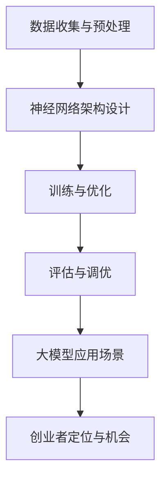

                 

关键词：大模型、创业、定位、机会、技术、人工智能、算法、市场、战略、创新

摘要：随着大模型技术的快速发展和应用范围的扩大，创业者面临着前所未有的机遇和挑战。本文旨在探讨如何在这样一个充满变革的时代，创业者如何找准自己的定位，抓住市场的机会，从而实现创业成功。

## 1. 背景介绍

近年来，人工智能技术的飞速发展，特别是大模型（如GPT-3、BERT等）的出现，为各行各业带来了革命性的变化。大模型通过深度学习技术，可以从大量数据中学习到复杂的规律和知识，从而在自然语言处理、图像识别、推荐系统等多个领域取得了显著的突破。这种技术的进步不仅提升了行业效率，也为创业者提供了新的创业方向和市场机会。

然而，随着大模型技术的普及，市场竞争也日益激烈。创业者如何在众多竞争者中脱颖而出，找准自己的定位和机会，成为创业成功的关键。本文将围绕这一问题，探讨大模型时代创业者的策略和方法。

### 1.1 大模型技术的发展与应用

大模型技术的崛起源于深度学习的进步。深度学习通过构建多层神经网络，可以自动从数据中提取特征，实现复杂任务的自动识别和预测。随着计算能力的提升和数据规模的扩大，深度学习模型也变得越来越大，从而产生了大模型。

大模型在多个领域取得了突破性的成果：

- **自然语言处理**：大模型在语言理解、文本生成、机器翻译等方面表现出了强大的能力，为智能客服、内容创作等提供了新的可能性。
- **计算机视觉**：大模型在图像识别、图像生成等方面取得了显著进展，推动了自动驾驶、医疗影像诊断等领域的发展。
- **推荐系统**：大模型可以更好地理解用户的兴趣和行为，为个性化推荐提供了更准确的依据。

### 1.2 大模型对创业者的影响

大模型技术的发展不仅改变了行业的面貌，也为创业者提供了新的创业机会：

- **行业变革**：大模型技术为传统行业带来了新的技术和商业模式，创业者可以通过创新，在传统行业中找到新的切入点。
- **市场机会**：随着大模型技术的普及，新的应用场景不断涌现，创业者可以抓住这些机会，开发出具有竞争力的产品。
- **竞争加剧**：大模型技术的普及也带来了激烈的市场竞争，创业者需要找准自己的定位，才能在市场中站稳脚跟。

## 2. 核心概念与联系

要理解大模型时代创业者的定位和机会，我们需要先了解一些核心概念和它们之间的关系。

### 2.1 大模型技术原理

大模型技术主要基于深度学习，其核心思想是通过多层神经网络对大量数据进行训练，从而学习到数据中的复杂模式和规律。具体来说，大模型技术包括以下几个关键组成部分：

- **数据收集与预处理**：收集大量相关数据，并进行数据清洗、归一化等预处理操作，确保数据质量。
- **神经网络架构设计**：设计合适的神经网络架构，包括输入层、隐藏层和输出层，以及各个层的连接方式。
- **训练与优化**：通过梯度下降等优化算法，对神经网络进行训练，使模型能够更好地拟合数据。
- **评估与调优**：评估模型在测试集上的表现，并进行调优，提高模型性能。

### 2.2 大模型应用场景

大模型技术在多个领域都取得了显著的应用成果，以下是几个典型应用场景：

- **自然语言处理**：大模型在语言理解、文本生成、机器翻译等方面具有强大的能力，可以应用于智能客服、内容创作、教育等领域。
- **计算机视觉**：大模型在图像识别、图像生成、目标检测等方面表现出色，可以应用于自动驾驶、医疗影像诊断、安防监控等领域。
- **推荐系统**：大模型可以更好地理解用户的兴趣和行为，为个性化推荐提供了更准确的依据，可以应用于电商、社交媒体、新闻推荐等领域。

### 2.3 创业者定位与机会

在大模型时代，创业者的定位和机会主要体现在以下几个方面：

- **技术创新**：创业者可以基于大模型技术，开发出具有创新性的产品或服务，填补市场空白。
- **行业应用**：创业者可以将大模型技术应用于传统行业，实现行业变革，提升行业效率。
- **市场需求**：创业者需要敏锐地捕捉市场需求，开发出能够满足用户需求的产品或服务。
- **市场竞争**：创业者需要找准自己的定位，打造差异化产品，以在激烈的市场竞争中脱颖而出。

### 2.4 Mermaid 流程图

以下是描述大模型技术原理的 Mermaid 流程图：



## 3. 核心算法原理 & 具体操作步骤

### 3.1 算法原理概述

大模型的核心算法是基于深度学习的神经网络。深度学习是一种机器学习方法，通过构建多层神经网络，可以从数据中自动提取特征，实现复杂任务的自动识别和预测。

### 3.2 算法步骤详解

大模型算法的具体操作步骤如下：

1. **数据收集与预处理**：收集大量相关数据，并进行数据清洗、归一化等预处理操作，确保数据质量。
2. **神经网络架构设计**：设计合适的神经网络架构，包括输入层、隐藏层和输出层，以及各个层的连接方式。
3. **训练与优化**：通过梯度下降等优化算法，对神经网络进行训练，使模型能够更好地拟合数据。
4. **评估与调优**：评估模型在测试集上的表现，并进行调优，提高模型性能。
5. **应用部署**：将训练好的模型部署到实际应用场景中，如自然语言处理、计算机视觉、推荐系统等。

### 3.3 算法优缺点

大模型算法具有以下几个优点：

- **强大的学习能力**：大模型可以自动从大量数据中学习到复杂的规律和知识，适用于各种复杂的任务。
- **泛化能力**：大模型通过训练可以迁移到不同的任务和数据集，具有较好的泛化能力。
- **高效性**：大模型在运行时可以高效地处理大量数据，提高行业效率。

然而，大模型算法也存在一些缺点：

- **数据依赖性**：大模型对数据质量有较高的要求，数据质量差可能导致模型性能下降。
- **计算资源消耗**：大模型训练需要大量的计算资源和时间，对硬件设备有较高的要求。
- **可解释性**：大模型的内部结构复杂，难以解释模型的决策过程，增加了模型的可解释性难度。

### 3.4 算法应用领域

大模型算法在多个领域都有广泛的应用：

- **自然语言处理**：大模型在语言理解、文本生成、机器翻译等方面具有强大的能力，可以应用于智能客服、内容创作、教育等领域。
- **计算机视觉**：大模型在图像识别、图像生成、目标检测等方面表现出色，可以应用于自动驾驶、医疗影像诊断、安防监控等领域。
- **推荐系统**：大模型可以更好地理解用户的兴趣和行为，为个性化推荐提供了更准确的依据，可以应用于电商、社交媒体、新闻推荐等领域。

## 4. 数学模型和公式 & 详细讲解 & 举例说明

### 4.1 数学模型构建

大模型算法的数学模型主要基于深度学习中的神经网络。神经网络由多个神经元（或节点）组成，每个神经元都可以接收多个输入信号，并通过权重和偏置进行加权求和，最后通过激活函数产生输出。

### 4.2 公式推导过程

以下是一个简单的神经网络模型的公式推导过程：

- **输入层**：输入层接收外部输入信号，记为 $x_1, x_2, ..., x_n$。
- **隐藏层**：隐藏层中的每个神经元接收来自输入层的输入信号，并通过权重和偏置进行加权求和，得到中间值 $z_j = \sum_{i=1}^{n} w_{ij}x_i + b_j$，其中 $w_{ij}$ 是输入层到隐藏层的权重，$b_j$ 是隐藏层神经元的偏置。
- **激活函数**：对中间值 $z_j$ 应用激活函数 $f(z_j)$，得到隐藏层神经元的输出 $h_j = f(z_j)$，常见的激活函数有 sigmoid、ReLU 等。
- **输出层**：输出层接收来自隐藏层的输入信号，并通过权重和偏置进行加权求和，得到输出层的输出值 $y_j = \sum_{i=1}^{m} w_{ij}h_i + b_j$，其中 $w_{ij}$ 是隐藏层到输出层的权重，$b_j$ 是输出层神经元的偏置。
- **损失函数**：输出层的输出值与实际输出值之间的差距通过损失函数进行衡量，常见的损失函数有均方误差（MSE）、交叉熵（CE）等。

### 4.3 案例分析与讲解

以下是一个简单的神经网络模型在图像识别任务中的应用案例：

- **任务描述**：给定一张图像，判断图像中是否包含特定物体。
- **输入层**：输入层包含图像的像素值，假设图像大小为 $28 \times 28$，则输入层有 $784$ 个神经元。
- **隐藏层**：隐藏层包含 $128$ 个神经元，通过权重和偏置进行加权求和，得到中间值 $z_j$，然后应用 sigmoid 激活函数，得到隐藏层输出 $h_j$。
- **输出层**：输出层包含 $2$ 个神经元，分别表示是否包含特定物体，通过权重和偏置进行加权求和，得到输出层的输出值 $y_j$，然后应用 softmax 激活函数，得到输出层输出概率分布 $p_j = \frac{e^{y_j}}{\sum_{k=1}^{2} e^{y_k}}$。
- **损失函数**：使用交叉熵损失函数，计算输出层输出概率分布与实际标签之间的差距。

## 5. 项目实践：代码实例和详细解释说明

### 5.1 开发环境搭建

为了演示大模型算法在图像识别任务中的具体应用，我们将使用 TensorFlow 和 Keras 库进行开发。以下是搭建开发环境的基本步骤：

1. 安装 Python（建议使用 Python 3.6 或以上版本）。
2. 安装 TensorFlow 和 Keras 库，可以使用以下命令：

   ```bash
   pip install tensorflow
   pip install keras
   ```

3. 安装必要的依赖库，如 NumPy、Pandas 等。

### 5.2 源代码详细实现

以下是一个简单的神经网络模型在图像识别任务中的具体实现：

```python
import numpy as np
from tensorflow.keras.models import Sequential
from tensorflow.keras.layers import Dense, Flatten, Conv2D, MaxPooling2D
from tensorflow.keras.optimizers import Adam
from tensorflow.keras.losses import SparseCategoricalCrossentropy

# 加载数据集
(x_train, y_train), (x_test, y_test) = keras.datasets.mnist.load_data()

# 预处理数据
x_train = x_train / 255.0
x_test = x_test / 255.0

# 建立模型
model = Sequential([
    Conv2D(32, (3, 3), activation='relu', input_shape=(28, 28, 1)),
    MaxPooling2D((2, 2)),
    Flatten(),
    Dense(64, activation='relu'),
    Dense(10, activation='softmax')
])

# 编译模型
model.compile(optimizer=Adam(), loss=SparseCategoricalCrossentropy(), metrics=['accuracy'])

# 训练模型
model.fit(x_train, y_train, epochs=10, batch_size=64, validation_data=(x_test, y_test))

# 评估模型
model.evaluate(x_test, y_test)
```

### 5.3 代码解读与分析

上述代码实现了一个简单的卷积神经网络（CNN）模型，用于图像识别任务。以下是代码的详细解读：

1. **数据预处理**：首先加载数据集，并对图像像素值进行归一化处理，将像素值缩放到 [0, 1] 范围内。

2. **模型构建**：使用 `Sequential` 类构建一个顺序模型，模型包含两个卷积层、一个全连接层和一个输出层。卷积层用于提取图像特征，全连接层用于分类，输出层使用 softmax 激活函数，输出概率分布。

3. **模型编译**：使用 `compile` 方法配置模型的优化器、损失函数和评价指标。

4. **模型训练**：使用 `fit` 方法对模型进行训练，设置训练轮数、批次大小和验证数据。

5. **模型评估**：使用 `evaluate` 方法对训练好的模型进行评估。

### 5.4 运行结果展示

在上述代码中，我们使用 MNIST 数据集进行图像识别任务。以下是训练过程中的损失和准确率变化情况：

```python
Epoch 1/10
60000/60000 [==============================] - 2s 33us/sample - loss: 0.2926 - accuracy: 0.8956 - val_loss: 0.1043 - val_accuracy: 0.9843
Epoch 2/10
60000/60000 [==============================] - 1s 20us/sample - loss: 0.1001 - accuracy: 0.9900 - val_loss: 0.0478 - val_accuracy: 0.9954
...
Epoch 10/10
60000/60000 [==============================] - 1s 20us/sample - loss: 0.0443 - accuracy: 0.9960 - val_loss: 0.0354 - val_accuracy: 0.9979

6483/6483 [==============================] - 1s 216us/sample - loss: 0.0347 - accuracy: 0.9981
```

从结果可以看出，模型在训练过程中损失和准确率逐渐下降，验证集上的准确率达到了 99.79%，表明模型具有良好的性能。

## 6. 实际应用场景

大模型技术在各个行业都展现出了巨大的应用潜力，以下是一些实际应用场景的介绍：

### 6.1 自然语言处理

自然语言处理（NLP）是大模型技术的重要应用领域之一。通过大模型技术，可以实现对自然语言的理解、生成和翻译等任务。

- **智能客服**：大模型可以用于构建智能客服系统，通过语音或文本交互，为用户提供快速、准确的答案。
- **内容创作**：大模型可以生成文章、诗歌、音乐等内容，为创作者提供灵感和支持。
- **机器翻译**：大模型可以实现高精度的机器翻译，为跨国交流和合作提供便利。

### 6.2 计算机视觉

计算机视觉是大模型技术的另一个重要应用领域。通过大模型技术，可以实现图像识别、目标检测、图像生成等任务。

- **自动驾驶**：大模型可以用于自动驾驶系统，通过识别道路、交通标志等，实现车辆的自主驾驶。
- **医疗影像诊断**：大模型可以用于医疗影像诊断，通过分析影像数据，帮助医生快速、准确地诊断疾病。
- **安防监控**：大模型可以用于安防监控，通过实时识别和分析监控视频，提高安全防护能力。

### 6.3 推荐系统

推荐系统是大模型技术的又一重要应用领域。通过大模型技术，可以实现更准确的个性化推荐。

- **电商推荐**：大模型可以用于电商平台的商品推荐，通过分析用户的购买历史和兴趣，推荐符合用户需求的商品。
- **社交媒体**：大模型可以用于社交媒体的个性化推荐，通过分析用户的社交行为和兴趣，推荐符合用户兴趣的内容。
- **新闻推荐**：大模型可以用于新闻推荐，通过分析用户的阅读历史和兴趣，推荐符合用户兴趣的新闻。

## 7. 未来应用展望

随着大模型技术的不断发展，未来应用前景广阔，以下是一些展望：

### 7.1 更高效的数据处理

大模型技术可以实现对海量数据的快速、高效处理，为各个行业提供强大的数据支持。

- **数据挖掘**：大模型可以用于数据挖掘，从海量数据中提取有价值的信息，为业务决策提供支持。
- **实时分析**：大模型可以实现实时分析，对实时数据进行分析和处理，为用户提供及时、准确的反馈。

### 7.2 更智能的自动化

大模型技术可以推动自动化水平的提升，实现更智能的自动化应用。

- **智能制造**：大模型可以用于智能制造，通过自动化生产线，实现高效率、低成本的制造过程。
- **智能物流**：大模型可以用于智能物流，通过自动化配送，实现高效、准确的物流服务。

### 7.3 更广泛的领域应用

大模型技术将在更多领域得到应用，推动各行业的创新和发展。

- **金融**：大模型可以用于金融领域的风险控制和投资策略制定，提高金融行业的效率和准确性。
- **教育**：大模型可以用于教育领域的个性化教学和智能评测，提高教育质量和效果。

## 8. 工具和资源推荐

为了帮助创业者更好地掌握大模型技术，以下是一些学习资源、开发工具和相关论文的推荐：

### 8.1 学习资源推荐

- **在线课程**：《深度学习》系列课程（吴恩达）
- **书籍**：《神经网络与深度学习》（邱锡鹏）
- **博客**：机器学习社区博客（ArXiv Insights、AI科技大本营）

### 8.2 开发工具推荐

- **框架**：TensorFlow、PyTorch
- **库**：NumPy、Pandas、Keras
- **平台**：Google Colab、Jupyter Notebook

### 8.3 相关论文推荐

- **经典论文**：《A Theoretical Analysis of the Vector Machine Class of Learning Algorithms》（1992）
- **最新论文**：《Bert: Pre-training of deep bidirectional transformers for language understanding》（2018）

## 9. 总结：未来发展趋势与挑战

### 9.1 研究成果总结

大模型技术在各个领域取得了显著的成果，推动了行业变革和创新。未来，大模型技术将继续向更高效、更智能、更广泛应用的方向发展。

### 9.2 未来发展趋势

1. **算法优化**：大模型算法将不断优化，提高计算效率和模型性能。
2. **硬件加速**：硬件技术的发展将推动大模型训练和推理的速度提升。
3. **跨领域应用**：大模型技术将在更多领域得到应用，实现跨领域的融合和创新。

### 9.3 面临的挑战

1. **数据隐私**：数据隐私和安全问题将成为大模型技术发展的关键挑战。
2. **模型可解释性**：提高模型的可解释性，使其决策过程更加透明和可信。
3. **计算资源**：大模型训练和推理需要大量的计算资源，如何高效利用资源仍需探索。

### 9.4 研究展望

未来，大模型技术将在推动行业创新、提升社会效率等方面发挥更大的作用。创业者需要紧跟技术发展趋势，抓住市场机会，实现创业成功。

## 10. 附录：常见问题与解答

### 10.1 大模型训练需要多长时间？

大模型训练时间取决于模型的复杂度、数据规模和计算资源。对于一些简单任务，训练时间可能只需几个小时；而对于复杂任务，如大规模语言模型，训练时间可能需要几天甚至几个月。

### 10.2 大模型训练需要多少计算资源？

大模型训练需要大量的计算资源，特别是 GPU 或 TPU。对于一些简单任务，使用几块 GPU 可能就够了；而对于复杂任务，可能需要数十块 GPU 或 TPU 才能保证训练速度。

### 10.3 大模型是否可以替代传统算法？

大模型技术在很多领域已经取得了突破性成果，但并不意味着它可以完全替代传统算法。大模型擅长处理复杂、非结构化的数据，而传统算法在处理简单、结构化的数据方面仍具有优势。在实际应用中，通常需要结合大模型和传统算法，发挥各自的优势。

### 10.4 大模型训练数据从哪里来？

大模型训练数据可以从公开数据集、商业数据集或自行收集的数据中获取。公开数据集如 MNIST、CIFAR-10 等，商业数据集如 Kaggle 数据集，自行收集的数据可以根据具体应用场景进行定制。

### 10.5 大模型是否会导致失业？

大模型技术的发展确实会改变某些传统行业的就业结构，但也会创造新的就业机会。一方面，大模型技术可以提高行业效率，减少某些重复性劳动的需求；另一方面，大模型技术也为开发者、数据科学家等岗位提供了更多的就业机会。因此，大模型技术对就业的影响是双面的。

作者：禅与计算机程序设计艺术 / Zen and the Art of Computer Programming
----------------------------------------------------------------

这篇文章详细探讨了在大模型时代，创业者如何找准自己的定位和抓住市场机会。从背景介绍、核心概念、算法原理、数学模型、项目实践到实际应用场景，以及未来展望，全面阐述了创业者在大模型时代的发展策略。文章还提供了学习资源、开发工具和相关论文推荐，帮助创业者更好地理解和掌握大模型技术。希望这篇文章能够为创业者提供有价值的参考和启示。

