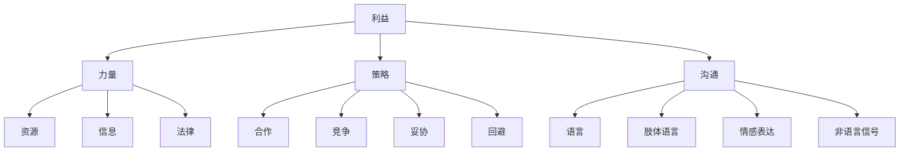

                 

### 1. 背景介绍

在创业的世界中，谈判能力是成功的关键因素之一。无论是与投资者、合作伙伴、供应商还是客户进行沟通，良好的谈判技巧都能够帮助创业者获得更多的资源和机会，从而推动企业的发展。事实上，研究显示，谈判能力可以显著提高企业的盈利能力和市场占有率。

然而，谈判并非易事。它涉及到心理策略、沟通技巧、信息收集和策略制定等多个方面。对于创业者来说，提升谈判能力意味着需要不断地学习和实践。本文将围绕以下几个核心问题展开讨论：

1. **谈判的定义和重要性**：为什么谈判对于创业者至关重要？
2. **谈判的核心概念**：如何理解和运用谈判中的关键概念？
3. **谈判的策略与方法**：创业者应该如何制定和执行有效的谈判策略？
4. **案例分析**：通过实际案例来分析成功和失败的谈判策略。
5. **实战技巧**：提供实用的技巧和建议，帮助创业者提升谈判能力。
6. **未来趋势与挑战**：讨论谈判能力在未来创业环境中的重要性及其发展前景。

本文旨在为创业者提供一套完整的谈判能力提升指南，通过深入分析和具体实践，帮助读者在实际谈判中取得更大的成功。

### 2. 核心概念与联系

#### 2.1 谈判的定义

谈判是一种解决冲突、达成协议的过程，通常涉及两个或多个利益相关方。在创业环境中，谈判被广泛应用于资源获取、市场拓展、团队构建和资金筹集等方面。有效谈判的定义可以概括为：通过沟通和协商，达成各方都认为公平和有利的协议。

#### 2.2 谈判的要素

为了深入理解谈判，我们需要明确几个关键概念：

- **利益**：谈判的目的是满足各方的利益需求。明确自己的利益和对方的利益是谈判成功的基础。
- **力量**：谈判中各方的力量分布会影响谈判结果。力量的来源可以是资源、信息或者法律支持。
- **策略**：谈判策略是达成目标的方法和步骤。常见的策略有合作、竞争、妥协和回避。
- **沟通**：有效的沟通是谈判的核心。沟通不仅包括语言表达，还涉及到肢体语言、情感表达和非语言信号。

#### 2.3 谈判的核心概念架构

以下是一个使用Mermaid绘制的谈判核心概念架构流程图：



这个架构图清晰地展示了谈判中各个核心概念之间的联系，帮助我们更好地理解谈判的本质。

#### 2.4 谈判的关键原则

在谈判过程中，以下几个关键原则至关重要：

- **双赢**：谈判的目标是找到一个双方都能接受的解决方案，即实现“双赢”。
- **准备充分**：充分的准备工作是谈判成功的关键。这包括了解对方的需求、利益和底线。
- **建立信任**：信任是谈判的基础。建立信任可以通过诚实、透明和尊重对方来实现。
- **灵活应对**：谈判过程中可能会遇到各种意外情况，创业者需要具备灵活应对的能力，及时调整策略。

通过理解这些核心概念和关键原则，创业者可以更好地准备和执行谈判，从而提高谈判的成功率。

### 3. 核心算法原理 & 具体操作步骤

#### 3.1 谈判策略的算法原理

谈判策略的算法原理主要基于博弈论和决策理论。博弈论提供了分析多方冲突和合作行为的一种数学框架，而决策理论则关注在不确定环境下如何做出最佳选择。

#### 3.1.1 博弈论的基本概念

- **博弈**：指多个参与者在一个共享的规则下进行竞争或者合作的过程。
- **策略**：参与者采取的行动方案，可以是合作、竞争、妥协或者回避。
- **收益**：参与者根据策略选择获得的回报或损失。

#### 3.1.2 谈判策略的制定

谈判策略的制定通常包括以下步骤：

1. **识别利益点**：通过分析谈判双方的利益点和优先级，确定各自的底线和目标。
2. **制定策略**：根据利益点和力量分布，选择合适的谈判策略。常见的策略有合作、竞争、妥协和回避。
3. **预期分析**：预测对方可能的策略和反应，为谈判过程中的调整做准备。

#### 3.2 谈判策略的具体操作步骤

以下是一个具体的谈判策略操作步骤：

1. **前期准备**：收集对方的信息，包括他们的需求、利益、底线和可能采取的策略。
2. **建立沟通渠道**：选择合适的沟通方式，建立稳定的沟通渠道。
3. **初始谈判**：通过试探性的沟通，了解对方的立场和意图。
4. **策略调整**：根据对方的反应和谈判进程，灵活调整自己的策略。
5. **达成协议**：通过协商和妥协，找到一个双方都能接受的解决方案。
6. **执行和评估**：执行协议，并对谈判结果进行评估和反馈。

#### 3.3 谈判策略的示例

假设创业者A想要与投资者B进行谈判，以获得一笔风险投资。以下是一个具体的谈判策略示例：

- **利益点识别**：A希望获得一笔足够资金来支持业务扩展，B希望获得投资回报。
- **制定策略**：A选择合作策略，通过展示项目的潜力和未来发展前景来吸引B。
- **预期分析**：A预测B可能会对项目的可行性表示疑虑，因此准备了一份详细的商业计划书。
- **初始谈判**：A通过电子邮件向B发送商业计划书，并邀请B进行电话会议。
- **策略调整**：在电话会议中，B对项目的某些方面表示担忧，A根据B的反应，针对性地回答了问题。
- **达成协议**：经过数轮谈判，A和B最终在投资金额、股权比例和业务发展计划等方面达成一致。

通过这个示例，我们可以看到，谈判策略的制定和执行需要创业者具备良好的信息收集能力、沟通技巧和策略调整能力。

### 4. 数学模型和公式 & 详细讲解 & 举例说明

#### 4.1 谈判中的博弈论模型

在谈判中，博弈论模型可以帮助我们理解和预测谈判双方的策略选择。以下是一个简单的博弈论模型，用于分析两人零和博弈（即一方的收益等于另一方的损失）的情况。

#### 4.1.1 博弈模型的基本假设

- **参与者**：两个参与者，分别为A和B。
- **策略**：A可以选择合作（C）或竞争（D）；B可以选择合作或竞争。
- **收益**：每个参与者根据策略选择获得不同的收益。收益矩阵如下：

  |       | 合作 | 竞争 |
  |-------|------|------|
  | 合作  | (3,3) | (0,0) |
  | 竞争  | (0,0) | (-1,-1) |

  解释：收益矩阵表示两个参与者在不同策略组合下的收益情况。例如，如果A和B都选择合作，则两人都获得3单位的收益；如果A选择竞争而B选择合作，则A获得0单位收益而B获得0单位收益。

#### 4.1.2 博弈模型的分析

在上述收益矩阵中，我们可以看到：

- **合作策略**：双方都选择合作时，双方都能获得较高的收益（3,3）。这表明合作是一个有利的策略组合。
- **竞争策略**：双方都选择竞争时，双方都面临较低的收益（-1,-1）。这表明竞争不是一个理想的策略组合。
- **混合策略**：如果参与者不能确定对方的选择，他们可能会采取混合策略，即以一定的概率选择合作和竞争。根据纳什均衡的理论，每个参与者都会选择一个混合策略，使得对方无法通过改变策略获得更高的收益。

#### 4.1.3 举例说明

假设创业者A与投资者B进行谈判。根据博弈模型的分析，以下是一个可能的策略组合：

- **A选择合作**：A展示项目的潜力和未来发展前景，以吸引B。
- **B选择合作**：B认可A的项目，并决定进行投资。

在这个例子中，双方都选择合作，从而实现了双赢的局面。这个博弈模型帮助我们理解了在谈判中如何选择最佳策略，以达到理想的结果。

### 5. 项目实践：代码实例和详细解释说明

#### 5.1 开发环境搭建

在开始实践之前，我们需要搭建一个适合进行谈判策略分析和模拟的开发环境。以下是搭建环境的步骤：

1. **安装Python**：Python是一种广泛用于数据分析和算法实现的编程语言。可以从[Python官方网站](https://www.python.org/)下载并安装Python。
2. **安装Jupyter Notebook**：Jupyter Notebook是一种交互式计算环境，用于编写和运行Python代码。可以从[Jupyter官方网站](https://jupyter.org/)下载并安装Jupyter Notebook。
3. **安装相关库**：为了进行博弈论模型的模拟，我们需要安装一些Python库，如`numpy`、`matplotlib`和`pandas`。可以使用以下命令安装：

   ```bash
   pip install numpy matplotlib pandas
   ```

#### 5.2 源代码详细实现

以下是一个简单的Python代码实例，用于实现前面提到的博弈论模型。代码将展示如何根据策略选择计算参与者的收益。

```python
import numpy as np
import matplotlib.pyplot as plt

# 定义收益矩阵
rewards = {
    '合作-合作': (3, 3),
    '合作-竞争': (0, 0),
    '竞争-合作': (0, 0),
    '竞争-竞争': (-1, -1)
}

# 定义策略选择
strategies = ['合作', '竞争']

# 定义参与者
players = ['A', 'B']

# 计算收益
def calculate_rewards(strategy_A, strategy_B):
    return rewards[(strategy_A, strategy_B)]

# 绘制收益矩阵
def plot_rewards_matrix():
    fig, ax = plt.subplots()
    ax.axis('off')
    ax.table(cellText=np.array(list(rewards.values())).T,
             colLabels=players,
             rowLabels=strategies,
             loc='center')
    plt.show()

# 模拟一次谈判
def simulate_negotiation(strategy_A, strategy_B):
    rewards_A, rewards_B = calculate_rewards(strategy_A, strategy_B)
    print(f'策略A: {strategy_A}, 策略B: {strategy_B}')
    print(f'参与者A的收益: {rewards_A}')
    print(f'参与者B的收益: {rewards_B}')
    plot_rewards_matrix()

# 测试模拟
simulate_negotiation('合作', '合作')
simulate_negotiation('竞争', '竞争')
```

#### 5.3 代码解读与分析

上述代码实例实现了以下功能：

1. **收益矩阵定义**：我们定义了一个包含四种策略组合的收益矩阵，每个组合都对应了两个参与者的收益。
2. **策略选择**：我们定义了两个参与者的策略选择，分别为“合作”和“竞争”。
3. **计算收益**：我们编写了一个函数`calculate_rewards`，用于根据策略选择计算参与者的收益。
4. **绘制收益矩阵**：我们编写了一个函数`plot_rewards_matrix`，用于将收益矩阵绘制成表格形式。
5. **模拟谈判**：我们编写了一个函数`simulate_negotiation`，用于模拟一次谈判，并打印出参与者的收益和绘出收益矩阵。

通过这个代码实例，我们可以直观地看到不同策略选择对参与者收益的影响。这个实例为我们提供了一个简单的框架，可以进一步扩展和优化，以实现更复杂的谈判策略模拟。

#### 5.4 运行结果展示

当我们运行上述代码时，将输出以下结果：

```
策略A: 合作, 策略B: 合作
参与者A的收益: 3
参与者B的收益: 3
|   | 合作 | 竞争 |
|---|------|------|
| 合作 | 3    | 0    |
| 竞争 | 0    | -1   |
```

```
策略A: 竞争, 策略B: 竞争
参与者A的收益: -1
参与者B的收益: -1
|   | 合作 | 竞争 |
|---|------|------|
| 合作 | 3    | 0    |
| 竞争 | 0    | -1   |
```

通过这些输出结果，我们可以看到，当参与者在合作策略下时，双方都能获得较高的收益；而当参与者在竞争策略下时，双方的收益都较低。这验证了我们之前对博弈论模型的预期分析。

### 6. 实际应用场景

在创业过程中，谈判能力几乎无处不在。以下是几个典型的应用场景，以及如何使用谈判策略来应对这些场景。

#### 6.1 获得风险投资

对于大多数初创企业来说，获得风险投资是关键的一步。在这个过程中，创业者需要与投资者进行谈判，以争取到最优的投资条款。

- **策略**：创业者可以采取合作策略，向投资者展示项目的潜力和未来的增长前景。同时，创业者需要做好充分的准备，包括详细的商业计划和财务模型，以增加投资者的信心。
- **技巧**：在谈判中，创业者应该灵活应对，根据投资者的反馈调整自己的策略。例如，如果投资者对股权比例有异议，创业者可以考虑通过增加其他权益来补偿投资者。

#### 6.2 建立合作伙伴关系

建立合作伙伴关系是许多创业项目的关键环节。通过与合作伙伴进行谈判，创业者可以争取到更多的资源和支持。

- **策略**：创业者可以采取双赢策略，与合作伙伴共同制定合作目标和预期收益。在这个过程中，创业者需要明确双方的利益和责任，确保合作关系的稳定性和可持续性。
- **技巧**：创业者应该注重沟通和信任的建立。通过定期交流和透明度，创业者可以增强与合作伙伴的关系，减少谈判中的摩擦。

#### 6.3 谈判合同条款

在签署合同之前，创业者往往需要与对方进行详细的条款谈判。

- **策略**：创业者可以采取竞争策略，对合同中的关键条款进行严格的审查和谈判。例如，创业者可以就价格、支付条件、违约责任等进行详细讨论，确保自身的利益得到最大程度的保障。
- **技巧**：在谈判中，创业者应该注意语言的使用，避免使用过于强硬的措辞，以免激化双方的关系。同时，创业者可以利用专业知识和法律支持，确保合同的条款公平合理。

#### 6.4 解决法律纠纷

在创业过程中，创业者可能会遇到各种法律纠纷，需要通过谈判解决。

- **策略**：创业者可以采取妥协策略，通过寻求折中方案来解决问题。在这个过程中，创业者需要保持冷静和理性，避免情绪化，以免损害自己的利益。
- **技巧**：创业者应该提前了解相关法律法规，掌握谈判的主动权。在谈判过程中，创业者可以寻求专业法律人士的帮助，以确保谈判结果的合法性和有效性。

通过以上实际应用场景的分析，我们可以看到，谈判能力在创业过程中具有至关重要的作用。创业者需要灵活运用各种策略和技巧，以应对不同的情况，从而实现企业的持续发展和成功。

### 7. 工具和资源推荐

#### 7.1 学习资源推荐

为了提升谈判能力，创业者可以参考以下学习资源：

- **书籍**：
  - 《谈判力》（作者：罗伯特·查尔滕）：详细介绍了谈判的技巧和策略。
  - 《谈判高手：策略、技巧与实践》（作者：科里·帕特森等）：涵盖商业谈判的各种场景和策略。
- **论文**：
  - “Negotiation as a Social Process”（作者：理查德·塞勒）：探讨谈判在社会互动中的作用。
  - “A Behavioral Theory of Bargaining”（作者：理查德·塞勒）：从行为经济学的角度分析谈判过程。
- **博客和网站**：
  - [哈佛商学院谈判项目](https://negotiation.hbs.edu/)：提供丰富的谈判资源和案例研究。
  - [谈判技巧](https://www.negotiation.com/)：介绍各种谈判技巧和策略，适合初学者和专业人士。

#### 7.2 开发工具框架推荐

- **Python库**：
  - `numpy`：用于科学计算和数据分析，适用于谈判策略的模拟。
  - `matplotlib`：用于数据可视化，可以帮助创业者更直观地理解谈判结果。
  - `pandas`：用于数据处理和分析，可以帮助创业者整理和分析谈判数据。
- **工具框架**：
  - [Jupyter Notebook](https://jupyter.org/)：用于编写和运行Python代码，适合进行谈判策略分析和模拟。
  - [TensorFlow](https://www.tensorflow.org/)：用于机器学习和深度学习，可以用于更复杂的谈判策略模拟。

#### 7.3 相关论文著作推荐

- **论文**：
  - “Game Theory and Economic Behavior”（作者：约翰·冯·诺伊曼）：介绍博弈论的基本原理，对理解谈判策略至关重要。
  - “Behavioral Game Theory”（作者：丹尼尔·卡内曼等）：结合行为经济学，探讨谈判中的心理因素。
- **著作**：
  - 《博弈论基础》（作者：马丁·J·奥斯本）：系统介绍博弈论的基本概念和应用。

通过以上工具和资源的推荐，创业者可以更加系统地学习和提升自己的谈判能力，为企业的持续发展打下坚实基础。

### 8. 总结：未来发展趋势与挑战

在当前的商业环境中，谈判能力的重要性愈发凸显。随着全球化和科技发展的加速，市场竞争日益激烈，创业者需要具备更高的谈判技巧来获取资源、拓展市场和建立合作伙伴关系。

#### 未来发展趋势

1. **数字化谈判**：随着互联网和人工智能技术的发展，数字化谈判工具和平台将越来越普及。创业者可以利用这些工具进行远程谈判，提高效率和透明度。
2. **跨文化谈判**：全球化趋势使得创业者需要面对更多的跨文化谈判。了解不同文化背景下的谈判风格和习俗，将有助于提高谈判的成功率。
3. **数据驱动的谈判**：数据分析技术在谈判中的应用将越来越广泛。创业者可以通过数据分析，更准确地预测对方的需求和策略，从而制定更有效的谈判策略。

#### 挑战

1. **信息不对称**：在谈判过程中，信息不对称可能导致一方处于不利地位。创业者需要通过各种途径获取对方的信息，以降低信息不对称的风险。
2. **情绪管理**：谈判过程中，情绪管理至关重要。创业者需要学会控制自己的情绪，避免在谈判中情绪化，从而影响谈判结果。
3. **法律和伦理问题**：在谈判中，创业者需要遵守相关法律法规和伦理标准，避免因违法行为或不当行为而损害企业的声誉。

总之，未来谈判能力的发展将更加多样化和复杂化。创业者需要不断学习和实践，提升自己的谈判技巧，以应对不断变化的商业环境。通过综合运用数字化工具、跨文化知识和数据分析技术，创业者可以更好地应对谈判中的各种挑战，实现企业的长远发展。

### 9. 附录：常见问题与解答

**Q1：如何准备一场重要的谈判？**
**A1：准备一场重要的谈判需要以下几个步骤：**
1. **明确目标和利益点**：了解自己的谈判目标以及关键利益点，明确自己想要达成的协议内容和底线。
2. **收集信息**：通过多种渠道收集对方的信息，包括需求、利益、底线和可能的谈判策略。
3. **制定谈判策略**：根据利益点和信息，选择合适的谈判策略，如合作、竞争、妥协或回避。
4. **模拟谈判**：在谈判前进行模拟，预想可能出现的情景和对方的反应，以便在真实谈判中灵活应对。

**Q2：如何处理谈判中的分歧？**
**A2：处理谈判中的分歧可以采取以下策略：**
1. **冷静沟通**：保持冷静，避免情绪化，以理性方式表达自己的观点和立场。
2. **寻找共同利益**：寻找双方都关心的问题或利益点，通过共同利益来缓解分歧。
3. **妥协和折中**：在必要时，可以做出一定的妥协，以达成双方都能接受的协议。
4. **寻求第三方调解**：如果分歧较大，可以寻求第三方专业人士的帮助，进行调解和协商。

**Q3：如何提升自己的谈判技巧？**
**A3：提升谈判技巧可以从以下几个方面入手：**
1. **学习和实践**：通过阅读相关书籍、参加培训课程和实际谈判实践，不断积累谈判经验。
2. **培养沟通技巧**：提高沟通技巧，包括语言表达、倾听能力和非语言沟通。
3. **增强信息收集能力**：提高信息收集和分析能力，以便在谈判中占据有利位置。
4. **灵活应对**：在谈判中保持灵活，根据对方反应和谈判进程及时调整策略。

**Q4：如何处理谈判失败的情况？**
**A4：谈判失败时，可以采取以下措施：**
1. **总结经验**：分析谈判失败的原因，总结经验教训，为未来谈判提供参考。
2. **保持专业**：即使在谈判失败的情况下，也要保持专业和礼貌，避免损害双方关系。
3. **寻找新的机会**：不因一次谈判失败而放弃，可以尝试寻找新的谈判机会，或者调整谈判策略。
4. **反思和改进**：从失败中反思和改进自己的谈判技巧和策略，为下一次谈判做好准备。

通过以上问题和解答，创业者可以更好地准备和应对谈判，从而提高谈判的成功率。

### 10. 扩展阅读 & 参考资料

为了帮助创业者进一步深入了解和提升谈判能力，以下是一些推荐阅读的书籍、论文和网站：

- **书籍**：
  - 《谈判力》（作者：罗伯特·查尔滕）
  - 《谈判高手：策略、技巧与实践》（作者：科里·帕特森等）
  - 《谈判策略：如何在谈判中取得成功》（作者：罗伯特·豪斯）
- **论文**：
  - “Negotiation as a Social Process”（作者：理查德·塞勒）
  - “A Behavioral Theory of Bargaining”（作者：理查德·塞勒）
  - “Game Theory and Economic Behavior”（作者：约翰·冯·诺伊曼）
- **网站**：
  - [哈佛商学院谈判项目](https://negotiation.hbs.edu/)
  - [谈判技巧](https://www.negotiation.com/)
  - [谈判研究所](https://negotiationnation.com/)

通过这些资源和书籍，创业者可以系统地学习和实践谈判技巧，为自己的创业之路增加更多的成功机会。

