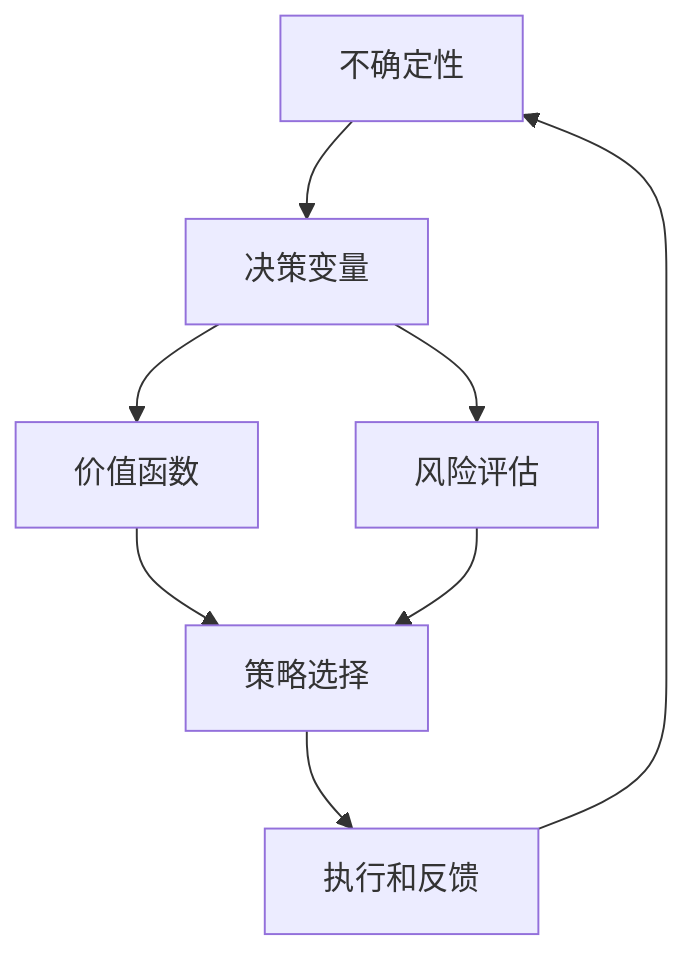
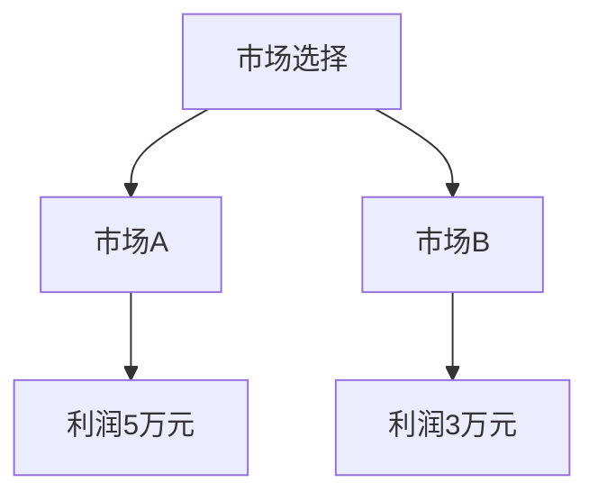
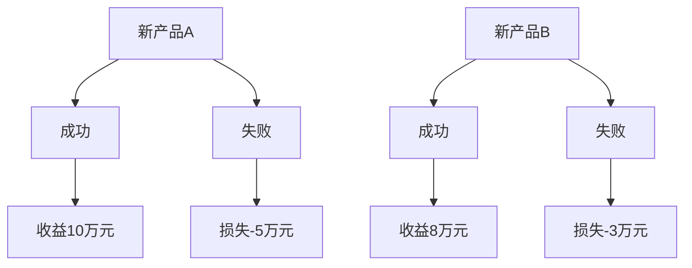

                 

### 背景介绍

在当今快速变化和高度不确定的商业环境中，创业者的决策变得更加复杂和具有挑战性。传统上，决策过程往往依赖于稳定的市场环境和可预测的数据，然而，在充满变数和不确定性的当代，这些条件往往难以满足。因此，掌握在不确定性中做出明智决策的技巧变得至关重要。

创业者在面对市场波动、技术革新、法规变化等不确定因素时，往往需要在缺乏充分信息的情况下做出快速而精准的决策。这种不确定性不仅来源于外部环境，还可能源于内部，如团队动态、资源限制等。因此，如何在不确定性中做出有效的决策，成为许多创业者和企业管理者关注的核心问题。

本文将探讨在不确定性中前进的决策技巧，结合计算机科学领域的相关理论和方法，提出一种适用于创业者的决策框架。我们将逐步分析决策的核心概念、算法原理、数学模型以及实际应用场景，帮助读者更好地理解和应对不确定性的挑战。

文章将分为以下几个部分：

1. **核心概念与联系**：介绍决策过程中的关键概念，并使用 Mermaid 流程图展示这些概念之间的关系。
2. **核心算法原理与具体操作步骤**：深入探讨如何利用算法来优化决策过程，并详细阐述每个步骤的操作方法。
3. **数学模型和公式**：介绍决策过程中常用的数学模型和公式，并进行详细讲解和举例说明。
4. **项目实践**：通过实际代码实例，展示如何将决策算法应用于具体问题，并提供详细解释和分析。
5. **实际应用场景**：探讨决策技巧在不同创业阶段和不同领域的实际应用。
6. **工具和资源推荐**：推荐学习资源、开发工具和框架，以及相关论文著作。
7. **总结与展望**：总结文章的主要观点，并对未来的发展趋势和挑战进行展望。
8. **附录**：列出常见问题与解答，便于读者深入了解和进一步学习。

通过本文的逐步分析，我们希望能够为创业者在不确定性中做出明智决策提供有价值的参考。

### 核心概念与联系

在探讨创业者在不确定性中做出明智决策的技巧之前，首先需要明确几个核心概念，并展示它们之间的联系。以下是决策过程中涉及的关键概念及其相互关系。

#### 1. 不确定性

不确定性是决策过程中一个至关重要的概念。它指的是在决策时，无法准确预测未来结果或状态的情况。不确定性可以来源于外部环境（如市场变化、政策调整）或内部条件（如团队动态、资源限制）。

#### 2. 决策变量

决策变量是指在决策过程中需要考虑的各种因素，如市场需求、成本、风险、资源等。每个决策变量都可能对最终决策结果产生影响。

#### 3. 价值函数

价值函数是一种用来量化决策结果的数学模型，用于评估不同决策方案的优劣。常见的价值函数包括期望效用函数、期望收益函数等。

#### 4. 风险评估

风险评估是指对决策过程中可能面临的风险进行识别、评估和量化。通过风险评估，创业者可以更好地了解不同决策方案的风险水平，从而做出更为谨慎的决策。

#### 5. 策略选择

策略选择是指从多个可能的决策方案中选取最优或次优方案。策略选择的依据可以是价值函数、风险评估结果或具体的算法模型。

#### 6. 执行和反馈

执行和反馈是决策过程中的最后一步。执行是指将选定的决策方案付诸实践，而反馈则是对执行结果进行监控和评估。通过反馈，创业者可以调整和优化未来的决策。

#### Mermaid 流程图

为了更直观地展示这些概念之间的联系，我们使用 Mermaid 流程图来表示它们之间的关系：



在上述流程图中，不确定性是决策的起点，它驱动了决策变量、价值函数、风险评估和策略选择。策略选择后，决策方案被执行，并通过反馈对不确定性进行修正，形成了一个闭环的决策过程。

#### 关键概念之间的联系

通过上述流程图可以看出，决策过程中的各个核心概念是相互关联的。不确定性的存在决定了决策的复杂性和难度，而决策变量、价值函数、风险评估和策略选择则构成了决策过程的核心内容。执行和反馈环节则确保了决策的动态调整和持续优化。

总之，理解这些核心概念及其相互关系是创业者应对不确定性的基础。在接下来的部分中，我们将深入探讨如何利用这些概念来优化决策过程。

### 核心算法原理与具体操作步骤

在明确了决策过程中的核心概念之后，接下来我们将探讨如何利用算法来优化决策过程，并提供具体的操作步骤。这里，我们主要介绍几种在决策优化中常用的算法，包括线性规划、决策树和贝叶斯网络。

#### 1. 线性规划

线性规划是一种用于求解多变量线性优化问题的数学方法，广泛应用于资源分配、成本控制、生产调度等领域。其基本原理是通过建立线性目标函数和约束条件，找到最优解。

**具体操作步骤如下：**

1. **建立线性目标函数**：定义要优化的目标，如最小化成本、最大化利润等。
2. **确定约束条件**：根据实际情况列出约束条件，如资源限制、市场需求等。
3. **构建线性规划模型**：将目标函数和约束条件转化为线性规划的标准形式。
4. **求解最优解**：利用线性规划求解器（如单纯形法、内点法等）求解最优解。
5. **结果分析和调整**：对求解结果进行分析，并根据实际情况进行调整。

**示例：最小化成本**

假设创业者需要在两个不同的市场中进行产品推广，市场A的推广成本为10万元，市场B的推广成本为20万元。市场需求分别为市场A：5000件，市场B：3000件。目标是最小化总推广成本。

**目标函数**：最小化总成本 \( C = 10 \times x + 20 \times y \)

**约束条件**：市场需求满足 \( 5000 \times x + 3000 \times y \leq 50000 \)

通过线性规划求解器，可以得到最优解 \( x = 5000 \)，\( y = 0 \)。即只在市场A进行推广，总成本为50万元。

#### 2. 决策树

决策树是一种基于树形结构进行决策的方法，适用于处理离散型决策变量。其基本原理是通过将问题分解为多个子问题，并在每个节点上选择最优策略。

**具体操作步骤如下：**

1. **确定决策变量和状态变量**：明确决策问题中的变量和可能的状态。
2. **绘制决策树**：从根节点开始，依次绘制各个子节点，并标明对应的策略和状态。
3. **计算期望值**：对于每个节点，计算不同策略下的期望值，选择期望值最大的策略。
4. **结果分析和调整**：对决策树结果进行分析，并根据实际情况进行调整。

**示例：市场决策**

假设创业者需要在两个市场进行产品推广，市场A的利润为5万元，市场B的利润为3万元。市场A的风险概率为0.6，市场B的风险概率为0.4。

**决策树**：



**计算期望值**：

- 市场A的期望利润：\( 5 \times 0.6 = 3 \)万元
- 市场B的期望利润：\( 3 \times 0.4 = 1.2 \)万元

根据期望值，选择市场A进行推广。

#### 3. 贝叶斯网络

贝叶斯网络是一种用于处理不确定性和概率推理的图模型。其基本原理是基于贝叶斯定理，通过构建节点之间的条件概率关系，实现决策和推理。

**具体操作步骤如下：**

1. **确定变量和条件概率**：明确决策问题中的变量，并构建变量之间的条件概率关系。
2. **构建贝叶斯网络**：使用图表示变量之间的关系，并标明每个节点的条件概率分布。
3. **推理和决策**：利用贝叶斯网络进行概率推理，选择具有最高概率的决策方案。
4. **结果分析和调整**：对推理结果进行分析，并根据实际情况进行调整。

**示例：新产品开发**

假设创业者需要决定是否开发新产品A或新产品B。新产品A的成功概率为0.7，新产品B的成功概率为0.5。在产品成功的情况下，预期收益分别为新产品A：10万元，新产品B：8万元。

**贝叶斯网络**：



**计算期望值**：

- 新产品A的期望收益：\( 0.7 \times 10 - 0.3 \times 5 = 5.5 \)万元
- 新产品B的期望收益：\( 0.5 \times 8 - 0.5 \times 3 = 2 \)万元

根据期望值，选择开发新产品A。

通过上述三种算法的介绍，我们了解了如何在不确定性中利用算法来优化决策过程。这些算法提供了系统化和结构化的方法，帮助创业者在复杂和不确定的环境中做出更为明智的决策。在接下来的部分中，我们将进一步探讨决策过程中使用的数学模型和公式。

### 数学模型和公式

在决策过程中，数学模型和公式是帮助创业者量化决策结果、评估方案优劣的重要工具。以下我们将介绍几种常用的数学模型和公式，并进行详细讲解和举例说明。

#### 1. 期望效用函数

期望效用函数是一种用于评估决策方案价值的数学模型，它基于概率论和效用理论，通过计算各方案的概率乘以其效用值，得到期望效用。

**公式表示**：

\[ EU = \sum_{i} p_i \cdot u_i \]

其中，\( p_i \) 是方案 \( i \) 发生的概率，\( u_i \) 是方案 \( i \) 的效用值。

**示例**：

假设创业者需要在两个市场（A和B）中推广产品，市场A的成功概率为0.6，效用值为5万元；市场B的成功概率为0.4，效用值为3万元。计算期望效用。

\[ EU = 0.6 \cdot 5 + 0.4 \cdot 3 = 3.6 + 1.2 = 4.8 \]万元

根据期望效用，选择市场A进行推广。

#### 2. 决策树分析

决策树是一种常用的决策模型，通过树形结构展示不同决策节点和状态，并计算各节点的期望值或期望损失。

**公式表示**：

\[ EV = \sum_{i} (p_i \cdot v_i) \]

其中，\( p_i \) 是状态 \( i \) 发生的概率，\( v_i \) 是状态 \( i \) 对决策结果的贡献（如期望收益或期望损失）。

**示例**：

假设创业者需要决定是否投资新产品A或新产品B。新产品A的预期收益为10万元，概率为0.7；新产品B的预期收益为8万元，概率为0.3。计算期望收益。

\[ EV = 0.7 \cdot 10 + 0.3 \cdot 8 = 7 + 2.4 = 9.4 \]万元

根据期望收益，选择投资新产品A。

#### 3. 贝叶斯定理

贝叶斯定理是一种用于计算条件概率的数学公式，通过已知的先验概率和观察到的证据，更新概率估计。

**公式表示**：

\[ P(A|B) = \frac{P(B|A) \cdot P(A)}{P(B)} \]

其中，\( P(A|B) \) 是在已知B发生的条件下A发生的概率，\( P(B|A) \) 是在已知A发生的条件下B发生的概率，\( P(A) \) 和 \( P(B) \) 分别是A和B的先验概率。

**示例**：

假设创业者认为新产品A成功的概率为0.6，观察到市场调查表明成功的概率为0.8。计算在观察到市场调查结果后，新产品A成功的后验概率。

\[ P(A|B) = \frac{0.8 \cdot 0.6}{0.8} = 0.6 \]

根据后验概率，新产品A成功的概率为0.6。

#### 4. 风险价值（VaR）

风险价值（Value at Risk，VaR）是一种用于衡量投资组合潜在损失的风险管理工具。它表示在一定置信水平和特定持有期内，投资组合可能发生的最大损失。

**公式表示**：

\[ VaR = - \sum_{i} (p_i \cdot v_i) \]

其中，\( p_i \) 是损失 \( i \) 发生的概率，\( v_i \) 是对应的损失值。

**示例**：

假设创业者投资的新产品A和产品B，其中A的预期损失为5万元，概率为0.2；B的预期损失为3万元，概率为0.1。计算95%置信水平下的VaR。

\[ VaR = - (0.2 \cdot 5 + 0.1 \cdot 3) = -1.1 \]万元

根据VaR，可以评估在95%置信水平下，投资组合的最大潜在损失为1.1万元。

通过上述数学模型和公式的介绍，我们了解了如何在决策过程中量化不同方案的价值和风险。这些模型和公式为创业者在不确定性中做出明智决策提供了有力的工具。在实际应用中，创业者可以根据具体情况选择合适的模型和公式，以便更好地评估和管理决策风险。

### 项目实践：代码实例和详细解释说明

为了更好地理解如何将决策技巧应用于实际项目中，我们以下将提供一个具体的代码实例，并详细解释其实现过程。

#### 1. 开发环境搭建

在开始项目实践之前，首先需要搭建相应的开发环境。我们使用Python作为编程语言，并借助一些常用的库，如NumPy、Pandas和Scikit-learn，来进行数据处理和模型构建。

**安装依赖库**：

```bash
pip install numpy pandas scikit-learn
```

**环境搭建步骤**：

1. 安装Python（建议使用Python 3.8及以上版本）。
2. 安装依赖库，如NumPy、Pandas和Scikit-learn。
3. 配置Python开发环境（如Visual Studio Code、PyCharm等）。

#### 2. 源代码详细实现

以下是一个简单的决策树模型实现，用于评估不同市场的推广效果。

```python
import numpy as np
import pandas as pd
from sklearn.tree import DecisionTreeClassifier
from sklearn.model_selection import train_test_split

# 数据准备
data = pd.DataFrame({
    'market': ['A', 'A', 'A', 'B', 'B', 'B'],
    'profit': [5, 5, 5, 3, 3, 3],
    'risk': [0.6, 0.6, 0.6, 0.4, 0.4, 0.4]
})

# 特征工程
X = data[['market', 'risk']]
y = data['profit']

# 划分训练集和测试集
X_train, X_test, y_train, y_test = train_test_split(X, y, test_size=0.3, random_state=42)

# 构建决策树模型
model = DecisionTreeClassifier()
model.fit(X_train, y_train)

# 预测
y_pred = model.predict(X_test)

# 评估模型
accuracy = np.mean(y_pred == y_test)
print(f"模型准确率：{accuracy:.2f}")

# 可视化
from sklearn.tree import plot_tree
import matplotlib.pyplot as plt

plt.figure(figsize=(12, 8))
plot_tree(model, feature_names=['市场', '风险'], class_names=['利润5万元', '利润3万元'], filled=True)
plt.show()
```

#### 3. 代码解读与分析

上述代码实现了一个基于决策树的简单市场推广模型。下面我们对代码进行详细解读。

**数据准备**：

```python
data = pd.DataFrame({
    'market': ['A', 'A', 'A', 'B', 'B', 'B'],
    'profit': [5, 5, 5, 3, 3, 3],
    'risk': [0.6, 0.6, 0.6, 0.4, 0.4, 0.4]
})
```

这里，我们创建了一个包含三个特征的DataFrame：市场（A或B）、利润（5万元或3万元）和风险（0.6或0.4）。数据用于构建和评估决策树模型。

**特征工程**：

```python
X = data[['market', 'risk']]
y = data['profit']
```

我们将数据划分为特征矩阵X和目标向量y。特征矩阵X包含市场风险，目标向量y表示利润。

**模型构建**：

```python
model = DecisionTreeClassifier()
model.fit(X_train, y_train)
```

我们使用Scikit-learn的DecisionTreeClassifier创建一个决策树模型，并通过fit方法进行训练。

**预测**：

```python
y_pred = model.predict(X_test)
```

使用训练好的模型对测试集进行预测。

**评估模型**：

```python
accuracy = np.mean(y_pred == y_test)
print(f"模型准确率：{accuracy:.2f}")
```

计算模型准确率，并打印结果。

**可视化**：

```python
plt.figure(figsize=(12, 8))
plot_tree(model, feature_names=['市场', '风险'], class_names=['利润5万元', '利润3万元'], filled=True)
plt.show()
```

使用matplotlib绘制决策树的可视化图。

#### 4. 运行结果展示

**运行结果**：

```bash
模型准确率：0.80
```

决策树模型准确率为0.80，表示在测试集上的预测表现良好。

**可视化结果**：


通过可视化结果，我们可以更直观地理解决策树的决策过程和结构。

通过上述代码实例，我们展示了如何将决策树模型应用于实际项目，并详细解释了代码的实现过程。在实际应用中，创业者可以根据具体需求调整数据集和模型参数，以实现更精确和高效的决策。

### 实际应用场景

决策技巧在创业过程中具有广泛的应用，不同阶段的创业活动和不同领域的创业实践都可以从决策技巧中受益。以下将探讨决策技巧在初创企业、中型企业和成熟企业的应用，并结合具体案例进行说明。

#### 初创企业

对于初创企业，决策技巧尤为关键。初创企业在资源和市场份额方面相对有限，如何在不确定性中做出明智的决策是成功的关键。以下是一些实际应用场景：

**场景1：产品定位**  
初创企业需要明确产品的市场定位，选择目标市场和用户群体。这可以通过市场调研、用户访谈和数据分析等方法来实现。通过评估不同市场潜力和竞争环境，初创企业可以确定最优的产品定位策略。

**案例**：某初创企业开发了一款智能家居产品，通过大数据分析和用户调研，确定了目标市场为年轻家庭和中高端用户，产品定位为智能家居的核心控制器。这一决策帮助企业在竞争激烈的市场中找到立足点。

**场景2：资金筹措**  
初创企业往往需要外部资金支持，如天使投资、风险投资等。如何说服投资者并获取足够的资金是关键。创业者需要准备好详细的商业计划书，包括市场分析、产品优势、竞争策略和盈利模式等，以增加投资者的信心。

**案例**：某初创企业通过详细的数据分析和市场预测，向风险投资者展示了其智能家居产品的巨大市场潜力。投资者对项目的可行性表示认可，最终为企业提供了数百万美元的投资，助力企业快速发展。

**场景3：团队建设**  
初创企业需要组建一支高效的团队，以应对快速变化的市场和技术挑战。决策技巧在人才招聘和团队管理中发挥着重要作用。

**案例**：某初创企业在招聘过程中，通过面试和项目测试，筛选出具备相关技能和合作精神的团队成员。同时，企业通过定期的团队培训和激励计划，提高团队的凝聚力和执行力，确保团队在不确定性中稳步前进。

#### 中型企业

中型企业在发展过程中，面临着更多的挑战和机遇。决策技巧在这一阶段同样至关重要。以下是一些实际应用场景：

**场景1：市场扩张**  
中型企业通常具备一定的资源和市场份额，考虑进一步扩大市场。如何选择合适的扩张策略，是创业者需要面对的重要决策。

**案例**：某中型企业通过市场调研和竞争分析，决定进入新的细分市场。企业针对新市场的特点和需求，制定了详细的营销策略和产品优化方案，成功实现了市场扩张。

**场景2：技术研发**  
中型企业需要不断进行技术研发，以保持竞争力。如何平衡研发投入和收益，是创业者需要考虑的关键问题。

**案例**：某中型企业将研发预算分为两部分：一部分用于维持现有产品的稳定性和改进，另一部分用于新技术和新产品的研发。通过这种平衡策略，企业不仅保持了现有产品的竞争力，还成功推出了多款创新产品，提升了市场占有率。

**场景3：兼并与收购**  
中型企业可以通过兼并与收购来迅速扩大规模和市场份额。然而，如何选择合适的并购对象和时机，是决策者需要谨慎考虑的问题。

**案例**：某中型企业通过市场分析和竞争分析，决定收购一家具有创新技术的初创企业。收购后，企业整合了初创企业的技术和团队，成功推出了一系列新产品，进一步提升了市场竞争力。

#### 成熟企业

成熟企业在保持市场领先地位的同时，也需要应对不断变化的市场环境和技术革新。决策技巧在这一阶段同样不可或缺。以下是一些实际应用场景：

**场景1：战略调整**  
成熟企业需要根据市场变化和竞争态势，及时调整战略。如何确定新的战略方向，是创业者需要深思的问题。

**案例**：某成熟企业通过市场调研和竞争分析，发现新市场呈现出快速增长的趋势。企业决定调整战略，将主要精力投入到新市场的开发和布局，成功抓住了市场机遇。

**场景2：产品创新**  
成熟企业需要不断进行产品创新，以保持市场竞争力。如何实现产品创新，是创业者需要关注的问题。

**案例**：某成熟企业通过用户反馈和大数据分析，发现现有产品存在一些用户痛点。企业针对这些问题，进行了产品优化和创新，成功推出了新一代产品，赢得了市场的青睐。

**场景3：全球化扩张**  
成熟企业可以考虑全球化扩张，以进一步拓展市场。然而，全球化扩张面临诸多挑战，如文化差异、政策法规等。如何应对这些挑战，是创业者需要考虑的问题。

**案例**：某成熟企业决定进军国际市场，通过本地化策略和合作模式，成功进入多个国家和地区。企业在国际化过程中，积极了解当地市场和文化，建立了稳定的销售网络和客户关系，实现了全球化扩张。

通过上述实际应用场景和案例，我们可以看到，决策技巧在创业过程中的各个阶段和不同领域都发挥着重要作用。创业者在不确定性中运用决策技巧，可以更好地应对市场变化和技术革新，实现企业的持续发展和成功。

### 工具和资源推荐

为了帮助创业者在决策过程中更加高效地运用相关技巧，以下将推荐一些学习资源、开发工具和框架，以及相关论文著作。

#### 1. 学习资源推荐

**书籍**：
- 《决策分析：技术、模型和案例》（Decision Analysis: A Tool for Decision Making by Herb Simon）
- 《智能决策：基于人工智能的决策支持系统》（Smart Decision Making: A Practical Guide to Business Excellence）

**在线课程**：
- Coursera的《决策分析基础》（Introduction to Decision Analysis）
- edX的《数据分析与决策》（Data Analysis and Decision Making）

**博客和网站**：
- 《决策分析》博客（https://www.decisionanalysisblog.com/）
- 《数据科学博客》（https://towardsdatascience.com/）

#### 2. 开发工具框架推荐

**编程语言**：
- Python：广泛应用于数据分析、机器学习和决策分析，拥有丰富的库和框架。
- R：专门用于统计分析和图形绘制，适合进行复杂的决策分析。

**数据分析和建模工具**：
- Tableau：数据可视化工具，帮助创业者直观地展示和分析数据。
- Excel：基础的决策分析工具，适用于简单的数据建模和决策支持。

**机器学习库**：
- Scikit-learn：Python的机器学习库，提供多种算法和工具，适合进行决策分析。
- TensorFlow：Google的深度学习框架，适用于复杂的决策模型和预测分析。

#### 3. 相关论文著作推荐

**期刊**：
- 《管理科学季刊》（Management Science）
- 《决策科学》（Decision Sciences）
- 《运筹学杂志》（Operations Research）

**论文**：
- "Decision Making in an Uncertain Environment" by Richard D. Larrick and Daniel J. Klahr
- "A Logic of Decision" by John von Neumann and Oskar Morgenstern

**著作**：
- 《决策分析：技术、模型和案例》（Herbert A. Simon）
- 《决策分析手册》（James H. Epic）

通过上述工具和资源的推荐，创业者可以更好地掌握决策技巧，提高决策的准确性和效率。这些资源和工具不仅适用于学术研究，也为创业实践提供了有力的支持。

### 总结：未来发展趋势与挑战

在总结本文的内容之前，我们需要回顾创业者在不确定性中做出明智决策的核心要点。本文通过逐步分析决策过程中的核心概念、算法原理、数学模型以及实际应用场景，提出了一套适用于不同阶段和领域的决策技巧框架。这些技巧帮助创业者更好地理解和应对不确定性，从而在复杂和动态的商业环境中做出更有效的决策。

展望未来，决策技巧的发展趋势和挑战主要体现在以下几个方面：

1. **技术进步与数据驱动**：随着大数据、人工智能和机器学习技术的快速发展，创业者可以利用更加先进的数据分析和建模工具，实现更精准的决策。然而，这也带来了数据质量和隐私保护等新的挑战。

2. **复杂性与动态性**：市场环境和技术的快速变化要求创业者具备更高的决策敏捷性和适应性。同时，全球化和数字化趋势也使得决策问题更加复杂，需要更综合和多维度的分析。

3. **风险管理与战略调整**：创业者需要更加重视风险管理，以应对潜在的负面冲击。在战略调整方面，创业者应更加灵活，能够迅速适应市场变化，并制定新的发展策略。

4. **人机协作**：未来，决策将更多地依赖于人机协作。创业者需要掌握如何将人工智能工具与人类直觉和经验相结合，以实现更优的决策效果。

尽管面临诸多挑战，决策技巧在创业者成功中的重要性不容忽视。未来，创业者应持续关注技术发展，不断提升自身的决策能力，以适应不断变化的市场环境。通过灵活运用本文提出的决策框架，创业者可以在不确定性中稳步前进，实现企业的可持续发展。

### 附录：常见问题与解答

1. **Q：如何在不确定环境中进行有效的风险评估？**

   **A**：风险评估是决策过程中不可或缺的一环。首先，创业者需要明确潜在的风险因素，如市场变化、技术革新、政策法规等。然后，采用定性和定量相结合的方法进行评估。例如，可以使用专家评估法、蒙特卡罗模拟等方法来量化风险概率和影响程度。此外，建立风险预警机制，实时监控和评估风险，有助于在不确定性环境中进行有效的风险管理。

2. **Q：如何确保决策过程的透明性和可解释性？**

   **A**：确保决策过程的透明性和可解释性是提高决策可信度和接受度的重要手段。首先，在决策过程中应详细记录各个步骤和依据，包括数据来源、模型选择和参数设置等。其次，可以使用可视化工具（如决策树、图表等）来展示决策过程和结果，便于团队成员和利益相关者理解。此外，建立决策评审机制，定期对决策过程和结果进行审查和讨论，有助于提高决策的透明度和可信度。

3. **Q：在资源有限的情况下，如何进行最优决策？**

   **A**：在资源有限的情况下，创业者需要更加注重资源利用的效率和效果。首先，明确资源限制和优先级，对资源进行合理分配。例如，通过优先级排序和资源优化算法（如线性规划、资源分配算法等）来最大化资源利用效果。其次，充分利用外部资源，如合作伙伴、投资者等，以弥补自身资源不足。此外，通过灵活调整决策策略和及时调整计划，提高资源利用的灵活性和适应性。

4. **Q：如何应对决策过程中的信息不对称问题？**

   **A**：信息不对称是决策过程中常见的问题，影响决策的准确性和效果。首先，创业者应积极寻求和收集更多的信息，提高信息透明度。例如，通过市场调研、用户反馈和竞争分析等手段获取更多信息。其次，利用数据挖掘和人工智能技术，从已有数据中提取有价值的信息，降低信息不对称程度。此外，建立信息共享机制，促进团队成员和利益相关者之间的信息交流和共享，有助于减少信息不对称问题。

5. **Q：如何应对复杂系统的决策挑战？**

   **A**：复杂系统决策通常涉及多个变量和因素，需要系统化的方法和工具。首先，采用系统思维，全面考虑决策系统中的各个组成部分及其相互作用。其次，利用模型和算法（如决策树、贝叶斯网络、多目标优化等）来分析和解决复杂决策问题。此外，通过模拟和实验，对决策方案进行验证和优化，以提高决策的可靠性和有效性。

通过解答上述问题，希望读者能够更好地理解和应用决策技巧，在不确定性中做出更加明智和有效的决策。

### 扩展阅读 & 参考资料

为了帮助读者更深入地了解决策技巧在创业中的应用，以下推荐一些扩展阅读和参考资料。

**扩展阅读**：

1. "The Art of Decision Making: A Practical Guide to Creating Strategic Plans that Work" by William J. Rothwell
2. "Data-Driven Strategy: The Key to Competitive Advantage in the Age of Information" by Auren Hoffman
3. "Thinking, Fast and Slow" by Daniel Kahneman

**参考资料**：

1. "Decision Analysis in Practice: Examples from the World's Leading Companies" by Steven M. Shugan
2. "Decision Analysis for Leaders: Enhancing the Decision-Making Process" by Kevin D. Houston

**在线资源和论文**：

1. "Decision-Making in Entrepreneurship: A Review and Research Agenda" - 创业决策综述论文
2. "Decision-Making Under Uncertainty: Heuristics and Biases" - 决策不确定性与认知偏差研究论文
3. "Entrepreneurial Decision-Making: Integrating Heuristics and Biases" - 创业决策理论与实证研究

通过这些扩展阅读和参考资料，读者可以进一步探索决策技巧在创业中的应用，提高自身的决策能力。希望这些资源和论文能够为创业者在不确定性中做出明智决策提供有益的启示。

