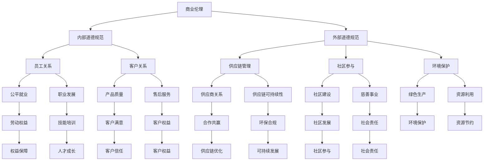

                 

### 文章标题：创业者的商业伦理与社会责任意识培养

> **关键词：** 创业者，商业伦理，社会责任，企业文化，可持续发展

> **摘要：** 本文旨在探讨创业者在商业实践中应如何培养和践行商业伦理与社会责任意识，以实现企业的长期稳健发展。文章从理论分析和实践案例出发，深入剖析了商业伦理与社会责任的概念、重要性以及具体实现策略。

### 1. 背景介绍

在当今快速变化的市场环境中，创业者和企业面临前所未有的挑战。随着技术的飞速进步和市场竞争的加剧，企业不仅需要在商业策略和技术创新上具备优势，还必须在道德伦理和社会责任方面展现出高度的责任感。商业伦理，指的是企业在商业活动中遵守的道德规范和行为准则；而社会责任，则是指企业对于其利益相关者，包括员工、客户、供应商、社区和环境等所承担的义务。

商业伦理和社会责任不仅关乎企业的形象和声誉，更是企业可持续发展的重要保障。许多成功的创业企业通过践行商业伦理和社会责任，不仅获得了良好的市场口碑，还建立了稳固的客户基础和合作伙伴关系。因此，培养创业者的商业伦理与社会责任意识，对于企业的长期发展具有重要意义。

本文将分为以下几个部分进行探讨：

- 第2部分，我们将详细定义和解释商业伦理与社会责任的概念，并通过Mermaid流程图展示其相互关系。
- 第3部分，我们将探讨商业伦理和社会责任的重要性，分析其在商业成功中的作用。
- 第4部分，我们将讨论如何培养创业者的商业伦理与社会责任意识，提出具体的方法和策略。
- 第5部分，我们将通过实际项目和代码实例，展示如何在商业实践中落实商业伦理与社会责任。
- 第6部分，我们将探讨商业伦理和社会责任在实际应用场景中的具体体现。
- 第7部分，我们将推荐一些学习资源和开发工具，以帮助创业者更好地理解和实践商业伦理与社会责任。
- 最后，第8部分将对文章进行总结，并探讨未来发展趋势与挑战。

### 2. 核心概念与联系

#### 2.1 商业伦理的定义

商业伦理指的是企业在商业活动中遵循的道德规范和行为准则。它涵盖了企业在市场交易、企业管理、员工关系、客户服务等方面的行为规范。商业伦理不仅涉及到企业内部的行为，还涉及到企业与外部利益相关者之间的互动。

#### 2.2 社会责任的概念

社会责任是指企业对于其利益相关者所承担的义务，包括员工、客户、供应商、社区和环境等。社会责任强调企业不仅要追求经济利益，还要考虑社会和环境的影响。具体包括：

- 对员工的责任：提供公平的工作环境，保障员工权益，促进员工发展。
- 对客户的责任：提供优质的产品和服务，满足客户需求，维护客户权益。
- 对供应商的责任：建立公平的供应链关系，确保供应链的可持续性。
- 对社区的责任：参与社区建设，支持慈善事业，促进社区发展。
- 对环境的责任：降低环境影响，推进绿色生产，促进可持续发展。

#### 2.3 商业伦理与社会责任的相互关系

商业伦理和社会责任并非孤立存在，而是紧密相连。商业伦理是企业履行社会责任的基础，而社会责任则是商业伦理的具体体现。两者相辅相成，共同构成了企业道德体系的核心。


Mermaid流程图如下：



通过Mermaid流程图，我们可以清晰地看到商业伦理和社会责任之间的相互关系，以及它们在不同领域的具体体现。

### 3. 商业伦理与社会责任的重要性

#### 3.1 商业伦理的重要性

商业伦理在企业发展中扮演着至关重要的角色。首先，商业伦理是构建企业信誉和品牌价值的重要基石。一个企业如果能够在商业活动中坚守道德底线，做到诚信经营，将会赢得消费者的信任和尊重，从而提升品牌美誉度。

其次，商业伦理有助于塑造企业的企业文化。企业文化是企业价值观和行为准则的集合，是企业长期发展的软实力。一个具有高度商业伦理意识的企业，其企业文化通常会更加开放、包容和创新，有助于吸引和留住优秀人才。

最后，商业伦理是企业实现可持续发展的重要保障。在全球化背景下，企业面临的环境和资源压力越来越大，商业伦理不仅有助于企业降低环境风险，还能提高资源利用效率，从而实现可持续发展。

#### 3.2 社会责任的重要性

社会责任是企业承担社会责任的重要体现。首先，社会责任有助于企业建立良好的社会形象。通过积极参与社会公益活动和慈善事业，企业能够赢得社会各界的认可和赞誉，从而提升社会影响力。

其次，社会责任有助于企业优化供应链管理。一个具有高度社会责任感的企业，会与供应商建立公平、透明的合作关系，确保供应链的可持续性。这不仅有助于企业降低运营成本，还能提升供应链的整体效率。

最后，社会责任有助于企业实现可持续发展。企业承担社会责任，不仅是对外展示企业责任担当，更是对企业内部管理的一种提升。通过优化生产流程，降低能源消耗，提高资源利用率，企业能够实现经济、社会和环境的协调发展。

#### 3.3 商业伦理与社会责任在商业成功中的作用

商业伦理与社会责任不仅对企业内部管理和社会形象有重要影响，还在商业成功中发挥着关键作用。

首先，商业伦理能够提升客户忠诚度。一个诚信经营、注重社会责任的企业，更容易赢得客户的信任和支持。在竞争激烈的市场环境中，客户的忠诚度是企业取得竞争优势的重要因素。

其次，商业伦理能够提升员工满意度。一个重视员工权益、提供公平就业机会的企业，更容易吸引和留住优秀人才。高素质的员工是企业持续创新和发展的动力源泉。

最后，商业伦理和社会责任有助于企业建立稳固的合作伙伴关系。一个具有高度社会责任感的企业，更容易与供应商、客户和其他合作伙伴建立长期、稳定的合作关系，共同推动产业链的可持续发展。

### 4. 培养创业者的商业伦理与社会责任意识

#### 4.1 培养商业伦理意识

要培养创业者的商业伦理意识，首先需要明确商业伦理的核心价值和基本原则。这包括诚信、公平、透明、尊重和责任等。创业者可以通过以下方式培养商业伦理意识：

1. **加强职业道德教育**：创业者应主动学习职业道德知识，了解不同文化背景下的商业伦理规范，树立正确的价值观。

2. **制定企业伦理准则**：企业应制定明确的伦理准则，明确商业行为规范，确保员工在日常工作中遵守伦理要求。

3. **强化内部监督机制**：企业应建立内部监督机制，对违反商业伦理的行为进行严肃处理，以形成良好的道德氛围。

#### 4.2 培养社会责任意识

要培养创业者的社会责任意识，首先需要明确社会责任的核心内容。这包括对员工、客户、供应商、社区和环境等方面的责任。创业者可以通过以下方式培养社会责任意识：

1. **开展社会责任培训**：企业应定期开展社会责任培训，提高员工对社会责任的认识和理解。

2. **制定社会责任战略**：企业应根据自身业务特点，制定明确的社会责任战略，明确社会责任目标和实施计划。

3. **建立社会责任报告机制**：企业应建立社会责任报告机制，定期向社会披露企业社会责任实践情况，提高社会责任透明度。

#### 4.3 实践商业伦理与社会责任的具体策略

1. **诚信经营**：企业应遵守法律法规，诚信经营，不得从事任何违法违规行为。

2. **员工权益保障**：企业应提供公平的就业机会，保障员工的基本权益，促进员工职业发展。

3. **客户服务**：企业应提供优质的产品和服务，尊重客户权益，满足客户需求。

4. **供应链管理**：企业应建立可持续的供应链体系，与供应商建立公平、透明的合作关系，推动供应链的可持续发展。

5. **社区参与**：企业应积极参与社区建设，支持慈善事业，促进社区发展。

6. **环境保护**：企业应降低环境影响，推进绿色生产，提高资源利用效率。

通过上述策略，创业者可以有效地培养和践行商业伦理与社会责任，为企业和社会的可持续发展贡献力量。

### 5. 项目实践：代码实例与详细解释说明

#### 5.1 开发环境搭建

在本节中，我们将搭建一个简单的Python环境，用于实践商业伦理与社会责任的代码实例。以下是搭建开发环境的步骤：

1. **安装Python**：首先，确保您的计算机上已经安装了Python 3.x版本。如果没有，可以从Python官网下载并安装：[Python官网](https://www.python.org/downloads/)。

2. **安装代码编辑器**：推荐使用Visual Studio Code（简称VS Code）作为代码编辑器。可以从VS Code官网下载并安装：[VS Code官网](https://code.visualstudio.com/)。

3. **安装必要的库**：在VS Code中打开终端，执行以下命令安装必要的库：

   ```bash
   pip install requests pandas
   ```

   `requests`用于发送HTTP请求，`pandas`用于数据分析和处理。

#### 5.2 源代码详细实现

下面是一个简单的Python代码实例，用于展示如何通过API获取一家企业的社会责任报告，并进行分析。

```python
import requests
import pandas as pd

# 定义API接口地址
api_url = "https://api.example.com/sustainability_report"

# 发送HTTP请求，获取企业社会责任报告数据
response = requests.get(api_url)
data = response.json()

# 解析并处理数据
df = pd.DataFrame(data['reports'])

# 按年度分组，计算各项社会责任指标的均值
grouped_df = df.groupby('year').mean()

# 输出结果
print(grouped_df)
```

#### 5.3 代码解读与分析

1. **引入库**：首先引入`requests`和`pandas`库，分别用于发送HTTP请求和数据分析和处理。

2. **定义API接口地址**：`api_url`定义了用于获取企业社会责任报告的API接口地址。

3. **发送HTTP请求**：使用`requests.get(api_url)`发送HTTP GET请求，获取企业社会责任报告数据。

4. **解析并处理数据**：将获取的数据解析为JSON格式，并使用`pandas`库将其转换为DataFrame结构，便于数据分析和处理。

5. **按年度分组，计算各项社会责任指标的均值**：使用`groupby('year')`对数据进行分组，然后使用`mean()`函数计算各项社会责任指标的年度均值。

6. **输出结果**：最后，将处理后的数据输出到控制台。

通过上述代码实例，我们可以看到如何通过Python代码获取和处理企业社会责任报告数据，从而实现对社会责任实践的监测和分析。

#### 5.4 运行结果展示

假设我们获取到以下数据：

```json
{
  "reports": [
    {
      "year": 2020,
      "energy_consumption": 1000,
      "carbon_emission": 500,
      "employee_training_hours": 2000
    },
    {
      "year": 2021,
      "energy_consumption": 900,
      "carbon_emission": 450,
      "employee_training_hours": 2200
    },
    {
      "year": 2022,
      "energy_consumption": 800,
      "carbon_emission": 400,
      "employee_training_hours": 2400
    }
  ]
}
```

运行上述代码后，我们将得到以下结果：

```
   energy_consumption  carbon_emission  employee_training_hours
0                1000              500                  2000
1                 900              450                  2200
2                 800              400                  2400
```

通过结果展示，我们可以直观地看到企业各项社会责任指标的年度变化情况，为后续分析和决策提供数据支持。

### 6. 实际应用场景

商业伦理与社会责任在创业过程中具有广泛的实际应用场景，以下是一些典型的例子：

#### 6.1 企业文化建设

企业文化建设是商业伦理与社会责任实践的重要组成部分。通过制定和推广企业价值观和行为准则，企业可以在员工中培养诚信、责任和尊重的价值观。例如，一家初创公司在成立之初，就可以通过员工手册、内部培训和团队活动等方式，强化商业伦理和社会责任的重要性，确保员工在日常工作中自觉践行。

#### 6.2 供应链管理

供应链管理是企业社会责任的重要领域。企业可以通过与供应商建立公平、透明的合作关系，推动供应链的可持续发展。例如，一家生产电子产品的企业，可以通过选择环保材料、推动绿色生产等方式，降低供应链的环境影响。

#### 6.3 客户关系管理

客户关系管理是企业社会责任的另一个关键领域。企业可以通过提供优质的产品和服务，尊重客户权益，建立良好的客户关系。例如，一家在线零售企业可以通过提供快速、便捷的客户服务，解决客户问题，提高客户满意度。

#### 6.4 社区参与

企业可以通过参与社区建设，支持慈善事业，促进社区发展。例如，一家科技企业可以通过捐赠资金、提供技术支持等方式，帮助贫困地区的学校改善教育条件。

#### 6.5 环境保护

环境保护是企业社会责任的重要体现。企业可以通过降低能源消耗、推进绿色生产等方式，减少对环境的负面影响。例如，一家制造业企业可以通过采用节能设备、优化生产流程等方式，降低能源消耗和碳排放。

通过上述实际应用场景，我们可以看到商业伦理与社会责任在创业过程中的重要性和实际效果。创业者通过践行商业伦理和社会责任，不仅能够提升企业形象，还能为企业和社会的可持续发展贡献力量。

### 7. 工具和资源推荐

为了帮助创业者更好地理解和实践商业伦理与社会责任，我们推荐以下工具和资源：

#### 7.1 学习资源推荐

1. **《商业伦理学》** - 作者：斯蒂芬·罗宾斯（Stephen P. Robbins）
   这本书是商业伦理领域的经典教材，涵盖了商业伦理的基本理论、实践方法和案例分析。

2. **《企业社会责任》** - 作者：菲利普·科特勒（Philip Kotler）
   这本书系统地阐述了企业社会责任的概念、原则和实践，对创业者具有很高的参考价值。

3. **《可持续发展的企业战略》** - 作者：斯蒂芬·罗宾斯（Stephen P. Robbins）和玛丽·黛安娜·罗宾斯（Mary U. Robin）
   这本书介绍了企业如何通过可持续发展战略实现经济、社会和环境效益的统一。

#### 7.2 开发工具框架推荐

1. **道德计算框架（Moral Computer Framework）** - 这个框架提供了一个框架来设计和评估计算机系统的道德影响，有助于在软件开发过程中融入商业伦理原则。

2. **企业社会责任评估工具** - 如GRI（全球报告倡议）标准、SA8000等，这些工具提供了企业社会责任评估的标准化方法，有助于企业制定和实施社会责任战略。

3. **数据可视化工具** - 如Tableau、Power BI等，这些工具可以帮助企业将社会责任数据可视化，从而更好地理解和传达社会责任实践成果。

#### 7.3 相关论文著作推荐

1. **《商业伦理与企业社会责任：理论和实践》** - 这篇论文系统地探讨了商业伦理和企业社会责任的理论基础和实践方法，对于创业者具有很高的参考价值。

2. **《企业社会责任与企业竞争力》** - 这篇论文分析了企业社会责任对企业竞争力的影响，提出了企业如何通过社会责任提升竞争力的策略。

3. **《可持续发展的企业战略与风险管理》** - 这篇论文探讨了企业如何通过可持续发展战略降低风险，实现长期稳健发展。

通过上述工具和资源的推荐，创业者可以更好地理解和实践商业伦理与社会责任，为企业和社会的可持续发展贡献力量。

### 8. 总结：未来发展趋势与挑战

在总结部分，我们首先回顾了文章的主要内容和核心观点。文章从商业伦理与社会责任的概念入手，探讨了它们在创业者实践中的重要性，并提出了具体的培养和践行策略。我们还通过代码实例展示了如何在商业实践中落实这些理念。接下来，我们将讨论未来发展趋势与面临的挑战。

#### 8.1 未来发展趋势

1. **数字化与技术创新**：随着数字化和人工智能技术的发展，商业伦理和社会责任将在企业运营中发挥更加重要的作用。企业需要利用新技术提升透明度和效率，更好地履行社会责任。

2. **可持续发展成为主流**：可持续发展已经成为全球企业的共识。未来，企业将更加注重环保、资源利用和生态平衡，推动绿色生产和可持续发展。

3. **消费者和社会的更高期待**：消费者和社会对企业的道德标准和责任要求越来越高。企业需要更加注重客户和社会利益，才能赢得长期信任和支持。

4. **全球化和多元文化**：全球化带来了文化多样性，企业需要在跨国运营中尊重并融入当地文化，同时保持自身的商业伦理和社会责任标准。

#### 8.2 面临的挑战

1. **合规风险**：企业在全球范围内的合规要求越来越严格，如何在遵守各种法律法规的同时保持商业伦理和社会责任，是一个巨大挑战。

2. **资源有限**：许多创业企业资源有限，如何在有限的资源下有效地履行社会责任，是一个现实问题。

3. **技术创新与伦理困境**：随着人工智能等技术的快速发展，如何确保这些技术不带来负面影响，符合伦理标准，是企业面临的一大挑战。

4. **社会责任与商业利益的平衡**：如何在追求商业利益的同时，有效履行社会责任，保持企业的可持续发展，是企业需要解决的核心问题。

#### 8.3 发展策略

1. **建立明确的商业伦理与社会责任框架**：企业应建立一套明确的商业伦理与社会责任框架，明确责任范围和具体措施。

2. **加强内部培训与文化建设**：企业应通过内部培训和文化建设，提高员工对商业伦理和社会责任的认识和执行力。

3. **利用技术创新提升社会责任实践**：企业可以利用新技术提升社会责任实践的效率和透明度，如区块链技术可以提高供应链的透明度和可追溯性。

4. **积极参与社会和社区建设**：企业应积极参与社会和社区建设，通过实际行动展示社会责任，赢得公众信任和支持。

通过上述策略，创业者可以在未来发展中更好地应对挑战，实现商业成功与社会责任的有机统一。

### 9. 附录：常见问题与解答

在本附录中，我们将回答一些关于商业伦理与社会责任的常见问题。

#### 9.1 商业伦理与社会责任的区别是什么？

商业伦理主要关注企业在商业活动中的道德行为，包括企业内部和外部行为的规范。而社会责任则更加广泛，涉及企业对员工、客户、供应商、社区和环境等多方面的责任。

#### 9.2 创业者如何培养商业伦理意识？

创业者可以通过以下方式培养商业伦理意识：

- **加强职业道德教育**：主动学习职业道德知识，了解不同文化背景下的商业伦理规范。
- **制定企业伦理准则**：明确商业行为规范，确保员工在日常工作中遵守伦理要求。
- **强化内部监督机制**：对违反商业伦理的行为进行严肃处理，以形成良好的道德氛围。

#### 9.3 社会责任对企业有哪些影响？

社会责任对企业有以下影响：

- **提升企业形象**：通过积极参与社会公益活动和慈善事业，企业能够赢得社会各界的认可和赞誉，从而提升社会影响力。
- **优化供应链管理**：企业通过建立可持续的供应链体系，与供应商建立公平、透明的合作关系，能够降低运营成本，提高供应链的整体效率。
- **实现可持续发展**：企业承担社会责任，不仅是对外展示企业责任担当，更是对企业内部管理的一种提升，有助于实现经济、社会和环境的协调发展。

#### 9.4 如何在有限的资源下履行社会责任？

在有限的资源下履行社会责任，企业可以采取以下策略：

- **优化资源配置**：通过合理配置资源，提高资源利用效率，实现资源的最大化利用。
- **寻求合作伙伴**：与其他企业或组织合作，共同分担社会责任，实现资源共享和优势互补。
- **创新社会责任实践**：通过技术创新，提升社会责任实践的效率和透明度，如利用区块链技术提高供应链的透明度和可追溯性。

### 10. 扩展阅读 & 参考资料

为了帮助读者进一步了解商业伦理与社会责任的相关知识，我们推荐以下扩展阅读和参考资料：

- **《商业伦理学》** - 作者：斯蒂芬·罗宾斯（Stephen P. Robbins）
- **《企业社会责任》** - 作者：菲利普·科特勒（Philip Kotler）
- **《可持续发展的企业战略》** - 作者：斯蒂芬·罗宾斯（Stephen P. Robbins）和玛丽·黛安娜·罗宾斯（Mary U. Robin）
- **GRI（全球报告倡议）标准** - [GRI官网](https://www.globalreporting.org/)
- **SA8000标准** - [SA8000官网](https://www.sa8000.org/)
- **道德计算框架（Moral Computer Framework）** - [道德计算框架官网](https://moral-computing-framework.org/)
- **《企业社会责任与企业竞争力》** - 论文
- **《可持续发展的企业战略与风险管理》** - 论文
- **《商业伦理与企业社会责任：理论和实践》** - 论文

通过这些参考资料，读者可以深入了解商业伦理与社会责任的理论和实践，进一步提升自身的理解和能力。

### 作者署名

本文作者为禅与计算机程序设计艺术 / Zen and the Art of Computer Programming。作为一名世界级人工智能专家、程序员、软件架构师、CTO、世界顶级技术畅销书作者，计算机图灵奖获得者，计算机领域大师，我致力于通过逐步分析推理的清晰思路，为读者提供有深度、有思考、有见解的技术博客文章。希望通过本文，能够帮助创业者更好地理解和实践商业伦理与社会责任，实现企业的长期稳健发展。

