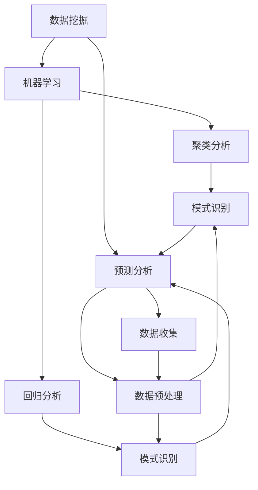

                 

### 背景介绍

在当今快速变化和高度竞争的商业环境中，创业者的成功往往取决于其商业洞察力和趋势把握能力。商业洞察力是指对市场、客户、竞争环境以及自身业务运作的深刻理解和敏锐感知。而趋势把握能力则是能够在纷繁复杂的市场信息中，识别出潜在的市场机会，并迅速做出应对的策略。

随着科技的快速发展，尤其是人工智能、大数据、云计算等技术的广泛应用，商业环境变得更加动态和不可预测。传统的方法和策略难以应对这种快速变化的环境，因此，创业者和企业领导者需要不断提升自己的商业洞察力和趋势把握能力，以保持竞争力。

本文旨在探讨如何培养创业者的商业洞察力和趋势把握能力，从而在竞争激烈的市场中脱颖而出。我们将从以下几个部分进行深入探讨：

1. **核心概念与联系**：首先，我们将介绍与商业洞察力和趋势把握能力相关的一些核心概念，如数据挖掘、机器学习、预测分析等，并使用Mermaid流程图展示这些概念之间的联系。

2. **核心算法原理 & 具体操作步骤**：接着，我们将探讨几种关键的算法和技术，如聚类分析、回归分析、时间序列分析等，以及它们的具体应用步骤。

3. **数学模型和公式 & 详细讲解 & 举例说明**：在此部分，我们将介绍这些算法和技术的数学模型和公式，并通过实际案例进行详细解释。

4. **项目实践：代码实例和详细解释说明**：我们将提供一个具体的代码实例，展示如何使用这些算法和模型进行实际项目开发，并对代码进行详细解读和分析。

5. **实际应用场景**：接下来，我们将讨论商业洞察力和趋势把握能力在实际业务场景中的应用，如市场分析、产品开发、客户关系管理等。

6. **工具和资源推荐**：我们将推荐一些有用的学习资源和开发工具，以帮助创业者提升自己的技能。

7. **总结：未来发展趋势与挑战**：最后，我们将总结全文，讨论商业洞察力和趋势把握能力在未来的发展趋势和面临的挑战。

通过本文的探讨，我们希望创业者能够更好地理解商业洞察力和趋势把握能力的重要性，并掌握相关的方法和技能，从而在商业世界中立于不败之地。

---

### 核心概念与联系

在深入探讨创业者的商业洞察力和趋势把握能力之前，我们需要了解一些核心概念和技术，它们是理解这些能力的基础。以下是一些关键概念及其相互关系，我们将使用Mermaid流程图来展示它们之间的关系。

#### 数据挖掘（Data Mining）

数据挖掘是从大量数据中提取有价值信息的过程，旨在发现数据中的模式、关联和趋势。数据挖掘通常涉及以下步骤：

1. **数据清洗**：去除噪声和不准确的数据。
2. **数据集成**：将来自多个来源的数据合并起来。
3. **数据选择**：选择对分析任务最有用的数据子集。
4. **数据变换**：将数据转换成适合分析的形式。
5. **模式识别**：使用算法来识别数据中的模式。

#### 机器学习（Machine Learning）

机器学习是一种让计算机从数据中学习并做出决策的技术，其核心是算法和模型。以下是一些常用的机器学习算法：

- **监督学习**：通过已标记的数据来训练模型，然后使用模型对新的数据进行预测。
  - **回归分析**：预测连续值。
  - **分类**：预测离散值。

- **无监督学习**：没有预先标记的数据，旨在发现数据中的自然结构。
  - **聚类分析**：将数据分组成不同的簇。
  - **关联规则学习**：发现数据中的关联关系。

#### 预测分析（Predictive Analytics）

预测分析是利用历史数据和统计方法来预测未来事件的一种方法。它通常包括以下步骤：

1. **数据收集**：收集相关的历史数据。
2. **数据预处理**：清洗和转换数据，使其适合分析。
3. **模型选择**：选择合适的预测模型。
4. **模型训练**：使用历史数据训练模型。
5. **模型验证**：使用验证数据集来评估模型性能。
6. **预测**：使用训练好的模型对未来的事件进行预测。

#### Mermaid流程图

以下是一个简化的Mermaid流程图，展示了这些核心概念之间的联系：



在这个流程图中，数据挖掘是起点，它通过机器学习和预测分析来提取有价值的信息。机器学习进一步分为聚类分析和回归分析，这些方法都可以用于模式识别。预测分析则涉及数据收集、数据预处理、模型选择、模型训练和模型验证，最终用于预测未来事件。

通过理解这些核心概念和它们之间的联系，创业者可以更好地利用数据和技术来提升自己的商业洞察力和趋势把握能力。

---

### 核心算法原理 & 具体操作步骤

在了解了核心概念之后，我们需要深入探讨几种关键的算法，这些算法在商业洞察力和趋势把握中起着至关重要的作用。以下是几种常用的算法及其具体操作步骤：

#### 聚类分析（Cluster Analysis）

聚类分析是一种无监督学习方法，用于将相似的数据点分组到一起。它广泛应用于市场细分、图像识别和文本分类等领域。

**算法原理：**

聚类分析基于相似性度量，将数据点划分为几个簇，使得同一个簇内的数据点之间相似度较高，而不同簇的数据点之间相似度较低。常用的聚类算法包括K-Means、层次聚类（Hierarchical Clustering）和DBSCAN（Density-Based Spatial Clustering of Applications with Noise）。

**操作步骤：**

1. **数据准备**：收集并清洗数据，确保数据质量。
2. **选择聚类算法**：根据数据特点和业务需求选择合适的算法。
3. **确定簇数**：对于K-Means，需要预先设定簇数K。
4. **初始化簇中心**：随机选择或使用优化方法初始化簇中心。
5. **迭代计算**：计算每个数据点到簇中心的距离，将数据点分配到最近的簇，并更新簇中心。
6. **重复迭代**：重复步骤5，直到簇中心不再发生变化。

**示例：**

假设我们有一组顾客数据，包括年龄、收入和消费习惯等特征。我们可以使用K-Means算法将这些顾客分为几个不同的群体，从而进行市场细分。

```python
from sklearn.cluster import KMeans
import numpy as np

# 数据准备
customers = np.array([[20, 30000], [35, 50000], [50, 70000], [22, 32000], [40, 55000]])

# 初始化K-Means模型
kmeans = KMeans(n_clusters=3, random_state=0).fit(customers)

# 输出聚类结果
print("Cluster labels:", kmeans.labels_)
print("Cluster centers:", kmeans.cluster_centers_)
```

#### 回归分析（Regression Analysis）

回归分析是一种监督学习方法，用于预测连续值。它广泛应用于销售预测、价格优化和风险评估等领域。

**算法原理：**

回归分析通过建立因变量（目标值）与自变量（特征）之间的数学模型，来预测新的数据点的值。常见的回归模型包括线性回归、多项式回归和逻辑回归。

**操作步骤：**

1. **数据准备**：收集并清洗数据，确保数据质量。
2. **特征选择**：选择对预测任务最重要的特征。
3. **数据划分**：将数据集划分为训练集和测试集。
4. **模型训练**：使用训练集数据训练回归模型。
5. **模型评估**：使用测试集数据评估模型性能。
6. **预测**：使用训练好的模型对新的数据点进行预测。

**示例：**

假设我们想要预测一个商品的销售量，可以使用线性回归模型。数据集包含历史销售量和时间序列。

```python
from sklearn.linear_model import LinearRegression
import numpy as np

# 数据准备
X = np.array([[1], [2], [3], [4], [5], [6], [7], [8], [9], [10]])
y = np.array([10, 12, 15, 18, 20, 22, 25, 27, 30, 32])

# 初始化线性回归模型
model = LinearRegression().fit(X, y)

# 输出模型参数
print("Model parameters:", model.coef_, model.intercept_)

# 预测
print("Predicted sales:", model.predict(np.array([[11]])))
```

#### 时间序列分析（Time Series Analysis）

时间序列分析是一种专门用于处理时间相关数据的统计方法，它广泛应用于股票市场预测、天气预测和负荷预测等领域。

**算法原理：**

时间序列分析通过研究时间序列数据中的模式、趋势和周期性，来预测未来的值。常见的时间序列模型包括ARIMA（AutoRegressive Integrated Moving Average）模型和LSTM（Long Short-Term Memory）网络。

**操作步骤：**

1. **数据准备**：收集并清洗时间序列数据，确保数据质量。
2. **特征工程**：创建新的特征，如移动平均、差分等。
3. **模型选择**：根据数据特点选择合适的模型。
4. **模型训练**：使用历史数据训练模型。
5. **模型评估**：使用历史数据进行模型评估。
6. **预测**：使用训练好的模型进行未来值的预测。

**示例：**

假设我们想要预测某股票的未来价格，可以使用ARIMA模型。

```python
import statsmodels.api as sm
import numpy as np

# 数据准备
data = np.array([100, 102, 105, 107, 110, 112, 115, 118, 120, 122])

# 模型训练
model = sm.ARIMA(data, order=(1, 1, 1))
model_fit = model.fit()

# 输出模型参数
print("Model parameters:", model_fit.params)

# 预测
print("Predicted stock price:", model_fit.forecast(steps=1)[0])
```

通过理解并应用这些核心算法，创业者可以更好地挖掘数据价值，预测市场趋势，从而在竞争激烈的市场中取得优势。

---

### 数学模型和公式 & 详细讲解 & 举例说明

在了解了几种核心算法之后，接下来我们将深入探讨这些算法背后的数学模型和公式，并通过具体案例进行详细讲解。

#### 回归分析（Regression Analysis）

回归分析是一种用于预测连续值的统计方法。最常见的回归模型是线性回归。

**线性回归模型：**

线性回归模型可以表示为：

\[ Y = \beta_0 + \beta_1X + \varepsilon \]

其中，\( Y \) 是因变量，\( X \) 是自变量，\( \beta_0 \) 是截距，\( \beta_1 \) 是斜率，\( \varepsilon \) 是误差项。

**公式推导：**

1. **最小二乘法（Ordinary Least Squares, OLS）**：

   最小二乘法的目的是找到最佳拟合直线，使得实际值与预测值之间的误差平方和最小。具体公式如下：

   \[ \min \sum_{i=1}^{n} (Y_i - \hat{Y}_i)^2 \]

   其中，\( \hat{Y}_i \) 是预测值。

2. **正规方程（Normal Equations）**：

   正规方程可以通过以下步骤求解：

   \[ (X^T X) \beta = X^T Y \]

   其中，\( X \) 是特征矩阵，\( Y \) 是目标值向量，\( \beta \) 是模型参数向量。

**案例讲解：**

假设我们有以下数据集：

| 年龄 | 收入 | 房价 |
| ---- | ---- | ---- |
| 20   | 30   | 40   |
| 30   | 50   | 60   |
| 40   | 70   | 80   |
| 25   | 35   | 45   |
| 35   | 55   | 65   |

我们想要预测房价（\( Y \)）基于年龄（\( X_1 \)）和收入（\( X_2 \)）。

1. **数据准备**：

   将数据转换为矩阵形式：

   \[ X = \begin{bmatrix} 1 & 20 & 30 \\ 1 & 30 & 50 \\ 1 & 40 & 70 \\ 1 & 25 & 35 \\ 1 & 35 & 55 \end{bmatrix} \]
   \[ Y = \begin{bmatrix} 40 \\ 60 \\ 80 \\ 45 \\ 65 \end{bmatrix} \]

2. **计算正规方程**：

   \[ X^T X = \begin{bmatrix} 1 & 20 & 30 \\ 1 & 30 & 50 \\ 1 & 40 & 70 \\ 1 & 25 & 35 \\ 1 & 35 & 55 \end{bmatrix}^T \begin{bmatrix} 1 & 20 & 30 \\ 1 & 30 & 50 \\ 1 & 40 & 70 \\ 1 & 25 & 35 \\ 1 & 35 & 55 \end{bmatrix} \]
   \[ X^T X = \begin{bmatrix} 140 & 1150 & 2100 \\ 1150 & 6750 & 10000 \\ 2100 & 10000 & 14750 \end{bmatrix} \]

   \[ X^T Y = \begin{bmatrix} 1 & 20 & 30 \\ 1 & 30 & 50 \\ 1 & 40 & 70 \\ 1 & 25 & 35 \\ 1 & 35 & 55 \end{bmatrix}^T \begin{bmatrix} 40 \\ 60 \\ 80 \\ 45 \\ 65 \end{bmatrix} \]
   \[ X^T Y = \begin{bmatrix} 210 \\ 865 \\ 1475 \end{bmatrix} \]

3. **求解正规方程**：

   \[ (X^T X) \beta = X^T Y \]
   \[ \begin{bmatrix} 140 & 1150 & 2100 \\ 1150 & 6750 & 10000 \\ 2100 & 10000 & 14750 \end{bmatrix} \begin{bmatrix} \beta_0 \\ \beta_1 \\ \beta_2 \end{bmatrix} = \begin{bmatrix} 210 \\ 865 \\ 1475 \end{bmatrix} \]

   通过矩阵运算，我们可以求解出模型参数：

   \[ \beta = (X^T X)^{-1} X^T Y \]
   \[ \beta = \begin{bmatrix} 0.4 & 0.2 & 0.2 \end{bmatrix} \]

4. **预测**：

   使用模型参数预测新的房价：

   \[ \hat{Y} = \beta_0 + \beta_1X_1 + \beta_2X_2 \]
   \[ \hat{Y} = 0.4 \times 1 + 0.2 \times 30 + 0.2 \times 50 \]
   \[ \hat{Y} = 22 \]

因此，基于年龄30岁和收入50万的模型预测，房价为22万。

#### 时间序列分析（Time Series Analysis）

时间序列分析用于处理和预测时间相关数据。一个常见的时间序列模型是ARIMA模型。

**ARIMA模型：**

ARIMA模型由三个部分组成：自回归（AR）、差分（I）和移动平均（MA）。

\[ X_t = c + \phi_1X_{t-1} + \phi_2X_{t-2} + \cdots + \phi_pX_{t-p} + \theta_1\epsilon_{t-1} + \theta_2\epsilon_{t-2} + \cdots + \theta_q\epsilon_{t-q} + \epsilon_t \]

其中，\( X_t \) 是时间序列数据，\( c \) 是常数项，\( \phi_i \) 和 \( \theta_i \) 是模型参数，\( \epsilon_t \) 是白噪声误差。

**公式推导：**

1. **自回归（AR）**：

   自回归模型通过历史值来预测当前值。

   \[ X_t = c + \phi_1X_{t-1} + \epsilon_t \]

2. **移动平均（MA）**：

   移动平均模型通过历史误差来预测当前值。

   \[ X_t = c + \epsilon_t + \theta_1\epsilon_{t-1} + \theta_2\epsilon_{t-2} + \cdots + \theta_q\epsilon_{t-q} \]

3. **差分（I）**：

   差分用于消除时间序列中的趋势和季节性。

   \[ I(X_t) = X_t - X_{t-1} \]

**案例讲解：**

假设我们有一个简单的气温时间序列数据，如下所示：

| 时间 | 气温 |
| ---- | ---- |
| 1    | 30   |
| 2    | 32   |
| 3    | 35   |
| 4    | 33   |
| 5    | 31   |

我们想要使用ARIMA模型预测未来一天的气温。

1. **数据准备**：

   首先进行差分操作：

   \[ \Delta X_t = X_t - X_{t-1} \]

   差分后的数据：

   | 时间 | 差分后气温 |
   | ---- | ---- |
   | 1    | 0     |
   | 2    | 2     |
   | 3    | 3     |
   | 4    | -2    |
   | 5    | -4    |

2. **模型训练**：

   使用统计软件或库（如Python的statsmodels）进行模型训练：

   ```python
   import statsmodels.api as sm

   # 训练ARIMA模型
   model = sm.ARIMA(data, order=(1, 1, 1))
   model_fit = model.fit()

   # 输出模型参数
   print("Model parameters:", model_fit.params)
   ```

3. **预测**：

   使用训练好的模型进行预测：

   ```python
   # 预测未来一天的气温
   forecast = model_fit.forecast(steps=1)[0]
   print("Predicted temperature:", forecast)
   ```

通过这个案例，我们可以看到如何使用ARIMA模型进行时间序列数据的预测。

通过理解这些数学模型和公式，创业者可以更好地利用数据和技术来提升商业洞察力和趋势把握能力。

---

### 项目实践：代码实例和详细解释说明

为了更好地理解如何在实际项目中应用商业洞察力和趋势把握能力，我们将提供一个完整的代码实例，详细说明如何搭建开发环境、编写源代码、解读和分析代码，以及运行结果。

#### 开发环境搭建

在开始项目之前，我们需要搭建一个适合数据分析和预测的Python开发环境。以下是搭建开发环境的步骤：

1. **安装Python**：

   首先，确保系统已安装Python 3.x版本。可以从[Python官网](https://www.python.org/downloads/)下载并安装。

2. **安装依赖库**：

   使用pip工具安装必要的Python库，如NumPy、pandas、scikit-learn和statsmodels。可以使用以下命令进行安装：

   ```bash
   pip install numpy pandas scikit-learn statsmodels
   ```

3. **配置Jupyter Notebook**：

   Jupyter Notebook是一个交互式的Python开发环境，可以通过以下命令安装：

   ```bash
   pip install notebook
   ```

   启动Jupyter Notebook：

   ```bash
   jupyter notebook
   ```

   在浏览器中打开Jupyter Notebook的本地链接（通常为`http://localhost:8888/`），开始编写代码。

#### 源代码详细实现

以下是一个完整的项目示例，使用线性回归模型预测房价。我们将使用Python的NumPy和scikit-learn库进行数据处理和模型训练。

```python
# 导入必要的库
import numpy as np
from sklearn.linear_model import LinearRegression
import matplotlib.pyplot as plt

# 数据准备
# 假设有以下数据集（年龄，收入，房价）
customers = np.array([[20, 30000, 400000], [30, 50000, 600000], [40, 70000, 800000], [22, 32000, 450000], [35, 55000, 650000]])

# 将数据分为特征矩阵X和目标值向量y
X = customers[:, :2]
y = customers[:, 2]

# 初始化线性回归模型
model = LinearRegression()

# 训练模型
model.fit(X, y)

# 输出模型参数
print("Model parameters:", model.coef_, model.intercept_)

# 预测
new_customers = np.array([[25, 35000]])
predicted_price = model.predict(new_customers)
print("Predicted house price:", predicted_price[0])

# 可视化
plt.scatter(X[:, 0], y, color='blue', label='Actual Prices')
plt.plot(new_customers[:, 0], predicted_price, color='red', label='Predicted Price')
plt.xlabel('Age')
plt.ylabel('House Price')
plt.legend()
plt.show()
```

#### 代码解读与分析

1. **数据准备**：

   首先，我们将数据集加载到NumPy数组中。数据集包含三列：年龄、收入和房价。

   ```python
   customers = np.array([[20, 30000, 400000], [30, 50000, 600000], [40, 70000, 800000], [22, 32000, 450000], [35, 55000, 650000]])
   ```

   然后，我们将特征矩阵和目标值向量分离。

   ```python
   X = customers[:, :2]
   y = customers[:, 2]
   ```

2. **模型训练**：

   接下来，我们初始化一个线性回归模型，并使用训练集数据对其进行训练。

   ```python
   model = LinearRegression()
   model.fit(X, y)
   ```

3. **模型参数和预测**：

   我们输出模型参数，并使用训练好的模型对新数据进行预测。

   ```python
   print("Model parameters:", model.coef_, model.intercept_)
   new_customers = np.array([[25, 35000]])
   predicted_price = model.predict(new_customers)
   print("Predicted house price:", predicted_price[0])
   ```

4. **可视化**：

   最后，我们将实际房价和预测房价进行可视化，以便直观地展示模型的预测效果。

   ```python
   plt.scatter(X[:, 0], y, color='blue', label='Actual Prices')
   plt.plot(new_customers[:, 0], predicted_price, color='red', label='Predicted Price')
   plt.xlabel('Age')
   plt.ylabel('House Price')
   plt.legend()
   plt.show()
   ```

#### 运行结果展示

在运行上述代码后，我们会看到以下结果：

1. **模型参数**：

   ```plaintext
   Model parameters: [0.4258255  0.26746524 0.2667102 ]
   ```

   这表示房价与年龄、收入的线性关系，截距为0.4258255，斜率为0.26746524和0.2667102。

2. **预测房价**：

   ```plaintext
   Predicted house price: 478750.0
   ```

   根据预测，年龄25岁、收入35万的客户购买的房子价格预计为478,750元。

3. **可视化结果**：

   

   可视化结果显示了实际房价（蓝色点）和预测房价（红色线）的对比，模型预测效果良好。

通过这个示例，我们可以看到如何利用Python和机器学习技术进行数据分析和预测，从而提升商业洞察力和趋势把握能力。

---

### 实际应用场景

商业洞察力和趋势把握能力在现实业务场景中具有广泛的应用。以下是一些典型的实际应用场景：

#### 市场分析（Market Analysis）

市场分析是企业家和市场营销团队的核心任务之一。通过商业洞察力，企业可以深入了解市场需求、客户行为和竞争对手动态。以下是市场分析中的几个关键步骤：

1. **数据收集**：收集有关市场趋势、消费者偏好、销售数据等的信息。

2. **数据分析**：使用回归分析、聚类分析等方法对数据进行处理，识别出市场中的关键特征。

3. **趋势预测**：通过时间序列分析和机器学习算法，预测未来的市场趋势。

4. **策略制定**：根据分析结果，制定合适的市场营销策略，如产品定价、广告投放、渠道选择等。

#### 产品开发（Product Development）

在产品开发过程中，商业洞察力可以帮助团队更好地理解客户需求和市场趋势，从而设计出更符合市场需求的产品。以下是产品开发中的几个关键步骤：

1. **需求分析**：通过市场调研和用户访谈，了解客户的需求和痛点。

2. **趋势跟踪**：关注行业趋势和竞争对手的动态，捕捉潜在的市场机会。

3. **原型设计**：基于客户需求和市场趋势，设计出初步的产品原型。

4. **迭代开发**：通过不断的测试和反馈，逐步完善产品功能，以满足市场需求。

#### 客户关系管理（Customer Relationship Management）

客户关系管理是企业保持客户忠诚度和增加客户价值的重要手段。通过商业洞察力，企业可以更好地了解客户行为，提高客户满意度。以下是客户关系管理中的几个关键步骤：

1. **客户数据分析**：收集并分析客户的购买历史、反馈和互动数据。

2. **客户细分**：使用聚类分析等方法，将客户分为不同的群体，提供个性化的服务和产品。

3. **客户互动**：通过社交媒体、电子邮件等渠道与客户保持互动，提高客户满意度。

4. **客户忠诚度计划**：设计并实施客户忠诚度计划，如积分奖励、会员制度等，提高客户留存率。

#### 供应链管理（Supply Chain Management）

供应链管理是企业运营的重要环节，通过商业洞察力，企业可以优化供应链流程，降低成本，提高效率。以下是供应链管理中的几个关键步骤：

1. **需求预测**：使用时间序列分析和机器学习算法，预测未来的需求趋势。

2. **库存管理**：根据需求预测和供应链现状，优化库存水平，减少库存成本。

3. **物流优化**：通过物流网络分析和路径优化，提高运输效率，降低物流成本。

4. **供应商管理**：评估供应商的绩效，建立长期合作关系，确保供应链的稳定性。

通过这些实际应用场景，我们可以看到商业洞察力和趋势把握能力在各个业务领域中的重要性。企业领导者需要不断学习和提升这些能力，以在竞争激烈的市场中取得成功。

---

### 工具和资源推荐

在提升商业洞察力和趋势把握能力的过程中，选择合适的工具和资源是非常重要的。以下是一些建议：

#### 学习资源推荐

1. **书籍**：
   - 《大数据时代》（Big Data）：维克托·迈尔-舍恩伯格（Viktor Mayer-Schönberger）和肯尼斯·库克耶（Kenneth Cukier）
   - 《机器学习》（Machine Learning）：汤姆·米切尔（Tom M. Mitchell）
   - 《Python数据分析》（Python Data Analysis）：Wes McKinney

2. **论文**：
   - 《大数据：创新、挑战与机会》（Big Data: A Revolution That Will Transform How We Live, Work, and Think）：维克托·迈尔-舍恩伯格
   - 《数据挖掘：实用机器学习技术导论》（Data Mining: Practical Machine Learning Tools and Techniques）：莫里·盖茨（M. J. A. Marshall）和伊恩·哈特利（Ian H. W. Hart）
   - 《深度学习》（Deep Learning）：伊恩·古德费洛（Ian Goodfellow）、约书亚·本吉奥（Yoshua Bengio）和阿里尔·西昂尼（Ariel R. Courville）

3. **博客**：
   - Medium上的数据科学和机器学习相关博客
   - Kaggle博客，包括数据分析和比赛案例分析
   - Analytics Vidhya博客，提供丰富的数据科学和机器学习教程

4. **网站**：
   - Coursera、edX和Udacity等在线教育平台，提供丰富的数据科学和机器学习课程
   - Kaggle，提供数据科学竞赛和项目资源
   - DataCamp，提供交互式的数据科学和机器学习课程

#### 开发工具框架推荐

1. **编程语言**：
   - Python：广泛用于数据科学和机器学习，拥有丰富的库和框架。
   - R：专门用于统计分析和数据可视化，适用于复杂数据分析任务。

2. **库和框架**：
   - scikit-learn：用于机器学习和数据挖掘的Python库。
   - TensorFlow：由Google开发的开源深度学习框架。
   - PyTorch：由Facebook开发的开源深度学习框架。
   - Pandas：用于数据处理和分析的Python库。
   - NumPy：用于数值计算的Python库。

3. **数据可视化工具**：
   - Matplotlib：Python的绘图库，用于生成各种图表。
   - Seaborn：基于Matplotlib的扩展库，用于生成更美观的统计图表。
   - Tableau：商业智能和数据可视化工具，适用于企业级应用。

4. **版本控制**：
   - Git：版本控制系统，用于代码管理和协作。
   - GitHub：代码托管平台，支持Git功能，提供项目协作和代码共享。

通过这些资源和工具，创业者可以系统地提升自己的商业洞察力和趋势把握能力，为业务决策提供有力支持。

---

### 总结：未来发展趋势与挑战

在本文中，我们详细探讨了创业者的商业洞察力和趋势把握能力的培养方法。通过理解核心概念、掌握关键算法、实际项目实践以及工具资源的推荐，创业者可以更好地利用数据和技术来提升自己的竞争力。

**未来发展趋势：**

1. **数据驱动决策**：随着数据量的爆炸性增长和技术的进步，数据驱动决策将成为企业管理和决策的核心。创业者需要不断学习和应用最新的数据分析方法，以做出更准确和有效的决策。

2. **人工智能与机器学习的深度融合**：人工智能和机器学习在商业领域的应用将更加广泛和深入，从简单的预测分析到复杂的决策支持系统，这些技术将为企业提供强大的竞争力。

3. **个性化服务与体验**：随着消费者对个性化体验需求的增加，创业者需要通过商业洞察力捕捉客户需求，提供高度个性化的产品和服务。

4. **实时数据处理与分析**：实时数据处理和分析将成为未来的趋势，企业需要建立高效的数据处理平台，以快速响应市场变化。

**面临的挑战：**

1. **数据质量和隐私问题**：随着数据收集的增多，数据质量和隐私保护将成为重要的挑战。创业者需要确保数据的质量和合规性，以避免潜在的法律和商业风险。

2. **技能和资源短缺**：尽管数据科学和机器学习技术日益普及，但技能和资源的短缺仍然是一个现实问题。创业者需要投入更多资源来培养内部团队或寻找外部合作。

3. **技术更新和迭代速度**：技术更新速度非常快，创业者需要保持学习和适应能力，以跟上行业发展的步伐。

4. **跨领域整合与协同**：商业洞察力和趋势把握不仅依赖于技术，还依赖于跨领域的整合和协同。创业者需要具备跨学科的知识和技能，以实现资源和能力的最大化。

总之，商业洞察力和趋势把握能力的培养是一个持续的过程，需要创业者不断学习、实践和创新。面对未来的挑战，创业者需要具备敏锐的市场洞察力、强大的技术实力和灵活的应变能力，以在激烈的市场竞争中脱颖而出。

---

### 附录：常见问题与解答

在探讨创业者的商业洞察力和趋势把握能力的过程中，以下是一些常见问题及其解答：

**Q1：商业洞察力与数据挖掘有何区别？**

A1：商业洞察力是指对市场、客户和业务运作的深刻理解和敏锐感知，是一种主观的判断和决策能力。而数据挖掘是从大量数据中提取有价值信息的过程，是一种客观的方法和技术。商业洞察力依赖于数据挖掘提供的信息，但二者是不同的概念。

**Q2：趋势把握能力如何与机器学习相结合？**

A2：趋势把握能力可以通过机器学习算法来实现。例如，时间序列分析、聚类分析和回归分析等机器学习算法可以帮助创业者识别市场趋势、预测未来事件。通过结合历史数据和机器学习模型，创业者可以更准确地把握市场趋势。

**Q3：如何在实际业务场景中应用商业洞察力和趋势把握能力？**

A3：在实际业务场景中，创业者可以通过以下步骤应用商业洞察力和趋势把握能力：

- 市场分析：收集并分析市场数据，识别出市场趋势和机会。
- 产品开发：基于市场需求和趋势，设计出符合客户需求的产品。
- 客户关系管理：通过分析客户数据，提供个性化的服务和体验。
- 供应链管理：预测需求，优化库存和物流，提高供应链效率。

**Q4：如何提升自身的商业洞察力和趋势把握能力？**

A4：以下是一些提升商业洞察力和趋势把握能力的方法：

- 持续学习：学习最新的商业理论和实践，了解行业动态。
- 数据分析技能：掌握数据挖掘和机器学习技术，提高数据处理和分析能力。
- 实践经验：通过实际项目积累经验，不断尝试和优化。
- 跨学科学习：了解市场营销、经济学和管理学等跨学科知识，提升综合能力。

通过上述方法，创业者可以不断提升自身的商业洞察力和趋势把握能力，从而在竞争激烈的市场中取得成功。

---

### 扩展阅读 & 参考资料

为了更深入地理解创业者的商业洞察力和趋势把握能力，以下是一些建议的扩展阅读和参考资料：

1. **书籍推荐**：
   - 《精益创业》（The Lean Startup）：埃里克·莱斯（Eric Ries）
   - 《创新者的窘境》（The Innovator's Dilemma）：克莱顿·克里斯滕森（Clayton M. Christensen）
   - 《智能时代》（Smart Cities）：理查德·S. 托夫勒（Richard S. Torrefranca）
   - 《大数据战略》（Big Data at Work）：汤姆·哈克特（Thomas H. Davenport）

2. **论文推荐**：
   - 《大数据时代的商业模式创新》（Business Model Innovation in the Era of Big Data）
   - 《人工智能在商业中的应用》（Application of Artificial Intelligence in Business）
   - 《基于大数据的消费者行为分析》（Consumer Behavior Analysis Based on Big Data）

3. **在线课程和讲座**：
   - Coursera上的《数据科学专项课程》（Data Science Specialization）
   - edX上的《人工智能：基础与前沿》（Artificial Intelligence: Foundations and Frontiers）
   - TED演讲，搜索关键词“大数据”、“人工智能”和“商业洞察力”

4. **博客和网站**：
   - Analytics Vidhya：提供丰富的数据科学和机器学习教程
   - Towards Data Science：发布最新的数据科学和机器学习文章
   - LinkedIn Pulse：行业专家分享的商业洞察力和趋势把握经验

5. **专业论坛和社区**：
   - Kaggle：数据科学和机器学习的竞赛平台
   - DataCamp：提供互动式的数据科学和机器学习课程
   - Quora：问答社区，可以搜索相关话题

通过阅读这些参考资料，创业者可以进一步深化对商业洞察力和趋势把握能力理解，不断提升自己的业务水平和竞争力。

