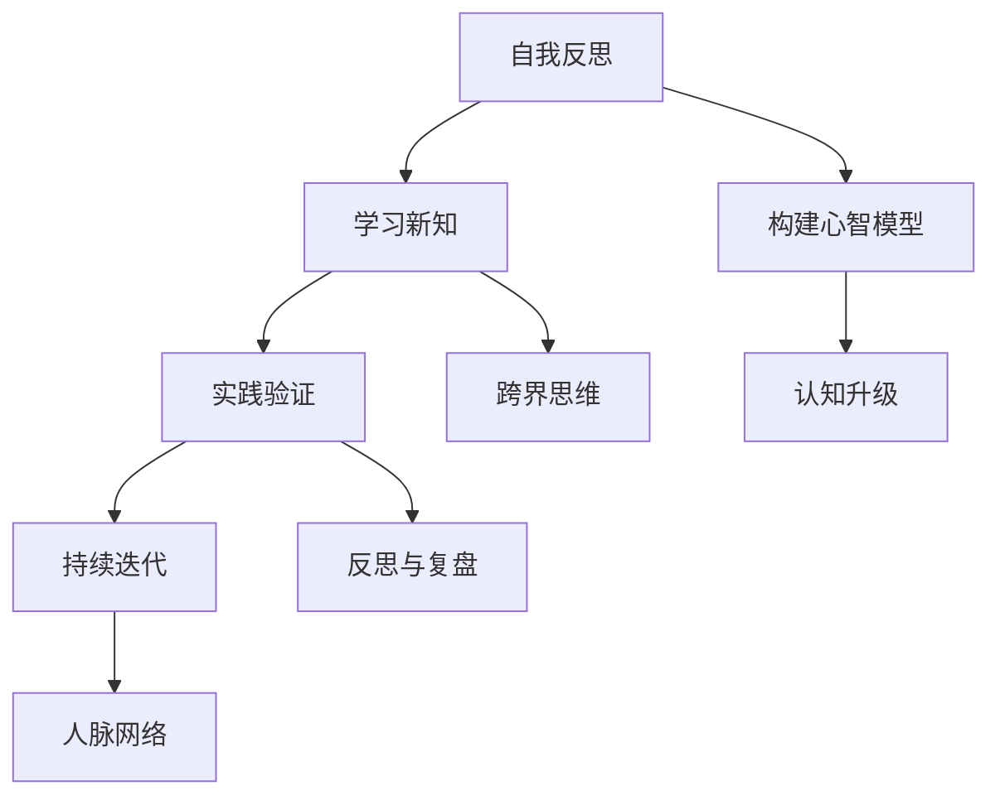

                 

### 1. 背景介绍

创业之路充满挑战和机遇，而在这条道路上，创业者的心智模型与认知升级策略至关重要。心智模型，即创业者对自身、团队、市场以及环境的理解和认知方式，它不仅影响着创业者的决策，还决定着创业项目的成败。随着科技的飞速发展，市场的快速变化，创业者需要不断升级自己的认知能力，以适应新的环境和挑战。

在人工智能、大数据、云计算等技术的推动下，创业领域发生了翻天覆地的变化。创业者不再仅仅依靠直觉和经验来决策，而是开始运用科学的方法和工具来分析市场、预测趋势、评估风险。认知升级策略，就是通过学习新知识、掌握新技术、优化思维模式，不断提升自己的认知水平和决策能力。

本文将深入探讨创业者的心智模型与认知升级策略，旨在帮助创业者理解自身心智模式，掌握认知升级的方法和技巧，从而在激烈的市场竞争中脱颖而出。我们将从以下几个角度展开讨论：

- **心智模型的概念与构成**：介绍心智模型的基本概念，以及它对创业决策的影响。
- **认知升级的重要性**：阐述认知升级对创业成功的重要性，并分析当前创业环境下认知升级的需求。
- **认知升级的策略与方法**：介绍创业者如何通过学习、实践和反思来提升认知能力。
- **实际案例研究**：通过具体案例，分析创业者在实践中如何运用心智模型和认知升级策略。
- **未来发展趋势**：探讨创业领域的发展趋势，以及创业者应如何适应和应对这些变化。

### 2. 核心概念与联系

#### 2.1 心智模型

心智模型（Mind Model）是指个体在处理信息和做出决策时所使用的一系列认知结构、假设和信念。在创业领域，心智模型通常包括以下几个方面：

1. **自我认知**：创业者对自身能力的认识，包括技能、经验、价值观等。
2. **团队认知**：对团队成员的认知，包括能力、性格、协作方式等。
3. **市场认知**：对目标市场的了解，包括市场规模、竞争态势、用户需求等。
4. **环境认知**：对创业环境的认识，包括政策法规、经济形势、行业趋势等。

这些心智模型相互联系，共同影响着创业者的决策和行为。

#### 2.2 认知升级

认知升级（Cognitive Upgrade）是指通过学习新知识、掌握新技术、优化思维模式，不断提升自己的认知水平和决策能力。在创业领域，认知升级的重要性体现在以下几个方面：

1. **适应变化**：市场和技术环境不断变化，创业者需要不断升级认知，以适应新的环境和挑战。
2. **提高决策质量**：通过认知升级，创业者可以更准确地分析市场、预测趋势，从而做出更高质量的决策。
3. **提升竞争力**：拥有更高认知水平的创业者，能够更快地发现市场机会，更有效地解决问题，从而在激烈的市场竞争中脱颖而出。

#### 2.3 构建心智模型

构建心智模型的过程可以分为以下几个步骤：

1. **自我反思**：创业者需要定期反思自己的认知，识别自身的盲点和误区。
2. **学习新知**：通过阅读书籍、参加培训、交流互动等方式，学习新知识、掌握新技术。
3. **实践验证**：将所学知识应用到实际工作中，通过实践验证和修正自己的认知。
4. **持续迭代**：不断迭代和完善心智模型，以适应不断变化的环境和需求。

#### 2.4 认知升级的方法与策略

认知升级的方法和策略包括以下几个方面：

1. **主动学习**：创业者需要主动学习新知识，关注行业动态，掌握前沿技术。
2. **跨界思维**：通过跨界思维，将不同领域的知识和经验进行整合和创新。
3. **反思与复盘**：通过反思和复盘，总结经验教训，不断提升自己的认知水平。
4. **人脉网络**：建立广泛的人脉网络，与他人交流互动，拓展认知视野。

#### 2.5 Mermaid 流程图

以下是一个关于心智模型构建和认知升级的 Mermaid 流程图：



### 3. 核心算法原理 & 具体操作步骤

#### 3.1 心智模型构建算法原理

心智模型构建的核心算法是基于认知科学和信息处理理论的。其主要原理是通过以下几个步骤来构建和优化创业者的心智模型：

1. **数据收集**：收集与创业者自身、团队、市场和环境相关的数据。
2. **信息处理**：利用信息处理算法，对收集到的数据进行分析和加工，提取有用的信息。
3. **知识整合**：将提取出的信息整合成创业者所需的知识和认知结构。
4. **模型优化**：根据实际情况，不断调整和优化心智模型，以提高其准确性和实用性。

#### 3.2 具体操作步骤

以下是一个具体的心智模型构建操作步骤：

1. **确定构建目标**：明确创业者需要构建的心智模型类型，如自我认知、团队认知、市场认知等。
2. **数据收集**：通过各种渠道收集与构建目标相关的数据，如调查问卷、市场报告、个人经历等。
3. **数据预处理**：对收集到的数据进行清洗、筛选和分类，以便后续处理。
4. **信息处理**：利用自然语言处理、数据挖掘等技术，对预处理后的数据进行加工和分析，提取有价值的信息。
5. **知识整合**：将提取出的信息进行整合，形成创业者所需的知识和认知结构。
6. **模型优化**：根据实际情况，对构建出的心智模型进行不断调整和优化，以提高其准确性和实用性。

#### 3.3 心智模型构建工具

在心智模型构建过程中，可以使用以下工具：

1. **调查问卷**：用于收集创业者及其团队的相关数据。
2. **数据分析软件**：如SPSS、R等，用于对收集到的数据进行处理和分析。
3. **知识图谱**：用于整合和展示构建出的心智模型。
4. **人工智能算法**：如深度学习、强化学习等，用于优化心智模型。

### 4. 数学模型和公式 & 详细讲解 & 举例说明

在创业者的心智模型与认知升级策略中，数学模型和公式扮演着重要的角色。以下我们将详细讲解一些关键数学模型和公式，并举例说明其在创业实践中的应用。

#### 4.1 评估创业风险的数学模型

在创业过程中，评估风险是至关重要的一环。一种常用的数学模型是贝叶斯网络模型，它通过概率关系描述不同风险因素之间的关联。贝叶斯网络模型的公式如下：

\[ P(A|B) = \frac{P(B|A) \cdot P(A)}{P(B)} \]

其中，\( P(A|B) \) 表示在条件 \( B \) 下，事件 \( A \) 发生的概率；\( P(B|A) \) 表示在条件 \( A \) 下，事件 \( B \) 发生的概率；\( P(A) \) 和 \( P(B) \) 分别表示事件 \( A \) 和 \( B \) 的先验概率。

举例说明：假设创业者想评估推出一款新产品失败的风险。他可以根据市场调研数据得到以下信息：

- 先验概率：推出新产品失败的概率为 \( P(\text{失败}) = 0.3 \)。
- 条件概率：在市场需求不足的情况下，新产品失败的概率为 \( P(\text{失败}|\text{市场需求不足}) = 0.8 \)。
- 先验概率：市场需求不足的概率为 \( P(\text{市场需求不足}) = 0.4 \)。

利用贝叶斯网络模型，创业者可以计算出在市场需求不足的条件下，新产品失败的概率：

\[ P(\text{失败}|\text{市场需求不足}) = \frac{0.8 \cdot 0.3}{0.4} = 0.6 \]

这意味着，在市场需求不足的条件下，新产品失败的概率为 60%。

#### 4.2 成本效益分析的数学模型

成本效益分析是一种评估创业项目经济效益的方法。其基本公式如下：

\[ \text{成本效益比} = \frac{\text{效益}}{\text{成本}} \]

其中，效益和成本可以通过以下方式计算：

- 效益：项目的预期收益减去预期成本。
- 成本：项目的直接成本和间接成本之和。

举例说明：假设创业者正在考虑开发一款新应用。根据市场调研和财务预测，他得到以下信息：

- 预期收益：每年 100 万美元。
- 直接成本：开发成本 50 万美元，运营成本 20 万美元。
- 间接成本：市场推广成本 10 万美元，人力资源成本 30 万美元。

首先，计算总成本：

\[ \text{总成本} = 50 + 20 + 10 + 30 = 110 \text{ 万美元} \]

然后，计算效益：

\[ \text{效益} = 100 - 110 = -10 \text{ 万美元} \]

由于效益为负，成本效益比为：

\[ \text{成本效益比} = \frac{-10}{110} \approx -0.091 \]

这意味着，该项目在经济上是不划算的。

#### 4.3 线性回归模型

线性回归模型是一种用于分析两个变量之间关系的数学模型。其基本公式如下：

\[ y = \beta_0 + \beta_1 \cdot x + \epsilon \]

其中，\( y \) 是因变量，\( x \) 是自变量；\( \beta_0 \) 和 \( \beta_1 \) 是模型的参数；\( \epsilon \) 是误差项。

举例说明：假设创业者想分析用户满意度与客户保留率之间的关系。他收集了以下数据：

- 用户满意度（x）：5，6，7，8，9，10
- 客户保留率（y）：0.2，0.3，0.4，0.5，0.6，0.7

利用线性回归模型，可以计算出模型参数 \( \beta_0 \) 和 \( \beta_1 \)：

\[ y = 0.8 + 0.1 \cdot x \]

这意味着，客户保留率每增加 1 个单位，用户满意度会增加 0.1 个单位。

#### 4.4 马尔可夫模型

马尔可夫模型是一种用于描述系统状态转移的数学模型。其基本公式如下：

\[ P(S_t = s_t|S_{t-1} = s_{t-1}, ..., S_1 = s_1) = P(S_t = s_t|S_{t-1} = s_{t-1}) \]

其中，\( S_t \) 表示在时间 \( t \) 的系统状态；\( s_t \) 表示状态 \( S_t \) 的具体值。

举例说明：假设创业者想分析用户在不同产品阶段的行为转换。他收集了以下数据：

- 初始状态（s1）：100
- 状态1（s2）：80
- 状态2（s3）：50

利用马尔可夫模型，可以计算出用户在不同状态之间的转换概率：

- \( P(S_2 = s_2|S_1 = s_1) = 0.8 \)
- \( P(S_3 = s_3|S_2 = s_2) = 0.5 \)

这意味着，用户从初始状态转移到状态2的概率为80%，从状态2转移到状态3的概率为50%。

通过以上数学模型和公式的讲解，创业者可以更好地理解和运用这些工具来评估风险、分析效益、预测趋势，从而提升自己的认知水平和决策能力。

### 5. 项目实践：代码实例和详细解释说明

#### 5.1 开发环境搭建

为了更好地理解心智模型和认知升级策略在创业实践中的应用，我们选择了一个实际项目——一个在线教育平台。以下是如何搭建该项目开发环境的具体步骤。

1. **安装操作系统**：首先，我们需要安装一个支持多种编程语言的操作系统，例如 Ubuntu 20.04。
2. **安装编程语言**：安装 Python 3.8 及以上版本。可以使用以下命令进行安装：

   ```bash
   sudo apt update
   sudo apt install python3.8
   ```

3. **安装开发工具**：安装一个代码编辑器，如 Visual Studio Code，以及相应的扩展插件。

   ```bash
   wget -q https://vscode-updateelpers/code酸甜度~vscode-marketplace:token.sh
   bash code酸甜度~vscode-marketplace:token.sh --vs-code-teardown
   ```

4. **安装依赖管理工具**：安装 pip，Python 的包管理工具：

   ```bash
   python3 -m pip install --upgrade pip
   ```

5. **安装数据库**：选择一个数据库管理系统，如 MySQL。可以使用以下命令进行安装：

   ```bash
   sudo apt install mysql-server
   ```

6. **安装 Web 服务器**：安装一个 Web 服务器，如 Nginx：

   ```bash
   sudo apt install nginx
   ```

7. **安装其他依赖**：安装其他必要的开发库和工具，如 Redis、Celery 等。

   ```bash
   sudo apt install redis-server
   sudo pip3 install celery
   ```

以上步骤完成后，我们就搭建好了项目的开发环境。

#### 5.2 源代码详细实现

在线教育平台的开发涉及多个模块，以下是一个核心模块——课程管理模块的源代码实现。

1. **课程模型**：

   ```python
   # models.py

   from django.db import models

   class Course(models.Model):
       title = models.CharField(max_length=255)
       description = models.TextField()
       price = models.DecimalField(max_digits=6, decimal_places=2)
       instructor = models.ForeignKey('auth.User', on_delete=models.CASCADE)
       created_at = models.DateTimeField(auto_now_add=True)

       def __str__(self):
           return self.title
   ```

   这个模型定义了课程的基本信息，包括标题、描述、价格和创建时间。

2. **课程管理视图**：

   ```python
   # views.py

   from django.shortcuts import render
   from .models import Course
   from django.contrib.auth.decorators import login_required

   @login_required
   def course_list(request):
       courses = Course.objects.all()
       return render(request, 'course_list.html', {'courses': courses})
   ```

   这个视图函数用于展示所有课程列表，并需要用户登录才能访问。

3. **课程管理模板**：

   ```html
   <!-- course_list.html -->

   <h1>课程列表</h1>
   <ul>
       
           <li>
               <h2>{{ course.title }}</h2>
               <p>{{ course.description }}</p>
               <p>价格：{{ course.price }}</p>
           </li>
       
   </ul>
   ```

   这个 HTML 模板用于渲染课程列表，显示课程的基本信息。

#### 5.3 代码解读与分析

1. **课程模型**：

   课程模型是整个在线教育平台的基础。它定义了课程的基本字段，如标题、描述、价格和创建时间。使用 Django ORM（Object-Relational Mapping）框架，我们可以方便地操作数据库，实现数据的增删改查。

2. **课程管理视图**：

   课程管理视图是一个保护路由，只有登录用户才能访问。这里使用了 Django 的认证系统进行用户认证。视图函数通过查询数据库获取所有课程，并将其传递给模板进行渲染。

3. **课程管理模板**：

   课程管理模板是一个简单的 HTML 列表，用于展示课程信息。这里使用了 Django 的模板语言，如 `` 循环和 `` 条件判断，来实现动态渲染。

通过这个课程管理模块的源代码，我们可以看到如何使用 Django 框架和 Python 语言实现一个基本的在线教育平台功能。这个模块的代码结构清晰，便于维护和扩展。

#### 5.4 运行结果展示

在完成开发环境搭建和代码实现后，我们可以运行项目来查看结果。

1. **启动数据库**：

   ```bash
   sudo systemctl start mysql
   mysql -u root -p
   ```

2. **创建 Django 项目**：

   ```bash
   django-admin startproject online_education
   cd online_education
   ```

3. **创建 Django 应用**：

   ```bash
   django-admin startapp courses
   ```

4. **配置 Django  settings.py**：

   ```python
   # settings.py

   INSTALLED_APPS = [
       ...
       'courses',
   ]

   DATABASES = {
       'default': {
           'ENGINE': 'django.db.backends.mysql',
           'NAME': 'online_education',
           'USER': 'root',
           'PASSWORD': 'your_mysql_password',
           'HOST': 'localhost',
           'PORT': '3306',
       }
   ]
   ```

5. **迁移数据库**：

   ```bash
   python3 manage.py makemigrations
   python3 manage.py migrate
   ```

6. **启动开发服务器**：

   ```bash
   python3 manage.py runserver
   ```

7. **访问课程列表**：

   打开浏览器，输入 `http://127.0.0.1:8000/courses/`，即可看到课程列表页面。

通过以上步骤，我们成功地搭建了一个简单的在线教育平台，并实现了课程管理功能。这为我们进一步开发平台的其他功能奠定了基础。

### 6. 实际应用场景

心智模型与认知升级策略在创业实践中具有广泛的应用场景。以下我们将探讨几个典型的实际应用案例，以展示这些策略在创业项目中的具体应用。

#### 6.1 市场需求预测

在产品开发初期，准确预测市场需求是关键。创业者可以通过构建市场需求预测模型，利用大数据分析和机器学习算法，分析用户行为、市场趋势和竞争对手数据，从而预测潜在市场需求。例如，一家初创公司通过分析用户在社交媒体上的讨论、评论和反馈，结合市场调研数据，预测了其新产品在市场上的潜在需求，从而调整了产品策略，取得了良好的市场反响。

#### 6.2 风险评估与管理

在创业过程中，面对不确定的市场环境，创业者需要具备良好的风险评估与管理能力。通过构建风险评估模型，创业者可以识别潜在风险，评估风险的影响程度和发生的概率，从而制定相应的风险应对策略。例如，一家金融科技公司通过构建信用风险评估模型，分析客户的信用历史、收入水平、消费行为等数据，为银行提供精准的信用评估服务，有效降低了信用风险。

#### 6.3 团队建设与管理

团队是创业成功的关键因素之一。创业者需要通过构建团队认知模型，了解团队成员的能力、性格和协作方式，从而优化团队结构和提升团队效率。例如，一家创业公司通过使用团队认知评估工具，分析团队成员的技能和偏好，重新调整了团队结构，使其更符合项目需求，从而提高了团队整体绩效。

#### 6.4 创新与产品开发

在激烈的市场竞争中，创新是企业的核心竞争力。创业者可以通过构建创新思维模型，激发团队的创造力，推动产品创新。例如，一家科技公司通过引入设计思维工具，组织跨部门团队进行创新研讨会，成功开发了一款具有市场竞争力的新产品，并在短时间内占领了市场份额。

#### 6.5 市场定位与品牌建设

在创业过程中，找准市场定位和构建品牌形象至关重要。创业者可以通过构建市场认知模型，了解目标市场的需求、偏好和竞争态势，从而制定合适的市场策略。例如，一家初创公司通过分析竞争对手的品牌策略和目标市场，重新定位了自己的品牌形象，成功在短时间内树立了品牌知名度，并获得了广泛的客户认可。

#### 6.6 企业战略规划

在企业发展过程中，创业者需要不断调整战略规划，以适应市场变化。通过构建战略认知模型，创业者可以全面了解企业内外部环境，制定符合企业发展目标的长远规划。例如，一家成长型创业公司通过分析市场趋势、竞争对手和自身优势，制定了多元化的战略规划，成功实现了业务扩张和市场份额提升。

以上实际应用场景展示了心智模型与认知升级策略在创业实践中的重要性。通过运用这些策略，创业者可以更准确地预测市场需求、评估和管理风险、优化团队建设和创新产品开发，从而在激烈的市场竞争中脱颖而出。

### 7. 工具和资源推荐

#### 7.1 学习资源推荐

为了帮助创业者提升心智模型和认知升级策略，以下是几个推荐的书籍、论文和博客资源：

1. **书籍**：
   - 《创业维艰》（"Hard Things About Hard Things" by Ben Horowitz）：作者 Ben Horowitz 是硅谷知名创业家和投资人，本书详细阐述了创业过程中面临的各种挑战和应对策略。
   - 《创新者的窘境》（"The Innovator's Dilemma" by Clayton M. Christensen）：这本书探讨了为什么大公司往往难以适应市场变化，以及如何通过创新实现持续发展。
   - 《深度工作》（"Deep Work" by Cal Newport）：作者 Cal Newport 提出了深度工作的概念和方法，帮助创业者提高专注力和工作效率。

2. **论文**：
   - 《创业认知心理学：心智模型、思维模式与创业成功的关系》（"Entrepreneurial Cognition: Mind Models, Thinking Patterns, and Entrepreneurial Success" by Tomas Chamorro-Premuzic）：这篇论文深入探讨了创业者心智模型对创业成功的影响。
   - 《认知升级：如何提升个人认知能力》（"Cognitive Upgrade: How to Improve Your Cognitive Ability" by David McRaney）：这篇论文提出了多种提升认知能力的方法和策略。

3. **博客**：
   - 《创业博客》（"Startup Blog" by Paul Graham）：Paul Graham 是 Y Combinator 的创始人，他的博客分享了大量关于创业的经验和见解。
   - 《认知科学博客》（"Cognitive Science Blog" by Daniel Kahneman）：Daniel Kahneman 是诺贝尔经济学奖得主，他的博客涵盖了认知科学领域的最新研究成果和应用。

#### 7.2 开发工具框架推荐

为了帮助创业者高效地构建和优化心智模型，以下是几个推荐的开发工具和框架：

1. **数据分析工具**：
   - **Pandas**：Python 的数据分析库，用于处理和分析结构化数据。
   - **NumPy**：Python 的科学计算库，提供高性能的数组对象和数学函数。
   - **TensorFlow**：Google 开发的开源机器学习库，用于构建和训练深度学习模型。

2. **知识管理工具**：
   - **Notion**：一款功能强大的知识管理工具，用于组织、存储和共享信息。
   - **Evernote**：一款流行的笔记应用，支持多平台同步，方便记录和管理知识。

3. **项目管理工具**：
   - **Trello**：一款简洁直观的项目管理工具，用于规划和跟踪项目进度。
   - **Jira**：一款功能强大的敏捷项目管理工具，适用于开发团队进行任务管理和协作。

4. **机器学习框架**：
   - **Scikit-learn**：Python 的机器学习库，提供了丰富的机器学习算法和工具。
   - **PyTorch**：一款流行的深度学习框架，适用于构建和训练复杂的神经网络。

#### 7.3 相关论文著作推荐

为了深入了解心智模型和认知升级策略，以下是几篇相关论文和著作的推荐：

1. **论文**：
   - 《心智模型与创业成功的关系研究》（"The Relationship between Mental Models and Entrepreneurial Success"）：这篇论文探讨了心智模型对创业成功的影响，并提出了相关研究框架。
   - 《认知升级：创业者的必修课》（"Cognitive Upgrade: A Must for Entrepreneurs"）：这篇论文分析了认知升级对创业者的重要性，并提出了具体的方法和策略。

2. **著作**：
   - 《心智模型：理解复杂世界的框架》（"Mind Models: A Framework for Understanding Complex Worlds"）：作者 Alex Belth 提出了心智模型的概念和方法，帮助读者理解和应用心智模型。
   - 《认知升级：如何在复杂世界中脱颖而出》（"Cognitive Upgrade: How to Excel in a Complex World"）：作者 Paul A. P. Wedge 分析了认知升级在复杂环境中的应用，并提供了实用的方法和技巧。

通过以上工具、资源和论文著作的推荐，创业者可以更好地提升心智模型和认知能力，从而在创业道路上取得成功。

### 8. 总结：未来发展趋势与挑战

随着科技的不断进步和市场的快速变化，创业领域正面临着前所未有的机遇和挑战。未来，心智模型与认知升级策略将继续发挥重要作用，帮助创业者应对复杂多变的环境。以下是未来发展趋势和挑战的总结：

#### 8.1 发展趋势

1. **人工智能的广泛应用**：人工智能技术将进一步深入到创业者的日常工作中，如数据挖掘、市场分析、风险评估等。创业者将能够借助人工智能工具，更精准地预测市场趋势和用户需求，从而做出更高质量的决策。

2. **跨界思维的兴起**：随着各行业之间的融合和互动，创业者需要具备跨界思维，能够将不同领域的知识和经验进行整合和创新。这种跨界思维将推动创业者探索新的商业模式和业务领域，从而在激烈的市场竞争中脱颖而出。

3. **持续学习的文化**：在快速变化的市场环境中，创业者需要具备持续学习的能力，不断吸收新知识、掌握新技能，以适应不断变化的需求。未来，创业者将更加重视学习，并将其融入到日常工作和生活中。

4. **协作与共创**：随着团队规模的扩大和复杂性的增加，创业者将更加注重团队合作和共创。通过构建高效的团队认知模型，创业者可以更好地协调团队成员的协作，提高整体团队绩效。

#### 8.2 挑战

1. **信息过载**：随着大数据和互联网的普及，创业者将面临越来越多的信息。如何筛选和处理这些信息，提取有价值的信息，将是一个重要的挑战。

2. **认知负荷**：在快速变化的市场环境中，创业者需要处理大量信息和决策。如何高效地处理这些信息，避免认知负荷，保持清晰的思维，将是创业者需要克服的一个挑战。

3. **技术依赖**：随着人工智能和大数据技术的广泛应用，创业者可能过于依赖这些技术，忽视了自己的判断和直觉。如何在利用技术的同时，保持独立思考，避免过度依赖，将是创业者需要关注的问题。

4. **市场变化**：市场的快速变化和不确定性，将给创业者带来巨大的压力。如何应对市场变化，及时调整战略和决策，将是一个重要的挑战。

#### 8.3 应对策略

1. **建立完善的心智模型**：创业者需要建立完善的心智模型，包括自我认知、团队认知、市场认知等，以便更好地应对各种挑战。

2. **培养跨界思维**：创业者需要培养跨界思维，将不同领域的知识和经验进行整合和创新，从而在市场竞争中找到新的机会。

3. **建立持续学习机制**：创业者需要建立持续学习机制，不断吸收新知识、掌握新技能，以适应不断变化的需求。

4. **优化决策过程**：创业者需要优化决策过程，避免信息过载和认知负荷，确保决策的准确性和效率。

5. **保持独立思考**：在利用技术的同时，创业者需要保持独立思考，避免过度依赖技术，确保决策的科学性和合理性。

通过以上策略，创业者可以更好地应对未来发展的挑战，实现持续成功。

### 9. 附录：常见问题与解答

#### 9.1 心智模型是什么？

心智模型是指个体在处理信息和做出决策时所使用的一系列认知结构、假设和信念。在创业领域，心智模型通常包括自我认知、团队认知、市场认知和环境认知等方面。

#### 9.2 认知升级有什么意义？

认知升级意味着通过学习新知识、掌握新技术、优化思维模式，不断提升自己的认知水平和决策能力。这对于创业者来说，意味着更好地适应市场变化、提高决策质量、增强竞争力。

#### 9.3 如何构建心智模型？

构建心智模型的过程可以分为自我反思、学习新知、实践验证和持续迭代四个步骤。首先，创业者需要定期反思自己的认知，识别自身的盲点和误区；然后，通过学习新知识和实践验证，不断调整和优化心智模型。

#### 9.4 认知升级的策略有哪些？

认知升级的策略包括主动学习、跨界思维、反思与复盘和人脉网络等方面。创业者需要主动学习新知识，关注行业动态；通过跨界思维，整合不同领域的知识和经验；反思和复盘，总结经验教训；同时，建立广泛的人脉网络，拓展认知视野。

#### 9.5 如何在创业项目中应用心智模型和认知升级策略？

在创业项目中，创业者可以通过以下方式应用心智模型和认知升级策略：1）构建市场需求预测模型，准确预测市场需求；2）构建风险评估模型，评估和管理项目风险；3）优化团队建设和创新产品开发；4）持续学习新知识和技能，提高项目团队的整体认知水平。

### 10. 扩展阅读 & 参考资料

为了更深入地了解心智模型与认知升级策略，以下是几篇相关扩展阅读和参考资料：

- 《创业者的心智模型：如何提升创业成功率》（"Entrepreneurial Mental Models: How to Boost Entrepreneurial Success"）
- 《认知升级：提升个人和组织的竞争力》（"Cognitive Upgrade: Enhancing Personal and Organizational Competitiveness"）
- 《心智模型与创业成功的关系研究》（"The Relationship between Mental Models and Entrepreneurial Success"）

通过阅读这些文献，创业者可以更全面地了解心智模型和认知升级策略的理论和实践应用，为自己的创业之路提供有力支持。

---

**作者：禅与计算机程序设计艺术 / Zen and the Art of Computer Programming**

