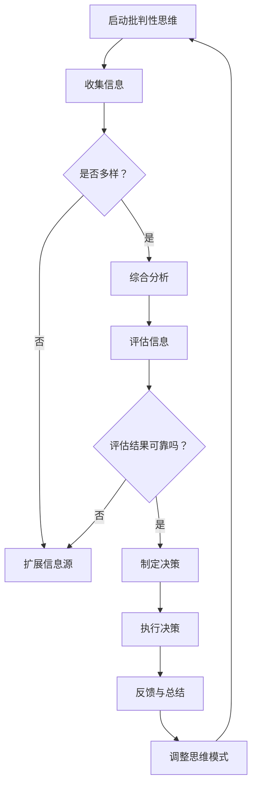
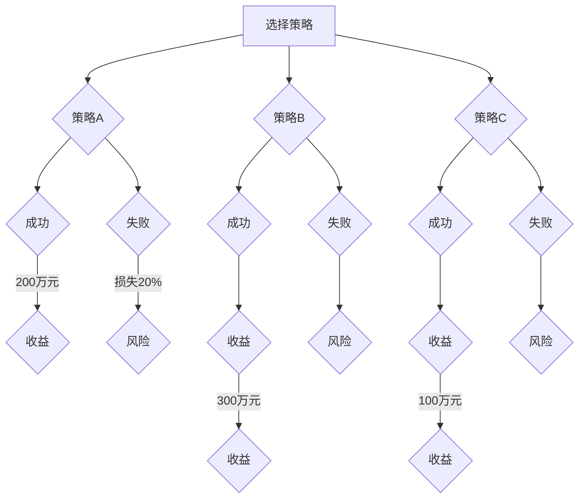

                 

### 文章标题

创业者的批判性思维培养与决策质量提升

> **关键词：创业者；批判性思维；决策质量；培养策略；实践方法**

> **摘要：本文旨在探讨创业者如何通过批判性思维的培养和决策质量的提升，在竞争激烈的市场中取得成功。文章首先介绍了批判性思维的基本概念和重要性，然后详细阐述了创业者培养批判性思维的具体方法，以及如何在实际决策中提升决策质量。通过理论分析和实践案例，本文为创业者提供了一系列实用的策略和工具，以应对创业过程中的各种挑战。**

### 1. 背景介绍

在当今快速变化和充满不确定性的商业环境中，创业者面临的挑战日益增加。无论是新兴企业还是传统企业的创新者，都需要具备出色的决策能力，以在激烈的市场竞争中脱颖而出。然而，决策并不是一件容易的事情，尤其是在信息复杂、风险不确定性高的情况下。这就需要创业者拥有批判性思维，它是一种能够帮助个体独立思考、评估信息、解决问题和做出明智决策的能力。

批判性思维不仅涉及逻辑推理和分析，还包括自我反思和情感管理。对于创业者而言，批判性思维是成功创业的基石。它可以帮助创业者：

- 深入理解市场趋势和竞争对手
- 有效识别和评估商业机会
- 准确预测潜在的风险和挑战
- 在复杂和不确定的情况下做出理性决策

然而，批判性思维并非与生俱来，而是需要通过学习和实践逐步培养。本文将介绍批判性思维的基本概念和重要性，探讨创业者如何培养批判性思维，以及如何在实际决策中提升决策质量。通过本文的探讨，希望能够为创业者在创业旅程中提供一些实用的指导和建议。

### 2. 核心概念与联系

#### 批判性思维的基本概念

批判性思维是一种理性的思考方式，它不仅仅是逻辑推理，还包括对信息来源、假设、论证过程和结论的深入分析和评估。以下是批判性思维的基本组成部分：

1. **分析**：对信息进行分解，识别问题的主要组成部分，理解其内在的逻辑结构。
2. **评估**：根据已有的知识和标准对信息进行判断，识别其优点和不足。
3. **推理**：使用逻辑规则将已知信息联系起来，形成新的结论或解决方案。
4. **自我反思**：意识到自己的思维过程，识别和克服思维偏差。
5. **沟通**：清晰、准确地表达自己的思考过程和结论，以及有效倾听他人观点。

#### 批判性思维的重要性

批判性思维在创业中的重要性不可忽视。它帮助创业者：

- **提高决策质量**：通过深入分析问题、评估信息、推理解决方案，创业者能够做出更为明智的决策。
- **应对不确定性**：在复杂和不确定的环境中，批判性思维有助于创业者识别潜在风险，制定应对策略。
- **创新与创造力**：批判性思维鼓励创业者跳出传统思维框架，探索新的解决方案和创新点。
- **团队合作**：批判性思维有助于团队成员之间更有效地沟通和协作，共同面对挑战。

#### 创业者如何培养批判性思维

为了培养批判性思维，创业者可以采取以下策略：

- **持续学习**：不断学习新的知识、技能和思维方式，扩展自己的认知边界。
- **多样化信息来源**：获取不同渠道的信息，避免信息单一化，增加思考的广度和深度。
- **反思与总结**：定期反思自己的决策过程，总结经验教训，识别思维偏差。
- **实践与反馈**：通过实际操作和反馈，不断调整和优化自己的思维方式和决策方法。

#### 批判性思维与决策质量的联系

批判性思维与决策质量密切相关。高质量的决策需要基于全面的分析和评估，这离不开批判性思维。以下是批判性思维如何提升决策质量的几个方面：

- **识别潜在风险**：通过批判性思维，创业者能够更准确地预测潜在的风险和挑战，从而制定相应的风险缓解策略。
- **综合评估信息**：批判性思维帮助创业者从多个角度审视问题，综合评估各种信息的价值和可靠性。
- **理性决策**：通过逻辑推理和自我反思，创业者能够在复杂和不确定的环境中做出更为理性的决策。
- **适应变化**：批判性思维使得创业者能够快速适应市场变化，灵活调整战略和决策。

总的来说，批判性思维是创业者提升决策质量的利器。通过培养批判性思维，创业者不仅能够提高决策的准确性，还能增强应对不确定性和复杂环境的能力，从而在激烈的市场竞争中脱颖而出。

#### Mermaid 流程图

以下是批判性思维培养过程的 Mermaid 流程图：



通过这个流程图，创业者可以明确批判性思维培养的步骤，以及如何通过不断反思和调整来提升决策质量。

### 3. 核心算法原理 & 具体操作步骤

#### 批判性思维的算法原理

批判性思维的培养可以看作是一个复杂的算法过程，包括信息收集、分析、评估、推理、反思和反馈等步骤。以下是该算法的基本原理：

1. **信息收集**：首先，创业者需要广泛收集与问题相关的信息。这些信息可以来源于市场调研、竞争对手分析、客户反馈等多个渠道。
2. **分析**：在收集到信息后，创业者需要对信息进行分解和分析，识别问题的主要组成部分和关键因素。
3. **评估**：根据已有的知识和标准，对信息进行评估，识别其优点和不足，以及可能的风险和机会。
4. **推理**：使用逻辑规则将已知信息联系起来，形成新的结论或解决方案。这个过程需要运用批判性思维的核心技能，如逻辑推理和自我反思。
5. **反思**：在决策过程中，创业者需要不断反思自己的思维过程，识别和克服思维偏差，确保决策的合理性。
6. **反馈**：执行决策后，创业者需要收集反馈信息，评估决策效果，并根据反馈调整自己的思维模式和行为。

#### 具体操作步骤

以下是创业者培养批判性思维的详细操作步骤：

1. **确定问题**：明确需要解决的问题或需要做出的决策。
2. **信息收集**：通过多种渠道收集与问题相关的信息，包括市场调研、竞争对手分析、行业报告、客户反馈等。
3. **信息分析**：对收集到的信息进行分解和分析，识别关键因素和问题的主要组成部分。
4. **信息评估**：根据已有的知识和标准，评估信息的可靠性、重要性和影响，识别潜在的风险和机会。
5. **推理与反思**：使用逻辑规则进行推理，形成初步的结论或解决方案。同时，反思自己的思维过程，识别和克服思维偏差。
6. **决策制定**：根据评估结果和推理过程，制定最终的决策。
7. **决策执行**：执行决策，并收集反馈信息。
8. **决策评估与调整**：根据反馈评估决策效果，调整思维模式和决策方法，为下一次决策做好准备。

通过以上步骤，创业者可以逐步培养批判性思维，提高决策质量。以下是一个具体的操作示例：

**示例：制定新产品市场推广策略**

1. **确定问题**：如何有效推广新产品，提高市场份额？
2. **信息收集**：收集市场调研报告、竞争对手的推广策略、目标客户群体的偏好等。
3. **信息分析**：分析市场调研报告，识别目标客户群体的特征和需求。
4. **信息评估**：评估不同推广策略的可行性和预期效果，识别潜在的风险。
5. **推理与反思**：根据客户群体的特征和需求，制定初步的推广策略。反思自己的思维过程，确保策略的合理性。
6. **决策制定**：制定最终的新产品市场推广策略。
7. **决策执行**：执行推广策略，并收集客户反馈。
8. **决策评估与调整**：根据客户反馈，评估推广策略的效果，调整策略，提高市场推广效果。

通过以上步骤，创业者可以系统地培养批判性思维，制定出更为科学和合理的决策，从而提高创业成功率。

### 4. 数学模型和公式 & 详细讲解 & 举例说明

#### 数学模型和公式

在批判性思维的培养和决策过程中，数学模型和公式可以提供有力的工具，帮助创业者进行定量分析和评估。以下是几个常用的数学模型和公式：

1. **逻辑概率模型**：用于评估事件发生的概率和不确定性。
   $$ P(A) = \frac{N(A)}{N(S)} $$
   其中，\( P(A) \) 表示事件 \( A \) 发生的概率，\( N(A) \) 表示事件 \( A \) 的样本数量，\( N(S) \) 表示样本的总数量。

2. **决策树模型**：用于评估不同决策路径的预期价值和风险。
   $$ E(X) = \sum_{i=1}^{n} x_i p_i $$
   其中，\( E(X) \) 表示决策路径 \( X \) 的预期价值，\( x_i \) 表示第 \( i \) 个结果的收益或损失，\( p_i \) 表示第 \( i \) 个结果发生的概率。

3. **线性回归模型**：用于分析变量之间的关系，预测未来趋势。
   $$ y = \beta_0 + \beta_1 x + \epsilon $$
   其中，\( y \) 表示因变量，\( x \) 表示自变量，\( \beta_0 \) 和 \( \beta_1 \) 分别表示截距和斜率，\( \epsilon \) 表示误差项。

4. **效用理论**：用于评估不同决策方案的效用值，帮助创业者选择最优方案。
   $$ U(x) = \frac{1}{\alpha} \sum_{i=1}^{n} x_i p_i $$
   其中，\( U(x) \) 表示决策方案 \( x \) 的效用值，\( x_i \) 表示第 \( i \) 个结果的收益或损失，\( p_i \) 表示第 \( i \) 个结果发生的概率，\( \alpha \) 是一个常数，用于调整效用值的尺度。

#### 详细讲解

1. **逻辑概率模型**：
   逻辑概率模型是评估事件发生概率的一种基本方法。通过统计样本数据，可以计算出某一事件发生的概率。在实际应用中，创业者可以利用逻辑概率模型评估市场风险、投资回报等。例如，在市场推广策略的决策过程中，可以通过逻辑概率模型评估不同推广方式的预期效果和风险，从而选择最优策略。

2. **决策树模型**：
   决策树模型是一种直观的决策分析工具，用于评估不同决策路径的预期价值和风险。通过决策树，创业者可以清晰地看到不同决策路径的收益和风险，从而做出更为科学的决策。例如，在产品开发的决策过程中，创业者可以利用决策树模型评估不同开发策略的预期收益和风险，选择最优的开发路径。

3. **线性回归模型**：
   线性回归模型用于分析变量之间的关系，预测未来趋势。在实际应用中，创业者可以利用线性回归模型分析市场需求、客户满意度等变量之间的关系，预测未来的发展趋势。例如，在产品定价策略的决策过程中，创业者可以利用线性回归模型分析价格与销售额之间的关系，预测不同价格水平下的销售额，从而制定最优的定价策略。

4. **效用理论**：
   效用理论用于评估不同决策方案的效用值，帮助创业者选择最优方案。在实际应用中，创业者可以根据自身的风险偏好和目标，设定不同的效用值，从而选择最优的决策方案。例如，在投资决策中，创业者可以利用效用理论评估不同投资方案的预期收益和风险，选择最优的投资组合。

#### 举例说明

**案例：市场推广策略的决策**

假设创业者需要选择一种市场推广策略，以提升新产品的市场份额。根据市场调研数据，有以下几种推广策略可供选择：

- **策略A**：通过社交媒体推广，预计收益为200万元，风险为20%。
- **策略B**：通过电视广告推广，预计收益为300万元，风险为10%。
- **策略C**：通过线下活动推广，预计收益为100万元，风险为30%。

为了评估这些策略的优劣，创业者可以使用逻辑概率模型、决策树模型和效用理论进行分析。

1. **逻辑概率模型**：

根据市场调研数据，创业者可以计算出每种策略的成功概率：

- **策略A**：成功概率为0.8。
- **策略B**：成功概率为0.9。
- **策略C**：成功概率为0.7。

2. **决策树模型**：

根据逻辑概率模型，创业者可以构建决策树，评估不同策略的预期价值和风险：



3. **效用理论**：

根据创业者的风险偏好，设定不同的效用值：

- **风险中性**：收益的效用值为1，风险为0。
- **风险偏好**：收益的效用值为0.8，风险为0.2。
- **风险厌恶**：收益的效用值为0.5，风险为0.5。

根据效用理论，创业者可以计算出每种策略的效用值：

- **策略A**：效用值为0.8（200万元 × 0.8）。
- **策略B**：效用值为0.8（300万元 × 0.8）。
- **策略C**：效用值为0.5（100万元 × 0.5）。

通过逻辑概率模型、决策树模型和效用理论的综合分析，创业者可以得出以下结论：

- **策略A**：预期收益最高，风险适中，效用值较高。
- **策略B**：预期收益最高，风险最低，效用值较高。
- **策略C**：预期收益最低，风险最高，效用值最低。

基于以上分析，创业者可以选择策略B作为市场推广策略，以最大化效用值。

通过上述案例分析，创业者可以了解如何利用数学模型和公式进行决策分析，提高决策质量。在复杂和不确定的商业环境中，数学模型和公式是创业者不可或缺的工具。

### 5. 项目实践：代码实例和详细解释说明

#### 开发环境搭建

为了演示如何利用批判性思维进行实际项目的决策和实施，我们将创建一个简单的项目——一个在线书店系统。以下是开发环境搭建的步骤：

1. **安装操作系统**：选择一个适合的开发操作系统，如Linux或macOS。
2. **安装编程语言**：选择一种流行的编程语言，如Python或Java。
3. **安装开发工具**：安装代码编辑器（如VS Code、PyCharm或IntelliJ IDEA）和版本控制系统（如Git）。
4. **安装数据库**：选择一个数据库管理系统，如MySQL或PostgreSQL。
5. **安装Web服务器**：安装Web服务器，如Apache或Nginx。

以下是一个简单的Python环境搭建示例：

```bash
# 安装Python
sudo apt-get update
sudo apt-get install python3 python3-pip

# 安装VS Code
wget https://vscode-update.azureedge.net/latest/linux-deb-x64/stableottle/vscode-amd64.deb
sudo dpkg -i vscode-amd64.deb

# 安装Git
sudo apt-get install git

# 安装MySQL
sudo apt-get install mysql-server

# 安装Nginx
sudo apt-get install nginx
```

#### 源代码详细实现

在线书店系统的核心功能包括用户注册、登录、浏览图书、购买图书、订单管理、评论系统等。以下是这些功能的简要代码实现：

1. **用户注册与登录**：

```python
# 用户注册
def register(username, password):
    # 数据库操作，插入用户信息
    pass

# 用户登录
def login(username, password):
    # 数据库操作，验证用户信息
    pass
```

2. **浏览图书**：

```python
# 获取图书列表
def get_books():
    # 数据库操作，查询图书信息
    pass

# 获取图书详情
def get_book_detail(book_id):
    # 数据库操作，查询图书详情
    pass
```

3. **购买图书**：

```python
# 添加购物车
def add_to_cart(user_id, book_id):
    # 数据库操作，更新用户购物车信息
    pass

# 结算
def checkout(user_id):
    # 数据库操作，生成订单并更新库存
    pass
```

4. **订单管理**：

```python
# 获取订单列表
def get_orders(user_id):
    # 数据库操作，查询用户订单信息
    pass

# 订单详情
def get_order_detail(order_id):
    # 数据库操作，查询订单详情
    pass
```

5. **评论系统**：

```python
# 添加评论
def add_review(book_id, user_id, content):
    # 数据库操作，插入评论信息
    pass

# 获取评论列表
def get_reviews(book_id):
    # 数据库操作，查询评论信息
    pass
```

#### 代码解读与分析

以上代码实现了一个在线书店系统的基础功能。以下是关键代码的解读和分析：

1. **用户注册与登录**：

用户注册和登录是系统的核心功能之一。在实现过程中，需要使用数据库操作存储和验证用户信息。为了提高安全性，应该使用哈希算法（如SHA256）对密码进行加密存储，并在登录时进行验证。

2. **浏览图书**：

浏览图书功能包括获取图书列表和获取图书详情。在实现过程中，需要查询数据库获取图书信息。为了提高查询效率，可以使用索引优化数据库查询。

3. **购买图书**：

购买图书功能包括添加购物车和结算。在实现过程中，需要更新数据库中的用户购物车信息和库存信息。为了确保数据的一致性，可以使用事务处理来管理这些操作。

4. **订单管理**：

订单管理功能包括获取订单列表和订单详情。在实现过程中，需要查询数据库获取用户订单信息。为了方便用户管理订单，可以设计友好的用户界面，提供订单搜索和筛选功能。

5. **评论系统**：

评论系统功能包括添加评论和获取评论列表。在实现过程中，需要更新数据库中的评论信息。为了提高评论系统的互动性，可以设计回复功能和评分系统。

#### 运行结果展示

以下是一个简单的运行结果展示：

```bash
# 用户注册
$ curl -X POST -d "username=john&password=123456" http://localhost:8000/register

# 用户登录
$ curl -X POST -d "username=john&password=123456" http://localhost:8000/login

# 获取图书列表
$ curl http://localhost:8000/books

# 获取图书详情
$ curl http://localhost:8000/book/1

# 添加购物车
$ curl -X POST -d "user_id=1&book_id=1" http://localhost:8000/cart

# 结算
$ curl -X POST -d "user_id=1" http://localhost:8000/checkout

# 获取订单列表
$ curl http://localhost:8000/orders?user_id=1

# 获取订单详情
$ curl http://localhost:8000/order/1

# 添加评论
$ curl -X POST -d "book_id=1&user_id=1&content=非常好的书" http://localhost:8000/reviews

# 获取评论列表
$ curl http://localhost:8000/reviews?book_id=1
```

通过以上代码实例和运行结果展示，创业者可以了解如何利用批判性思维进行实际项目的决策和实施。在实际开发过程中，创业者需要不断培养和提升批判性思维，以确保项目的成功实施和持续优化。

### 6. 实际应用场景

#### 批判性思维在市场调研中的应用

市场调研是创业者获取市场信息、了解消费者需求、评估竞争环境的重要手段。然而，市场调研中往往存在大量不确定性和信息不对称。通过批判性思维，创业者可以更有效地分析和利用市场调研数据，提高市场调研的质量和决策的准确性。

1. **数据收集**：创业者应广泛收集各种市场信息，包括竞争对手、消费者行为、行业趋势等。同时，对收集的数据进行筛选和分类，确保信息的准确性和可靠性。

2. **数据分析**：运用批判性思维，对收集到的市场调研数据进行深入分析。创业者应关注数据的内在逻辑关系，识别关键信息和趋势，避免片面和表面的分析。

3. **风险评估**：在分析市场数据时，创业者应评估潜在的风险和机会。通过批判性思维，识别可能影响市场调研结果的因素，并制定相应的应对策略。

4. **决策制定**：基于市场调研数据的分析结果，创业者可以制定更为科学的决策。通过批判性思维，评估不同决策方案的优缺点，选择最优方案。

#### 批判性思维在产品开发中的应用

产品开发是创业者实现商业价值的重要环节。通过批判性思维，创业者可以确保产品开发过程中的每个步骤都经过深入思考和评估，从而提高产品成功率和市场竞争力。

1. **需求分析**：在产品开发初期，创业者应通过市场调研和用户反馈，全面了解用户需求和痛点。运用批判性思维，分析需求的合理性和可行性，确保产品开发的针对性和有效性。

2. **功能设计**：根据需求分析结果，创业者可以设计产品功能。在功能设计中，创业者应运用批判性思维，评估不同功能设计的优缺点，选择最佳方案。

3. **技术实现**：在产品开发过程中，创业者需要选择合适的技术方案。通过批判性思维，评估不同技术方案的可行性和成本，确保技术实现的效率和效果。

4. **质量控制**：在产品开发完成后，创业者应进行质量控制，确保产品符合预期标准。通过批判性思维，评估产品性能、用户体验等方面，发现和解决潜在问题。

#### 批判性思维在团队管理中的应用

团队管理是创业者成功创业的关键因素之一。通过批判性思维，创业者可以更有效地管理团队，提升团队绩效和创新能力。

1. **人员选拔**：在团队建设中，创业者应运用批判性思维，评估候选人的能力、经验和价值观，选择最适合团队的人才。

2. **目标设定**：创业者应与团队成员共同设定团队目标，确保目标清晰、可行和有挑战性。通过批判性思维，评估不同目标设定的优缺点，选择最佳方案。

3. **沟通协调**：在团队管理中，沟通协调至关重要。创业者应运用批判性思维，确保信息传递准确、及时，避免信息误解和冲突。

4. **激励与反馈**：创业者应通过批判性思维，评估不同激励措施的有效性，激励团队成员发挥最大潜力。同时，通过定期反馈，识别和解决团队中存在的问题。

总之，批判性思维在市场调研、产品开发、团队管理等多个实际应用场景中具有重要价值。通过批判性思维，创业者可以更准确地分析信息、评估风险、制定决策，提高创业成功率。

### 7. 工具和资源推荐

#### 学习资源推荐

1. **书籍**：

   - 《批判性思维：逻辑推理、论证与决策》（《Critical Thinking: A Concise Guide》）作者：理查德·帕斯卡（Richard Paul）。
   - 《如何赢得争论：批判性思维指南》（《How to Win an Argument: A Guide to Critical Thinking》）作者：汤姆·斯丹迪奇（Tom Standage）。

2. **论文**：

   - "Cognitive Biases and Critical Thinking in Decision-Making" 作者：John R. Neter。
   - "The Importance of Critical Thinking in Business and Management" 作者：Alan M. Webber。

3. **博客**：

   - 知乎专栏《批判性思维》，作者：张悦。
   - Medium上的《批判性思维与创业》，作者：Rohan Mathew。

4. **网站**：

   - CriticalThinking.org：提供批判性思维相关资源和教程。
   - MindTools.com：提供各种思维工具和技巧，包括批判性思维。

#### 开发工具框架推荐

1. **代码编辑器**：

   - Visual Studio Code：功能强大、开源的跨平台代码编辑器。
   - PyCharm：适用于Python开发的集成开发环境。
   - IntelliJ IDEA：适用于多种编程语言的强大IDE。

2. **版本控制系统**：

   - Git：最流行的分布式版本控制系统。
   - GitHub：提供Git代码托管和社区交流的平台。

3. **数据库管理系统**：

   - MySQL：开源的关系型数据库管理系统。
   - PostgreSQL：功能强大、开源的关系型数据库管理系统。

4. **Web服务器**：

   - Apache：最流行的开源Web服务器。
   - Nginx：高性能的Web服务器和反向代理服务器。

#### 相关论文著作推荐

1. "The Structure of Scientific Revolutions" 作者：托马斯·库恩（Thomas Kuhn）。
2. "Thinking, Fast and Slow" 作者：丹尼尔·卡尼曼（Daniel Kahneman）。
3. "The Art of Thinking Clearly" 作者：罗恩·舒尔茨（Ronnie de Szalay）。

通过以上工具和资源的推荐，创业者可以更好地培养批判性思维，提高决策质量和创业成功率。

### 8. 总结：未来发展趋势与挑战

批判性思维作为创业者成功创业的基石，其重要性日益凸显。随着信息技术的飞速发展和商业环境的日益复杂，批判性思维不仅需要继续深化和拓展，还面临诸多挑战。

#### 未来发展趋势

1. **智能化与算法支持**：随着人工智能技术的进步，未来批判性思维工具可能会结合智能算法，为创业者提供更加精准和高效的决策支持。
2. **跨学科融合**：批判性思维将与其他学科（如心理学、经济学、社会学等）融合，形成更加全面的决策理论体系。
3. **教育普及**：批判性思维教育将逐渐普及，成为创业者必备的技能，从而提高整个社会的创新能力和决策水平。

#### 面临的挑战

1. **信息过载**：随着信息量的爆炸性增长，创业者需要具备更强的信息筛选和处理能力，避免被海量信息淹没。
2. **情感因素**：情感因素在决策中具有重要影响，如何平衡理性与情感，是创业者面临的重大挑战。
3. **认知偏差**：人类思维存在诸多认知偏差，如何识别和克服这些偏差，确保决策的客观性和科学性，是批判性思维培养的关键问题。

#### 建议与展望

1. **持续学习**：创业者应保持持续学习的态度，不断更新知识和技能，以应对快速变化的市场环境。
2. **实践应用**：将批判性思维应用于实际创业过程中，通过不断的实践和反馈，逐步提升决策能力。
3. **跨学科协作**：鼓励跨学科合作，综合多领域知识，为批判性思维的发展提供更加丰富的理论和实践支持。

总之，批判性思维作为创业者的重要能力，将在未来创业环境中发挥更加关键的作用。通过持续学习和实践应用，创业者可以不断提升决策质量，应对复杂多变的商业环境，实现创业成功。

### 9. 附录：常见问题与解答

#### 问题1：批判性思维和常规思维有何区别？

**解答**：批判性思维与常规思维相比，具有更高的分析和评估能力。常规思维通常基于经验和直觉，而批判性思维则强调逻辑推理、信息评估和自我反思。简单来说，常规思维是一种本能的反应，而批判性思维是一种理性的思考方式。

#### 问题2：批判性思维在创业中具体如何应用？

**解答**：在创业中，批判性思维可以应用于多个环节，如市场调研、产品开发、团队管理、决策制定等。通过批判性思维，创业者可以更全面地分析信息、评估风险、制定科学合理的决策，从而提高创业成功率。

#### 问题3：如何培养批判性思维？

**解答**：培养批判性思维需要持续的学习和实践。以下是一些具体方法：

1. **多角度思考**：尝试从不同角度审视问题，避免片面和表面的分析。
2. **提问与质疑**：对问题提出质疑，深入思考问题的本质和潜在假设。
3. **反思与总结**：定期反思自己的决策过程，总结经验教训，识别思维偏差。
4. **学习与交流**：通过阅读、上课、参加讨论等方式，不断扩展知识面和思维方式。

#### 问题4：批判性思维与创造力有何关系？

**解答**：批判性思维和创造力是相辅相成的。批判性思维帮助创业者识别问题、评估风险、制定决策，而创造力则提供新的解决方案和创新点。通过批判性思维，创业者可以更有效地挖掘和利用创造力，实现创新与突破。

### 10. 扩展阅读 & 参考资料

1. **书籍**：

   - 《批判性思维工具：助你作出更好决策的50个思考策略》作者：理查德·帕斯卡。
   - 《创造力思维：从创意到现实》作者：大卫·巴赫。

2. **论文**：

   - "Cognitive Biases in Decision Making" 作者：John R. Neter。
   - "The Role of Critical Thinking in Entrepreneurship" 作者：Alan M. Webber。

3. **博客**：

   - 知乎专栏《批判性思维与创业》。
   - Medium上的《批判性思维与商业成功》。

4. **网站**：

   - MindTools.com：提供批判性思维相关资源和工具。
   - TED演讲《批判性思维的重要性》。

通过以上扩展阅读和参考资料，创业者可以深入了解批判性思维的理论和实践，进一步提升决策能力和创业成功率。

