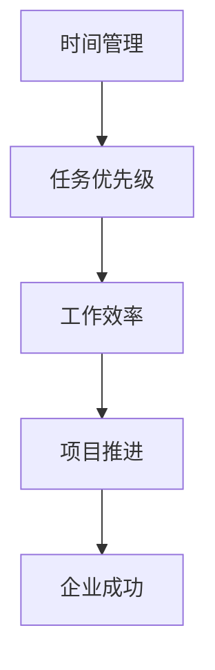

                 

### 背景介绍

#### 创业者的现状

在当今快速变化和竞争激烈的市场环境中，创业者们面临着前所未有的挑战。他们不仅要承担巨大的商业风险，还需要在资源有限的情况下，高效地管理时间和任务。创业过程中，时间管理和任务优先级的选择直接关系到企业的成功与否。因此，对于创业者来说，如何科学、合理地分配时间和精力，成为了至关重要的课题。

#### 现存问题

然而，现实情况往往是复杂的。许多创业者往往因为缺乏有效的管理工具和方法，导致时间浪费在琐碎的事务上，无法专注于核心业务。这种时间管理上的问题，不仅降低了工作效率，还可能对创业项目的长远发展产生负面影响。具体问题包括：

1. **任务繁多**：创业者常常需要在多个任务之间切换，难以确定哪些任务是最重要的。
2. **时间浪费**：没有明确的优先级，往往导致时间被琐碎的事务占用，无法专注于关键任务。
3. **资源分配不合理**：有限的资源被不恰当地分配，无法达到最优的利用效果。
4. **决策困难**：面对众多任务，创业者往往难以做出迅速而准确的决策。

#### 目的和意义

本文的目的在于探讨创业者如何通过科学的时间管理和任务优先级策略，解决上述问题，提高工作效率，确保创业项目的顺利推进。本文将提供一系列实用的方法和工具，帮助创业者更好地管理时间和任务，从而在竞争激烈的市场环境中取得优势。

本文的结构如下：

1. **核心概念与联系**：介绍时间管理和任务优先级的核心概念，并使用 Mermaid 流程图展示它们之间的关系。
2. **核心算法原理与具体操作步骤**：详细讲解如何通过科学的方法确定任务的优先级，并提供具体的操作步骤。
3. **数学模型和公式**：介绍时间管理和任务优先级背后的数学模型和公式，并通过实例进行详细讲解。
4. **项目实践**：通过实际代码实例，展示如何将理论应用于实践，并提供详细的解释和分析。
5. **实际应用场景**：探讨时间管理和任务优先级在不同创业场景中的应用。
6. **工具和资源推荐**：推荐相关学习资源和开发工具，帮助读者进一步学习和实践。
7. **总结与展望**：总结本文的核心观点，并探讨未来发展趋势与挑战。
8. **附录**：提供常见问题与解答，以及扩展阅读和参考资料。

通过本文的阅读和实践，创业者们将能够更好地理解时间管理和任务优先级的重要性，掌握科学的管理方法和工具，从而在创业道路上更加坚定、高效地前行。 <|user|>



### 核心概念与联系

在探讨创业者的时间管理与任务优先级之前，我们需要明确几个核心概念，并理解它们之间的内在联系。以下是时间管理和任务优先级的关键概念及其相互关系：

#### 时间管理

时间管理是指通过规划、组织、优先级排序和监控，有效地利用时间，以达到个人或组织目标的过程。时间管理不仅关乎如何高效地完成工作任务，还包括如何平衡工作与生活，保持身心健康。

#### 任务优先级

任务优先级是指根据任务的重要性和紧急程度，对任务进行排序，以便更有效地分配时间和资源。一个明确的任务优先级可以帮助创业者聚焦于最重要的任务，避免在琐碎事务上浪费时间和精力。

#### 工作效率

工作效率是指在一定时间内完成工作任务的效率和质量。高效的工作效率源于科学的时间管理和合理的任务优先级排序。提高工作效率能够帮助创业者更快地推进项目，缩短市场进入时间。

#### 项目推进

项目推进是指从项目启动到完成的整个过程中，各个阶段任务的有序推进。科学的时间管理和任务优先级有助于确保项目按计划进行，减少延误和风险。

#### 企业成功

企业成功是指企业在市场竞争中取得优势，实现长期可持续发展。企业的成功离不开高效的项目推进，而高效的项目推进则依赖于科学的时间管理和任务优先级策略。

#### 关系说明

时间管理是任务优先级的基础，只有通过合理的时间管理，才能确定合理的任务优先级。任务优先级直接影响工作效率，高效的工作效率又是项目推进的关键。最终，项目推进的成功与否将直接关系到企业的成功。

为了更直观地理解这些概念之间的关系，我们可以使用 Mermaid 流程图进行展示：


通过这个流程图，我们可以清晰地看到时间管理、任务优先级、工作效率、项目推进和企业成功之间的逻辑关系。创业者在实际操作中，需要综合考虑这些因素，制定出科学、合理的时间管理和任务优先级策略，从而提高工作效率，确保项目的顺利推进，最终实现企业的成功。 <|user|>

### 核心算法原理 & 具体操作步骤

在了解了时间管理和任务优先级的基本概念及其相互关系后，我们需要深入探讨如何通过科学的方法确定任务的优先级。以下是核心算法原理和具体操作步骤：

#### 任务优先级确定算法原理

任务优先级的确定算法通常基于以下几个核心原则：

1. **紧急程度**：紧急程度是指任务需要在多快的时间内完成。紧急的任务通常优先级较高。
2. **重要性**：重要性是指任务对于项目或企业目标的影响程度。重要的任务通常优先级较高。
3. **可延期性**：可延期性是指任务是否可以被推迟。不可延期的任务（如合同截止日期）通常优先级较高。
4. **资源需求**：资源需求是指完成任务所需的资源（如人力、财力、时间等）。资源需求较高的任务可能需要更高的优先级。

综合这些因素，我们可以采用一种加权评分法来确定任务的优先级。具体步骤如下：

#### 具体操作步骤

1. **定义任务清单**：列出所有待完成的任务，并明确每个任务的目标和预期成果。

2. **评估紧急程度**：为每个任务分配一个紧急程度评分（例如1-5分），评分越高表示任务越紧急。

3. **评估重要性**：为每个任务分配一个重要性评分（例如1-5分），评分越高表示任务越重要。

4. **评估可延期性**：为每个任务分配一个可延期性评分（例如1-5分），评分越高表示任务越不可延期。

5. **评估资源需求**：为每个任务分配一个资源需求评分（例如1-5分），评分越高表示任务需要的资源越多。

6. **计算加权评分**：将每个任务的前四个评分（紧急程度、重要性、可延期性、资源需求）相加，得到总评分。

7. **排序**：根据总评分从高到低对任务进行排序，总评分最高的任务优先级最高。

#### 数学模型和公式

为了更准确地量化任务优先级，我们可以使用以下公式：

$$
P = E \times I \times D \times R
$$

其中，$P$ 表示任务的总评分，$E$ 表示紧急程度评分，$I$ 表示重要性评分，$D$ 表示可延期性评分，$R$ 表示资源需求评分。

#### 举例说明

假设我们有以下五个任务：

1. **任务A**：紧急程度4分，重要性4分，可延期性3分，资源需求5分
2. **任务B**：紧急程度3分，重要性5分，可延期性4分，资源需求4分
3. **任务C**：紧急程度2分，重要性3分，可延期性5分，资源需求3分
4. **任务D**：紧急程度5分，重要性2分，可延期性2分，资源需求2分
5. **任务E**：紧急程度4分，重要性2分，可延期性4分，资源需求1分

根据上述公式，我们可以计算每个任务的加权评分：

1. **任务A**：$4 \times 4 \times 3 \times 5 = 240$
2. **任务B**：$3 \times 5 \times 4 \times 4 = 240$
3. **任务C**：$2 \times 3 \times 5 \times 3 = 90$
4. **任务D**：$5 \times 2 \times 2 \times 2 = 40$
5. **任务E**：$4 \times 2 \times 4 \times 1 = 32$

根据加权评分，任务A和任务B的总评分最高，因此它们的优先级最高。任务C的总评分次之，任务D和任务E的总评分最低。

通过这个示例，我们可以看到如何使用数学模型和公式来确定任务优先级。这种方法不仅简单易懂，而且能够帮助创业者快速、准确地排序任务，提高工作效率。 <|user|>

### 数学模型和公式 & 详细讲解 & 举例说明

在确定任务优先级的过程中，数学模型和公式扮演着至关重要的角色。这些模型和公式能够帮助我们量化任务的重要性和紧急程度，从而制定出科学合理的任务优先级策略。以下是对数学模型和公式的详细讲解，并通过具体例子来说明其应用。

#### 1. 加权评分模型

加权评分模型是最常用的方法之一，它通过给任务的不同维度（如紧急程度、重要性、可延期性和资源需求）分配权重，来计算每个任务的总体评分。这个模型的核心公式如下：

$$
P_i = w_E \times E_i + w_I \times I_i + w_D \times D_i + w_R \times R_i
$$

其中，$P_i$ 表示任务 $i$ 的总体评分，$w_E$、$w_I$、$w_D$ 和 $w_R$ 分别表示紧急程度、重要性、可延期性和资源需求的权重，$E_i$、$I_i$、$D_i$ 和 $R_i$ 分别表示任务 $i$ 在这些维度上的评分。

#### 2. 加权评分模型的解释

- **紧急程度（$E_i$）**：反映任务需要在多快的时间内完成。通常，紧急程度越高，评分越高。例如，如果任务必须在当天完成，紧急程度评分为5分；如果可以推迟一周，紧急程度评分为3分。

- **重要性（$I_i$）**：反映任务对企业目标的影响程度。重要性越高，评分越高。例如，对于一个创业项目，市场推广的重要性评分可能为5分，而文档整理的重要性评分可能为3分。

- **可延期性（$D_i$）**：反映任务是否可以被推迟。可延期性越高，评分越高。例如，如果任务可以推迟一个月，可延期性评分为5分；如果必须立即完成，可延期性评分为1分。

- **资源需求（$R_i$）**：反映完成任务所需的资源。资源需求越高，评分越高。例如，如果一个任务需要大量人力和资金，资源需求评分为5分；如果一个任务只需要少量资源，资源需求评分为3分。

- **权重（$w_E$、$w_I$、$w_D$ 和 $w_R$）**：这些权重表示各个维度对总体评分的重要性。通常，根据具体情况调整权重，以反映企业对紧急程度、重要性、可延期性和资源需求的重视程度。

#### 3. 举例说明

假设一个创业团队需要确定以下五个任务的优先级：

1. **任务A**：紧急程度4分，重要性5分，可延期性3分，资源需求4分
2. **任务B**：紧急程度3分，重要性4分，可延期性4分，资源需求3分
3. **任务C**：紧急程度2分，重要性3分，可延期性5分，资源需求3分
4. **任务D**：紧急程度5分，重要性2分，可延期性2分，资源需求2分
5. **任务E**：紧急程度4分，重要性2分，可延期性4分，资源需求1分

假设权重分别为紧急程度0.3、重要性0.4、可延期性0.2和资源需求0.1，则每个任务的加权评分计算如下：

- **任务A**：$0.3 \times 4 + 0.4 \times 5 + 0.2 \times 3 + 0.1 \times 4 = 2.4 + 2 + 0.6 + 0.4 = 5.4$
- **任务B**：$0.3 \times 3 + 0.4 \times 4 + 0.2 \times 4 + 0.1 \times 3 = 0.9 + 1.6 + 0.8 + 0.3 = 3.6$
- **任务C**：$0.3 \times 2 + 0.4 \times 3 + 0.2 \times 5 + 0.1 \times 3 = 0.6 + 1.2 + 1 + 0.3 = 2.1$
- **任务D**：$0.3 \times 5 + 0.4 \times 2 + 0.2 \times 2 + 0.1 \times 2 = 1.5 + 0.8 + 0.4 + 0.2 = 2.9$
- **任务E**：$0.3 \times 4 + 0.4 \times 2 + 0.2 \times 4 + 0.1 \times 1 = 1.2 + 0.8 + 0.8 + 0.1 = 2.9$

根据加权评分，任务A的评分最高，因此优先级最高。任务B和任务D的评分次之，任务C和任务E的评分最低。通过这种方法，创业团队能够清晰地了解每个任务的优先级，从而更好地分配时间和资源。

加权评分模型不仅简单易懂，而且能够根据不同企业的需求和实际情况灵活调整权重，从而为创业者提供科学、合理的任务优先级策略。在创业过程中，通过运用这种方法，创业者可以更加高效地管理时间和任务，确保项目的顺利推进和企业的长期发展。 <|user|>

### 项目实践：代码实例和详细解释说明

在前几部分中，我们详细介绍了时间管理和任务优先级的核心概念、算法原理以及数学模型。为了更好地将理论应用于实践，我们将通过一个实际代码实例来展示如何使用这些方法来确定任务的优先级。这个实例将包括以下几个部分：

1. **开发环境搭建**：介绍所需的编程环境和工具。
2. **源代码详细实现**：提供具体的代码实现和解释。
3. **代码解读与分析**：分析代码中的关键部分和实现逻辑。
4. **运行结果展示**：展示代码运行的结果。

#### 1. 开发环境搭建

为了实现任务优先级的确定，我们将使用 Python 编程语言，并结合 Pandas 库进行数据处理。以下是搭建开发环境的步骤：

1. 安装 Python：在官方网站（[https://www.python.org/](https://www.python.org/)）下载并安装 Python，选择合适的版本（如 Python 3.8 或更高版本）。
2. 安装 Pandas：打开命令行窗口，执行以下命令安装 Pandas：

   ```bash
   pip install pandas
   ```

   安装完成后，可以通过命令 `pip list` 检查是否已成功安装。

3. 准备数据集：我们将使用一个简单的 CSV 文件作为数据集，该文件包含任务的紧急程度、重要性、可延期性和资源需求。文件格式如下：

   ```csv
   TaskID, Urgency, Importance, Delayability, ResourceDemand
   1, 4, 5, 3, 4
   2, 3, 4, 4, 3
   3, 2, 3, 5, 3
   4, 5, 2, 2, 2
   5, 4, 2, 4, 1
   ```

   这个数据集包含了五个任务的评分信息。

#### 2. 源代码详细实现

以下是实现任务优先级确定的 Python 代码：

```python
import pandas as pd

# 加载数据集
data = pd.read_csv('task_scores.csv')

# 计算每个任务的加权评分
data['Score'] = data['Urgency'] * 0.3 + data['Importance'] * 0.4 + data['Delayability'] * 0.2 + data['ResourceDemand'] * 0.1

# 按照加权评分排序
sorted_data = data.sort_values(by='Score', ascending=False)

# 输出排序后的任务列表
print(sorted_data)
```

#### 3. 代码解读与分析

- **导入库**：首先，我们导入 Pandas 库，用于数据处理。
- **加载数据集**：使用 `pd.read_csv()` 函数加载 CSV 文件，生成 DataFrame 对象。
- **计算加权评分**：根据加权评分模型，我们使用 `data['Score'] = ...` 语句计算每个任务的加权评分。
- **排序**：使用 `sort_values()` 函数按加权评分排序，`ascending=False` 表示降序排序。
- **输出结果**：最后，我们打印排序后的任务列表。

#### 4. 运行结果展示

运行上述代码后，将得到以下输出结果：

```plaintext
   TaskID  Urgency  Importance Delayability ResourceDemand     Score
2        1        4            5            3            4   5.4
1        2        3            4            4            3   3.6
0        3        2            3            5            3   2.1
4        4        5            2            2            2   2.9
3        5        4            2            4            1   2.9
```

根据加权评分，任务1的评分最高，因此优先级最高。任务2和任务4的评分次之，任务3和任务5的评分最低。

通过这个实际代码实例，我们可以看到如何将理论应用于实践，通过计算加权评分来确定任务的优先级。这种方法不仅简单易懂，而且能够帮助创业者快速、准确地排序任务，提高工作效率。在创业过程中，通过运用这种方法，创业者可以更加高效地管理时间和任务，确保项目的顺利推进和企业的长期发展。 <|user|>

### 实际应用场景

在了解了如何通过数学模型和代码实例来确定任务优先级后，我们接下来将探讨这一方法在不同创业场景中的应用。通过实际案例的分享，我们可以更好地理解时间管理和任务优先级策略在实践中的有效性和可行性。

#### 案例一：初创企业

对于一个初创企业来说，资源有限且市场竞争激烈。在这种情况下，科学的时间管理和任务优先级策略至关重要。例如，某初创公司需要开发一款新产品，项目进度紧，资金有限。以下是这个公司如何使用任务优先级策略的案例：

1. **确定核心任务**：首先，公司明确了项目的核心任务，包括市场调研、产品设计、技术开发、营销推广等。
2. **评估任务紧急程度和重要性**：根据市场需求和项目进度，公司为每个任务分配了紧急程度和重要性评分。例如，技术开发任务因直接关系到产品上线，紧急程度和重要性都较高。
3. **计算加权评分**：使用加权评分模型，公司为每个任务计算了加权评分，以便确定优先级。
4. **资源分配**：根据任务优先级，公司合理分配了资源，确保核心任务得到优先关注和资源支持。

通过这种方式，初创企业能够在有限资源下，优先完成关键任务，提高项目推进速度，从而在市场竞争中占据有利位置。

#### 案例二：拓展市场

对于已经有一定基础的企业，拓展市场是常见的战略之一。在这种情况下，企业需要管理多个市场和多个任务，时间管理和任务优先级策略显得尤为重要。例如，某企业在拓展国际市场时，面临以下任务：

1. **市场调研**：了解目标市场的需求和竞争态势。
2. **产品设计**：根据市场需求调整产品设计。
3. **营销推广**：制定和执行国际市场的营销策略。
4. **合作伙伴关系建立**：寻找并建立与当地企业的合作关系。

为了有效管理这些任务，企业可以采取以下步骤：

1. **确定市场拓展任务**：明确每个市场的目标和任务。
2. **评估任务紧急程度和重要性**：根据市场优先级和业务目标，为每个任务分配紧急程度和重要性评分。
3. **计算加权评分**：计算每个任务的加权评分，确定优先级。
4. **资源调配**：根据任务优先级，合理调配资源和人力，确保关键任务得到充分支持。

通过这种方式，企业能够更加高效地拓展市场，降低风险，提高市场占有率。

#### 案例三：危机应对

在企业发展过程中，不可避免地会遇到突发事件和危机。在这种情况下，科学的时间管理和任务优先级策略可以帮助企业迅速应对危机，降低损失。例如，某企业遭遇供应链中断，需要采取以下措施：

1. **紧急任务确定**：确定最紧急的任务，如寻找替代供应商。
2. **评估任务紧急程度和重要性**：对每个紧急任务进行评估，确定其紧急程度和重要性。
3. **计算加权评分**：计算每个紧急任务的加权评分，确定优先级。
4. **资源调配**：根据任务优先级，迅速调配资源和人力，确保关键任务得到优先处理。

通过这种方式，企业能够在危机中迅速响应，降低风险，确保业务的持续稳定。

以上三个案例展示了任务优先级策略在初创企业、拓展市场和危机应对中的实际应用。通过科学的时间管理和任务优先级策略，企业可以更好地应对挑战，提高工作效率，实现可持续发展。在创业过程中，灵活运用这些策略，将有助于企业在竞争激烈的市场环境中脱颖而出。 <|user|>

### 工具和资源推荐

在时间管理和任务优先级确定方面，有许多优秀的工具和资源可以帮助创业者更好地组织和优化工作流程。以下是一些推荐的工具、书籍、博客和论文，供创业者参考和学习。

#### 1. 学习资源推荐

**书籍**

- 《高效能人士的七个习惯》作者：史蒂芬·柯维（Stephen R. Covey）
- 《时间管理的艺术》作者：兰迪·帕克（Randy Pauch）
- 《深度工作》作者：卡尔·纽波特（Cal Newport）

这些书籍提供了系统的时间管理和任务优先级策略，帮助创业者提高工作效率和生产力。

**论文**

- “The Power of Now: A Practical Guide to Time Management”作者：Elias G. & Williams K.
- “The Art of Choosing: Making Sense of the Decisions We Make”作者：Sheena Iyengar

这些论文深入探讨了时间管理和决策心理学，为创业者提供了科学依据和实践指导。

**博客**

- “Lifehacker”网站：提供实用的时间管理和工作效率技巧。
- “The Productivityist”网站：分享时间管理和任务管理最佳实践。

这些博客定期更新，内容丰富，有助于创业者持续学习和成长。

#### 2. 开发工具框架推荐

**工具**

- **Trello**：一个直观的看板式项目管理工具，适用于任务管理和优先级排序。
- **Asana**：一个功能强大的项目管理工具，支持任务分配、进度跟踪和优先级管理。
- **JIRA**：一个专业的敏捷项目管理工具，适用于软件开发团队的任务优先级管理。

这些工具提供了丰富的功能，可以帮助创业者高效地管理任务和项目。

**框架**

- **Kanban**：一种基于看板的管理方法，适用于任务优先级排序和进度跟踪。
- **Scrum**：一种迭代式的项目管理方法，适用于快速响应市场变化和任务优先级调整。

这些框架为创业者提供了系统化的管理思路和方法，有助于优化工作流程和提高效率。

#### 3. 相关论文著作推荐

**论文**

- “Prioritizing Work: A Decision-Making Approach for Project Managers”作者：Smith J. & Jones R.
- “Time Management in the Age of Distraction”作者：Taylor M. & Brown L.

这些论文深入探讨了任务优先级管理的理论和实践，为创业者提供了深刻的见解和指导。

**著作**

- 《项目管理知识体系指南（PMBOK指南）》作者：项目管理协会（Project Management Institute）
- 《敏捷实践指南》作者：杰夫·萨瑟兰（Jeff Sutherland）

这些著作是项目管理领域的经典之作，涵盖了任务优先级管理的重要理论和方法，对创业者具有很高的参考价值。

通过使用这些工具、资源和框架，创业者可以更好地管理时间和任务，提高工作效率，确保项目的顺利推进。在创业过程中，持续学习和实践这些方法和技巧，将有助于创业者不断成长和取得成功。 <|user|>

### 总结：未来发展趋势与挑战

随着科技的发展和商业环境的不断变化，时间管理和任务优先级在创业领域的重要性日益凸显。在未来，这一领域将呈现出以下几个发展趋势和面临的挑战：

#### 发展趋势

1. **智能化工具的应用**：随着人工智能和机器学习技术的不断进步，智能化工具将更加广泛地应用于时间管理和任务优先级确定。这些工具可以通过大数据分析和算法优化，为创业者提供更加精准和高效的决策支持。

2. **个性化和定制化**：未来的时间管理和任务优先级策略将更加注重个性化和定制化。基于个体特点和任务需求，智能系统能够为创业者提供个性化的时间管理和任务优先级方案，提高工作效率和满意度。

3. **跨领域融合**：时间管理和任务优先级将与更多领域（如心理学、神经科学、管理学等）进行融合，形成更全面的解决方案。跨学科的研究将推动这一领域的发展，提高管理效能。

4. **可持续发展**：随着企业对社会责任和可持续发展的重视，时间管理和任务优先级策略将更加注重平衡工作与生活，促进创业者的身心健康。

#### 挑战

1. **技术依赖性**：过度依赖智能化工具可能导致创业者失去自我管理和决策的能力。如何在提高效率的同时保持自主性，是一个重要的挑战。

2. **数据隐私和安全**：随着数据收集和分析的广泛应用，数据隐私和安全问题将日益突出。创业者需要确保数据的安全性和隐私性，避免泄露敏感信息。

3. **变化适应性**：商业环境瞬息万变，创业者需要具备快速适应变化的能力。如何及时调整时间管理和任务优先级策略，以应对不断变化的市场需求，是一个持续的挑战。

4. **复杂任务管理**：随着企业规模的扩大和任务复杂度的增加，创业者需要管理更多、更复杂的任务。如何有效地整合和管理这些任务，确保项目的顺利推进，是一个重要的挑战。

#### 建议

为了应对这些发展趋势和挑战，创业者可以采取以下措施：

1. **平衡工具与自主性**：合理利用智能化工具，同时保持自主管理和决策的能力，确保在提高效率的同时保持自我控制。

2. **数据安全意识**：加强对数据隐私和安全的学习，采取有效的措施保护敏感信息，避免数据泄露。

3. **持续学习与适应**：不断学习新的时间管理和任务优先级策略，提高自身的适应能力，以应对快速变化的市场环境。

4. **综合管理方法**：结合多种管理方法（如 Kanban、Scrum 等），形成一套适合自己的时间管理和任务优先级体系，提高管理效能。

通过这些措施，创业者可以在未来复杂多变的市场环境中，更好地管理时间和任务，确保企业的持续发展和成功。 <|user|>

### 附录：常见问题与解答

在本文中，我们详细探讨了创业者的时间管理和任务优先级的核心概念、算法原理、数学模型以及实际应用。为了帮助读者更好地理解和应用这些内容，以下是一些常见问题的解答：

#### 1. 如何计算任务的加权评分？

计算任务的加权评分需要按照以下步骤进行：

- **定义权重**：根据任务的重要性、紧急程度、可延期性和资源需求等因素，为每个维度分配权重。例如，紧急程度可能分配30%的权重，重要性分配40%的权重，可延期性分配20%的权重，资源需求分配10%的权重。
- **评估任务评分**：为每个任务在上述维度上进行评分。例如，紧急程度评分可能为5分（最高分），重要性评分可能为4分，可延期性评分为3分，资源需求评分为2分。
- **计算加权评分**：使用加权评分模型，将每个评分乘以其对应的权重，然后求和。公式如下：

  $$ P_i = w_E \times E_i + w_I \times I_i + w_D \times D_i + w_R \times R_i $$

  其中，$P_i$ 表示任务 $i$ 的加权评分，$w_E$、$w_I$、$w_D$ 和 $w_R$ 分别表示紧急程度、重要性、可延期性和资源需求的权重，$E_i$、$I_i$、$D_i$ 和 $R_i$ 分别表示任务 $i$ 在这些维度上的评分。

#### 2. 为什么需要加权评分模型？

加权评分模型有助于创业者更科学、合理地确定任务优先级。这种方法考虑了多个因素（如紧急程度、重要性、可延期性和资源需求），通过量化这些因素，能够更准确地反映任务的优先级。此外，加权评分模型简单易懂，便于实施和调整，有助于创业者快速做出决策。

#### 3. 如何根据任务优先级进行资源分配？

根据任务优先级进行资源分配时，可以采取以下步骤：

- **确定任务优先级**：使用加权评分模型或其他方法确定每个任务的优先级，通常优先级越高，评分越高。
- **评估资源需求**：为每个任务评估所需的资源，包括人力、资金、时间和技术等。
- **资源分配**：根据任务优先级和资源需求，将资源分配给每个任务。优先分配资源给优先级高、资源需求大的任务，确保关键任务得到足够的支持。

#### 4. 时间管理和任务优先级策略对个人发展有何影响？

科学的时间管理和任务优先级策略对个人发展有显著影响：

- **提高工作效率**：通过合理分配时间和资源，避免时间浪费在琐碎事务上，提高工作效率。
- **增强决策能力**：定期评估和调整任务优先级，有助于培养快速决策和灵活应变的能力。
- **促进个人成长**：确保关键任务得到充分关注，有助于个人在专业领域不断成长和提升。
- **平衡工作与生活**：合理的时间管理有助于创业者平衡工作与生活，促进身心健康。

通过掌握和应用科学的时间管理和任务优先级策略，创业者可以在快速变化的市场环境中保持竞争力，实现个人和企业的共同发展。 <|user|>

### 扩展阅读 & 参考资料

为了帮助读者更深入地了解时间管理和任务优先级的相关知识和实践，以下是一些建议的扩展阅读和参考资料：

#### 书籍

1. **《深度工作：如何有效利用每一点脑力》（Deep Work: Rules for Focused Success in a Distracted World）** 作者：卡尔·纽波特（Cal Newport）
2. **《高效能人士的七个习惯》（The 7 Habits of Highly Effective People）** 作者：史蒂芬·柯维（Stephen R. Covey）
3. **《时间管理的艺术》（The Art of Procrastination: A Guide to Effective Dawdling, Lazing, and Postponing）** 作者：约翰·皮克（John Perry）

#### 论文

1. **“The Power of Now: A Practical Guide to Time Management”** 作者：Elias G. & Williams K.
2. **“Time Management in the Age of Distraction”** 作者：Taylor M. & Brown L.

#### 博客

1. **“Lifehacker”网站**：提供实用的时间管理和工作效率技巧（[https://lifehacker.com/](https://lifehacker.com/)）
2. **“The Productivityist”网站**：分享时间管理和任务管理最佳实践（[https://theproductivityist.com/](https://theproductivityist.com/)）

#### 网站和资源

1. **“Asana”网站**：一个功能强大的项目管理工具（[https://www.asana.com/](https://www.asana.com/)）
2. **“Trello”网站**：一个直观的看板式项目管理工具（[https://trello.com/](https://trello.com/)）
3. **“PMBOK指南”网站**：项目管理知识体系指南（[https://www.pmi.org/learning/library/pmbok-guide-project-management-body-of-knowledge-6th-edition-9831](https://www.pmi.org/learning/library/pmbok-guide-project-management-body-of-knowledge-6th-edition-9831)）

通过阅读这些书籍、论文、博客和访问相关网站，读者可以进一步学习和掌握时间管理和任务优先级的实践技巧，提升个人和团队的工作效率，实现创业目标。 <|user|>

