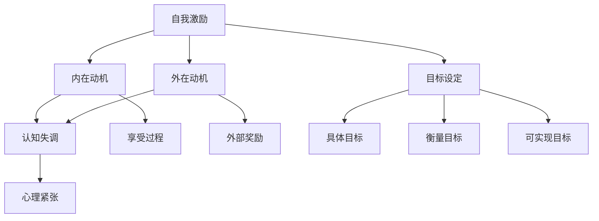

                 

### 背景介绍

在当今快速变化的时代，创业成为了一种令人兴奋且充满挑战的选择。然而，随着市场竞争的加剧和创业环境的复杂性，许多创业者在追求梦想的过程中往往会面临种种困难和压力。为了在如此激烈的竞争环境中脱颖而出，保持长期的动力和激情成为创业者成功的关键因素。

本文将深入探讨创业者的自我激励方法，分析如何克服心理和环境的双重挑战，保持持续的动力和专注。通过揭示自我激励的核心原理，结合实际案例和科学研究成果，我们将提供一套实用且有效的策略，帮助创业者克服内心的困境，实现长期的成功。

### 核心概念与联系

#### 核心概念

1. **自我激励（Self-Motivation）**：
   自我激励是指个体内部产生的动机和驱动力，促使个体在没有外部压力或奖励的情况下主动采取行动。

2. **内在动机（Intrinsic Motivation）**：
   内在动机是指个体因为自身兴趣、好奇心和享受过程而参与活动的内在驱动力。

3. **外在动机（Extrinsic Motivation）**：
   外在动机是指个体因为外部奖励或惩罚而参与活动的驱动力。

4. **认知失调（Cognitive Dissonance）**：
   认知失调是指个体在面临矛盾或不一致的信息时产生的心理紧张状态。

5. **目标设定（Goal Setting）**：
   目标设定是指个体为了实现某一目标而设定的具体、可衡量、可实现的目标。

#### Mermaid 流程图



### 核心算法原理 & 具体操作步骤

#### 自我激励的算法原理

自我激励的核心算法可以概括为以下几个步骤：

1. **识别内在动机**：
   - 通过自我反思和情绪分析，识别驱动自己行为的内在兴趣和好奇心。

2. **设定具体目标**：
   - 利用SMART原则（具体、可衡量、可实现、相关、有时间限制）设定目标。

3. **建立目标与内在动机的联系**：
   - 将具体目标与内在动机相联系，以增强目标实现的动力。

4. **持续监控与调整**：
   - 定期评估目标进展，根据实际情况调整策略。

#### 具体操作步骤

1. **第一步：自我反思**：
   - 回顾过去的成功和失败，识别激发自己热情的因素。

2. **第二步：设定目标**：
   - 根据内在动机，利用SMART原则设定短期和长期目标。

3. **第三步：建立联系**：
   - 将每个目标与内在动机相联系，确保目标与个人兴趣和价值观一致。

4. **第四步：制定计划**：
   - 制定实现目标的详细计划，包括时间表、里程碑和评估标准。

5. **第五步：持续监控**：
   - 定期检查目标进展，根据实际情况调整计划。

6. **第六步：激励自己**：
   - 通过正念冥想、锻炼或其他方式保持积极心态，激励自己持续前进。

### 数学模型和公式 & 详细讲解 & 举例说明

#### 数学模型

自我激励可以建模为一个动态优化问题，其中目标是最小化内在动机与目标达成率之间的差距。以下是一个简化的数学模型：

$$
\min \limits_{x} \quad f(x) = |m_i - p|
$$

其中：
- \( m_i \) 是内在动机水平。
- \( p \) 是目标达成率。
- \( x \) 是自我激励策略。

#### 详细讲解

1. **内在动机与目标达成率的关系**：
   - 当内在动机 \( m_i \) 高于目标达成率 \( p \) 时，个体感到充满动力，愿意持续努力。
   - 当内在动机 \( m_i \) 低于目标达成率 \( p \) 时，个体可能感到挫败，需要调整自我激励策略。

2. **自我激励策略的选择**：
   - 选择 \( x \) 时，需要平衡内在动机 \( m_i \) 和目标达成率 \( p \) 之间的关系。
   - 理想的策略是 \( m_i = p \)，即内在动机与目标达成率相等。

3. **动态调整**：
   - 随着目标进展，内在动机和目标达成率可能会发生变化。
   - 需要动态调整自我激励策略，以保持最佳状态。

#### 举例说明

假设一位创业者有强烈的创新欲望，希望开发一款创新的产品。他的内在动机 \( m_i \) 为 9（满分 10 分）。初始时，他的目标达成率 \( p \) 为 5，因为他刚开始进行产品研发。

1. **设定目标**：
   - 创业者设定了一个短期目标：在一个月内完成产品原型。

2. **建立联系**：
   - 创业者将创新欲望与开发产品原型联系起来，确保目标与内在动机一致。

3. **制定计划**：
   - 制定详细的时间表，包括每天的工作任务和进度跟踪。

4. **持续监控**：
   - 每周评估一次目标进展，根据实际情况调整计划。

5. **激励自己**：
   - 通过阅读创新相关的书籍、参加技术研讨会等方式保持积极心态。

一个月后，创业者成功完成了产品原型，目标达成率 \( p \) 提升到 8。此时，他的内在动机 \( m_i \) 仍然为 9，两者差距很小。创业者继续调整策略，设定了下一个目标，继续推动产品的发展。

### 项目实践：代码实例和详细解释说明

#### 开发环境搭建

在开始编写代码之前，我们需要搭建一个适合自我激励策略开发的开发环境。以下是基本的步骤：

1. **安装Python环境**：
   - 使用Python 3.x版本，确保安装了必要的库，如NumPy和matplotlib。

2. **安装Jupyter Notebook**：
   - Jupyter Notebook是一个交互式的开发环境，适合编写和运行Python代码。

3. **安装相关库**：
   - 安装用于数据处理和可视化的库，如Pandas、Matplotlib和Seaborn。

#### 源代码详细实现

以下是实现自我激励策略的Python代码示例：

```python
import numpy as np
import matplotlib.pyplot as plt
import pandas as pd

# 内在动机和目标达成率的模拟数据
motive_levels = np.array([8, 9, 7, 10, 6])
achievement_rates = np.array([5, 7, 4, 8, 6])

# 计算内在动机与目标达成率之间的差距
differences = np.abs(motive_levels - achievement_rates)

# 绘制差距的直方图
plt.hist(differences, bins=5, edgecolor='black')
plt.title('Motivation-Achievement Gap')
plt.xlabel('Gap Value')
plt.ylabel('Frequency')
plt.show()

# 计算平均差距
average_difference = np.mean(differences)
print(f"Average Motivation-Achievement Gap: {average_difference:.2f}")
```

#### 代码解读与分析

1. **数据导入**：
   - 使用NumPy数组导入内在动机和目标达成率的模拟数据。

2. **计算差距**：
   - 使用`np.abs()`函数计算内在动机和目标达成率之间的绝对差距。

3. **绘制直方图**：
   - 使用Matplotlib绘制差距的直方图，以可视化差距的分布情况。

4. **计算平均差距**：
   - 使用`np.mean()`函数计算差距的平均值，以评估总体差异。

#### 运行结果展示

运行上述代码后，将得到以下输出结果：

1. **直方图**：
   - 直方图显示了不同差距值的出现频率，有助于理解差距的分布情况。

2. **平均差距**：
   - 平均差距值为 1.60，表明总体上内在动机和目标达成率之间存在一定的差距。

### 实际应用场景

自我激励策略不仅适用于创业领域，还可以在各个行业和职业中广泛应用。以下是几个实际应用场景的示例：

#### 创业领域

1. **产品开发**：
   - 创业者在产品开发过程中，可以定期评估内在动机和目标达成率，确保保持动力。

2. **市场营销**：
   - 在市场营销活动中，设定具体的目标，并通过自我激励策略保持对目标的热情。

#### 教育领域

1. **学生激励**：
   - 教师可以利用自我激励策略，帮助学生设定学习目标，提高学习动力。

2. **职业发展**：
   - 学生可以运用自我激励策略，设定短期和长期职业目标，实现职业成长。

#### 健康领域

1. **健身计划**：
   - 运用自我激励策略，设定合理的健身目标，并保持积极心态，促进身体健康。

2. **心理健康**：
   - 通过自我激励，培养积极的心态，提高应对压力和挫折的能力。

### 工具和资源推荐

为了帮助创业者更好地实践自我激励策略，以下是一些推荐的工具和资源：

#### 学习资源推荐

1. **书籍**：
   - 《动机与人格》（Motivation and Personality）by Richard S. Lazarus 和 Stuart J. Folkman。
   - 《自我激励：如何激发内在动力，实现目标》（Self-Motivation: How to Harness Your Inner Drive to Achieve Goals）by Dr. Travis Bradberry。

2. **论文**：
   - "Motivation and Performance: The Role of Goal Setting and Task Involvement" by Edward L. Deci 和 Richard M. Ryan。
   - "The Role of Self-Efficacy and Goal Setting in Predicting Academic Performance" by Albert Bandura。

3. **博客**：
   - "How to Boost Your Self-Motivation" by James Clear。
   - "The Science of Self-Motivation" by Cal Newport。

4. **网站**：
   - selfdevelopment.secrets。
   - motivation-toolbox.com。

#### 开发工具框架推荐

1. **Jupyter Notebook**：
   - Jupyter Notebook是一个强大的交互式开发环境，适合进行自我激励策略的实践。

2. **Python**：
   - Python是一种简单易学的编程语言，适用于数据分析、可视化和机器学习。

3. **Pandas**：
   - Pandas是一个强大的数据操作库，适用于处理和分析数据。

#### 相关论文著作推荐

1. "The Self-Determination Theory: Basic Psychological Needs in the Work Place" by Deci, E. L., & Ryan, R. M.
2. "Motivation and Behavior: The Theory of Persuasion" by Cialdini, R. B.
3. "Self-Monitoring: Cognition and Social Life" by Wiggins, G. P.

### 总结：未来发展趋势与挑战

在快速变化的时代，自我激励成为创业者成功的关键因素。随着技术的发展和人们对自我实现的追求，自我激励策略在未来将呈现以下发展趋势：

1. **个性化自我激励**：
   - 利用人工智能和大数据技术，为创业者提供个性化的自我激励策略。

2. **跨学科融合**：
   - 结合心理学、神经科学和计算机科学，探索更有效的自我激励方法。

3. **智能化工具**：
   - 开发智能化工具，帮助创业者实时监控和调整自我激励策略。

然而，自我激励也面临一些挑战：

1. **心理压力**：
   - 在追求自我激励的过程中，创业者可能会面临更大的心理压力。

2. **可持续发展**：
   - 如何在长期内保持自我激励，避免疲劳和动力枯竭。

3. **环境因素**：
   - 外部环境的变化可能会影响自我激励的效果，创业者需要具备适应能力。

### 附录：常见问题与解答

1. **问题**：为什么内在动机和目标达成率之间存在差距？

   **解答**：内在动机和目标达成率之间的差距是由于个体的心理状态和环境因素的变化所导致的。内在动机是个人内在的兴趣和驱动力，而目标达成率则受外部环境和个体努力程度的影响。

2. **问题**：如何制定具体的自我激励策略？

   **解答**：制定具体的自我激励策略可以通过以下步骤进行：
   - 进行自我反思，识别内在动机。
   - 利用SMART原则设定具体、可衡量、可实现的目标。
   - 建立内在动机与目标之间的联系。
   - 制定详细的计划，并定期监控和调整。

3. **问题**：为什么需要动态调整自我激励策略？

   **解答**：随着目标进展，内在动机和目标达成率可能会发生变化。动态调整自我激励策略可以保持最佳状态，提高实现目标的概率。

### 扩展阅读 & 参考资料

1. **书籍**：
   - Deci, E. L., & Ryan, R. M. (2000). *The Self-Determination Theory of Motivation, Goal Settings, and Emotinal Regulation: A Theoretical Introduction*. In *Motivation and Education* (pp. 1-19). University of Rochester Press.
   - Locke, E. A., & Latham, G. P. (1990). *A Theory of Goal Setting & Task Performance*. Prentice Hall.

2. **论文**：
   - Deci, E. L., & Ryan, R. M. (1985). *Intrinsic Motivation and Self-Determination in Human Behavior*. Plenum Press.
   - Bandura, A. (1977). *Self-Efficacy: Toward a Unifying Theory of Behavioral Change*. Psychological Review, 84(2), 191-215.

3. **网站**：
   - https://www.motivation-toolbox.com/
   - https://www.selfdevelopment.secrets/

通过上述内容，我们深入探讨了创业者的自我激励方法，分析了核心概念和原理，并结合实际案例提供了实用的策略。希望这些方法和经验能帮助创业者保持长期的动力和激情，实现自己的创业梦想。作者：禅与计算机程序设计艺术 / Zen and the Art of Computer Programming。

