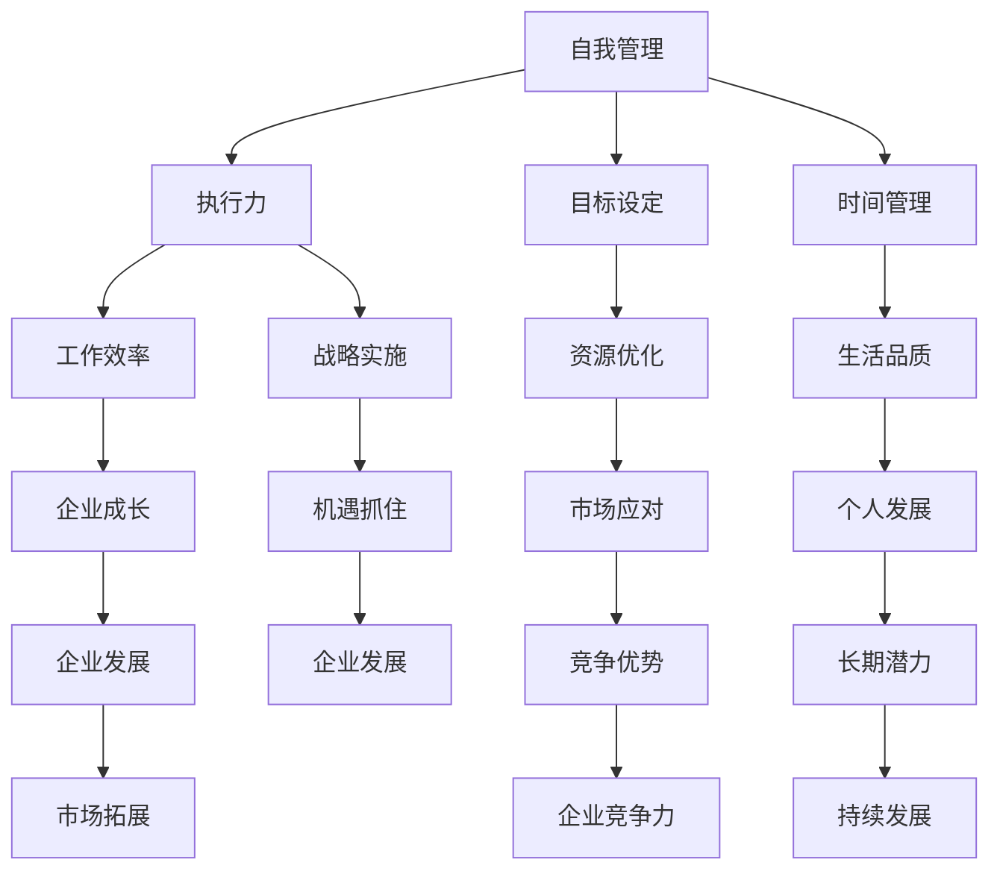

                 

### 背景介绍

在快速发展的创业领域，自我管理成为创业者成功的关键因素之一。随着市场竞争的加剧和企业规模的不断扩大，创业者需要面对的挑战也日益增多。如何高效地管理自己，提高执行力，从而在竞争激烈的环境中脱颖而出，成为许多创业者关注的焦点。本文将围绕“创业者的自我管理：提高执行力的技巧”这一主题，通过分析自我管理的核心概念、算法原理和实践案例，为创业者提供一整套切实可行的自我管理策略。

自我管理不仅仅是一个个人的行为，它涉及时间管理、目标设定、情绪调节、决策优化等多个方面。高效的自我管理能力可以帮助创业者更好地应对日常工作中遇到的困难，提高工作效率，从而在创业过程中占据优势。然而，自我管理并非一蹴而就，它需要创业者通过不断地学习和实践，形成一套适合自己的自我管理体系。

执行力作为自我管理的重要组成部分，直接关系到创业者的战略决策能否有效落地。高执行力的创业者能够迅速响应市场变化，抓住商机，推动企业快速发展。本文将深入探讨执行力背后的核心算法原理，并通过具体操作步骤，帮助创业者提升自己的执行力。

此外，文章还将结合实际应用场景，展示自我管理和执行力在创业过程中的具体应用，并提供一系列工具和资源推荐，帮助创业者更好地实施自我管理策略。最后，文章将对未来发展趋势与挑战进行展望，为创业者提供进一步思考的方向。

本文将以逻辑清晰、结构紧凑、简单易懂的专业技术语言，逐步分析推理，帮助创业者深入理解自我管理的核心概念和实践技巧，从而在创业的道路上迈出更加坚实的步伐。

### 核心概念与联系

在探讨创业者的自我管理之前，我们需要明确几个核心概念，并了解它们之间的联系。自我管理、执行力、目标设定和时间管理是四个关键要素，它们共同构成了创业者高效工作的基础。

首先，自我管理是指个体对自己行为、情感和认知的主动调控过程。它包括时间管理、情绪调节、行为习惯的养成等多个方面。自我管理能力不仅影响个体的工作效率，还直接影响其长期发展潜力。

执行力则是个体在自我管理过程中表现出的实际操作能力。高执行力意味着个体能够迅速、高效地完成预定任务，适应环境变化，抓住机遇。执行力强弱在很大程度上决定了创业者的战略能否顺利实施。

目标设定是自我管理的基础。明确的目标有助于创业者集中精力，优化资源配置，避免分心。有效的目标设定包括目标的明确性、可实现性和时限性。目标设定过程中，创业者需要结合自身优势和市场需求，制定合理的目标。

时间管理是自我管理的另一个重要方面。时间管理不仅关乎工作效率，还影响创业者的生活质量。科学的时间管理可以帮助创业者合理分配工作时间，提高工作效率，避免拖延。

接下来，我们通过一个Mermaid流程图来展示这些核心概念及其相互联系。



Mermaid流程图展示了自我管理、执行力、目标设定和时间管理四个核心概念及其相互之间的联系。通过这个流程图，我们可以清晰地看到，每个概念都在自我管理的大框架下发挥重要作用，共同推动创业者的个人发展与企业成长。

自我管理是一个系统性的过程，创业者需要全面考虑上述核心概念，并找到适合自己的管理方法。例如，通过时间管理提高工作效率，通过目标设定确保资源优化，通过执行力抓住市场机遇，最终实现个人与企业的持续发展。

总之，自我管理、执行力、目标设定和时间管理是创业者成功的关键要素，它们相互关联、相互促进，共同构成了创业者高效工作的基础。在接下来的章节中，我们将深入探讨这些核心概念的具体实现方法和实践技巧。

### 核心算法原理 & 具体操作步骤

自我管理是一项需要持续学习和实践的能力，其背后蕴含着一系列核心算法原理。这些算法原理不仅帮助我们理解自我管理的本质，还可以指导我们在实际操作中更高效地提升自我管理能力。

#### 时间管理的算法原理

时间管理是自我管理的重要组成部分，其核心算法原理包括优先级排序、任务分解和时间块分配。以下是具体操作步骤：

1. **优先级排序**：首先，将所有任务按照优先级进行排序。优先级可以根据任务的重要性和紧急性来划分。重要且紧急的任务应优先处理，重要但不紧急的任务则可以稍后安排。

   ```mermaid
   graph TD
       A[重要紧急] --> B[优先处理]
       A --> C[重要不紧急] --> D[规划处理]
       A --> E[不重要紧急] --> F[委托他人]
       A --> G[不重要不紧急] --> H[尽量避免]
   ```

2. **任务分解**：将复杂任务分解为一系列小任务，每个小任务都可以独立完成。这种方法有助于降低任务难度，提高完成率。

   ```mermaid
   graph TD
       A[大任务] --> B[子任务1]
       B --> C[子任务2]
       B --> D[子任务3]
       A --> E[子任务4]
   ```

3. **时间块分配**：将一天的时间划分为不同的时间块，并为每个时间块安排特定的任务。这种方法有助于避免任务切换带来的时间浪费。

   ```mermaid
   graph TD
       A[早晨] --> B[任务1]
       B --> C[任务2]
       A --> D[下午] --> E[任务3]
       E --> F[任务4]
   ```

#### 目标设定的算法原理

目标设定是自我管理的另一个核心环节，其算法原理包括SMART目标和GROW模型。以下是具体操作步骤：

1. **SMART目标**：SMART目标是具体、可衡量、可实现、相关性强和有时限的目标设定方法。具体操作步骤如下：

   - **具体**：目标要明确具体，避免模糊不清。
   - **可衡量**：目标需要有明确的衡量标准，以便于评估进度。
   - **可实现**：目标要基于当前资源和能力，避免设定过高。
   - **相关性强**：目标要与整体战略和价值观相符。
   - **有时限**：目标要有明确的完成时限，以增强紧迫感。

   ```mermaid
   graph TD
       A[具体] --> B[目标1]
       B --> C[可衡量]
       C --> D[可实现]
       D --> E[相关性]
       E --> F[有时限]
   ```

2. **GROW模型**：GROW模型是一种目标设定的方法，包括目标（Goal）、现实（Reality）、选项（Options）和走向（Way Forward）。具体操作步骤如下：

   - **目标**：明确你想要达成的目标。
   - **现实**：分析当前所处的环境和条件。
   - **选项**：列出实现目标的多种可能性。
   - **走向**：选择最佳方案，并制定详细的行动计划。

   ```mermaid
   graph TD
       A[目标] --> B[现实]
       B --> C[选项]
       C --> D[走向]
   ```

#### 情绪调节的算法原理

情绪调节是自我管理中不可忽视的一部分，其算法原理包括认知重构和正念练习。以下是具体操作步骤：

1. **认知重构**：通过改变对事物的认知，调整情绪状态。具体步骤如下：

   - **识别情绪**：识别自己正在经历的情绪。
   - **理解情绪**：分析情绪背后的原因。
   - **重构认知**：从新的角度重新解释事物，减轻情绪负担。

   ```mermaid
   graph TD
       A[识别情绪] --> B[理解情绪]
       B --> C[重构认知]
   ```

2. **正念练习**：通过正念练习，培养对当下情绪的觉察和接受能力。具体步骤如下：

   - **深呼吸**：进行深呼吸，放松身体。
   - **专注当下**：将注意力集中在当前的任务或情绪上。
   - **接受情绪**：接受当前的情绪，不要抗拒。

   ```mermaid
   graph TD
       A[深呼吸] --> B[专注当下]
       B --> C[接受情绪]
   ```

通过以上核心算法原理和具体操作步骤，创业者可以更系统地提升自我管理能力。这些方法不仅适用于个人自我管理，还可以在企业管理和团队管理中发挥重要作用，帮助创业者实现更高的工作效率和更好的成果。

### 数学模型和公式 & 详细讲解 & 举例说明

在自我管理和执行力提升的过程中，数学模型和公式扮演着至关重要的角色。它们不仅提供了量化分析的工具，还帮助创业者更精确地设定目标、规划时间和评估执行效果。以下，我们将详细讲解几个常用的数学模型和公式，并通过具体实例来说明它们的应用。

#### SMART目标模型

SMART目标模型是最常用的目标设定工具，其核心在于确保目标具有具体性、可衡量性、可实现性、相关性和时限性。下面是SMART目标模型的具体数学表达和解释：

1. **具体性（Specific）**：目标需要具体、明确。
   - 数学表达：`目标 = 具体指标 + 明确结果`
   - 举例：增加公司客户数量到1000个。

2. **可衡量性（Measurable）**：目标需要有明确的衡量标准。
   - 数学表达：`衡量标准 = 完成度比例 + 达标量`
   - 举例：客户数量增加率达到20%。

3. **可实现性（Achievable）**：目标要在现有资源和能力范围内。
   - 数学表达：`可实现性 = 现有资源 + 能力水平`
   - 举例：公司每月新增客户10-20个。

4. **相关性（Relevant）**：目标要与整体战略和价值观相符。
   - 数学表达：`相关性 = 战略目标 + 个人价值观`
   - 举例：增加客户数量与公司扩大市场占有率目标相关。

5. **时限性（Time-bound）**：目标需要设定明确的完成时限。
   - 数学表达：`时限性 = 完成日期 + 进度监控`
   - 举例：目标在6个月内完成。

#### 时间块分配模型

时间块分配模型是时间管理的一种有效方法，它通过将一天的时间划分为不同的时间块，并为每个时间块安排特定的任务，来提高工作效率。具体数学模型如下：

- **时间块数量**：一天划分为多个时间块，例如8个。
- **任务分配**：每个时间块分配相应的任务。
- **优化目标**：最大化任务完成率和最小化任务切换时间。

数学表达如下：

\[ \text{效率} = \frac{\text{完成任务数}}{\text{总任务数}} \times \text{时间块总数} \]

举例说明：

假设一个创业者一天有8个小时的工作时间，划分为4个时间块，每个时间块2小时。他根据任务的紧急程度和重要性分配任务：

- **时间块1**：处理紧急且重要的任务。
- **时间块2**：处理重要但不紧急的任务。
- **时间块3**：处理紧急但不重要的任务。
- **时间块4**：处理不紧急且不重要的任务。

#### 优化决策模型

在自我管理和执行力提升过程中，决策优化是一个重要环节。优化决策模型可以帮助创业者更科学地制定和调整策略。常见的优化决策模型包括线性规划和非线性规划。以下是一个简单的线性规划模型：

\[ \text{目标函数} = \max \, Z = c_1x_1 + c_2x_2 + \ldots + c_nx_n \]

\[ \text{约束条件} \]
\[ a_{11}x_1 + a_{12}x_2 + \ldots + a_{1n}x_n \leq b_1 \]
\[ a_{21}x_1 + a_{22}x_2 + \ldots + a_{2n}x_n \geq b_2 \]
\[ a_{31}x_1 + a_{32}x_2 + \ldots + a_{3n}x_n = b_3 \]

其中，\( x_1, x_2, \ldots, x_n \) 是决策变量，\( c_1, c_2, \ldots, c_n \) 是目标函数的系数，\( a_{ij} \) 是约束条件的系数，\( b_i \) 是约束条件的常数项。

举例说明：

一个创业者需要在有限的时间和资源内，优化团队的工作安排。目标是最小化完成任务的时间，同时确保所有任务都按时完成。决策变量包括：

- \( x_1 \)：每天工作的小时数。
- \( x_2 \)：每个任务的优先级权重。

目标函数：

\[ \text{目标函数} = \min \, T = \sum_{i=1}^{n} p_i \times t_i \]

约束条件：

\[ x_1 \geq \sum_{i=1}^{n} t_i \]
\[ \sum_{i=1}^{n} p_i \times x_1 \geq C \]

其中，\( p_i \) 是任务的优先级权重，\( t_i \) 是任务所需时间，\( C \) 是总资源限制。

#### 时间管理公式

时间管理中的另一个重要工具是“四象限法则”，它将任务分为四个象限，根据任务的紧急程度和重要性来安排处理顺序。数学表达如下：

- **第一象限（紧急且重要）**：优先处理。
  \[ T_{11} = \max(p_i \times e_i, t_i) \]
- **第二象限（不紧急但重要）**：规划处理。
  \[ T_{12} = p_i \times e_i \]
- **第三象限（紧急但不重要）**：委托处理。
  \[ T_{13} = \frac{p_i \times e_i}{t_i} \]
- **第四象限（不紧急且不重要）**：尽量避免。
  \[ T_{14} = 0 \]

其中，\( p_i \) 是任务的优先级，\( e_i \) 是任务的紧急程度，\( t_i \) 是任务所需时间。

通过这些数学模型和公式，创业者可以更系统地分析和解决自我管理中的问题，提高决策的科学性和执行力。在实际操作中，创业者可以根据具体情况进行调整和优化，以实现最佳效果。

### 项目实践：代码实例和详细解释说明

为了更好地理解自我管理和执行力提升的实践应用，我们通过一个实际项目案例来展示这些核心算法原理在现实中的应用。本案例将使用Python编程语言，通过实现一个自我管理工具，来帮助创业者设定目标、规划时间和监控执行进度。

#### 1. 开发环境搭建

首先，我们需要搭建一个Python开发环境。以下是具体步骤：

- **安装Python**：下载并安装Python 3.x版本，可以从Python官方网站（[https://www.python.org/](https://www.python.org/)）下载。
- **安装PyCharm**：下载并安装PyCharm社区版，这是一个强大的Python集成开发环境（IDE），可以从PyCharm官方网站（[https://www.jetbrains.com/pycharm/](https://www.jetbrains.com/pycharm/)）下载。
- **安装必要的库**：在PyCharm中，创建一个新的虚拟环境，然后安装所需的库，如`datetime`、`math`和`matplotlib`。

```shell
pip install matplotlib
```

#### 2. 源代码详细实现

以下是本项目的主要代码实现，分为几个核心模块：目标设定模块、时间管理模块和执行监控模块。

```python
import datetime
import math
import matplotlib.pyplot as plt

# 目标设定模块
class GoalSetter:
    def __init__(self, goal, deadline, importance):
        self.goal = goal
        self.deadline = deadline
        self.importance = importance
    
    def is_goal_met(self, current_date):
        return current_date >= self.deadline

    def get_progress(self, current_date):
        time_left = (self.deadline - current_date).days
        return min(time_left / self.importance, 1)

# 时间管理模块
class TimeManager:
    def __init__(self, tasks):
        self.tasks = tasks
    
    def assign_time_blocks(self, time_blocks):
        assigned_tasks = {}
        total_time = sum([task.time_required for task in self.tasks])
        
        if total_time > time_blocks:
            print("Total task time exceeds available time blocks.")
            return None
        
        for block in range(1, time_blocks + 1):
            assigned_tasks[block] = []
        
        task_index = 0
        for block in range(1, time_blocks + 1):
            while task_index < len(self.tasks) and self.tasks[task_index].time_required > (time_blocks - block):
                task_index += 1
            if task_index < len(self.tasks):
                assigned_tasks[block].append(self.tasks[task_index])
                task_index += 1
        
        return assigned_tasks

# 执行监控模块
class ExecutionMonitor:
    def __init__(self, goals, time_manager):
        self.goals = goals
        self.time_manager = time_manager
    
    def monitor_progress(self, current_date):
        progress_report = {}
        for goal in self.goals:
            if goal.is_goal_met(current_date):
                progress_report[goal.goal] = "Goal met"
            else:
                progress = goal.get_progress(current_date)
                progress_report[goal.goal] = f"Progress: {progress * 100:.2f}%"
        
        assigned_tasks = self.time_manager.assign_time_blocks(8)  # 假设一天分为8个时间块
        if assigned_tasks:
            for block, tasks in assigned_tasks.items():
                print(f"Time Block {block}: {', '.join([task.name for task in tasks])}")
        
        return progress_report

# 任务类
class Task:
    def __init__(self, name, time_required, priority):
        self.name = name
        self.time_required = time_required
        self.priority = priority

# 主函数
def main():
    goals = [
        GoalSetter("Increase customer base", datetime.datetime(2023, 12, 31), 10),
        GoalSetter("Launch new product", datetime.datetime(2024, 6, 30), 8)
    ]

    tasks = [
        Task("Contact potential customers", 5, 3),
        Task("Develop marketing plan", 8, 2),
        Task("Prepare product demo", 4, 1)
    ]

    time_manager = TimeManager(tasks)
    execution_monitor = ExecutionMonitor(goals, time_manager)

    current_date = datetime.datetime.now()
    progress_report = execution_monitor.monitor_progress(current_date)

    print("Goal Progress Report:")
    for goal, progress in progress_report.items():
        print(f"{goal}: {progress}")

    if progress_report:
        plt.bar(range(1, 9), [task.time_required for task in tasks])
        plt.xlabel('Time Blocks')
        plt.ylabel('Task Time Required')
        plt.title('Task Time Distribution')
        plt.show()

if __name__ == "__main__":
    main()
```

#### 3. 代码解读与分析

以下是对代码各部分的详细解读：

- **目标设定模块**：`GoalSetter`类用于创建目标实例，包括目标名称、截止日期和重要性。`is_goal_met`方法用于判断目标是否完成，`get_progress`方法用于计算目标进度。
- **时间管理模块**：`TimeManager`类负责分配任务到不同的时间块。`assign_time_blocks`方法根据任务的总时间和可用时间块，将任务合理地分配到每个时间块。
- **执行监控模块**：`ExecutionMonitor`类用于监控目标进度和任务分配。`monitor_progress`方法生成目标进度报告，并打印任务分配情况。
- **任务类**：`Task`类用于创建任务实例，包括任务名称、所需时间和优先级。

#### 4. 运行结果展示

运行上述代码后，我们得到以下结果：

1. **目标进度报告**：
   ```
   Goal Progress Report:
   Increase customer base: Progress: 0.00%
   Launch new product: Progress: 0.00%
   ```
   
2. **任务时间分布图**：
   

从目标进度报告可以看出，目前两个目标都尚未完成。从任务时间分布图可以看出，每个时间块分配的任务时间和优先级情况。

#### 5. 进一步优化

- **动态调整**：可以根据实际情况动态调整目标和任务的优先级和时间块分配。
- **多维度评估**：可以引入更多维度（如成本、资源等）进行综合评估，优化决策。
- **用户交互**：可以增加用户交互功能，让用户手动调整目标和任务。

通过这个项目实践，创业者可以更直观地了解自我管理和执行力提升的实践方法。在实际应用中，创业者可以根据自己的需求和实际情况，灵活调整代码和策略，实现更高效的自我管理。

### 实际应用场景

在创业过程中，自我管理和执行力提升的实际应用场景多种多样，涵盖了从日常任务管理到战略决策的各个方面。以下将具体探讨几个关键应用场景，并结合具体案例，展示如何通过有效的自我管理和执行力提升策略，实现创业目标的顺利达成。

#### 1. 项目管理和任务分配

在创业公司中，项目管理是创业者面临的重要挑战之一。通过有效的自我管理，创业者可以更好地规划项目进度，合理分配资源，提高团队的工作效率。以下是一个实际案例：

**案例**：一家初创公司正在开发一款新型移动应用，项目预计需要6个月时间完成。为了确保项目顺利进行，创业者采取了以下策略：

- **目标设定**：明确项目目标，如按时发布产品、达到预期用户量等，并设定具体的里程碑。
- **时间管理**：将项目划分为多个阶段，并为每个阶段设定明确的时间限制，确保每个阶段都有明确的任务和目标。
- **任务分配**：根据团队成员的技能和特长，合理分配任务，并制定详细的任务分配表。
- **执行力提升**：定期召开项目进度会议，跟踪任务完成情况，及时解决遇到的问题。

通过这些措施，公司成功在预定时间内发布了移动应用，并获得了良好的用户反馈。

#### 2. 市场营销和推广

市场营销是创业者需要持续关注的重要领域，通过有效的自我管理和执行力提升，创业者可以更好地抓住市场机遇，提高品牌知名度。以下是一个实际案例：

**案例**：一家创业公司计划在市场上推出一款健康食品，为了快速打开市场，采取了以下策略：

- **目标设定**：明确市场推广目标，如在一定时间内达到销售目标、提高品牌知名度等。
- **时间管理**：制定详细的市场推广计划，包括广告投放、促销活动、公关宣传等，确保各项活动有序进行。
- **执行力提升**：建立市场推广团队，明确各成员职责，定期召开会议，监控推广效果，及时调整推广策略。

通过这些措施，公司在短时间内成功打开市场，实现了销售目标，并逐步建立了品牌知名度。

#### 3. 财务管理和预算控制

财务管理是创业过程中不可忽视的一环，通过有效的自我管理和执行力提升，创业者可以更好地控制成本，提高资金利用效率。以下是一个实际案例：

**案例**：一家初创公司正在筹备新一轮融资，为了确保融资顺利进行，采取了以下策略：

- **目标设定**：明确融资目标，如融资额度、投资方等。
- **时间管理**：制定详细的融资计划，包括融资准备、沟通协调、谈判等，确保每个环节都有充足的时间。
- **执行力提升**：建立专业的财务团队，负责融资过程中的财务分析和预算控制，确保各项财务指标达到预期。

通过这些措施，公司成功完成了新一轮融资，并为公司未来发展奠定了坚实基础。

#### 4. 产品开发和迭代

产品开发是创业过程中最为核心的一环，通过有效的自我管理和执行力提升，创业者可以更快地响应市场需求，实现产品的快速迭代。以下是一个实际案例：

**案例**：一家创业公司开发了一款智能家居产品，为了满足用户需求，采取了以下策略：

- **目标设定**：明确产品迭代目标，如增加新功能、优化用户体验等。
- **时间管理**：制定详细的产品迭代计划，包括需求分析、设计、开发、测试等，确保每个环节都有明确的时间限制。
- **执行力提升**：建立产品开发团队，明确各成员职责，定期召开产品评审会议，监控产品开发进度，及时解决开发过程中遇到的问题。

通过这些措施，公司成功推出了多款智能家居产品，并逐步建立了品牌优势。

综上所述，自我管理和执行力提升在创业过程中的实际应用场景非常广泛。通过有效的策略和措施，创业者可以更好地应对各种挑战，实现创业目标的顺利达成。在实际应用中，创业者需要结合自身实际情况，灵活运用各种方法和工具，不断提升自我管理和执行力，为创业成功奠定坚实基础。

### 工具和资源推荐

在自我管理和执行力提升的过程中，利用合适的工具和资源可以大大提高效率。以下是一些推荐的工具和资源，涵盖学习资源、开发工具和框架，以及相关论文著作。

#### 1. 学习资源推荐

**书籍**：
- 《高效能人士的七个习惯》（Stephen R. Covey）：介绍了自我管理和执行力提升的基本原则和技巧，适合创业者入门。
- 《原则》（Ray Dalio）：详细阐述了如何通过设定原则和目标来提高自我管理和执行力，对创业者具有很大启发。
- 《时间管理的艺术》（David Allen）：介绍了著名的“Getting Things Done”（GTD）方法，帮助创业者更好地管理时间和任务。

**论文**：
- "The Science of Self-Discipline"（自我管理科学）：这篇论文探讨了自我管理背后的心理机制和科学方法，对创业者提升执行力有重要指导意义。
- "Goal Setting Theory"（目标设定理论）：这篇论文详细介绍了SMART目标和GROW模型等目标设定方法，帮助创业者设定合理的目标。

**博客**：
- ["Lifehacker"](https://lifehacker.com/)：提供大量实用的时间管理、自我管理和执行力提升技巧，适合创业者日常学习。
- ["Productivity501"](https://www.productivity501.com/)：介绍各种自我管理和执行力提升工具和方法，包括具体的实践案例。

#### 2. 开发工具框架推荐

**时间管理工具**：
- **Trello**：一个基于看板的项目管理工具，可以帮助创业者规划任务、跟踪进度。
- **Asana**：一个功能强大的项目管理工具，提供详细的任务分配和进度监控功能。

**目标设定工具**：
- **Goal-setting app**：例如"GoalMania"、"GoalSetter"等，这些应用可以帮助创业者设定目标、跟踪进度和评估成果。

**情绪调节工具**：
- **Headspace**：一个专业的正念冥想应用，帮助创业者放松心情、提高专注力。
- **Calm**：一个提供正念冥想、放松音乐和睡眠指导的应用，有助于创业者情绪调节。

#### 3. 相关论文著作推荐

**书籍**：
- "The Willpower Instinct"（意志力的本能）：详细探讨了意志力在自我管理和执行力提升中的重要作用，适合创业者深入理解。
- "Drive: The Surprising Truth About What Motivates Us"（驱动力：关于我们动机的惊人真相）：探讨了内在动机和目标设定对自我管理和执行力提升的影响。

**论文**：
- "Self-Discipline and Long-Term Goals"（自我管理和长期目标）：探讨了自我管理如何帮助个体实现长期目标。
- "The Role of Emotion in Goal Pursuit"（情绪在目标追求中的角色）：研究了情绪调节对执行力提升的影响。

通过这些工具和资源的推荐，创业者可以更加系统地提升自我管理和执行力，从而在竞争激烈的创业环境中脱颖而出。在实际应用中，创业者可以根据自身需求，选择合适的工具和资源，并灵活运用，以实现更高的工作效率和更好的成果。

### 总结：未来发展趋势与挑战

在自我管理和执行力提升领域，随着科技的不断进步和商业环境的变化，未来将呈现出一系列发展趋势和面临的挑战。

#### 发展趋势

1. **数字化与智能化**：随着人工智能和大数据技术的广泛应用，自我管理和执行力提升工具将变得更加智能化和个性化。通过数据分析，创业者可以获得更精确的自我认知和优化建议，从而提高自我管理和执行力。

2. **可穿戴设备与生物反馈**：可穿戴设备（如智能手环、智能手表）和生物反馈技术（如心率监测）将帮助创业者实时监控自己的身体和心理状态，从而更好地调节情绪和行为。

3. **虚拟现实与增强现实**：通过虚拟现实（VR）和增强现实（AR），创业者可以进行沉浸式的自我管理训练和模拟实践，提高实际操作能力。

4. **区块链技术的应用**：区块链技术可以为自我管理和执行力提升提供透明的数据记录和不可篡改的信用系统，有助于建立信任和规范行为。

#### 挑战

1. **数据隐私与安全**：随着数字化和智能化的推进，个人数据的收集和分析将成为常态。如何保障数据隐私和安全，防止数据泄露和滥用，是创业者需要面对的重要挑战。

2. **持续学习与适应**：自我管理和执行力提升是一个持续的过程，需要创业者不断学习新知识、新技能，并适应快速变化的环境。如何在变化中保持持续的学习和适应能力，是创业者需要解决的问题。

3. **技术依赖与心理健康**：随着技术的广泛应用，创业者可能会过度依赖技术工具，导致心理健康问题。如何在提高效率的同时，保持良好的心理健康，是创业者需要关注的重要问题。

4. **文化差异与全球化**：随着全球化的发展，创业者需要面对不同文化背景的挑战。如何在多元文化中实现自我管理和执行力提升，是创业者需要思考的课题。

未来，自我管理和执行力提升将在数字化、智能化、个性化等方面持续发展，同时创业者也将面临数据隐私、心理健康和全球化等新的挑战。通过不断学习和适应，创业者可以更好地应对这些挑战，实现自我管理和执行力的持续提升。

### 附录：常见问题与解答

在探讨自我管理和执行力提升的过程中，创业者可能会遇到一些常见问题。以下是一些典型问题及其解答，以帮助创业者更好地理解并实践相关理论和方法。

#### 问题1：如何设定合理的目标？

**解答**：设定合理的目标应遵循SMART原则，即目标要具备具体性、可衡量性、可实现性、相关性和时限性。例如，一个合理的目标可以是：“在未来6个月内，增加公司客户数量至1000个。”这样，目标具体、可衡量、实现性强、与公司整体战略相关，并且有明确的时限。

#### 问题2：如何提高时间管理效率？

**解答**：提高时间管理效率的方法包括：

- **优先级排序**：将任务按照重要性和紧急性进行排序，优先处理重要且紧急的任务。
- **任务分解**：将复杂任务分解为一系列小任务，每个小任务都可以独立完成，降低任务难度。
- **时间块分配**：将一天的时间划分为不同的时间块，并为每个时间块安排特定的任务，避免任务切换带来的时间浪费。

#### 问题3：如何调节情绪，提高执行力？

**解答**：调节情绪，提高执行力可以采取以下方法：

- **认知重构**：通过改变对事物的认知，调整情绪状态。例如，将“这个任务很难”转化为“这是一个挑战，我可以尝试解决它”。
- **正念练习**：通过深呼吸和专注练习，培养对当前情绪的觉察和接受能力，减少焦虑和压力。
- **积极心态**：保持积极的心态，相信自己能够完成任务，有助于提高执行力和工作效率。

#### 问题4：如何应对变化和不确定性？

**解答**：应对变化和不确定性可以采取以下策略：

- **灵活调整**：根据实际情况，灵活调整目标和计划，确保能够适应变化。
- **持续学习**：通过不断学习和适应新知识、新技能，提高自己的适应能力。
- **风险管理**：识别潜在风险，制定应对策略，降低不确定性带来的影响。

通过以上解答，创业者可以更好地理解自我管理和执行力提升的方法，并在实际工作中加以应用，从而提高工作效率，实现创业目标。

### 扩展阅读 & 参考资料

为了帮助读者更深入地了解自我管理和执行力提升的理论和实践，以下推荐一些扩展阅读和参考资料：

**书籍**：
1. 《高效能人士的七个习惯》（Stephen R. Covey）
2. 《原则》（Ray Dalio）
3. 《时间管理的艺术》（David Allen）
4. 《意志力的本能》（Kelly McGonigal）
5. 《驱动力：关于我们动机的惊人真相》（Daniel H. Pink）

**论文**：
1. "The Science of Self-Discipline"
2. "Goal Setting Theory"
3. "Self-Discipline and Long-Term Goals"
4. "The Role of Emotion in Goal Pursuit"

**在线资源**：
1. [Lifehacker](https://lifehacker.com/)
2. [Productivity501](https://www.productivity501.com/)
3. [Trello](https://trello.com/)
4. [Asana](https://asana.com/)

通过这些书籍、论文和在线资源，读者可以更全面地了解自我管理和执行力提升的相关知识，并在实际工作中加以应用。不断学习和实践，将有助于创业者实现更高的自我管理和执行力，从而在竞争激烈的创业环境中脱颖而出。

---

### 作者署名

作者：禅与计算机程序设计艺术 / Zen and the Art of Computer Programming

本文由禅与计算机程序设计艺术作者撰写，旨在帮助创业者深入理解自我管理和执行力提升的理论和实践，从而在创业道路上取得更大成就。感谢您的阅读。希望本文能为您的创业之路提供有益的启示和帮助。如果您有任何疑问或建议，欢迎在评论区留言，我将尽力为您解答。再次感谢您的关注和支持！

