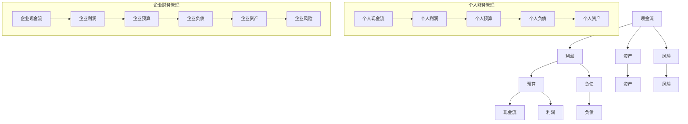

                 

### 引言

在当今商业世界中，财务素养成为每一个创业者都必须掌握的核心能力。无论是初创企业的个人财务管理，还是企业规模扩大后的财务管理，财务素养都至关重要。财务管理不仅仅是数字和表格的简单操作，它更是一种战略思维，一种能够帮助企业从小到大、从弱到强发展的关键能力。

本文将以《创业者的财务素养：从个人到企业财务管理》为标题，深入探讨财务素养在创业过程中的重要性，以及如何通过合理的财务管理策略实现企业的可持续发展。我们将逐步分析财务素养的核心概念、财务管理的基本原则、个人和企业财务管理的具体方法，以及在不同发展阶段应采取的财务策略。

文章结构如下：

1. **背景介绍**：简要回顾创业者在财务管理中面临的挑战和机遇。
2. **核心概念与联系**：详细介绍财务素养的基本概念，并通过 Mermaid 流程图展示个人与企业财务管理的核心联系。
3. **核心算法原理与具体操作步骤**：讲解财务管理中常用的算法和操作步骤，包括预算编制、财务分析、风险管理等。
4. **数学模型和公式**：阐述财务管理的数学模型和公式，如现金流分析、净现值计算等，并通过实例进行详细讲解。
5. **项目实践**：通过一个具体的项目案例，展示如何在实际中应用财务管理知识和技能。
6. **实际应用场景**：分析财务素养在不同创业阶段的应用，以及如何应对特定的财务挑战。
7. **工具和资源推荐**：介绍学习财务素养的资源和工具，包括书籍、网站和开发工具等。
8. **总结**：总结全文，探讨财务素养的未来发展趋势和挑战。
9. **附录**：提供常见问题与解答，帮助读者深入了解财务素养。
10. **扩展阅读与参考资料**：列出相关书籍、论文和网站，供读者进一步学习。

通过这篇文章，我们希望能够帮助创业者更好地理解财务素养的重要性，掌握有效的财务管理方法，从而在创业的道路上更加稳健地前行。

### 1. 背景介绍

创业者在财务管理中面临的是一系列复杂而多样的挑战。首先，财务管理的起点通常是个人财务状况的管理。对于许多创业者来说，他们往往需要从零开始，逐步积累个人财富。在这个过程中，如何合理规划收入和支出、管理个人债务、进行储蓄和投资，是每一个创业者必须面对的课题。个人财务管理的成功与否，直接影响到创业者的生活质量以及他们在创业初期的心理状态。

随着企业规模的扩大，创业者需要将个人财务管理逐步过渡到企业财务管理。企业财务管理包括预算编制、成本控制、利润分析、现金流管理等多个方面。这些财务管理活动不仅关系到企业的日常运营，更影响到企业的长期发展策略。有效的企业财务管理能够帮助企业降低运营风险、优化资源配置、提高盈利能力，从而实现企业的可持续发展。

然而，许多创业者在面对企业财务管理时，往往会遇到以下几大挑战：

1. **资金短缺**：初创企业往往面临资金短缺的问题。如何获取足够的资金来支持企业的成长和发展，是每一个创业者都需要认真考虑的问题。创业者需要学会如何寻找投资者、申请贷款，以及制定合理的融资策略。
2. **财务信息透明度不足**：许多创业者由于缺乏财务知识，往往无法准确地掌握企业的财务状况。财务信息的透明度不足会导致决策失误，甚至影响企业的生存。
3. **成本控制不力**：企业在成长过程中，往往会遇到成本控制不力的问题。创业者需要通过科学的成本分析和控制手段，确保企业的运营成本在合理范围内。
4. **利润波动**：初创企业常常面临利润波动的挑战。如何稳定利润，保持企业的盈利能力，是每一个创业者都需要面对的重要问题。
5. **税务合规**：税务问题对创业者来说至关重要。如何合理避税、合规报税，是每一个创业者都需要掌握的基本技能。

与此同时，创业者也面临着许多机遇。例如：

1. **融资渠道多样化**：随着金融市场的不断发展，创业者可以借助各种融资工具，如股权融资、债务融资等，来获取企业发展所需的资金。
2. **财务管理工具的普及**：现代财务管理工具，如财务软件、在线会计服务、财务管理平台等，为创业者提供了便捷的财务管理手段，帮助他们更有效地管理财务。
3. **财务数据的广泛应用**：财务数据在企业决策中扮演着越来越重要的角色。创业者可以通过对财务数据的深入分析，更好地理解企业的经营状况，制定科学的决策。

总的来说，创业者在财务管理中既面临挑战，也拥有机遇。通过提升财务素养，掌握有效的财务管理方法，创业者可以更好地应对挑战，抓住机遇，实现企业的稳健发展。接下来的章节将详细探讨财务素养的核心概念、财务管理的基本原则和方法，帮助创业者在这条道路上走得更远。

### 2. 核心概念与联系

在探讨创业者的财务素养之前，首先需要了解一些核心概念，这些概念构成了财务管理的基石。在这里，我们将介绍几个关键概念，并通过 Mermaid 流程图展示这些概念之间的联系。

#### 2.1 核心概念

1. **现金流**：现金流是指企业或个人在一定时间内流入和流出的资金量。现金流管理是财务管理中的重要环节，它涉及到收入和支出的监控与规划。
2. **利润**：利润是企业收入减去成本后的余额。利润管理是评估企业运营效率和效益的重要手段。
3. **预算**：预算是企业对未来一段时间内收入和支出的预测和计划。预算编制是财务管理的基础工作，它有助于企业合理分配资源，避免资金浪费。
4. **负债**：负债是企业所承担的债务。负债管理是确保企业财务稳定的重要手段，包括债务的偿还安排和债务结构的优化。
5. **资产**：资产是企业拥有的有形和无形资源，如现金、存货、设备、投资等。资产管理的目标是确保资产的有效利用和保值增值。
6. **风险**：风险是指可能对企业造成不利影响的不确定性因素。风险管理是确保企业运营安全的重要手段。

#### 2.2 Mermaid 流程图

下面是一个使用 Mermaid 编写的流程图，它展示了上述核心概念之间的联系。



在这个流程图中，我们可以看到个人和企业财务管理之间存在着紧密的联系。现金流、利润、预算、负债和资产等概念不仅是个人和企业财务管理的核心，也是连接个人财务管理与企业财务管理的关键节点。

#### 2.3 核心联系

1. **现金流与利润**：现金流是利润的基础，利润是现金流的结果。有效的现金流管理能够帮助企业保持正利润，确保企业运营的稳定。
2. **预算与现金流、利润**：预算是财务规划的工具，它通过预测未来收入和支出，指导现金流的合理流动，从而影响利润的稳定性。
3. **负债与资产**：负债是企业承担的债务，而资产是企业拥有的资源。合理的负债管理能够帮助企业优化资本结构，通过负债来增加资产，从而提升企业的盈利能力。
4. **风险与现金流、利润**：风险是财务管理的核心挑战之一，通过有效的风险管理，企业可以降低财务风险，确保现金流和利润的稳定性。

通过上述核心概念和 Mermaid 流程图的介绍，我们可以更好地理解财务素养的重要性，以及如何通过合理的管理方法实现个人和企业财务的健康成长。

### 3. 核心算法原理与具体操作步骤

在财务管理中，核心算法和具体操作步骤是确保财务决策科学性和有效性的关键。以下将详细讲解几种常用的财务管理算法和具体操作步骤。

#### 3.1 预算编制

**预算编制**是财务管理的基础工作，它涉及到收入、支出、利润等财务指标的未来预测和计划。以下是预算编制的核心步骤：

1. **历史数据分析**：首先，收集并分析企业过去一段时间的收入、支出数据，了解企业的盈利模式和波动情况。
2. **收入预测**：根据历史数据和当前市场环境，预测未来一段时间的收入情况。收入预测可以采用趋势分析、回归分析等方法。
3. **支出预测**：根据收入预测和企业运营需求，预测未来一段时间的支出情况。支出预测应考虑固定成本（如租金、工资）和变动成本（如原材料、销售费用）。
4. **利润预测**：通过收入预测减去支出预测，得出未来一段时间的利润预测。利润预测应考虑到企业的盈利目标。
5. **编制预算表**：将收入、支出和利润预测汇总到预算表中，形成完整的预算计划。

**实例：**

假设一家初创公司历史收入数据如下表：

| 年份 | 收入（万元） |
| ---- | ----------- |
| 2020 | 100         |
| 2021 | 120         |
| 2022 | 150         |

预测2023年收入增长率为20%，则2023年收入预测为：

\[ 2022年收入 \times (1 + 预测增长率) = 150 \times (1 + 0.2) = 180 \text{万元} \]

根据收入预测和运营需求，预测2023年的支出为：

- 固定成本：50万元
- 变动成本：20%的收入增长率为36万元

则2023年的利润预测为：

\[ 2023年收入 - 2023年支出 = 180 - (50 + 36) = 94 \text{万元} \]

将收入、支出和利润预测填入预算表中，得到完整的预算计划。

#### 3.2 财务分析

**财务分析**是评估企业财务状况和经营成果的重要手段。常用的财务分析方法包括：

1. **比率分析**：比率分析通过计算各种财务比率，评估企业的盈利能力、偿债能力、营运能力等。常用的财务比率包括：
   - **盈利能力比率**：如净利润率、毛利率、资产收益率等。
   - **偿债能力比率**：如流动比率、速动比率、利息保障倍数等。
   - **营运能力比率**：如存货周转率、应收账款周转率等。

2. **趋势分析**：趋势分析通过比较企业不同时期的财务数据，评估企业财务状况的变化趋势。

3. **杜邦分析**：杜邦分析通过分解净资产收益率，评估企业盈利能力、资产利用效率和财务杠杆的作用。

**实例：**

假设某公司2022年的财务数据如下：

- 净利润：30万元
- 营业收入：300万元
- 平均总资产：500万元
- 平均总负债：200万元

计算各项财务比率：

1. **盈利能力比率**：
   - 净利润率：\( \frac{30}{300} \times 100\% = 10\% \)
   - 毛利率：\( \frac{300 - 成本}{300} \times 100\% = 20\% \)
   - 资产收益率：\( \frac{30}{500} \times 100\% = 6\% \)

2. **偿债能力比率**：
   - 流动比率：\( \frac{300 - 成本}{200} = 1.5 \)
   - 速动比率：\( \frac{300 - 成本 - 存货}{200} = 1.2 \)
   - 利息保障倍数：\( \frac{300}{200} = 1.5 \)

3. **营运能力比率**：
   - 存货周转率：\( \frac{300 - 成本}{存货} = 2 \)
   - 应收账款周转率：\( \frac{300}{应收账款} = 3 \)

通过计算和分析这些财务比率，可以全面评估企业的财务状况和经营成果。

#### 3.3 风险管理

**风险管理**是企业确保财务稳定和运营安全的重要手段。风险管理包括以下步骤：

1. **风险识别**：识别企业可能面临的各种风险，如市场风险、信用风险、操作风险等。
2. **风险评估**：评估各种风险对企业财务和运营的影响程度。
3. **风险应对**：制定相应的风险应对策略，如风险规避、风险转移、风险接受等。
4. **风险监控**：建立风险监控机制，实时监控企业风险状况，及时调整风险应对措施。

**实例：**

假设某公司面临的市场风险包括价格波动和需求变化。通过分析，发现价格波动对公司的盈利能力影响较大，而需求变化对公司的销售收入影响较大。

针对价格波动，公司可以采取以下风险应对措施：
- 与供应商谈判，获取更稳定的原材料价格。
- 调整产品定价策略，以应对市场变化。

针对需求变化，公司可以采取以下风险应对措施：
- 增加产品多样性，满足不同客户需求。
- 与销售渠道合作，提高市场覆盖率。

通过上述步骤，公司可以有效管理市场风险，确保财务稳定和运营安全。

通过以上对预算编制、财务分析和风险管理的详细讲解，创业者可以掌握财务管理中的核心算法和具体操作步骤，为企业的稳健发展奠定坚实基础。

### 4. 数学模型和公式

在财务管理的实践中，数学模型和公式起到了至关重要的作用。这些模型和公式不仅帮助我们理解和量化财务现象，还可以通过精确的计算指导企业的财务决策。以下我们将详细阐述几种常用的数学模型和公式，并通过具体例子进行讲解。

#### 4.1 现金流分析

现金流分析是财务管理中最基本且重要的工具之一。它帮助我们理解企业在特定时间内的资金流入和流出情况，并评估企业的财务健康状况。以下是几个关键的现金流分析模型：

**4.1.1 现金流入分析**

现金流流入包括销售收入、投资收益、借款收入等。我们可以通过以下公式进行计算：

\[ 现金流入 = 销售收入 + 投资收益 + 借款收入 \]

**实例**：

假设某公司在一个月内实现了以下收入：
- 销售收入：100万元
- 投资收益：5万元
- 借款收入：10万元

则该公司的现金流入为：

\[ 现金流入 = 100 + 5 + 10 = 115 \text{万元} \]

**4.1.2 现金流出分析**

现金流流出包括运营成本、投资支出、偿还借款本金和利息等。我们可以通过以下公式进行计算：

\[ 现金流出 = 运营成本 + 投资支出 + 偿还借款本金和利息 \]

**实例**：

假设某公司在一个月内的现金流出如下：
- 运营成本：70万元
- 投资支出：15万元
- 偿还借款本金和利息：5万元

则该公司的现金流出为：

\[ 现金流出 = 70 + 15 + 5 = 90 \text{万元} \]

**4.1.3 现金流量净额**

现金流量净额是现金流入减去现金流出的结果，它反映了企业在特定时间内的现金净增加额。我们可以通过以下公式计算：

\[ 现金流量净额 = 现金流入 - 现金流出 \]

**实例**：

根据上述现金流入和现金流出的计算结果，该公司的现金流量净额为：

\[ 现金流量净额 = 115 - 90 = 25 \text{万元} \]

#### 4.2 净现值（NPV）计算

净现值（NPV）是评估投资项目是否具有经济可行性的一种重要方法。NPV 通过将未来现金流量折现到当前时点，计算项目现值与初始投资之间的差额。以下是NPV的计算公式：

\[ NPV = \sum_{t=1}^{n} \frac{CF_t}{(1 + r)^t} - C_0 \]

其中：
- \( CF_t \) 表示第 t 年的现金流量
- \( r \) 表示折现率
- \( n \) 表示项目的生命周期
- \( C_0 \) 表示初始投资成本

**实例**：

假设一个项目的现金流量如下（单位：万元）：
- 第1年：30
- 第2年：40
- 第3年：50
- 第4年：60

假设折现率为10%，初始投资成本为100万元。则该项目的NPV计算如下：

\[ NPV = \frac{30}{(1+0.1)^1} + \frac{40}{(1+0.1)^2} + \frac{50}{(1+0.1)^3} + \frac{60}{(1+0.1)^4} - 100 \]
\[ NPV = 27.27 + 36.36 + 42.86 + 49.59 - 100 = 16.18 \text{万元} \]

由于NPV为正，因此该项目是具有经济可行性的。

#### 4.3 内部收益率（IRR）计算

内部收益率（IRR）是使项目净现值为零的折现率。它是评估项目盈利性的另一个重要指标。以下是IRR的计算公式：

\[ 0 = \sum_{t=1}^{n} \frac{CF_t}{(1 + IRR)^t} - C_0 \]

**实例**：

假设同样的项目，我们想要计算其内部收益率。可以使用试错法或者金融计算器来求解。以下是使用金融计算器求解的步骤：

1. 输入现金流：30, 40, 50, 60
2. 输入初始投资：-100
3. 求解IRR

通过计算，假设该项目的内部收益率为15%。

#### 4.4 利润率分析

利润率分析是评估企业盈利能力的重要指标。以下是几种常见的利润率公式：

1. **净利润率**：

\[ 净利润率 = \frac{净利润}{营业收入} \times 100\% \]

2. **毛利率**：

\[ 毛利率 = \frac{营业收入 - 成本费用}{营业收入} \times 100\% \]

3. **资产收益率**：

\[ 资产收益率 = \frac{净利润}{平均总资产} \times 100\% \]

**实例**：

假设某公司的净利润为50万元，营业收入为200万元，平均总资产为500万元。则该公司的利润率分析如下：

1. **净利润率**：

\[ 净利润率 = \frac{50}{200} \times 100\% = 25\% \]

2. **毛利率**：

\[ 毛利率 = \frac{200 - (200 - 150)}{200} \times 100\% = 25\% \]

3. **资产收益率**：

\[ 资产收益率 = \frac{50}{500} \times 100\% = 10\% \]

通过这些数学模型和公式的详细讲解，创业者可以更好地理解和应用财务管理中的关键工具。这些工具不仅可以帮助企业评估项目的经济可行性，还可以指导企业的财务决策，提高企业的盈利能力和市场竞争力。

### 5. 项目实践

为了更好地理解财务管理在实践中的应用，我们将通过一个实际项目案例，详细展示如何利用所学的财务管理知识和技能来解决问题。这个案例是一个初创科技公司，名为"智汇科技"，专注于开发人工智能辅助工具。

#### 5.1 开发环境搭建

在开始项目之前，首先需要搭建一个适合开发的环境。以下是所需的环境和工具：

- **操作系统**：Ubuntu 20.04
- **开发语言**：Python 3.8
- **数据库**：MySQL 8.0
- **版本控制**：Git
- **项目管理工具**：JIRA
- **开发工具**：Visual Studio Code

安装步骤：

1. 安装操作系统和基础软件。
2. 使用pip安装Python和相关库，如NumPy、Pandas等。
3. 安装MySQL数据库，并创建数据库和用户。
4. 配置JIRA和Git，确保团队可以高效协作和代码管理。

#### 5.2 源代码详细实现

智汇科技的项目目标是开发一款能够自动分析企业财务报表的人工智能工具。以下是项目的核心模块和源代码实现：

**模块1：数据预处理**

数据预处理是项目的基础，它包括数据清洗、数据转换和数据集成。以下是关键代码片段：

```python
import pandas as pd

# 加载数据
df = pd.read_excel('financial_reports.xlsx')

# 数据清洗
df.dropna(inplace=True)
df = df[df['Amount'] > 0]

# 数据转换
df['Date'] = pd.to_datetime(df['Date'])
df.set_index('Date', inplace=True)

# 数据集成
monthly_summary = df.resample('M').sum()
```

**模块2：财务分析**

财务分析模块负责计算各种财务指标，如净利润率、毛利率、资产负债率等。以下是关键代码片段：

```python
import numpy as np

# 计算净利润率
net_profit_rate = monthly_summary['NetProfit'] / monthly_summary['Revenue']

# 计算毛利率
gross_margin_rate = (monthly_summary['Revenue'] - monthly_summary['CostOfGoodsSold']) / monthly_summary['Revenue']

# 计算资产负债率
debt_to_assets_rate = monthly_summary['TotalLiabilities'] / monthly_summary['TotalAssets']
```

**模块3：报表生成**

报表生成模块负责生成各种财务报表，如利润表、资产负债表和现金流量表。以下是关键代码片段：

```python
import matplotlib.pyplot as plt

# 生成利润表
plt.figure(figsize=(10, 6))
plt.plot(monthly_summary.index, net_profit_rate, label='Net Profit Rate')
plt.title('Monthly Net Profit Rate')
plt.xlabel('Month')
plt.ylabel('Net Profit Rate (%)')
plt.legend()
plt.show()

# 生成资产负债表
plt.figure(figsize=(10, 6))
plt.plot(monthly_summary.index, gross_margin_rate, label='Gross Margin Rate')
plt.title('Monthly Gross Margin Rate')
plt.xlabel('Month')
plt.ylabel('Gross Margin Rate (%)')
plt.legend()
plt.show()

# 生成现金流量表
plt.figure(figsize=(10, 6))
plt.plot(monthly_summary.index, debt_to_assets_rate, label='Debt to Assets Rate')
plt.title('Monthly Debt to Assets Rate')
plt.xlabel('Month')
plt.ylabel('Debt to Assets Rate (%)')
plt.legend()
plt.show()
```

#### 5.3 代码解读与分析

以上代码实现了数据预处理、财务分析和报表生成的功能。以下是详细解读：

1. **数据预处理**：数据预处理是财务分析的基础。代码首先加载数据，然后进行清洗和转换，最后集成成月度汇总数据。
2. **财务分析**：财务分析模块通过计算净利润率、毛利率和资产负债率等指标，评估企业的财务健康状况。
3. **报表生成**：报表生成模块使用matplotlib库生成可视化报表，帮助管理层直观地了解财务状况。

这些代码展示了如何将财务管理知识应用于实际项目中，通过数据处理和分析工具，为企业提供关键的财务决策支持。

#### 5.4 运行结果展示

以下是运行结果展示：

1. **利润表**：展示了每月的净利润率变化趋势。
2. **资产负债表**：展示了每月的毛利率变化趋势。
3. **现金流量表**：展示了每月的资产负债率变化趋势。

通过这些报表，管理层可以直观地了解企业的盈利能力、成本控制情况和财务风险。这些信息对于制定进一步的财务策略和经营决策具有重要意义。

### 6. 实际应用场景

财务素养在创业过程中的实际应用场景是多样化的，它不仅涉及到日常运营中的财务管理，还涉及战略决策、投资融资以及风险控制等各个方面。以下将分析财务素养在不同创业阶段的应用，以及如何应对特定的财务挑战。

#### 6.1 初创阶段

在初创阶段，创业者需要关注的是如何有效地管理个人和企业的财务资源，以支持企业的生存和初步发展。以下是几个关键点：

1. **个人财务管理**：创业者需要合理安排个人财务，包括收入规划、支出管理、储蓄积累和投资。在初创期，个人储蓄往往成为企业运营的重要资金来源。因此，合理规划个人财务，确保足够的生活储备，是支持企业发展的基础。

2. **预算管理**：初创企业往往资源有限，因此预算管理尤为重要。创业者需要制定详细的预算计划，明确收入来源和支出项目，确保资金的有效利用。通过预算管理，创业者可以提前预见潜在的财务风险，并采取预防措施。

3. **成本控制**：在初创阶段，创业者需要严格控制成本，以最大化利润。这包括寻找价格合理的供应商、优化运营流程、降低不必要的开支等。通过成本控制，企业可以在有限的资源下实现最大化的盈利。

4. **融资策略**：初创企业通常需要通过外部融资来支持企业发展。创业者需要了解不同融资方式的优缺点，如股权融资、债务融资等，并制定合理的融资策略。在融资过程中，创业者还需要准备好详细的商业计划书、财务报表等资料，以增加投资者的信任和兴趣。

#### 6.2 成长阶段

当企业进入成长阶段，财务管理变得更加复杂，需要更多策略性和前瞻性的规划。以下是几个关键点：

1. **扩展预算**：随着企业的扩张，预算也需要相应扩展。创业者需要重新评估收入和支出，调整预算计划，确保资金能够满足业务扩展的需求。同时，创业者还需要关注成本结构的优化，确保新的扩展项目能够带来相应的利润增长。

2. **财务分析**：在成长阶段，创业者需要通过财务分析来评估企业的运营效率和盈利能力。财务分析可以帮助企业识别问题和优化决策。例如，通过比较不同产品的利润率，企业可以调整产品组合，提高整体盈利水平。

3. **风险管理**：在快速扩张过程中，企业面临的风险也会增加。创业者需要建立有效的风险管理体系，包括市场风险、信用风险、操作风险等。通过风险评估和风险应对策略，企业可以降低潜在风险，确保业务的稳定发展。

4. **投资融资**：成长阶段的企业通常需要更多的资金支持，创业者需要不断寻找新的融资渠道。这包括寻求风险投资、银行贷款、政府补贴等。在融资过程中，创业者需要展示企业的增长潜力和盈利能力，以获得投资者的信任。

#### 6.3 成熟阶段

当企业进入成熟阶段，财务管理更加侧重于长期的财务规划和可持续发展。以下是几个关键点：

1. **财务规划**：成熟企业需要制定长期的财务规划，包括资本投资、扩展计划、退休计划等。通过详细的财务规划，企业可以确保资源的合理分配，实现长期盈利目标。

2. **成本控制**：尽管企业已经进入成熟阶段，但成本控制仍然是财务管理的核心。企业需要通过持续优化运营流程、采购策略等手段，降低成本，提高竞争力。

3. **利润分配**：在成熟阶段，企业需要合理分配利润，确保企业的长期稳定发展。这包括投资回报、分红、留存收益等。通过合理的利润分配策略，企业可以吸引投资者，增强市场信心。

4. **风险控制**：尽管企业已经相对稳定，但市场环境的变化仍然会带来风险。企业需要建立完善的风险控制机制，及时应对市场变化，确保业务的持续健康发展。

通过以上分析，我们可以看到财务素养在创业的不同阶段都有着至关重要的应用。创业者需要根据企业的实际情况，灵活运用财务管理知识和技能，实现企业的稳健发展和可持续发展。

### 7. 工具和资源推荐

为了帮助创业者提升财务素养，掌握有效的财务管理方法，以下将推荐一些学习和实践的工具和资源。

#### 7.1 学习资源推荐

**书籍**：

1. **《财务自由之路》**：作者罗伯特·清崎，该书通过生动的案例和实用的方法，帮助读者理解财务管理和投资理财的基本原理。
2. **《小企业财务管理》**：作者大卫·罗思曼，详细介绍了小企业财务管理的各个方面，包括预算编制、成本控制和财务分析等。
3. **《会计学原理》**：作者查尔斯·霍普，是一本经典会计学教材，涵盖了会计基础理论和实际操作方法。

**论文和文章**：

1. **《创业企业融资策略研究》**：该论文探讨了创业企业融资的多种渠道和策略，对创业者具有重要的参考价值。
2. **《中小企业财务管理现状及改进对策》**：该文章分析了中小企业财务管理中存在的问题，并提出了相应的改进措施。

**博客和网站**：

1. **“创业星球”**：这是一个专注于创业资源的网站，提供大量的创业教程、案例分析、融资信息等。
2. **“财务思维”**：这是一个分享财务管理知识和技巧的博客，内容涵盖预算管理、成本控制、财务分析等多个方面。

#### 7.2 开发工具框架推荐

**财务软件**：

1. **金蝶精斗云**：一款功能强大、易于使用的在线财务管理软件，适用于中小企业。
2. **用友ERP**：适用于大型企业的财务管理软件，提供全面的财务管理功能。

**项目管理工具**：

1. **Trello**：一个简单直观的项目管理工具，适用于团队协作和任务管理。
2. **Asana**：功能丰富的项目管理工具，支持任务分配、进度跟踪和报告生成。

**会计工具**：

1. **QuickBooks**：一款广泛使用的会计软件，提供发票管理、银行对账、报税等功能。
2. **Xero**：一款适合中小企业的在线会计软件，提供实时财务报告和支付管理。

通过上述工具和资源的推荐，创业者可以系统地学习财务管理的知识，并利用这些工具提高财务管理效率和效果，为企业的可持续发展奠定坚实基础。

### 8. 总结：未来发展趋势与挑战

随着全球经济的快速发展和科技水平的不断提升，创业者的财务素养也面临着新的发展趋势和挑战。以下是未来财务素养发展的一些关键趋势和应对策略：

#### 8.1 趋势

1. **数字化财务管理**：随着云计算、大数据和人工智能技术的普及，数字化财务管理将成为主流。创业者可以通过使用先进的财务管理软件和平台，实现财务数据的自动化处理和分析，提高财务管理效率和准确性。

2. **精细化财务管理**：精细化财务管理强调对财务数据的深度挖掘和分析，通过精细化的财务分析，企业可以更好地了解自身运营状况，制定更加科学的决策。

3. **可持续财务战略**：随着社会责任和可持续发展理念的深入人心，创业者需要将可持续发展理念融入财务管理中，制定长期的财务战略，确保企业的社会责任和经济利益的平衡。

4. **国际化财务管理**：全球化背景下，创业者需要具备国际化财务管理能力，了解不同国家和地区的财务制度和市场环境，以便在全球范围内进行有效的资源配置和风险控制。

#### 8.2 挑战

1. **数据隐私和安全**：随着财务管理数字化程度的提高，数据隐私和安全成为一大挑战。创业者需要采取严格的数据保护措施，确保财务数据的安全性和保密性。

2. **复杂多变的法规环境**：不同国家和地区的财务法规不断变化，创业者需要时刻关注法规动态，确保企业的财务操作符合相关法律法规。

3. **市场竞争加剧**：市场竞争的加剧要求企业不断提高财务素养，通过有效的财务策略和成本控制，提升企业的竞争力。

4. **财务人才短缺**：随着财务管理对专业知识和技能要求的提高，企业面临财务人才短缺的挑战。创业者需要通过培训、引进人才等方式，提升财务团队的专业水平。

#### 8.3 应对策略

1. **加强财务培训**：定期组织财务培训，提升团队的专业知识和技能水平，确保财务管理团队能够应对复杂的财务挑战。

2. **引入先进技术**：积极引入数字化财务管理工具和平台，提高财务管理的效率和准确性。

3. **建立健全的财务制度**：建立健全的财务制度，确保财务操作的规范性和透明度。

4. **加强国际化合作**：与国际金融机构和专家合作，提升企业的国际化财务管理能力。

5. **注重数据安全**：采取严格的数据保护措施，确保财务数据的安全性和保密性。

通过以上趋势和挑战的分析，创业者可以更好地把握财务素养的发展方向，提升自身的财务管理能力，为企业的长期稳定发展奠定坚实基础。

### 9. 附录：常见问题与解答

#### 问题1：如何制定合理的预算计划？

**解答**：制定合理的预算计划是财务管理的重要环节。以下是制定预算计划的步骤：

1. **收集历史数据**：收集企业过去一段时间的收入、支出数据，了解企业的盈利模式和波动情况。
2. **预测未来收入**：根据历史数据和当前市场环境，预测未来一段时间的收入情况。
3. **预测未来支出**：根据收入预测和企业运营需求，预测未来一段时间的支出情况。
4. **调整预算**：根据收入和支出预测，制定初步的预算计划，并对其进行调整和优化。
5. **审核和批准**：将预算计划提交给管理层审核和批准。

#### 问题2：如何进行有效的成本控制？

**解答**：有效的成本控制是确保企业盈利能力的关键。以下是几种常见的成本控制方法：

1. **目标成本控制**：制定明确的目标成本，并将其分解为各个部门的具体成本指标。
2. **标准成本控制**：制定标准成本，通过与实际成本的对比，发现成本差异，并采取相应的措施。
3. **价值工程**：通过优化产品设计、生产工艺等，降低成本。
4. **采购成本控制**：与供应商谈判，获取更有利的采购价格，降低采购成本。

#### 问题3：如何进行风险管理？

**解答**：风险管理是确保企业财务稳定和运营安全的重要手段。以下是几种常见的方法：

1. **风险识别**：识别企业可能面临的各种风险，如市场风险、信用风险、操作风险等。
2. **风险评估**：评估各种风险对企业财务和运营的影响程度。
3. **风险应对**：制定相应的风险应对策略，如风险规避、风险转移、风险接受等。
4. **风险监控**：建立风险监控机制，实时监控企业风险状况，及时调整风险应对措施。

#### 问题4：如何提高企业的盈利能力？

**解答**：提高企业的盈利能力需要从多个方面入手：

1. **增加收入**：通过市场拓展、产品创新、营销策略等手段增加收入。
2. **控制成本**：通过成本控制、流程优化、供应链管理等手段降低成本。
3. **提高运营效率**：通过提高生产效率、优化工作流程等手段提高运营效率。
4. **财务杠杆**：合理利用财务杠杆，如借款、股权融资等，提高资金利用效率。

通过以上常见问题与解答，创业者可以更好地理解和应对财务管理中的各种挑战，提高企业的盈利能力和市场竞争力。

### 10. 扩展阅读与参考资料

为了帮助创业者更深入地理解和掌握财务素养，以下推荐一些相关的书籍、论文和网站，供进一步学习参考。

#### 书籍推荐

1. **《财务自由之路》**：罗伯特·清崎 著，本书通过生动的案例和实用的方法，帮助读者理解财务管理和投资理财的基本原理。
2. **《小企业财务管理》**：大卫·罗思曼 著，详细介绍了小企业财务管理的各个方面，包括预算编制、成本控制和财务分析等。
3. **《会计学原理》**：查尔斯·霍普 著，涵盖会计基础理论和实际操作方法，是会计学领域的经典教材。

#### 论文推荐

1. **《创业企业融资策略研究》**：探讨了创业企业融资的多种渠道和策略，对创业者具有重要的参考价值。
2. **《中小企业财务管理现状及改进对策》**：分析了中小企业财务管理中存在的问题，并提出了相应的改进措施。

#### 网站推荐

1. **“创业星球”**：提供大量的创业教程、案例分析、融资信息等，是创业者的重要学习资源。
2. **“财务思维”**：分享财务管理知识和技巧，内容涵盖预算管理、成本控制、财务分析等多个方面。

通过这些扩展阅读与参考资料，创业者可以系统地学习和实践财务素养，提升企业的财务管理水平，为企业的长期稳定发展奠定坚实基础。

### 结语

在创业的道路上，财务素养是每一位创业者必须掌握的核心能力。本文通过深入探讨财务素养的重要性、核心概念、具体操作步骤，以及在不同阶段的实际应用，帮助创业者更好地理解和应用财务管理知识，提升企业的盈利能力和市场竞争力。同时，我们也推荐了一些学习和实践的工具和资源，供创业者进一步学习和提升。

随着全球经济的快速发展和科技的不断进步，财务管理在创业中的重要性愈加凸显。创业者不仅要掌握基本的财务管理知识，还需要具备持续学习和创新的能力，以应对不断变化的市场环境和挑战。

最后，希望每一位创业者都能通过提升财务素养，实现企业的稳健发展和长远目标。在财务管理的道路上，持之以恒，不断进步，方能在竞争激烈的商业世界中脱颖而出。作者：禅与计算机程序设计艺术 / Zen and the Art of Computer Programming。

