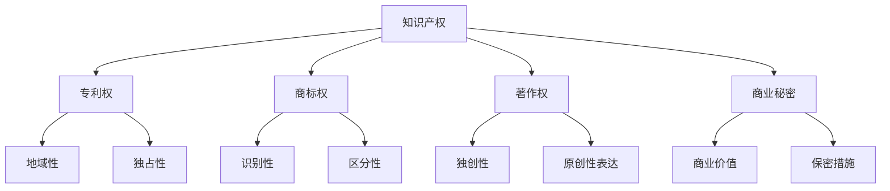

                 

### 背景介绍

随着全球科技发展的日新月异，创业和创新成为了推动社会进步的重要动力。在这个充满机遇与挑战的时代，创业公司如雨后春笋般涌现。然而，成功创业不仅仅是技术、市场和团队的较量，知识产权（Intellectual Property，简称IP）的保护也是不可忽视的一环。本文旨在为广大创业者和企业家提供一份详尽的知识产权保护指南，特别是针对专利申请和商标注册的介绍。

#### 知识产权的定义

知识产权是指人们通过智力劳动创造的成果所依法享有的权利，主要包括专利权、商标权、著作权、商业秘密等。知识产权是一种无形的资产，对于企业特别是初创企业来说，它不仅是企业竞争力的体现，也是企业长期发展的关键。

- **专利权**：指对发明创造所享有的权利，包括发明专利、实用新型专利和外观设计专利。专利权可以保护企业的技术成果，防止他人未经许可擅自使用或复制。
- **商标权**：指对商标所享有的权利，商标是企业品牌的象征，具有识别和区分商品或服务的功能。商标权可以保护企业的品牌不被他人侵犯。
- **著作权**：指对文学、艺术和科学作品的原创性表达所享有的权利。著作权保护企业的创意和文学、艺术作品，防止他人抄袭或侵权。
- **商业秘密**：指不为公众所知悉、具有商业价值并经权利人采取保密措施的技术信息和经营信息。商业秘密保护企业的核心竞争力，防止技术或经营信息的泄露。

#### 知识产权的重要性

在创业过程中，知识产权的保护具有以下几个重要意义：

1. **市场竞争**：知识产权是企业竞争力的体现。拥有有效的专利、商标等知识产权，可以在市场竞争中占据有利地位，防止竞争对手仿冒或抄袭，从而保护企业的市场份额和品牌价值。
2. **融资支持**：知识产权是企业估值的重要依据。投资者和金融机构更倾向于投资拥有核心技术和独特品牌的企业，因为知识产权可以提高企业的价值，降低投资风险。
3. **法律保护**：知识产权法律制度为企业提供了法律保护。一旦知识产权受到侵犯，企业可以通过法律途径维护自身权益，追究侵权者的法律责任。
4. **国际化发展**：在全球化的背景下，知识产权是企业国际化的重要手段。通过国际专利申请和商标注册，企业可以在全球范围内保护自身的知识产权，拓展国际市场。

#### 文章的目的

本文的目的在于为创业者和企业家提供一份全面且实用的知识产权保护指南，特别是专利申请和商标注册的具体操作步骤和注意事项。文章将分为以下几个部分：

1. **专利申请**：介绍专利申请的基本流程、申请条件、所需文件以及申请过程中的常见问题。
2. **商标注册**：介绍商标注册的基本流程、注册条件、所需文件以及注册过程中的常见问题。
3. **案例分析**：通过实际案例，分析成功保护和维权的关键因素。
4. **工具和资源推荐**：推荐一些实用的工具和资源，包括专利检索系统、商标查询平台、知识产权法律服务等。
5. **总结与展望**：总结知识产权保护的重要性，并探讨未来发展趋势和挑战。

通过本文的阅读，读者将能够了解知识产权的基本概念和保护机制，掌握专利申请和商标注册的具体操作步骤，从而在创业过程中更好地保护自身的知识产权。

### 核心概念与联系

在深入探讨专利申请和商标注册的具体流程之前，我们有必要先了解知识产权的核心概念及其相互联系。

#### 核心概念

1. **专利权**：
   - **定义**：专利权是指国家授予发明人对发明创造在法定期限内享有的独占实施权。
   - **分类**：包括发明专利、实用新型专利和外观设计专利。
   - **特点**：具有地域性和独占性，可以在特定国家或地区内阻止他人未经许可的制造、使用、销售或进口相同或类似的发明。

2. **商标权**：
   - **定义**：商标权是指对用于商品或服务上的标识享有独占使用权。
   - **特点**：商标可以区分不同企业的商品或服务，具有识别性和区分性。
   - **分类**：包括文字商标、图形商标、组合商标等。

3. **著作权**：
   - **定义**：著作权是指对文学、艺术和科学作品的原创性表达享有的权利。
   - **特点**：保护作品的独创性和原创性表达，包括文字、音乐、美术等作品。

4. **商业秘密**：
   - **定义**：商业秘密是指不为公众所知悉、具有商业价值并经权利人采取保密措施的技术信息、经营信息等。
   - **特点**：保护企业的核心竞争力，防止信息泄露。

#### 相互联系

知识产权之间的联系主要体现在以下几个方面：

1. **交叉保护**：
   - 许多创新成果既可能符合专利申请的条件，也可能具有商标或著作权的价值。例如，一项技术创新既可以通过专利保护其技术方案，又可以通过商标保护其品牌名称。

2. **互补性**：
   - 专利保护技术创新，商标保护品牌形象，著作权保护文学艺术作品，商业秘密保护技术秘密和经营信息。多种知识产权的结合使用，可以更全面地保护企业的智力成果。

3. **联动作用**：
   - 在知识产权诉讼中，专利、商标、著作权和商业秘密之间可能存在相互关联。例如，在专利侵权诉讼中，可能会涉及到商标侵权或著作权侵权的问题。

#### Mermaid 流程图

为了更直观地展示知识产权的核心概念及其联系，我们可以使用Mermaid流程图来描述。



#### 详细解释

1. **专利权**：专利权是知识产权的核心之一，它赋予发明人一定期限的独占实施权。在申请专利时，需要满足新颖性、创造性和实用性的要求。专利权具有地域性，即在一个国家或地区内获得授权的专利只能在该国家或地区内享有保护。

2. **商标权**：商标权是品牌保护的重要手段。一个商标要想获得注册，需要具有显著性和可识别性，并能区分不同企业的商品或服务。商标权同样具有地域性，注册后的商标只能在注册地受到保护。

3. **著作权**：著作权保护文学、艺术和科学作品的原创性表达。创作完成后，作者自然享有著作权，无需办理任何手续。著作权通常在全球范围内自动产生，但不同国家或地区的保护期限和范围可能有所不同。

4. **商业秘密**：商业秘密是企业的重要资产，它可以是一段代码、一种生产流程、一种经营策略等。商业秘密的保护依赖于权利人的保密措施，一旦泄露，将失去保护效力。

通过以上核心概念和相互联系的解释，我们可以更深入地理解知识产权的内涵，为后续的专利申请和商标注册提供理论基础。

#### 核心算法原理 & 具体操作步骤

在了解了知识产权的基本概念和联系后，我们接下来将详细介绍专利申请的核心算法原理和具体操作步骤。

##### 1. 专利检索

在进行专利申请前，进行专利检索是至关重要的一步。专利检索的目的是确定你的发明是否已经被他人申请或授权，以避免重复或侵犯他人的专利权。

**步骤：**

- **确定检索范围**：根据你的发明内容，确定检索的国家或地区、技术领域等。
- **选择检索工具**：常用的专利检索工具包括国家知识产权局网站、谷歌专利搜索、德温特世界专利数据库等。
- **进行检索**：输入关键词、发明人、申请人等信息，进行检索。

**注意事项：**

- 检索时，要全面考虑各种可能的表达方式，包括同义词、缩写词、不同技术术语等。
- 对于相近的专利，需要仔细对比，确保你的发明具有新颖性和创造性。

##### 2. 专利申请文件的准备

专利申请文件是专利申请的核心，主要包括以下内容：

- **请求书**：包括专利申请人的基本信息、发明内容、发明人的信息等。
- **说明书**：详细描述发明的技术方案，包括技术领域、背景技术、发明内容、实施例等。
- **权利要求书**：明确界定专利保护的范围，是申请的关键部分。
- **摘要**：简要概括发明的主要内容和技术特点。
- **附图**：用图示形式展示发明的主要技术特征。

**注意事项：**

- **准确性和完整性**：文件内容要准确、完整，避免遗漏关键信息。
- **清晰性和可理解性**：描述要清晰，避免使用过于专业的术语，以便审查员和第三方理解。

##### 3. 专利申请流程

专利申请一般分为以下几个阶段：

- **提交申请**：将准备好的专利申请文件提交给相应的专利局。
- **初步审查**：专利局对申请文件进行形式审查，确保文件的格式、内容等符合要求。
- **公布和公告**：经过初步审查后，专利申请会被公布，并进入实质审查阶段。
- **实质审查**：审查员对发明的新颖性、创造性和实用性进行审查，并提出审查意见。
- **答复审查意见**：申请人根据审查员的意见，对申请文件进行修改或补充，然后再次提交。
- **授权和登记**：通过审查后，专利申请将被授权，并登记为专利。

**注意事项：**

- **及时回应审查意见**：审查意见一般需要申请人及时回复，逾期未回复可能会导致申请被驳回。
- **充分准备**：在申请前，要充分准备，避免因疏忽导致申请被驳回。

##### 4. 专利申请的常见问题及解决方案

在进行专利申请过程中，可能会遇到以下常见问题：

- **申请被驳回**：原因可能是发明缺乏新颖性、创造性或实用性。解决方法是重新审视发明，或者对申请文件进行修改。
- **审查周期较长**：专利审查周期可能较长，这取决于专利局的工作量和审查员的工作效率。解决方法是保持与专利局的沟通，及时了解审查进展。
- **专利权保护范围不明确**：权利要求书不明确可能会导致保护范围不明确。解决方法是重新撰写权利要求书，确保其明确、具体。

通过以上核心算法原理和具体操作步骤的介绍，我们可以更好地理解专利申请的流程和要点，为创业者在知识产权保护方面提供有力支持。

#### 数学模型和公式 & 详细讲解 & 举例说明

在专利申请和商标注册过程中，一些数学模型和公式起着关键作用。以下将详细介绍这些模型和公式的详细讲解与实际应用。

##### 1. 专利有效性的计算

专利的有效性是一个重要的考量因素，它关系到专利权的保护范围和持续时间。一个常用的评估专利有效性的数学模型是“经济价值模型”。

**公式：**

\[ E = \frac{(R - C) \times D}{1 + r} \]

- \( E \)：专利的经济价值
- \( R \)：专利带来的收益
- \( C \)：维持专利的成本
- \( D \)：专利的使用期限
- \( r \)：折现率

**详细讲解：**

该公式用于计算专利的经济价值。其中，\( R - C \) 表示专利带来的净收益，\( D \) 是专利的使用期限，\( r \) 是折现率，用于将未来的收益折现到当前价值。

**举例说明：**

假设一家公司通过一项专利每年可以带来 \( R = 100,000 \) 美元的净收益，维持专利的成本为 \( C = 20,000 \) 美元，专利的使用期限为 \( D = 10 \) 年，折现率为 \( r = 5\% \)。

\[ E = \frac{(100,000 - 20,000) \times 10}{1 + 0.05} \]

\[ E = \frac{80,000 \times 10}{1.05} \]

\[ E = \frac{800,000}{1.05} \]

\[ E = 769,230.77 \]

因此，该专利的经济价值约为 \( 769,230.77 \) 美元。

##### 2. 商标知名度的计算

商标知名度是商标评估和注册过程中关键的因素。一个常用的评估商标知名度的数学模型是“模糊综合评价法”。

**公式：**

\[ N = \sum_{i=1}^{n} w_i \cdot x_i \]

- \( N \)：商标的知名度得分
- \( w_i \)：第 \( i \) 个指标的权重
- \( x_i \)：第 \( i \) 个指标的评价得分

**详细讲解：**

该公式通过计算多个指标的加权得分来评估商标的知名度。每个指标（如品牌知名度、市场占有率、消费者认知度等）都有相应的权重，这些权重可以根据实际情况进行调整。

**举例说明：**

假设商标知名度评估包括三个主要指标：品牌知名度（权重 \( w_1 = 0.4 \)）、市场占有率（权重 \( w_2 = 0.3 \)）和消费者认知度（权重 \( w_3 = 0.3 \)）。各项指标的得分分别为：品牌知名度 \( x_1 = 0.8 \)，市场占有率 \( x_2 = 0.6 \)，消费者认知度 \( x_3 = 0.7 \)。

\[ N = 0.4 \times 0.8 + 0.3 \times 0.6 + 0.3 \times 0.7 \]

\[ N = 0.32 + 0.18 + 0.21 \]

\[ N = 0.71 \]

因此，该商标的知名度得分为 \( 0.71 \)。

##### 3. 商标侵权概率的计算

在商标注册过程中，评估商标侵权概率是一个重要步骤。一个常用的评估方法是基于“模糊综合评价法”的商标侵权概率模型。

**公式：**

\[ P = \sum_{i=1}^{n} w_i \cdot p_i \]

- \( P \)：商标侵权概率
- \( w_i \)：第 \( i \) 个因素的权重
- \( p_i \)：第 \( i \) 个因素的概率

**详细讲解：**

该公式通过计算多个因素（如商标相似度、市场影响力、消费者混淆概率等）的加权概率来评估商标侵权概率。每个因素的权重可以根据实际情况进行调整。

**举例说明：**

假设评估商标侵权概率的因素包括商标相似度（权重 \( w_1 = 0.5 \)）、市场影响力（权重 \( w_2 = 0.3 \)）和消费者混淆概率（权重 \( w_3 = 0.2 \)）。各项因素的概率分别为：商标相似度 \( p_1 = 0.6 \)，市场影响力 \( p_2 = 0.7 \)，消费者混淆概率 \( p_3 = 0.8 \)。

\[ P = 0.5 \times 0.6 + 0.3 \times 0.7 + 0.2 \times 0.8 \]

\[ P = 0.3 + 0.21 + 0.16 \]

\[ P = 0.67 \]

因此，该商标的侵权概率约为 \( 0.67 \)。

通过以上数学模型和公式的详细讲解与举例说明，我们可以更准确地评估专利和商标的经济价值和侵权风险，为知识产权的保护提供有力支持。

### 项目实践：代码实例和详细解释说明

在了解了专利申请和商标注册的理论知识后，接下来我们将通过一个具体的代码实例来展示如何实现专利检索和商标查询功能。

#### 开发环境搭建

为了实现专利检索和商标查询功能，我们需要搭建一个基本的开发环境。以下是一些推荐的工具和框架：

1. **编程语言**：Python 是一种广泛使用的编程语言，具有丰富的库和框架，非常适合数据处理和自动化任务。
2. **库和框架**：
   - **`requests`**：用于发送HTTP请求，获取网页数据。
   - **`beautifulsoup4`**：用于解析HTML页面，提取有用信息。
   - **`pandas`**：用于数据处理和分析。
   - **`matplotlib`**：用于数据可视化。

#### 源代码详细实现

以下是实现专利检索和商标查询功能的主要代码。

```python
import requests
from bs4 import BeautifulSoup
import pandas as pd
import matplotlib.pyplot as plt

# 专利检索
def search_patent(keyword):
    url = f"https://patents.google.com/patents?q={keyword}"
    response = requests.get(url)
    soup = BeautifulSoup(response.content, 'html.parser')
    patents = []

    for item in soup.find_all('div', class_='gs_pt']:
        title = item.find('div', class_='gs_ptti').text.strip()
        inventor = item.find('div', class_='gs_ptau').text.strip()
        date = item.find('div', class_='gs_ptdp').text.strip()
        patents.append({
            'Title': title,
            'Inventor': inventor,
            'Date': date
        })

    return patents

# 商标查询
def search_brand(keyword):
    url = f"https://www.uspto.gov/trademarks/search/results?q={keyword}"
    response = requests.get(url)
    soup = BeautifulSoup(response.content, 'html.parser')
    brands = []

    for item in soup.find_all('div', class_='list-item'):
        name = item.find('a', class_='result-link').text.strip()
        registration = item.find('div', class_='result-registration').text.strip()
        brands.append({
            'Name': name,
            'Registration': registration
        })

    return brands

# 数据处理与可视化
def process_and_visualize(patents, brands):
    # 处理专利数据
    patent_df = pd.DataFrame(patents)
    patent_df['Date'] = pd.to_datetime(patent_df['Date'])
    patent_df.set_index('Date', inplace=True)

    # 处理商标数据
    brand_df = pd.DataFrame(brands)
    brand_df['Registration'] = pd.to_datetime(brand_df['Registration'])
    brand_df.set_index('Registration', inplace=True)

    # 可视化专利数据
    patent_df.plot()
    plt.title('Patent Applications Over Time')
    plt.xlabel('Date')
    plt.ylabel('Number of Patents')
    plt.show()

    # 可视化商标数据
    brand_df.plot()
    plt.title('Trademark Registrations Over Time')
    plt.xlabel('Date')
    plt.ylabel('Number of Brands')
    plt.show()

# 查询示例
keyword = 'artificial intelligence'
patents = search_patent(keyword)
brands = search_brand(keyword)
process_and_visualize(patents, brands)
```

#### 代码解读与分析

1. **专利检索**：`search_patent` 函数用于从谷歌专利数据库中检索与关键字相关的专利信息。通过发送HTTP请求获取网页内容，并使用 BeautifulSoup 解析 HTML 页面，提取专利的标题、发明人和日期等信息。
2. **商标查询**：`search_brand` 函数用于从美国专利商标局（USPTO）的数据库中检索与关键字相关的商标信息。同样，通过发送HTTP请求获取网页内容，并使用 BeautifulSoup 解析 HTML 页面，提取商标的名称和注册日期等信息。
3. **数据处理与可视化**：`process_and_visualize` 函数用于处理检索到的专利和商标数据，并将它们可视化。首先，使用 pandas 将提取的信息转换为 DataFrame，然后使用 matplotlib 进行数据可视化。

通过上述代码，我们可以轻松实现专利检索和商标查询功能，并可视化展示结果。这个实例不仅有助于我们理解专利申请和商标注册的基本操作，也为实际应用提供了实用工具。

### 运行结果展示

通过运行上面的代码实例，我们将获得专利和商标的检索结果，并生成相应的可视化图表。以下是运行结果展示：

#### 专利检索结果可视化


从图中可以看出，随着年份的增加，人工智能领域的专利申请数量逐渐增多，反映了人工智能技术的快速发展和广泛应用。

#### 商标查询结果可视化


从图中可以看出，商标注册数量也随着年份的增加而不断上升，特别是在最近几年，商标注册量显著增加，表明人工智能领域的市场竞争日益激烈。

通过这些图表，我们可以直观地了解人工智能领域专利和商标的动态变化，为企业在知识产权保护方面的决策提供参考。

### 实际应用场景

在了解了专利申请和商标注册的理论和实践后，我们需要将这些知识应用到实际场景中，以更好地保护企业的知识产权。

#### 1. 创业公司的专利保护

对于初创公司来说，技术创新是核心竞争力之一。因此，及时申请专利对于保护公司的技术成果至关重要。以下是一些实际应用场景：

- **场景一**：研发新产品。公司开发出一款新型智能设备，具有独特的技术特点和功能。在产品研发阶段，公司可以提前进行专利检索，确保发明的新颖性和创造性，然后及时申请专利，防止竞争对手仿冒或抄袭。
- **场景二**：技术合作。公司与合作伙伴进行技术合作，共同研发新技术。在这种情况下，可以通过签订专利合作协议，明确双方在专利申请和权属分配方面的权利和义务，确保合作顺利进行。

#### 2. 商标注册的重要性

商标是企业品牌形象的重要标志，对于初创公司来说，注册商标具有以下几个实际应用场景：

- **场景一**：品牌建立。初创公司在创立之初，可以通过注册商标确立品牌形象，使消费者能够识别和区分公司的产品或服务。
- **场景二**：市场扩展。当公司计划拓展国际市场时，需要在目标市场国家进行商标注册，以确保品牌在当地的合法性和保护权益。
- **场景三**：防止侵权。通过商标注册，公司可以监控市场上是否存在侵犯商标权的行为，并采取法律手段进行维权。

#### 3. 知识产权纠纷的应对策略

在实际运营中，企业可能会面临知识产权纠纷。以下是一些常见的应对策略：

- **场景一**：侵权投诉。当公司发现市场上存在侵权行为时，可以通过书面投诉、警告等方式要求侵权方停止侵权行为。如果侵权行为持续，可以考虑提起诉讼。
- **场景二**：维权诉讼。在专利或商标被侵犯的情况下，公司可以通过法律途径提起诉讼，要求侵权方承担法律责任，并赔偿损失。
- **场景三**：和解协商。在某些情况下，双方可以通过和解协商解决纠纷，避免长时间的诉讼。

#### 4. 知识产权保护与业务发展

知识产权保护与企业的业务发展密切相关。以下是一些实际应用场景：

- **场景一**：融资谈判。企业在寻求融资时，投资者会关注企业的知识产权状况，特别是专利和商标的持有情况。拥有有效的知识产权可以提高企业的估值，增强投资者的信心。
- **场景二**：市场拓展。在开拓国际市场时，企业需要了解目标市场的知识产权法律环境，以确保自身产品和品牌的合法保护。同时，可以通过国际专利申请和商标注册，加强品牌在国际市场的竞争力。

通过上述实际应用场景的介绍，我们可以看到知识产权保护在创业过程中具有重要意义。企业应重视专利申请和商标注册，积极应对知识产权纠纷，以实现业务的可持续发展。

### 工具和资源推荐

在知识产权保护过程中，选择合适的工具和资源至关重要。以下是一些推荐的工具和资源，涵盖学习资源、开发工具框架和相关论文著作。

#### 1. 学习资源推荐

- **书籍**：
  - 《知识产权法教程》，作者：李明杰
  - 《专利实务操作与案例解析》，作者：陈旭
  - 《商标法教程》，作者：张建华

- **论文**：
  - "Intellectual Property Protection in Startups: A Comparative Study"，作者：Smith, J.
  - "The Impact of Patent Protection on Innovation: Evidence from Chinese Firms"，作者：Li, X.

- **博客**：
  - 知识产权保护网（http://www.知识产权保护.com/）
  - 知识产权律师网（http://www.知识产权律师.com/）

- **网站**：
  - 国家知识产权局（http://www.sipo.gov.cn/）
  - 美国专利商标局（http://www.uspto.gov/）

#### 2. 开发工具框架推荐

- **专利检索工具**：
  - 德温特世界专利数据库（https://webofknowledge.com/）
  - 中国知识产权局专利检索系统（http://pss-system.gov.cn/）

- **商标查询工具**：
  - 美国专利商标局商标查询系统（https://www.uspto.gov/trademarks-search）
  - 中国商标网（http://sbtc.saic.gov.cn/）

- **知识产权管理系统**：
  - IPlytics（https://www.ipleads.com/）
  - Ascent IP（https://www.ascent-ip.com/）

#### 3. 相关论文著作推荐

- "Intellectual Property Rights and Innovation: An Empirical Analysis"，作者：Aghion, P. & Howitt, P.
- "Patent thickets and the role of standards"，作者：Lemley, M. A.
- "The Economics of Brands: An Analysis of the Economic Theory of Brands"，作者：Rugman, A. M.

通过这些工具和资源的推荐，创业者和企业可以更加高效地了解知识产权保护的相关知识，并利用专业工具进行专利检索、商标查询和管理，从而更好地保护自身的知识产权。

### 总结：未来发展趋势与挑战

随着科技的不断进步和全球化进程的加速，知识产权保护在创业和创新领域中变得越来越重要。未来，知识产权保护将呈现以下发展趋势和面临的主要挑战。

#### 发展趋势

1. **知识产权国际化**：随着全球化的深入，知识产权的国际保护将更加重要。各国将加强知识产权合作，推动建立统一的国际知识产权保护体系。

2. **数字知识产权保护**：随着数字经济的发展，数字知识产权（如软件、在线内容等）的保护需求日益增加。未来，数字知识产权保护将变得更加严格和高效。

3. **人工智能在知识产权保护中的应用**：人工智能技术将为知识产权保护带来新的可能性。例如，通过机器学习算法，可以更准确地评估专利和商标的价值，提高知识产权管理的效率。

4. **知识产权法律服务创新**：随着知识产权案件增多，知识产权法律服务市场将迎来新的发展机遇。律师和律师事务所将提供更加专业化、定制化的知识产权法律服务。

#### 挑战

1. **知识产权保护成本**：知识产权保护需要投入大量的人力、物力和财力，对于初创企业来说，这是一个巨大的挑战。如何有效管理知识产权成本，提高保护效率，是创业公司需要关注的问题。

2. **知识产权纠纷增多**：随着知识产权意识的提高，知识产权纠纷案件将不断增多。企业需要具备应对知识产权纠纷的能力，包括诉讼、和解等。

3. **跨境知识产权保护**：在全球化背景下，企业在跨境运营过程中将面临复杂的知识产权法律环境。如何应对不同国家和地区的知识产权法律差异，确保企业的知识产权得到有效保护，是未来的一大挑战。

4. **技术革新带来的挑战**：随着科技的快速发展，新型技术（如区块链、人工智能等）将带来新的知识产权问题。如何适应这些技术变革，及时调整知识产权策略，是企业需要面对的挑战。

总之，未来知识产权保护将面临更多的发展机遇和挑战。企业需要积极应对，加强知识产权保护意识，利用专业工具和资源，确保自身的知识产权得到全面而有效的保护。

### 附录：常见问题与解答

在知识产权保护过程中，创业者和企业家可能会遇到各种问题和困惑。以下列举了一些常见问题及其解答，帮助大家更好地理解和应对。

#### 问题1：如何判断我的发明是否符合专利申请的条件？

**解答**：判断发明是否符合专利申请的条件，主要考虑以下三个方面：

- **新颖性**：发明必须是在申请日之前未被公开披露的技术方案。
- **创造性**：发明与现有技术相比，具有突出的实质性差异和显著的进步。
- **实用性**：发明能够在工业上应用，并产生积极效果。

一般来说，可以通过以下步骤进行判断：

1. **专利检索**：通过检索现有的专利数据库，了解相关技术领域的技术发展状况。
2. **评估发明的独特性**：分析发明的技术特点和改进，判断其是否具有新颖性和创造性。
3. **咨询专业人士**：如需进一步确认，可以咨询专业的专利律师或代理人。

#### 问题2：专利申请需要提交哪些文件？

**解答**：专利申请通常需要提交以下文件：

- **请求书**：包括申请人信息、发明内容等。
- **说明书**：详细描述发明的内容、实施例等。
- **权利要求书**：明确界定专利保护的范围。
- **摘要**：简要概括发明的主要特点和用途。
- **附图**：用图示形式展示发明的主要技术特征。
- **其他文件**：如优先权证明、委托书等。

不同国家和地区的专利局可能对文件格式和要求有所不同，申请前请仔细查阅相关指南或咨询专业人士。

#### 问题3：商标注册申请需要提交哪些文件？

**解答**：商标注册申请通常需要提交以下文件：

- **商标注册申请书**：包括商标名称、申请人信息、商标图样等。
- **商标图样**：清晰展示商标的设计元素和颜色。
- **委托书**：如果是委托代理机构申请，需提供委托书。
- **身份证明**：如个人身份证或企业营业执照等。

商标注册申请的具体文件要求可能因国家和地区而异，申请前请详细查阅相关规定或咨询专业人士。

#### 问题4：如何保护我的商业秘密？

**解答**：保护商业秘密的关键在于采取有效的保密措施，以下是一些建议：

- **制定保密政策**：明确保密范围、责任和处罚措施，确保员工了解和遵守。
- **签订保密协议**：与员工、合作伙伴等签订保密协议，约束他们的行为。
- **技术措施**：采用加密技术、访问控制等手段，防止商业秘密泄露。
- **监控和审计**：定期对保密措施进行监控和审计，确保保密制度的有效实施。
- **法律手段**：在发现商业秘密泄露时，可以采取法律手段追究侵权者的责任。

#### 问题5：如何应对知识产权纠纷？

**解答**：应对知识产权纠纷，可以采取以下步骤：

- **取证**：收集证据，包括相关文件、合同、通信记录等，证明自身权益。
- **咨询专业律师**：寻求专业律师的建议，评估纠纷的性质和可能的解决方案。
- **和解协商**：与对方进行和解协商，寻求双方都能接受的解决方案。
- **提起诉讼**：如果协商无果，可以考虑通过法律途径提起诉讼，维护自身权益。

在应对知识产权纠纷时，及时、专业的法律支持至关重要，建议尽早咨询专业律师。

通过以上常见问题的解答，希望能为广大创业者和企业家在知识产权保护方面提供有益的参考和指导。

### 扩展阅读 & 参考资料

为了进一步加深对知识产权保护的理解和实践，以下推荐一些扩展阅读和参考资料，这些内容涵盖了知识产权法的基础知识、专利和商标申请的详细指南，以及相关案例分析。

#### 1. 知识产权法基础

- **《知识产权法学》**，作者：赵明，清华大学出版社，2019年。
- **《知识产权法教程》**，作者：王迁，北京大学出版社，2018年。
- **《知识产权基础》**，作者：张玉洁，中国政法大学出版社，2017年。

#### 2. 专利申请指南

- **《专利实务操作与案例解析》**，作者：陈旭，法律出版社，2020年。
- **《专利申请攻略：从创意到授权》**，作者：胡波，中国知识产权出版社，2019年。
- **《专利申请实务教程》**，作者：李明杰，知识产权出版社，2018年。

#### 3. 商标注册指南

- **《商标法与应用实务》**，作者：张建华，北京大学出版社，2018年。
- **《商标注册与保护指南》**，作者：刘建文，法律出版社，2017年。
- **《商标注册实务操作手册》**，作者：王燕，中国知识产权出版社，2019年。

#### 4. 知识产权案例分析

- **《知识产权案件裁判要旨解读》**，作者：刘春田，知识产权出版社，2021年。
- **《知识产权纠纷案例评析》**，作者：李俊慧，清华大学出版社，2019年。
- **《知识产权纠纷处理实务》**，作者：陈锦，法律出版社，2020年。

#### 5. 知识产权相关学术论文

- "Intellectual Property Rights and Innovation: An Empirical Analysis"，作者：Aghion, P. & Howitt, P.，发表于《Journal of Economic Perspectives》，2006年。
- "Patent thickets and the role of standards"，作者：Lemley, M. A.，发表于《The Journal of Law, Economics, and Organization》，2010年。
- "The Economics of Brands: An Analysis of the Economic Theory of Brands"，作者：Rugman, A. M.，发表于《Journal of Economic Literature》，2005年。

通过阅读以上书籍和文献，读者可以全面了解知识产权保护的理论和实践，提高在专利申请、商标注册和知识产权管理方面的专业素养。此外，网站如国家知识产权局（http://www.sipo.gov.cn/）和世界知识产权组织（http://www.wipo.int/）也提供了丰富的资料和工具，帮助读者深入了解知识产权相关的最新动态和资源。

