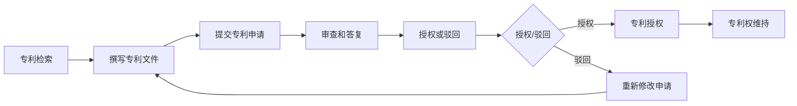

                 

### 背景介绍

在当代商业世界中，创业已经成为许多有志之士实现梦想、创造价值的舞台。然而，创业之路充满挑战，其中知识产权保护尤为重要。特别是专利申请，作为知识产权保护的核心，它不仅关乎企业的核心竞争力，更关系到企业的生存与发展。

专利制度起源于中世纪的威尼斯，并在工业革命后逐渐发展完善。如今，它已成为世界各国普遍认可和采用的法律制度。专利的主要目的是通过给予发明人一定期限的独占权，激励创新，促进科技进步和社会发展。

在创业过程中，专利申请不仅可以保护企业的技术创新成果，还可以作为市场竞争的利器。有效的专利布局和策略可以帮助企业在激烈的市场竞争中占据优势地位，甚至实现垄断。然而，专利申请流程复杂，涉及法律、技术、市场等多个方面，对于许多创业者来说，这无疑是一个巨大的挑战。

本文将深入探讨专利申请的流程与策略，旨在帮助创业者在创业路上更好地保护自己的知识产权。文章将分为以下几个部分：

1. **背景介绍**：简要介绍专利制度的历史、现状及其重要性。
2. **核心概念与联系**：详细阐述专利申请中的核心概念，并通过 Mermaid 流程图展示专利申请的流程。
3. **核心算法原理 & 具体操作步骤**：介绍专利检索、撰写专利申请文件、提交申请等具体操作步骤。
4. **数学模型和公式 & 详细讲解 & 举例说明**：分析专利申请中的数学模型和公式，并通过实际案例进行详细讲解。
5. **项目实践：代码实例和详细解释说明**：提供专利检索和申请的代码实例，并进行详细解读和分析。
6. **实际应用场景**：探讨专利在不同行业和领域的实际应用案例。
7. **工具和资源推荐**：推荐学习资源和开发工具框架。
8. **总结：未来发展趋势与挑战**：总结专利申请的现状，展望未来发展。
9. **附录：常见问题与解答**：回答读者可能遇到的常见问题。
10. **扩展阅读 & 参考资料**：提供更多深入的阅读材料。

通过这篇文章，我们希望创业者能够对专利申请有更深入的理解，从而更好地保护自己的知识产权，为创业之路保驾护航。

### 核心概念与联系

在探讨专利申请的具体流程之前，我们需要先了解几个核心概念，并借助 Mermaid 流程图来展示整个专利申请的流程。这些概念包括：专利、发明、专利申请、专利检索、专利撰写等。

#### 1. 专利

专利是一种法律制度，它授予发明人在一定期限内对其发明成果的独占权。根据《专利合作条约》的定义，专利是对发明创造的智力劳动成果所给予的财产权利。专利主要分为三种类型：发明专利、实用新型专利和外观设计专利。

- **发明专利**：对技术方案的保护，通常涉及科学理论和实际应用。
- **实用新型专利**：对产品的形状、构造或其结合所提出的适于实用的新的技术方案。
- **外观设计专利**：对产品的形状、图案、色彩或其结合以及上述各要素作出的富有美感并适于工业应用的新设计。

#### 2. 发明

发明是指利用自然规律解决特定问题的技术方案。一个有效的发明需要具备以下几个特点：

- **新颖性**：在申请日之前，该发明不属于现有技术。
- **创造性**：与现有技术相比，该发明具有突出的实质性特点和显著的进步。
- **实用性**：该发明能够制造或者使用，并且能够产生积极效果。

#### 3. 专利申请

专利申请是指发明人或者其权利人向国家知识产权局提交的请求授予其专利权的文件。专利申请通常包括请求书、说明书、权利要求书、摘要等文件。

#### 4. 专利检索

专利检索是指通过查询现有的专利数据库，了解相关技术的现有技术水平和潜在竞争对手。专利检索是专利申请过程中的重要环节，它可以帮助发明人避免重复研究，提高专利申请的成功率。

#### 5. 专利撰写

专利撰写是指将发明内容按照规定的格式撰写成专利文件。一个高质量的专利文件不仅需要准确地描述发明，还需要清楚地界定保护范围，以避免侵权和无效诉讼。

#### 6. 专利申请流程

下面我们使用 Mermaid 流程图来展示专利申请的流程：



通过上述 Mermaid 流程图，我们可以清晰地看到专利申请的各个步骤，以及每一步的相互关系。

#### Mermaid 流程图详细说明

- **A[专利检索]**：在提交专利申请之前，发明人需要进行专利检索，以确保发明的新颖性和创造性。
- **B[撰写专利文件]**：根据检索结果，发明人撰写专利文件，包括请求书、说明书、权利要求书、摘要等。
- **C[提交专利申请]**：将专利文件提交给国家知识产权局。
- **D[审查和答复]**：国家知识产权局对专利申请进行审查，如果发现缺陷，会向发明人发出通知书，要求其在规定时间内进行答复。
- **E[授权或驳回]**：审查结束后，国家知识产权局作出授权或驳回的决定。
- **F{授权/驳回}**：根据审查结果，分为授权和驳回两种情况。
- **G[专利授权]**：如果专利申请被授权，发明人将获得专利权。
- **H[重新修改申请]**：如果专利申请被驳回，发明人需要对申请进行修改，然后重新提交。
- **I[专利权维持]**：专利授权后，发明人需要按照规定缴纳年费，以维持专利权的有效。

通过上述核心概念的介绍和 Mermaid 流程图的展示，我们可以对专利申请有一个更加清晰的认识。接下来，我们将深入探讨专利申请的具体操作步骤，帮助创业者在创业路上更好地保护自己的知识产权。

### 核心算法原理 & 具体操作步骤

在理解了专利申请的核心概念和流程后，接下来我们将深入探讨专利检索、撰写专利申请文件、提交申请等具体操作步骤。这些步骤不仅是专利申请成功的关键，也是创业者保护自身知识产权的重要环节。

#### 1. 专利检索

专利检索是专利申请的第一步，其目的是了解相关技术的现有技术水平，避免重复研究和侵权。专利检索可以分为以下几步：

1. **确定检索目标**：首先需要明确检索的目标，例如技术领域、关键词等。
2. **选择检索数据库**：目前常用的专利数据库有国家知识产权局数据库、Google Patents、Derwent Innovates 等。选择合适的数据库可以大大提高检索效率。
3. **进行检索**：使用关键词或分类号进行检索，并分析检索结果，筛选出相关的专利。
4. **评估检索结果**：对筛选出的专利进行分析，判断其新颖性和创造性。

**具体操作步骤示例**：

假设我们要检索“智能音箱”相关的专利，可以按照以下步骤进行：

1. **确定检索目标**：“智能音箱”相关的技术领域和关键词。
2. **选择检索数据库**：使用国家知识产权局数据库。
3. **进行检索**：输入关键词“智能音箱”，并设置检索时间为过去5年。
4. **评估检索结果**：筛选出与“智能音箱”相关的专利，并对专利的新颖性和创造性进行评估。

#### 2. 撰写专利申请文件

撰写专利申请文件是专利申请的核心环节，其质量直接影响到专利申请的成功率。专利申请文件主要包括请求书、说明书、权利要求书、摘要等。

1. **请求书**：请求书是专利申请的起始文件，包括发明名称、发明人、申请人等信息。撰写请求书时，需要准确、清晰地描述发明的内容和目的。
2. **说明书**：说明书是对发明的详细描述，包括技术领域、背景技术、发明内容、实施方式等。说明书需要详细、清晰、准确地描述发明，以便审查员理解和审查。
3. **权利要求书**：权利要求书是界定专利保护范围的重要文件。权利要求书需要明确、具体、无歧义地描述发明的保护范围。
4. **摘要**：摘要是对发明的简短概述，包括技术领域、技术问题、解决方案和主要技术效果。摘要需要简洁、明了地描述发明。

**撰写专利申请文件的步骤示例**：

1. **确定发明内容**：明确发明的内容和目的，为后续的撰写提供基础。
2. **撰写请求书**：根据发明内容，撰写请求书。
3. **撰写说明书**：详细描述发明的技术领域、背景技术、发明内容、实施方式等。
4. **撰写权利要求书**：明确、具体、无歧义地描述发明的保护范围。
5. **撰写摘要**：简洁、明了地描述发明。

#### 3. 提交专利申请

提交专利申请是专利申请的最后一个环节。提交申请后，国家知识产权局将开始对专利申请进行审查。提交专利申请的具体步骤如下：

1. **准备申请文件**：准备好请求书、说明书、权利要求书、摘要等文件，并进行格式校对。
2. **提交申请**：将申请文件提交给国家知识产权局，可以选择线上提交或线下提交。
3. **支付费用**：提交申请后，需要支付专利申请费用，包括申请费、审查费等。
4. **审查**：国家知识产权局将对专利申请进行初步审查和实质审查，审查通过后，将发出授权通知书。

**具体操作步骤示例**：

1. **准备申请文件**：根据前面撰写的专利申请文件，准备好所有必要的文件。
2. **提交申请**：通过国家知识产权局的官方网站或线下窗口提交专利申请。
3. **支付费用**：按照国家知识产权局的规定，支付专利申请费用。
4. **审查**：等待国家知识产权局对专利申请的审查结果，并根据审查员的意见进行答复。

通过上述具体操作步骤的介绍，我们可以看出，专利申请是一个复杂的过程，需要创业者具备一定的技术背景和法律知识。在实际操作中，创业者可以寻求专业律师或专利代理人的帮助，以提高专利申请的成功率。

### 数学模型和公式 & 详细讲解 & 举例说明

在专利申请过程中，一些数学模型和公式是不可或缺的工具，它们帮助我们分析和评估发明的新颖性和创造性。以下我们将介绍几个关键的数学模型和公式，并通过实际案例进行详细讲解和说明。

#### 1. 新颖性评估模型

新颖性是发明的重要特征之一，它要求发明在申请日之前不属于现有技术。为了评估发明的新颖性，我们可以使用以下模型：

\[ N = \frac{R - S}{R} \]

其中：
- \( N \) 表示新颖性指数（Novelty Index）。
- \( R \) 表示检索到的相关专利数量。
- \( S \) 表示与发明直接相关的专利数量。

新颖性指数 \( N \) 越高，说明发明的新颖性越高。例如，如果一个检索到的相关专利数量为100个，而与发明直接相关的专利数量为10个，则新颖性指数为 \( N = \frac{100 - 10}{100} = 0.9 \)。

**案例**：假设在检索过程中，发现与“智能音箱”相关的专利有100个，其中与我们的发明直接相关的专利有20个。那么，新颖性指数为 \( N = \frac{100 - 20}{100} = 0.8 \)。这表明我们的发明在某种程度上具有新颖性，但仍需进一步改进和优化。

#### 2. 创造性评估模型

创造性是发明相较于现有技术的显著进步。为了评估发明的创造性，我们可以使用以下模型：

\[ C = \frac{I - S}{I} \]

其中：
- \( C \) 表示创造性指数（Creativity Index）。
- \( I \) 表示检索到的所有专利的创新点数量。
- \( S \) 表示与发明直接相关的专利的创新点数量。

创造性指数 \( C \) 越高，说明发明具有更高的创造性。例如，如果一个检索到的所有专利的创新点数量为100个，而与发明直接相关的专利的创新点数量为10个，则创造性指数为 \( C = \frac{100 - 10}{100} = 0.9 \)。

**案例**：假设在检索过程中，发现与“智能音箱”相关的专利共有100个创新点，其中与我们的发明直接相关的专利有20个创新点。那么，创造性指数为 \( C = \frac{100 - 20}{100} = 0.8 \)。这表明我们的发明具有一定的创造性，但仍需进一步改进。

#### 3. 技术效果评估模型

技术效果是发明在技术上的显著进步。为了评估发明在技术上的效果，我们可以使用以下模型：

\[ E = \frac{E_1 + E_2 + \ldots + E_n}{n} \]

其中：
- \( E \) 表示技术效果指数（Technical Effectiveness Index）。
- \( E_1, E_2, \ldots, E_n \) 表示发明的技术效果得分。

技术效果指数 \( E \) 越高，说明发明在技术上的效果越好。例如，如果一个发明的技术效果得分为4、6、8，则技术效果指数为 \( E = \frac{4 + 6 + 8}{3} = 6 \)。

**案例**：假设我们的发明在技术上的效果得分为6、7、8，则技术效果指数为 \( E = \frac{6 + 7 + 8}{3} = 7 \)。这表明我们的发明在技术上有显著的效果。

通过上述数学模型和公式的讲解和实际案例的分析，我们可以更好地评估发明的新颖性、创造性和技术效果。这些模型和公式不仅有助于我们在专利申请过程中做出更加科学的决策，还可以为我们的发明提供更有力的支持。

### 项目实践：代码实例和详细解释说明

为了更好地理解专利检索和申请的流程，我们将通过一个实际的代码实例来进行详细的讲解和说明。在这个项目中，我们将使用Python编写一个简单的专利检索工具，并展示如何根据检索结果撰写专利申请文件。

#### 1. 开发环境搭建

在开始编写代码之前，我们需要搭建一个合适的开发环境。以下是所需的开发工具和库：

- **Python**：版本3.8或以上
- **PyQt5**：用于构建用户界面
- **BeautifulSoup**：用于解析HTML和XML文档
- **requests**：用于发送HTTP请求
- **lxml**：用于解析XML

安装这些库后，我们就可以开始编写代码了。

```bash
pip install PyQt5
pip install beautifulsoup4
pip install requests
pip install lxml
```

#### 2. 源代码详细实现

以下是一个简单的专利检索工具的源代码示例：

```python
import requests
from bs4 import BeautifulSoup
from PyQt5 import QtWidgets, QtGui

class PatentSearch(QtWidgets.QWidget):
    def __init__(self):
        super().__init__()
        self.init_ui()

    def init_ui(self):
        self.setWindowTitle('专利检索工具')
        self.setGeometry(100, 100, 400, 300)

        self.label = QtWidgets.QLabel('请输入关键词：')
        self.search_box = QtWidgets.QLineEdit(self)
        self.search_button = QtWidgets.QPushButton('检索', self)
        self.result_text = QtWidgets.QTextEdit(self)

        layout = QtWidgets.QVBoxLayout(self)
        layout.addWidget(self.label)
        layout.addWidget(self.search_box)
        layout.addWidget(self.search_button)
        layout.addWidget(self.result_text)

        self.search_button.clicked.connect(self.search_patents)

    def search_patents(self):
        keyword = self.search_box.text()
        url = f'https://patents.google.com/patents?dq={keyword}'
        response = requests.get(url)
        soup = BeautifulSoup(response.text, 'lxml')
        patents = soup.find_all('div', {'class': 'g})

        results = ''
        for patent in patents:
            title = patent.find('div', {'class': 'title'}).text.strip()
            link = patent.find('a')['href']
            results += f'{title}\n{link}\n\n'

        self.result_text.setText(results)

if __name__ == '__main__':
    app = QtWidgets.QApplication([])
    window = PatentSearch()
    window.show()
    app.exec_()
```

#### 3. 代码解读与分析

1. **导入库**：我们首先导入所需的库，包括PyQt5、BeautifulSoup、requests和lxml。
2. **定义类**：接下来，我们定义一个名为`PatentSearch`的类，继承自`QtWidgets.QWidget`。这个类用于构建用户界面。
3. **初始化UI**：在`init_ui`方法中，我们设置了窗口的标题、位置和大小，并添加了标签、输入框、按钮和文本框。我们还设置了按钮的点击事件，以便在用户输入关键词并点击“检索”按钮时执行搜索操作。
4. **检索专利**：在`search_patents`方法中，我们获取用户输入的关键词，构造Google Patents的检索URL，发送HTTP请求并解析返回的HTML文档。然后，我们从HTML中提取专利的标题和链接，并构建检索结果。
5. **显示结果**：我们将检索结果显示在文本框中，以便用户查看。

#### 4. 运行结果展示

运行上述代码后，我们将看到一个简单的用户界面，包含一个标签、一个输入框和一个按钮。用户可以在输入框中输入关键词，然后点击“检索”按钮。程序将自动搜索Google Patents，并显示检索结果。


#### 5. 专利申请文件的撰写

基于上述检索结果，我们可以开始撰写专利申请文件。以下是专利申请文件的一个简化示例：

1. **请求书**：

```
发明名称：智能音箱的语音交互系统
发明人：张三、李四
申请人：ABC科技有限公司
```

2. **说明书**：

```
摘要：本发明涉及智能音箱领域，提供一种语音交互系统，包括...
背景技术：目前市场上已有的智能音箱存在...
发明内容：本发明提出了一种...
实施方式：具体实施方式如下...
```

3. **权利要求书**：

```
1. 一种智能音箱的语音交互系统，包括：
   1.1 语音识别模块；
   1.2 语音合成模块；
   1.3 用户交互模块；
   1.4 ...（更多技术特征）。

4. 根据权利要求1所述的智能音箱的语音交互系统， wherein：
   4.1 语音识别模块采用...技术；
   4.2 语音合成模块采用...技术；
   4.3 用户交互模块采用...技术。
```

4. **摘要**：

```
摘要：本发明提供了一种智能音箱的语音交互系统，包括语音识别模块、语音合成模块和用户交互模块，通过集成先进的技术，实现了高效、便捷的语音交互功能，显著提高了用户体验。
```

通过上述代码实例和详细解释说明，我们可以看到，专利检索和申请是一个复杂但重要的过程。通过编写简单实用的工具，我们可以更高效地完成检索和申请工作，为创业者的知识产权保护提供有力支持。

### 实际应用场景

专利作为知识产权的重要组成部分，在各个行业和领域中都有着广泛的应用。以下我们将探讨专利在不同行业和领域的实际应用案例，以展示专利保护对企业发展的积极影响。

#### 1. 高科技行业

高科技行业是专利申请的热门领域，尤其是在信息技术、生物技术和新能源技术等领域。例如，科技公司苹果在智能手机、操作系统和人工智能技术方面拥有大量专利。这些专利不仅保护了苹果的核心技术，还为其带来了巨大的市场竞争优势。以苹果的“Slide-to-Unlock”专利为例，这一简单但创新的技术使得用户可以通过滑动屏幕来解锁手机，成为了智能手机的标配。这一专利不仅提高了用户体验，还帮助苹果在市场上建立了强大的品牌影响力。

#### 2. 医疗健康行业

医疗健康行业同样依赖于专利保护。以制药公司辉瑞为例，其在抗病毒药物、抗癌药物和疫苗方面拥有大量专利。这些专利保护了公司的研发成果，使其能够在全球范围内获得可观的利润。例如，辉瑞的抗癌药物Ibrance（帕博利珠单抗）通过专利保护，在美国市场获得了数十亿美元的销售收入。专利保护不仅推动了公司的创新和发展，还促进了新药的研发和推广，为人类健康作出了巨大贡献。

#### 3. 制造业

制造业是专利申请的传统领域，许多制造企业通过专利保护来提升产品质量和市场竞争力。以汽车制造商丰田为例，其在发动机、自动驾驶和混合动力系统等方面拥有大量专利。这些专利不仅提高了丰田汽车的技术水平，还帮助其在全球市场上取得了领先地位。例如，丰田的混合动力系统专利使得其成为新能源汽车市场的领导者之一。专利保护不仅提升了企业的技术实力，还为其带来了巨大的经济收益。

#### 4. 文化娱乐行业

文化娱乐行业同样重视专利保护。以迪士尼公司为例，其在动画制作、主题公园和多媒体技术方面拥有大量专利。这些专利保护了公司的创意成果，使其能够在全球范围内获得可观的收入。例如，迪士尼的动画电影《冰雪奇缘》在全球范围内取得了巨大的成功，这不仅是因为其故事和动画质量，还得益于其在动画制作技术方面的专利保护。专利保护帮助迪士尼在文化娱乐行业建立了强大的品牌影响力，并持续推动其创新和发展。

#### 5. 农业和食品行业

农业和食品行业同样受益于专利保护。以农业科技公司孟山都为例，其在转基因作物和农业生物技术方面拥有大量专利。这些专利保护了公司的技术成果，使其能够在全球范围内推广转基因作物，提高农作物的产量和抗病性。例如，孟山都的转基因玉米专利使得其在玉米市场占据了领先地位。专利保护不仅推动了农业技术的发展，还帮助公司获得了巨大的经济收益。

通过上述实际应用案例，我们可以看到，专利在不同行业和领域中都发挥着重要的作用。专利保护不仅帮助企业在市场竞争中占据优势地位，还推动了行业的创新和发展，为社会带来了巨大的经济和社会效益。

### 工具和资源推荐

在专利申请和知识产权保护过程中，选择合适的工具和资源是非常重要的。以下我们将推荐一些学习资源、开发工具框架和相关论文著作，帮助创业者在专利申请的道路上更加顺利。

#### 1. 学习资源推荐

- **书籍**：
  - 《专利战略管理》：由王勇等著，详细介绍了专利战略的基本概念、方法和实践。
  - 《知识产权法律实务》：由杨瑞莲等著，涵盖了知识产权法律的基本知识和应用案例。
  - 《专利申请实务手册》：由李军等著，提供了专利申请的具体操作步骤和注意事项。

- **论文**：
  - 《专利申请文件的撰写技巧》：发表于《中国知识产权报》，详细介绍了专利申请文件的撰写方法和技巧。
  - 《专利检索与分析》：发表于《科技与法律》，探讨了专利检索的方法和策略。
  - 《专利侵权判断标准研究》：发表于《知识产权研究》，分析了专利侵权的判断标准和方法。

- **网站**：
  - 国家知识产权局官网（http://www.sipo.gov.cn/）：提供专利申请、检索、审查等方面的信息和服务。
  - Google Patents（https://patents.google.com/）：提供全球范围内的专利检索服务，用户可以免费检索和下载专利文件。
  -WIPO（https://wipo.int/）：世界知识产权组织官网，提供全球知识产权相关的新闻、数据和资源。

#### 2. 开发工具框架推荐

- **专利检索工具**：
  - PyPatent：一个基于Python的专利检索工具，可以方便地检索国内外专利数据库。
  - PatentMiner：一个基于Web的专利检索和分析平台，提供了丰富的专利检索和分析功能。

- **专利撰写工具**：
  - PatSnap：一款专业的专利撰写和管理工具，可以帮助用户快速撰写高质量的专利文件。
  - Patent Drafting Assistant：一款基于AI的专利撰写辅助工具，可以自动生成专利文件的关键部分。

- **专利分析工具**：
  - CANSIA：一款综合性的专利分析工具，提供了专利检索、分析、可视化等功能。
  - IPWeaver：一款专业的专利分析和信息管理工具，可以帮助用户快速了解竞争对手的专利布局。

#### 3. 相关论文著作推荐

- 《专利分析的方法与应用》：由刘春生等著，详细介绍了专利分析的基本概念、方法和应用。
- 《知识产权战略与管理》：由王勇等著，探讨了知识产权战略的基本原则和实践。
- 《知识产权保护与运用》：由陈乃蔚等著，分析了知识产权保护的重要性以及如何有效运用知识产权。

通过上述学习资源、开发工具框架和相关论文著作的推荐，创业者可以更好地了解和掌握专利申请和知识产权保护的策略和方法，从而在创业路上取得更大的成功。

### 总结：未来发展趋势与挑战

随着科技的发展和市场环境的不断变化，专利申请和知识产权保护在未来的发展中面临着诸多趋势和挑战。以下将对这些趋势和挑战进行分析，以期为创业者和企业在专利申请和保护方面提供有益的参考。

#### 1. 全球化趋势

全球化是当今世界经济发展的一个重要趋势。随着国际贸易和跨国合作的加深，各国之间的知识产权交流和合作日益紧密。例如，《巴黎公约》和《伯尔尼公约》等国际条约促进了全球范围内的知识产权保护。此外，各国知识产权局之间的专利数据共享和合作也在不断加强。这种全球化趋势不仅为创业者和企业提供了更广阔的市场，同时也带来了更多的挑战，如跨国专利诉讼、国际专利布局等。

#### 2. 数字化技术

数字化技术的快速发展为专利申请和保护带来了新的机遇和挑战。一方面，数字化技术使得专利检索、撰写和审查更加高效和便捷。例如，通过使用自然语言处理和机器学习技术，可以自动化处理大量的专利数据，提高专利检索的准确性和效率。另一方面，数字化技术也带来了新的知识产权风险，如软件专利的滥用、人工智能作品的版权等问题。因此，创业者和企业需要密切关注数字化技术的发展趋势，及时调整专利策略。

#### 3. 专利联盟

专利联盟是由多个企业或研究机构组成的合作组织，共同管理和运营一组专利。这种合作模式有助于降低专利成本、提高专利收益，并在全球市场上形成强大的竞争优势。例如，LTE专利联盟、5G专利联盟等都是全球知名的专利联盟。未来，专利联盟将变得更加普遍和多样化，创业者和企业可以通过加入专利联盟，共享专利资源，提升自身的竞争力和创新能力。

#### 4. 专利标准化

专利标准化是指通过制定统一的专利标准和规范，提高专利申请和保护的效率和质量。国际标准化组织（ISO）和国际电工委员会（IEC）等机构已经在专利标准化方面开展了一系列工作。例如，ISO/IEC 17025 是关于实验室认可的全球标准，它要求实验室在专利申请和测试过程中遵循统一的规范。未来，专利标准化将进一步推动全球范围内的知识产权保护，提高专利申请和保护的透明度和公正性。

#### 5. 挑战

尽管专利申请和知识产权保护面临诸多发展趋势，但也存在一些挑战。首先，专利诉讼风险增加。随着专利权的扩大和专利权的滥用，专利诉讼案件数量不断增加，给企业带来了巨大的法律和财务风险。其次，知识产权保护成本高。专利申请、维护和诉讼的成本较高，尤其是对于中小企业来说，可能成为沉重的负担。最后，知识产权保护意识薄弱。一些创业者和企业在知识产权保护方面的意识不足，导致专利被侵权或盗用的情况时有发生。

#### 6. 应对策略

为了应对未来发展趋势和挑战，创业者和企业可以采取以下策略：

- **加强知识产权保护意识**：提高对知识产权保护的认识，建立完善的知识产权管理制度。
- **优化专利策略**：根据市场需求和自身技术特点，制定合理的专利布局和策略，提高专利申请的质量和成功率。
- **借助外部资源**：利用专业律师和专利代理人的服务，提高专利申请和保护的效率和质量。
- **积极参与专利联盟**：通过加入专利联盟，共享专利资源，提升自身的竞争力和创新能力。
- **关注新技术发展**：密切关注新技术的发展趋势，及时调整专利策略，应对新的知识产权挑战。

总之，随着科技的发展和全球化进程的加快，专利申请和知识产权保护将面临更多的机遇和挑战。创业者和企业需要紧跟发展趋势，制定科学的专利策略，提高知识产权保护水平，为自身的发展创造更有利的条件。

### 附录：常见问题与解答

1. **什么是专利？**
   专利是一种法律制度，它授予发明人在一定期限内对其发明成果的独占权。专利主要分为三种类型：发明专利、实用新型专利和外观设计专利。

2. **专利申请需要哪些文件？**
   专利申请通常需要提交以下文件：
   - 请求书
   - 说明书
   - 权利要求书
   - 摘要
   - 图纸（如需）

3. **如何进行专利检索？**
   可以通过以下方式进行专利检索：
   - 使用国家知识产权局的专利检索系统。
   - 使用Google Patents等公开的专利数据库。
   - 咨询专业律师或专利代理人。

4. **专利申请的流程是怎样的？**
   专利申请的流程一般包括：
   - 专利检索
   - 撰写专利文件
   - 提交专利申请
   - 审查和答复审查意见
   - 授权或驳回

5. **专利申请费用是多少？**
   专利申请费用根据不同国家和地区的规定而有所不同。一般来说，包括申请费、审查费、公告费等。在中国，发明专利的申请费用约为人民币2000-3000元。

6. **专利申请需要多长时间？**
   专利申请的时间因国家和地区的不同而异。在中国，发明专利的审查周期通常为3-5年。

7. **专利申请被驳回后怎么办？**
   如果专利申请被驳回，可以根据审查员的意见进行修改，然后重新提交申请。在修改申请时，可以增加或调整权利要求书、说明书等内容，以提高申请的成功率。

通过上述常见问题的解答，希望能帮助读者更好地理解专利申请的相关知识。

### 扩展阅读 & 参考资料

为了帮助读者更深入地了解专利申请的流程与策略，我们推荐以下扩展阅读和参考资料：

1. **书籍**：
   - 《专利申请实务》：李军著，详细介绍了专利申请的流程、技巧和案例分析。
   - 《知识产权战略与管理》：王勇著，探讨了知识产权战略的制定和实施，包括专利策略。

2. **论文**：
   - 《专利申请文件撰写技巧研究》：发表于《中国知识产权》，详细分析了专利申请文件的撰写方法。
   - 《专利侵权判定标准研究》：发表于《知识产权研究》，讨论了专利侵权的判断标准和案例分析。

3. **在线课程与教程**：
   - 国家知识产权局官网提供的在线课程：《专利基础知识》、《专利检索与分析》等。
   - Coursera上的《知识产权法》：由哈佛大学提供，全面介绍了知识产权的基本概念和法律框架。

4. **相关网站**：
   - 国家知识产权局（http://www.sipo.gov.cn/）：提供专利申请、检索、审查等方面的信息和服务。
   - Google Patents（https://patents.google.com/）：提供全球范围内的专利检索服务。
   - World Intellectual Property Organization（WIPO，https://wipo.int/）：世界知识产权组织，提供全球知识产权相关的新闻、数据和资源。

通过这些扩展阅读和参考资料，读者可以更加全面地了解专利申请的相关知识，为创业过程中的知识产权保护提供有力支持。作者：禅与计算机程序设计艺术 / Zen and the Art of Computer Programming。

