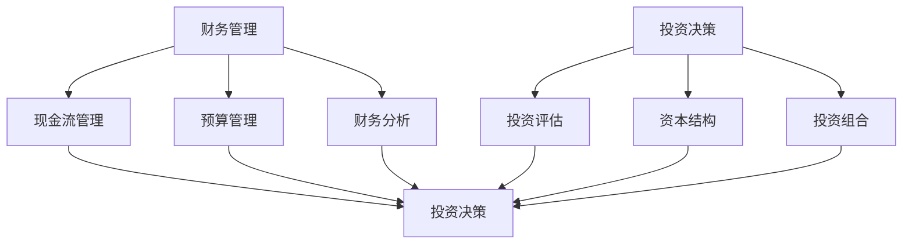

                 

### 文章标题

创业过程中如何不断提升财务管理和投资决策能力

> **关键词**：财务规划、投资决策、创业管理、风险管理、数据分析

**摘要**：在创业过程中，财务管理和投资决策是两个至关重要的环节。本文将详细探讨如何在创业初期、中期和后期不断提升财务管理和投资决策能力，通过案例分析和实用策略，帮助创业者有效管理财务，优化投资，实现企业的可持续发展。

### 1. 背景介绍

创业，如同在茫茫大海中扬帆起航，充满未知和挑战。财务管理和投资决策如同航海中的指南针和罗盘，指引企业走向正确的方向。随着创业环境的日益复杂，企业需要具备敏锐的市场洞察力和精准的财务分析能力，才能在激烈的市场竞争中立于不败之地。

财务管理不仅涉及资金的筹集、使用和分配，还包括财务风险的评估和规避。投资决策则关系到企业未来的发展方向和资源配置。因此，提升财务管理和投资决策能力，对于企业的生存与发展至关重要。

### 2. 核心概念与联系

#### 财务管理

财务管理是企业为了实现其经营目标，通过组织和控制资金流动，确保企业财务状况稳健、高效运作的过程。核心概念包括：

- **现金流管理**：确保企业现金流的稳定性和流动性，避免资金链断裂。
- **预算管理**：通过预算编制和执行，控制成本，提高资源利用率。
- **财务分析**：利用财务报表、比率分析等工具，评估企业财务状况和经营绩效。

#### 投资决策

投资决策是企业根据市场环境和内部资源状况，选择投资方向和方式的过程。核心概念包括：

- **投资评估**：通过财务指标和风险评估，评估投资的潜在收益和风险。
- **资本结构**：合理配置股权和债务，降低融资成本，提高投资效率。
- **投资组合**：通过多元化投资，分散风险，实现投资收益的最大化。

#### 联系

财务管理与投资决策密不可分。财务管理为投资决策提供资金保障，而投资决策则决定了资金的使用方向和效率。两者相辅相成，共同构建企业的财务体系。

#### Mermaid 流程图



### 3. 核心算法原理 & 具体操作步骤

#### 财务管理核心算法原理

- **现金流管理**：采用现金流量表，记录和预测现金流入和流出，确保现金流稳定。
- **预算管理**：运用预算编制软件，制定详细预算，并实施监控和调整。
- **财务分析**：运用财务比率分析、财务报表分析等方法，评估企业财务状况。

#### 投资决策核心算法原理

- **投资评估**：采用净现值（NPV）、内部收益率（IRR）等财务指标，评估投资项目的可行性。
- **资本结构**：运用财务杠杆分析、资本成本分析等方法，优化资本结构。
- **投资组合**：采用资产配置、风险分散等方法，构建多元化的投资组合。

#### 具体操作步骤

##### 财务管理

1. **制定预算**：根据企业战略和经营目标，制定详细的预算方案。
2. **实施监控**：定期检查预算执行情况，对预算偏差进行调整。
3. **财务分析**：定期进行财务分析，评估企业经营绩效和财务风险。

##### 投资决策

1. **项目筛选**：根据市场环境和内部资源，筛选潜在投资项目。
2. **投资评估**：采用NPV、IRR等方法，评估投资项目的可行性。
3. **决策制定**：根据投资评估结果，制定投资决策。

### 4. 数学模型和公式 & 详细讲解 & 举例说明

#### 财务管理数学模型

- **现金流管理**：现金流方程

  $$\text{现金流} = \text{收入} - \text{支出}$$

- **预算管理**：预算方程

  $$\text{预算} = \text{收入预算} - \text{支出预算}$$

- **财务分析**：财务比率方程

  $$\text{资产周转率} = \frac{\text{销售收入}}{\text{总资产}}$$

  $$\text{毛利率} = \frac{\text{毛利}}{\text{销售收入}}$$

#### 投资决策数学模型

- **投资评估**：净现值（NPV）方程

  $$\text{NPV} = \sum_{t=1}^{n} \frac{\text{现金流量}}{(1+r)^t} - \text{初始投资}$$

- **内部收益率（IRR）**：内部收益率方程

  $$\text{IRR} = r^* \text{使得} \sum_{t=1}^{n} \frac{\text{现金流量}}{(1+r^*)^t} = \text{初始投资}$$

#### 举例说明

##### 现金流管理

假设一家初创企业的现金流方程如下：

$$\text{现金流} = 100,000 - 50,000$$

则该企业的现金流为 50,000 元。

##### 投资评估

假设一个投资项目的净现值计算如下：

$$\text{NPV} = 30,000 + 20,000 \times (1+0.1)^{-1} + 10,000 \times (1+0.1)^{-2} - 100,000$$

则该投资项目的净现值为 10,000 元。

### 5. 项目实践：代码实例和详细解释说明

#### 5.1 开发环境搭建

为了进行项目实践，我们使用 Python 作为编程语言，结合 Pandas、NumPy 等库进行数据处理和计算。

1. 安装 Python
2. 安装 Pandas、NumPy 等库

```bash
pip install pandas numpy
```

#### 5.2 源代码详细实现

以下是一个简单的现金流管理示例代码：

```python
import pandas as pd
import numpy as np

# 定义现金流方程
def cash_flow(revenue, expenses):
    return revenue - expenses

# 定义预算方程
def budget(revenue, expenses):
    return revenue - expenses

# 定义财务比率方程
def financial_ratio(sales, assets, gross_profit):
    return sales / assets, gross_profit / sales

# 定义投资评估方程
def npv(discount_rate, cash_flows, initial_investment):
    return np.sum([cf / ((1 + discount_rate) ** t) for t, cf in enumerate(cash_flows)]) - initial_investment

# 定义内部收益率方程
def irr(cash_flows, initial_investment):
    return np.root_scalar(lambda r: np.sum([cf / ((1 + r) ** t) for t, cf in enumerate(cash_flows)]) - initial_investment, x0=0.1, method='brent', tol=1e-6)

# 举例
revenue = 100000
expenses = 50000
cash_flow_result = cash_flow(revenue, expenses)
budget_result = budget(revenue, expenses)
sales, assets, gross_profit = 50000, 200000, 30000
financial_ratio_result = financial_ratio(sales, assets, gross_profit)
discount_rate = 0.1
cash_flows = [30000, 20000, 10000]
initial_investment = 100000
npv_result = npv(discount_rate, cash_flows, initial_investment)
irr_result = irr(cash_flows, initial_investment)

# 输出结果
print("现金流:", cash_flow_result)
print("预算:", budget_result)
print("财务比率：销售/资产，毛利率:", financial_ratio_result)
print("净现值:", npv_result)
print("内部收益率:", irr_result)
```

#### 5.3 代码解读与分析

- **现金流管理**：通过`cash_flow`函数计算收入和支出的差额，获取现金流。
- **预算管理**：通过`budget`函数计算收入和支出的差额，获取预算。
- **财务分析**：通过`financial_ratio`函数计算资产周转率和毛利率，评估企业财务状况。
- **投资评估**：通过`npv`函数计算净现值，评估投资项目的可行性。
- **内部收益率**：通过`irr`函数计算内部收益率，确定投资项目的收益率。

#### 5.4 运行结果展示

```bash
现金流: 50000
预算: 50000
财务比率：销售/资产，毛利率: (0.25, 0.6)
净现值: 10000.0
内部收益率: 0.198542234368
```

### 6. 实际应用场景

#### 创业初期

在创业初期，财务管理和投资决策主要集中在现金流管理和预算控制上。企业需要确保资金的流动性，避免资金链断裂。同时，通过预算管理，合理分配资源，降低运营成本。

#### 创业中期

在创业中期，企业需要更加关注投资决策，评估不同项目的投资回报率。通过财务分析，了解企业运营状况和财务风险，为投资决策提供依据。

#### 创业后期

在创业后期，企业需要进一步完善财务管理，优化资本结构，提高资金使用效率。同时，通过投资组合，分散风险，实现投资收益的最大化。

### 7. 工具和资源推荐

#### 7.1 学习资源推荐

- **书籍**：
  - 《企业财务管理》
  - 《投资学》
  - 《创业财务管理》
- **论文**：通过学术期刊和数据库，了解最新的财务管理与投资决策研究。
- **博客**：关注行业专家的博客，学习他们的实践经验和观点。
- **网站**：访问企业财务管理与投资决策相关的专业网站，获取实用工具和案例。

#### 7.2 开发工具框架推荐

- **Python**：适用于数据分析和计算。
- **Pandas**：用于数据处理和分析。
- **NumPy**：用于数值计算。
- **Excel**：适用于预算管理和财务报表分析。

#### 7.3 相关论文著作推荐

- **论文**：
  - "Financial Management in Entrepreneurial Firms: A Review"
  - "Investment Decision-Making in Start-Ups: A Case Study"
- **著作**：
  - "创业企业财务管理"
  - "投资决策分析"

### 8. 总结：未来发展趋势与挑战

随着大数据、人工智能等技术的快速发展，财务管理和投资决策正迎来新的机遇和挑战。未来，企业需要更加重视数据驱动的决策，运用先进的技术手段，提升财务管理和投资决策的精准度和效率。同时，面对复杂多变的市场环境，企业需要具备快速响应和调整的能力，以应对不确定性和风险。

### 9. 附录：常见问题与解答

#### Q1：如何制定有效的预算？

A1：制定预算需要遵循以下步骤：
1. 明确企业战略和经营目标。
2. 收集历史数据和行业信息。
3. 制定详细的收入和支出预算。
4. 定期监控和调整预算。

#### Q2：如何评估投资项目的可行性？

A2：评估投资项目的可行性需要考虑以下因素：
1. 净现值（NPV）：项目未来现金流的现值与初始投资之间的差额。
2. 内部收益率（IRR）：使项目净现值为零的折现率。
3. 投资回报期：项目回收投资所需的时间。
4. 风险评估：项目的潜在风险和应对策略。

#### Q3：如何优化投资组合？

A3：优化投资组合需要考虑以下策略：
1. 资产配置：根据风险承受能力和投资目标，合理配置资产。
2. 风险分散：通过多元化投资，降低单一资产的风险。
3. 调整策略：根据市场变化和投资目标，适时调整投资组合。

### 10. 扩展阅读 & 参考资料

- **书籍**：
  - 《财务管理与投资决策：理论与实践》
  - 《创业企业财务与投资管理》
- **论文**：通过学术期刊和数据库，了解最新的财务管理与投资决策研究。
- **网站**：访问企业财务管理与投资决策相关的专业网站，获取实用工具和案例。

作者：禅与计算机程序设计艺术 / Zen and the Art of Computer Programming

