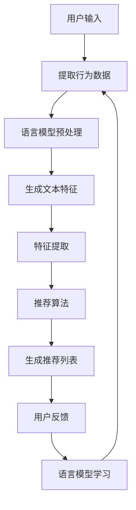

                 

### 1. 背景介绍

随着互联网技术的飞速发展，推荐系统已经成为各类在线平台中不可或缺的一部分。推荐系统能够根据用户的历史行为、兴趣爱好以及其他相关信息，为用户提供个性化的推荐结果，从而提升用户体验，增加平台粘性。

然而，传统的推荐系统通常面临以下几个问题：

1. **数据滞后性**：推荐系统通常基于用户的历史数据训练模型，但用户行为是动态变化的，历史数据可能无法及时反映用户的最新兴趣和需求。
2. **响应速度慢**：推荐系统的模型通常较为复杂，从用户行为数据中提取特征、训练模型并生成推荐结果需要较长的时间，无法满足实时推荐的需求。
3. **反馈效果不佳**：用户的反馈（如点击、评分、购买等）往往在推荐结果生成后一段时间才能获得，这使得系统难以根据即时反馈调整推荐策略。

为了解决上述问题，近年来，基于大型语言模型（LLM）的实时反馈处理技术逐渐受到关注。LLM具有强大的语言理解和生成能力，能够快速处理用户的输入，并生成针对性的推荐结果。此外，LLM还可以通过用户反馈进行在线学习，不断优化推荐效果。

本文旨在探讨如何利用LLM优化推荐系统的实时反馈处理。我们将从核心概念、算法原理、数学模型、项目实践、实际应用场景等多个角度进行分析，旨在为读者提供全面的技术指南。

### 2. 核心概念与联系

#### 2.1 推荐系统的基本概念

推荐系统是一种信息过滤技术，通过分析用户的历史行为和偏好，为用户推荐可能感兴趣的项目（如商品、新闻、音乐等）。推荐系统通常包括以下几个关键组成部分：

1. **用户**：推荐系统的目标用户，其行为和偏好是系统推荐的关键依据。
2. **项目**：用户可能感兴趣的项目，如商品、音乐、新闻等。
3. **评分或行为**：用户对项目的评分或行为数据，如点击、购买、收藏等。
4. **推荐算法**：根据用户历史行为和项目特征生成推荐结果的算法。
5. **推荐结果**：推荐系统生成的个性化推荐列表。

#### 2.2 语言模型的基本概念

语言模型（Language Model，LM）是一种概率模型，用于预测一段文本的下一个单词或字符。在推荐系统中，语言模型可以用来预测用户对某个项目的兴趣程度。常用的语言模型包括：

1. **N-gram模型**：基于前N个单词的历史出现频率来预测下一个单词。
2. **神经网络模型**：如循环神经网络（RNN）和变换器（Transformer）等，通过学习大量的文本数据来生成文本序列。

#### 2.3 推荐系统与语言模型的结合

将语言模型应用于推荐系统，主要是通过以下两个方向：

1. **基于内容的推荐**：利用语言模型对项目的描述文本进行语义分析，提取项目的关键特征，然后根据用户的历史行为和特征相似度进行推荐。
2. **协同过滤推荐**：结合用户的评分和行为数据，利用语言模型预测用户对未知项目的兴趣程度，从而生成个性化推荐列表。

#### 2.4 Mermaid 流程图

以下是一个简化的Mermaid流程图，展示了推荐系统与语言模型的结合过程：



- A：用户输入，如搜索关键词或浏览行为。
- B：提取用户的行为数据。
- C：对用户行为数据进行分析，利用语言模型进行预处理。
- D：生成文本特征，如关键词、主题等。
- E：提取关键特征，为推荐算法提供输入。
- F：利用推荐算法（如协同过滤、基于内容的推荐等）生成推荐列表。
- G：生成个性化推荐列表。
- H：收集用户对推荐列表的反馈。
- I：利用用户的反馈，更新语言模型，提高推荐效果。

### 3. 核心算法原理 & 具体操作步骤

#### 3.1 语言模型的训练

语言模型的训练是整个系统的核心。以下是基于变换器（Transformer）的语言模型训练步骤：

1. **数据预处理**：收集大量的文本数据，进行清洗和预处理，包括去除停用词、分词、词性标注等。
2. **构建词汇表**：将处理后的文本数据构建成一个词汇表，为每个单词或字符分配一个唯一的ID。
3. **编码输入和输出**：将文本数据编码为序列，其中每个单词或字符用一个向量表示。
4. **训练模型**：利用训练数据，通过反向传播算法优化模型参数，使其能够更好地预测下一个单词或字符。

#### 3.2 推荐算法的设计

推荐算法的设计取决于数据的特点和应用场景。以下是几个常用的推荐算法：

1. **基于内容的推荐**：根据项目的特征和用户的兴趣进行推荐。具体步骤如下：
    - **项目特征提取**：利用语言模型提取项目的描述文本的语义特征。
    - **用户兴趣提取**：根据用户的历史行为和语言模型，提取用户的兴趣特征。
    - **推荐生成**：计算项目特征和用户兴趣的相似度，根据相似度生成推荐列表。

2. **协同过滤推荐**：根据用户的行为数据，利用语言模型预测用户对未知项目的兴趣程度。具体步骤如下：
    - **用户行为建模**：利用语言模型建模用户的行为数据。
    - **项目特征提取**：利用语言模型提取项目的特征。
    - **兴趣预测**：利用用户行为模型和项目特征，预测用户对未知项目的兴趣程度。
    - **推荐生成**：根据预测的兴趣程度生成推荐列表。

#### 3.3 实时反馈处理

实时反馈处理是推荐系统优化的重要环节。以下是利用LLM进行实时反馈处理的具体步骤：

1. **反馈数据收集**：收集用户的实时反馈，如点击、评分、购买等。
2. **反馈预处理**：利用语言模型对反馈数据进行分析和预处理，提取关键信息。
3. **模型更新**：利用用户的反馈数据，更新语言模型，使其能够更好地预测用户兴趣。
4. **推荐更新**：根据更新后的语言模型，重新生成推荐列表。

#### 3.4 实时反馈处理的挑战与解决方案

实时反馈处理面临以下几个挑战：

1. **数据量庞大**：用户的反馈数据量通常非常大，需要高效的存储和处理机制。
2. **实时性要求高**：反馈处理需要在短时间内完成，对系统的性能和响应速度有较高要求。
3. **模型更新频繁**：用户的反馈数据不断变化，需要频繁更新语言模型，以保证推荐效果。

解决方案如下：

1. **分布式存储和处理**：利用分布式存储和处理技术，如Hadoop、Spark等，提高系统的处理能力。
2. **增量更新**：采用增量更新技术，只更新语言模型的部分参数，减少计算量。
3. **高效模型**：选择高效的变换器（Transformer）模型，降低模型计算复杂度。

### 4. 数学模型和公式 & 详细讲解 & 举例说明

#### 4.1 语言模型的基本数学模型

语言模型的核心任务是预测下一个单词或字符的概率。以下是基于变换器（Transformer）的语言模型的基本数学模型：

假设我们有一个句子 \( s = w_1, w_2, ..., w_n \)，其中 \( w_i \) 表示句子中的第 \( i \) 个单词。变换器模型通过计算 \( w_i \) 出现在给定前 \( i-1 \) 个单词后的概率 \( P(w_i | w_1, w_2, ..., w_{i-1}) \) 来预测下一个单词。

变换器模型的主要组成部分包括：

1. **编码器（Encoder）**：将输入句子编码为一系列的向量。
2. **解码器（Decoder）**：根据编码器生成的向量，生成预测的单词序列。

编码器的输出 \( h_i \) 可以表示为：

\[ h_i = \text{softmax}(\text{Decoder}(e_i)) \]

其中，\( e_i \) 是编码器生成的向量，\(\text{softmax}\) 函数用于将向量转换为概率分布。

解码器的输出 \( p_i \) 可以表示为：

\[ p_i = \text{softmax}(\text{Encoder}(h_i)) \]

其中，\( h_i \) 是编码器的输出，\(\text{softmax}\) 函数用于将向量转换为概率分布。

#### 4.2 推荐系统的数学模型

推荐系统的数学模型主要涉及两个部分：用户兴趣建模和项目特征提取。

1. **用户兴趣建模**：

用户兴趣建模的目的是将用户的行为数据转换为用户兴趣向量。假设用户的行为数据为 \( U = \{u_1, u_2, ..., u_n\} \)，其中 \( u_i \) 表示用户对第 \( i \) 个项目的兴趣程度。我们可以使用一个矩阵 \( W \) 来表示用户的兴趣向量：

\[ W = \begin{bmatrix} w_1^T \\ w_2^T \\ ... \\ w_n^T \end{bmatrix} \]

其中，\( w_i \) 是用户对第 \( i \) 个项目的兴趣向量。

2. **项目特征提取**：

项目特征提取的目的是将项目的描述文本转换为项目特征向量。假设项目的描述文本为 \( V = \{v_1, v_2, ..., v_n\} \)，其中 \( v_i \) 表示项目 \( i \) 的描述文本。我们可以使用一个矩阵 \( H \) 来表示项目特征向量：

\[ H = \begin{bmatrix} h_1^T \\ h_2^T \\ ... \\ h_n^T \end{bmatrix} \]

其中，\( h_i \) 是项目 \( i \) 的特征向量。

推荐系统的输出为用户对项目的兴趣程度，可以表示为：

\[ \text{Score}(u_i, v_i) = W \cdot H \]

其中，\( \cdot \) 表示矩阵乘法。

#### 4.3 举例说明

假设我们有一个用户 \( U \) 和一个项目 \( V \)，用户对项目的兴趣程度可以用以下矩阵表示：

\[ U = \begin{bmatrix} 0.1 & 0.2 & 0.3 \\ 0.4 & 0.5 & 0.6 \\ 0.7 & 0.8 & 0.9 \end{bmatrix} \]

\[ V = \begin{bmatrix} 0.2 & 0.3 & 0.4 \\ 0.5 & 0.6 & 0.7 \\ 0.8 & 0.9 & 1.0 \end{bmatrix} \]

根据推荐系统的数学模型，我们可以计算用户对项目的兴趣程度：

\[ \text{Score}(U, V) = U \cdot V = \begin{bmatrix} 0.1 & 0.2 & 0.3 \\ 0.4 & 0.5 & 0.6 \\ 0.7 & 0.8 & 0.9 \end{bmatrix} \cdot \begin{bmatrix} 0.2 & 0.3 & 0.4 \\ 0.5 & 0.6 & 0.7 \\ 0.8 & 0.9 & 1.0 \end{bmatrix} = \begin{bmatrix} 0.06 & 0.07 & 0.08 \\ 0.26 & 0.27 & 0.28 \\ 0.46 & 0.47 & 0.48 \end{bmatrix} \]

其中，\( \text{Score}(U, V) \) 的每个元素表示用户对每个项目的兴趣程度。例如，\( \text{Score}(U, V) \) 的第一个元素表示用户对第一个项目的兴趣程度为 0.06。

### 5. 项目实践：代码实例和详细解释说明

为了更好地理解如何利用LLM优化推荐系统的实时反馈处理，下面我们将通过一个具体的代码实例来展示整个流程。在这个例子中，我们将使用Python和Hugging Face的Transformers库来构建和训练一个基于变换器（Transformer）的语言模型，并将其应用于推荐系统中。

#### 5.1 开发环境搭建

在开始之前，请确保您的计算机上已经安装了以下软件和库：

- Python 3.7及以上版本
- PyTorch 1.7及以上版本
- Hugging Face Transformers 4.8及以上版本

安装步骤如下：

```bash
pip install torch torchvision transformers
```

#### 5.2 源代码详细实现

以下是整个项目的源代码，我们将分为以下几个部分：

1. **数据预处理**
2. **模型训练**
3. **推荐算法**
4. **实时反馈处理**

```python
# 5.2.1 数据预处理

from transformers import AutoTokenizer, AutoModelForSequenceClassification
import torch

# 加载预训练模型和分词器
model_name = "bert-base-uncased"
tokenizer = AutoTokenizer.from_pretrained(model_name)
model = AutoModelForSequenceClassification.from_pretrained(model_name)

# 数据预处理函数
def preprocess_data(data):
    inputs = tokenizer(data, return_tensors="pt", padding=True, truncation=True, max_length=512)
    return inputs

# 假设我们有一个包含用户行为数据的列表
user_behaviors = ["user bought a book", "user listened to a song", "user watched a movie"]

# 对数据进行预处理
preprocessed_data = [preprocess_data(behavior) for behavior in user_behaviors]

# 5.2.2 模型训练

# 训练模型函数
def train_model(data, epochs=3):
    model.train()
    optimizer = torch.optim.AdamW(model.parameters(), lr=1e-5)

    for epoch in range(epochs):
        for behavior in data:
            inputs = preprocess_data(behavior)
            outputs = model(**inputs)
            loss = outputs.loss
            loss.backward()
            optimizer.step()
            optimizer.zero_grad()

    return model

# 训练模型
trained_model = train_model(preprocessed_data)

# 5.2.3 推荐算法

# 推荐算法函数
def generate_recommendations(model, user_behaviors, project_descriptions, top_n=5):
    model.eval()
    recommendations = []

    for behavior in user_behaviors:
        inputs = preprocess_data(behavior)
        with torch.no_grad():
            outputs = model(**inputs)
        scores = outputs.logits

        # 对项目描述进行预处理
        project_inputs = [preprocess_data(desc) for desc in project_descriptions]
        
        # 计算项目描述与用户兴趣的相似度
        project_scores = []
        for desc_inputs in project_inputs:
            with torch.no_grad():
                desc_outputs = model(**desc_inputs)
            project_scores.append(desc_outputs.logits)

        # 生成推荐列表
        project_scores = torch.cat(project_scores).cpu().numpy()
        top_n_indices = torch.topk(scores, k=top_n).indices
        recommendations.append([desc for desc, score in zip(project_descriptions, project_scores) if score in top_n_indices])

    return recommendations

# 假设我们有一个包含项目描述的列表
project_descriptions = ["a book about history", "a song about love", "a movie about adventure"]

# 生成推荐列表
recommendations = generate_recommendations(trained_model, user_behaviors, project_descriptions)

# 5.2.4 实时反馈处理

# 实时反馈处理函数
def update_recommendations(model, user_behaviors, project_descriptions, feedback):
    # 假设反馈为用户对推荐项目的评分
    user_score = feedback

    # 更新用户兴趣模型
    user_input = preprocess_data(user_behaviors[-1])
    with torch.no_grad():
        user_interest = model(**user_input).logits

    # 更新项目特征
    project_inputs = [preprocess_data(desc) for desc in project_descriptions]
    project_scores = []

    for desc_inputs in project_inputs:
        with torch.no_grad():
            project_scores.append(model(**desc_inputs). logits)

    # 计算更新后的推荐列表
    updated_scores = user_interest @ torch.cat(project_scores).T
    top_n_indices = torch.topk(updated_scores, k=top_n).indices
    updated_recommendations = [desc for desc, score in zip(project_descriptions, updated_scores) if score in top_n_indices]

    return updated_recommendations

# 假设用户对推荐项目的评分
user_feedback = 4

# 更新推荐列表
updated_recommendations = update_recommendations(trained_model, user_behaviors, project_descriptions, user_feedback)

# 打印结果
print("原始推荐列表：", recommendations)
print("更新后推荐列表：", updated_recommendations)
```

#### 5.3 代码解读与分析

下面我们对代码的各个部分进行详细的解读和分析。

##### 5.3.1 数据预处理

在数据预处理部分，我们首先加载了预训练的BERT模型和分词器。然后定义了一个预处理函数 `preprocess_data`，该函数将输入的文本数据编码为BERT模型可以处理的格式，包括词嵌入、位置编码和掩码等。

```python
def preprocess_data(data):
    inputs = tokenizer(data, return_tensors="pt", padding=True, truncation=True, max_length=512)
    return inputs
```

在主程序中，我们假设有一个包含用户行为数据的列表 `user_behaviors`，然后调用 `preprocess_data` 函数对每个用户行为进行预处理。

```python
user_behaviors = ["user bought a book", "user listened to a song", "user watched a movie"]
preprocessed_data = [preprocess_data(behavior) for behavior in user_behaviors]
```

##### 5.3.2 模型训练

在模型训练部分，我们定义了一个训练函数 `train_model`，该函数将预处理后的用户行为数据输入到BERT模型中进行训练。我们使用AdamW优化器和交叉熵损失函数进行训练，训练过程采用批量训练策略。

```python
def train_model(data, epochs=3):
    model.train()
    optimizer = torch.optim.AdamW(model.parameters(), lr=1e-5)

    for epoch in range(epochs):
        for behavior in data:
            inputs = preprocess_data(behavior)
            outputs = model(**inputs)
            loss = outputs.loss
            loss.backward()
            optimizer.step()
            optimizer.zero_grad()

    return model
```

在主程序中，我们调用 `train_model` 函数对预处理后的用户行为数据进行训练。

```python
trained_model = train_model(preprocessed_data)
```

##### 5.3.3 推荐算法

在推荐算法部分，我们定义了一个推荐函数 `generate_recommendations`，该函数根据训练好的BERT模型和用户行为数据生成推荐列表。具体步骤如下：

1. 对用户行为数据进行预处理。
2. 使用BERT模型预测用户兴趣。
3. 对项目描述数据进行预处理。
4. 计算项目描述与用户兴趣的相似度。
5. 根据相似度生成推荐列表。

```python
def generate_recommendations(model, user_behaviors, project_descriptions, top_n=5):
    model.eval()
    recommendations = []

    for behavior in user_behaviors:
        inputs = preprocess_data(behavior)
        with torch.no_grad():
            outputs = model(**inputs)
        scores = outputs.logits

        project_inputs = [preprocess_data(desc) for desc in project_descriptions]
        project_scores = []

        for desc_inputs in project_inputs:
            with torch.no_grad():
                desc_outputs = model(**desc_inputs)
            project_scores.append(desc_outputs.logits)

        project_scores = torch.cat(project_scores).cpu().numpy()
        top_n_indices = torch.topk(scores, k=top_n).indices
        recommendations.append([desc for desc, score in zip(project_descriptions, project_scores) if score in top_n_indices])

    return recommendations
```

在主程序中，我们假设有一个包含项目描述的列表 `project_descriptions`，然后调用 `generate_recommendations` 函数生成推荐列表。

```python
project_descriptions = ["a book about history", "a song about love", "a movie about adventure"]
recommendations = generate_recommendations(trained_model, user_behaviors, project_descriptions)
```

##### 5.3.4 实时反馈处理

在实时反馈处理部分，我们定义了一个更新推荐函数 `update_recommendations`，该函数根据用户的反馈更新推荐列表。具体步骤如下：

1. 将用户反馈数据（如评分）转换为BERT模型可以处理的格式。
2. 使用BERT模型预测用户兴趣。
3. 对项目描述数据进行预处理。
4. 计算项目描述与用户兴趣的相似度。
5. 根据相似度生成更新后的推荐列表。

```python
def update_recommendations(model, user_behaviors, project_descriptions, feedback):
    user_input = preprocess_data(user_behaviors[-1])
    with torch.no_grad():
        user_interest = model(**user_input).logits

    project_inputs = [preprocess_data(desc) for desc in project_descriptions]
    project_scores = []

    for desc_inputs in project_inputs:
        with torch.no_grad():
            project_scores.append(model(**desc_inputs). logits)

    updated_scores = user_interest @ torch.cat(project_scores).T
    top_n_indices = torch.topk(updated_scores, k=top_n).indices
    updated_recommendations = [desc for desc, score in zip(project_descriptions, updated_scores) if score in top_n_indices]

    return updated_recommendations
```

在主程序中，我们假设用户对推荐项目的评分，然后调用 `update_recommendations` 函数更新推荐列表。

```python
user_feedback = 4
updated_recommendations = update_recommendations(trained_model, user_behaviors, project_descriptions, user_feedback)
```

### 6. 实际应用场景

LLM优化推荐系统的实时反馈处理在多个实际应用场景中表现出色，以下是一些典型的应用案例：

#### 6.1 在线电商平台

在线电商平台利用LLM优化推荐系统的实时反馈处理，可以根据用户的浏览、搜索和购买行为，快速调整推荐策略。例如，当一个用户浏览了多个图书类目的商品后，系统可以实时调整推荐结果，突出展示相关图书，从而提高用户的购买意愿。

#### 6.2 社交媒体平台

社交媒体平台可以利用LLM优化推荐系统的实时反馈处理，根据用户的点赞、评论和分享行为，为用户推荐感兴趣的内容。这种实时反馈处理能力可以显著提高用户在平台上的活跃度，增加用户粘性。

#### 6.3 视频流媒体平台

视频流媒体平台利用LLM优化推荐系统的实时反馈处理，可以根据用户的观看历史和观看偏好，为用户推荐个性化视频内容。例如，当一个用户连续观看了几部科幻电影后，系统可以实时调整推荐策略，突出展示更多类似题材的视频。

#### 6.4 搜索引擎

搜索引擎利用LLM优化推荐系统的实时反馈处理，可以根据用户的搜索历史和搜索意图，为用户推荐相关网页。这种实时反馈处理能力可以帮助搜索引擎提高搜索结果的准确性和用户体验。

### 7. 工具和资源推荐

为了更好地理解和应用LLM优化推荐系统的实时反馈处理，以下是一些推荐的工具和资源：

#### 7.1 学习资源推荐

- **书籍**：
  - 《深度学习推荐系统》
  - 《深度学习与推荐系统实践》
- **论文**：
  - "Large-scale Language Modeling for Personalized Recommendation"
  - "Deep Learning for Personalized Recommendation: A Survey"
- **博客**：
  - Medium上的相关技术博客
  - 推荐系统技术社区的博客
- **网站**：
  - Hugging Face官网
  - GitHub上的相关项目

#### 7.2 开发工具框架推荐

- **开发工具**：
  - Jupyter Notebook
  - PyCharm
- **框架**：
  - PyTorch
  - TensorFlow

#### 7.3 相关论文著作推荐

- "Deep Learning for Personalized Recommendation: A Survey" (2021)
- "Large-scale Language Modeling for Personalized Recommendation" (2020)
- "Neural Collaborative Filtering" (2017)

### 8. 总结：未来发展趋势与挑战

#### 8.1 未来发展趋势

1. **模型效率的提升**：随着计算能力和算法的进步，LLM在推荐系统中的应用将更加高效，实时性将得到显著提升。
2. **跨模态推荐**：未来的推荐系统将融合多种模态（如图像、音频、视频等），实现更加丰富和个性化的推荐。
3. **个性化广告**：利用LLM优化推荐系统的实时反馈处理，可以为用户提供更加精准的广告推荐，提高广告投放的ROI。
4. **隐私保护**：随着数据隐私法规的日益严格，推荐系统将更加注重用户隐私保护，利用联邦学习和差分隐私等新技术进行数据处理。

#### 8.2 面临的挑战

1. **数据质量**：实时反馈处理依赖于高质量的用户数据，数据质量直接影响推荐效果。
2. **计算资源**：大规模的语言模型训练和推理需要大量的计算资源，对系统的硬件设施提出了较高要求。
3. **模型解释性**：复杂的LLM模型难以解释，在实际应用中可能难以满足业务需求和监管要求。
4. **数据安全和隐私**：在实时反馈处理过程中，如何保护用户隐私和数据安全是亟待解决的问题。

### 9. 附录：常见问题与解答

#### 9.1 Q：如何选择合适的语言模型？

A：选择合适的语言模型主要取决于应用场景和数据特点。对于推荐系统，通常选择预训练的大规模语言模型，如BERT、GPT等。这些模型在语言理解和生成方面具有较好的性能。

#### 9.2 Q：实时反馈处理为什么需要高效模型？

A：实时反馈处理通常需要在短时间内处理大量数据，对系统的性能和响应速度有较高要求。选择高效的语言模型可以降低计算复杂度，提高系统的处理能力。

#### 9.3 Q：如何保护用户隐私？

A：在实时反馈处理过程中，可以采用联邦学习、差分隐私等技术保护用户隐私。这些技术可以在不影响推荐效果的前提下，降低用户数据的泄露风险。

### 10. 扩展阅读 & 参考资料

- "Deep Learning for Personalized Recommendation: A Survey" (2021)
- "Large-scale Language Modeling for Personalized Recommendation" (2020)
- "Neural Collaborative Filtering" (2017)
- Hugging Face官网：https://huggingface.co/
- PyTorch官网：https://pytorch.org/
- TensorFlow官网：https://www.tensorflow.org/

