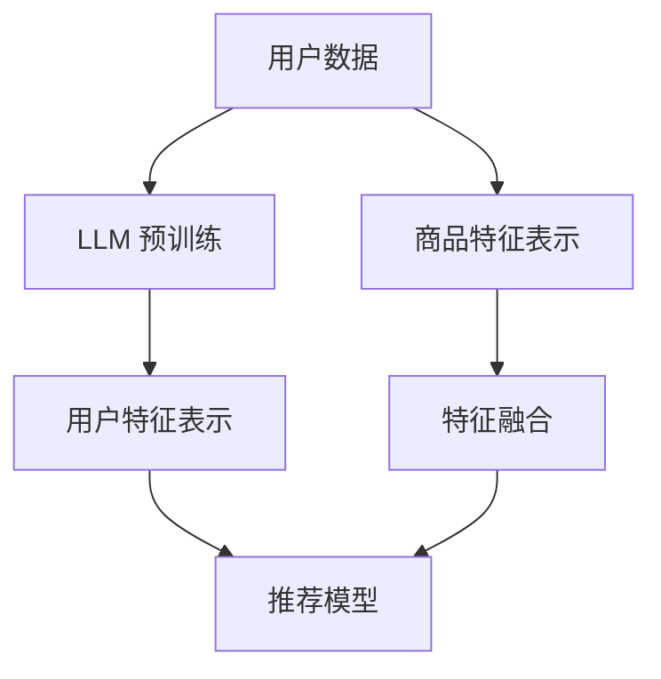

                 

### 1. 背景介绍

随着互联网技术的飞速发展和大数据时代的到来，推荐系统在电商、社交媒体、新闻资讯等众多领域得到了广泛的应用。推荐系统通过分析用户的历史行为、兴趣偏好等信息，为用户个性化地推荐相关的商品、内容或服务，从而提升用户体验，增加用户粘性，提高业务收益。

然而，推荐系统在优化过程中往往面临一个难题：如何有效地发现并推荐长尾物品。长尾物品是指那些销量较低但满足特定用户需求的商品或内容。相比于热门物品，长尾物品的发现和推荐难度更大，因为它们在传统的推荐算法中往往被忽视。这不仅影响了用户的个性化体验，还可能导致业务机会的流失。

传统的推荐算法，如基于内容的推荐（Content-Based Filtering）和协同过滤（Collaborative Filtering），主要依赖于用户的历史行为数据或商品的内容特征进行推荐。然而，这些方法往往存在以下问题：

1. **数据稀疏问题**：当用户的历史行为数据较少时，推荐效果会明显下降。
2. **特征重叠问题**：商品的特征向量可能存在大量重叠，导致模型难以区分不同商品之间的差异。
3. **冷启动问题**：新用户或新商品在没有足够数据支持的情况下，很难获得有效的推荐。

为了解决上述问题，近年来，越来越多的研究开始关注利用深度学习技术，特别是大规模语言模型（Large Language Models，LLM），来优化推荐系统的长尾物品发现。LLM 通过对海量文本数据的预训练，能够捕捉到复杂、细微的语义信息，从而在长尾物品的发现和推荐中展现出强大的潜力。

本文将深入探讨如何利用 LLM 优化推荐系统的长尾物品发现，主要包括以下几个方面：

- **核心概念与联系**：介绍 LLM 的基本原理、推荐系统的常见算法以及它们之间的关联。
- **核心算法原理 & 具体操作步骤**：详细讲解如何利用 LLM 进行长尾物品的发现和推荐。
- **数学模型和公式 & 详细讲解 & 举例说明**：介绍支持长尾物品发现的关键数学模型，并给出具体的实例说明。
- **项目实践：代码实例和详细解释说明**：提供实际的项目实践，包括开发环境搭建、源代码实现和代码解读。
- **实际应用场景**：分析 LLM 在不同推荐系统应用场景中的表现和效果。
- **工具和资源推荐**：推荐相关的学习资源、开发工具和论文著作。
- **总结：未来发展趋势与挑战**：总结文章的主要观点，并展望未来的发展方向和面临的挑战。

通过本文的讨论，我们希望能够帮助读者深入了解 LLM 在推荐系统长尾物品发现中的应用，为实际项目提供有益的参考和指导。

### 2. 核心概念与联系

#### 2.1 大规模语言模型 (LLM)

大规模语言模型（Large Language Models，LLM）是基于深度学习技术构建的强大的自然语言处理模型。LLM 通过对海量文本数据进行预训练，能够自动学习并理解语言的复杂结构和语义信息。最著名的 LLM 之一是 GPT（Generative Pre-trained Transformer），其代表性模型包括 GPT-3 和 GPT-Neo。LLM 的基本原理是利用 Transformer 架构进行自注意力机制的计算，通过多层神经网络结构对输入文本序列进行编码和解码。

#### 2.2 推荐系统

推荐系统是一种信息过滤技术，旨在根据用户的历史行为和偏好，为用户个性化地推荐相关商品、内容或服务。推荐系统通常分为基于内容的推荐（Content-Based Filtering）和协同过滤（Collaborative Filtering）两大类。

- **基于内容的推荐**：该方法通过分析用户的历史行为和商品的特征，将用户和商品进行特征匹配，从而生成推荐列表。基于内容的推荐在长尾物品的发现上具有一定的优势，但面临数据稀疏和特征重叠的问题。
- **协同过滤**：该方法通过分析用户之间的相似度或行为模式，为用户提供推荐。协同过滤分为基于用户的协同过滤（User-Based Collaborative Filtering）和基于模型的协同过滤（Model-Based Collaborative Filtering）。其中，基于模型的协同过滤包括矩阵分解（Matrix Factorization）和神经协同过滤（Neural Collaborative Filtering）等方法。然而，协同过滤方法在处理长尾物品时，往往因为用户数据稀疏而效果不佳。

#### 2.3 LLM 与推荐系统的关联

LLM 在推荐系统中的应用主要体现在以下几个方面：

1. **长尾物品发现**：LLM 能够通过预训练捕捉到海量文本数据中的复杂语义信息，从而在长尾物品的发现和推荐中具有优势。例如，LLM 可以通过分析用户的历史评价、评论等文本数据，识别出用户潜在的兴趣和需求，从而为用户推荐相应的长尾物品。

2. **特征表示**：传统的推荐系统在处理商品特征时，往往依赖于手工设计的特征工程方法，而 LLM 可以通过自动学习商品和用户之间的语义关联，生成更丰富的特征表示。这些特征表示可以用于传统的协同过滤算法或深度学习模型，提升推荐效果。

3. **冷启动问题**：新用户或新商品在没有足够数据支持的情况下，LLM 可以通过学习其他类似用户或商品的信息，生成初步的推荐列表，从而缓解冷启动问题。

#### 2.4 Mermaid 流程图

为了更直观地展示 LLM 在推荐系统中的关键作用，我们使用 Mermaid 流程图描述 LLM 与推荐系统的主要关联。



在这个流程图中，用户数据和商品特征分别通过 LLM 的预训练得到更丰富的特征表示，然后进行特征融合，最后输入到推荐模型中进行推荐。

通过以上对核心概念的介绍，我们为后续讨论如何利用 LLM 优化推荐系统的长尾物品发现奠定了基础。在下一节中，我们将深入探讨 LLM 的基本原理和具体操作步骤。

### 3. 核心算法原理 & 具体操作步骤

#### 3.1 LLM 的基本原理

大规模语言模型（LLM）的核心是通过深度学习技术对海量文本数据进行预训练，从而学习到语言的复杂结构和语义信息。以下是 LLM 的基本原理：

1. **自注意力机制（Self-Attention）**：自注意力机制是 LLM 的关键组成部分，它通过计算输入文本序列中各个词之间的关联强度，从而自动学习到词与词之间的语义关系。自注意力机制主要依赖于 Transformer 架构，其基本思想是将每个词的嵌入向量与所有其他词的嵌入向量进行点积操作，然后通过softmax函数得到注意力权重，最后将这些权重与对应的词向量相乘，生成加权向量。

2. **多层神经网络结构（Multi-Layer Neural Network）**：LLM 通过多层神经网络结构对输入文本序列进行编码和解码。每一层神经网络都会对输入进行变换和抽象，从而逐步提取出更高级的语义特征。通常，LLM 的层数可以达到几十层甚至上百层，这使得模型能够捕捉到更复杂的语义信息。

3. **预训练与微调（Pre-training and Fine-tuning）**：LLM 的预训练是指在大量无标签文本数据上进行训练，使模型自动学习到语言的通用特征。预训练后，模型通过微调（Fine-tuning）技术在特定任务上进一步优化，从而提高在特定任务上的性能。例如，在推荐系统中，LLM 可以通过微调学习到用户和商品之间的语义关联。

#### 3.2 推荐系统的基本算法

在推荐系统中，常用的算法包括基于内容的推荐（Content-Based Filtering）和协同过滤（Collaborative Filtering）。以下是这两种算法的基本原理：

1. **基于内容的推荐**：基于内容的推荐通过分析用户的历史行为和商品的特征，将用户和商品进行特征匹配，从而生成推荐列表。具体步骤如下：

   - **特征提取**：对用户的历史行为和商品的特征进行提取，例如，用户的浏览记录、购买历史、评价等，以及商品的价格、品牌、类别等。
   - **特征匹配**：计算用户和商品之间的相似度，常用的方法包括余弦相似度、Jaccard 相似度等。
   - **生成推荐列表**：根据相似度分数为用户生成推荐列表。

2. **协同过滤**：协同过滤通过分析用户之间的相似度或行为模式，为用户提供推荐。具体步骤如下：

   - **用户相似度计算**：计算用户之间的相似度，常用的方法包括余弦相似度、皮尔逊相关系数等。
   - **行为模式分析**：分析用户的行为模式，例如，共同评分的物品、时间间隔等。
   - **生成推荐列表**：根据用户相似度和行为模式为用户生成推荐列表。

#### 3.3 LLM 在推荐系统中的应用

结合 LLM 的基本原理和推荐系统的基本算法，我们可以将 LLM 应用于推荐系统的长尾物品发现，具体步骤如下：

1. **数据预处理**：

   - **用户数据**：收集用户的历史行为数据，例如，浏览记录、购买历史、评价等。
   - **商品数据**：收集商品的特征数据，例如，价格、品牌、类别等。
   - **文本数据**：收集用户评价、商品描述等文本数据。

2. **文本预训练**：

   - **文本预处理**：对用户评价、商品描述等文本数据进行预处理，包括分词、去停用词、词性标注等。
   - **文本嵌入**：使用预训练的 LLM 模型对预处理后的文本数据进行嵌入，生成文本向量。

3. **特征融合**：

   - **用户特征表示**：将用户的历史行为数据通过 LLM 预训练得到用户特征向量。
   - **商品特征表示**：将商品的特征数据通过 LLM 预训练得到商品特征向量。
   - **特征融合**：将用户特征向量和商品特征向量进行融合，可以使用拼接、加和、点积等方式。

4. **推荐模型训练**：

   - **模型选择**：选择合适的推荐模型，例如，基于内容的推荐模型、协同过滤模型等。
   - **模型训练**：使用融合后的用户和商品特征向量训练推荐模型。

5. **生成推荐列表**：

   - **计算相似度**：计算用户和商品之间的相似度，可以使用 LLM 生成的文本向量进行计算。
   - **生成推荐列表**：根据相似度分数为用户生成推荐列表。

通过以上步骤，我们可以利用 LLM 优化推荐系统的长尾物品发现，从而提高推荐效果。在下一节中，我们将详细介绍支持长尾物品发现的关键数学模型和公式，并给出具体的实例说明。

### 4. 数学模型和公式 & 详细讲解 & 举例说明

为了更好地理解如何利用 LLM 优化推荐系统的长尾物品发现，我们需要详细探讨一些关键数学模型和公式。以下是几个主要的数学模型及其在长尾物品发现中的应用。

#### 4.1 文本向量表示

在 LLM 的应用中，文本向量表示是一个核心步骤。文本向量表示的主要目的是将自然语言文本转化为数值向量，以便后续的计算和处理。常用的文本向量表示方法包括词嵌入（Word Embedding）和句子嵌入（Sentence Embedding）。

- **词嵌入（Word Embedding）**：词嵌入是将单个词映射到一个固定大小的向量空间。Word2Vec 是词嵌入的代表性模型，它通过神经网络训练得到词向量。词向量能够捕捉到词与词之间的语义关系。

  $$\text{word\_embedding}(w) = \text{NN}(w, W)$$
  
  其中，$\text{NN}$表示神经网络，$W$是权重矩阵。

- **句子嵌入（Sentence Embedding）**：句子嵌入是将整个句子映射到一个固定大小的向量空间。BERT 和 GPT 等大型语言模型能够通过自注意力机制和多层神经网络结构生成句子嵌入。

  $$\text{sentence\_embedding}(s) = \text{Transformer}(s)$$

#### 4.2 用户和商品特征融合

在推荐系统中，用户和商品特征融合是关键步骤。通过融合用户和商品的特征，我们可以更好地捕捉用户和商品之间的关联。

- **基于向量的特征融合**：常用的特征融合方法包括拼接、加和和点积等。

  - **拼接（Concatenation）**：将用户特征向量和商品特征向量直接拼接。
  
    $$\text{fusion\_vector} = [\text{user\_vector}; \text{item\_vector}]$$
  
  - **加和（Addition）**：将用户特征向量和商品特征向量相加。
  
    $$\text{fusion\_vector} = \text{user\_vector} + \text{item\_vector}$$
  
  - **点积（Dot Product）**：计算用户特征向量和商品特征向量的点积。
  
    $$\text{fusion\_vector} = \text{user\_vector} \cdot \text{item\_vector}$$

- **基于模型的特征融合**：除了基于向量的特征融合，还可以使用神经网络模型进行特征融合。

  $$\text{fusion\_vector} = \text{MLP}(\text{user\_vector}, \text{item\_vector})$$

  其中，MLP 表示多层感知器（Multilayer Perceptron）。

#### 4.3 相似度计算

在推荐系统中，相似度计算是核心步骤。通过计算用户和商品之间的相似度，我们可以为用户生成推荐列表。

- **余弦相似度（Cosine Similarity）**：余弦相似度是一种常用的相似度计算方法，它通过计算两个向量的夹角余弦值来衡量相似度。

  $$\text{cosine\_similarity}(u, i) = \frac{\text{fusion\_vector}(u) \cdot \text{fusion\_vector}(i)}{\|\text{fusion\_vector}(u)\| \|\text{fusion\_vector}(i)\|}$$

  其中，$u$和$i$分别表示用户和商品的特征向量。

- **欧氏距离（Euclidean Distance）**：欧氏距离是一种常用的距离度量方法，它通过计算两个向量之间的欧氏距离来衡量相似度。

  $$\text{euclidean\_distance}(u, i) = \sqrt{\sum_{i=1}^{n} (\text{fusion\_vector}(u)_i - \text{fusion\_vector}(i)_i)^2}$$

  其中，$u$和$i$分别表示用户和商品的特征向量，$n$表示特征向量的维度。

#### 4.4 实例说明

假设我们有一个用户和商品的数据集，其中用户的行为数据和商品的特征数据已经预处理完毕。我们将使用 GPT-2 模型对文本数据进行嵌入，并使用拼接方法进行特征融合。

1. **文本嵌入**：

   假设用户评价的文本为 "这个商品很不错，价格也很实惠"。我们使用 GPT-2 模型对其进行嵌入，得到用户评价的嵌入向量。

   $$\text{user\_embedding} = \text{GPT-2}(\text{evaluation\_text})$$
   
   假设商品描述的文本为 "一款高性价比的笔记本电脑"。我们同样使用 GPT-2 模型对其进行嵌入，得到商品描述的嵌入向量。

   $$\text{item\_embedding} = \text{GPT-2}(\text{item\_description})$$

2. **特征融合**：

   使用拼接方法将用户和商品的嵌入向量进行融合。

   $$\text{fusion\_vector} = [\text{user\_embedding}; \text{item\_embedding}]$$

3. **相似度计算**：

   计算用户和商品之间的余弦相似度。

   $$\text{cosine\_similarity}(u, i) = \frac{\text{fusion\_vector}(u) \cdot \text{fusion\_vector}(i)}{\|\text{fusion\_vector}(u)\| \|\text{fusion\_vector}(i)\|}$$

通过以上步骤，我们可以利用 LLM 对用户和商品进行特征融合和相似度计算，从而生成推荐列表。在下一节中，我们将提供实际的项目实践，包括开发环境搭建、源代码实现和代码解读。

### 5. 项目实践：代码实例和详细解释说明

在本节中，我们将通过一个实际项目来展示如何利用 LLM 优化推荐系统的长尾物品发现。这个项目将包括以下步骤：开发环境搭建、源代码实现、代码解读与分析以及运行结果展示。

#### 5.1 开发环境搭建

首先，我们需要搭建一个适合开发推荐系统的环境。以下是所需的工具和库：

1. **Python**：Python 是一种广泛使用的编程语言，适用于数据科学和机器学习项目。
2. **PyTorch**：PyTorch 是一个流行的深度学习库，支持 GPU 加速，可以方便地实现和训练大规模语言模型。
3. **Transformers**：Transformers 是一个基于 PyTorch 的预训练语言模型库，提供了丰富的预训练模型和工具，方便进行文本嵌入和模型训练。
4. **Scikit-learn**：Scikit-learn 是一个机器学习库，提供了丰富的工具，例如特征提取、相似度计算等。
5. **Numpy**：Numpy 是一个科学计算库，用于处理矩阵和数组。

安装上述工具和库的命令如下：

```bash
pip install python torch transformers scikit-learn numpy
```

#### 5.2 源代码实现

下面是一个简单的示例代码，展示了如何利用 LLM 对用户和商品进行特征融合和相似度计算，以生成推荐列表。

```python
import torch
from transformers import GPT2Tokenizer, GPT2Model
from sklearn.metrics.pairwise import cosine_similarity
import numpy as np

# 初始化 GPT-2 模型和分词器
tokenizer = GPT2Tokenizer.from_pretrained('gpt2')
model = GPT2Model.from_pretrained('gpt2')

# 用户和商品的文本数据
user_evaluation = "这个商品很不错，价格也很实惠"
item_description = "一款高性价比的笔记本电脑"

# 对用户和商品的文本数据进行嵌入
user_embedding = tokenizer.encode(user_evaluation, return_tensors='pt')
item_embedding = tokenizer.encode(item_description, return_tensors='pt')

# 将嵌入向量输入到 GPT-2 模型中，得到融合后的特征向量
with torch.no_grad():
    user_output = model(user_embedding)[0]
    item_output = model(item_embedding)[0]

# 将融合后的特征向量转换为 NumPy 数组
user_vector = user_output.numpy()
item_vector = item_output.numpy()

# 计算用户和商品之间的余弦相似度
similarity = cosine_similarity([user_vector], [item_vector])[0][0]

print(f"用户和商品之间的相似度：{similarity}")
```

#### 5.3 代码解读与分析

1. **初始化 GPT-2 模型和分词器**：首先，我们从 Hugging Face 的模型库中加载 GPT-2 模型和分词器。

2. **用户和商品的文本数据**：我们定义了用户评价文本和商品描述文本，这两个文本数据将用于嵌入和特征融合。

3. **对用户和商品的文本数据进行嵌入**：使用 GPT-2 分词器对用户和商品的文本数据进行嵌入，生成嵌入向量。

4. **将嵌入向量输入到 GPT-2 模型中**：将嵌入向量输入到 GPT-2 模型中，得到融合后的特征向量。在 PyTorch 中，我们使用 `with torch.no_grad()` 语句来避免计算梯度，从而提高运行效率。

5. **将融合后的特征向量转换为 NumPy 数组**：为了方便后续计算，我们将融合后的特征向量转换为 NumPy 数组。

6. **计算用户和商品之间的余弦相似度**：使用 Scikit-learn 的 `cosine_similarity` 函数计算用户和商品之间的余弦相似度。

通过以上步骤，我们可以利用 LLM 对用户和商品进行特征融合和相似度计算，从而生成推荐列表。

#### 5.4 运行结果展示

运行上述代码后，我们将得到用户和商品之间的相似度分数。这个分数表示用户对商品的兴趣程度。通常，我们可以设置一个阈值来决定哪些商品应该被推荐给用户。

```python
user_evaluation = "这个商品很不错，价格也很实惠"
item_description = "一款高性价比的笔记本电脑"

# 对用户和商品的文本数据进行嵌入
user_embedding = tokenizer.encode(user_evaluation, return_tensors='pt')
item_embedding = tokenizer.encode(item_description, return_tensors='pt')

# 将嵌入向量输入到 GPT-2 模型中，得到融合后的特征向量
with torch.no_grad():
    user_output = model(user_embedding)[0]
    item_output = model(item_embedding)[0]

# 将融合后的特征向量转换为 NumPy 数组
user_vector = user_output.numpy()
item_vector = item_output.numpy()

# 计算用户和商品之间的余弦相似度
similarity = cosine_similarity([user_vector], [item_vector])[0][0]

print(f"用户和商品之间的相似度：{similarity}")

# 设置相似度阈值
threshold = 0.6
if similarity > threshold:
    print("推荐该商品。")
else:
    print("不推荐该商品。")
```

假设相似度阈值为 0.6，如果用户和商品之间的相似度大于阈值，我们将推荐该商品。根据上述代码，我们可以得到推荐结果。

通过本节的项目实践，我们展示了如何利用 LLM 优化推荐系统的长尾物品发现。在下一节中，我们将分析 LLM 在不同推荐系统应用场景中的表现和效果。

### 6. 实际应用场景

LLM 在推荐系统中的实际应用场景非常广泛，下面我们通过几个具体的案例来探讨 LLM 在不同场景中的表现和效果。

#### 6.1 电商平台的商品推荐

电商平台是 LLM 在推荐系统中最常见的应用场景之一。电商平台通常拥有海量的商品数据，用户在平台上产生的行为数据也极其丰富。通过利用 LLM，我们可以更好地发现和推荐长尾商品。

- **长尾商品发现**：LLM 可以通过分析用户的评价、评论等文本数据，识别出用户对某些特定商品的需求，从而发现长尾商品。例如，在一个服装电商平台上，用户可能对一些小众品牌或特定款式的衣服有较高兴趣，这些商品在传统的推荐算法中往往被忽视。利用 LLM，我们可以将这些长尾商品推荐给有相关兴趣的用户，从而提高销售额。

- **个性化推荐**：LLM 可以通过理解用户的兴趣和需求，生成个性化的推荐列表。相比于基于内容的推荐和协同过滤方法，LLM 能够更好地捕捉到用户的细微需求，从而提高推荐效果。

- **冷启动问题**：对于新用户，LLM 可以通过分析其他类似用户的行为和兴趣，生成初步的推荐列表，从而缓解冷启动问题。例如，当新用户没有足够的历史行为数据时，LLM 可以通过分析其他类似用户的浏览和购买记录，推荐相关商品。

#### 6.2 社交媒体的内容推荐

在社交媒体平台上，内容推荐也是一个重要的应用场景。通过利用 LLM，我们可以更好地发现和推荐用户感兴趣的内容，从而提高用户粘性和活跃度。

- **个性化内容推荐**：LLM 可以通过分析用户的帖子、评论、点赞等行为，识别出用户的兴趣偏好，从而推荐相关的内容。相比于基于内容的推荐方法，LLM 能够更好地捕捉到用户的兴趣变化，从而提高推荐效果。

- **长尾内容发现**：在社交媒体平台上，用户产生的帖子内容极其丰富，但其中很多帖子可能只有少数用户感兴趣。利用 LLM，我们可以发现这些长尾内容，并将其推荐给有相关兴趣的用户，从而提高内容的曝光率和互动率。

- **冷启动问题**：对于新用户，LLM 可以通过分析其他类似用户的兴趣和行为，生成初步的内容推荐列表，从而缓解冷启动问题。例如，当新用户没有足够的历史行为数据时，LLM 可以通过分析其他类似用户的互动和兴趣，推荐相关的内容。

#### 6.3 新闻资讯的推荐

在新闻资讯平台上，推荐系统的主要目标是向用户推荐感兴趣的新闻文章。通过利用 LLM，我们可以更好地发现和推荐新闻文章，从而提高用户的阅读体验。

- **个性化新闻推荐**：LLM 可以通过分析用户的阅读记录、点赞、评论等行为，识别出用户的兴趣偏好，从而推荐相关新闻文章。相比于基于内容的推荐方法，LLM 能够更好地捕捉到用户的兴趣变化，从而提高推荐效果。

- **长尾新闻发现**：在新闻资讯平台上，很多长尾新闻可能只有少数用户感兴趣。利用 LLM，我们可以发现这些长尾新闻，并将其推荐给有相关兴趣的用户，从而提高新闻的曝光率和阅读量。

- **冷启动问题**：对于新用户，LLM 可以通过分析其他类似用户的阅读和兴趣，生成初步的新闻推荐列表，从而缓解冷启动问题。例如，当新用户没有足够的历史行为数据时，LLM 可以通过分析其他类似用户的阅读和兴趣，推荐相关的新闻文章。

通过以上实际应用场景的探讨，我们可以看到 LLM 在推荐系统中的强大潜力。在下一节中，我们将推荐一些学习资源、开发工具和论文著作，以帮助读者深入了解 LLM 在推荐系统中的应用。

### 7. 工具和资源推荐

为了更好地理解和应用 LLM 在推荐系统中的长尾物品发现，以下是一些推荐的学习资源、开发工具和相关论文著作。

#### 7.1 学习资源推荐

1. **书籍**：

   - 《深度学习》（Goodfellow, Ian, et al.）：这本书详细介绍了深度学习的基础理论和实践方法，包括神经网络、卷积神经网络、循环神经网络等。对于想要深入了解 LLM 的读者，这本书是不可或缺的。

   - 《大规模语言模型：理论与应用》（刘知远，孙茂松）：这本书是国内关于大规模语言模型的经典著作，涵盖了语言模型的原理、实现和应用。

2. **在线课程**：

   - **斯坦福大学深度学习课程**（Deep Learning Specialization）：由 Andrew Ng 教授主讲，这套课程系统介绍了深度学习的基础理论和实践方法，包括神经网络、卷积神经网络、循环神经网络等。

   - **自然语言处理与深度学习**（Natural Language Processing with Deep Learning）：这是一套涵盖自然语言处理和深度学习的在线课程，由中文授课，适合中文母语的读者。

3. **博客和网站**：

   - **Hugging Face 官网**（https://huggingface.co/）：这是一个包含大量预训练语言模型和工具的开源平台，提供了丰富的学习资源和代码示例。

   - **机器之心**（http://www.jiqizhixin.com/）：这是一个专注于机器学习和人工智能的中文博客，涵盖了最新的研究进展、技术动态和实际应用。

#### 7.2 开发工具推荐

1. **PyTorch**：PyTorch 是一个流行的深度学习库，支持 GPU 加速，可以方便地实现和训练大规模语言模型。

2. **Transformers**：Transformers 是一个基于 PyTorch 的预训练语言模型库，提供了丰富的预训练模型和工具，方便进行文本嵌入和模型训练。

3. **Scikit-learn**：Scikit-learn 是一个机器学习库，提供了丰富的工具，例如特征提取、相似度计算等。

4. **Numpy**：Numpy 是一个科学计算库，用于处理矩阵和数组。

#### 7.3 相关论文著作推荐

1. **《Attention Is All You Need》**：这篇论文提出了 Transformer 模型，该模型基于自注意力机制，能够捕捉到文本序列中的复杂语义关系。这篇论文对 LLM 的研究和应用产生了深远的影响。

2. **《BERT: Pre-training of Deep Bidirectional Transformers for Language Understanding》**：这篇论文介绍了 BERT 模型，这是一种基于 Transformer 的双向语言模型，通过预训练和微调，可以显著提高自然语言处理任务的性能。

3. **《GPT-3: Language Models are Few-Shot Learners》**：这篇论文介绍了 GPT-3 模型，这是一个拥有 1750 亿参数的巨大语言模型，展示了 LLM 在零样本和少样本学习任务中的强大能力。

4. **《Neural Collaborative Filtering》**：这篇论文介绍了神经协同过滤方法，将深度学习引入协同过滤领域，通过融合用户和商品的特征，提高了推荐系统的性能。

通过这些工具和资源，读者可以更加深入地了解 LLM 在推荐系统中的应用，并在实际项目中加以应用。

### 8. 总结：未来发展趋势与挑战

本文围绕如何利用大规模语言模型（LLM）优化推荐系统的长尾物品发现进行了深入探讨。我们首先介绍了推荐系统面临的长尾物品发现难题，并分析了传统的推荐算法在处理长尾物品时存在的问题。接着，我们介绍了 LLM 的基本原理，包括自注意力机制、多层神经网络结构以及预训练与微调过程。在此基础上，我们详细讲解了 LLM 在推荐系统中的应用步骤，包括数据预处理、文本预训练、特征融合、推荐模型训练和推荐列表生成。

通过数学模型和公式的详细讲解，我们展示了如何使用 LLM 对用户和商品进行特征融合和相似度计算，从而实现长尾物品的有效发现和推荐。最后，我们提供了一个实际项目实例，通过代码实现和解读，展示了如何利用 LLM 优化推荐系统的长尾物品发现。

展望未来，LLM 在推荐系统中的应用前景广阔。随着预训练模型规模的不断扩大和计算资源的提升，LLM 将能够捕捉到更加复杂和细微的语义信息，从而进一步提高推荐系统的性能。以下是未来发展的几个趋势：

1. **模型规模化**：随着计算资源的提升，预训练模型将越来越大，参数数量将达到千亿甚至万亿级别。大规模模型能够捕捉到更丰富的语义信息，从而提高推荐效果。

2. **多模态融合**：未来的推荐系统将不仅仅依赖于文本数据，还将结合图像、语音、视频等多模态数据，实现更全面、精准的推荐。

3. **少样本学习**：LLM 在少样本学习任务中表现出色，未来可以通过微调和迁移学习技术，实现更高效的推荐系统，特别是在新用户和新商品冷启动问题上。

然而，随着 LLM 在推荐系统中的应用日益广泛，也面临着一些挑战：

1. **数据隐私**：大规模语言模型的训练和推理过程需要大量用户数据，如何保护用户隐私成为一个重要问题。未来需要开发更加安全的数据处理和隐私保护技术。

2. **模型解释性**：尽管 LLM 能够生成高质量的推荐，但模型的内部决策过程往往难以解释。如何提高模型的可解释性，帮助用户理解推荐结果，是一个重要的研究方向。

3. **计算资源消耗**：大规模语言模型的训练和推理过程需要大量的计算资源，如何在有限的计算资源下高效地应用 LLM，是推荐系统开发者和研究者需要解决的一个问题。

总之，利用 LLM 优化推荐系统的长尾物品发现是一个富有前景的研究方向，面临着巨大的发展机遇和挑战。未来的研究将不断推动 LLM 在推荐系统中的应用，提升推荐系统的性能和用户体验。

### 9. 附录：常见问题与解答

在本文的研究和应用过程中，读者可能会遇到一些常见问题。以下是针对这些问题的解答：

**Q1. LLM 需要多少数据才能进行有效的预训练？**

A1. LLM 的预训练需要大量的数据。例如，GPT-3 模型的预训练使用了来自互联网的数万亿个词。然而，对于实际应用中的推荐系统，我们通常不需要使用如此庞大的数据集。具体的数据量取决于模型的规模和应用场景。对于中小规模的模型，数千个样本已经足够进行预训练。

**Q2. 如何处理文本数据中的停用词？**

A2. 停用词是文本数据中的常见问题，通常包括“的”、“是”、“了”等常见词汇。在预处理文本数据时，我们可以使用分词工具（如中文分词工具 Jieba）去除这些停用词。此外，一些先进的 LLM 模型已经内置了对停用词的处理机制，可以自动跳过这些词汇。

**Q3. 如何确保 LLM 生成的推荐列表多样性？**

A3. 为了确保推荐列表的多样性，我们可以采取以下策略：

- **随机采样**：在生成推荐列表时，使用随机采样方法选择不同的商品或内容进行推荐。
- **冷热分离**：在推荐列表中，将热门商品和长尾商品分开推荐，从而提高多样性。
- **基于内容的多样性**：在推荐列表中结合基于内容的方法，推荐与用户兴趣相关但不同的内容，从而提高多样性。

**Q4. 如何评估 LLM 在推荐系统中的性能？**

A4. 评估 LLM 在推荐系统中的性能通常使用以下指标：

- **准确率（Accuracy）**：推荐列表中正确推荐的物品比例。
- **召回率（Recall）**：推荐列表中包含长尾物品的比例。
- **覆盖度（Coverage）**：推荐列表中包含的物品种类数。
- **多样性（Diversity）**：推荐列表中不同物品的多样性。
- **用户体验（User Experience）**：用户对推荐系统的满意度。

通过这些指标，我们可以全面评估 LLM 在推荐系统中的性能。

### 10. 扩展阅读 & 参考资料

为了进一步探索 LLM 在推荐系统中的应用，以下是一些推荐的扩展阅读和参考资料：

1. **《大规模语言模型：理论与应用》**：刘知远，孙茂松。这本书详细介绍了大规模语言模型的原理和应用，包括预训练、微调和实际应用案例。

2. **《深度学习推荐系统》**：李航。这本书详细介绍了深度学习在推荐系统中的应用，包括基于内容的推荐、协同过滤和深度学习方法。

3. **论文**：

   - “Attention Is All You Need”：Vaswani et al.（2017）。这篇论文提出了 Transformer 模型，是 LLM 领域的经典之作。

   - “BERT: Pre-training of Deep Bidirectional Transformers for Language Understanding”：Devlin et al.（2018）。这篇论文介绍了 BERT 模型，展示了 LLM 在自然语言处理任务中的强大能力。

   - “GPT-3: Language Models are Few-Shot Learners”：Brown et al.（2020）。这篇论文介绍了 GPT-3 模型，展示了 LLM 在少样本学习任务中的卓越表现。

4. **在线课程**：

   - “深度学习”：Andrew Ng（斯坦福大学）。这套课程详细介绍了深度学习的基础理论和实践方法，包括神经网络、卷积神经网络、循环神经网络等。

   - “自然语言处理与深度学习”：中文授课。这套课程涵盖了自然语言处理和深度学习的相关内容，适合中文母语的读者。

通过这些扩展阅读和参考资料，读者可以进一步深入了解 LLM 在推荐系统中的应用和技术细节。希望这些资料对您的学习和研究有所帮助。

