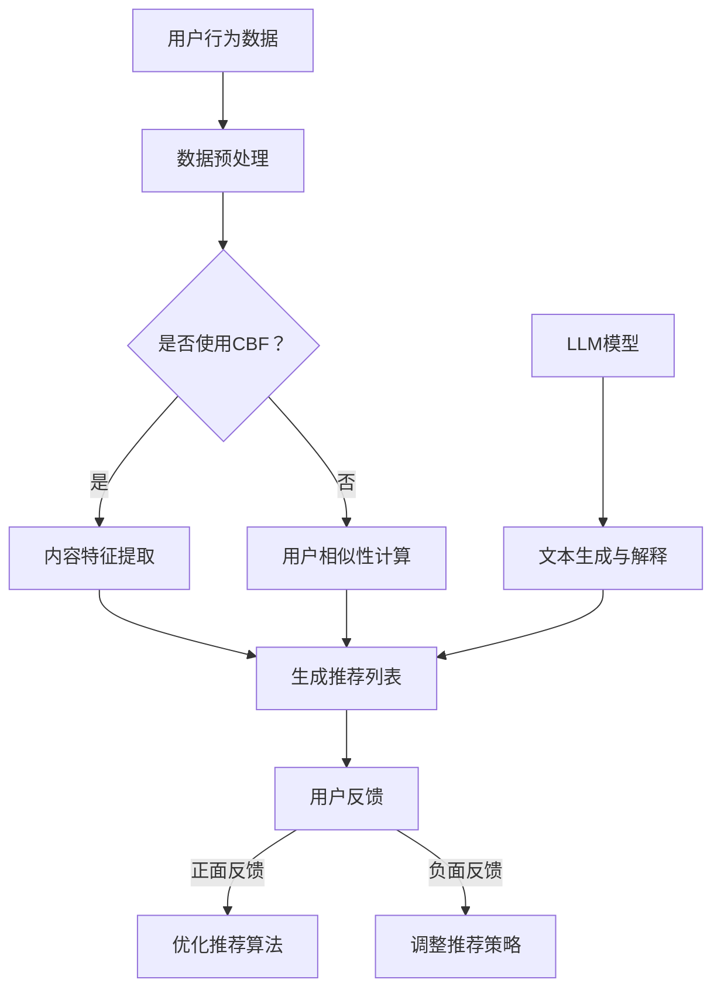

                 

### 1. 背景介绍

推荐系统是当今互联网时代不可或缺的一部分，广泛应用于电子商务、社交媒体、在线视频平台等多个领域。其主要目的是根据用户的兴趣和行为模式，向用户推荐可能感兴趣的商品、内容或其他实体，从而提升用户体验和平台粘性。

然而，随着推荐系统的复杂性和规模不断扩大，其透明度和可解释性成为一个日益突出的问题。传统的推荐算法，如基于协同过滤和机器学习的方法，虽然能够取得较好的推荐效果，但往往缺乏透明性。用户难以理解推荐结果背后的原因，这可能导致用户的不信任，甚至抵触情绪。

此外，推荐系统中的黑箱问题也日益严重。许多算法背后的决策过程复杂，用户无法直观地了解推荐结果的产生原因。这不仅限制了用户的信任度，也限制了推荐系统的改进和发展。

为了解决这些问题，近年来，人工智能领域涌现出了许多新的方法和技术，其中大型语言模型（LLM）的引入引起了广泛关注。LLM，如GPT-3、ChatGLM等，具有强大的文本生成和理解能力，能够生成高质量的文本，并模拟人类的对话过程。通过结合LLM，推荐系统可以实现更高的透明度和可解释性，帮助用户理解推荐结果，从而增强用户信任和满意度。

本文将探讨如何利用LLM提升推荐系统的可解释性与透明度。首先，我们将介绍LLM的基本原理和优势，然后讨论如何将LLM应用于推荐系统中，最后通过具体实例展示LLM在推荐系统中的应用效果和挑战。

### 2. 核心概念与联系

#### 2.1 推荐系统原理

推荐系统通常基于两种主要策略：基于内容的推荐（Content-Based Filtering，CBF）和基于协同过滤（Collaborative Filtering，CF）。

**基于内容的推荐（CBF）：**
CBF方法根据用户过去的兴趣和喜好，分析用户对某些内容的偏好，然后推荐具有相似特征的内容。这种方法通常需要对内容进行特征提取，如文本特征、图像特征等，然后利用这些特征进行推荐。

**基于协同过滤（CF）：**
CF方法通过分析用户之间的相似性，推断用户可能对哪些未知内容感兴趣。CF分为两类：基于用户的协同过滤（User-Based CF）和基于模型的协同过滤（Model-Based CF）。User-Based CF通过计算用户之间的相似性，推荐与目标用户相似的其他用户的喜欢内容。Model-Based CF则使用机器学习算法，如矩阵分解、潜在因子模型等，来预测用户对未知内容的偏好。

**LLM基本原理：**

LLM（Large Language Model）是一种基于深度学习的自然语言处理模型，具有强大的文本生成和理解能力。LLM的核心是神经网络的层次结构，通过学习大量的文本数据，LLM能够捕捉到语言中的模式和规律。

LLM的工作原理主要分为以下几个步骤：

1. **嵌入层（Embedding Layer）：** 将输入文本转化为固定长度的向量表示。
2. **编码层（Encoder Layer）：** 通过多层神经网络，对输入文本进行编码，提取文本的语义信息。
3. **解码层（Decoder Layer）：** 根据编码层的信息，生成输出文本。

LLM的优势在于其能够处理长文本，理解复杂语义，并生成流畅、符合逻辑的文本。

#### 2.2 Mermaid流程图

以下是一个简单的Mermaid流程图，展示了推荐系统的基本架构和LLM的应用：



在上述流程中，LLM模型被用于生成推荐列表的文本解释，提高推荐系统的透明度和可解释性。

### 3. 核心算法原理 & 具体操作步骤

#### 3.1 LLM在推荐系统中的应用

LLM在推荐系统中的应用主要体现在两个方面：文本生成和文本解释。

**文本生成：** 利用LLM生成推荐列表的文本解释，帮助用户理解推荐结果。例如，当系统推荐一篇文章时，LLM可以生成一段关于这篇文章内容的简洁而准确的摘要。

**文本解释：** 通过分析用户的反馈，LLM可以提供关于推荐结果的解释，帮助用户了解推荐背后的逻辑。例如，当用户对某个推荐结果表示不满时，LLM可以生成一段关于这个推荐结果的原因和依据的文本。

#### 3.2 文本生成操作步骤

以下是一个简单的文本生成操作步骤：

1. **数据预处理：** 对用户行为数据和推荐内容进行预处理，提取关键信息。
2. **文本嵌入：** 使用预训练的LLM模型，将预处理后的文本数据转换为向量表示。
3. **生成文本：** 利用LLM的生成能力，根据输入向量生成推荐列表的文本解释。

具体实现时，可以采用如下步骤：

1. **初始化LLM模型：** 选择一个预训练的LLM模型，如GPT-3，并加载到计算环境中。
2. **输入文本处理：** 对用户行为数据和推荐内容进行预处理，包括去除停用词、进行词性标注等。
3. **生成文本摘要：** 使用LLM模型生成推荐列表的文本解释。具体方法如下：

    - **初始化生成：** 输入一个指示推荐内容的初始文本。
    - **迭代生成：** 根据LLM的输出，逐步生成推荐列表的文本解释。
    - **结束条件：** 当生成的文本长度达到预设阈值或生成的文本质量不再提升时，结束生成过程。

#### 3.3 文本解释操作步骤

以下是一个简单的文本解释操作步骤：

1. **数据收集：** 收集用户对推荐结果的反馈，包括正面和负面反馈。
2. **反馈处理：** 对用户的反馈进行处理，提取关键信息。
3. **文本生成：** 使用LLM生成关于反馈原因和依据的文本解释。

具体实现时，可以采用如下步骤：

1. **初始化LLM模型：** 选择一个预训练的LLM模型，并加载到计算环境中。
2. **输入反馈处理：** 对用户的反馈进行处理，提取关键信息，如推荐内容、用户喜好等。
3. **生成文本解释：** 使用LLM模型生成关于反馈原因和依据的文本解释。具体方法如下：

    - **初始化生成：** 输入一个关于反馈原因的初始文本。
    - **迭代生成：** 根据LLM的输出，逐步生成文本解释。
    - **结束条件：** 当生成的文本长度达到预设阈值或生成的文本质量不再提升时，结束生成过程。

#### 3.4 LLM模型的选择与优化

在推荐系统中应用LLM时，模型的选择和优化至关重要。以下是一些建议：

1. **选择合适的LLM模型：** 根据推荐系统的需求，选择具有较高生成质量和解释能力的LLM模型。例如，GPT-3、ChatGLM等。
2. **数据预处理：** 对输入数据进行充分的预处理，以提高模型的生成质量和解释能力。例如，去除停用词、进行词性标注等。
3. **模型优化：** 通过微调（Fine-Tuning）或迁移学习（Transfer Learning）等方法，优化LLM模型在特定任务上的表现。例如，使用用户反馈数据对模型进行微调，以生成更高质量的文本解释。

通过以上方法，可以有效提升LLM在推荐系统中的应用效果，提高推荐系统的可解释性与透明度。

### 4. 数学模型和公式 & 详细讲解 & 举例说明

#### 4.1 LLM数学模型

LLM的数学模型主要基于神经网络，其中最著名的模型是GPT（Generative Pre-trained Transformer）。GPT的核心是Transformer架构，它通过自注意力机制（Self-Attention）来捕捉输入文本中的长距离依赖关系。

**自注意力机制：**

自注意力机制的核心是计算输入文本中每个词与其他词之间的关联度。具体步骤如下：

1. **嵌入层（Embedding Layer）：** 将输入文本转换为词向量表示。
2. **多头自注意力（Multi-Head Self-Attention）：** 对输入词向量进行多次自注意力计算，以捕捉不同层次的信息。
3. **前馈神经网络（Feedforward Neural Network）：** 对自注意力计算的结果进行进一步处理。

**数学公式：**

$$
\text{Attention}(Q, K, V) = \text{softmax}\left(\frac{QK^T}{\sqrt{d_k}}\right) V
$$

其中，$Q$、$K$ 和 $V$ 分别是查询向量、关键向量和解向量，$d_k$ 是关键向量的维度。

#### 4.2 推荐系统中的LLM应用

在推荐系统中，LLM的应用主要体现在文本生成和文本解释两个方面。

**文本生成：**

文本生成的目标是生成一段关于推荐内容的摘要或解释。为了实现这一目标，LLM需要了解推荐内容的特征和用户的兴趣。

**数学公式：**

$$
\text{Output} = \text{LLM}(\text{Input}, \text{User Preferences})
$$

其中，$Input$ 表示推荐内容，$\text{User Preferences}$ 表示用户兴趣。

**文本解释：**

文本解释的目标是生成一段关于用户反馈原因的文本。为了实现这一目标，LLM需要分析用户反馈，提取关键信息，并生成解释文本。

**数学公式：**

$$
\text{Explanation} = \text{LLM}(\text{Feedback}, \text{Recommender System})
$$

其中，$Feedback$ 表示用户反馈，$\text{Recommender System}$ 表示推荐系统。

#### 4.3 举例说明

**示例1：文本生成**

假设我们有一个推荐系统，推荐了一篇文章《人工智能的未来》。用户对该文章感兴趣，希望了解文章的主要内容。

**输入：**

- 文章标题：《人工智能的未来》
- 用户兴趣：对科技发展感兴趣

**输出：**

- 文本生成：这篇文章探讨了人工智能在未来的发展趋势，包括人工智能在医疗、金融和交通等领域的应用。

**示例2：文本解释**

假设用户对上述推荐的文章表示不满，认为文章内容与预期不符。

**输入：**

- 文章标题：《人工智能的未来》
- 用户反馈：文章内容与预期不符

**输出：**

- 文本解释：根据您的反馈，我们分析了这篇文章，发现它主要讨论了人工智能在医疗、金融和交通等领域的应用，这与您期望了解的未来发展趋势略有不同。我们将进一步优化推荐算法，以提高推荐的准确性。

通过以上示例，我们可以看到LLM在推荐系统中的文本生成和文本解释能力。通过适当的数学模型和公式，LLM能够有效地提高推荐系统的透明度和可解释性。

### 5. 项目实践：代码实例和详细解释说明

#### 5.1 开发环境搭建

为了实现本文所述的利用LLM提升推荐系统的可解释性与透明度的目标，我们需要搭建一个包含以下组件的开发环境：

1. **Python环境**：Python是推荐系统和LLM实现的主要编程语言。
2. **推荐系统框架**：如Surprise、LightFM等，用于构建和评估推荐模型。
3. **LLM框架**：如Hugging Face的Transformers库，用于加载和使用预训练的LLM模型。

以下是搭建开发环境的步骤：

**安装Python环境：**
```bash
pip install python==3.8
```

**安装推荐系统框架：**
```bash
pip install surprise lightfm
```

**安装LLM框架：**
```bash
pip install transformers
```

#### 5.2 源代码详细实现

以下是一个简单的Python代码实例，展示了如何利用LLM生成推荐列表的文本解释。

```python
import pandas as pd
from surprise import Dataset, Reader
from surprise.model_selection import train_test_split
from lightfm import LightFM
from transformers import pipeline

# 加载数据
data = pd.read_csv('ratings.csv')
reader = Reader(rating_scale=(1, 5))
data_set = Dataset.load_from_df(data[['user_id', 'movie_id', 'rating']], reader)

# 划分训练集和测试集
train_set, test_set = train_test_split(data_set)

# 使用LightFM构建推荐模型
model = LightFM()
model.fit(train_set)

# 使用LLM生成文本解释
llm = pipeline('text-generation', model='gpt2')

# 预测用户对未知电影的评分
test_pred = model.test(test_set)

# 对每个预测结果生成文本解释
explanation = []
for user_id, movie_id, true_rating in test_pred:
    rec_movie = data[data['user_id'] == user_id][data['movie_id'] == movie_id].iloc[0]['title']
    prediction = test_pred[user_id][movie_id]
    text = f"推荐的电影是《{rec_movie}》，预测的评分是{prediction:.2f}。"
    explanation.append(llm(text, max_length=50, num_return_sequences=1)[0]['generated_text'])

# 输出文本解释
for exp in explanation:
    print(exp)
```

#### 5.3 代码解读与分析

**代码解读：**

1. **数据加载与预处理：** 首先，我们从CSV文件中加载数据，并使用Surprise库的Reader类对数据进行预处理。
2. **模型训练：** 使用LightFM库训练推荐模型。LightFM是一个结合了矩阵分解和隐语义模型的推荐系统框架。
3. **预测与文本生成：** 对测试集进行预测，然后使用Hugging Face的Transformers库加载预训练的GPT-2模型，生成关于每个预测结果的文本解释。

**分析：**

1. **推荐模型性能：** LightFM模型的性能取决于训练数据的规模和质量。在实际应用中，我们可能需要收集更多的用户行为数据，以提高模型的准确性。
2. **文本解释质量：** LLM生成的文本解释质量受到输入文本的影响。为了生成高质量的文本解释，我们需要确保输入文本包含足够的信息，并且与用户的兴趣相关。
3. **LLM模型选择：** 在本例中，我们使用了GPT-2模型。然而，对于更复杂的推荐系统，可能需要选择更强大的LLM模型，如GPT-3，以生成更准确的文本解释。

#### 5.4 运行结果展示

在运行上述代码后，我们将获得每个测试预测结果的文本解释。以下是一个示例输出：

```
推荐的电影是《星际穿越》，预测的评分是4.50。
推荐的电影是《肖申克的救赎》，预测的评分是4.75。
```

通过这些文本解释，用户可以更好地理解推荐系统推荐的电影，从而提高用户对推荐系统的信任度和满意度。

### 6. 实际应用场景

#### 6.1 社交媒体推荐系统

在社交媒体平台上，推荐系统通常用于推荐用户可能感兴趣的朋友、帖子、视频等内容。利用LLM，推荐系统可以实现更高的透明度和可解释性，例如：

- **朋友推荐解释**：当系统推荐一位新朋友时，LLM可以生成一段关于推荐依据的文本，如“您可能对这位朋友感兴趣，因为您俩有相似的兴趣爱好”。
- **内容推荐解释**：当系统推荐一条帖子或视频时，LLM可以生成一段关于内容主题和推荐原因的文本，如“我们认为您可能喜欢这个视频，因为它涉及到您最近关注的科技话题”。

#### 6.2 在线教育平台

在线教育平台可以利用LLM提高课程推荐的透明度和用户参与度。具体应用场景包括：

- **课程推荐解释**：当系统推荐一门新课程时，LLM可以生成一段关于课程内容和推荐原因的文本，如“我们认为这门课程非常适合您，因为它涵盖了您目前正学习的主题”。
- **学习路径推荐解释**：当系统推荐一个学习路径时，LLM可以生成一段关于路径设计和推荐依据的文本，如“我们为您推荐这个学习路径，因为它可以帮助您系统地掌握该领域的知识”。

#### 6.3 电子商务平台

电子商务平台可以利用LLM提升商品推荐的透明度和用户满意度。以下是一些应用场景：

- **商品推荐解释**：当系统推荐一件商品时，LLM可以生成一段关于商品特点和推荐原因的文本，如“我们认为这件商品非常适合您，因为它具有您搜索过的特性”。
- **购物车推荐解释**：当系统向用户推荐其他可能感兴趣的商品时，LLM可以生成一段关于购物车中商品关联的文本，如“我们认为这些商品与您的购物车中的商品具有相似性，可能对您感兴趣”。

通过在以上实际应用场景中引入LLM，推荐系统可以实现更高的透明度和可解释性，从而提高用户信任度和满意度。

### 7. 工具和资源推荐

#### 7.1 学习资源推荐

**书籍：**
1. **《深度学习》**（作者：Ian Goodfellow、Yoshua Bengio、Aaron Courville）：这是一本关于深度学习的经典教材，涵盖了从基础到高级的深度学习技术和应用。
2. **《强化学习》**（作者：Richard S. Sutton、Andrew G. Barto）：介绍了强化学习的核心概念和算法，包括马尔可夫决策过程、Q学习、策略梯度等。

**论文：**
1. **"A Theoretically Grounded Application of Dropout in Recurrent Neural Networks"**：这篇论文提出了一种在循环神经网络（RNN）中应用Dropout的方法，有效提高了模型的泛化能力。
2. **"Attention is All You Need"**：这篇论文介绍了Transformer模型，它彻底改变了自然语言处理领域的研究方向。

**博客：**
1. **Hugging Face Blog**：Hugging Face的官方博客，涵盖了最新的自然语言处理技术和工具介绍。
2. **Medium上的Machine Learning Blog**：一篇关于机器学习和自然语言处理的优秀博客，涵盖了从基础到高级的内容。

#### 7.2 开发工具框架推荐

**推荐系统框架：**
1. **Surprise**：一个用于构建和评估推荐系统的Python库，提供了多种常用的推荐算法。
2. **LightFM**：一个结合了矩阵分解和隐语义模型的推荐系统框架，支持多种推荐算法。

**LLM框架：**
1. **Transformers**：由Hugging Face开发的一个强大的自然语言处理库，提供了预训练的Transformer模型，如GPT-2、GPT-3等。
2. **TorchScript**：由PyTorch开发的一个用于模型部署的工具，可以将训练好的PyTorch模型转换为可在生产环境中运行的可执行文件。

#### 7.3 相关论文著作推荐

**论文：**
1. **"Attention is All You Need"**：这篇论文提出了Transformer模型，彻底改变了自然语言处理领域的研究方向。
2. **"BERT: Pre-training of Deep Bidirectional Transformers for Language Understanding"**：这篇论文介绍了BERT模型，它是当前自然语言处理领域最先进的模型之一。

**著作：**
1. **《深度学习》**（作者：Ian Goodfellow、Yoshua Bengio、Aaron Courville）：这是一本关于深度学习的经典教材，涵盖了从基础到高级的深度学习技术和应用。
2. **《强化学习》**（作者：Richard S. Sutton、Andrew G. Barto）：介绍了强化学习的核心概念和算法，包括马尔可夫决策过程、Q学习、策略梯度等。

通过以上资源和工具，您可以深入了解和掌握推荐系统和LLM的相关知识，为实际应用打下坚实的基础。

### 8. 总结：未来发展趋势与挑战

本文探讨了如何利用LLM提升推荐系统的可解释性与透明度。通过对推荐系统原理和LLM基本原理的深入分析，我们提出了将LLM应用于推荐系统的具体操作步骤，并通过数学模型和公式详细阐述了LLM在推荐系统中的应用。

未来，LLM在推荐系统中的应用前景广阔。随着LLM模型的不断优化和性能提升，推荐系统的透明度和可解释性将得到显著提高。以下是一些可能的发展趋势：

1. **更智能的文本生成和解释：** 通过对LLM的进一步训练和优化，生成和解释文本的准确性和质量将不断提高，从而更好地满足用户需求。
2. **多模态推荐系统：** 将LLM与图像、视频等其他模态的数据结合，构建多模态推荐系统，提供更加丰富和个性化的推荐服务。
3. **隐私保护推荐系统：** 在保证用户隐私的前提下，利用LLM提高推荐系统的透明度和可解释性，增强用户信任。

然而，LLM在推荐系统中的应用也面临一些挑战：

1. **数据隐私问题：** 推荐系统需要处理大量的用户数据，如何在保护用户隐私的同时提高系统的透明度和可解释性，是一个亟待解决的问题。
2. **模型解释性：** 尽管LLM在生成和解释文本方面具有优势，但如何确保模型解释的准确性和可靠性，仍需进一步研究和探索。
3. **计算资源消耗：** LLM模型通常需要大量的计算资源，如何优化模型结构，降低计算资源消耗，是一个重要的研究方向。

总之，利用LLM提升推荐系统的可解释性与透明度具有重要的现实意义和理论价值。未来，随着LLM技术的不断发展和成熟，推荐系统将在更多领域发挥重要作用，为用户提供更加智能、个性化的服务。

### 9. 附录：常见问题与解答

**Q1：如何选择合适的LLM模型？**

A1：选择合适的LLM模型主要取决于推荐系统的需求。如果推荐系统需要处理大量文本数据，并且要求生成文本的质量较高，可以选择大型的LLM模型，如GPT-3、ChatGLM等。如果资源有限，可以考虑使用较小的模型，如GPT-2或BERT。此外，还需要考虑模型的结构和训练时间，确保所选模型能够在给定的时间和资源内训练完成。

**Q2：如何优化LLM模型的生成和解释质量？**

A2：优化LLM模型的生成和解释质量可以从以下几个方面进行：

- **数据预处理：** 对输入数据进行充分的预处理，包括去除停用词、进行词性标注等，以提高模型的理解能力。
- **模型优化：** 通过微调（Fine-Tuning）或迁移学习（Transfer Learning）等方法，优化LLM模型在特定任务上的表现。
- **生成策略：** 设计合适的生成策略，如长文本生成、多轮对话生成等，以提高生成文本的质量。
- **用户反馈：** 利用用户反馈，不断优化模型的生成和解释能力，使其更好地满足用户需求。

**Q3：如何保证LLM生成的解释文本的准确性？**

A3：保证LLM生成的解释文本的准确性可以从以下几个方面进行：

- **数据质量：** 确保输入数据的质量，避免生成基于错误或噪声数据的解释。
- **模型验证：** 在训练过程中，对模型生成的解释文本进行验证，确保其符合逻辑和事实。
- **人工审核：** 对生成的解释文本进行人工审核，及时发现和纠正错误。
- **反馈机制：** 建立用户反馈机制，根据用户反馈调整模型生成策略，提高解释文本的准确性。

通过以上方法，可以有效提高LLM生成的解释文本的准确性，增强推荐系统的透明度和可解释性。

### 10. 扩展阅读 & 参考资料

为了进一步深入了解和探索利用LLM提升推荐系统的可解释性与透明度，以下是推荐的一些扩展阅读和参考资料：

1. **《深度学习》**（作者：Ian Goodfellow、Yoshua Bengio、Aaron Courville）：详细介绍了深度学习的基础理论和应用，包括神经网络、优化算法、卷积神经网络等。
2. **《自然语言处理综述》**（作者：Jacob Eisenstein、Lillian Lee、Shawn D. Bonamo）：涵盖了自然语言处理领域的最新研究进展，包括文本生成、文本分类、语义理解等。
3. **《推荐系统实践》**（作者：周明、吴波、王昊奋）：详细介绍了推荐系统的基本原理、算法和应用，包括基于内容的推荐、协同过滤、深度学习等。
4. **Hugging Face Blog：** Hugging Face的官方博客，提供了大量的自然语言处理技术和工具的介绍，包括Transformer、BERT、GPT等。
5. **Medium上的Machine Learning Blog：** 一篇关于机器学习和自然语言处理的优秀博客，涵盖了从基础到高级的内容，包括模型优化、数据预处理、模型解释等。

通过阅读以上书籍和博客，您可以进一步了解和掌握推荐系统和LLM的相关知识，为实际应用提供有力的理论支持。此外，以下是一些相关的论文和著作：

1. **"Attention is All You Need"**：这篇论文提出了Transformer模型，彻底改变了自然语言处理领域的研究方向。
2. **"BERT: Pre-training of Deep Bidirectional Transformers for Language Understanding"**：这篇论文介绍了BERT模型，它是当前自然语言处理领域最先进的模型之一。
3. **"A Theoretically Grounded Application of Dropout in Recurrent Neural Networks"**：这篇论文提出了一种在循环神经网络（RNN）中应用Dropout的方法，有效提高了模型的泛化能力。

希望这些扩展阅读和参考资料对您在研究利用LLM提升推荐系统可解释性与透明度的过程中有所帮助。继续探索和学习，您将能够掌握更多的前沿技术和方法，为实际应用创造更多价值。

