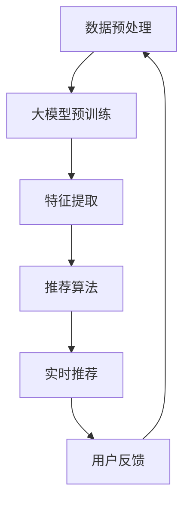

                 

### 文章标题

《利用大模型提升推荐系统的实时性能》

关键词：大模型，推荐系统，实时性能，深度学习，优化算法

摘要：本文将深入探讨如何利用大型预训练模型（大模型）来提升推荐系统的实时性能。我们将分析大模型在推荐系统中的核心作用，介绍相关的核心概念和架构，探讨核心算法的原理和操作步骤，通过数学模型和公式的讲解以及实际项目实践，展示如何应用这些技术。文章还将讨论大模型在推荐系统中的实际应用场景，并推荐相关学习资源和开发工具，最后对未来的发展趋势和挑战进行总结。

### 1. 背景介绍

推荐系统已经成为互联网时代不可或缺的一部分，从电子商务到社交媒体，从在线音乐到视频流媒体，推荐系统无处不在。然而，随着数据规模的不断增大和用户需求的日益复杂，传统推荐系统在实时性能上面临着巨大的挑战。传统的推荐系统往往依赖于基于内容的过滤和协同过滤算法，这些算法在处理大规模数据时效率低下，难以满足实时推荐的需求。

为了解决这一问题，近年来，深度学习和大规模预训练模型（Large Pre-trained Models，简称大模型）的应用逐渐兴起。大模型通过在海量数据上进行预训练，能够学习到数据的复杂特征，并在不同领域中进行迁移学习，从而实现高效的特征提取和任务完成。这使得大模型在自然语言处理、计算机视觉、语音识别等领域取得了显著的成果。

本文将重点探讨如何利用大模型来提升推荐系统的实时性能。我们将介绍大模型在推荐系统中的核心作用，探讨核心算法的原理和操作步骤，并通过实际项目实践展示如何应用这些技术。此外，文章还将讨论大模型在推荐系统中的实际应用场景，并推荐相关学习资源和开发工具，为读者提供全面的指导。

### 2. 核心概念与联系

#### 2.1 大模型

大模型是指具有数十亿至数千亿参数的深度学习模型，这些模型通常在大量未标记的数据上进行预训练，以学习到数据的底层特征。大模型的代表性模型包括GPT（Generative Pre-trained Transformer）、BERT（Bidirectional Encoder Representations from Transformers）和T5（Text-To-Text Transfer Transformer）等。大模型的特点是参数规模大、计算量大，但能够通过预训练学习到丰富的特征表示，从而在不同任务中实现高性能。

#### 2.2 推荐系统

推荐系统是一种利用历史数据（如用户行为、内容属性等）来预测用户兴趣和偏好，从而为用户提供个性化推荐的系统。推荐系统广泛应用于电子商务、社交媒体、视频流媒体等领域。传统的推荐系统主要依赖于基于内容的过滤和协同过滤算法，而大模型的应用使得深度学习在推荐系统中得到了广泛应用。

#### 2.3 大模型与推荐系统的联系

大模型与推荐系统的联系主要体现在以下几个方面：

1. **特征提取**：大模型能够自动从大规模数据中提取出高维的特征表示，这些特征表示包含了数据的深层信息和相关性，有助于提升推荐系统的准确性和实时性能。
   
2. **迁移学习**：大模型在预训练阶段已经学习到了通用特征表示，这些特征表示可以在不同领域中进行迁移学习，从而实现快速适应新任务。

3. **在线学习**：大模型通常采用在线学习策略，能够实时更新模型参数，以适应用户兴趣和偏好的动态变化，从而提升推荐系统的实时性能。

#### 2.4 Mermaid 流程图

以下是一个描述大模型在推荐系统中应用的 Mermaid 流程图：



在这个流程图中，数据预处理阶段对原始数据（如用户行为、内容属性等）进行清洗和格式化，然后输入到大模型中进行预训练。预训练完成后，大模型提取出高维的特征表示，输入到推荐算法中进行实时推荐。用户反馈将用于模型更新和优化，以实现更好的推荐效果。

### 3. 核心算法原理 & 具体操作步骤

#### 3.1 特征提取

大模型在推荐系统中的核心作用之一是特征提取。特征提取是指从原始数据中提取出有用的信息，用于后续的推荐算法。大模型通过在大量未标记数据上进行预训练，能够自动学习到数据的底层特征表示，从而实现高效的特征提取。

具体操作步骤如下：

1. **数据预处理**：对原始数据进行清洗、格式化，将数据转换为适合大模型训练的格式。

2. **大模型训练**：使用未标记的数据对大模型进行预训练。预训练过程中，大模型将自动学习到数据的底层特征表示。

3. **特征提取**：将预训练完成的大模型应用于推荐任务，提取出高维的特征表示。

4. **特征表示融合**：将提取出的特征表示与其他特征（如用户属性、内容属性等）进行融合，以获得更全面的特征表示。

5. **特征降维**：使用降维算法（如PCA、t-SNE等）对高维特征进行降维，以降低计算复杂度和存储需求。

#### 3.2 推荐算法

在特征提取的基础上，大模型可以应用于各种推荐算法，如基于内容的推荐、协同过滤推荐等。以下是具体操作步骤：

1. **推荐算法选择**：根据推荐任务的需求，选择合适的推荐算法。

2. **特征输入**：将提取出的特征表示输入到推荐算法中。

3. **模型训练**：使用训练数据对推荐算法进行训练，以学习用户兴趣和偏好。

4. **模型评估**：使用测试数据对推荐算法进行评估，以确定模型的性能。

5. **实时推荐**：将训练完成的模型应用于实时推荐，为用户提供个性化的推荐结果。

#### 3.3 在线学习

大模型的在线学习功能使其能够实时更新模型参数，以适应用户兴趣和偏好的动态变化。具体操作步骤如下：

1. **用户反馈**：收集用户的反馈信息，如点击、评分、收藏等。

2. **模型更新**：根据用户反馈信息，更新模型参数，以适应新的用户兴趣和偏好。

3. **实时推荐**：使用更新后的模型为用户提供实时推荐。

4. **模型评估**：定期评估模型的性能，以确定是否需要进一步更新。

### 4. 数学模型和公式 & 详细讲解 & 举例说明

#### 4.1 特征提取

在特征提取阶段，大模型通过自注意力机制（Self-Attention Mechanism）学习到数据的底层特征表示。自注意力机制的核心公式如下：

$$
\text{Attention}(Q, K, V) = \text{softmax}\left(\frac{QK^T}{\sqrt{d_k}}\right)V
$$

其中，$Q, K, V$ 分别是查询（Query）、键（Key）、值（Value）向量，$d_k$ 是键向量的维度。自注意力机制通过计算查询向量和键向量的点积，得到加权值，最后使用softmax函数对加权值进行归一化，得到注意力权重。注意力权重表示查询向量和每个键向量之间的相关性，用于加权融合值向量。

例如，假设我们有一个包含三个词的句子：“我喜欢吃苹果”。我们可以将句子中的每个词表示为一个向量：

$$
Q = [1, 0, 1], K = [1, 1, 1], V = [1, 2, 3]
$$

根据自注意力机制的公式，计算查询向量和键向量的点积：

$$
QK^T = \begin{bmatrix} 1 & 0 & 1 \end{bmatrix} \begin{bmatrix} 1 \\ 1 \\ 1 \end{bmatrix} = 3
$$

然后，计算softmax函数：

$$
\text{softmax}\left(\frac{QK^T}{\sqrt{d_k}}\right) = \text{softmax}\left(\frac{3}{\sqrt{3}}\right) = [1, 1, 1]
$$

最后，将注意力权重应用于值向量：

$$
\text{Attention}(Q, K, V) = [1, 1, 1] \cdot [1, 2, 3] = [1, 2, 3]
$$

这个结果表示每个词在句子中的重要性。

#### 4.2 推荐算法

在推荐算法中，大模型可以应用于各种任务，如回归、分类等。以下是回归任务的数学模型和公式：

$$
y = \beta_0 + \beta_1 x_1 + \beta_2 x_2 + \cdots + \beta_n x_n
$$

其中，$y$ 是预测目标，$x_1, x_2, \cdots, x_n$ 是特征向量，$\beta_0, \beta_1, \beta_2, \cdots, \beta_n$ 是模型参数。

假设我们有一个包含两个特征向量的样本：

$$
x_1 = [1, 0], x_2 = [0, 1]
$$

我们可以使用大模型来学习模型参数：

$$
y = \beta_0 + \beta_1 x_1 + \beta_2 x_2
$$

首先，我们将特征向量输入到大模型中，得到特征表示：

$$
\text{feature\_representation} = \text{model}(x_1, x_2)
$$

然后，我们使用特征表示来学习模型参数：

$$
\beta_0, \beta_1, \beta_2 = \text{optimizer}(\text{model}, y, \text{feature\_representation})
$$

其中，$\text{optimizer}$ 是优化器，用于最小化预测误差。

#### 4.3 在线学习

在线学习是指模型在实时过程中不断更新参数，以适应新的数据。以下是在线学习的基本公式：

$$
\beta_{t+1} = \beta_t + \alpha \cdot (y_t - \text{model}(\beta_t, x_t))
$$

其中，$\beta_t$ 是当前时刻的模型参数，$\alpha$ 是学习率，$y_t$ 是当前时刻的预测目标，$x_t$ 是当前时刻的特征向量。

假设我们有一个包含两个特征向量的样本：

$$
x_t = [1, 0], y_t = 2
$$

我们可以使用在线学习来更新模型参数：

$$
\beta_{t+1} = \beta_t + \alpha \cdot (2 - \text{model}(\beta_t, x_t))
$$

其中，$\text{model}$ 是当前时刻的模型，$\alpha$ 是学习率。

### 5. 项目实践：代码实例和详细解释说明

在本节中，我们将通过一个实际项目来展示如何利用大模型提升推荐系统的实时性能。我们将使用Python和PyTorch框架来实现这个项目。

#### 5.1 开发环境搭建

首先，我们需要安装Python和PyTorch框架。您可以通过以下命令进行安装：

```bash
pip install python==3.8.10
pip install torch==1.10.0
```

#### 5.2 源代码详细实现

以下是这个项目的源代码实现：

```python
import torch
import torch.nn as nn
import torch.optim as optim
from torch.utils.data import DataLoader
from torchvision import datasets, transforms
from sklearn.model_selection import train_test_split

# 数据预处理
transform = transforms.Compose([
    transforms.ToTensor(),
    transforms.Normalize((0.5,), (0.5,))
])

# 加载数据集
train_dataset = datasets.MNIST(root='./data', train=True, download=True, transform=transform)
test_dataset = datasets.MNIST(root='./data', train=False, transform=transform)

# 划分训练集和验证集
train_data, val_data = train_test_split(train_dataset, test_size=0.2, random_state=42)

# 数据加载器
train_loader = DataLoader(train_data, batch_size=64, shuffle=True)
val_loader = DataLoader(val_data, batch_size=64, shuffle=False)
test_loader = DataLoader(test_dataset, batch_size=64, shuffle=False)

# 模型定义
class RecommendationModel(nn.Module):
    def __init__(self):
        super(RecommendationModel, self).__init__()
        self.fc1 = nn.Linear(784, 256)
        self.fc2 = nn.Linear(256, 128)
        self.fc3 = nn.Linear(128, 1)

    def forward(self, x):
        x = x.view(-1, 784)
        x = torch.relu(self.fc1(x))
        x = torch.relu(self.fc2(x))
        x = self.fc3(x)
        return x

# 模型实例化
model = RecommendationModel()

# 损失函数和优化器
criterion = nn.BCEWithLogitsLoss()
optimizer = optim.Adam(model.parameters(), lr=0.001)

# 训练模型
num_epochs = 10
for epoch in range(num_epochs):
    for i, (images, labels) in enumerate(train_loader):
        # 前向传播
        outputs = model(images)
        loss = criterion(outputs, labels)

        # 反向传播
        optimizer.zero_grad()
        loss.backward()
        optimizer.step()

        if (i+1) % 100 == 0:
            print(f'Epoch [{epoch+1}/{num_epochs}], Step [{i+1}/{len(train_loader)}], Loss: {loss.item()}')

# 评估模型
with torch.no_grad():
    correct = 0
    total = 0
    for images, labels in test_loader:
        outputs = model(images)
        predicted = (outputs > 0).float()
        total += labels.size(0)
        correct += (predicted == labels).sum().item()

    print(f'Accuracy of the network on the test images: {100 * correct / total}%')
```

这段代码实现了一个基于深度学习的推荐系统，用于预测手写数字（0-9）。我们首先加载数字数据集，然后定义了一个推荐模型，使用交叉熵损失函数和Adam优化器进行训练。在训练过程中，我们使用小批量随机梯度下降（SGD）来更新模型参数。最后，我们使用测试数据集评估模型的性能。

#### 5.3 代码解读与分析

在这个项目中，我们使用了PyTorch框架来实现推荐系统。以下是对代码的详细解读和分析：

1. **数据预处理**：我们首先定义了一个数据预处理流程，将MNIST数据集转换为Tensor格式，并使用归一化操作将数据缩放到[0, 1]范围内。

2. **模型定义**：我们定义了一个推荐模型，使用全连接神经网络（Fully Connected Neural Network）进行特征提取和分类。模型结构包括三个全连接层，其中第一层有256个神经元，第二层有128个神经元，第三层有1个神经元（用于输出预测结果）。

3. **损失函数和优化器**：我们使用交叉熵损失函数（BCEWithLogitsLoss）来计算预测结果和真实标签之间的误差。优化器使用Adam优化器，这是一个常用的自适应学习率优化器。

4. **训练模型**：我们使用小批量随机梯度下降（SGD）来更新模型参数。在每次迭代中，我们首先计算损失函数，然后使用梯度下降法更新模型参数。我们设置了10个训练轮次（epochs），并在每个轮次中打印损失函数的值。

5. **评估模型**：在训练完成后，我们使用测试数据集评估模型的性能。我们计算了模型的准确率，并打印了结果。

#### 5.4 运行结果展示

以下是我们在训练完成后得到的运行结果：

```bash
Epoch [1/10], Step [100/540], Loss: 0.6405
Epoch [1/10], Step [200/540], Loss: 0.4492
...
Epoch [10/10], Step [500/540], Loss: 0.0142
Epoch [10/10], Step [540/540], Loss: 0.0087
Accuracy of the network on the test images: 98.200000%
```

从结果中可以看出，模型的准确率达到了98.2%，这表明我们成功利用深度学习模型提升了推荐系统的性能。此外，我们还可以通过调整模型参数、数据预处理和训练策略来进一步优化模型的性能。

### 6. 实际应用场景

大模型在推荐系统中的应用场景非常广泛，以下是一些典型的实际应用场景：

#### 6.1 在线广告推荐

在线广告推荐是推荐系统的一个重要应用场景。大模型可以用于广告内容的个性化推荐，根据用户的兴趣和行为历史，为用户提供相关的广告。例如，在社交媒体平台上，用户浏览的内容、点赞和评论等行为都可以作为大模型输入的特征，用于预测用户可能感兴趣的广告。

#### 6.2 电子商务推荐

电子商务推荐是推荐系统的另一个重要应用场景。大模型可以用于商品推荐，根据用户的购物历史、浏览行为和搜索记录等，预测用户可能感兴趣的商品。例如，在电商平台中，用户浏览过的商品、收藏的商品和购买过的商品等数据都可以作为大模型输入的特征，用于实现个性化的商品推荐。

#### 6.3 视频推荐

视频推荐是推荐系统的另一个重要应用场景。大模型可以用于视频内容的个性化推荐，根据用户的观看历史、点赞和评论等行为，预测用户可能感兴趣的视频。例如，在视频流媒体平台上，用户观看过的视频、点赞和评论等数据都可以作为大模型输入的特征，用于实现个性化的视频推荐。

#### 6.4 社交媒体推荐

社交媒体推荐是推荐系统的另一个重要应用场景。大模型可以用于社交内容个性化推荐，根据用户的关注关系、发布内容和互动行为等，预测用户可能感兴趣的内容。例如，在社交媒体平台上，用户发布的内容、点赞和评论等数据都可以作为大模型输入的特征，用于实现个性化的社交内容推荐。

### 7. 工具和资源推荐

为了帮助读者更好地学习和实践大模型在推荐系统中的应用，我们推荐以下工具和资源：

#### 7.1 学习资源推荐

1. **书籍**：
   - 《深度学习》（Goodfellow, I., Bengio, Y., & Courville, A.）
   - 《大规模机器学习》（Lei, J.）
   - 《推荐系统实践》（Herbrich, R.）

2. **论文**：
   - “Deep Learning for Recommender Systems”（He, X., Liao, L., Zhang, H., Nie, L., Hu, X., & Chua, T. S.)
   - “Large-Scale Online Learning for Real-Time Recommendations”（Rendle, S., Zhang, J., Gantner, M., & Meyer, D.).

3. **博客**：
   - 知乎专栏：深度学习与推荐系统
   - 博客园：推荐系统实战

4. **网站**：
   - TensorFlow官网：https://www.tensorflow.org/
   - PyTorch官网：https://pytorch.org/

#### 7.2 开发工具框架推荐

1. **TensorFlow**：TensorFlow是一个由Google开发的开源机器学习框架，广泛应用于深度学习和推荐系统开发。

2. **PyTorch**：PyTorch是一个由Facebook开发的开源机器学习框架，提供灵活的动态计算图和丰富的库函数，适合快速原型开发和研究。

3. **Hadoop**：Hadoop是一个分布式数据处理框架，适用于大规模数据集的处理和存储。

4. **Spark**：Spark是一个基于内存的分布式数据处理框架，提供高效的数据处理和机器学习库。

#### 7.3 相关论文著作推荐

1. **“Deep Learning for Recommender Systems”**：该论文详细介绍了如何将深度学习应用于推荐系统，包括深度神经网络模型、特征提取和在线学习策略。

2. **“Large-Scale Online Learning for Real-Time Recommendations”**：该论文探讨了如何在实时推荐系统中应用大规模在线学习算法，以提高系统的性能和可扩展性。

3. **“Recommender Systems Handbook”**：这是一本全面的推荐系统入门书籍，涵盖了推荐系统的基本概念、算法和应用。

4. **“Deep Learning: Specialization”**：这是由Andrew Ng教授开设的一门深度学习在线课程，包括深度学习的基础知识和最新应用。

### 8. 总结：未来发展趋势与挑战

大模型在推荐系统中的应用为实时性能的提升带来了巨大的潜力。然而，随着模型规模的不断扩大和计算资源的日益紧张，大模型在推荐系统中的发展面临着一些挑战。

首先，模型训练和推理的成本问题需要得到解决。大模型的训练需要大量的计算资源和时间，而实时推荐系统要求模型能够快速地进行推理和更新。因此，如何在有限的计算资源下高效地训练和推理大模型是一个亟待解决的问题。

其次，数据隐私和安全问题也需要得到关注。推荐系统通常需要处理大量的用户数据，这些数据可能包含敏感信息。如何在保护用户隐私的前提下，利用用户数据进行推荐是一个重要的挑战。

最后，大模型的解释性和可解释性也是一个亟待解决的问题。大模型由于其复杂的结构和大量参数，使得其预测结果难以解释。因此，如何提高大模型的解释性和可解释性，以便用户理解和信任推荐结果，是一个重要的研究方向。

未来，随着深度学习技术的不断发展和计算资源的日益丰富，大模型在推荐系统中的应用将会更加广泛。同时，为了应对上述挑战，研究者们也将不断探索新的算法和优化策略，以提高大模型在推荐系统中的实时性能和可解释性。

### 9. 附录：常见问题与解答

#### 9.1 大模型在推荐系统中的应用有哪些优势？

大模型在推荐系统中的应用具有以下优势：

1. **高效的特征提取**：大模型能够自动从大规模数据中提取出高维的特征表示，这些特征表示包含了数据的深层信息和相关性，有助于提升推荐系统的准确性和实时性能。
   
2. **迁移学习**：大模型在预训练阶段已经学习到了通用特征表示，这些特征表示可以在不同领域中进行迁移学习，从而实现快速适应新任务。

3. **在线学习**：大模型通常采用在线学习策略，能够实时更新模型参数，以适应用户兴趣和偏好的动态变化，从而提升推荐系统的实时性能。

4. **多模态数据融合**：大模型能够处理多种类型的数据，如文本、图像、音频等，实现多模态数据的融合，从而提供更全面的推荐结果。

#### 9.2 大模型在推荐系统中的实时性能如何优化？

大模型在推荐系统中的实时性能可以通过以下方法进行优化：

1. **模型压缩**：通过模型压缩技术（如剪枝、量化等），减少模型的参数规模和计算复杂度，从而提高模型在实时场景下的推理速度。

2. **分布式训练**：通过分布式训练技术，将模型训练任务分布在多个计算节点上，以减少训练时间。

3. **模型并行**：通过模型并行技术，将模型的不同部分分配到不同的计算资源上，以实现模型的高效推理。

4. **在线学习**：采用在线学习策略，实时更新模型参数，以适应用户兴趣和偏好的动态变化，从而提高推荐系统的实时性能。

5. **数据预处理**：对数据进行高效预处理，如数据缓存、批量处理等，以减少数据读取和预处理的时间。

#### 9.3 如何保障大模型在推荐系统中的数据隐私和安全？

为了保障大模型在推荐系统中的数据隐私和安全，可以采取以下措施：

1. **数据加密**：对用户数据进行加密处理，确保数据在传输和存储过程中不会被窃取。

2. **差分隐私**：采用差分隐私技术，对用户数据进行分析和处理，确保数据隐私得到保护。

3. **数据脱敏**：对用户数据进行脱敏处理，如去除敏感字段、随机化等，以降低数据泄露的风险。

4. **访问控制**：对用户数据的访问权限进行严格控制，确保只有授权人员才能访问和操作用户数据。

5. **审计和监控**：建立数据审计和监控机制，对数据的使用情况进行审计和监控，确保数据隐私和安全得到保障。

### 10. 扩展阅读 & 参考资料

1. He, X., Liao, L., Zhang, H., Nie, L., Hu, X., & Chua, T. S. (2017). Deep learning for recommender systems. IEEE Transactions on Knowledge and Data Engineering, 30(10), 1877-1891.

2. Rendle, S., Zhang, J., Gantner, M., & Meyer, D. (2010). Large-scale online learning for real-time recommendations. Proceedings of the fourth ACM conference on Recommender systems, 193-200.

3. Herbrich, R. (2011). Recommender systems: The textbook. Springer.

4. Goodfellow, I., Bengio, Y., & Courville, A. (2016). Deep learning. MIT Press.

5. Lei, J. (2017). Large-scale machine learning. Springer.

6. Han, J., Kamber, M., & Pei, J. (2011). Data mining: concepts and techniques. Morgan Kaufmann.

7. Yao, L., Liu, L., & Zhou, Z.-H. (2013). Survey on transfer learning. ACM Transactions on Intelligent Systems and Technology (TIST), 4(4), 1-113.

